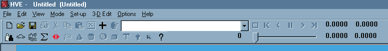
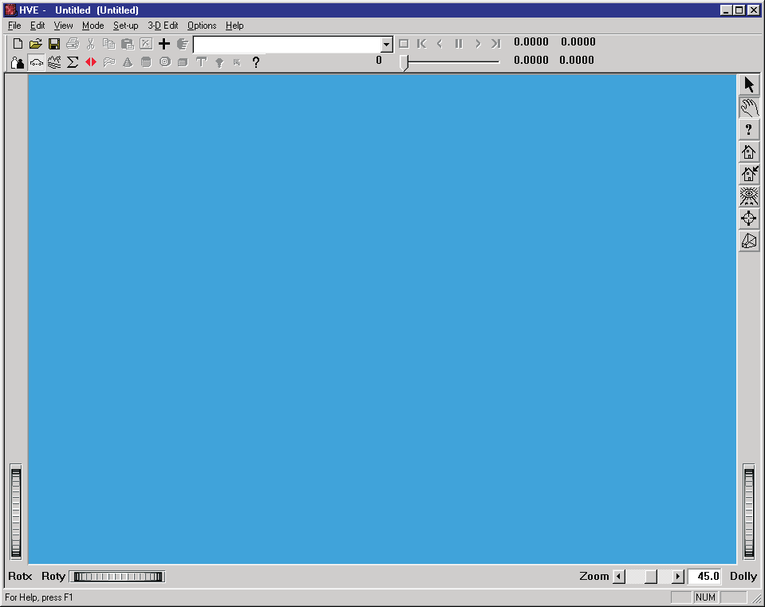
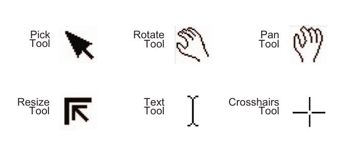
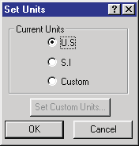

# Using HVE — High-Level Overview

*Updated Markdown edition of the HVE User's Manual (HVE Version 5, Seventh Edition, January 2006), "USING HVE — High-level Overview" (pages Overview-1 through Overview-10). Verified against the current HVE application source (`HVEINV-64/`).*

## Assumptions

HVE was developed for use by engineers and scientists who need a powerful
simulation tool to study vehicle and occupant dynamics. HVE was also developed
for motor vehicle safety researchers and crash reconstructionists who need to
analyze motor vehicle dynamics, including collisions, and show or explain to
others how accidents occur by analyzing and visualizing the sequence of events
surrounding the accident.

An individual using HVE should possess the following background and
experience:

- basic knowledge about computer systems (system maintenance, using a file
  system, installing peripherals, and using a window manager)
- technical knowledge in the area of engineering mechanics (the laws of
  motion) and mathematics (coordinate systems, algebra and trigonometry)
- knowledge about vehicles and how they work (general terminology)
- knowledge about human anatomy (general terminology)
- accident reconstruction experience (gathering and interpreting accident site
  evidence and drawing conclusions about accident causation)

Prior to using HVE, it is assumed the researcher has obtained all the required
human, vehicle and environment data, either by direct inspection or by
indirect means (built-in databases, literature searches, published data or, in
some cases, witness information).

## How To Use This Manual

This is a User's Manual. It explains how to use HVE. It does not directly
teach the subject of human and vehicle dynamics, or explain how to reconstruct
motor vehicle crashes. Further, this manual does not attempt to explain how
specific reconstruction and simulation models work. For these details, consult
the Technical Reference or Physics Manual for the particular reconstruction or
simulation model (see the program manuals in
[`docs/manuals/programs/`](../../programs/README.md)).

Every new user should read the following chapters:

| Topic | Reference |
| --- | --- |
| High-level Overview | (this section) |
| What Is HVE | [Chapter 1](01-what-is-hve.md) |
| How To Use HVE | [Chapter 2](02-how-to-use-hve.md) |
| Human Editor | [Humans](../../07-humans/README.md) |
| Vehicle Editor | [Vehicles](../../02-vehicles/README.md) |
| Environment Editor | [Environment](../../08-environment/README.md) |
| Event Editor | [Events & Driver Controls](../../09-events-driver-controls/README.md) |
| Playback Editor | [Reports & Output](../../11-reports-output/README.md) |
| Video Basics | [Video Output](../09-video-output/README.md) |
| Tutorial | [Tutorial](../11-appendices/32-tutorial.md) |

This information will allow you to begin using HVE right away. However, you
will also need specific information from time to time. In that case, you'll
want to use the other chapters in this manual as a reference.

If you hate reading manuals and you want to get right to work, the following
section may be of some help. However, you should understand that HVE is a very
powerful and complex program, and to get the most out of it, you will need to
refer to this manual.

## Step-by-step Procedure

The following procedure outlines the basic steps for using HVE, along with an
initial chapter reference:

| Step | Reference |
| --- | --- |
| Select Active Humans | Ch. 8 |
| Edit Humans | Ch. 9 |
| Select Active Vehicles | Ch. 10 |
| Edit Vehicles | Ch. 11 |
| Create Environment | Ch. 12 |
| Edit Environment | Ch. 13 |
| Create Events (Select Humans, Vehicles, Calculation Model) | Ch. 15 |
| Set up Events (Assign Position/Velocity, Driver Controls, Damage Profiles, Payload, Collision Pulse, Vehicle Mesh, Wheels, Accelerometers, Contacts, Restraint Systems) | Ch. 16 |
| Execute Events | Ch. 15 |
| Create Report Windows | Ch. 17 |
| Edit Report Windows (Event Sequence) | Ch. 18 |
| Create Playback Window | Ch. 18 |
| Create Numeric and Graphic Reports | Ch. 17 |
| Create a Videotape | Ch. 27 *(updated: current HVE builds create digital video files via File, Video Creator rather than videotape)* |
| Save your work | Ch. 32 |

## Conventions

The following typographical conventions are used in this manual:

- *Italicized Words* — Used for button names or items in a list of items
  available for selection or choosing. Also used in the traditional sense for
  emphasis.
- **'Select'** — To click on an item using the mouse. No action follows a
  selection, but the item is highlighted, indicating it has been selected
  (selection is normally followed by another action).
- **'Choose'** — To click on an item using the mouse. An action, such as
  accepting a current selection or changing an item's attributes, normally
  follows a selection.
- **'Click On'** — Same as 'Select' or 'Choose' (see above).
- **'Double-Click On'** — To click on an item twice in rapid succession.
  Double-clicking on an item causes a selection, followed by the default
  action. For example, double-clicking on a filename in a file selection
  dialog causes the file to be selected and opened or saved (the first click
  selects the item, the second click is the same as pressing *OK*).
- **Bullet Item** — Used for emphasis or a list of important and related
  items.
- Step (➢ in the printed manual) — Used for describing step-by-step
  procedures.

> **NOTE:** Useful or important information — often a tip that may lead to
> improved results.

- **[1.1, 1.2]** — Numbers in brackets designate references found in Appendix
  VI. The first number is the material category (e.g., *Humans*), the second
  number is the reference number.
- `Filename` — Courier (monospace) font is used to designate user-entered
  alphanumeric strings (numbers and text).
- *\<Enter\>* — Press the keyboard key labeled "Enter"; causes user-entered
  alphanumeric information to be read and stored by the program.

## Problem Determination

Engineering Dynamics Corporation has support services available to you in
case you encounter a problem while using HVE. The following are the
preliminary steps you should perform to confirm your problem and assist EDC's
technicians in providing the most efficient support possible:

- **Review The Manual** — Most issues related to usage are covered in the
  manual. If you encounter a problem that is not covered in the manual,
  continue with the following steps.
- **Duplicate The Problem** — If at all possible, try to duplicate the
  problem. This includes carefully retracing your steps to document how the
  problem occurs. It is *very* difficult for EDC's technicians to solve a
  problem unless they can duplicate it for testing on their computer system.
- **Create A Least Bombable Case** — This is EDC's in-house term, meaning
  "strip out all the superfluous details" before you begin testing. It is much
  easier for EDC (and you!) to solve a problem if you first remove irrelevant
  issues. Because it is *your* file, you are much more familiar with unrelated
  issues; otherwise, EDC's technicians will probably end up performing a lot
  of needless testing.
- **Contact EDC Technical Support** — Use e-mail, fax or telephone. Be
  prepared to provide the technical support representative the following
  information:
  - Your user ID number
  - Your System Hardware Profile report (available from EDC)
  - HVE Version Information (available from the HVE Help system)
  - Problem Description
- **Send The Case To EDC For Evaluation** — If the problem cannot be resolved
  by e-mail, fax or telephone, send a case file (see *Least Bombable Case*,
  above) to EDC for evaluation. The turn-around time varies, so discuss your
  requirements with the EDC support technician.

## Window Manager Basics

If you have never used a computer with a window manager (i.e., X Windows or
Microsoft Windows), you should learn some basic skills, such as using the
mouse and choosing commands, before you start using HVE. This section of the
HVE User's Manual provides some basic, yet important, concepts used by window
manager systems.

### Components

A window manager typically includes certain components that perform
consistent and predictable functions routinely required by the user. The
consistent nature of these components is fundamental to good user interface
design, and helps the user learn how to use the application quickly.

HVE includes the following components:

- **Menu Bar** — The Menu Bar provides basic positioning and visibility
  control over an application:
  - Click on the various Menu Bar options (*File, Edit, View, Mode, Set-up,
    3-D Edit, Options* and *Help*) to display HVE's menus.
  - Click on the Menu Bar to display HVE's main level viewers and dialogs
    (useful if they are hidden behind other windows or dialogs).
  - Click on the Dialog Control button to display the Dialog Control menu.
    The selections on this menu allow the user to control the position and
    visibility of the window.
  - Click on the Minimize button to iconify the window.
  - Click on the Maximize button to cause the window to fill the screen.

*Figure 1: HVE's Menu Bar, with File, Edit, View, Mode, Set-up, 3-D Edit, Options and Help menu options.*

- **Viewers** — Viewers are used to display and manipulate 3-D objects
  (humans, vehicles and environments). Viewers are used extensively by HVE,
  and understanding their use is important.

*Figure 2: Typical Viewer. RotX and RotY thumb wheels rotate the object in the viewer about the viewer's X and Y axes, respectively. The Dolly thumb wheel increases or decreases the size of the object by moving the camera away from or towards the object. The Zoom slider increases or decreases the size of the object by reducing or increasing the viewer's included angle. Pick Mode or Manipulate Mode is selected by choosing the arrow or hand, respectively, near the upper right edge of the viewer.*

All Viewers have at least two modes: *Pick Mode* and *Manipulate Mode*. The
current mode is displayed along the right edge of the viewer. Choose *Pick
Mode* to click on icons in the viewer (for example, click on the engine in the
Vehicle Viewer to display the Drivetrain dialog). Choose *Manipulate Mode* to
rotate and pan the object in the viewer.

- To Rotate, click and drag in the viewer using the left mouse button.
- To Pan, click and drag in the viewer using the middle mouse button (on a
  3-button mouse). You may also drag by clicking the left mouse button while
  holding down the \<Shift\> key.
- To Dolly the view, click and drag using the right mouse button. You may
  also dolly by clicking the left mouse button while holding down \<Shift\>
  and \<Ctrl\>.

> **NOTE:** These actions take a little practice, but, once mastered, are
> extremely helpful.

### Mouse

*Figure 3: Mouse Pointer Tools (Pick, Rotate, Pan, Resize, Text, Crosshairs).*

If you've never used a window-based application before, you'll need to know
about using the mouse.

HVE normally uses mouse button 1 (this is normally the left mouse button, but
can be reassigned using the Windows Control Panel). The middle and right mouse
buttons are also used for specific tasks, as described below.

The mouse is used for performing a variety of tasks, such as selecting objects
and entering text. The mouse pointer changes shapes, depending on the type of
action it performs:

- **Pick** — Performs object selection in dialogs and viewers. In dialogs, it
  is used for choosing buttons and list selections. For viewers, it is used
  for choosing icons that display more information about the selected item.
- **Pan** — Used only in viewers, and only when *Manipulate Mode* is selected
  (see Viewers, above). Pan is performed using the middle mouse button, and
  drags the scene across the viewer in the direction of the mouse movement.
  (Left mouse button + \<Shift\> may also be used.)
- **Rotate** — Used only in viewers, and only when *Manipulate Mode* is
  selected (see Viewers, above). Rotate is performed using mouse button 1,
  and causes the scene to be rotated about an axis normal to the center of
  the viewer in the direction of the mouse movement.
- **Resize** — Used for resizing viewers and modeless dialogs (modal dialogs
  cannot be resized; see below). To resize a dialog or viewer, click on the
  corner or along the edge and drag the mouse.
- **Text Cursor** — Used for entering text. After positioning the Text
  Cursor, typed data will appear to the left of the cursor. The Text Cursor
  also responds to the typical editing keys (Backspace, Delete and Insert).
- **Crosshairs** — Used by the 3-D Editor for entering X,Y,Z coordinates.

### Dialogs and Other Interface Components

*Figure 4: Modal Dialog (Set Units) and common dialog components.*

Other components found in the HVE user interface include:

- **Modeless Dialogs** — A modeless dialog is used whenever an action need
  not be completed by pressing *OK*. For example, all Viewers (described
  earlier) are modeless dialogs. A particularly important issue concerning
  modeless dialogs is that items in the Menu Bar, such as *Open File* and
  *Set Camera*, are selectable when a modeless dialog is displayed.
- **Dialog Boxes (Modal Dialogs)** — A modal dialog is used whenever HVE
  requires information to carry out an operation. Modal dialogs always have
  *OK* and *Cancel* pushbuttons, and no other parts of the user interface
  (other than the modal dialog) may be accessed until one of these buttons is
  pressed (hence, the term *modal*). For example, if you try to choose the
  *File* menu while a modal dialog is displayed, HVE will either beep or
  ignore you.
- **OK Pushbuttons** — Click the *OK* pushbutton in any modal dialog to
  accept the entered data and continue with other operations.
- **Cancel Pushbuttons** — Click the *Cancel* pushbutton in any modal dialog
  to ignore any entered data and continue with other operations.
- **Help Pushbuttons** — Click the *Help (?)* pushbutton in any modal dialog
  to display help for the current dialog.
- **List Boxes** — List boxes allow you to select from among two or more
  options. Scroll through the list using the scroll bar, and then choose the
  option by double-clicking it, or by selecting it and pressing *OK*. For
  example, list boxes are used by file selection dialogs to choose the
  current filename.
- **Radio Buttons** — Radio buttons are used to present two or more mutually
  exclusive choices (compare with *Check Boxes*, below). Radio buttons are
  typically diamond-shaped (round on current Windows systems). The current
  choice is darkened and appears to be pushed in (like a radio pushbutton).
- **Check Boxes** — Check boxes are used to enable or disable an option.
  Check boxes are typically square-shaped. Unlike radio buttons, a series of
  check boxes is not mutually exclusive. An option is enabled when it is
  darkened and appears to be pushed in.
- **Command Buttons (Pushbuttons)** — Command buttons cause an action to
  occur, such as resetting values or displaying another dialog box.

> **NOTE:** A Command Pushbutton with an ellipsis (...) always causes another
> dialog box to be displayed.

- **Text Entry Boxes** — Some options require typed information. If the box
  is empty, simply place the mouse cursor in the box (the cursor will turn
  into a text tool) and start typing. If the box already contains
  information, click on the information using the text tool to edit the
  field. To select the information, double-click on the field. Once selected,
  the information you enter will replace the existing information. You may
  also use the Backspace and Delete keys to edit the information.
- **Combo Boxes** — These are sometimes called *Drop-down List boxes*. A
  Combo Box displays a choice of options when you click the arrow next to the
  box. You can also edit the text in the box. Editing causes a new entry to
  be added to the list. Double-click on an entry to delete it from the list.
- **Option Lists** — An option list presents a choice of options when you
  click on the bar near the right end of the button. An option list is very
  similar to a Combo Box, with one major exception: the list cannot be
  edited.
- **Scroll Bars** — Scroll bars are used to navigate through list boxes.
  Click on the arrow at the bottom to move down the list, one item at a time.
  Click on the arrow at the top to move up the list. Click and hold the arrow
  down to automatically scroll through the list. You can also use the thumb
  slider to scroll more rapidly through the list, and click in the thumb
  slider trough to jump to a location in the list approximated by where you
  clicked.
- **Thumb Wheels** — Thumb wheels are used in 3-D viewers to pan, dolly in
  and out, and rotate the current scene (see Figure 2).

<!-- NAV -->

---

← Previous: [HVE User's Manual — Section One: Overview](README.md)  |  [Index](README.md)  |  Next: [Chapter 1 — What Is HVE?](01-what-is-hve.md) →

<!-- /NAV -->
