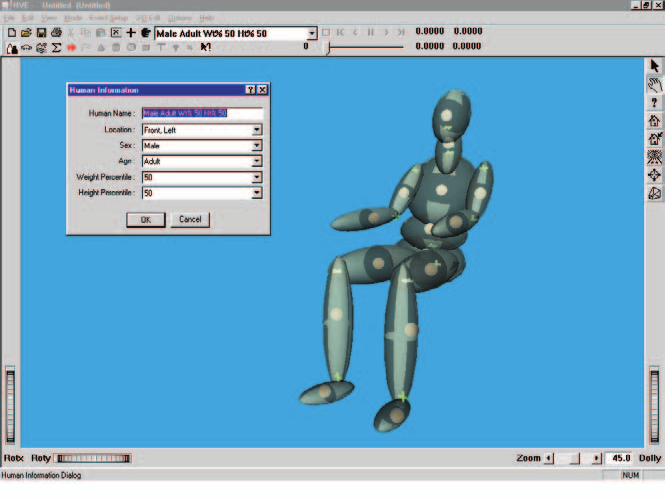
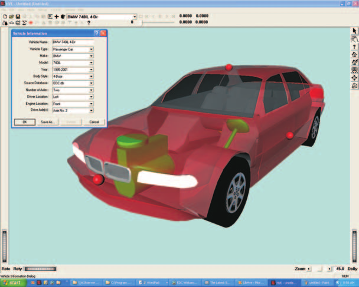
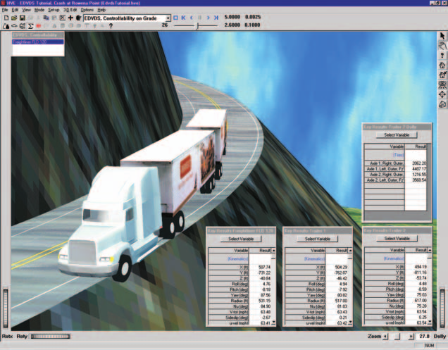
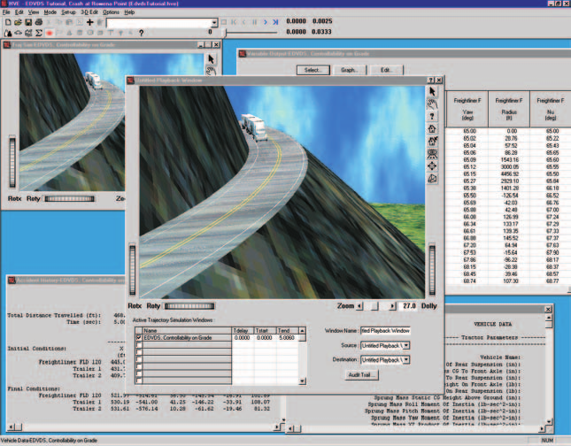

# Chapter 1 — What Is HVE?

*Updated Markdown edition of the HVE User's Manual (HVE Version 5, Seventh
Edition, January 2006), Chapter 1, pages 1-1 through 1-7. Verified against the
current HVE application source (`HVEINV-64/`).*

## Overview

HVE is a computer environment for studying interactions between humans,
vehicles and their environment. HVE stands for
*Human-Vehicle-Environment*, the three factors which influence a crash. HVE
allows the user to create detailed, 3-dimensional models of humans, vehicles
and environments, study their interaction using HVE-compatible reconstruction
and simulation models, and to combine the results of several interactions
involving multiple humans and vehicles into a single coherent sequence.

HVE is essentially five editors:

- **Human Editor** — Used for creating and editing 3-D models of humans
- **Vehicle Editor** — Used for creating and editing 3-D models of vehicles
- **Environment Editor** — Used for creating and editing 3-D models of the
  environment
- **Event Editor** — Used for setting up and executing reconstruction and
  simulation models which study the interactions between the selected humans,
  vehicles and environment
- **Playback Editor** — Used for combining the results of several events into
  a single, coherent sequence which may include multiple humans and vehicles

These five editors are the natural extension of what HVE does. Each editor is
described briefly here in this section. For a complete description, refer to
the individual editor's section in this manual.

## Human Editor

The HVE Human Editor, like each of the five editors, has an information dialog
and a viewer.

*Figure 1-1: HVE Human Editor.*

The HVE Human Editor contains several components common to the other four
editors:

- Add Human pushbutton (*Add New Object* button on the toolbar)
- Active Humans List
- Current Human label
- Delete Human pushbutton (*Delete* button on the toolbar)

The Add Human pushbutton provides access to the HVE Human Databases and
allows the user to add new humans to the current case. Any number of humans
may be created, and, once created, are added to the Active Humans List. At
any given time, the name of one of these humans is displayed in the Current
Human label. This human is currently loaded in the editor and displayed in
the Human Viewer. The current human may be modified using the tools available
in the Human Editor. If the current human is no longer required for study, it
may be deleted using the Delete Human pushbutton.

*See also the code-verified dialog reference:
[Humans](../../07-humans/README.md), in particular
[HumanInfoDlg.md](../../07-humans/HumanInfoDlg.md).*

## Vehicle Editor

*Figure 1-2: HVE Vehicle Editor.*

This editor contains the following components:

- Add Vehicle pushbutton (*Add New Object* button on the toolbar)
- Active Vehicle List
- Current Vehicle label
- Delete Vehicle pushbutton (*Delete* button on the toolbar)

These components work for vehicles exactly like their Human Editor
counterparts.

*See also: [Vehicles](../../02-vehicles/README.md), in particular
[VehicleInfoDlg.md](../../02-vehicles/VehicleInfoDlg.md).*

## Environment Editor

*Figure 1-3: HVE Environment Editor.*

The Environment Editor contains the following components:

- Add Environment pushbutton (*Add New Object* button on the toolbar)
- Current Environment label
- 3-D Editor (select *3-D Edit, Launch 3-D Editor* from the main menu)

These components work for environments exactly like the previously described
editors.

*See also: [Environment](../../08-environment/README.md), in particular
[EnvtInfoDlg.md](../../08-environment/EnvtInfoDlg.md), and the
[3-D Editor reference](../../01-user-interface/3dEditor.md).*

## Event Editor

*Figure 1-4: HVE Event Editor.*

The Event Editor is used to study (i.e., simulate or reconstruct) the
interactions between any of the active humans, vehicles and environment. An
HVE Event is defined by selecting one or more humans and vehicles and a
reconstruction or simulation model.

The Event Editor contains the following components:

- Add Event pushbutton (*Add New Object* button on the toolbar)
- Active Event List
- Current Event label
- Copy Event pushbutton (*Copy* button on the toolbar)
- Delete Event pushbutton (*Delete* button on the toolbar)

These components work for events exactly like the other editors. The Event
Editor also has an Event Controller that allows the user to execute, pause
and review the current event.

*See also: [Events & Driver Controls](../../09-events-driver-controls/README.md), in
particular [EventInfo.md](../../09-events-driver-controls/EventInfo.md) and
[EventSetup.md](../../09-events-driver-controls/EventSetup.md).*

## Playback Editor

The HVE Playback Editor panel contains the following components:

- Add Report Window pushbutton (*Add New Object* button on the toolbar)
- Add Playback Window (added from Playback mode via the Playback Information
  dialog; the former *Options, Add Playback Window* menu path has been removed)
- Delete Window pushbutton (*Delete* button on the toolbar)

These components work for playback windows exactly like the other editors.
The Playback Editor also has a Playback Controller that allows the user to
execute, pause and review trajectory simulation windows.

Unlike the other editors, the Playback Editor may display multiple viewers,
called Report Windows, each containing different output results for a
particular event. These results may be:

- Numeric Reports
- Graphic Reports
- Trajectory Simulations
- Variable Output Tables

The Playback Editor is used to combine several individual trajectory
simulations into a single Playback Window. The Playback Window may display
multiple humans and vehicles from any number of events. This window also
provides a professional video output capability.

*Figure 1-5: HVE Playback Editor, illustrating several types of windows and viewers.*

For detailed information about each of these five HVE editors, refer to the
individual editor's section in this manual.

*See also: [Reports & Output](../../11-reports-output/README.md) and
[Playback Controls](../../01-user-interface/PlayBackControls.md).*

<!-- NAV -->

---

← Previous: [Using HVE — High-Level Overview](00-using-hve.md)  |  [Index](README.md)  |  Next: [Chapter 2 — How To Use HVE](02-how-to-use-hve.md) →

<!-- /NAV -->
