# Chapter 2 — How To Use HVE

*Updated Markdown edition of the HVE User's Manual (HVE Version 5, Seventh
Edition, January 2006), Chapter 2, pages 2-1 through 2-104. Verified against
the current HVE application source (`HVEINV-64/HVERSNT.rc` and related
dialogs). Because of its length, Chapter 2 is split into three parts:*

| Part | Contents |
| --- | --- |
| [Part A (this file)](#getting-started) | Getting Started, HVE Menu Bar, HVE Modes, Starting a New Case, Creating Humans/Vehicles/Environments, 3-D Editor, Creating Events, Setting Up Events, Executing Events, Choosing Options |
| [Part B — 02b](02b-how-to-use-hve.md) | Creating Report and Playback Windows, Playback Controller, Audit Trail, Creating Case Files, Creating Databases, Printing Results, Setting the View (cameras, overlays) |
| [Part C — 02c](02c-how-to-use-hve.md) | Selecting User Options (Key Results, show toggles, Grid, Units, Render, Simulation Controls, Playback, Calculation Options, DyMESH, Get Surface Info, Preferences), Getting Help, Video Interface |

We think you will find HVE easy to use. All the operations are simple and
intuitive. You'll find yourself thinking more about the *objects* in your
study (*humans, vehicles* and *environments*) and much less about *data*
(weight, wheelbase and other details).

Using HVE involves performing the following steps:

- Use the HVE Human Editor to select and create all the humans involved in
  your study.
- Use the HVE Vehicle Editor to select and create all the vehicles involved
  in your study.
- Use the HVE Environment Editor to select and create the environment
  involved in your study.
- Use the HVE Event Editor to set up and execute reconstruction and
  simulation models which analyze the interactions between the selected
  humans, vehicles and environment.
- Use the HVE Playback Editor to combine multiple events into a single
  coherent sequence involving multiple humans and vehicles. You can also use
  the Playback Editor to create printed, plotted and video output showing and
  documenting the events.

## Getting Started

To start HVE, use the Start, Programs, HVE cascade menu to select the HVE
program icon, just as you would start any other program on your computer.
After starting HVE, the current Editor will be displayed, along with the menu
bar.

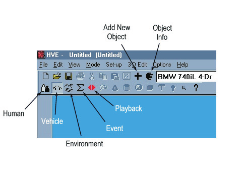
*Figure 2-1: HVE, ready to begin. The HVE Menu Bar and current editor (in this case, the Vehicle Editor) are displayed. The Mode pushbuttons on the toolbar allow the user to select the current editor.*

## HVE Menu Bar

The HVE Menu Bar allows the user to select from the following pull-down
menus:

- **File Menu** — Provides access to file handling, printing and video output
  information.
- **Edit Menu** — Provides access to editing functions used in various
  portions of HVE, such as the 3-D Editor.
- **View Menu** — Provides access to various viewing options.
- **Mode Menu** — Provides access to select the current editor, and to add
  new or previous objects to the editor.
- **Set-up Menu** — Provides access to event set-up options.
- **3-D Edit Menu** — Provides access to 3-D Editor functionality.
- **Options Menu** — Provides access to various user options and preferences.
- **Help Menu** — Provides access to HVE's extensive on-line help system, HVE
  version information and also EDC Technical Support information.

Each of these menus provides access to important user information and options
which apply to all HVE operations. Refer to the Menu Reference section of this
manual for detailed information about each option available in the HVE Menu
Bar.

*(updated: the current menu resource, `IDR_MAINFRAME` in
`HVEINV-64/HVERSNT.rc`, confirms this menu bar: File, Edit, View, Mode,
Set-up, 3-D Edit, Options, Help. The current File menu includes New, Open,
Save, Save As, Export Preview Case, Print, Print All, Video Creator, Export,
FBX Export, recent files and Exit. The Help menu now also includes a User
Manuals submenu — HVE, EDCRASH, EDGEN, EDHIS, EDSMAC, EDSMAC4, EDVDS, EDSVS,
EDVSM, EDVTS, SIMON, Damage Studio, GATB and ReadDataFile — plus Online
Licensing options for registering a User ID code and refreshing licenses.)*

## HVE Modes

HVE's functional design is based on the following five modes:

- **Human Mode** — Provides access to the Human Editor
- **Vehicle Mode** — Provides access to the Vehicle Editor
- **Environment Mode** — Provides access to the Environment Editor
- **Event Mode** — Provides access to the Event Editor
- **Playback Mode** — Provides access to the Playback Editor

Each of these modes has an editor used for creating and studying the objects
(humans, vehicles and environment) of interest. The desired mode is selected
by pressing the desired mode button at the top of the current editor (see
Figure 2-1).

*(updated: modes may also be selected from the Mode menu, which assigns the
keyboard shortcuts Ctrl+1 (Human), Ctrl+2 (Vehicle), Ctrl+3 (Environment),
Ctrl+4 (Event) and Ctrl+5 (Playback), and provides Add... New/Previous and
Information... (Ctrl+I) options.)*

## Starting A New Case

A *case* is a file containing the results of an HVE session. If you didn't
open a case when you started HVE, you can do so using the *Open Case* option
found in the File menu. The Open Case option displays the File Selection
dialog which displays all your previously run case filenames. Simply
double-click on the desired filename and the case file will be loaded.

If you choose not to open a case file, you will begin a new case.

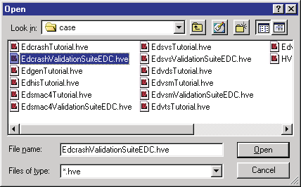
*Figure 2-2: The Open Case File Selection dialog allows the user to open previously saved cases (`*.hve` files).*

## Creating Humans, Vehicles and Environments

The first step is to create the humans, vehicles and environment to be
studied.

### Creating Humans

Humans are created and edited using the HVE Human Editor. To create the
required humans:

1. Click on the Human Mode button on the toolbar. This puts HVE in Human
   Mode.
2. Click on *Add New Object* to display the Human Information dialog (see
   Figure 2-3).
3. Choose the human location (any of nine occupant positions or pedestrian).
4. Choose the human according to *Sex*, *Age*, *Weight* percentile and
   *Height* percentile.
5. Choose *OK*.

The selected human is now displayed in the Human Viewer. At this point you
may choose to edit the current human's properties (refer to the Human Editor
section of this manual for details; see also the code-verified
[Human Information dialog reference](../../07-humans/HumanInfoDlg.md)). The
above steps are repeated for each human to be included in the study.

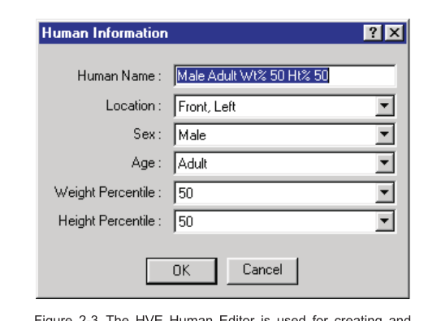
*Figure 2-3: The HVE Human Editor and Human Information dialog (Human Name, Location, Sex, Age, Weight Percentile, Height Percentile).*

### Creating Vehicles

Vehicles are created and edited using the HVE Vehicle Editor. To create the
required vehicles:

1. Click on the Vehicle Mode button on the toolbar.
2. Click on *Add New Object* to display the Vehicle Information dialog (see
   Figure 2-4).
3. Choose the vehicle *Type, Make, Model, Year* and *Body Style*.
4. If desired, edit the *Number of Axles, Driver Location, Engine Location*
   and *Drive Axle*.
5. Choose *OK*.

The selected vehicle is now displayed in the Vehicle Viewer. At this point
you may choose to edit the current vehicle's properties (refer to the Vehicle
Editor section of this manual for details; see also the
[Vehicle Information dialog reference](../../02-vehicles/VehicleInfoDlg.md)).

Repeat the above steps for each vehicle to be included in the study.

> **NOTE:** A multi-vehicle train (e.g., a tractor-trailer) is created by
> creating its individual vehicle units, one at a time, using the Vehicle
> Editor.

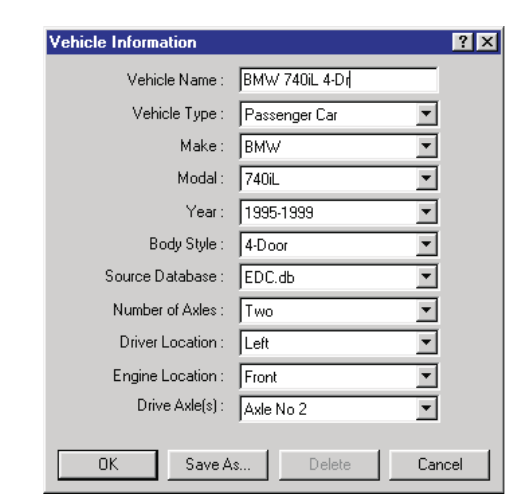
*Figure 2-4: The HVE Vehicle Editor and Vehicle Information dialog (Vehicle Name, Vehicle Type, Make, Model, Year, Body Style, Source Database, Number of Axles, Driver Location, Engine Location, Drive Axle(s)).*

### Creating Environments

To create the environment:

1. Click on the Environment Mode button on the toolbar.
2. Click on *Add New Object* to display the Environment Information dialog.
3. Select the *City, State* and *Country* using the Location Database.
4. Enter the *Time* and *Date* of the Event.
5. Enter the *Angle of the X axis* (relative to North) of the earth-fixed
   coordinate system used in your study.
6. Enter the *Wind Speed* and *Direction*.
7. Enter the *Barometric Pressure* and *Ambient Temperature*.
8. Enter the *Gravitational Constant*.

> **NOTE:** The latitude, longitude and hours from GMT, along with the time
> and date of the accident and angle of the X axis, are used to position the
> sun in your environment.

9. Choose *Sky Attributes* to display the Sky Attributes dialog. Enter or
   modify the atmospheric visibility conditions (*Sky Color, Fog Type,
   Maximum Visibility* and *Fog Color*).
10. Choose *Open* to load an existing environment 3-D geometry file and/or a
    scanned photograph of the environment.

> **NOTE:** The File Selection dialog includes an option list allowing the
> user to select the file format (h3d, dxf, rgb, etc.) and the desired input
> file. Where necessary, HVE converts the selected file into the HVE file
> format.

> **NOTE:** The Options pushbutton allows the user to scale and rotate the
> environment model as required for HVE's SAE coordinate system.

11. Choose *OK*.

The environment is now displayed in the Environment Viewer.

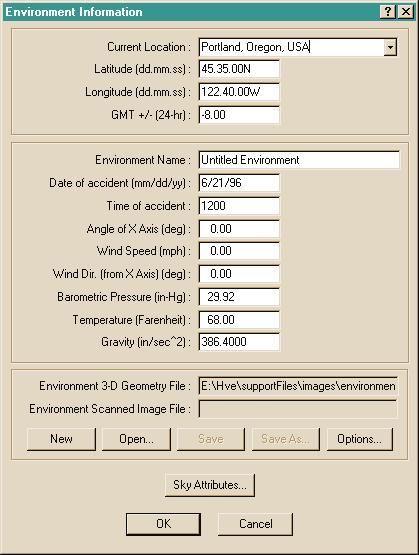
*Figure 2-5: The Environment Information dialog (Current Location, Latitude, Longitude, GMT offset, Environment Name, Date and Time of accident, Angle of X Axis, Wind Speed and Direction, Barometric Pressure, Temperature, Gravity, Environment 3-D Geometry File, Environment Scanned Image File, Sky Attributes).*

*See also: [Environment Information dialog
reference](../../08-environment/EnvtInfoDlg.md) and
[Sky Attributes dialog](../../01-user-interface/SkyAttrDlg.md).*

### 3-D Editor

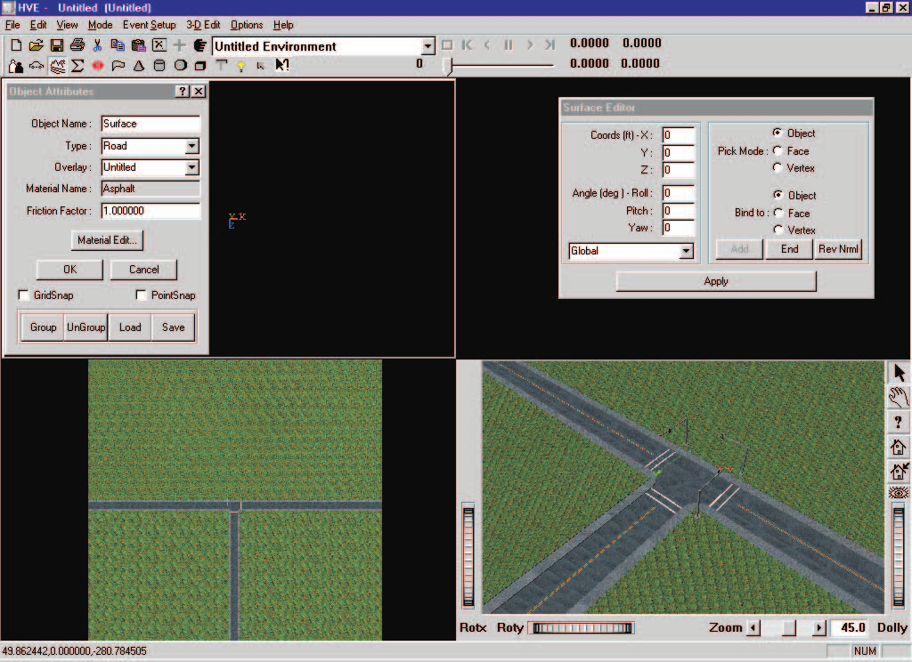
*Figure 2-6: HVE 3-D Editor, used for creating and editing 3-D geometry data used to visualize the humans, vehicles and environment for the current case. The 3-D Editor has four viewers (Perspective plus X-Y, Y-Z and X-Z).*

The 3-D Editor is a 3-D modeling tool which may be used to create and edit
the 3-D geometry data used for visualizing environments.

The 3-D Editor is started in Environment Mode by selecting the 3-D Edit menu
option, then selecting *Launch 3-D Editor*. The current object is loaded for
editing. In this case, it has the current environment loaded and ready for
editing its visual and surface friction properties.

For more information about the 3-D Editor, refer to the *3-D Editor* tab in
the *Tools* section of this manual (see also the code-verified
[3-D Editor reference](../../01-user-interface/3dEditor.md)).

*(updated: the current 3-D Edit menu contains Launch 3-D Editor (Ctrl+L),
Material Color..., Material Texture..., a Manipulators submenu (Direct, Jack,
Trackball, Centerball, Handle Box, Transform Box, Tab Box), Object
Attributes..., Viewer, and Close 3-D Editor.)*

## Creating Events

An HVE event is a single reconstruction or simulation analysis of one or more
humans and vehicles in the current environment. Event Mode is where all the
action (or *interaction*) is. The calculation model is actually executed in
Event Mode.

To create an HVE event:

1. Click on the Event Mode button on the toolbar. The Event Editor is
   displayed.
2. Click on *Add New Object* to display the Event Information dialog (see
   Figure 2-7).
3. Select the human and vehicle objects and the calculation model (see
   below).
4. Choose *Calculation Options* to display and edit any program options.
5. Choose *OK*.

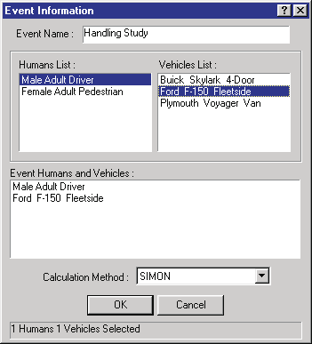
*Figure 2-7: The Event Information dialog — Event Name, Humans List, Vehicles List, Event Humans and Vehicles, Calculation Method.*

*See also: [Event Information](../../09-events-driver-controls/EventInfo.md)
and the per-model [Calculation Options](../../10-calculation-options/README.md)
references.*

### Choosing A Calculation Model

The choice of calculation models is dependent upon the needs of the study.
Normally, reconstruction models are executed first, because they provide part
or all of the initial conditions required to execute simulations.

#### Reconstruction Models

According to SAE [6.4], a *reconstruction* is the determination of initial
conditions (usually impact speed) based on post-accident evidence. To execute
an HVE reconstruction program in the HVE Event Editor, the user normally
supplies (for each vehicle) some or all of the following information during
Event Mode:

- Pre-impact position
- Impact position
- Path positions between impact and rest
- Rest position
- Vehicle damage

> **NOTE:** The actual requirements are dependent on the particular
> reconstruction method.

The reconstruction calculations usually provide some or all of the following
results:

- Initial Velocity
- Velocity at Begin Perception
- Velocity at Begin Reaction
- Velocity at Begin Braking
- Velocity at Impact
- Velocity at Separation
- Final Velocity
- Delta-V during Impact
- Energy absorbed during Impact
- PDOF during Impact

#### Simulation Models

According to SAE [6.4], a *simulation* is the prediction of human or vehicle
paths and damage based on initial conditions (position and velocity). To
execute an HVE simulation program in the HVE Event Editor, you will usually
supply (for each human and/or vehicle) some or all of the following
information during Event Mode:

- Initial position and velocity
- Driver Controls (for vehicles)
- Collision Pulse (for vehicles)
- Mesh (for vehicles)
- Payload (for vehicles)
- Wheels (for vehicles)
- Accelerometers (for vehicles)
- Restraints (for occupant simulation)
- Contacts (for occupant and pedestrian simulation)

> **NOTE:** The actual requirements are dependent on the particular
> simulation method.

The simulation calculations usually provide some or all of the following
results (reported as a function of time):

- Sprung Mass Kinematics (position, velocity and acceleration)
- Sprung Mass Kinetics (forces)
- Accelerometers (velocity and acceleration)
- Damage (vehicle exterior crush geometry and force)
- Tire Conditions (contact patch location, forces, slip angles, skidding)
- Wheel Conditions (position and orientation, forces and moments at wheels
  and suspensions)
- Connections (articulation angles, forces and moments)
- Driver Controls (throttle, braking, steering and gear selection, HVE Driver
  Path Follower results)
- Contact Surface Data (force, deflection)
- Belt Data (stretch and tension)
- Airbag Data (pressure, radius, force)

#### User-written Reconstruction and Simulation Models

HVE has an open architecture which allows users to write their own
reconstruction and simulation models. Users are urged to consider this
feature, especially when existing models don't quite consider all the issues.
Refer to Appendix VII (HVE Developer's Toolkit Overview) and references 1.2
and 1.3 for specific instructions on how to produce your own reconstruction
and simulation models.

## Setting Up Events

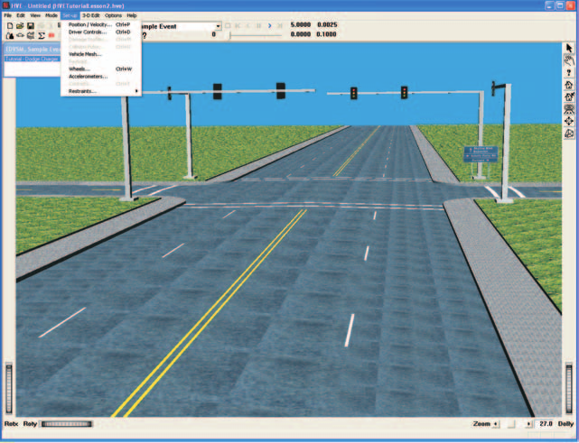
*Figure 2-8: The Set-up Menu allows the user to choose from the available Event Set-up options.*

Events are *set up* after the objects (humans and vehicles) and calculation
method are selected. Event set-up involves the following steps:

1. Assign the required positions and velocities for each object
2. Assign the desired driver controls (throttle, braking, steering and gear
   selection tables for simulations; wheel data for reconstructions)
3. Assign any damage profile data
4. Assign any payload data
5. Assign any collision pulse
6. Assign any mesh data (tessellation, inter-vehicle friction)
7. Assign any wheel data (tire blow-out, wheel displacement, brake
   adjustment)
8. Assign any accelerometer positions
9. Assign restraints (belts and airbag usage information) for occupant
   simulations
10. Assign contacts (allowable interactions between human ellipsoids and
    vehicle contact surfaces) for occupant and pedestrian simulation

Event setup options are available using the Set-up Menu (see Figure 2-8).

*(updated: the current Set-up menu contains Position/Velocity... (Ctrl+P),
Driver Controls... (Ctrl+D), Damage Profiles... (Ctrl+M), Collision Pulse...
(Ctrl+U), Vehicle Mesh..., Payload..., Wheels... (Ctrl+W),
Accelerometers..., Contacts... (Ctrl+T), a Restraints... submenu with
Airbags... (Ctrl+G) and Belts... (Ctrl+B), plus Signals and Notes items that
postdate the 2006 manual.)*

### Assigning Positions and Velocities

Every simulation or reconstruction model requires positioning of humans
and/or vehicles within the environment. Simulations and some reconstruction
models also require that velocities be entered. Positioning is always the
first step during event set-up.

HVE allows the user to position humans and vehicles within the environment
using direct manipulation of the object, or by entering position coordinates
and orientations in the Position/Velocity dialog (see Figure 2-9).

Using direct manipulation, first select the object within the Event Viewer,
then *drag and drop* it at the desired location. Roll, pitch and yaw
manipulators allow rotation of the human or vehicle about its coordinate axis
system to provide the proper orientation (see Figures 2-9 and 2-10 for
vehicles and humans, respectively).

If the actual coordinates and orientation of the selected human or vehicle
are known, it is easiest to simply enter them directly in the
Position/Velocity dialog.

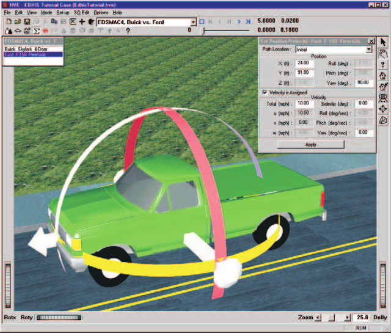
*Figure 2-9: Vehicles are positioned using the translation and rotation manipulators, or by entering data directly into the Position/Velocity dialog.*

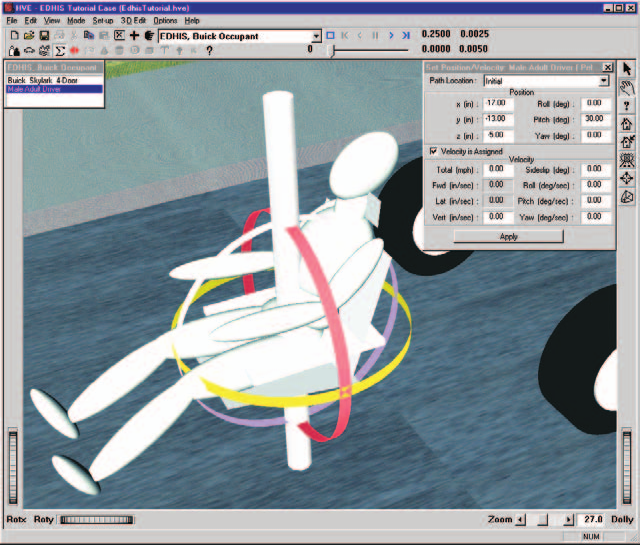
*Figure 2-10: Humans are positioned, like vehicles, using the translation and rotation manipulators, or by entering data directly into the Position/Velocity dialog.*

> **NOTE:** For occupant simulations, the human is positioned relative to the
> vehicle. Therefore, the vehicle should be positioned first.

HVE allows the user to enter positions and velocities for the following path
locations:

- Initial Position
- Begin Perception
- Begin Braking
- Impact
- Separation
- Point On Curve
- End Of Rotation
- Final/Rest

The positions and velocities provided by the user are dependent upon the
requirements of the selected model. Simulations *require* only initial
positions and velocities. Reconstructions normally *require* impact and rest
positions.

*See also: [Position/Velocity dialog
reference](../../09-events-driver-controls/PosVelDlg.md).*

#### Target Positions

The user may enter human and vehicle positions even though they are not
actually used by the simulation or reconstruction. These are called *target
positions*, and appear as translucent objects. Target positions provide
visual feedback to the user regarding the desired path of the human or
vehicle. If a simulated object passes through the target, the user can tell
very quickly it is on the correct path. By observing that the simulated
object misses the target, the user can make the necessary adjustments and
rerun the simulation.

Target positions are also used by the HVE Path Follower. In this case, the
user-entered target positions are used to define a path. Using the HVE Path
Follower, simulation models determine the driver steering, braking and
throttle inputs required to follow the path. The HVE Path Follower is further
described in Chapters 4 and 16 of the legacy manual.

### Assigning Driver Controls

The HVE vehicle model is controlled by driver inputs. The available driver
controls are:

- Throttle Table
- Brake Table
- Steering Table
- Gear Selection Table
- HVE Path Follower
- Wheel Data

Steering, Throttle, Brake, Path Follower, and Gear Selection driver controls
are available for simulation models; only Wheel Data controls are available
for reconstruction models.

To supply a vehicle's driver controls, you must first select a vehicle, then
choose *Driver Controls* from the Set-up menu *(updated: the 2006 manual says
"from the Edit menu" here, but driver controls are on the Set-up menu —
Set-up, Driver Controls..., Ctrl+D)*. There are two ways to select a vehicle:

- Choosing from the list of vehicles in the Event Editor
- Clicking on the vehicle in the Event Viewer (this also displays its current
  Position/Velocity dialog)

> **NOTE:** Because trailers do not appear in the list of vehicles in the
> Event Editor, to apply Driver Controls to a trailer, you must click on the
> trailer.

After the vehicle is selected, use the Driver Controls option to choose the
desired method. The various methods are described below. *(See also the
code-verified [Driver Controls
reference](../../09-events-driver-controls/DriverControls.md).)*

**Throttle Table** — The Throttle Table allows you to provide tractive effort
at each drive wheel on the selected vehicle. Data are entered using a table.
Three options are available:

- *Percent Wide-Open-Throttle* vs time
- *Percent Available Friction* vs time
- *Tractive Effort* vs time

*Figure 2-11: The Throttle Table allows the user to enter a table of tractive effort vs time. The Percent Wide-Open-Throttle option is shown.*

The availability of these options is dependent upon the selected calculation
model. For example, if the simulation is not capable of using the HVE
Vehicle's engine model, the *Percent of Wide-open Throttle* option is not
available.

**Brake Table** — The Brake Table allows you to provide longitudinal braking
force at each wheel of the selected vehicle. Data are entered using a table.
Three options are available:

- *Pedal Force* vs time
- *Percent Available Friction* vs time
- *Braking Force* vs time

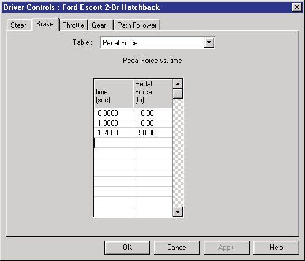
*Figure 2-12: The Brake Table allows the user to enter a table of braking force vs time. The Pedal Force option is shown.*

Again, the availability of these options is dependent upon the selected
calculation model. For example, if the simulation is not capable of using the
HVE Vehicle's brake system model, the *Pedal Force* option is not available.

**Steer Table** — The Steer Table allows you to provide steer angles at each
steerable axle for the selected vehicle. Data are entered using a table. Two
options are available:

- *Steering Wheel Angle* vs time
- *Tire Angle* vs time

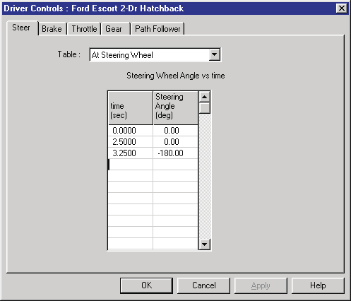
*Figure 2-13: The Steer Table allows the user to enter a table of steer angles vs time for each steerable axle. The At Steering Wheel option is shown.*

**Gear Table** — The Gear Table allows the user to provide the current gear
selection for both the transmission and differential (differential gear
selection only applies if the selected vehicle's differential has more than
one gear ratio). Data are entered using a special table, as shown in Figure
2-14.

The Gear Table option is used for backing a vehicle, as well as changing its
forward gear selection. The Gear Table option is available only if the
current simulation model can use the gear information (some simulation models
do not allow tractive effort in reverse). Thus, use of the Gear Table also
requires that the simulation uses the HVE Engine Model.

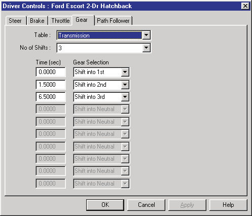
*Figure 2-14: The Gear Table allows the user to enter a table of gear selections vs time. This table is only available for simulations which include an engine model, and requires that the current Throttle Table uses the Percent Wide-open Throttle method.*

**HVE Path Follower** — The HVE Path Follower dialog allows the user to
define a 3-D vehicle path using target positions. Using this path, the
simulation model determines the steering, throttle and braking driver inputs
required to cause the vehicle to follow the path.

The HVE Path Follower dialog includes options for path following by
*Required Steering* or *Required Torque*. If target velocities are entered,
the *Speed Follower* option is enabled. Finally, a *Driver Filter* option is
available that allows simulation of the effects of driver physical
characteristics on the ability to follow a path.

The HVE Path Follower dialog is shown in Figure 2-15. A detailed description
of the HVE Path Follower is provided in Chapter 4 (Event Set-up) and Chapter
16 (HVE Event Model) of the legacy manual.

> **NOTE:** The Torque Method and Speed Follower options were not enabled as
> of the 2006 manual.

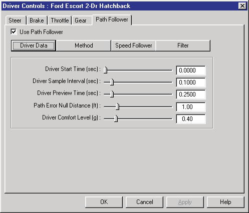
*Figure 2-15: The HVE Path Follower dialog — Driver Data page (Driver Start Time, Driver Sample Interval, Driver Preview Time, Path Error Null Distance, Driver Comfort Level).*

**Wheel Data** — The Wheel Data dialog is used for reconstruction models. It
differs from the other driver control tables in that its values are fixed,
rather than time-dependent, because reconstructions do not calculate in the
time domain.

The Wheel Data dialog allows the user to enter the wheel lock-up (sometimes
called *percent of available friction*) and steer angle for each wheel on the
selected vehicle. You can also enter the total lock-up for pre-impact
braking, and click on a check box to select a different calculation method
for handling rotating and spinning vehicles between impact and rest
(*Rot/Lat Skidding*). A typical Wheel Data dialog is shown in Figure 2-16.

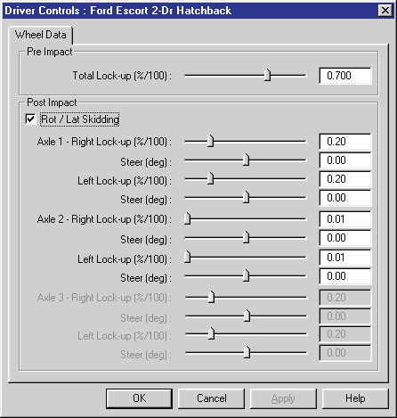
*Figure 2-16: The Wheel Data dialog is used by reconstruction models that use constant wheel forces and steer angles.*

### Assigning a Vehicle Damage Profile

You can assign a damage profile to the selected vehicle. To supply a damage
profile, you must first select a vehicle, then choose *Damage Profiles* from
the Set-up menu. (This option will be unavailable if the selected
reconstruction or simulation model does not allow user-entered damage
profiles.) A typical Damage Profiles dialog is shown in Figure 2-17.

The damage profile defines the location and character of vehicle damage by
allowing the user to specify:

- the width of the damaged surface
- the depth of crush at up to 10 equally-spaced intervals along the damage
  width
- the location of the center of damage relative to the vehicle's CG
- the principal direction of force (PDOF)

This information is initially provided in the form of a Collision Deformation
Classification, or CDC (see SAE J224 [6.3]) which HVE uses to assign the
default damage profile. The user can then over-ride the default values by
replacing the assigned data (see Figure 2-17).

HVE uses the damage profile to calculate and display the Equivalent Energy
Speed, or EES [2.26, 6.4]. The default value is set equal to the Total
Delta-V (see below). The user may over-ride the default EES by clicking on
the *EES* radio button and entering the desired value.

#### Damage Results

The Damage Data dialog uses the damage profile and stiffness coefficients to
calculate the following results:

- **Delta-V** — Change in velocity during the collision. Total, forward and
  lateral components are displayed.
- **Damage Energy** — Unconserved energy during the collision.
- **Peak Force** — The peak force during the collision.

> **NOTE:** The Damage Profiles dialog calculates the delta-V for a vehicle
> striking a barrier, **not** another vehicle! To determine the delta-V
> during impact with another vehicle requires information about the other
> vehicle. Use EDCRASH or a similar program for such an analysis.

> **NOTE:** Actually, EDCRASH performs the above analysis on both vehicles,
> then apportions the delta-V according to the total damage energy and
> respective vehicle masses.

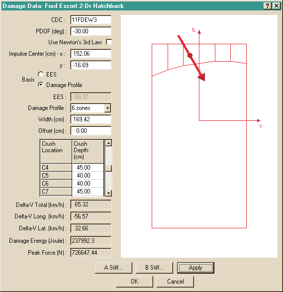
*Figure 2-17: The Damage Data dialog — CDC, PDOF, Use Newton's 3rd Law, Impulse Center, EES/Damage Profile basis, Damage Profile zones, Width, Offset, crush locations and depths, Delta-V Total/Long./Lat., Damage Energy, Peak Force, A Stiff... and B Stiff... buttons.*

*See also: [Damage Data reference](../../11-reports-output/DamageData.md).*

#### Stiffness Coefficients

The selected vehicle's stiffness coefficients are normally used for
damage-based calculation methods. Choosing *A Stiffness* or *B Stiffness*
displays a dialog showing the current stiffness values for each crush zone.
These coefficients are initially assigned by the Vehicle Editor when the
vehicle is created. These original coefficients may be replaced by
user-entered values for each crush zone (see Figure 2-18).

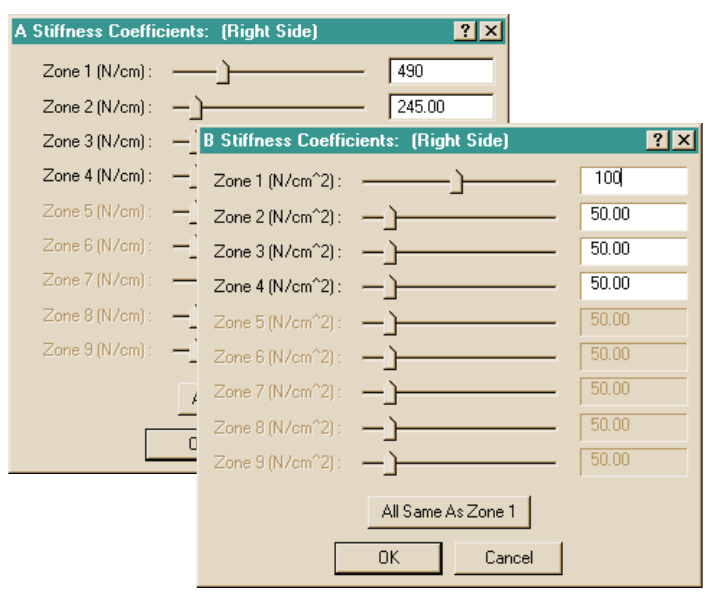
*Figure 2-18: A and B Stiffness Coefficients dialogs allow the user to enter stiffness coefficients for the selected vehicle, per crush zone, with an "All Same As Zone 1" shortcut.*

*See also: [A Stiffness](../../02-vehicles/AStiffDlg.md) and
[B Stiffness](../../02-vehicles/BStiffDlg.md) dialog references.*

### Assigning a Collision Pulse

A collision pulse is the motion vs time history during impact that defines
the vehicle's motion during impact. If the current simulation model is an
occupant simulation, the user must supply a collision pulse to the selected
vehicle. Also, some vehicle simulations can include a collision pulse.

To supply a collision pulse, first select a vehicle, then choose *Collision
Pulse* from the Set-up menu. (This option will be unavailable if the selected
reconstruction or simulation model does not use a collision pulse.)

The collision pulse is provided in the form of a table of linear and angular
motion inputs (e.g., accelerations) at specified times (see Figure 2-19).
Because the collision pulse normally lasts 100 to 200 milliseconds, the
timestep is usually very small, on the order of 0.001 to 0.01 seconds.

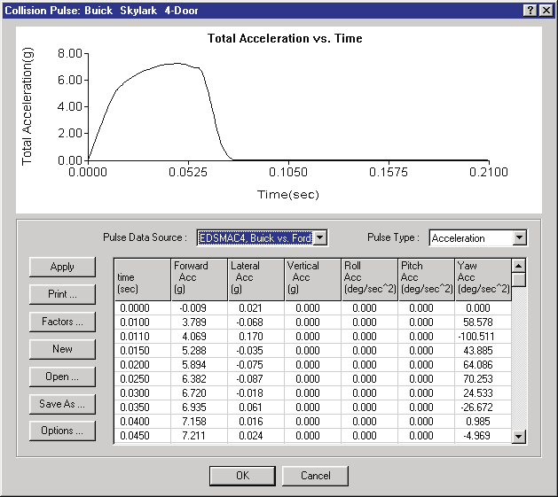
*Figure 2-19: The Collision Pulse dialog — Total Acceleration vs. Time graph, Pulse Data Source and Pulse Type option lists, table of Forward/Lateral/Vertical/Roll/Pitch/Yaw accelerations vs time, with Apply, Print, Factors, New, Open, Save As and Options buttons.*

#### Pulse Data Source

The collision pulse data may be assigned in a user-entered table or the data
may be transferred automatically from a previously run event (e.g., EDSMAC4).
The user determines the source of the collision pulse data using the Pulse
Data Source option list.

**User-entered Collision Pulse** — A user-entered collision pulse is defined
by direct table entry of time and associated accelerations. Collision pulses
are actually stored in a file; the default collision pulse filename is
'Untitled'. The current table may be saved and opened for use in another
event or case. Save and Open buttons in the Collision Pulse dialog are used
for this purpose.

**Event-defined Collision Pulse** — HVE keeps track of all previously
executed events that produced a collision pulse. If the selected vehicle was
used in one or more of those events, those event names will be accessible by
clicking the *Pulse Data Source* option list. By selecting one of these
events, the collision pulse table is automatically loaded using the selected
event's output tracks. The table uses the output timestep from the source
event.

> **NOTE:** HVE will display a warning message if the timestep assigned by
> the event is too large.

If the source event (e.g., EDSMAC4) is changed and rerun, the data it
supplies to the collision pulse table will be different. Therefore, if the
user reruns the occupant simulation the results will be different because
they reflect the changes to the source event.

#### Pulse Type

Four types of collision pulses are allowed:

- Position vs Time
- Velocity vs Time
- Acceleration vs Time
- Force/Moment vs Time

The current calculation method determines which, if any, methods are
selectable.

#### Collision Pulse Factors

The individual linear and angular components of the collision pulse may be
increased or decreased using the Pulse Factors dialog (see Figure 2-20). The
Collision Pulse Factors provide a convenient way to assess changes in the
vehicle and/or occupant response due to an increase or decrease in collision
force components.

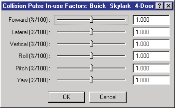
*Figure 2-20: The Collision Pulse In-use Factors dialog — Forward, Lateral, Vertical, Roll, Pitch and Yaw amplification factors.*

#### Collision Pulse Options

The Collision Pulse Options dialog allows the user to focus on a particular
portion of the collision pulse. This feature is useful because a rollover
simulation may require the entire pulse, while a collision simulation only
requires that portion during which the acceleration is greater than some
threshold acceleration (normally 1 g). The pulse is edited by supplying a
threshold acceleration and a starting time that specifies that portion of
interest for the entire pulse.

If the current pulse type is *Force/Moment*, the user can specify the
vehicle-fixed coordinates for the point of application of the force on the
vehicle.

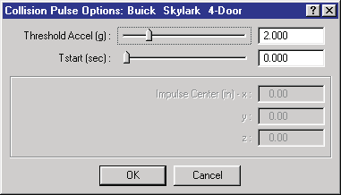
*Figure 2-21: The Collision Pulse Options dialog — Threshold Accel, Tstart, Impulse Center coordinates.*

*See also: [Collision Pulse](../../11-reports-output/ColPulse.md),
[Pulse Factors](../../11-reports-output/ColPulFact.md) and
[Pulse Options](../../11-reports-output/ColPulOptDlg.md) references.*

### Vehicle Mesh

The Mesh dialog is used for changing the attributes of the mesh (3-D
geometry) for the selected vehicle. Vertices within the Weld Distance share
the same vertex coordinates. Clicking on *Tessellate* and then entering a
*Maximum Side Length* ensures that no side of any triangle is longer than the
entered value. Identifying the *watertightness* provides quality information
about the mesh. These options are useful for *DyMESH* and other simulation
models employing a deformable mesh.

The Mesh dialog is also used for assigning *Inter-vehicle Friction* and
*Restitution* (this option takes on various forms, depending on the selected
physics model).

To assign Mesh data, first select a vehicle, then choose *Vehicle Mesh* from
the Set-up menu (this option is unavailable if the current reconstruction or
simulation model does not use the Mesh Options dialog). The Mesh dialog will
be displayed as shown in Figure 2-22.

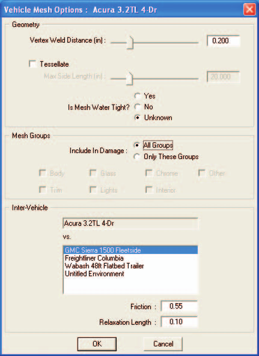
*Figure 2-22: The Vehicle Mesh Options dialog — Vertex Weld Distance, Tessellate/Max Side Length, Is Mesh Water Tight? (Yes/No/Unknown), Mesh Groups included in damage (Body, Glass, Chrome, Trim, Lights, Interior, Other), and Inter-Vehicle friction/relaxation length vs each other object.*

### Assigning Payloads

You can assign a payload to the selected vehicle. To supply a payload, you
must first select a vehicle, then choose *Payload* from the Set-up menu. See
Figure 2-23. (This option will be unavailable if the selected reconstruction
or simulation model does not allow vehicle payloads.)

The addition of a payload causes HVE to update the earth-fixed position of
the vehicle's center of gravity. In addition, the physics model may also
automatically alter the inertial properties and weight distribution of the
selected vehicle.

> **NOTE:** This behavior is physics model-dependent.

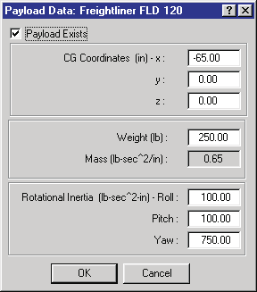
*Figure 2-23: The Payload Data dialog — Payload Exists, CG Coordinates (x,y,z), Weight, Mass, Rotational Inertia (Roll, Pitch, Yaw).*

*See also: [Payload dialog reference](../../02-vehicles/PayLoadDlg.md).*

### Wheel Data Options (Set-up, Wheels)

The Wheels dialog (Set-up menu, *Wheels...*) contains four tabbed pages:
Blow-out, Damage, Brake and Tire-Terrain. *(See also the code-verified
[Wheels dialog reference](../../05-tires-wheels/WheelsDlg.md).)*

#### HVE Tire Blow-out Model

The selected vehicle may incur a tire blow-out during an event. The *HVE Tire
Blow-out Model™* allows the user to study the transient effects of a loss of
inflation pressure on vehicle handling and behavior during an event.

The Tire Blow-out dialog (see Figure 2-24) allows the user to select one or
more tire locations and specify the time and duration of the blow-out(s), as
well as the various factors used for the tire blow-out simulation. Some
simulations can determine when the blow-out is to occur; this feature is
activated by clicking the *AutoStart* check box. This option replaces the
user-entered *Start Time*.

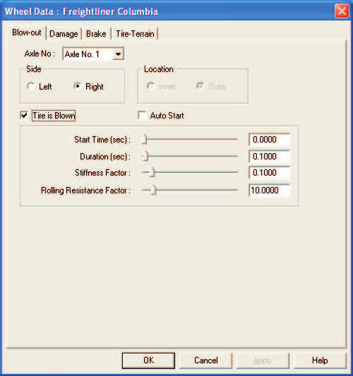
*Figure 2-24: The Tire Blow-out dialog — Axle No, Side, Location (Inner/Outer), Tire is Blown, Auto Start, Start Time, Duration, Stiffness Factor, Rolling Resistance Factor.*

#### Wheel Damage Option

The selected vehicle's wheel may be damaged during an event. A damaged wheel
affects vehicle handling in several ways: it alters the location of the wheel
(thus altering the tire moments and forces acting on the vehicle); it alters
the camber and thus may result in different lateral force at a given wheel
location; and the wheel may be partially or totally locked up due to damage.

The Wheel Damage dialog (see Figure 2-25) allows the user to select one or
more wheel locations and specify the time and duration of the wheel
damage(s), the wheel displacement (Δx, Δy, Δz), the change in camber for each
wheel and the percentage of wheel lock-up for each wheel. Some simulations
can determine when the damage is to occur; this feature is activated by
clicking the *AutoStart* check box. This option replaces the user-entered
*Start Time*.

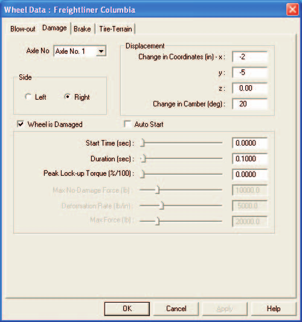
*Figure 2-25: The Wheel Damage dialog — Axle No, Side, Displacement (change in coordinates x, y, z), Change in Camber, Wheel is Damaged, Auto Start, Start Time, Duration, Peak Lock-up Torque, Max No-Damage Force, Deformation Rate, Max Force.*

#### Wheel Brake Option

The selected vehicle's wheel may have an improperly adjusted brake, or the
brake may be completely failed due to a mechanical malfunction, such as
leakage. These factors influence the brake torque at the selected wheel, and
thus, the total forces and moments acting on the sprung mass.

The Wheel Brake dialog (see Figure 2-26) allows the user to select one or
more wheel locations and specify the initial lining and drum/rotor
temperatures, the initial stroke, and the time and duration of the brake
failure. Some simulations can automatically assign the time at which the
brake failure begins. This option is activated by clicking the *AutoStart*
check box. This option replaces the user-entered *Start Time*.

The Wheel Brake dialog is particularly useful for studying the degradation in
braking on long, down-hill grades.

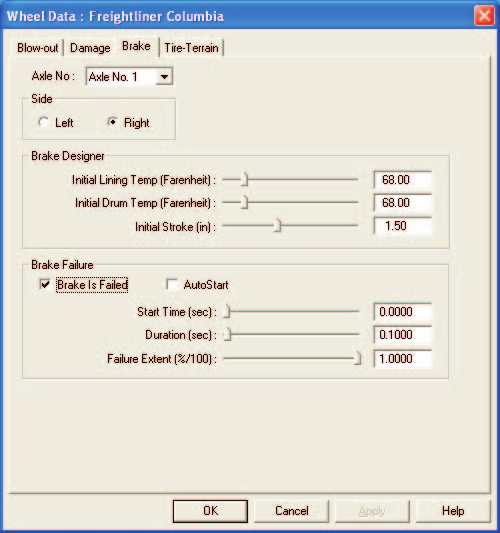
*Figure 2-26: The Wheel Brakes dialog — Axle No, Side, Brake Designer (Initial Lining Temp, Initial Drum Temp, Initial Stroke), Brake Failure (Brake Is Failed, AutoStart, Start Time, Duration, Failure Extent).*

#### Wheel Tire-Terrain Option

The selected vehicle may travel over irregular terrain (e.g., a pot hole or
curb) or soft soil during an event. The Tire-Terrain dialog allows the user
to select from the following tire-terrain models:

- Point Contact Model
- Radial Spring Model
- Sidewall Impact Model
- Soft Soil Model

The Wheel Tire-Terrain dialog (see Figure 2-27) allows the user to select one
or more wheel locations and then select the appropriate model for the terrain
conditions. The dialog also provides access to the parameters used by each of
the models. Note that different wheels may use different models. For example,
the right front tire might use the Sidewall Impact model, while the left
front tire uses the Radial Spring model.

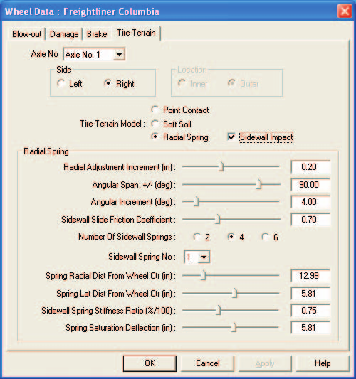
*Figure 2-27: The Wheel Tire-Terrain dialog — Axle No, Side, Location, Tire-Terrain Model (Point Contact / Soft Soil / Radial Spring, with Sidewall Impact check box), Radial Spring parameters (Radial Adjustment Increment, Angular Span, Angular Increment, Sidewall Slide Friction Coefficient, Number of Sidewall Springs, per-spring distances and stiffness ratios).*

### Accelerometers

The Accelerometers dialog (see Figure 2-28) allows the user to select up to
five vehicle-fixed locations for the placement of accelerometers. These
accelerometers allow the user to study the acceleration and velocity change
at the specified location. Such studies are useful for determining the
collision severity experienced by occupants seated in various positions
within the vehicle. Accelerometers are also useful for determining the
threshold for airbag deployment for specific airbag sensor locations.

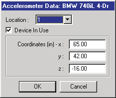
*Figure 2-28: The Accelerometer Data dialog — Location (1-5), Device In Use, Coordinates (x, y, z).*

*See also: [Accelerometers dialog
reference](../../06-safety-systems/AcclMtrsDlg.md).*

### Assigning Restraint System Usage

The selected vehicle may have belt and/or airbag restraint systems. However,
as we all know, just because the vehicle has restraint systems doesn't
necessarily mean they are being used!

If the current simulation model is an occupant simulation, you can supply
in-use parameters for belt and airbag restraint systems for the selected
vehicle. To supply restraint system in-use parameters, you must first select
a vehicle, then choose *Restraints* from the Set-up menu *(updated: the 2006
manual says "from the Edit menu"; the current Set-up menu provides a
Restraints... submenu with separate Airbags... and Belts... items)*. (This
option will be unavailable if the selected simulation model does not model
restraint systems.)

Using the Restraints dialog, you can select from the available restraints and
supply appropriate parameters (see Figure 2-29). An individual system (lap
belt, shoulder belt or airbag) is available only if the selected vehicle has
that system installed at the occupant's seat position.

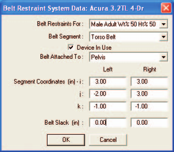
*Figure 2-29: The Belt Restraint System Data dialog — Belt Restraints For (occupant), Belt Segment, Device In Use, Belt Attached To, left/right segment coordinates (i, j, k), Belt Slack.*

*See also: [Belt Restraint Systems](../../06-safety-systems/BeltResSysDlg.md)
and [Airbag Systems](../../06-safety-systems/AirBagSysDlg.md) references.*

### Assigning Contacts

The human model is composed of 15 segments; each segment has up to three
contact ellipsoids. The vehicle model has up to 25 contact surface planes.
Occupant and pedestrian simulations work by calculating the force between
each of these ellipsoids and surface planes at each timestep. It follows that
up to 1,125 (15x3x25) sets of force calculations must be performed. Because
these force calculations are rather lengthy, execution may be extremely slow.

If it is clear that certain ellipsoid-surface pairs will never come into
contact (e.g., interior surface planes during a pedestrian simulation), it
makes sense to tell the simulation model to ignore the contact force
calculations for these ellipsoid-surface pairs. The Contacts dialog is used
for this purpose. This option is only available for human simulation models.

To select and deselect ellipsoid-surface pairs, first select a vehicle, then
choose *Contacts* from the Set-up menu.

The Contacts dialog displays two list boxes: the one on the left contains all
the defined human ellipsoids; the one on the right contains all the defined
vehicle contact surfaces. To allow or inhibit interaction between
ellipsoid-surface pairs, select an ellipsoid then choose the contacts you
wish to allow by either selecting or deselecting from the list of contacts
(see Figure 2-30). If the current event is an occupant simulation, all the
vehicle interior surfaces are initially selected; if the current event is a
pedestrian simulation, all the exterior surfaces are selected.

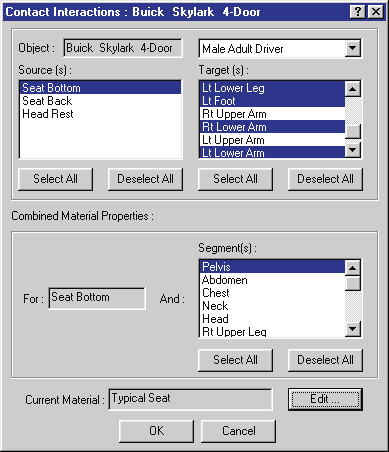

*Figure 2-30: The Contact Interactions dialog — Object, Source(s), Target(s), Combined Material Properties, Current Material and Edit... button.*

*See also: [Contacts dialog reference](../../09-events-driver-controls/ContactsDlg.md).*

## Executing Events

After an event has been set up, it is ready for execution. For simulation
models, this means starting the simulation and watching the Event Viewer to
study the interactions between the human(s), vehicle(s) and environment. The
goal is to match the simulated trajectories and damage profiles with the
measured trajectories and damage. For reconstruction models, this means using
the measured path positions and damage profiles to estimate the initial
velocities and velocity changes. In either case, event execution is
controlled using the Event Controller.

### Event Controller

The Event Controller is similar to a typical VCR controller in both form and
function (see Figure 2-31).

The Event Controller has the following buttons:

- **Reset** — Reinitialize the calculation model for recomputation
- **Rewind** — Return to the start of the simulation
- **Reverse** — Run the simulation backwards
- **Pause** — Pause the simulation
- **Play** — Run the simulation forwards or execute a reconstruction model
- **Advance To End** — Advance to the end of the simulation

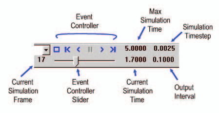
*Figure 2-31: The Event Controller — Reset/Rewind/Reverse/Pause/Play/Advance buttons, Max Simulation Time, Simulation Timestep, Current Simulation Frame, Event Controller Slider, Current Simulation Time, Output Interval.*

The Event Controller also displays the current simulation time and includes a
calculation speed control which allows you to slow down execution, if
desired, to observe details during calculations.

Use the Event Controller to execute the current event as follows:

1. Press *Play* to start the reconstruction or simulation calculations.
2. Press *Pause* to pause the calculations.
3. Make any changes to the event set-up options (e.g., *Driver Controls*).
4. Press *Reset* to re-initialize the calculation model.
5. Press *Play* to re-execute the reconstruction or simulation model with
   the updated driver controls.

> **NOTE:** If Reset is not pressed, any changes to the event set-up options
> will be ignored.

## Choosing Options

HVE provides a number of useful options. These options are available from the
Options menu. The available options are:

- **Key Results** — A window displaying the current calculation results for
  each human and vehicle
- **Coordinate Axes** — Display coordinate axis systems on each human,
  vehicle and environment
- **Contacts** — Display the human ellipsoids and vehicle surfaces used in
  occupant/pedestrian force calculations
- **Belt Anchors** — Display an icon showing the location of restraint
  system seat belt anchors installed in each vehicle
- **Velocity Vectors** — Display the current direction of each object's
  velocity vector
- **Skidmarks** — Display skidmarks resulting from each skidding tire
- **Targets** — Display user-entered target positions as translucent objects

These options are implemented as toggles: you can show and hide these
features. These options are described later in this section, as well as in
the Menu Reference section of the manual.

*(updated: the current Options menu contains a larger set of show toggles —
Show Key Results, Show Axes, Show Contacts, Show Belt Anchors, Show Velocity
Vectors, Show Skidmarks, Show Tracks, Show CGs, Show CG Paths, Show
Accelerometers, Show Accelerometer Paths, Show Position Sequences, Show
Targets, Show Connections — plus Create DB, Distance Tool..., Show Path...,
and Autoposition. The settings items are Grid..., Units..., Shadows...,
Render... (Ctrl+R), Playback..., Simulation Controls... (Ctrl+Y), Calculation
Options... (Ctrl+J), DyMESH..., Get Surface Info..., and Preferences...
(Ctrl+F). See the [Options Menu
reference](../../01-user-interface/OptionsMenu.md).)*

*Chapter 2 continues in [Part B](02b-how-to-use-hve.md): Creating Report and
Playback Windows.*

<!-- NAV -->

---

← Previous: [Chapter 1 — What Is HVE?](01-what-is-hve.md)  |  [Index](README.md)  |  Next: [Chapter 2: How To Use HVE — Part B](02b-how-to-use-hve.md) →

<!-- /NAV -->
