# Chapter 2: How To Use HVE — Part B

*Updated edition, verified against current HVE source code (HVEINV-64, Physics).
Original: HVE User's Manual, Seventh Edition (Jan 2006), printed pages 2-40
through 2-69.*

*Part A: [Basic concepts through Event Mode](02-how-to-use-hve.md) •
Part C: [Selecting User Options, Getting Help, Video](02c-how-to-use-hve.md)*

## Contents (Part B)

- [Creating Report and Playback Windows](#creating-report-and-playback-windows)
- [Creating Case Files](#creating-case-files)
- [Creating Databases](#creating-databases)
- [Printing Results](#printing-results)
- [Setting the View](#setting-the-view)

---

## Creating Report and Playback Windows

Select Playback Mode after creating one or more events. Playback Mode is
used to prepare output reports, view trajectory simulations and combine
multiple simulation events into a single, coherent sequence. Playback Mode
is also used to route these results to your printer or video recording device.

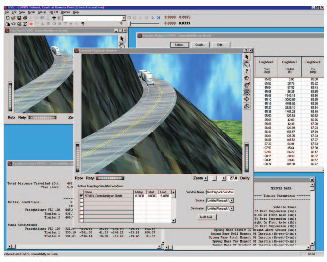
*Figure 2-32: The HVE Playback Editor combining the results of multiple simulations into a single coherent sequence.*

In Playback Mode, the user creates two types of windows:

- **Report Windows**
- **Playback Windows**

Report and Playback Windows are described in the following sections.

### Creating Report Windows

Each Report Window contains the results for a single event. To create a
Report Window, perform the following steps:

1. Select Playback Mode.
2. Click on *Add New Object*. The Report Window dialog will be displayed,
   containing a list of all the executed events (see Figure 2-33).

   > **NOTE:** The Event Status tells you if the selected event has been
   > executed. If the event has not been executed, there will not be
   > reports available.

3. Choose an event from the *Active Events* list.
4. If desired, edit the event name.
5. Select the desired output report(s).
6. Press *OK*.

*(updated: the current Report Window dialog contains the Active Events list,
a read-only Status field, an editable Name field, and a multiple-selection
Report Type list with Select All and Clear All buttons — so several report
windows for one event can be created in a single step.)*

The selected output window will be displayed. Output types may be broadly
categorized into the following types:

- Numeric Outputs
- Graphic Outputs
- Trajectory Simulations
- Variable Output Table

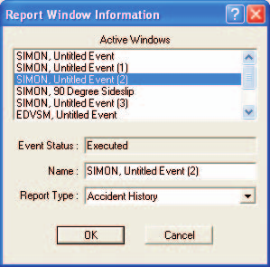
*Figure 2-33: The Report Window Information dialog.*

### Numeric Outputs

Numeric outputs are displayed in Preview Windows (see the [Common Reports
window reference](../../11-reports-output/CommRepDlg.md)). The types of
numeric outputs are described below.

> **NOTE:** The specific data available in any numeric output window is
> dependent upon the calculation model.

**Accident History** — The Accident History output report is a table of
positions and velocities for each user-entered path position (see the
[Accident History reference](../../11-reports-output/AcciHistDlg.md)).

**Damage Data** — The Damage Data output report normally contains
user-entered damage profile data for reconstruction models and calculated
damage profile information for simulation models (see the [Damage Data
reference](../../11-reports-output/DamageData.md)).

**Driver Data** — The Driver Data output report normally contains
user-entered driver control tables (steering, braking, throttle and gear
selection vs time) for simulation models.

**Environment Data** — The Environment Data output report normally
contains the environment parameters used by the reconstruction or simulation
model.

**Event Data** — The Event Data output report normally contains the event
set-up data (positions, velocities and event options) used by the
reconstruction or simulation model. *(updated: the 2006 manual repeated the
Damage Data description here by mistake; the Event Data report actually
contains event set-up data.)*

**Human Data** — The Human Data output report contains the human
anthropometric information supplied by the HVE Human Model and actually
used by the reconstruction or simulation model.

> **NOTE:** Although the HVE Human Model contains several hundred
> parameters, the reconstruction or simulation model may use only a few.

**Injury Data** — The Injury Data output report contains injury results
predicted by an occupant or pedestrian simulator.

**Messages** — The Messages output report contains information about the
run. This information does not normally contain calculated results; rather
it contains warnings and diagnostics which describe the run.

**Program Data** — The Program Data output report normally contains general
program input data for documentation purposes. For example, simulation
models normally report the simulation control data in this report.

**Vehicle Data** — The Vehicle Data output report contains the vehicle
parameters actually used by the reconstruction or simulation model.

> **NOTE:** Although the HVE Vehicle Model contains several hundred
> parameters, the reconstruction or simulation model may not use them all.

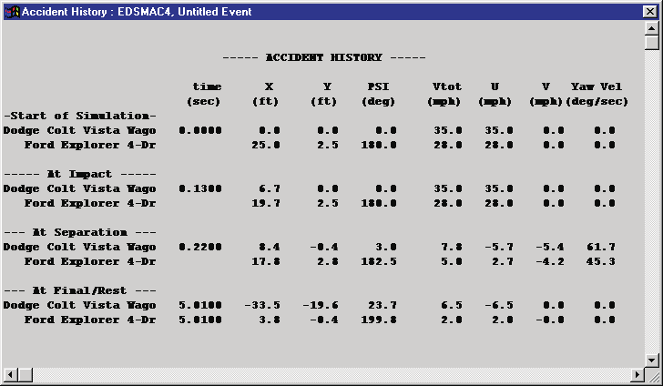
*Figure 2-34: A typical Accident History numeric output window.*

### Graphic Outputs

Graphic output reports are displayed in Report Windows. The types of graphic
outputs are described below.

**Site Drawing** — The Site Drawing output window is a static view of the
accident site showing the vehicles at the user-entered positions for each
vehicle (e.g., Initial, Impact, Final/Rest). The vehicle speeds at each
position are also displayed.

> **NOTE:** The Site Drawing may show the results for one or two vehicles,
> depending on the number of vehicles in the reconstruction model.

> **NOTE:** The Site Drawing is normally used for reconstruction models.

**Damage Profiles** — The Damage Profiles output window is a view of the
vehicle damage on each vehicle. In addition to the profile itself, the
Damage Profile output window may also display the PDOF and other
damage-based information.

> **NOTE:** The Damage Profiles window may be either a 2-dimensional or
> 3-dimensional view, depending on the calculation model.

**Momentum Diagram** — The Momentum Diagram is a static display which shows
a momentum (vector) diagram describing the collision between two vehicles.
The Momentum Diagram may be based on vehicle damage data or accident site
data.

> **NOTE:** In any case, the Momentum Diagram window requires that
> sufficient data be entered to establish impact and separation positions
> and velocities.

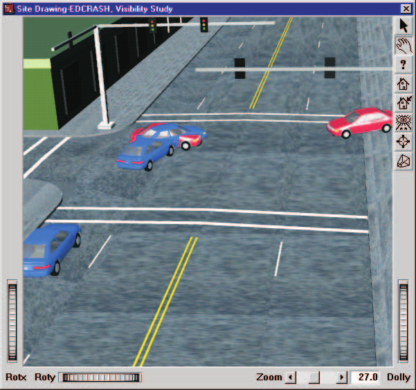
*Figure 2-35: A Site Drawing graphic output from EDCRASH.*

### Variable Output Table

The Variable Output Table is a special output table of simulation results
for an individual event, displayed as a function of time. The Variable
Output Table can show a tremendous amount of data and is scrollable both
horizontally and vertically (see the [Variable Output reference
](../../11-reports-output/VarOutRepDlg.md)).

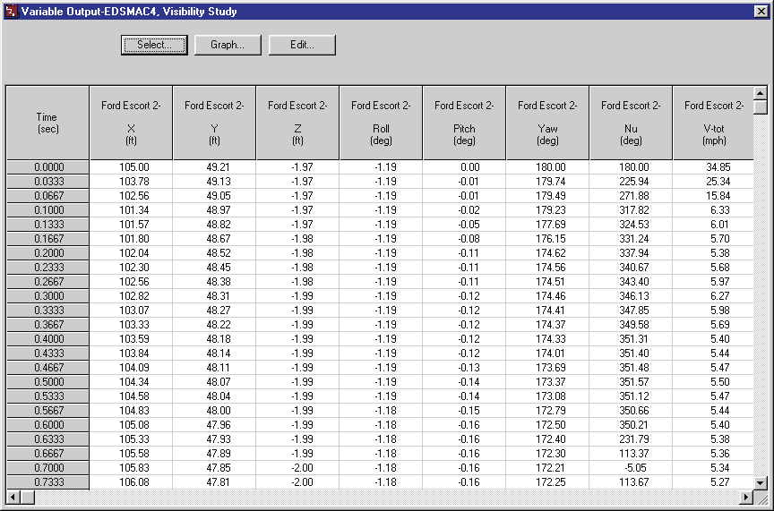
*Figure 2-36: The Variable Output Table.*

The Variable Output Table includes the following features:

**Variable Selection** — Choosing *Select* displays the Variable Selection
dialog, allowing the user to choose variables from the available output
groups. The selected variables are displayed in the Variable Output Table as
a function of time (see the [Variable Selection dialog
reference](../../11-reports-output/VarSelDlg.md)).

> **NOTE:** The selectability of variables is determined by the simulation
> model.

**Variable Editing** — Each HVE simulation event produces results calculated
by the simulation model. Certain non-calculated results may also be assigned
by the simulation model; these non-calculated results are editable by the
user. For example, a 2-D simulator, which calculates X, Y and Heading, may
allow the user to edit the roll, pitch and Z elevation values to produce the
appearance of a 3-D simulation. Pressing *Edit* displays the user-editable
table of these non-calculated variables (see the [Variable Edit dialog
reference](../../11-reports-output/VarOutEdDlg.md)).

> **NOTE:** The results made available for editing by HVE are determined by
> the simulation model.

**Graphing** — The *Graph* button allows the user to produce a graph of the
first six selected variables in the Variable Output Table (see the [Variable
Graphing reference](../../11-reports-output/VarOutGraphDlg.md)).

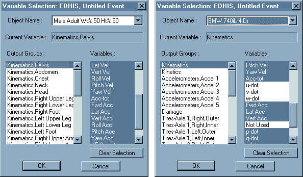
*Figure 2-37: The Variable Selection dialogs for humans and vehicles.*

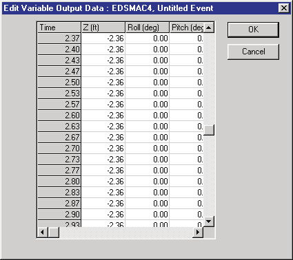
*Figure 2-38: The Variable Edit dialog.*

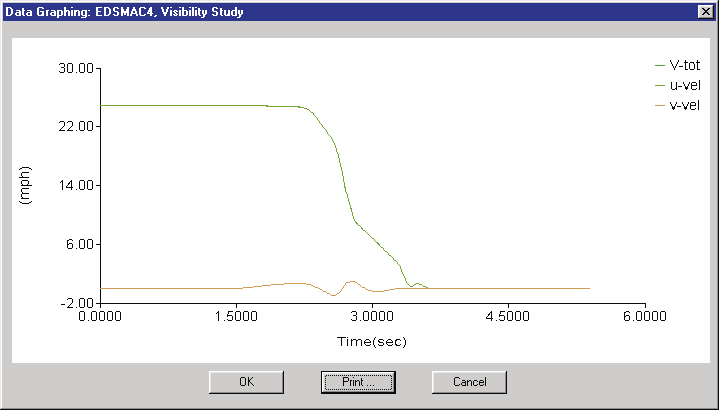
*Figure 2-39: The Variable Graphing window.*

### Trajectory Simulation

The Trajectory Simulation output window is a dynamic visualization of the
human and vehicle motion, the same as during Event mode, beginning at the
user-entered initial position and continuing until the end of the
simulation. Like other output reports, Trajectory Simulations are also
displayed in Report Windows (see the [Trajectory Report
reference](../../11-reports-output/TrajRepDlg.md)).

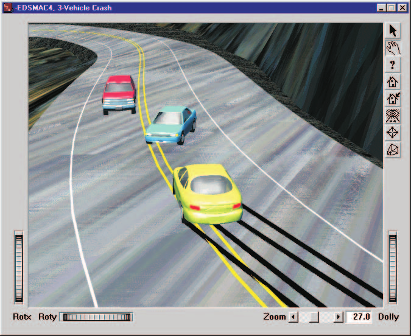
*Figure 2-40: The Trajectory Simulation window.*

The motion in the Trajectory Simulation window is controlled using the
Playback Controller, described below.

### Creating a Playback Window

The Playback Window allows the user to combine several events (previously
set up in Report Windows) to be displayed in a single window. The Playback
Window can be used to produce sequences showing multi-vehicle accidents. The
Playback Window is also used to produce video output.

To create a Playback Window, perform the following steps:

1. Create one or more Trajectory Simulation windows (see previous section).
2. Add a Playback Window. *(updated: the 2006 manual said to click "Add
   Playback Window" on the Options menu; in the current version the Playback
   Window is created from the Playback Editor the same way as other playback
   objects, and its dialog is titled "Playback Information".)* The Playback
   Window dialog will be displayed, containing a list of all the Report
   Windows containing Trajectory Simulations (see Figure 2-41).
3. Choose one or more Report Windows.
4. Enter a name for the Playback Window.

> **NOTE:** Only one Playback Window can be created. *(updated: in the
> current version the Playback Information window is resizable rather than
> fixed-size.)*

The Playback Window initially displays the humans and vehicles for each
event at their initial positions. However, because not all action begins at
the same time, some editing is usually required. For example, if an impact
occurs 3.0 seconds into a sequence, the start of the occupant simulation
must be delayed by 3.0 seconds. The editing procedure is described briefly
in the following section.

The Playback Window also provides the Video Source and Destination
selection, allowing the user to view simulation results, create a compressed
movie and also route a simulation movie to a video file:

- **Video Source** — Option list which allows the user to choose the source
  of the information displayed in the Playback Window.
- **Video Destination** — Option list which allows the user to route the
  Playback Window to a user-selectable destination.

*(updated: the current Playback Information window also contains a Video
Setup... button, a read-only Recording Information panel showing the current
Format (e.g., AVI), Compressor, Recording Size (e.g., HDTV 1080p 1920x1080)
and Recording Speed, plus Key Results..., Traffic Signals..., Reorder
Events... and Audit Trail... buttons.)*

> **NOTE:** For more information about Video Source and Destination, see
> [Video Interface](02c-how-to-use-hve.md#video-interface), later in this
> chapter, and Section Nine, Video Output.

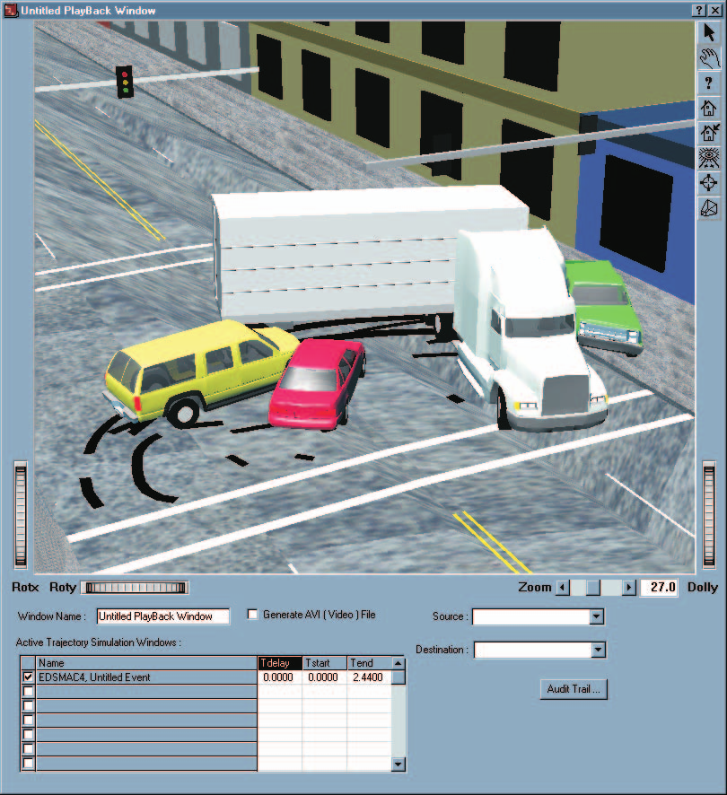
*Figure 2-41: The Playback Window dialog.*

### Playback Controller

The Playback Controller (see Figure 2-42) is used for controlling the motion
in Trajectory Simulations and the Playback Window. Like the Event Controller
described in Part A, the Playback Controller is much like a VCR in both form
and function. It has the same buttons:

- **Stop** — Stop the simulations displayed in Trajectory Simulation and/or
  Playback Windows
- **Rewind to Start** — Return to the start of the simulation
- **Reverse** — Run the simulation backwards
- **Pause** — Pause the simulation(s)
- **Play** — Run the simulation forward
- **Advance To End** — Advance to the end of the simulation

In addition to the above trajectory simulation control features, the
Playback Controller also includes the following components:

- **Time Display** — Displays the current simulation time
- **Frame Control Slider** — Allows the user to visually choose a frame
  within the sequence. To move to the first frame, move the slider all the
  way to the left; to choose a frame near the middle of the sequence, move
  the slider to the middle, and so forth. If the user knows the exact frame
  number, it may be entered directly.

See the [Playback Controls
reference](../../01-user-interface/PlayBackControls.md) for the current
control layout.

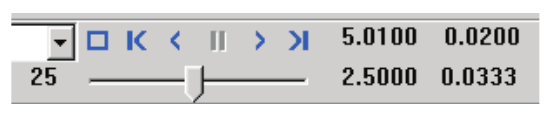
*Figure 2-42: The Playback Controller.*

### Combining and Editing Multiple Events

The timing of multiple trajectory simulation events is affected by the
following editing operations, performed using the *Active Trajectory
Simulations* list in the Playback Window (see Figure 2-41):

- **Editing Tdelay** — Set Tdelay to delay the onset of an event by the
  user-entered time value
- **Editing Tstart and Tend** — Set Tstart and Tend to display a portion of
  the entire event, defined from Tstart to Tend

> **NOTE:** Tstart and Tend allow you to select a specific portion of the
> event. For example, an occupant simulation may contain 50 milliseconds of
> irrelevant motion while the human settles into the seat and reaches
> equilibrium. By selecting Tstart as 50 milliseconds after the output
> begins, you can remove this undesired motion.

To edit multiple events into the desired time sequence, perform the
following steps:

1. Open the Playback Window dialog if you have not already done so. It
   displays a list of active Trajectory Simulation windows for your events.
2. Select an event.
3. Enter the delay time, start time and end time for the event.
4. Repeat the above steps for any number of additional events.

The motion for each event is displayed separately in its Trajectory
Simulation Report Window. Use the Report Window to confirm the event(s) are
synchronized correctly. The Playback Window shows all the events correctly
synchronized in a single window. *(updated: the current Playback Information
dialog also provides a Reorder Events... button for changing the order in
which events are applied.)*

### Audit Trail

Each Playback Window may contain the results from several events. The
merging of these events requires a considerable amount of logic. For
example, the pre-impact phase of an accident sequence may use one simulation
model, the impact phase may use a second, and one of the vehicles might use
a third model for the post-impact phase.

The HVE Playback Window has an internal table to determine which objects are
driven by which events during which time intervals. This table is called the
Audit Trail; it may be displayed and printed. The Audit Trail is a
scrollable text box containing the following information about each event in
the Playback Window:

- Report Window Name
- Event Name
- Event Objects used in the Playback Window

  > **NOTE:** Even though an event may include two objects, the motion of
  > one of its objects may be controlled by a different event. For example,
  > after impact, a vehicle might roll over. You can use a different (3-D)
  > model to control this portion of the object's motion in the Playback
  > Window.

- The starting and ending times during which the object's motion is
  controlled by that event

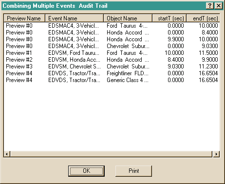
*Figure 2-43: The Audit Trail.*

The Audit Trail is a convenient way to document the simulation models which
control the motion of each object in the Playback Window. To display the
Audit Trail for a Playback Window, perform the following steps:

1. Choose *Audit Trail*. The Audit Trail will be displayed, as shown in
   Figure 2-43.
2. After viewing, and possibly printing, the Audit Trail, press *OK*.

---

## Creating Case Files

HVE creates a file, called the Case file, containing all the active humans
and vehicles and the environment. All the events and playback windows are
also saved in the case file. At any time, it is possible that many events
involving several humans and vehicles have been executed. Therefore, cases
can become very large; a 25 MB case file is not uncommon.

Case files are stored in the `\case` subdirectory of HVE. The directory must
be defined by HVE because these case files are also used to create a virtual
database of humans, vehicles and environments used in previous cases; HVE
needs to know where they are when you first start HVE. See Appendix VIII,
Databases, for more information about the Case Database.

### Opening Cases

To open an existing case, choose *Open* from the File menu (Ctrl+O), as
shown in Figure 2-44. If another case is open, HVE will ask the user to save
the current case before opening a different one.

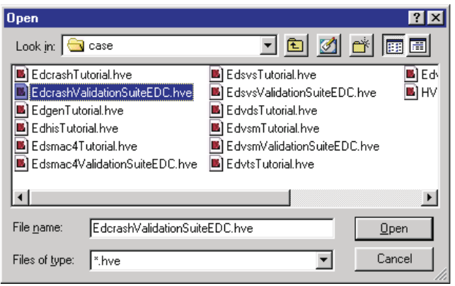
*Figure 2-44: The Open Case File Selection dialog.*

### Saving Cases

To save the current case, choose *Save* from the File menu (Ctrl+S). HVE
will save the case information using the current Case filename.

### Save As

If the case hasn't been saved before, HVE will display the Save As file
dialog, which requests the user to supply a filename for the case file. The
user may also add a case title to the case using the Save As dialog, shown
in Figure 2-45. Every case should have a case title, because the title
appears in the HVE main menu bar, as well as in the heading on printed
output reports.

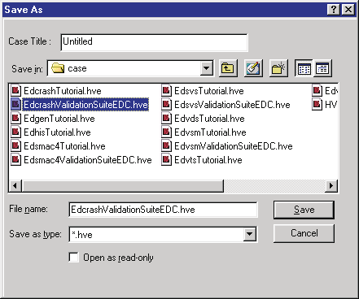
*Figure 2-45: The Save Case File Selection dialog.*

### Starting New Cases

To start a new case, choose *New* from the File menu (Ctrl+N). If another
case file is open, HVE will ask to save the current case before opening a
new one. Choosing New completely removes all the case information associated
with the current case.

### Configuration File

HVE maintains a file, called the configuration file, that keeps track of all
the user's current settings and preferences not directly tied to any case.
Examples of user preferences include the current status of user options,
such as Show Key Results, Units and Autoposition.

---

## Creating Databases

One of HVE's most powerful features is its user-extendible databases for
humans, vehicles and tires. By using these databases, the user can truly
realize HVE's greatest strength: its object-oriented design. Users will find
themselves thinking less about data and more about the interaction of
objects (humans, vehicles and environments).

### Human Database

The Human database allows the user to select pre-defined humans, according
to the following keys:

- Sex
- Age
- Weight Percentile
- Height Percentile

The Human Database is available in the Human Editor's Human Information
dialog (see Figure 2-46). By using these keys, HVE creates a human model
based on anthropometric studies (the GEBOD databank). This human may then be
edited by the user. *(updated: the current dialog is titled "GEBOD Human
Information"; see the [Human Information
reference](../../07-humans/HumanInfoDlg.md).)*

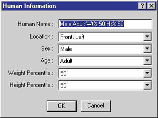
*Figure 2-46: The Human Editor's Human Information dialog.*

### Vehicle Database

The Vehicle Database allows the user to select pre-defined vehicles,
according to the following keys:

- Type
- Make
- Model
- Year
- Body Style

The Make, Model, Year and Body Style keys are user-definable (see User
Databases, below).

The selectable vehicle types are:

- Passenger Car
- Pickup
- Van
- Sport-Utility
- Truck
- Trailer
- Dolly
- Fixed Barrier
- Movable Barrier

*(updated: the 2006 manual listed "SAE Movable Barrier" and "SAE Fixed
Barrier"; the current labels are simply "Movable Barrier" and "Fixed
Barrier", and an additional "Other" type is available.)*

The Vehicle Database is available in the Vehicle Editor's Vehicle
Information dialog (see Figure 2-47 and the [Vehicle Information
reference](../../02-vehicles/VehicleInfoDlg.md)). After choosing the desired
vehicle, HVE loads it into the Vehicle Editor for possible editing and/or
use in the current case. *(updated: the current version also provides a
Vehicle Information search dialog with a Vehicle Search text field for
finding vehicles by name.)*

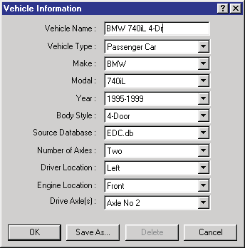
*Figure 2-47: The Vehicle Editor's Vehicle Information dialog.*

### Tire Database

The Tire Database allows the user to select pre-defined tires, according to
the following keys:

- Type
- Manufacturer
- Model
- Size

The Manufacturer, Model and Size keys are user-definable (see User
Databases, below). The selectable tire types are:

- Passenger Car
- Light Truck
- Heavy Truck
- Mobile Home

*(updated: the 2006 manual labeled the third type "Heavy (on-highway)
Truck"; the current label is "Heavy Truck".)*

The Tire Database is available in the Vehicle Editor's Tire Information
dialog (see Figure 2-48 and the [Tires and Wheels
reference](../../05-tires-wheels/TireInfoDlg.md)). After choosing the desired
tire, HVE assigns it to the current vehicle at the selected wheel location
(e.g., Axle 1, Right Side).

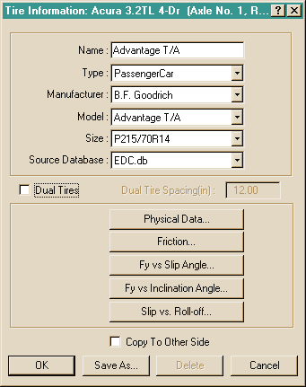
*Figure 2-48: The Vehicle Editor's Tire Information dialog.*

### Generic Databases

HVE includes databases for humans, vehicles and tires. These databases
include generic data, that is, data which do not represent any specific
human, vehicle or tire, but are representative of typical humans, vehicles
and tires for a given size range. The generic databases were produced by the
statistical analysis of a large number of humans, vehicles and tires (see
references 3.10, 4.9, 4.10, 4.11, 4.26), and contain reasonable estimates
for all data necessary to execute any HVE-compatible reconstruction or
simulation model. Humans, vehicles and tires created using HVE's generic
database may be modified and saved in custom databases, as described below.

### Custom Databases

Vehicles and tires may be purchased in custom databases. A custom database
differs from a generic database in that it contains actual vehicles (e.g.,
1996 Ford Taurus 2-Dr Coupe) and tires (e.g., Goodyear Arriva, P195/75R14).
Custom databases are available from EDC, as well as from independent
suppliers. Custom databases often include 3-D geometry files for the vehicle
body for use in DyMESH simulations, resulting in a life-like appearance.
Individual vehicles are also available from EDC.

### User Databases

The user may create and save vehicles and tires in his or her own database.
These databases are called User Databases. Objects from both generic and
custom databases may be saved.

> **NOTE:** The supplier of custom databases may include a license key which
> prevents unauthorized duplication.

To save the current vehicle in the User Database, perform the following
steps:

1. Double-click on the current vehicle in the Active Vehicles list. The
   Vehicle Information dialog will be displayed, showing the database
   information for the current vehicle.
2. Choose *Save As*. The Save As New Vehicle dialog will appear, displaying
   the current Vehicle Type, Make, Model, Year and Body Style information.
   The vehicle's data filename, version number, license key and image
   filename are also displayed (see Figure 2-49).
3. Update these fields by entering the desired data.
4. Press *OK* to save the new vehicle in the User Database.

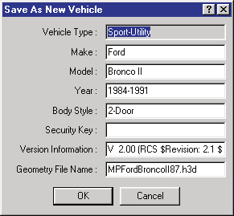
*Figure 2-49: The Vehicle Save-As dialog.*

> **NOTE:** It is possible to have the same vehicle in two different
> databases (i.e., EDC and User); however, it is not possible to have the
> same vehicle twice in the same database. HVE's Database Manager will ask
> if you want to replace the existing vehicle or enter a different make,
> model, year or body style.

To save a tire on the current vehicle in the User Database, perform the
following steps:

1. Click on the desired tire in the Vehicle Viewer. A pop-up menu will be
   displayed.
2. Choose *Tire* from the pop-up menu. The Tire Information dialog for the
   selected tire will be displayed.
3. Choose *Save As*. The Save As New Tire dialog will appear, displaying the
   current Tire Type, Manufacturer, Model and Size information. The tire's
   data filename, version number and license key are also displayed.
4. Update these fields by entering the desired data.
5. Choose *OK* to save the new tire in the User Database.

> **NOTE:** It is possible to have the same tire in two different databases
> (i.e., EDC and User); however, it is not possible to have the same tire
> twice in the same database. HVE's Database Manager will ask if you want to
> replace the existing tire or enter a different manufacturer, model, or
> size.

A number of issues arise when extending and maintaining databases. Users are
encouraged to plan ahead and decide how to approach these issues. For more
information about HVE's databases, see Appendix VIII, Databases.

### Case Database

Every case includes a number of humans and vehicles. Every time the user
saves a case, these humans and vehicles are saved in the case file. These
humans and vehicles are made available for use in future cases. When
starting HVE, all cases in the `\case` subdirectory are opened and the
humans, vehicles, environments and tires are extracted to form what is
called the Case Database.

To select humans from previous cases, perform the following steps:

1. Select Human mode, then choose *Mode > Add...* from the main menu. HVE
   will display a cascade menu containing the options *New...* and
   *Previous...*.
2. Choose *Previous...*. HVE displays a dialog listing every case in the
   `\case` subdirectory and the names of each human included in that case
   (see Figure 2-50).

   > **NOTE:** If the selected case does not include the desired human,
   > select a different case.

3. Select the desired human from the list of human names.
4. Press *Open* to add the selected human to the current case.

The selected human will be added to the current case. Use the same procedure
to add vehicles from previous cases.

The purpose of the Case Database is not to extend your standard database of
humans and vehicles — you should use Save As and create your own User
Database for that purpose. Rather, the purpose of the Case Database is to
allow you access to unusual vehicles created for, and used in, previous
cases. For example, you may remember creating a pickup with a camper. Rather
than recreating that vehicle, you can select it directly from the previous
case in which it was created and used.

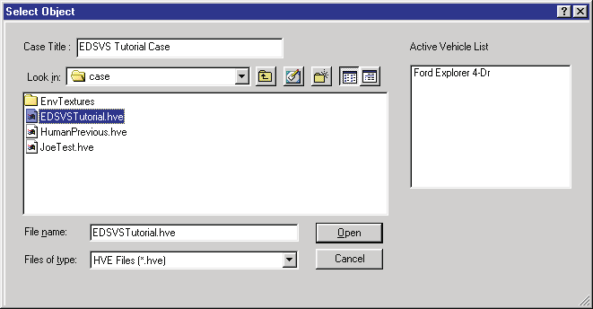
*Figure 2-50: The Case Database selection dialog.*

---

## Printing Results

HVE allows the user to print several types of output reports, graphs and 3-D
views of the accident sequence. The method for printing depends on the
object being printed.

### Printing Output Windows

In Playback Mode, all output windows may be printed by choosing *Print* from
the File menu. The printable output reports are:

- All Numeric Output Reports (e.g., Accident History, Vehicle Data)
- All Graphic Output Reports (e.g., Damage Profiles)
- Variable Output Table
- Trajectory Simulations (including the Playback Window)

To print an output window, perform the following steps:

1. Choose Playback Mode.

   > **NOTE:** The output windows are displayed in Playback Mode.

2. Choose the desired output report.
3. Choose *Print...* from the File menu (Ctrl+P). The Print dialog is
   displayed, providing several print options (see Figure 2-51).
4. Select from the available print options.
5. Press *OK*. The selected output window is printed on the system printer.

*(updated: the current File menu also provides a "Print All..." item for
printing all open report windows at once.)*

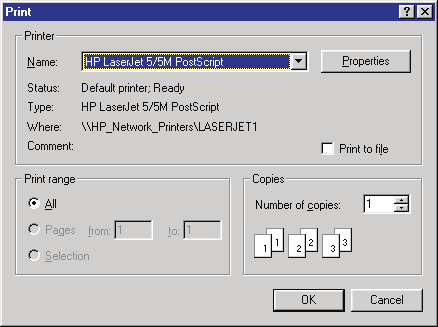
*Figure 2-51: The Print dialog.*

### Printing From Modal Dialogs

If a graph or report is included as part of a modal dialog (i.e., a dialog
that requires the user to press OK before continuing), the dialog will
contain a *Print* button.

> **NOTE:** The Print button is required because you cannot select anything
> (including the Print option in the File menu) until you press OK on the
> current dialog.

The following modal dialogs have a Print button:

- Several graphs in the Vehicle Editor (e.g., Tire Lateral Force vs Slip
  Angle)
- The Audit Trail for the current Playback Window
- The Graphing dialog for Variable Output

All printed reports and graphs are printed on the current system printer.

> **NOTE:** The current system printer is installed using the Windows
> Control Panel.

### Printing To a File

The HVE print dialog allows the user to print to file, as well as to the
system printer. Printing to file has several important uses:

- Saving the desired information for later printing
- Exporting selected results to a file to be used by another program

To print the current results to file, perform the following steps:

1. Using the Print dialog, click *Print To File*.
2. Press *OK*. The Print to File dialog is displayed (see Figure 2-52).
3. Change the current printer name to *Generic / Text Only*.

   > **NOTE:** If a Generic / Text Only printer is not included in the list
   > of printers, you will need to install one using the standard Windows
   > printer installation procedure.

4. Enter the desired filename, using `.txt` as the extension.
5. Press *OK*. The selected report is saved using the specified filename and
   format.

*(updated: the current File menu also provides "Export..." and "FBX
Export..." items for exporting data and 3-D geometry directly, which is
often more convenient than printing to a file.)*

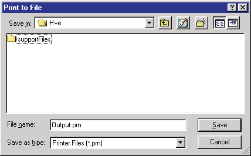
*Figure 2-52: The Print To File selection dialog.*

---

## Setting the View

The view determines what is visible in any viewer. HVE uses a camera as its
viewing paradigm; that is, you choose where you are looking from (the Camera
Position), where you are looking at (the Picture Center), and the focal
length of the lens. You can also set near and far clipping planes, which
determine whether close-up and distant objects are visible.

There are two different ways to set the view:

- Use the thumb wheels on the viewer window borders to set the view
  interactively, as shown in Figure 2-53.
- Select *Set Camera...* from the View menu. The Set Camera dialog allows
  you to directly enter the viewing information described above, as shown in
  Figure 2-54 (see the [Set Camera dialog
  reference](../../01-user-interface/CameraSetDlg.md)).

Using the thumb wheels has the advantage of allowing the user to quickly and
interactively select a view. Using the Set Camera dialog has the advantage
of allowing the user to specify the exact camera location and view. The user
can also attach the camera to one object and view another object as it moves
by. The latter option is useful for visibility studies where the exact
viewing position is an issue.

Note that, because HVE's view is 3-dimensional, the term "scale" has no
relevance. In a 3-D world, the concept of scale is replaced by the position
and focal length of the camera lens used in the view.

### Object-based Cameras

By default, the camera is attached to the environment. However, the Set
Camera dialog (see Figure 2-54) allows the user to attach the camera to any
object (human, vehicle or environment) and attach the view to the same or
any other object. This is useful for situations where visibility of drivers
or witnesses is an issue.

To set the view using the viewer's thumb wheels, perform the following
steps:

1. Using the viewer's pick/manipulate icons, choose Pick mode. The cursor
   will turn into a pointing arrow.
2. Click on the *Rot X* thumb wheel and drag up or down to rotate the entire
   scene about the viewer's horizontal axis.
3. Click on the *Rot Y* thumb wheel and drag up or down to rotate the entire
   scene about the viewer's vertical axis.

   > **NOTE:** The Rot X and Rot Y thumb wheels rotate the scene about the
   > viewer's axes, not the earth's axes!

4. Click the *Dolly* thumb wheel and drag up to move the camera closer to
   the scene; drag down to move the camera farther from the scene.
5. Using the viewer's pick/manipulate icons, choose Manipulate mode. The
   cursor will turn into a hand.
6. Click in the viewer using the left mouse button and drag the mouse. The
   scene will rotate about its center.
7. Click in the viewer using the middle mouse button and drag the mouse. The
   scene will translate in the direction of the mouse movement.

> **NOTE:** Setting the view using Manipulate mode takes a little practice.
> Once you get the hang of it, however, this technique works extremely well!

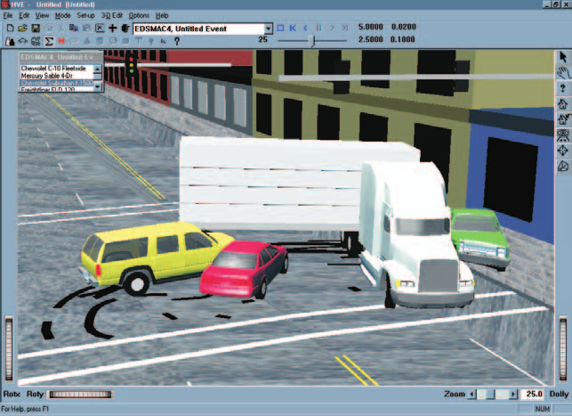
*Figure 2-53: HVE viewer thumb wheels.*

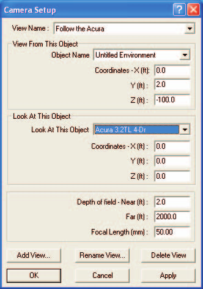
*Figure 2-54: The Set Camera dialog.*

### Overlays

An Overlay is a collection of environment objects which can be made visible
or invisible as a group. These objects are usually related in some way. For
example, by placing all accident-related artifacts (debris, gouges,
skidmarks) on an overlay, the user may turn this overlay off to show the
scene's appearance before the accident, and turn it on to show how the scene
appeared after the accident. The Overlays dialog, shown in Figure 2-55, is
used for displaying and removing selected overlays from the scene (see the
[Overlays dialog reference](../../01-user-interface/OverLayDlg.md)).

Overlays are created when the environment is created or edited using the 3-D
Editor. Refer to the 3-D Editor section for details on creating and naming
overlays.

> **NOTE:** If you use another editor to create your environment, you can
> still use HVE's 3-D Editor to create overlays.

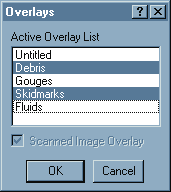
*Figure 2-55: The Overlays dialog.*

### Scanned Image Overlay

A scanned image overlay is a special overlay created from a scanned
photograph of the accident scene. The scanned image may be included as part
of the environment background using the Environment Information dialog (see
the [Environment Editor reference](../../08-environment/EnvtInfoDlg.md)).

A scanned background image adds photo-realism to the scene (see Figure
2-56). However, the use of a scanned image requires that the earth-fixed
coordinates are known for both the location where the photograph was taken,
as well as for the center of the photograph. In addition, the focal length
of the camera lens must be known. Finally, to use a scanned image, the view
must be fixed; that is, the camera cannot be attached to a moving human or
vehicle.

Two excellent uses for scanned background images are:

- To show that a 3-D model of a scene matches the actual scene. This may be
  accomplished by first showing the scanned image, then showing the 3-D
  model from the same camera position.
- For a distant sky or background. If a 3-D model of the environment has a
  relatively flat horizon that fades into the distance, using a photograph
  of a cloudy sky (which HVE places beneath the 3-D model) creates a
  realistic environment.

> **NOTE:** The sky remains fixed, even if the camera is attached to a
> moving human or vehicle. This may reduce the realism.

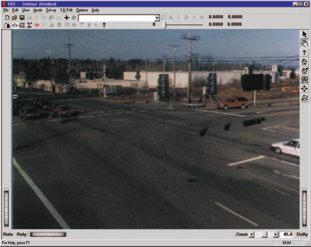
*Figure 2-56: A scanned background image.*

The individual overlays and scanned background image are displayed or hidden
using the Overlays dialog, available in the View menu (see Figure 2-55). The
Overlays dialog includes a multiple-selection list box containing the names
of every overlay created using the 3-D Editor (the default name is
"Untitled"). By default, all overlays are displayed (highlighted). The
Overlays dialog also includes a Scanned Image check box to turn the scanned
image on and off. To choose the desired overlays and scanned image for
display, perform the following steps:

1. Choose *Overlays...* from the View menu. The Overlays dialog will be
   displayed; all the currently displayed overlays will be highlighted, and
   the Scanned Image check box will show the current status (on or off) of
   the scanned image.
2. Click on one or more highlighted overlay names to hide them.
3. Click on one or more unhighlighted overlay names to show them.
4. Click on the Scanned Image check box to show or remove it.
5. Press *OK*.

The selected overlays and scanned background image will be displayed.

---

*Chapter 2 continues in [Part C](02c-how-to-use-hve.md): Selecting User
Options, Getting Help, and the Video Interface.*

<!-- NAV -->

---

← Previous: [Chapter 2 — How To Use HVE](02-how-to-use-hve.md)  |  [Index](README.md)  |  Next: [Chapter 2: How To Use HVE — Part C](02c-how-to-use-hve.md) →

<!-- /NAV -->
