# Chapter 2: How To Use HVE — Part C

*Updated edition, verified against current HVE source code (HVEINV-64,
Physics). Original: HVE User's Manual, Seventh Edition (Jan 2006), printed
pages 2-70 through 2-104.*

*Part A: [Basic concepts through Event Mode](02-how-to-use-hve.md) •
Part B: [Report/Playback Windows, Cases, Databases, Printing, View
](02b-how-to-use-hve.md)*

## Contents (Part C)

- [Selecting User Options](#selecting-user-options)
- [Getting Help](#getting-help)
- [Video Interface](#video-interface)

---

## Selecting User Options

You can customize HVE through the selection of several user options. Each of
these options is selected using the Options menu. The current status of
these options is saved when you exit HVE, so your user environment will be
the same the next time you start HVE. These options are described below.

See the [Options Menu reference](../../01-user-interface/OptionsMenu.md) for
the complete, code-verified list of current Options menu items.

### Key Results Windows

Key Results windows display important calculation results for each human and
vehicle in the event. Key Results windows are available for both
reconstruction and simulation models (see Figures 2-57 and 2-58). The
results for reconstruction models are static, while the results for
simulations are time-dependent and are updated every output timestep (see
Simulation Controls, later in this section).

To display Key Results windows, check *Show Key Results* on the Options
menu. To remove Key Results windows, uncheck *Show Key Results*.

> **NOTE:** The Key Results option is a toggle.

See the [Key Results window
reference](../../01-user-interface/KeyResDlg.md) for details.

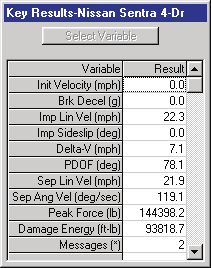
*Figure 2-57: Key Results window for reconstructions.*

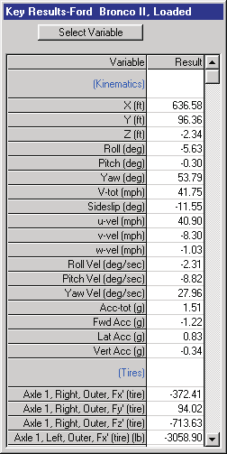
*Figure 2-58: Key Results window for simulations.*

#### Selecting Key Results

The results for simulation models are user-selectable, so the user can
decide what data are important to display for the current event.

> **NOTE:** Although the typical simulation model produces an enormous
> amount of output data, the user is normally interested in the results for
> only a few variables. These are called "Key Results".

To select the desired variables during Event mode, perform the following
steps:

1. If not already displayed, check *Show Key Results* on the Options menu.
2. Locate the Key Results window for the desired human or vehicle (each
   object has its own Key Results window) and click on *Select Variables*.
   The Variable Selection dialog will be displayed (see Figure 2-59) and the
   currently selected variables will be highlighted.
3. Choose the desired variable group. For humans, the available groups are:

   - Kinematics
   - Joints
   - Contacts
   - Belts
   - Airbags

   For vehicles, the variable groups are:

   - Kinematics
   - Kinetics
   - Accelerometers
   - Damage
   - Tires
   - Wheels
   - Inter-vehicle Connections
   - Driver
   - Contacts
   - Belts
   - Airbags

4. After selecting the variable group, choose any required subgroups (e.g.,
   Axle Number, Side, Inner/Outer for tire variables; Segment Name,
   Ellipsoid Name, Contact Name for contact variables). Once the required
   subgroups are selected, a multiple-selection list box will be displayed,
   showing all the variables available for selection in the chosen group.
5. Choose the desired variables from the multiple-selection list box.
   Selected variables are highlighted. Click on any highlighted variables to
   deselect them.

   > **NOTE:** The list box includes the name of every HVE simulation
   > variable. If you choose a variable the current simulation model does
   > not calculate, the Variable Selection list box will automatically
   > deselect it.

6. Repeat the above steps for each variable to be displayed in the Key
   Results window.
7. Press *OK*.

The selected variables will be added to the existing list of variables in
the Key Results window.

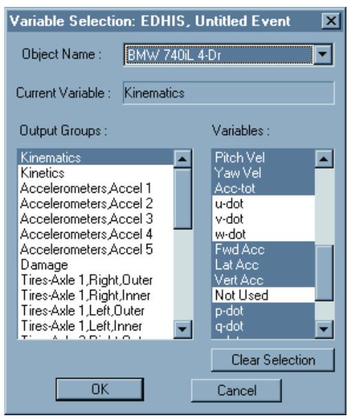
*Figure 2-59: The Variable Selection dialog.*

### Coordinate Axes

The Coordinate Axes option allows the user to display the X,Y,Z coordinate
system for each human or vehicle, as well as the environment (see Figure
2-60). The coordinate axes are shown in all modes, and serve as a useful
reminder when dimensions are being assigned and positions are being entered.

To display the coordinate axis system for each object, check *Show Axes* on
the Options menu. To remove the axes, uncheck *Show Axes*. The user may
choose to turn off the coordinate axes once in Playback mode in order to
reduce the level of detail.

> **NOTE:** The Axes option is a toggle.

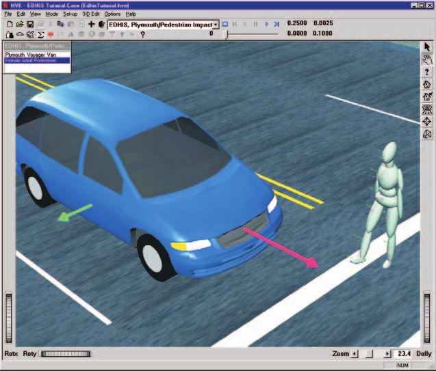
*Figure 2-60: The Show Axes option.*

### Contact Surfaces

Contact surfaces are the physical surfaces of humans and vehicles which
interact to produce forces during impact. For humans, the contact surfaces
are ellipsoids attached to each human segment. These ellipsoids may be
assigned or edited using the HVE Human Editor. For vehicles, these contact
surfaces are flat planes attached to the vehicle's interior (dashboard,
seat, floorboard and other interior surfaces) or exterior (bumper, grill,
hood or other exterior surface). The viewer in Figure 2-61 includes a human
and a vehicle with the Show Contacts option active.

The user may choose to make the contact surfaces visible while creating
human ellipsoids during Human mode, and while creating contact surface
planes during Vehicle mode, to ensure the surfaces are correctly positioned.
The user may also choose to make the contact surfaces visible while in Event
mode while setting up and executing events. This helps to ensure the correct
ellipsoid vs contact surface interactions are being simulated.

While in Playback mode, the user may choose to turn off the contacts to
reduce the level of detail and to make the simulation appear more realistic.

To display the human ellipsoids and vehicle contact surfaces for each
object, check *Show Contacts* on the Options menu. To remove the contacts
from the display, uncheck *Show Contacts*.

> **NOTE:** The Contacts option is a toggle.

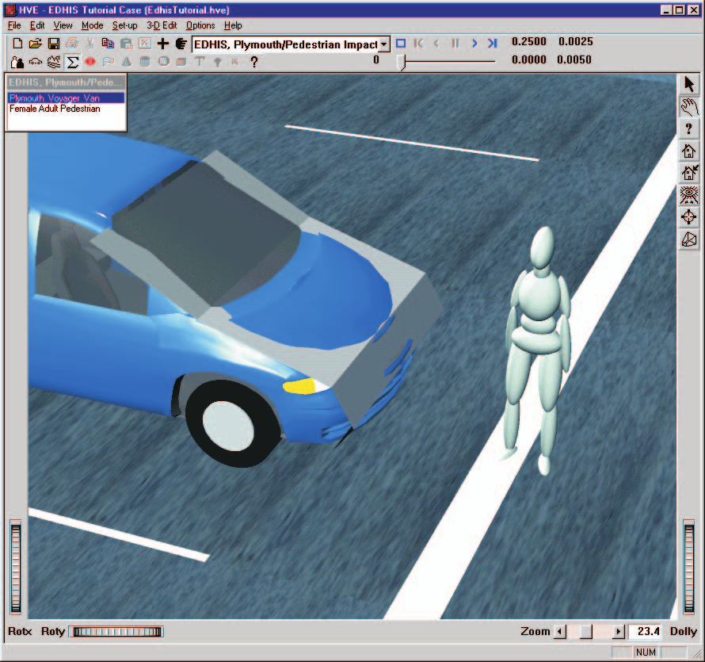
*Figure 2-61: The Show Contacts option.*

### Velocity Vectors

Velocity vectors are represented by arrows drawn from each human segment CG
and each vehicle CG which represent the magnitude and direction of the
object's motion. These vectors are useful during Event mode while studying
the motion during a simulated sequence. Figure 2-62 shows a skidding vehicle
with the Velocity Vectors option active. The vectors may be turned off to
reduce the level of detail in the scene.

> **NOTE:** The length of the vector is scaled in proportion to speed; the
> longer the vector, the higher the speed.

To display the velocity vectors for each human and vehicle, check *Show
Velocity Vectors* on the Options menu. To remove the vectors, uncheck *Show
Velocity Vectors*.

> **NOTE:** The Velocity Vectors option is a toggle.

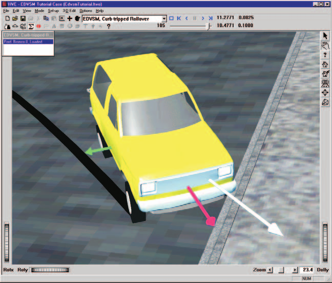
*Figure 2-62: The Show Velocity Vectors option.*

### Skidmarks

Simulated skidmarks and scuffmarks are created by vehicle simulators. These
marks on the environment surface are created by vehicle simulations at each
output interval according to the value of Tire Skid (see Variable Selection
dialog, Tires output group). Skidmarks are drawn for each tire according to
the vertical tire load (increased tire load results in a darker mark) and
longitudinal and lateral tire slip (increased slip results in a darker
mark). The width of the mark is determined by the width of the tire.

The researcher may compare these simulated marks with any actual marks
created during an accident sequence to help verify the accuracy of the
simulation. A scene with simulated skidmarks is shown in Figure 2-63.

To display the simulated skidmarks for each vehicle's tires, check *Show
Skidmarks* on the Options menu. To remove the simulated skidmarks from the
display, uncheck *Show Skidmarks*.

> **NOTE:** The Skidmarks option is a toggle.

> **NOTE:** Some simulation models do not support a variation in the
> darkness of the skidmarks; they simply display solid black lines.

*(updated: the current Options menu also provides a related "Show Tracks"
toggle that displays the path of each tire, and "Show CG Paths" /
"Show Accelerometer Paths" toggles for the paths of vehicle CGs and
accelerometers.)*

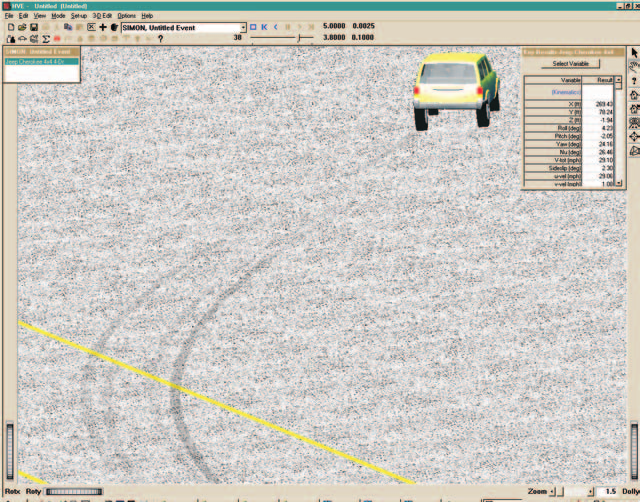
*Figure 2-63: The Show Skidmarks option.*

### Target Positions

During Event mode, the user positions each human and vehicle in the
environment. Up to eight positions may be supplied:

- Initial
- Begin Perception
- Begin Braking
- Impact
- Separation
- Point-on-curve
- End-of-rotation
- Final/Rest

Even though any or all of these positions may be supplied, they may not
actually be used by the reconstruction or simulation model. For example,
simulations only use the Initial position. All other positions are
irrelevant to the simulation.

Then why supply them? Because, as the name suggests, targets provide
feedback to the user regarding how well the simulated path matches the
actual path. This is quite useful because, in general, the better the match
between simulated and actual paths, the greater the level of confidence the
researcher has about his/her conclusions.

Another important reason for entering target positions is the HVE Path
Follower. In this case, the targets are used to define a path. Using this
path, the simulation model determines the steering, throttle and braking
driver inputs required to cause the vehicle to follow the path.

Target positions are displayed as translucent humans or vehicles, thus
distinguishing them from the positions used by the simulation model. Target
positions are most useful during Event mode, when the analysis is being
conducted. A scene which includes target vehicles is shown in Figure 2-64.

To display the target positions for each human and vehicle, check *Show
Targets* on the Options menu. To remove the targets from the display,
uncheck *Show Targets*.

> **NOTE:** The Targets option is a toggle.

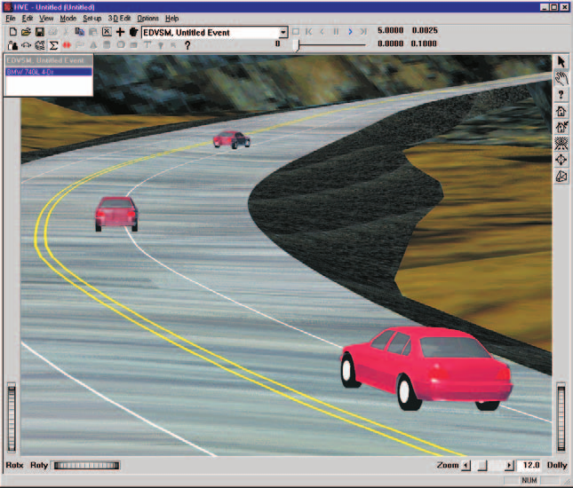
*Figure 2-64: The Show Targets option.*

### Grid

The Grid option allows the user to display a set of evenly spaced lines
(i.e., a grid) in the environment. It is used to provide spatial context
while positioning objects during Event mode and in the 3-D Editor. The Grid
dialog (see Figure 2-65 and the [Grid dialog
reference](../../01-user-interface/SetGridDlg.md)) allows the user to turn
the grid on and off, as well as to define the grid spacing.

To display the grid and set the grid spacing, perform the following steps:

1. Choose *Grid...* from the Options menu. The Grid dialog will be
   displayed, showing the current grid status (on or off) and grid spacing.
2. If the Turn Grid On check box is not checked, click on it to turn on the
   grid.
3. Enter the desired grid spacing.
4. Choose *OK* to remove the Grid dialog.

> **NOTE:** The grid is displayed in the 3-D Editor viewers only.

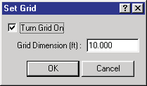
*Figure 2-65: The Grid dialog.*

### Selecting Units

The Units dialog (see Figure 2-66 and the [Units dialog
reference](../../01-user-interface/UnitsDlg.md)) allows the user to specify
different units (inches or millimeters, pounds force or Newtons, ...) for
each type of object.

HVE incorporates a simple, yet extremely robust, units implementation. In
general, it works like this:

Every object (human, vehicle, environment) and some component objects
(tires, brakes, engine) has its own unit name for force, length and time
(and all derivatives thereof). These are called Program Units. A list of
these unit names may be found in Appendix IV.

For every program unit, the user may define the units of his/her own liking.
These are called User Units.

For every unit name, HVE has a conversion factor between its program units
and user units, as well as a human-readable label.

For example, a vehicle's forward velocity component has the unit name
`UtVehVelLinear` and its program units are in/sec. Although HVE includes
several sets of user units, two possible options are miles per hour (having
the user unit name "mph" and factor 17.6000, which converts from mph to
in/sec), and meters per second (having the user unit name "m/s" and factor
0.0254, which converts from m/s to in/sec). *(updated: the m/s conversion
factor to in/sec is 39.37; 0.0254 is the in-to-m factor as printed in the
original manual.)*

HVE includes two files, `units.us` and `units.si`, which contain two
complete sets of user units. The Units dialog simply switches between these
two files.

> **NOTE:** One file, `units.us`, contains typical user units for the US
> (Imperial) system of units; the other file, `units.si`, contains typical
> user units for the SI (Système International, or "metric") system of
> units.

To change the current system of units, perform the following steps:

1. Choose *Units...* from the Options menu. The Units dialog will be
   displayed, showing the current units (US or metric).
2. Click on the radio button to choose the other system of units.
3. Press *OK* to remove the Units dialog.

The selected units will be displayed.

> **NOTE:** The units currently displayed in any window while the units are
> changed will not be updated until the window is removed and redisplayed.

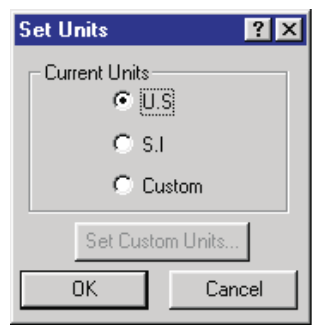
*Figure 2-66: The Units dialog.*

### Render Options

The Render Options dialog (see Figure 2-67 and the [Render dialog
reference](../../01-user-interface/RendOptDlg.md)) allows the user to
determine how objects are displayed and to choose the level of rendering
quality. These options are important because high-quality rendering requires
more time than low-quality rendering. There are times in which high-quality
rendering is less important than speed (for example, during Event mode, when
the goal is to conduct a thorough analysis), and there are other times when
high-quality rendering is more important than speed (for example, during the
final rendering of a Playback sequence to video). The various Render options
are briefly described below.

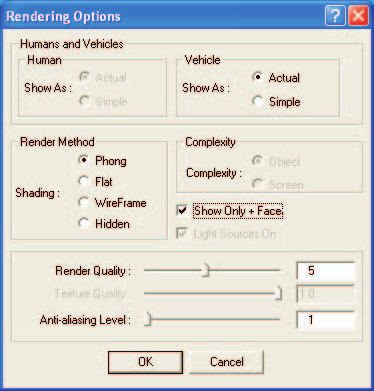
*Figure 2-67: The Rendering Options dialog.*

#### Show As

The Show As radio button has two choices: Actual and Simple. Choosing
*Actual* causes HVE to display humans and vehicles using a complex 3-D
model, if one is supplied. Choosing *Simple* causes humans and vehicles to
be displayed as simple shapes: humans are shown using 15 basic body
ellipsoids, and vehicles are shown using a simplified face set. *(updated:
the current Render dialog provides separate Show As choices for humans and
for vehicles. The Human Show As choices (Actual/Simple) are currently
disabled — grayed out — in the dialog.)*

> **NOTE:** Because of the time required to render an actual human or
> vehicle containing several thousand polygons, you should choose the Simple
> option for all but your final runs. This option will greatly improve your
> productivity.

#### Shading

The Shading radio button has four choices: Phong, Flat, Wireframe and Hidden
Line. Choosing *Phong* causes HVE to perform its highest level of lighting
and shading calculations, and results in the most realistic appearance.
Because it provides the necessary visual feedback crucial to the use of HVE,
Phong is the preferred choice for most work. Choosing *Flat* causes HVE to
perform minimal shading (no lighting) calculations, and results in a less
realistic appearance than Phong shading. It is only slightly faster than
Phong. Sometimes, Flat shading aids during Event mode or when using the 3-D
Editor, when technical accuracy is important and the blending associated
with Phong shading causes difficulty. The *Wireframe* and *Hidden Line*
options are most useful as construction tools while using the 3-D Editor. In
these modes, no lighting or shading of any surfaces occurs; in fact,
surfaces are not drawn. Only lines representing the edges of each surface
are drawn. Wireframe is considerably faster than Hidden Line because it
requires no depth cueing.

> **NOTE:** Depth cueing is the process whereby closer objects obstruct the
> view of objects behind them.

#### Complexity

The Complexity radio button has two choices: Object and Screen. Choosing
*Object* causes HVE to render every polygon of an object, regardless of how
small or distant. Choosing *Screen* causes HVE to render fewer polygons for
distant objects. *(updated: the Complexity choices (Object/Screen) are
currently disabled — grayed out — in the dialog.)*

> **NOTE:** Logic dictates there is no reason to render 10,000 polygons if
> they occupy only 5 or 10 pixels!

#### Show Only + Faces

All polygons have a front side and a back side, as determined by the
right-hand rule. The positive (+) side is determined by a counter-clockwise
order of the vertices comprising the polygon. Choosing this option is a way
to determine if one or more polygons has the vertices in the wrong order.

> **NOTE:** This is important to DyMESH. A force must be applied to the +
> side of a surface to cause damage.

#### Render Quality

The Render Quality slider has a range from 1 to 10. The default value is 5.
Choosing a value less than 5 results in reduced tessellation of geometric
shapes, such as spheres and cylinders. As a result, these objects are
rendered faster, but begin to appear rather blocky. Choosing a value greater
than 5 results in smoother objects, but they take longer to render. A value
of 5 results in a reasonable level of tessellation for most purposes. A
value of 10 may be used for final production to video.

#### Anti-aliasing Level

The Anti-aliasing Level slider has a range from 1 to 10. The entered value
determines how many times the scene is rendered. The default value is 1.
Increasing the Anti-aliasing Level greatly improves the image quality, but
at a rather significant increase in rendering time.

> **NOTE:** Because of the time required to re-render the scene several
> times, you should set the value to 1 until your final production to video.

To change the current rendering options, perform the following steps:

1. Choose *Render...* from the Options menu (Ctrl+R). The Rendering Options
   dialog will be displayed, showing the current status of each option.
2. Click on the radio buttons or check boxes to change any of the current
   options.
3. Set the desired Render Quality and Anti-aliasing Level using the sliders.
4. Press *OK* to update the selected options.

The viewer will be re-rendered using the new options.

*(updated: the current Options menu also includes a "Shadows..." item for
configuring rendered shadows; see the [Options Menu
reference](../../01-user-interface/OptionsMenu.md).)*

### Simulation Controls

The Simulation Controls dialog (see Figure 2-68 and the [Simulation Controls
dialog reference](../../09-events-driver-controls/SimuCtrlDlg.md)) allows
the user to set parameters affecting the execution of simulations. These
options may be divided into two basic categories: Integration Timesteps and
Termination Conditions.

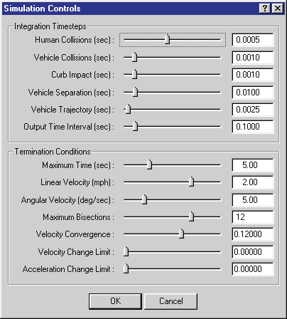
*Figure 2-68: The Simulation Controls dialog.*

#### Integration Timesteps

The Integration Timestep variables control the basic integration timesteps
for the simulation model. HVE provides the following timestep controls:

- **Human Collisions** — This timestep may be used for occupant and
  pedestrian simulations. Because of the dynamic nature of the interaction
  between human ellipsoids and vehicle or environment contacts, this value
  should be relatively small. The default value is 0.0005 seconds.
- **Vehicle Collisions** — This timestep may be used during the collision
  phase of a collision between two vehicles. Because of the dynamic nature
  of motion during a collision, this value should be relatively small. The
  default value is 0.001 seconds.
- **Curb Impacts** — This timestep may be used during a simulation when the
  tire model detects a tire is mounting a curb. Because of the dynamic
  nature of the interaction between a tire and curb during a curb impact,
  this value should be relatively small. The default value is 0.001 seconds.
- **Vehicle Separation** — This timestep may be used for the separation
  phase of a collision simulation. Because of the dynamic nature of the
  motion just following impact, and because a secondary impact might occur,
  this value should be relatively small. The default value is 0.010 seconds.
- **Vehicle Trajectory** — This timestep may be used during the normal
  simulation of a vehicle on regular terrain. The default value is 0.050
  seconds for 2-D simulations and 0.0025 seconds for 3-D simulations.
- **Output Interval** — This is the time increment at which the simulation
  sends the current simulation results to HVE for display and storage. The
  default value is 0.100 seconds for vehicle simulations and 0.010 seconds
  for human simulations.

> **NOTE:** The Output Interval should be reduced if the output of the
> current event is to be used for the collision pulse of a human occupant
> simulation. 0.0050 seconds is a reasonable value. See Collision Pulse for
> further information.

These timesteps are sufficient for all known simulation models. Some
simulators only need one or two of the above parameters; some require many
more. The user should refer to the documentation for the individual
simulation program for specific requirements.

#### Termination Conditions

Termination Conditions determine what causes a simulation to stop running.
Any of several conditions may arise which dictate the end of a simulation.
HVE provides the following Termination Condition controls:

- **Maximum Simulation Time** — The maximum simulation time determines how
  long the simulation is allowed to run before normal termination.
- **Termination Linear Velocity** — The velocity below which the simulated
  vehicle(s) are assumed to have stopped moving; a velocity of zero is
  assumed and the simulation terminates.
- **Termination Angular Velocity** — The angular velocity below which the
  simulated vehicle(s) are assumed to have stopped rotating; a velocity of
  zero is assumed and the simulation terminates.
- **Maximum Bisections** — For predictor-corrector (PC) numerical
  integration methods, the Maximum Bisections is the number of times the
  nominal timestep is allowed to be halved before the simulation terminates
  (normally an indication of abnormally high forces and resulting
  accelerations).
- **Velocity Convergence** — For predictor-corrector (PC) numerical
  integration methods, the Velocity Convergence parameter is the criterion
  used to determine if the current integration results for position and
  velocity are acceptably close to the predicted values. If the difference
  is greater than the velocity convergence parameter, the timestep is halved
  and the force (and resulting acceleration) calculations are repeated.
- **Velocity Change Limit** — For numerical integration methods which
  restrict the maximum value of the change in velocity during each timestep,
  the Velocity Change Limit sets that value. If exceeded, the timestep is
  halved and the force (and resulting acceleration) calculations are
  repeated.
- **Acceleration Change Limit** — For numerical integration methods which
  restrict the maximum value of the change in acceleration during a single
  timestep, the Acceleration Change Limit sets that value. If exceeded, the
  timestep is halved and the force (and resulting acceleration) calculations
  are repeated.

These Termination Conditions are sufficient for all known simulation models.
Some simulators only need one or two of the above parameters; some require
many more. The user should refer to the documentation for the individual
simulation program for specific requirements.

> **NOTE:** Any integration weighting factors must be supplied by the
> simulator.

To change the current simulation controls, perform the following steps:

1. Choose *Simulation Controls...* from the Options menu (Ctrl+Y). The
   Simulation Controls dialog will be displayed, showing the current status
   of each simulation parameter.
2. Update the desired parameters using the sliders or by entering the value
   directly.

   > **NOTE:** It's usually easier to enter the desired value directly in
   > the field.

3. Press *OK* to update the selected Simulation Control parameters.

> **NOTE:** Changing the values during the middle of a simulation has no
> effect. You must restart the simulation for the new values to be used.

### Playback Options

Playback options specify the timestep and display type during Playback mode.
The timestep is simply the time increment between each frame of output. It
is used for Variable Output, Variable Graphing, Trajectory Simulations,
Playback Windows and Video Output.

> **NOTE:** The default playback output interval is set according to the
> current video setting: for NTSC video, the output interval is 0.0333
> seconds (30 frames/sec); for PAL video, the output interval is 0.0400
> seconds (25 frames/sec).

To change the current Playback Control options, perform the following steps:

1. Choose *Playback...* from the Options menu. The Playback Options dialog
   will be displayed, showing the current value of each option (see Figure
   2-69).
2. Set the desired Playback Output Interval using the slider or by entering
   the desired value directly into the field.
3. Choose *OK* to update the current Playback Controls.

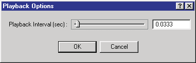
*Figure 2-69: The Playback Options dialog.*

### Calculation Options

Each calculation method (e.g., SIMON, EDVSM or EDVDS) may have one or more
calculation-specific options not included elsewhere in the HVE simulation
environment. An example is EDVDS: it has three tire modeling options. To
accommodate these options, HVE provides a Calculation Options dialog written
specifically for each reconstruction or simulation model. This dialog is
accessed from the Options menu.

See the [Calculation Options reference](../../10-calculation-options/README.md) for
code-verified descriptions of each model's Calculation Options dialog
(EDCRASH, EDGEN, EDHIS, EDSMAC, EDSMAC4, EDSVS, EDVDS, EDVSM, EDVTS and
SIMON).

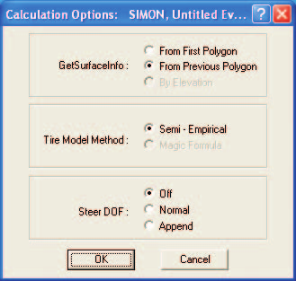
*Figure 2-70: A Calculation Options dialog.*

To view or edit the current Calculation Options, perform the following
steps:

1. Create an event in the Event Editor.

   > **NOTE:** You must be in Event mode to select the Calculation Options
   > dialog. In addition, the Calculation Options dialog is not selectable
   > unless an event has been created.

2. Choose *Calculation Options...* from the Options menu (Ctrl+J). The
   Calculation Options dialog for the current event will be displayed,
   showing the current value of each option (an example is shown in Figure
   2-70).
3. Set the desired options using the sliders, radio buttons or data fields
   provided by the dialog.
4. Choose *OK* to update the current Calculation Options.

### DyMESH Options

The DyMESH Options dialog (see Figure 2-71) provides access to various
options that help DyMESH under certain conditions. These conditions
generally arise when one mesh has extremely complex geometry (for example,
the inside of a front grill) and the mesh folds back on itself as it
crushes. In this and similar cases, the direction of vertex displacement
needs close scrutiny; the DyMESH Options provide that scrutiny.

> **NOTE:** See the Menu Reference, Options Menu, DyMESH Options for a
> detailed description of the DyMESH user options.

DyMESH simulations typically require a smaller integration timestep and
output interval. The DyMESH Options dialog includes convenient access to
those Simulation Options variables.

After creating an event, the DyMESH Options dialog is selected by choosing
*DyMESH...* from the Options menu.

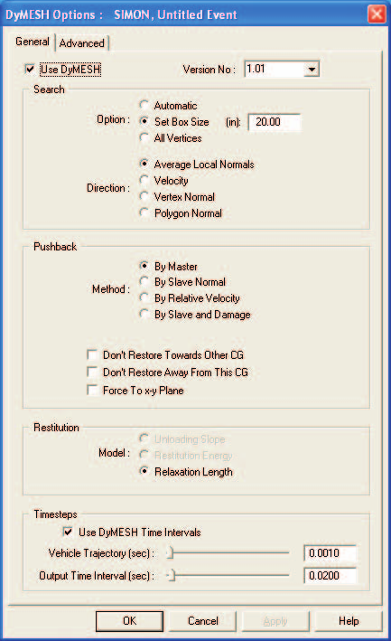
*Figure 2-71: The DyMESH Options dialog.*

### Get Surface Information

All vehicle simulation models (e.g., SIMON, EDVSM or EDVDS) must calculate
interaction forces between the tires and the terrain. This is accomplished
by the simulation's tire model. Various options are available for
calculating this interaction. The Get Surface Information dialog displays
these options (see Figure 2-72), selectable from the Options menu.

While a simulation is executing, during each integration timestep the tire
model searches through the database of terrain polygons to determine the
characteristics of the polygon beneath each tire. The Get Surface
Information dialog includes two options that affect this search:

- **Search Method** — There are three options:
  - *From First Polygon*: The search starts at the top of the polygon
    database for every timestep.
  - *From Previous Polygon*: The search starts by looking at the polygon
    found during the previous timestep. If it is not the correct polygon,
    the search spreads in both directions until the correct polygon is
    found.
  - *By Elevation*: The entire polygon database is searched. The polygon
    closest to the underside of the undeflected tire is selected.

  > **NOTE:** By Elevation is not implemented.

- **Search Direction** — Each polygon in the terrain has a surface normal
  whose direction is determined according to the right-hand rule. In
  general, it makes sense to be driving only on surfaces that have their
  normals facing upwards.
  - *All Directions*: Choose this option if you wish to include all terrain
    polygons, regardless of the direction of their surface normals. This
    option may be useful if the terrain includes ill-behaved surface normals
    (i.e., some normals pointing up, others pointing down).

    > **NOTE:** Choose this option if you are simulating a stunt driver
    > performing a loop-the-loop.

  - *Upward Facing Only*: Choose this option if you wish only to include
    terrain polygons with upward-facing normals. This is the most common
    situation.
  - *Z Component Greater Than*: This option allows the user to assign the
    range for polygon normals. It is useful when curbs with near-vertical
    faces are included in the polygon database.

    > **NOTE:** This option may be useful for the Radial Spring and Sidewall
    > Impact tire models.

    > **NOTE:** In a vertical face, the Z component should be exactly zero.
    > Because of rounding error when the surfaces were created, it is
    > possible that a vertical face may have a small Z component.

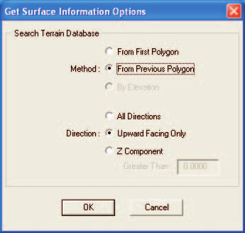
*Figure 2-72: The Get Surface Information Options dialog.*

To assign these options, perform the following steps:

1. Choose *Get Surface Info...* from the Options menu. The Get Surface
   Information dialog will be displayed, showing the current state of each
   option.
2. Click on the radio button to select the desired option.
3. Enter the range for surface normal Z Component, if applicable.
4. Choose *OK* to update the current Get Surface Information options.

### User Preferences

HVE allows the user to set certain preferences to customize his/her HVE
working environment. These preferences are saved when exiting HVE, so the
next time HVE is used, the environment will be the same. The Preferences
dialog is shown in Figure 2-73 (see the [User Preferences dialog
reference](../../01-user-interface/PrefDlg.md) for the current,
code-verified option list).

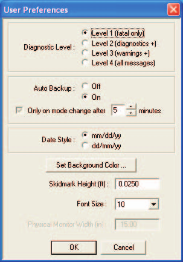
*Figure 2-73: The User Preferences dialog.*

The User Preferences dialog allows the user to set the following
preferences:

- **Warning Level** — The Warning Level radio button allows the user to set
  the types of messages produced by an event and displayed in its Messages
  output report. Three levels are provided:
  - *Level 1*: Only Fatal Errors (i.e., those that halt execution) are
    reported.
  - *Level 2*: Fatal Errors + Diagnostics (i.e., those messages alerting the
    user to a serious inconsistency, probably leading to erroneous results).
  - *Level 3*: Fatal Errors + Diagnostics + Informative (i.e., those
    messages alerting the user to a possible inconsistency which may or may
    not affect the quality of the results).

  *(updated: the Warning/Diagnostic Level selection has been removed from
  the current Preferences dialog.)*

- **Auto Backup** — The Auto Backup option allows the user to save his/her
  work at specified time intervals.

  > **NOTE:** The backup file is created only when the user changes modes.

- **Date Style** — The Date Style radio button allows the user to switch
  between the common style (month/day/year) and military or European style
  (day/month/year). This field affects the Environment Editor's Date of
  Accident field.
- **Background Color** — Displays a color wheel allowing the user to set the
  background color in the Human and Vehicle Editor viewers.
- **Skidmark Height** — Skidmarks must be placed above the road surface in
  order to be visualized. If placed too close to the surface, rendering
  errors will occur when the surface is viewed from a distance. If placed
  too high, the skidmarks will be visually incorrect. It is a good idea to
  place the skidmarks as low as possible to the terrain, while also ensuring
  they are properly rendered.
- **Font** — Allows the user to change the size of the font displayed in
  Numeric Report windows and also in printed output reports.

*(updated: the current Preferences dialog also includes a "Hide Date/Time
From Printed Reports" check box and Key Results display preferences; see the
[reference page](../../01-user-interface/PrefDlg.md).)*

To change the current User Preferences, perform the following steps:

1. Choose *Preferences...* from the Options menu (Ctrl+F). The User
   Preferences dialog will be displayed, showing the current status of each
   option.
2. Click on the radio buttons to change the Auto Backup status and Date
   Style.
3. If desired, edit the current skidmark height.
4. Choose *Background Color* to display the HVE color wheel. Click on the
   color wheel at the desired location, and use the intensity slider to set
   the lightness or darkness of the color.
5. If desired, change the current Font Size for output reports.
6. Choose *OK* to update the current User Preferences.

---

## Getting Help

HVE has an on-line help system which provides user assistance as well as
general information about human and vehicle dynamics and accident
reconstruction. HVE's Help System is described below.

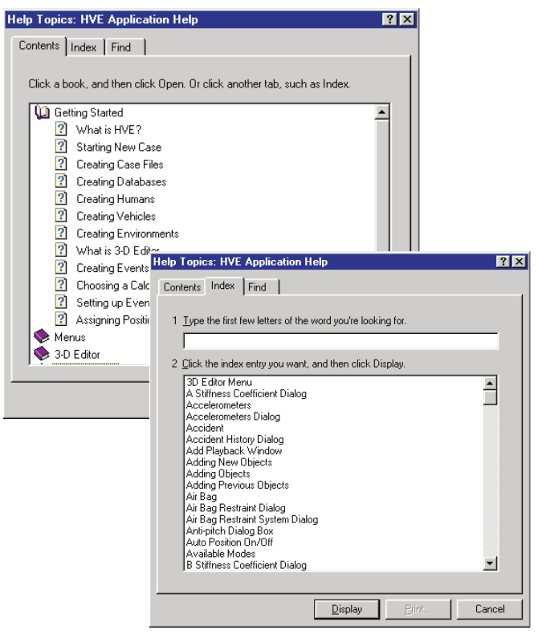
*Figure 2-74: The Help Contents/Index.*

### Help Topics

The HVE Help Topics provides an index for important terms related to the use
of HVE. In addition, the HVE Help Index includes portions of SAE J670e,
Vehicle Dynamics Terminology [6.2]; SAE J885, Human Tolerance To Impact As
Relates To Motor Vehicle Design [6.1]; SAE J224c, Collision Deformation
Classification [6.3]; and SAE J1675, Accident Reconstruction Terminology
[6.4] *(updated: J1675 has since been published)*.

To access the HVE Help Topics, perform the following steps:

1. Choose *Help Topics* from the Help menu. The Help Index dialog will be
   displayed (see Figure 2-74).
2. Choose an item from the list box. Follow the instructions in order to
   print out the help topic or to choose other topics.
3. Close the Help System when you are finished.

*(updated: the current Help menu also contains a "User Manuals" submenu with
direct access to the HVE, EDCRASH, EDGEN, EDHIS, EDSMAC, EDSMAC4, EDVDS,
EDSVS, EDVSM, EDVTS, SIMON, Damage Studio, GATB and ReadDataFile user
manuals, and an "Online Licensing" submenu with "Register User ID Code" and
"Refresh Licenses" items.)*

### Technical Support

The *Tech Support* option on the Help menu provides the user with important
information they will need to have available when contacting EDC for
technical support. This includes:

- User Name
- Company Name
- User ID Number

The Technical Support dialog also displays your system software and
licensing information. This includes:

- HVE Version
- System hardware codes (Hard Drive, EDKEY and License)
- License file information (Programs and Versions)

A sample Technical Support dialog is shown in Figure 2-75.

> **NOTE:** This information is required for assistance when contacting EDC
> Technical Support regarding licensing issues. The report may be copied to
> the system clipboard and pasted into an email to EDC Technical Support
> staff.

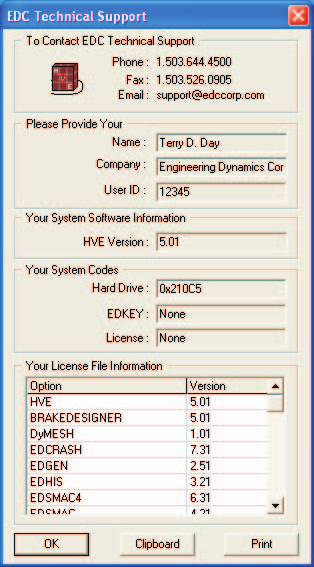
*Figure 2-75: The Technical Support Help dialog.*

### About

*About...* displays a dialog containing the current release information.
This information includes the following:

- Version Number
- Release Date and Time

The About HVE dialog is shown in Figure 2-76.

For more information about getting Help, refer to the Help Menu in the Menu
Reference section of this manual.

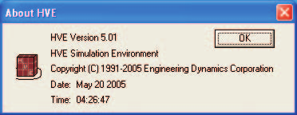
*Figure 2-76: The About HVE dialog.*

---

## Video Interface

One of HVE's most powerful features is its integrated video interface.

> **UPDATED:** This section of the 2006 manual described output to video
> tape recorders (VTR) and S-Video/Composite Video devices with
> NTSC/PAL-based recording. The current version of HVE instead creates
> digital video files and image frame sequences directly. The Video dialog
> is opened with *Video Creator...* on the File menu, or with the *Video
> Setup...* button in the Playback Information window. The current Video
> dialog provides:
>
> - **Movie** output — an AVI movie file, with a user-selected name and
>   output directory, an *Overwrite Existing Movie* option, a *Compressor*
>   selection (e.g., Cinepak Codec, Full Frames/uncompressed, or MPEG
>   compression with a selectable compression ratio), a *Recording Size*
>   selection (e.g., HDTV 1080p 1920x1080) and a *Recording Speed* slider
>   with a frames-per-second field (e.g., 30 frames/sec normal, or slow
>   motion rates).
> - **Frames** output — a sequence of individual image frames, with an
>   *Overwrite Existing Frames* option.
>
> The Playback Information window shows the current Format, Compressor,
> Recording Size and Recording Speed in its Recording Information panel.
>
> The original procedures are preserved below for users of legacy HVE
> versions; the *Source*/*Destination* concept in the Playback Controller
> still applies.

The interface includes two important tools:

- Video Device Output
- Video Compression

These tools are made available in the Video Set-up dialog (see Figure 2-77).
The following sections describe how to set up and use these tools.

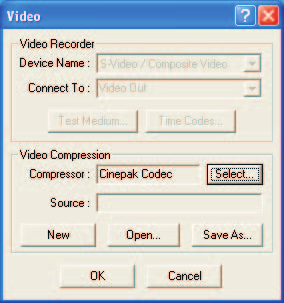
*Figure 2-77: The Video Set-up dialog.*

### Video Device Set-up

The HVE Video Interface provides for output to a video device, either a
video tape recorder (VTR) or S-Video/Composite Video. The video output
device allows the user to create real-time or slow-motion sequences and
route them to a video tape.

Before a video output device can be used, it must be installed. To install
the video device, perform the following steps:

1. Choose *Video Set-up* from the File menu *(updated: now "Video
   Creator..." on the File menu, or the "Video Setup..." button in the
   Playback Information window)*. The Video Set-up dialog will be displayed
   (see Figure 2-77).
2. Click on the Device Name option list and select a device from the list.

   > **NOTE:** Choose S-Video/Composite Video for real-time Video for
   > Windows (AVI) recording or for output to video tape.

3. Press *OK* to install the device.

The device is now ready for use. Use the HVE Playback Controller (part of
the Playback Editor) to record a simulation sequence to the video device.
This process is described next.

### Video Compression Set-up

If your computer system has hardware or software compression installed, the
compressed video output can be copied to and read from disk. Video
compression has two benefits:

- Entire sequences may be replayed from disk in real time. It is not
  necessary to record the sequence and play it back on a VCR before
  visualizing the sequence in real time.
- The sequence can be routed to the video device in real time.

Before a video compressor can be used, it must be installed. To install the
video compressor, perform the following steps:

1. Choose *Video Set-up* from the File menu. The Video Set-up dialog will be
   displayed (see Figure 2-77).
2. Click on the Compressor Type option list and select a compressor from the
   list.

   > **NOTE:** The user typically selects Full Frames (uncompressed) or
   > Cinepak Codec as the compressor.

3. Press *OK* to install the device.

The compressor is now ready for use.

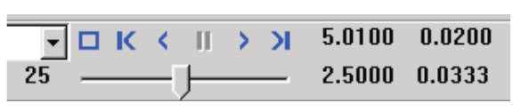
*Figure 2-78: The Playback Controller with video source and destination.*

### Recording A Video

After setting up the required video options, as described in the previous
section, the video devices are ready for use. To create real-time video
output to tape or disk, perform the following steps:

1. Create a simulation using the HVE Event Editor.
2. Combine and edit the event sequence(s) using the HVE Playback Editor.

From here, several options are available, including:

- Recording to disk using video compression
- Playing back compressed video from disk
- Real-time recording from disk to the video device
- Saving and replaying compressed video files

All these options involve using the Playback Controller (see Figure 2-78) to
select a video source and a video destination. These options are described
below.

#### Recording To Disk Using Video Compression

Using video compression, the simulation in the Playback Window may be routed
directly to the computer's hard disk, one frame at a time. To record the
current sequence in the Playback Window, perform the following steps:

1. Click on the *Source* option list (in the Playback Controller), and
   choose the current Playback Window as the source.
2. Click on the *Destination* option list and choose the current video
   compressor type (e.g., AVI Compressor) as the destination.
3. Press *Play*. The simulation in the Playback Window will be routed to the
   computer's hard disk, one frame at a time.

> **NOTE:** Recording to disk takes only slightly longer than normally
> displaying the sequence in the Playback Window.

#### Playing Back Compressed Video From Disk

After recording the sequence to disk, it may be replayed in real time in the
Playback Window. To play back the sequence in real time in the Playback
Window, perform the following steps:

1. Click on the *Source* option list (in the Playback Controller), and
   select AVI as the source.
2. Click on the *Destination* option list and choose the Playback Window as
   the destination.
3. Press *Play*. The simulation will be routed directly from disk to the
   Playback Window. The sequence will be displayed in real time.

#### Real-time Recording From Disk To The Video Device

*(legacy procedure — applies to video tape output in older HVE versions)*

After recording the sequence to disk, it may also be routed directly to a
special window designed to integrate with the computer's video subsystem for
routing to a video recording device.

To record the sequence in real time, perform the following steps:

1. Click on the *Source* option list (in the Playback Window), and choose
   AVI as the source.
2. Click on the *Destination* option list and choose the video recording
   device (i.e., S-Video/Composite Video) as the destination.
3. Activate the computer's video subsystem.
4. Press the *Play* button on the Playback Controller to activate the
   special playback window.
5. Press the VCR's record button to begin recording.
6. Press *Play*. The simulation will be routed directly from disk to both
   the video recording device and the Playback Window. The sequence will be
   recorded and displayed in real time.

#### Saving and Replaying Compressed Video Files

HVE routes compressed images to a default file, named
`default.<compressor type>` (e.g., `default.avi`). This file may be saved
and played back at a later date. *(updated: in the current Video dialog the
user chooses the movie filename and output directory directly.)* To save the
current file, perform the following steps:

1. Choose *Video Set-up* from the File menu. The Video Set-up dialog will be
   displayed.
2. Choose *Save As*. A file selection dialog will be displayed, showing a
   list of previously saved files.
3. Enter a new filename or choose an existing one and press *OK*.

   > **NOTE:** If an existing file is selected, HVE will ask if you wish to
   > overwrite the existing file.

To replay a previously saved compressed file, perform the following steps:

1. Choose *Video Set-up* from the File menu. The Video Set-up dialog will be
   displayed.
2. Choose *Open*. A file selection dialog will be displayed, showing a list
   of previously saved files.
3. Choose a filename and press *OK*. The selected filename will be displayed
   as the compressed source file.
4. In the Playback Window, click on the *Source* option button and choose
   the compressed filename as the source.
5. Press *Play* to display the previously saved file.

For more information about using video, refer to Section Nine, Video Output.

---

*End of Chapter 2. Return to the [section table of contents](README.md).*

<!-- NAV -->

---

← Previous: [Chapter 2: How To Use HVE — Part B](02b-how-to-use-hve.md)  |  [Index](README.md)

<!-- /NAV -->
