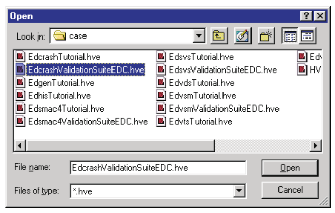
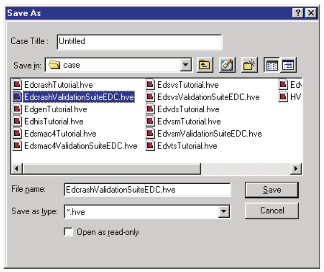
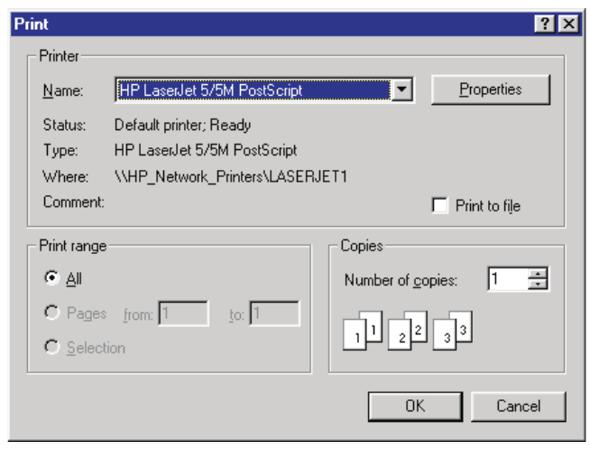
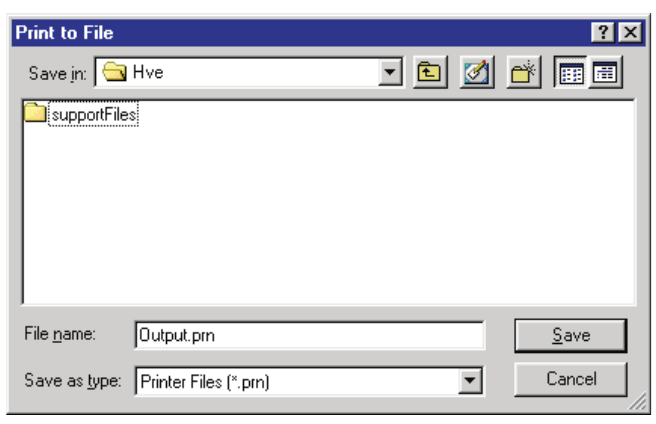
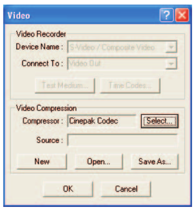
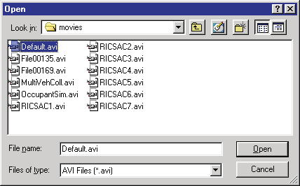

# Chapter 3: File Menu

*HVE User's Manual — Section Two: Menu Reference. Updated edition, verified against current HVE source code (HVEINV-64).*

The File Menu includes the following options:

- **New** — Begin a new case
- **Open** — Open a previously saved case file for review and editing
- **Save** — Save the current case file
- **Save As** — Save the current case file using a different filename
- **Export Preview Case** — Export the current case for use in HVE Preview Mode *(updated: added since the 2006 manual)*
- **Print** — Route the currently selected report window to a printer or plotter
- **Print All** — Route all of the currently selected report windows to a printer or plotter
- **Video Creator** — Create video output from a Playback window *(updated: replaces the former "Video Set-up" option)*
- **Export** — Export variable output results to a file *(updated: added since the 2006 manual)*
- **FBX Export** — Export the simulation as an FBX 3-D animation file *(updated: added since the 2006 manual)*
- **Recent File List** — Displays the last few cases worked on by the user
- **Exit** — End the current HVE session

These options allow the user to perform basic case file operations, as well as interfacing with peripheral devices. Each of these options is explained in this chapter.

---

## NEW

**Menu Option:** NEW (Ctrl+N)

**Purpose:** Start a new case

**Description:** If the user is currently working on a case, choosing New from the HVE File Menu allows the user to close the current case (with or without saving it) and begin a new case. Choosing New also causes HVE to remove all current humans, vehicles and the environment, and start fresh, as if you had just started a new HVE session.

**See Also:** Open, Save, Save As

---

## OPEN

**Menu Option:** OPEN (Ctrl+O)

**Purpose:** Open an existing case

**Description:** Choosing Open allows the user to load a previously created case into HVE. The user may simply review prior results, create new outputs or add new events with new humans and vehicles. The user may also change the environment and re-execute each event. The main purpose of opening a previous case is to extend the user's previous work.

**To Open an Existing Case:**

1. Choose File from the Menu Bar. The File menu is displayed.
2. Choose Open. The Case File Selection dialog will be displayed.
3. Select the filename of the previously created case.
4. Press Open.

The selected case will be loaded and ready for further work.

*Figure 3-1: Use the Case File Selection dialog to open existing cases.*

**See Also:** Case Files, Save, Save As

---

## SAVE

**Menu Option:** SAVE (Ctrl+S)

**Purpose:** Save the current case

**Description:** Choosing Save from the HVE File Menu allows the user to save the current status of the case on the computer's disk storage system. This case file may then be loaded using Open. The practice of frequently saving the case file is also encouraged in order to protect against loss of information in the event of a computer hardware or software malfunction.

> **NOTE:** If the current case has not been saved previously, HVE will display the Save As dialog.

**See Also:** Save As, Open

---

## SAVE AS

**Menu Option:** SAVE AS

**Purpose:** Save the current case using a user-specified filename

**Description:** Choosing Save As from the HVE File Menu allows the user to save the current status of the case on the computer's disk system according to a user-specified filename. This case file may then be opened at a later date for review and/or editing of the case file contents.

Choosing Save As also allows the user to enter or edit the Title of the current case file.

> **NOTE:** The Title is displayed as a heading on all HVE output reports.

*Figure 3-2: Save As Case Files dialog.*

**To Save an Existing Case by a User-specified Filename:**

1. Choose File from the Menu Bar. The File menu is displayed.
2. Choose Save As. The Case File Selection dialog will be displayed.
3. Enter the filename.
4. Optionally, enter a Case Title.
5. Press Save.

The case will be saved. In addition, the Case Title and filename will be displayed in the HVE Main Menu Bar.

**See Also:** Save, Open

---

## EXPORT PREVIEW CASE

*(updated: this option was added after the 2006 manual)*

**Menu Option:** EXPORT PREVIEW CASE

**Purpose:** Export the current case in a form that can be opened by users running HVE in Preview Mode

**Description:** Choosing Export Preview Case saves a copy of the current case for review by other users using the free HVE Preview Mode (playback-only) configuration. This allows colleagues or clients who do not have a full HVE license to view the case and its results.

---

## PRINT

**Menu Option:** PRINT (Ctrl+P)

**Purpose:** Print the current object

**Description:** Choosing Print allows the user to print the contents of the selected Playback window. The Print Dialog is displayed, allowing the user to choose from the selected printer's possible print options by pressing the Properties button.

Selecting the check box for Print to file causes a File Selection Dialog to be displayed (see Figure 3-4), prompting the user for a filename. The File Selection dialog also includes a Save as type option list. Choose the desired format, enter a filename and press Save. The selected results are routed to a file according to the selected format and filename.

*Figure 3-3: Use the Print Dialog to select the printer you wish to use. The Print Dialog also allows you to route output to a file. Routing selected Variable Output results to a file allows you to export the simulation results to other programs.*

*Figure 3-4: Print to File Selection dialog.*

The following Playback windows may be printed:

- Accident History
- Audit Trail
- Damage Data
- Damage Profiles
- Driver Data
- Environment Data
- Event Data
- Human Data
- Injury Data
- Messages
- Momentum Diagram
- Program Data
- Site Drawing
- Variable Output Table
- Vehicle Data

> **NOTE:** Because the width of some reports (especially Variable Output) can vary, you should experiment to determine which page layout works best for a particular report.

The availability and contents of each report is calculation model-dependent. To print any of these windows, perform the following steps:

1. Using the HVE Event Editor, create the desired event(s).
2. Using the HVE Playback Editor, add a Report Window containing the desired report.
3. If there is more than one report displayed in the Playback Editor, choose the desired report by clicking on its dialog header, making it the current window.

   > **NOTE:** The current window pops to the top of the desktop.
4. Choose Print. The Print dialog (see Figure 3-3) is displayed.
5. Select the available print options as described above.
6. Press OK to print the selected output report.

> **NOTE:** The selected report is printed on the system printer. Use the Windows Control Panel for information about selecting and configuring your system printer.

In addition to the above output windows available in Playback Mode, the Vehicle Editor contains many printable graphs, including:

- Anti-pitch vs Wheel Jounce/Rebound
- Camber vs Wheel Jounce/Rebound
- Half-track Change vs Wheel Jounce/Rebound
- Engine Power vs Speed
- Tire Fx vs Longitudinal Slip
- Tire Fy vs Slip Angle
- Tire Fy vs Camber Angle
- Tire Rolloff vs Slip

### Exporting Results

The Print option provides a powerful, general purpose export utility for HVE simulation results. Exporting of any simulation results is easily accomplished using the Print option.

To export the desired results, perform the following steps:

1. Create a Variable Output report containing the desired results.
2. Select the File menu and choose Print. The Print dialog is displayed.
3. Choose Print To File.
4. Change the current printer name to Generic / Text Only.

   > **NOTE:** If a Generic / Text Only printer is not included in the list of printers, you will need to install a Generic / Text Only printer using your Windows installation media.
5. Press OK. The Print To File dialog is displayed (see Figure 3-4).
6. Enter the desired filename.

   > **NOTE:** The .txt extension is typically used.
7. Press OK. The selected report is saved in the /hve directory according to the requested filename.

The selected results are printed to the selected filename.

> **NOTE:** Refer to the documentation for the target program (e.g., Excel) for information about importing results into that program.

*(updated: the current File menu also provides a dedicated **Export** option that displays the Export Variables dialog, writing selected variable output directly to a file without going through the printer subsystem — see the Export section below.)*

**See Also:** Playback Editor, Vehicle Editor, Variable Output, Variable Selection

---

## PRINT ALL

**Menu Option:** PRINT ALL

**Purpose:** Print all current objects

**Description:** Choosing Print All allows the user to print all open Report Windows in Playback Mode using the same functionality described for the Print menu option. The Print Dialog is displayed, allowing the user to choose from the selected printer's possible print options by pressing the Properties button.

> **NOTE:** Print All only prints text reports and viewer windows that the user has open in Playback Mode.

**See Also:** Print

---

## VIDEO CREATOR

*(updated: the 2006 manual documented a "Video Set-up" option based on the legacy Video for Windows recorder/compressor interface. In the current version this has been replaced by the **Video Creator** option, which opens a dedicated Video Creator window used to produce video files (e.g., AVI) directly from a Playback window. The original Video Set-up description is retained below for reference.)*

**Menu Option:** VIDEO CREATOR (formerly VIDEO SET-UP)

**Purpose:** Set up and select various video output options

**Description (legacy Video Set-up):** Selecting Video displays the Video Set-up dialog, allowing the user to choose various video output options. These options are used during Playback Mode when routing a Playback window to the video output device. The available devices were:

- Video Recorder (pre-set to S-Video/Composite Video)
- Video Compressor

*Figure 3-5: Use the Video Set-up Dialog to install video devices and compressors. The Video Set-up dialog is also used for loading and saving compressed video files.*

### Installing a Video Compressor

To install a video compressor, choose the appropriate compressor from the Compressor option list. This list will be different for every computer, depending on the codecs (COmpressor-DECompressor) provided with the Windows operating system and/or other video-related optional software programs.

*Figure 3-6: Compressed Video File Selection dialog allows the user to open and save video files using the video compression system.*

The typical choice when creating a Video for Windows (AVI) movie is the Full Frame (Uncompressed) or the Cinepak codec.

> **NOTE:** If you have installed a custom video sub-system, you should use the compressor that is recommended for that sub-system.

### Opening and Saving Video Files

HVE always routes the compressed video to a default file. To save this file, choose Save As using the Video Set-up dialog (see Figure 3-6). HVE will display a file selection dialog listing all the current compressed files. Choose an existing file or enter a new filename.

> **NOTE:** If you choose an existing file, HVE will ask you if you wish to replace it.

The Video Set-up dialog also allows the user to play previously saved video files. To play a previously saved file, choose Open; then choose the desired file for replay. The Video File Selection dialog, used for saving and opening video files, is shown in Figure 3-6.

**See Also:** Playback Editor, Playback Controller, Playback Source and Destination, Video Tools

---

## EXPORT

*(updated: this option was added after the 2006 manual)*

**Menu Option:** EXPORT

**Purpose:** Export variable output results to a file

**Description:** Choosing Export displays the Export Variables dialog, which allows the user to select simulation output variables and write them directly to a data file (e.g., for import into a spreadsheet). When the export completes, the output pathname of the written file is displayed in the status bar.

---

## FBX EXPORT

*(updated: this option was added after the 2006 manual)*

**Menu Option:** FBX EXPORT

**Purpose:** Export the simulation to an FBX file

**Description:** Choosing FBX Export displays the FBX Export dialog, which allows the user to export the current event's environment geometry and animated vehicle motion as an Autodesk FBX file for use in third-party 3-D animation and visualization packages.

---

## RECENT FILE LIST

**Menu Option:** (most recently used case files)

**Purpose:** Quickly reopen a recent case

**Description:** The File menu displays the last few cases worked on by the user. Choosing a filename from this list opens that case, exactly as if it had been selected using the Open option.

---

## EXIT

**Menu Option:** EXIT

**Purpose:** End the current HVE session

**Description:** Choosing Exit allows the user to end the current HVE session. HVE asks the user to save any changes made to the case since it was last saved. If the user chooses to save a case that has not been previously saved, HVE will display the Save As dialog.

**See Also:** New, Open, Save, Save As

<!-- NAV -->

---

← Previous: [HVE User's Manual — Section Two: Menu Reference](README.md)  |  [Index](README.md)  |  Next: [Chapter 4: Set-up Menu (Part A — Position/Velocity, Driver Controls)](04a-setup-menu.md) →

<!-- /NAV -->
