# Chapter 4: Set-up Menu (Part A — Position/Velocity, Driver Controls)

*HVE User's Manual — Section Two: Menu Reference. Updated edition, verified against current HVE source code (HVEINV-64). This chapter is split into two files: Part A covers Position/Velocity and Driver Controls; [Part B](04b-setup-menu.md) covers Damage Profiles through Contacts, plus the newer Signals and Notes options.*

The Set-up menu is used by HVE's Event Editor. The Event Editor uses the Set-up menu for setting up events prior to execution.

The Set-up Menu includes the following options:

- **Position/Velocity** (Ctrl+P) — Allows the user to assign positions and velocities for each human and vehicle
- **Driver Controls** (Ctrl+D) — Allows the user to assign vehicle driver controls
- **Damage Profiles** (Ctrl+M) — Allows the user to assign vehicle damage profiles
- **Collision Pulse** (Ctrl+U) — Allows the user to assign vehicle collision pulses
- **Vehicle Mesh** — Allows the user to assign vehicle mesh options
- **Payload** — Allows the user to assign vehicle payloads
- **Wheels** (Ctrl+W) — Allows the user to assign vehicle tire blow-outs, wheel displacements, and brake adjustment and temperature
- **Accelerometers** — Allows the user to assign vehicle accelerometer locations
- **Contacts** (Ctrl+T) — Allows the user to select and remove interactions between selected human ellipsoids and vehicle contact surfaces
- **Restraints** (Airbags Ctrl+G, Belts Ctrl+B) — Allows the user to assign belt and airbag usage factors
- **Signals** — Allows the user to set up traffic signals for the current event *(updated: added since the 2006 manual)*
- **Notes** — Allows the user to attach text notes to the current event *(updated: added since the 2006 manual)*

This chapter explains how to use each of these options to supply various event-related inputs for humans and vehicles. Before supplying these inputs, a human or vehicle must first be selected. To select a human or vehicle, use one of the following methods:

- Select the desired human or vehicle from the Event Editor's Humans and Vehicles list, or
- Click on the desired human or vehicle.

> **NOTE:** Since trailers are not included in the Event Humans and Vehicles list, the latter method must be used for selecting trailers.

---

## POSITION/VELOCITY

**Menu Option:** POSITION/VELOCITY (Ctrl+P)

**Purpose:** Assign position and velocity for the selected human or vehicle

**Description:** Selecting Position/Velocity from the Set-up Menu allows the user to assign positions and velocities for each human and vehicle in the current event. See also the code-verified dialog reference: [Position/Velocity Dialog Box](../../09-events-driver-controls/PosVelDlg.md).

Positions and velocities may be entered for each of the following path locations:

- **Initial** — Position and velocity of the selected human or vehicle at the beginning of execution
- **Begin Perception** — Position and velocity of the selected human or vehicle at the beginning of perception (normally the initial part of the perception/reaction period for a driver about to begin an accident avoidance maneuver)
- **Begin Braking** — Position and velocity of the selected human or vehicle when the brakes are applied
- **Impact** — Position and velocity of the selected human or vehicle at the time of impact
- **Separation** — Position and velocity of the selected human or vehicle at the time of separation
- **Point-on-curve** — Position and velocity of the selected human or vehicle on a curved path following separation
- **End-of-rotation** — Position and velocity of the selected human or vehicle at the end of the rotating/lateral skidding phase
- **Final/rest** — Position and velocity of the selected human or vehicle at the end of the post-impact path

> **NOTE:** The human or vehicle need not have a zero velocity at this point. For example, the Final/rest position of a vehicle may be at the point of impact with a tree; the vehicle's velocity might be 20 mph at this point.

The position(s) and velocities required by the current reconstruction or simulation model vary from model to model. Refer to the User's Manual for the particular reconstruction or simulation program for a list of positions and velocities used by the model (see also Target Positions later in this section).

### Coordinate System

Positions and velocities are assigned according to SAE Recommended Practice SAE J670e. In this coordinate system, the Z axis points down (in the direction of the gravity vector). See Appendix III and reference 6.2 for details.

### Rotation Direction

According to the SAE coordinate system, rotation direction is defined using the right-hand rule. Thus, positive rotation is clockwise about a given axis. For example, looking down on the X-Y plane from above, a vehicle turning right will have a positive rotation direction.

It follows that the coordinate system convention has implications when entering a sequence of positions (e.g., Impact, Separation, Rest). When two successive positions are entered, the direction of rotation is defined by the difference in the heading angles. For example, if the heading angle at impact, Ψimp, is 35 degrees and the heading angle at rest, Ψrest, is 80 degrees, then the difference from impact to rest is Ψrest − Ψimp = 80 − 35 = +45 degrees. The positive sign indicates the direction of rotation from impact to rest is positive (i.e., clockwise). In general, any rotation direction is defined as follows:

> ΔΨ = Ψn − Ψn−1

where:

- *n* = a position in a sequence of positions (e.g., rest)
- *n−1* = the previous position in a sequence of positions (e.g., impact)

If ΔΨ is positive, the direction is clockwise; if ΔΨ is negative, the direction is counter-clockwise. The above applies to roll and pitch rotations as well as yaw (heading angle) rotations.

> **NOTE:** This definition is especially important to EDVAP/EDCRASH users. In that earlier program, the direction of rotation was entered directly by the user as 'Clockwise' or 'Counter-clockwise' or 'None'. In HVE, the direction of rotation is not entered directly; it is determined as shown above.

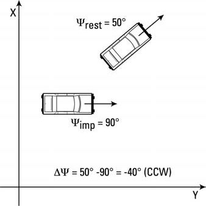
*Figure 4-1: Examples of rotation direction for various position sequences.*

To supply an object's position and velocity, perform the following steps:

1. Select the human or vehicle from the Event Editor dialog.
2. Choose Position/Velocity from the Set-up menu. The Position/Velocity dialog will be displayed (see Figure 4-2).
3. Click on the Path Location option list and select the desired location instance (e.g., Initial or Impact). The object will appear at its current location.

   > **NOTE:** The default location is the origin.
4. Position the human or vehicle. Two different methods are available:
   - Enter the position and orientation data using the Position/Velocity dialog, or
   - Use the manipulators attached to the selected human or vehicle to drag the object to the desired location.
5. If desired, click on the Velocity is Assigned checkbox and enter the velocity using the Position/Velocity dialog.

Perform the above steps for the selected vehicle at each desired position instance. Each of these steps is described in detail in the next section.

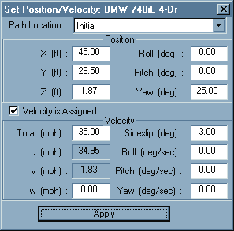
*Figure 4-2: The Position/Velocity dialog is used for assigning positions and velocities for humans and vehicles.*

### Position/Velocity Dialog

When a human or vehicle is selected for positioning, its Position/Velocity dialog is displayed. The Position/Velocity dialog (see Figure 4-2) allows the user to enter the position and velocity according to the following protocol:

- **Single vehicles**, and the tow vehicle of vehicle-trailer combinations, are positioned relative to the earth-fixed coordinate system. X,Y,Z linear positions and roll, pitch, yaw orientations may be entered. Total velocity and sideslip angle are entered. Vertical velocity may be entered for 3-D models. For the user's reference, the forward and lateral velocity are calculated and displayed.
- **Trailers and dollies** are positioned relative to the vehicle pulling them; thus only relative roll, pitch and yaw positions and velocities are required.

  > **NOTE:** Trailer and dolly names are not displayed in the selected objects list. To select a trailer or dolly, click on the desired object in the viewer.
- **Human occupants** are positioned using the CG of the pelvis segment, and are positioned relative to the vehicle-fixed coordinate system. x,y,z linear positions and roll, pitch, yaw orientations of the pelvis may be entered. i,j,k linear velocities and roll, pitch, yaw angular velocities are entered relative to the pelvis segment's local coordinate system.
- **Human pedestrians** are positioned using the CG of the pelvis segment, and are positioned relative to the earth-fixed coordinate system. X,Y,Z linear positions and roll, pitch, yaw orientations of the pelvis may be entered. i,j,k linear velocities and roll, pitch, yaw angular velocities are entered relative to the pelvis segment's local coordinate system.
- For both human occupants and pedestrians, segments other than the pelvis are positioned using joint articulation angles relative to the upstream (i.e., closer to the pelvis) adjoining segment; thus only relative roll, pitch and yaw positions and velocities are required.

> **NOTE:** 2-D, yaw plane models do not use Z, roll or pitch information. HVE will automatically make these fields non-user-editable and calculate the values using AutoPosition.

### Direct Manipulation

When a human or vehicle is selected for positioning, a set of manipulators is attached to it. These manipulators may be used to drag the human or vehicle to the desired location using the mouse.

> **NOTE:** This action is referred to as "drag-and-drop."

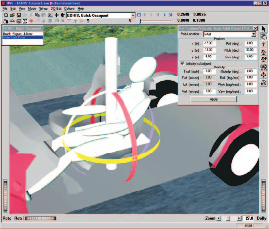
*Figure 4-3: The Position Manipulator for humans has a set of controls (a) that move the human in the x-y plane, a vertical manipulator (b) for moving the human vertically, and a set of roll, pitch and yaw manipulators (c, d and e, respectively) for orienting the human.*

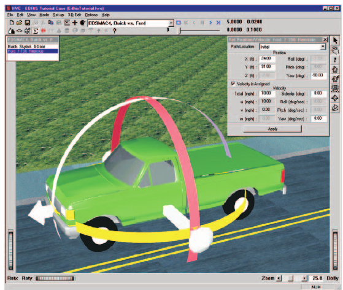
*Figure 4-4: The Position Manipulator for vehicles has a set of controls (a) that move the vehicle in the X-Y plane and a set of roll, pitch and yaw manipulators (b, c and d, respectively) for orienting the vehicle. Vehicle elevation (Z) is assigned using the Position/Velocity dialog.*

The object has separate manipulators for translation and rotation. The translation manipulator is a set of cross-bars which lie in the X-Y plane. This manipulator may be used to drag the human or vehicle to the desired X,Y coordinates. The Z coordinate is entered using the Position/Velocity dialog.

> **NOTE:** If AutoPosition is on, vehicle elevation will be determined automatically according to the elevation of the earth.

The rotation manipulator is a set of three bands which rotate the object about the x axis (roll), y axis (pitch) and z axis (yaw). To use the rotation manipulator, click on the desired band and drag it around its axis to cause the object to rotate.

Figures 4-3 and 4-4 show the human and vehicle manipulators, respectively.

### Target Positions

Any of the eight positions (e.g., Initial, Impact, or Separation) may be assigned to the selected human or vehicle. It is even possible to assign a position that is not actually used by the current calculation model. For example, the user may enter a vehicle rest position for a simulation program. Positions which are entered but not used are called target positions because they provide visual feedback to the user regarding how close the simulated path matches the desired path.

> **NOTE:** Target humans and vehicles are translucent, to distinguish them from positions which are used by the model.

In general, simulation-type models require only initial positions and velocities. Reconstruction-type models normally require positions at impact and rest. The reconstruction or simulation model knows which positions are actually used by the model and reports this information back to HVE so targets are correctly displayed.

Target positions are also used to define the path for the HVE Path Follower (see Driver Controls, Path Follower, for more information).

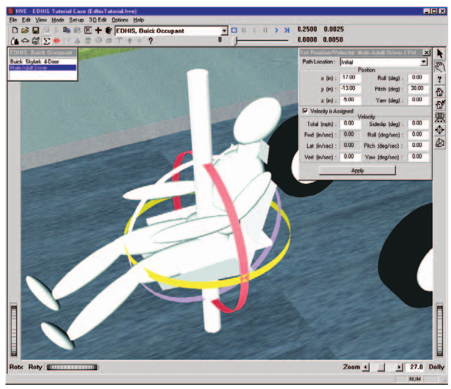
*Figure 4-5: Positioning humans inside of vehicles.*

### Positioning Humans in Vehicles

While positioning a human occupant inside a vehicle, the vehicle becomes transparent to assist in positioning.

> **NOTE:** Although it is not required, it makes sense to position the vehicle before positioning its occupant; otherwise you'll have no visual reference point to use while positioning the human occupant.

> **NOTE:** You might wish to remove the vehicle's exterior body from the vehicle for positioning humans in occupant simulations. To do this, use the Vehicle 3-D Geometry File Selection dialog, and choose NoBody.h3d. This is illustrated in Figure 4-5. See Vehicle Editor for more information.

### Deleting Humans and Vehicles

Any of the eight position instances (i.e., Initial, Begin Braking, Impact, etc.) may be deleted by clicking on the human or vehicle in the viewer and choosing Delete. Only the selected instance is deleted.

**Parameters:** The parameters assigned using this dialog are shown in Table 4-1.

**Table 4-1: Parameters assigned using the Position/Velocity dialog**

| Parameter | Unit Name | Description |
|---|---|---|
| X,Y,Z or x,y,z | Ut\*DispLength | Linear distance from earth-fixed origin (vehicles and human pedestrians) or vehicle-fixed origin (human occupants) |
| Roll, Pitch, Yaw | Ut\*DispAngle | Angular displacement about the vehicle-fixed z, y and x axes (in that order) or human segment-fixed z, y and x axes (again, the order is important). For trailers and human segments other than the pelvis, these angles are articulation angles relative to the upstream vehicle or human segment. |
| Fwd, Lat, Vert velocity | Ut\*VelLinear | Linear velocity components in the vehicle-fixed or human segment-fixed forward, lateral and vertical directions |
| Roll, Pitch, Yaw velocity | Ut\*VelAngular | Angular velocities about the vehicle-fixed z, y and x axes or human segment-fixed z, y and x axes. For trailers and human segments other than the pelvis, these are relative to the upstream segment. |

\* UtVeh for human occupants, UtEnv for human pedestrians and vehicles.

**See Also:** Event Set-up, Targets, User's Manual for selected reconstruction or simulation model

---

## DRIVER CONTROLS

**Menu Option:** DRIVER CONTROLS (Ctrl+D)

**Purpose:** Assign Throttle, Braking, Steering, Gear Selection and Wheel Data for the selected vehicle

**Description:** Selecting Driver Controls from the Set-up Menu allows the user to enter parameters which describe how the driver attempted to control the vehicle. See also the code-verified dialog references: [Driver Controls](../../09-events-driver-controls/DriverControls.md) and its sub-pages for [Throttle](../../09-events-driver-controls/DriverControls4.md), [Brake](../../09-events-driver-controls/DriverControls3.md), [Steering](../../09-events-driver-controls/DriverControls.md), [Gear](../../09-events-driver-controls/DriverControls5.md), [Path Follower](../../09-events-driver-controls/DriverControls7.md) (with [Method](../../09-events-driver-controls/DriverControls1.md), [Speed Follower](../../09-events-driver-controls/DriverControls8.md) and [Neuro-muscular Filter](../../09-events-driver-controls/DriverControls6.md) tabs) and [Wheel Data](../../09-events-driver-controls/DriverControls2.md).

> **NOTE:** The word "attempted" is important here. Although a driver may attempt a certain level of braking or steering, the vehicle may not necessarily respond to those inputs due to limitations in the available frictional force at the tire-road interface.

The available driver controls are:

- **Throttle Table** — Applies longitudinal tire forces that attempt to accelerate the vehicle.
- **Brake Table** — Applies longitudinal tire forces that attempt to slow the vehicle.
- **Steer Table** — Applies steer angles that attempt to steer the vehicle.
- **Gear Selection Table** — Applies gear selections that change the current transmission or differential ratio.
- **Path Follower** — Allows the vehicle simulation to determine the required steering, throttle and braking inputs required to follow a user-defined path.
- **Wheel Data** — Applies constant wheel forces and steer angles.
- **Lights** — Assigns vehicle exterior light states (e.g., headlights, brake lights, turn signals) during the event. *(updated: added since the 2006 manual — see [Driver Controls](../../09-events-driver-controls/DriverControls.md))*

The Driver Controls options are described below.

### Throttle Table

Throttle controls are available for simulations, and are used to accelerate the vehicle. Three methods of throttle control tables are available:

- Percent Wide-open Throttle (WOT)
- Tractive Effort
- Percent Available Friction

#### Percent Wide-Open Throttle (WOT)

This method allows the user to enter a table of throttle position versus time, as shown in Figure 4-6. The resulting table determines how much engine power is applied. An entry of 100 percent applies a drive torque associated with 100 percent of the current vehicle's engine power at the current engine speed.

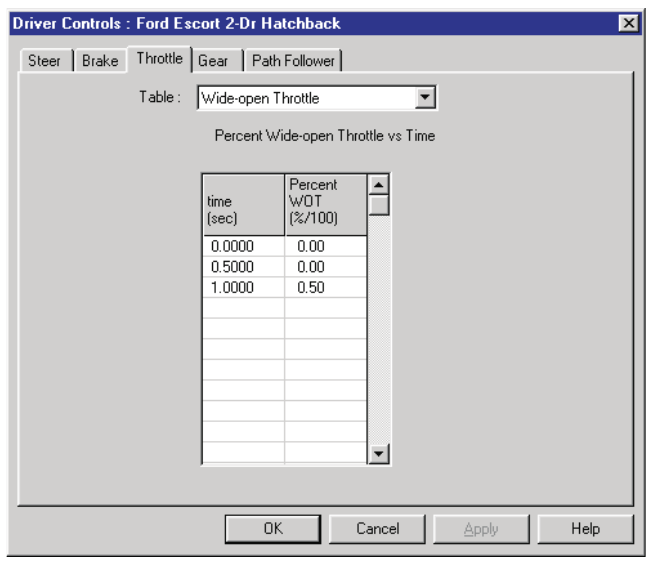
*Figure 4-6: The Throttle Table, Percent Wide-open Throttle option, allows the user to enter a table of throttle position vs time for the selected vehicle.*

> **NOTE:** The Percent Wide-open Throttle method is available only if the current simulation includes an engine model with the ability to calculate drive torque according to the current engine speed and throttle position.

To enter a Throttle table for the current vehicle using the Percent Wide-open Throttle method, use the following steps:

1. Select the vehicle.
2. Choose Driver Controls from the Set-up menu.
3. Choose Throttle from the cascade menu. The Throttle Table will be displayed.
4. Choose Percent Wide-open Throttle from the Table Is option list. The table will be displayed.
5. Enter the table of times and throttle positions.
6. Press OK when the table is complete.

#### Tractive Effort

This method allows the user to enter a table of tractive effort (total force accelerating the vehicle) versus time, as shown in Figure 4-7. The resulting table determines how much accelerating force is applied at each drive wheel.

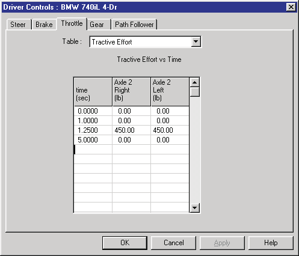
*Figure 4-7: Vehicle Throttle Table dialog, Tractive Effort option.*

> **NOTE:** The Tractive Effort Table allows entries only at the vehicle's drive wheels, as specified by the Vehicle Information dialog.

To enter a Throttle table for the current vehicle using the Tractive Effort method, use the following steps:

1. Select the vehicle.
2. Choose Driver Controls from the Set-up menu.
3. Select Throttle from the cascade menu. The Throttle Table will be displayed.
4. Select Tractive Effort from the Table Is option list. The table will be displayed.
5. Enter the table of times and tractive effort forces for each drive wheel.
6. Press OK when the table is complete.

#### Percent Available Friction

This method allows the user to enter a table of available friction force (percentage of the total available frictional force accelerating the vehicle) versus time, as shown in Figure 4-8. The resulting table determines how much accelerating force is applied at each drive wheel. The calculations are performed by the simulation model, which multiplies the entered value by the currently available tire friction and vertical tire load.

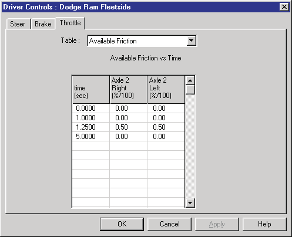
*Figure 4-8: Vehicle Throttle Table dialog, Percent of Available Friction option.*

> **NOTE:** The Percent Available Friction Table only allows entries at drive wheels, as specified by the Vehicle Information dialog.

To enter a Throttle table for the current vehicle using the Percent Available Friction method, use the following steps:

1. Select the vehicle.
2. Choose Driver Controls from the Set-up menu.
3. Choose Throttle from the cascade menu. The Throttle Table will be displayed.
4. Choose Percent Available Friction from the Table Is option list. The table will be displayed. *(updated: the original manual mistakenly repeated "Tractive Effort" here)*
5. Enter the table of times and friction percentages for each drive wheel.
6. Press OK when the table is complete.

**Parameters:** The parameters assigned using the Throttle Table dialog are shown in Table 4-2.

**Table 4-2: Throttle Table Parameters**

| Parameter | Unit Name | Description |
|---|---|---|
| Time | UtVehTime | Time associated with the current level of throttle input |
| Throttle Input | UtVehPercent or UtVehForce | Current value for throttle input |

### Brake Table

Brake controls are available for simulations. Three methods are available:

- Pedal Force
- Wheel Force
- Percent Available Friction

#### Pedal Force

This method allows the user to enter a table of brake pedal force versus time, as shown in Figure 4-9. The resulting table determines how much brake torque is applied at each wheel. The brake torque at each wheel is the product of the entered table value, master cylinder ratio, proportioning rate and wheel brake torque ratio.

> **NOTE:** This method is available only if the current simulation includes a brake model with the ability to calculate brake torque according to the brake system parameters and brake pedal force.

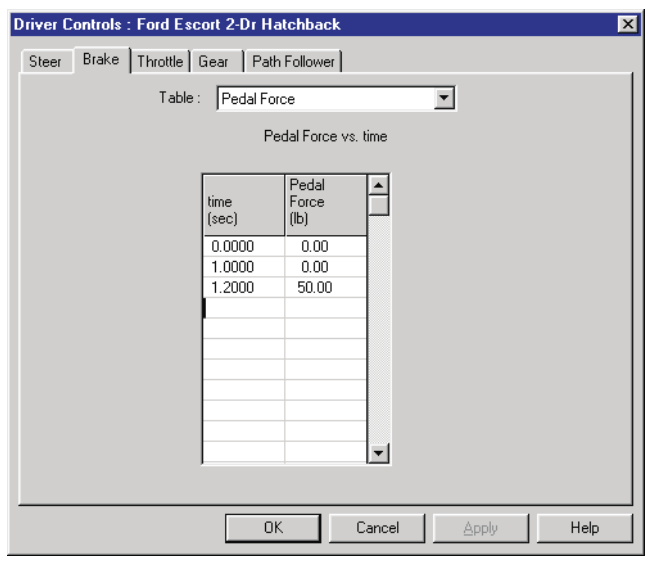
*Figure 4-9: The Brake Table, Pedal Force option, allows the user to enter a table of brake pedal force vs time for the selected vehicle.*

To enter a brake table for the current vehicle using the Pedal Force option, use the following steps:

1. Select the vehicle.
2. Choose Driver Controls from the Set-up menu.
3. Choose Brakes from the cascade menu. The Brake Table will be displayed.
4. Choose Pedal Force from the Table Is option list. The selected table will be displayed.
5. Enter the table of times and brake pedal forces.
6. Press OK when the table is complete.

#### Wheel Force

This method allows the user to enter a table of brake force (attempted longitudinal force decelerating the vehicle) versus time, as shown in Figure 4-10. The resulting table determines how much decelerating force is applied at each wheel.

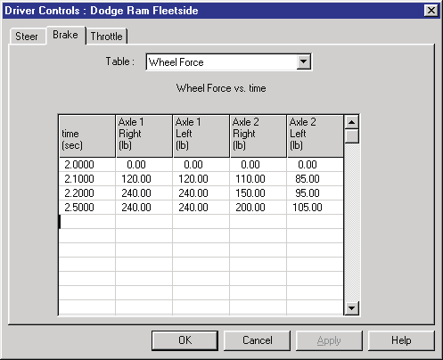
*Figure 4-10: Vehicle Brake Table dialog, Wheel Force option.*

To enter a Brake table for the current vehicle using the Wheel Force option, use the following steps:

1. Select the vehicle.
2. Choose Driver Controls from the Set-up menu.
3. Choose Brakes from the cascade menu. The Brake Table will be displayed.
4. Choose Wheel Force from the Table Is option list. The selected table will be displayed.
5. Enter the table of times and brake forces at each wheel.
6. Press OK when the table is complete.

#### Percent Available Friction

This method allows the user to enter a table of available frictional braking force (percentage of total available frictional force braking the vehicle) versus time, as shown in Figure 4-11. The resulting table determines how much brake force is applied at each wheel. The calculations are performed by the simulation model, which multiplies the entered value by the currently available tire friction and vertical tire load.

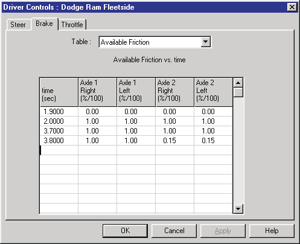
*Figure 4-11: Vehicle Brake Table dialog, Percent of Available Friction option.*

To enter a Brake table for the current vehicle using the Percent of Available Friction option, use the following steps:

1. Select the vehicle.
2. Choose Driver Controls from the Set-up menu.
3. Choose Brakes from the cascade menu. The Brake Table will be displayed.
4. Choose Available Friction from the Table Is option list. The selected table will be displayed.
5. Enter the table of times and friction percentages at each wheel.
6. Press OK when the table is complete.

**Parameters:** The parameters assigned using the Brake Table dialog are shown in Table 4-3.

**Table 4-3: Brake Table Parameters**

| Parameter | Unit Name | Description |
|---|---|---|
| Time | UtVehTime | Time associated with the current level of brake input |
| Brake Input | UtVehForce or UtVehPercent | Current value for brake input |

### Steering Table

Steering controls are available for simulations. Two methods are available:

- At Steering Wheel
- At Axle

#### At Steering Wheel

This method allows the user to enter a table of steering wheel angle versus time, as shown in Figure 4-12. The entered value is divided by the axle's steering gear ratio to determine the nominal steer angle at the tire.

> **NOTE:** The actual steer angle for an individual tire may be affected by Ackerman angle, roll steer and/or toe-in. The inclusion of these parameters is simulation-dependent.

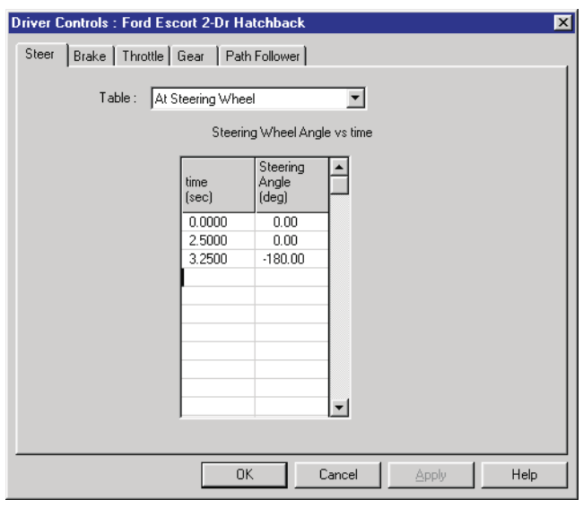
*Figure 4-12: The Steer Table, At Steering Wheel option, allows the user to enter a table of steering wheel angle vs time for the selected vehicle.*

To enter a Steer table for the current vehicle using the At Steering Wheel option, use the following steps:

1. Select the vehicle.
2. Choose Driver Controls from the Set-up menu.
3. Choose Steering from the cascade menu. The Steering Table will be displayed.
4. Choose At Steering Wheel from the Table Is option list. The selected table will be displayed.
5. Enter the table of times and steering wheel angles.
6. Press OK when the table is complete.

#### At Axle

This method allows the user to enter a table of steer angle at each tire of a steerable axle, as shown in Figure 4-13. The entered value is applied directly to the tire, and is unaffected by any roll steer or toe-in.

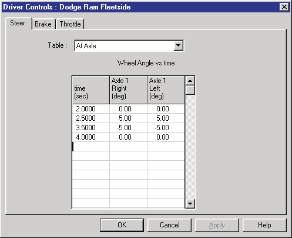
*Figure 4-13: The Vehicle Steer Table dialog, At Axle option, allows the user to directly enter steer angles for the left and right wheels on each steerable axle.*

To enter a Steer Table for the current vehicle using the At Axle option, use the following steps:

1. Select the vehicle.
2. Choose Driver Controls from the Set-up menu.
3. Choose Steering from the cascade menu. The Steering Table will be displayed.
4. Choose At Axle from the Table Is option list. The selected table will be displayed.
5. Enter the table of times and steer angles for each wheel.
6. Press OK when the table is complete.

**Parameters:** The parameters assigned using the Steer Table dialog are shown in Table 4-4.

**Table 4-4: Steer Table Parameters**

| Parameter | Unit Name | Description |
|---|---|---|
| Time | UtVehTime | Time associated with the current level of steer input |
| Steer Input | UtVehDispAngle | Current value for steer input |

### Gear Selection

The Gear Selection dialog is available for simulations. This dialog allows the user to enter a table of gear selection versus time, as shown in Figure 4-14. Separate tables may be entered for the transmission and differential.

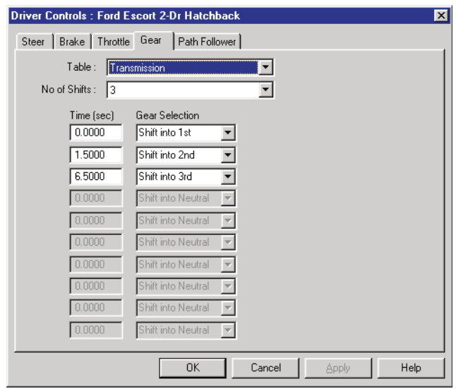
*Figure 4-14: The Gear Selection Table allows the user to enter a table of gear selections vs time for the selected vehicle. Separate tables are available for the transmission and differential.*

> **NOTE:** This option is available only if the current Throttle Method is Percent Wide-Open Throttle.

The dialog has a user-selectable option for transmission and differential.

> **NOTE:** The differential option is available only if the selected vehicle has more than one differential ratio.

To enter a Gear Table for the current vehicle, use the following steps:

1. Select the vehicle.
2. Choose Driver Controls from the Set-up menu.
3. Choose Throttle from the cascade menu. The Throttle Table will be displayed. Confirm that the Percent Wide-open Throttle option is used. If that is not the current option, click on Table Is and choose Percent Wide-open Throttle, then enter a throttle table using the Percent Wide-open Throttle option, as described earlier.

   > **NOTE:** If the Percent Wide-open Throttle option is not selectable, the current calculation method probably does not support the HVE Drivetrain model. In this case, the Gear Table option is not available.
4. Choose Driver Controls from the Set-up menu and select the Gear Selection option. The Gear Selection table will be displayed.
5. Choose the At Transmission option.
6. Enter the table of times and gear numbers for the transmission.
7. If the vehicle has a multi-speed differential, choose the At Differential option and enter a table of gear numbers vs time for the differential.
8. Press OK when the table is complete.

**Parameters:** The parameters assigned using the Gear Selection dialog are shown in Table 4-5.

**Table 4-5: Gear Selection Table Parameters**

| Parameter | Unit Name | Description |
|---|---|---|
| Time | UtVehTime | Time associated with the current gear shift |
| Gear Selection | UtNone | Current gear number for transmission or differential |

### HVE Path Follower

The HVE Path Follower allows the user to define a 3-D path using target positions. Using this path, the simulation model determines the steering, throttle and braking inputs required to make the vehicle follow the path. The HVE Path Follower dialog is shown in Figure 4-15. *(updated: in the current version this feature is labeled "HVE Driver" in the Driver Controls dialog — see [Driver Controls Path Follower](../../09-events-driver-controls/DriverControls7.md))*

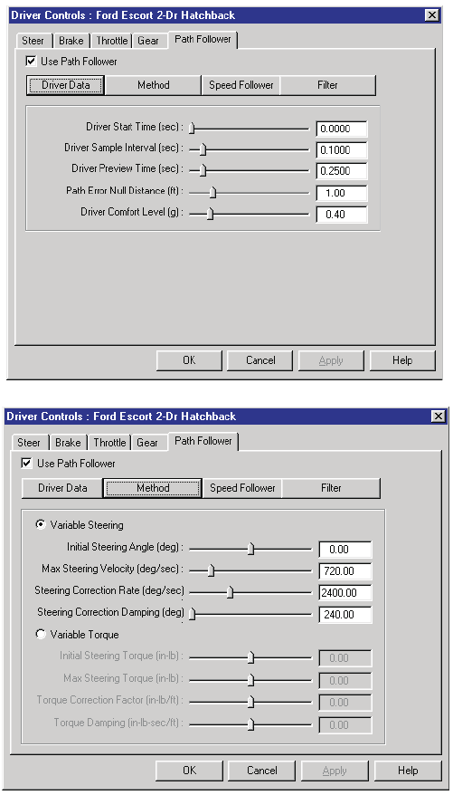
*Figure 4-15: HVE Path Follower dialog is used to simulate the driver inputs required to follow a user-defined path.*

The HVE Path Follower includes several features, some required and some optional. These features are:

- **Path Generator** (required) — user-defined path positions (e.g., Initial, Begin Braking, etc.) to define the attempted path
- **General Parameters** (required) — user-entered parameters required for HVE Path Follower operation
- **Method** (required) — user-entered parameters defining how the correction is accomplished
- **Speed Follower** (optional) — user-entered velocities at each path position are used to define an attempted speed at each point on the path
- **Neuro-muscular Filter** (optional) — user-entered parameters that define driver physiological capabilities [3.17]

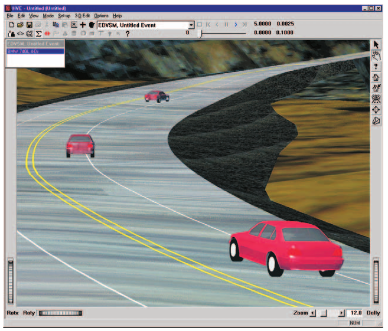
*Figure 4-16: The HVE Path Follower uses up to eight user-assigned positions to define a 3-D path. Intermediate path positions are determined using a 3-D spline.*

#### Path Generator

A primary input to a path follower is the procedure used to define the attempted path. The HVE Path Follower uses up to eight user-defined path positions (see Event Set-up, Assigning Positions). These positions and orientations are used as nodes in a 3-D spline path (see Figure 4-16). It is this spline path that the vehicle attempts to follow.

#### General Parameters

The basic parameters required for use of the HVE Path Follower are the path (described above), Start Time and Sample Interval, Preview Distance (the point ahead of the vehicle where the driver is actually looking and presumably wants to go), the Allowable Path Error and the level of Lateral Acceleration acceptable to the driver.

#### Method

Two methods are available in the HVE Path Follower. These are:

- **Variable Steering** — The path correction is accomplished by means of a steering correction. In this case, the user supplies an Initial Steer Angle, Maximum Steering Wheel Velocity, Steering Correction Factor and Steer Damping.
- **Variable Torque** — The path correction is accomplished by means of a torque application at the steerable wheels. In this case, the user supplies an Initial Steering Wheel Torque, Maximum Steering Wheel Torque, Torque Correction Factor and Torque Damping.

#### Speed Follower

The speed follower option attempts to maintain the required speed, as established by the user-entered velocities at each path position (if a velocity for any path position is not entered, an error message will be issued and the method will abort). In addition, the user supplies an Allowable Speed Error, Maximum Throttle Application and Maximum Brake Pedal Force.

#### Neuro-muscular Filter

The neuro-muscular filter from the original HVOSM VD-2 model has been included in the HVE Path Follower. The neuro-muscular filter represents a simplified model of the physiological operator which incorporates a Time Delay, Lead Time and Lag Time. These parameters correspond to the first-order effects of the neurological and muscular systems of a human driver, as described in reference 3.17.

To use the HVE Path Follower, first you must assign at least two path positions for the vehicle, then perform the following steps:

1. Choose Driver Controls from the Set-up menu.
2. Choose Path Follower from the cascade menu. The HVE Path Follower dialog will be displayed.
3. Assign the desired HVE Path Follower parameters.
4. Press OK when the desired parameters are assigned.

**Parameters:** The parameters assigned using the HVE Path Follower dialog are shown in Table 4-6.

**Table 4-6: HVE Path Follower Parameters**

| Parameter | Unit Name | Description |
|---|---|---|
| Start Time | UtVehTime | Simulation time for start of path follower |
| Sample Time | UtVehTime | Time increment for path sampling |
| Driver Preview Distance | UtEnvDispLength | Distance ahead of vehicle where driver is looking |
| Max Path Error | UtEnvDispLength | Allowable distance from desired path to point projected ahead of vehicle at the Driver Preview Distance |
| Max Lat Accel | UtVehAccelLinear | Driver's limit for comfortable lateral acceleration |
| Path Follower Method | UtNone | Method used to accomplish path following (Variable Steer or Torque) |
| Initial Steer Angle | UtSteDispAngle | Steering wheel angle at Driver Start Time |
| Max Steer Velocity | UtSteVel | Limit on steering wheel angular velocity |
| Steer Correction Factor | UtSteVelRate | Amount of steering correction per unit of path error |
| Steer Correction Damping | UtSteVelDamp | Damping, used to limit steering activity |
| Initial Steering Torque | UtSteTorque | Steering wheel torque at Driver Start Time |
| Max Steering Torque | UtSteTorque | Limit on steering wheel torque |
| Torque Correction Factor | UtSteTorqueRate | Amount of steering torque correction per unit of path error |
| Torque Damping | UtSteTorqueDamp | Damping, used to limit steering activity |
| Max Speed Error | UtVehVelLinear | Allowable difference between current speed and desired speed |
| Max Throttle Pedal | UtVehPercent | Maximum allowable pedal position |
| Max Brake Pedal | UtVehForce | Maximum allowable pedal force |
| Driver Lag Time | UtHumTime | Neuro-muscular filter lag time |
| Driver Lead Time | UtHumTime | Neuro-muscular filter lead time |
| Driver Time Delay | UtHumTime | Neuro-muscular filter time delay |

### Wheel Data

The Wheel Data dialog is available for reconstruction models. This dialog, shown in Figure 4-17, allows the user to enter the following information:

- Pre-impact Total Wheel Lock-up
- Impact-To-Rest Motion Type (Rotating/Lateral Skidding or Constant Sideslip)
- Wheel Lock-up (Percent Available Friction used) at each wheel
- Steer Angle at each wheel

These parameters are described below.

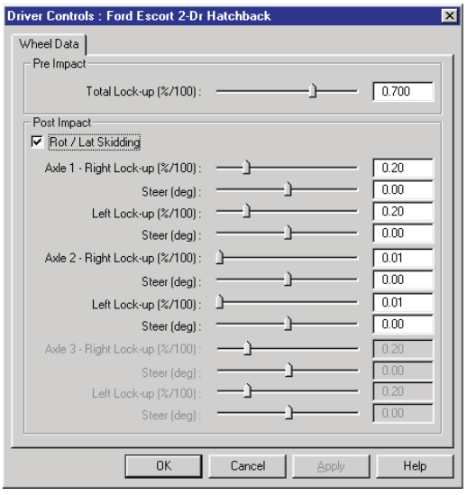
*Figure 4-17: Vehicle Wheel Data dialog.*

#### Pre-impact Total Wheel Lock-up

The entered value is multiplied by the average tire-ground friction coefficient to determine the total vehicle deceleration between the user-entered Begin Braking and Impact positions. This value is relevant only if the user has supplied a Begin Braking position for the current vehicle.

#### Rotating/Lateral Skidding

This check box may be used by reconstruction models to trigger special calculations for vehicles that spin between separation and rest.

> **NOTE:** Spinning vehicles have tire forces which vary, resulting in a variable deceleration rate between impact and rest!

#### Wheel Lock-up

The Wheel Lock-up (sometimes called Percent Available Friction) is multiplied by the available friction force to determine the average longitudinal force at each wheel. The entered value should not account for lateral skidding; the program's tire model will determine the tire slip angle and account for the force associated with lateral skidding.

> **NOTE:** Wheel lock-up for simulation models may be applied using the Wheel Damage dialog (see Wheels menu option later in this chapter).

#### Steer Angle

The entered value is used to determine the steer angle at each wheel. This angle is assumed to remain constant, and applies only during the post-impact phase.

To enter Wheel Data for the current vehicle, use the following steps:

1. Select the vehicle.
2. Choose Driver Controls from the Set-up menu.
3. Choose Wheel Data from the cascade menu. The Wheel Data dialog will be displayed.
4. Enter the desired pre-impact drag factor, post-impact rotation option and percent of available friction and steer angle for each wheel.
5. Press OK when the desired data are entered.

> **NOTE:** Wheel Lock-up and Steer Angle values assigned for each wheel are assumed to remain constant throughout the run.

**Parameters:** The parameters assigned using the Wheel Data dialog are shown in Table 4-7.

**Table 4-7: Wheel Data Dialog Parameters**

| Parameter | Unit Name | Description |
|---|---|---|
| Total Wheel Lock-up | UtBraPercent | Average wheel lock-up for all wheels, used to determine the pre-impact deceleration rate |
| Wheel Lock-up | UtBraPercent | Constant percent of available friction at each wheel used to decelerate vehicle between impact and rest |
| Steer Angle | UtVehDispAngle | Constant steer angle at each wheel |

**See Also:** Wheels Menu Option, Vehicle Model, Event Model

---

*Continue with [Part B](04b-setup-menu.md): Damage Profiles, Collision Pulse, Vehicle Mesh, Payload, Wheels, Accelerometers, Restraints, Contacts, Signals, Notes.*

<!-- NAV -->

---

← Previous: [Chapter 3: File Menu](03-files-menu.md)  |  [Index](README.md)  |  Next: [Chapter 4: Set-up Menu (Part B — Damage Profiles through Notes)](04b-setup-menu.md) →

<!-- /NAV -->
