# Chapter 4: Set-up Menu (Part B — Damage Profiles through Notes)

*HVE User's Manual — Section Two: Menu Reference. Continued from [Part A](04a-setup-menu.md) (Position/Velocity, Driver Controls).*

---

## DAMAGE PROFILES (VEHICLE DAMAGE)

**Menu Option:** DAMAGE PROFILES (Ctrl+M) *(updated: the 2006 manual titled this section "Vehicle Damage"; the current menu item is "Damage Profiles")*

**Purpose:** Assign a damage profile to the selected vehicle

**Description:** The Vehicle Damage dialog (see Figure 4-18) allows the user to assign a damage profile to the selected vehicle. The damage profile is obtained by post-crash inspection of the vehicle, and provides a significant amount of useful information about the collision, including:

- Damage Energy
- Peak Force
- Linear and angular velocity change
- Principal Direction of Force (PDOF)

This information may be used to help estimate impact speed and collision severity. The major advantage is that scene data are not required.

### CDC

HVE's Damage Profile dialog requests from the user a Collision Deformation Classification (CDC), a seven-character code describing the vehicle damage. The CDC is an SAE Recommended Practice, and is defined in SAE J-224C [6.3], portions of which are included in the HVE Help Index.

The entered CDC is used to define a default PDOF and damage profile, which includes damage width, depth and location. The default data provided by the CDC are used to fill in the fields in the Damage Profile dialog. The resulting delta-V, damage energy and peak force are calculated and displayed in the dialog.

HVE uses the damage profile to calculate and display the Equivalent Energy Speed, or EES [2.26, 6.4]. The default value is set equal to the total delta-V. The user may override the default EES by clicking on the EES radio button and entering the desired value.

> **NOTE:** The calculated results define what would happen if the current vehicle struck a rigid barrier, not another vehicle! To determine what would happen during a collision with another vehicle requires further analysis which includes information about the second vehicle.

To enter Vehicle Damage Data for the current vehicle, use the following steps:

1. Select the vehicle.
2. Choose Damage Profiles from the Set-up menu. The Vehicle Damage dialog will be displayed, as shown in Figure 4-18.
3. Enter a CDC and press Apply. The default damage profile (based on the CDC) and associated damage results will be displayed.
4. Where actual measurements are available, replace any of the default results assigned by the CDC with the available data, followed by Apply.
5. Press OK after the desired vehicle damage data are entered.

The specific damage profile parameters are defined in this section.

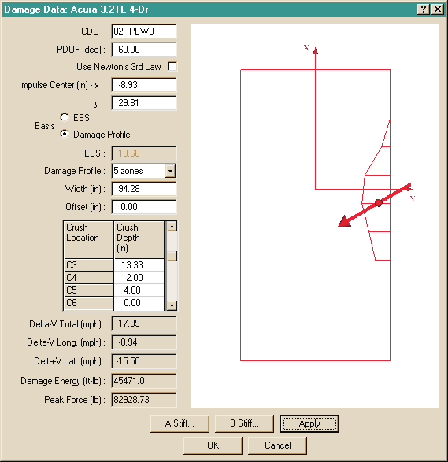
*Figure 4-18: The Vehicle Damage Profile dialog is used to assign damage data for the current vehicle.*

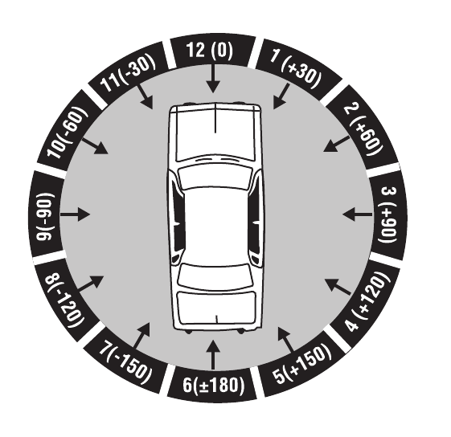
*Figure 4-19: The default PDOF is assigned by its clock direction (12, 01, 02, etc.) in the first two characters in the CDC.*

### PDOF

Simply stated, the PDOF is the direction of the impulse. This, of course, has physical significance, because the direction of the impulse is the same as the direction of the delta-V. In fact, because the damage analysis has no way of computing the forward and lateral components of the delta-V, the user-entered PDOF is used for this purpose.

> **NOTE:** If scene data are entered, the PDOF can often be calculated. This serves as an excellent cross-check on the user-entered value.

The PDOF is assigned by the CDC as the closest hour angle (or clock direction), as shown in Figure 4-19. The damage profile dialog displays the resulting PDOF in degrees. This value may be edited by the user if a more precise value is known (note that the precision of the clock direction is limited by the number of degrees in one hour, or 30 degrees).

### Use Newton's 3rd Law

Some reconstruction programs (e.g., EDCRASH) are able to calculate the PDOF of one of the vehicles in a two-vehicle collision based on the impact heading angles and the PDOF of the other vehicle. Clicking this check box executes that option.

> **NOTE:** You can only choose this option for one of the vehicles; if you choose this option for both vehicles, the program will normally display an error message.

### Damage Profile

The vehicle damage profile is defined by three parameters:

- Damage Width
- Crush Depths
- Damage Midpoint Offset

These three parameters are described below.

#### Damage Width

The Damage Width is the width of the damaged region. The default value assigned by the CDC does not include induced damage (non-contact damage adjacent to the area of actual contact with another vehicle). In most cases, the user should include induced damage if the goal is to estimate delta-V [2.27].

#### Crush Depths

A table of Crush Depths defines the shape of the damage profile. Up to 10 equally spaced crush depths may be provided along the total damage width, as shown in Figures 4-18 and 4-20.

#### Damage Midpoint Offset

The Damage Midpoint Offset is simply the longitudinal or lateral distance from the CG to the midpoint of the damage profile, as shown in Figures 4-18 and 4-20.

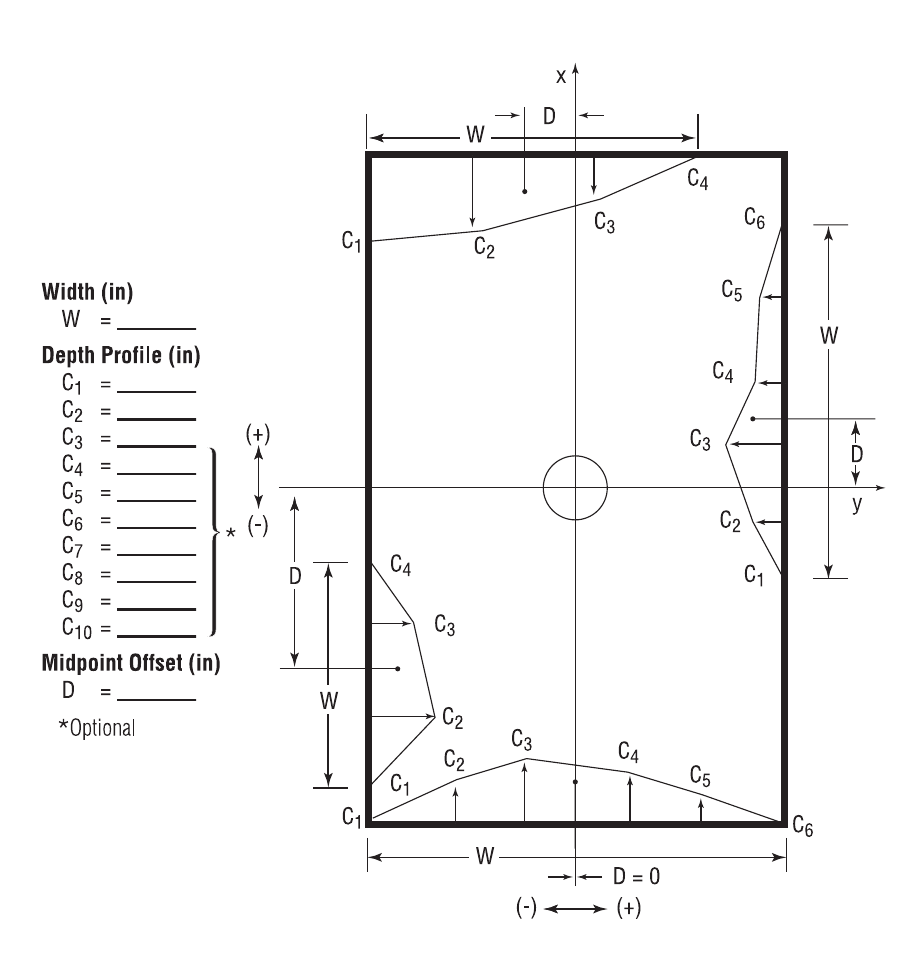
*Figure 4-20: Examples of damage profiles for front, back and side impacts.*

### Stiffness Coefficients

The damage analysis requires empirical coefficients determined by crash tests. These coefficients are called stiffness coefficients, because they define the structural stiffness of the vehicle.

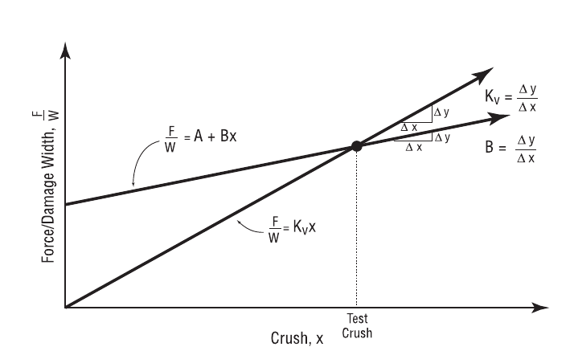
*Figure 4-21: Force vs Crush characteristics.*

The HVE Vehicle Damage dialog includes two user-assigned stiffness coefficients:

- **A** — The A Stiffness Coefficient has units of force per unit of damage width, and defines the force necessary to begin crushing the vehicle's exterior.
- **B** — The B Stiffness Coefficient has units of force per unit of crush depth per unit of damage width, and defines the linear spring rate of the vehicle's exterior.

Given values for A and B, the crush force per unit of damage width is assumed to have a linear relationship with crush depth. Figure 4-21 shows this relationship. The A and B coefficients are provided in the A Stiffness and B Stiffness dialogs, respectively (see Figure 4-22). The A Stiffness and B Stiffness dialogs allow the user to assign equal coefficients for every zone or vary the coefficients from zone to zone.

A and B stiffness coefficients may be calculated from barrier crash test data. Methods are outlined in references 2.14, 4.28 and 4.29.

> **NOTE:** Before using any of these methods, ensure the type of crash test is known! Crash tests involving a deformable barrier are not useful, because the fraction of energy absorbed by each vehicle is unknown. In addition, moving barrier crash tests require a more complete equation (for fixed barrier tests, several parameters drop out of the equation).

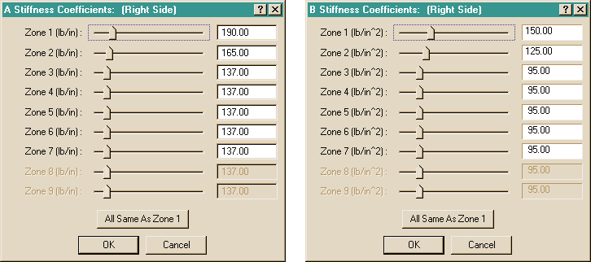
*Figure 4-22: The A and B Stiffness dialogs allow the user to supply stiffness coefficients for each crush zone.*

### Crush Zones

The area between any two crush depth measurements is called a crush zone; thus the number of crush zones will always be one less than the number of entered crush depths (see Figures 4-18 and 4-20).

Obviously, the actual stiffness of a vehicle varies according to the structure absorbing the crush, especially on the side of a vehicle, where one area, such as the quarter panel, contains unsupported sheet metal, while another area, such as a wheel, might be quite rigid. A separate set of A and B coefficients may be assigned to each crush zone.

> **NOTE:** The A and B coefficients are not independent from each other; one should never be adjusted without adjusting the other. In addition, the percentage of adjustment should be the same for both the A and B stiffness coefficients.

**Parameters:** The parameters assigned using this dialog are shown in Table 4-8.

**Table 4-8: Damage Profile Parameters**

| Parameter | Unit Name | Description |
|---|---|---|
| CDC | (none) | Collision Deformation Classification, 7-character damage code describing location and character of damage |
| PDOF | UtVehDispAngle | Principal Direction Of Force, the direction of the collision impulse (same as direction of delta-V) |
| Impulse Center | UtVehDispLength | Vehicle-fixed x,y coordinates of the impulse center |
| EES | UtVehVelLinear | Energy Equivalent Speed, the speed associated with the energy required to cause the observed damage if the vehicle had struck a fixed rigid barrier |
| Width | UtVehDispLength | Total width of damage |
| Offset | UtVehDispLength | Longitudinal or lateral distance from the CG to the center of the damage profile |
| Crush Depth | UtVehDispLength | Measured depth of crush at up to 10 points along the damage profile |
| A Stiffness | UtVehAStiff | Force per unit of damage width required to initiate measurable damage (for each crush zone) |
| B Stiffness | UtVehBStiff | Force per unit of crush depth per unit of damage width required to cause the measured damage (for each crush zone) |

**See Also:** Event Editor, Vehicle-fixed Coordinate System, Reconstruction Models, References 2.24, 2.27, 4.28, 4.29

---

## COLLISION PULSE

**Menu Option:** COLLISION PULSE (Ctrl+U)

**Purpose:** Assign a collision pulse to the selected vehicle

**Description:** The Collision Pulse dialog allows the user to assign a collision pulse to the selected vehicle. A collision pulse is a vehicle's position, velocity, acceleration or force/moment vs time history, and is used by occupant simulation models to define the vehicle's motion during impact. The Collision Pulse dialog is shown in Figure 4-23.

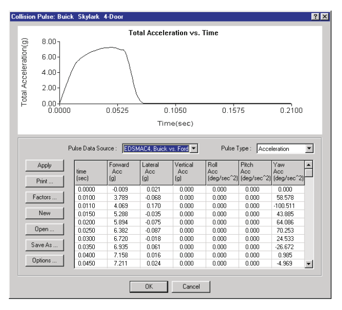
*Figure 4-23: The Collision Pulse dialog allows the user to assign a collision pulse for the current vehicle. A collision pulse is used by occupant simulation models and by some vehicle dynamics models that include an impulse.*

### Collision Pulse Table

To enter Collision Pulse data for the current vehicle, use the following steps:

1. Select the vehicle.
2. Choose Collision Pulse from the Set-up menu. The Collision Pulse dialog will be displayed (see Figure 4-23).
3. Enter a table of time and dependent values (Position, Velocity, Acceleration (default) or Force/Moment data; see Pulse Type, below) for the duration of the collision.

   > **NOTE:** The duration of the table is normally about 75 to 150 milliseconds.
4. Press OK when the desired data are entered.

### Collision Pulse Source

The user may assign a collision pulse by entering a table of acceleration vs time, as described above. However, it is much easier (and faster) if the collision pulse is assigned by another program, such as SIMON/DyMESH or EDSMAC4. To assign the collision pulse using this method, perform the following steps:

1. Click on the Pulse Data Source option list. The option list contains all of the previously executed events which produced a collision pulse for the selected vehicle.
2. Choose the desired event. Its collision pulse will be loaded in the table and displayed in the graph.

> **NOTE:** If the Pulse Source is from an event, the table is non-editable. If you wish to edit the pulse data from an event, you can save it first, then open the table as a user-saved pulse (see Opening and Saving Collision Pulse Files later in this section).

> **NOTE:** If the selected event's output interval is too large, HVE will display a message suggesting you rerun the event with a smaller output interval.

### Collision Pulse Type

The HVE Collision Pulse dialog allows the user to apply four types of pulses to a vehicle:

- Position vs time
- Velocity vs time
- Acceleration vs time
- Force and Moment vs time

To select a particular pulse type for the current event, perform the following steps:

1. Click on the Pulse Type option list. The available pulse types are displayed.
2. Select the desired pulse type from the list.

> **NOTE:** Not all simulation models support every pulse type; the current simulation model will determine which pulse types are selectable from the list.

The Collision Pulse Table for the selected pulse type is displayed.

### Opening and Saving Collision Pulse Files

Collision pulses may be assigned from previous cases, as well as saved for use in future cases. For example, a measured acceleration pulse for a specific vehicle's 35 mph barrier crash test may be available from test data. This pulse may be used for several individual simulations wherein the restraint system pre-load is varied. To assign a collision pulse from a previous case, perform the following steps:

1. Choose Open. The Collision Pulse Selection dialog will be displayed.
2. Select the filename of the desired collision pulse.
3. Press OK to display the selected collision pulse.

To save the current collision pulse for use in a future case, perform the following steps:

1. Choose Save As. The Collision Pulse Selection dialog will be displayed.
2. Enter a filename for the current collision pulse.
3. Press OK to save the current collision pulse.

### Collision Pulse Factors

It may be useful to study the sensitivity of the occupant motion to changes in the magnitude of the collision pulse. The Pulse Factors dialog (see Figure 4-24) allows the user to quickly assign multipliers to each degree of freedom (forward, lateral, vertical, roll, pitch and yaw).

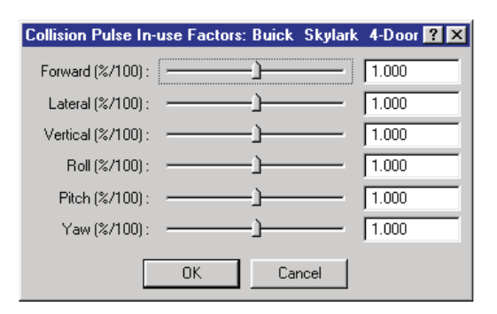
*Figure 4-24: The Collision Pulse Factors dialog allows the user to modify the time-dependent pulse data by a user-specified amount for each degree of freedom.*

To assign collision pulse factors to the selected vehicle, perform the following steps:

1. Choose Factors. The Collision Pulse Factors dialog will be displayed.
2. Use the individual sliders to increase or decrease the linear and angular values.

   > **NOTE:** The default slider value is 1.0.
3. Press OK.

The selected multipliers are applied to each degree of freedom.

### Collision Pulse Options

The user may need to select a portion of the total pulse for use in a simulation. For example, an entire left turn may last 3 seconds, while the resulting collision with an oncoming vehicle lasts perhaps only 125 milliseconds. Thus, the user would like to extract that portion of the total pulse during which the collision occurs. This task can be performed using the Pulse Options dialog (see Figure 4-25). The Pulse Options dialog is also used for assigning the impulse center for a 3-dimensional impulse when the Force Pulse Type is used.

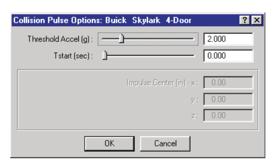
*Figure 4-25: The Collision Pulse Options dialog allows the user to trim the unwanted portion of the collision pulse and assign an impulse center for Force/Moment pulse tables.*

To use the Collision Pulse Options dialog for the selected vehicle, perform the following steps:

1. Choose Options. The Collision Pulse Options dialog will be displayed (see Figure 4-25).
2. Enter the desired starting time for the pulse.

   > **NOTE:** Only the portion of the pulse beginning at the starting time is included in the pulse table.
3. Enter the desired acceleration threshold for the pulse.

   > **NOTE:** Only the portion of the pulse equal to or greater than the entered value is included in the pulse table; the default value is 1.0 g.
4. If the pulse type is Force/Moment, enter the x,y,z coordinates for the impulse center.

   > **NOTE:** This option is only available if the current pulse type is Force/Moment.
5. Press OK to assign the pulse options.

**Parameters:** The parameters assigned using this dialog are shown in Table 4-9.

**Table 4-9: Collision Pulse Parameters**

| Parameter | Unit Name | Description |
|---|---|---|
| Pulse Source | N/A | Available pulse sources |
| Pulse Type | N/A | Available pulse types (Position, Velocity, Acceleration or Impulse) |
| Fwd, Lat, Vert linear degrees of freedom for selected pulse type | UtVeh\*Linear | Forward, lateral and vertical components of the vehicle's linear motion |
| Roll, Pitch, Yaw angular degrees of freedom for selected pulse type | UtVeh\*Angular | Angular motion about vehicle's roll, pitch and yaw axes |
| Pulse Start | UtVehTime | Starting time for pulse |
| Pulse Threshold | UtVehAccelLinear | Minimum total acceleration required to be considered part of the collision pulse (applies only to acceleration pulses) |

\* Unit Name is dependent on pulse type: Disp (Position), Vel (Velocity), Accel (Acceleration) or Force (Impulse).

**See Also:** Output Tracks, Event Model, User's Manual for selected occupant simulation model

---

## VEHICLE MESH

**Menu Option:** VEHICLE MESH *(updated: the 2006 manual titled this option "Mesh"; the current menu item is "Vehicle Mesh")*

**Purpose:** Perform various mesh-related operations on the selected vehicle

**Description:** The Mesh dialog allows the user to do the following:

- Modify vehicle geometry file (mesh) properties
- Select and deselect mesh groups for inclusion in damage
- Select a pair of vehicles (or a vehicle and environment) and edit their inter-vehicle friction and restitution properties

These options (see Figure 4-26) are described in the following sections.

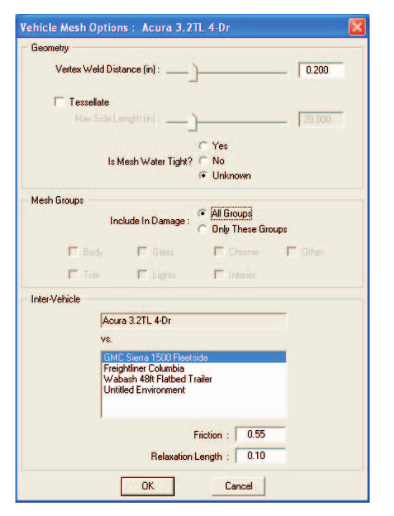
*Figure 4-26: The Mesh dialog allows the user to tessellate the geometry file and edit inter-vehicle friction and restitution.*

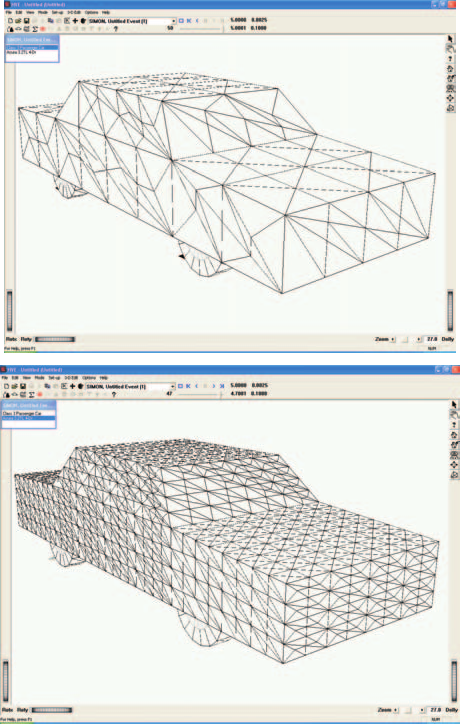
*Figure 4-27: Generic Vehicle with 30 inch tessellation (above) and 10 inch tessellation (below).*

### Geometry

The Geometry group parameters provide various options that affect how the vehicle mesh behaves when it is deformed. The available options are:

- Weld Distance
- Tessellate
- Water-tightness

**Weld Distance** — If two vertices on the mesh lie within this distance from each other, they are assumed to be the same point. This helps to prevent two adjacent polygons from moving independently when the mesh deforms.

> **NOTE:** Two vertices a small distance from each other are usually the result of an error during the measuring or building of the mesh.

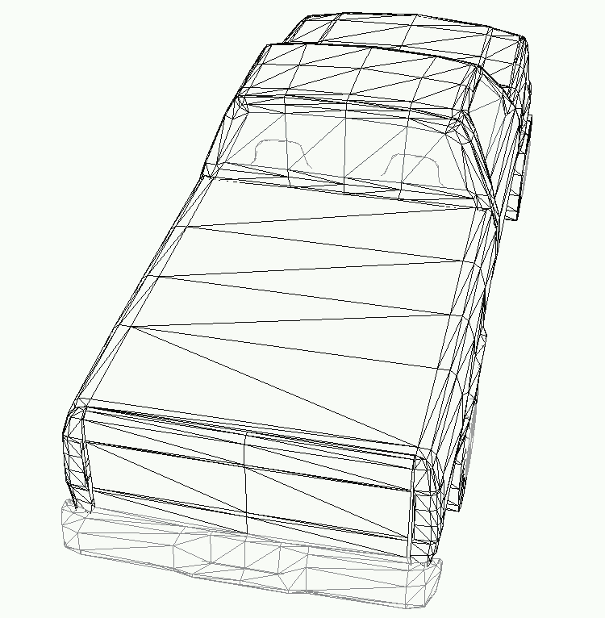
*Figure 4-28: Region of vehicle with triangles having a large aspect ratio.*

**Tessellation** — The Tessellation parameter establishes a maximum length for the side of any polygon in the mesh. Setting this value has two important effects: First, it establishes the maximum size of triangles in the mesh. Obviously a mesh with 10 inch polygons will provide more detail than a mesh with 30 inch polygons (see Figure 4-27). Second, it prevents a mesh from having triangles with large aspect ratios (i.e., triangles that are long and skinny; these triangles can be problematic for DyMESH); see Figure 4-28.

Although increased tessellation (i.e., smaller triangles) increases resolution, there is a cost. Increased tessellation also requires more computer memory, disk space and processing time.

> **NOTE:** Using a 10 inch Maximum Side Length for a 45-ft semi-trailer will bring your computer to its knees.

**Water-tightness** — A mesh is water-tight if each neighboring polygon shares its vertices. For example, the mesh at the left in Figure 4-29 is water-tight, while the mesh on the right is not. Note what happens when the vertex in the center of the mesh on the right is displaced: it opens up, resulting in a hole, as shown in Figure 4-30. This hole represents a region through which a slave vertex on the other vehicle may pass. If that occurs, the slave vertex will not find contact with any surface on the master vehicle mesh, so the vertex will remain undeformed, resulting in what is called a rogue vertex (see Figure 4-31). The Water-tight test has three options:

- Yes (the mesh is water-tight)
- No (the mesh is known not to be water-tight)
- Unknown (it may or may not be water-tight)

*Figure 4-29: Water-tight mesh (left) and non-water-tight mesh (right).*

*Figure 4-30: Displacing the vertex in a non-water-tight mesh opens a hole in the mesh.*

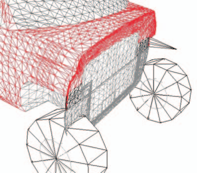
*Figure 4-31: Rogue vertex resulting from collision with a barrier having a non-water-tight mesh.*

If the mesh is water-tight, DyMESH can use an optimized procedure, thus speeding up processing. If the mesh is not water-tight, DyMESH can use a different procedure that prevents rogue vertices, but requires longer processing times. If the state of the mesh is unknown, DyMESH can determine its status at the start of the run, again taking longer to execute.

### Inter-vehicle Options

The Inter-vehicle Options section of the dialog includes a Target Vehicle list box, and Inter-vehicle Friction and Restitution (relaxation length or relaxation energy) data fields.

> **NOTE:** These options operate on the selected pair of vehicles.

To edit the Vehicle Mesh properties (weld distance, tessellate, water-tight status, inter-vehicle friction and restitution), perform the following steps:

1. Select a vehicle from the Active Vehicles list.
2. Choose Set-up, Vehicle Mesh. The Mesh dialog is displayed.
3. Edit the weld distance as desired.
4. Click on the Tessellate checkbox and edit the current Maximum Side Length as desired.
5. Select the desired Water-tightness option (Yes, No, Unknown).
6. Select a vehicle or the environment from the list and edit the Friction and Relaxation Length as desired.
7. Press OK when the desired parameters are set or entered.

**Parameters:** The parameters assigned using this dialog are shown in Table 4-10.

**Table 4-10: Mesh Parameters**

| Parameter | Unit Name | Description |
|---|---|---|
| Maximum Side Length | UtVehDispLength | Determines the longest side of a polygon |
| Inter-vehicle Friction | UtNone | Inter-vehicle friction coefficient for selected pair of vehicles |
| Relaxation Length | UtVehPercent | Determines the amount of reduction in displacement vector |

**See Also:** DyMESH Options, User's Manual for selected simulation model

---

## PAYLOAD

**Menu Option:** PAYLOAD

**Purpose:** Assign a payload to the selected vehicle

**Description:** The Payload dialog allows the user to add a payload to the selected vehicle. The payload may be any object adding inertia to a vehicle that is not accounted for in the vehicle's inertial properties. Examples include cargo and occupants. The Payload dialog is shown in Figure 4-32.

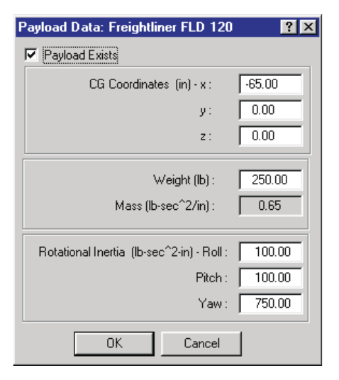
*Figure 4-32: The Payload dialog allows the user to assign a payload to the current vehicle.*

The payload is defined by the following information:

- **Location** — The x,y,z distances from the vehicle's center of gravity to the payload's center of gravity.
- **Weight** — The weight of the payload.
- **Rotational Inertia** — The roll, pitch and yaw moments of inertia of the payload.

> **NOTE:** The entered weight value is divided by the current gravitational constant and stored as mass. Therefore, if you take the current vehicle to the moon, the payload's inertial properties will still be correct!

> **NOTE:** The vehicle's CG moves when you add a payload. HVE automatically updates the earth-fixed coordinates of the vehicle's CG to account for this fact. You will see the updated CG coordinates in the Position/Velocity dialog.

To enter Payload Data for the current vehicle, use the following steps:

1. Select the vehicle.
2. Choose Payload from the Set-up menu. The Payload dialog will be displayed.
3. Enter the desired payload parameters.

   > **NOTE:** You can often use a simple mechanics formula to estimate rotational inertia, e.g., Izz = (m/12)(a² + b²).
4. Press OK when the desired data are entered.

**Parameters:** The parameters assigned using this dialog are shown in Table 4-11.

**Table 4-11: Payload Parameters**

| Parameter | Unit Name | Description |
|---|---|---|
| x,y,z coordinates | UtVehDispLength | x, y and z distances from the vehicle CG to the Payload CG |
| Weight | UtVehForce | Payload weight |
| Rotational Inertia | UtVehRotInertia | Payload rotational inertia about its x, y and z axes |

**See Also:** User's Manual for individual reconstruction or simulation model

---

## WHEELS

**Menu Option:** WHEELS (Ctrl+W)

**Purpose:** Assign event-related parameters for each wheel

**Description:** The Wheels option allows the user to select from a cascade menu the following options:

- **Blow-out** — Simulate the transient effects of an air loss at one or more tires
- **Damage** — Simulate the transient effects of wheel damage (normally the result of a collision) at one or more wheels
- **Brakes** — Simulate the effects of slack adjuster adjustment and initial temperature at one or more wheels on braking effectiveness

  > **NOTE:** The default adjustment is assigned using the Vehicle Editor. This dialog allows further adjustment at individual wheels.

  > **NOTE:** Initial temperature is the environment ambient temperature.
- **Tire-Terrain** — Assign the desired Tire-Terrain model for each tire

Each of the Wheels options has an appropriate dialog; the use of these dialogs is described below.

### Tire Blow-out Option

The HVE Tire Blow-out Model is set up using the Tire Blow-out dialog, shown in Figure 4-33. The tire blow-out model allows the user to vary tire performance parameters (these parameters are cornering, camber and radial stiffness and rolling resistance; see reference 4.30 for additional information) while the simulation is running.

To assign tire blow-out parameters for one or more tire locations, perform the following steps:

1. Choose Wheels from the HVE Set-up menu. The Wheel Data dialog is displayed; the options are Blow-out, Damage, Brakes and Tire-Terrain.
2. Choose Blow-out. The HVE Tire Blow-out dialog is displayed, as shown in Figure 4-33.
3. Click on the Axle option list and select the desired axle location for the tire blow-out.
4. Click on the Side option list and select the Right or Left side.
5. Click on the Location radio button and select the Inner or Outer tire location.

The current blow-out options for the selected tire are displayed. By default, the tire is in its normally inflated state. To simulate an air loss, perform the following steps:

1. Click the Is Blown check box. The HVE Tire Blow-out Model parameters become editable.
2. Click AutoStart if you want the simulation model to determine when the air loss begins. Normally, the air loss begins when the simulation detects a collision.
3. Assign a Start Time for the air loss.

   > **NOTE:** Start Time is disabled if AutoStart is selected.
4. Assign a Time Duration for the air loss.

   > **NOTE:** The default duration is 0.1 seconds. High speed film of tire blow-outs shows this is a reasonable value for a 1 inch (2.5 cm) hole in the sidewall. You should adjust this value if the size of the hole is larger or smaller.

   > **NOTE:** You can simulate a slow air loss by using a large time duration.
5. Assign Stiffness and Rolling Resistance Factors for the air loss.

   > **NOTE:** Review the documentation for the particular simulation model you are using to determine whether all the parameters are used.
6. If desired, use the Axle, Side and Location option lists to select additional tires for assigning blow-out parameters.

   > **NOTE:** Blow-out parameters may be assigned to any number of tires.
7. Press OK to accept the tire blow-out parameters.

When the simulation is executed, the selected blow-out parameters will be incorporated into the simulation.

> **NOTE:** The HVE Tire Blow-out Model is further described in Chapter 16, Event Model. See also Reference 4.30.

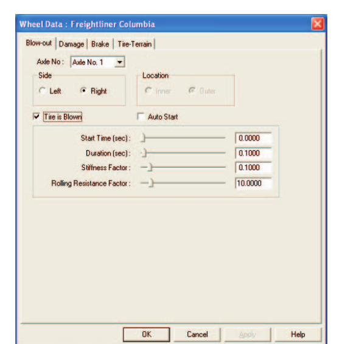
*Figure 4-33: The Tire Blow-out dialog allows the user to assign tire blow-out parameters to one or more tires.*

### Wheel Damage Option

The Damage option is set up using the Wheel Damage dialog, shown in Figure 4-34. By specifying wheel displacement(s), the user can dynamically vary wheel position and orientation during the simulation. Another application for the Wheel Damage dialog is assigning wheel lock-ups, normally caused by damage during a collision.

To assign wheel damage parameters for one or more wheel locations, perform the following steps:

1. Choose Wheels from the HVE Set-up menu. The Wheel Options cascade menu is displayed; the options are Blow-out, Damage, Brakes and Tire-Terrain.
2. Choose Damage. The Wheel Damage dialog is displayed, as shown in Figure 4-34.
3. Click on the Axle option list and select the desired axle location for the damaged wheel.
4. Click on the Side option list and select the Right or Left side.

The current damage options for the selected wheel position are displayed. By default, the wheel is at its normal position and orientation. To simulate a wheel displacement, perform the following steps:

1. Click the Is Displaced check box. The Wheel Displacement parameters become editable.
2. Click AutoStart if you want the simulation model to determine when the displacement begins. Normally, the displacement begins when the simulation detects a collision.
3. Assign a Start Time for the displacement.

   > **NOTE:** Start Time is disabled if AutoStart is selected.
4. Assign a Time Duration for the displacement.

   > **NOTE:** The default duration is 0.1 seconds, the length of a typical collision. High speed film of crash tests reveals this is a reasonable value. You should adjust this value if the displacement occurs over a shorter or longer interval.
5. Assign Δx, Δy, Δz wheel displacements.

   > **NOTE:** The displacements are vehicle-fixed; a negative value moves the wheel in the negative x, y or z vehicle-fixed directions.
6. Assign the Camber Change.

   > **NOTE:** The Camber Change is a vehicle-fixed angle. A positive value moves the top of the wheel outward; a negative value moves the top of the wheel inward.

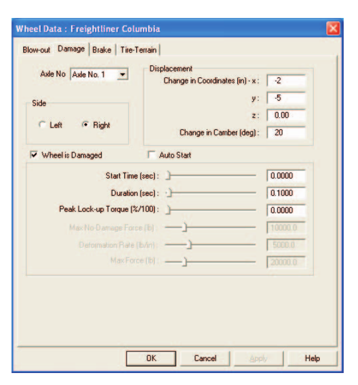
*Figure 4-34: The Wheel Damage dialog allows the user to assign a dynamic change in wheel position and orientation during the simulation.*

To simulate wheel lock-up, perform the following steps:

1. Assign the desired percentage of the nominal friction required to fully lock the wheel under static loading conditions.

   > **NOTE:** Entering a value of 2.00 will ensure that the wheel locks under any reasonable condition.
2. If desired, use the Axle and Side option lists to select additional wheel positions for assigning displacement parameters.

   > **NOTE:** Damage parameters may be assigned to any number of wheel positions.
3. Press OK to accept the wheel damage parameters.

When the simulation is executed, the selected wheel displacement parameters will be incorporated into the simulation.

### Wheel Brakes Option

The Wheel Brakes option allows the user to simulate the effects of brake adjustment on air brake systems by specifying initial stroke and lining and drum temperature at each wheel.

To assign slack adjuster and temperature conditions at each wheel location, perform the following steps:

1. Choose Wheels from the HVE Set-up menu. The Wheel Options cascade menu is displayed; the options are Blow-out, Damage, Brakes and Tire-Terrain.
2. Choose Brakes. The Wheel Brakes dialog is displayed, as shown in Figure 4-35.
3. Click on the Axle option list and select the desired axle location for the brake data.
4. Click on the Side option list and select the Right or Left side.

The default conditions for the selected wheel position are displayed. By default, the brake adjustment is that which was assigned using the Vehicle Editor. The temperature is the environment ambient temperature. To assign new conditions, perform the following steps:

1. Assign an Initial Lining Temperature for the brake.
2. Assign an Initial Drum Temperature for the brake.
3. Assign Adjuster Slack for the brake.

Brake failure may also be simulated. To simulate a brake failure at the selected wheel location, perform the following steps:

1. Click the Brake Is Failed checkbox. The Brake Failure parameters are enabled.
2. If desired, click the AutoStart checkbox to have the simulation automatically set the time for the start of the brake failure.
3. Enter the Start Time and Duration (the time interval during which the brake effectiveness goes from normal to failed) for the brake failure.
4. Enter the Failure Extent as a percentage of total brake failure for the selected brake.
5. If desired, use the Axle and Side option lists to select additional wheel positions for assigning brake temperature, adjustment and failure parameters.

   > **NOTE:** Brake parameters may be assigned to any number of wheel positions.
6. Press OK to accept the wheel brake parameters.

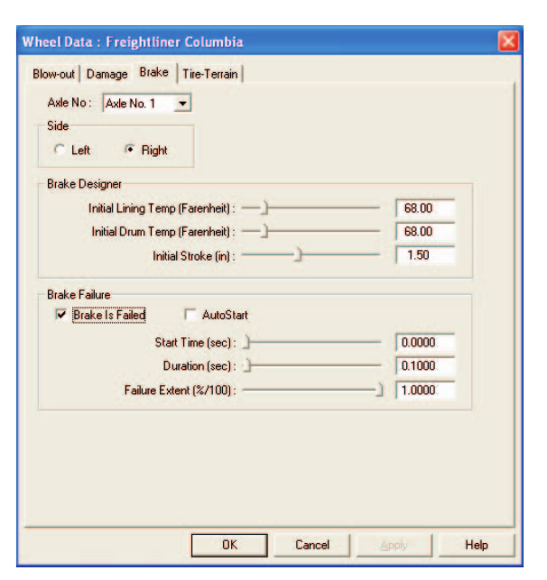
*Figure 4-35: The Wheel Brakes dialog allows the user to assign initial brake slack adjuster adjustment and lining and drum temperatures for air brake systems. The Wheel Brakes dialog is also used for simulating brake failure at one or more wheel locations.*

When the simulation is executed, the selected wheel brake parameters will be incorporated into the simulation.

### Tire-Terrain Option

The Tire-Terrain option provides the user with several methods for simulating tire interaction with various types of terrains, such as flat surfaces, potholes, curbs and soft soil. This is done by selecting an appropriate tire-terrain model. Three tire models are available:

- Point Contact Model
- Radial Spring Model (with Sidewall Impact Option)
- Soft Soil Model

Each of these tire-terrain models is described below.

#### Point Contact Tire-Terrain Model

The Point Contact Tire-Terrain model assumes that the tire force, Fx', Fy', is a shear force acting at the ground contact plane at a single point directly beneath the wheel center (see Figure 4-36). This is a good assumption for a majority of conditions. In particular, the Point Contact model assumes a flat (not necessarily horizontal), rigid terrain. The Point Contact model is the default Tire-Terrain option.

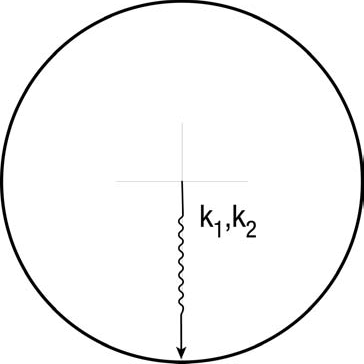
*Figure 4-36: The Point Contact Tire-Terrain Model (default) assumes the tire force acts at a single point directly below the wheel center.*

#### Radial Spring Tire-Terrain Model

The Radial Spring Model models the tire as a series of radial springs lying in the tire plane projecting radially outward from the wheel center (see Figure 4-37). Whereas the Point Contact Model may be thought of as a single spring projecting downward and interacting with the terrain at a single point, the Radial Spring Model provides numerous springs that may interact with multiple surfaces. This model is ideal for simulating tires mounting curbs and rolling over potholes.

The radial springs are defined by the following parameters:

**Radial Spring Rate, K1, K2** — This 2-stage, bi-linear spring rate is derived from the tire's physical properties (initial and secondary stiffness). These rates are distributed between individual springs when the model is initialized. This initialization process results in an equivalent tire deflection for the Radial Spring Model when compared to the Point Contact model.

**Angular Span, Ω** — It would be computationally unnecessary (and wasteful) to calculate radial spring forces about the entire perimeter of the tire, since only a small portion at the bottom of the tire is normally in contact with the ground. Starting at the ground, the Angular Span is an angle that defines how much of the tire's perimeter is modeled by radial springs (see Figure 4-37). The default value is +/-90 degrees, meaning that the entire lower half of the tire is modeled. For normal contact with relatively flat terrain, this value may be reduced to +/-30 degrees. A logical test produces a message if the Angular Span needs to be increased.

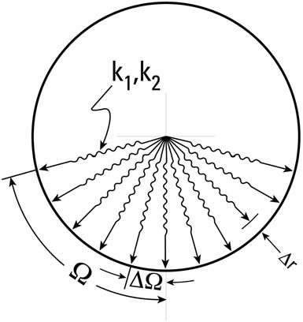
*Figure 4-37: The Radial Spring Tire-Terrain Model uses evenly spaced springs, rather than a single spring, to model the radial tire force.*

**Angular Increment, ΔΩ** — The radial springs are placed at discrete angular intervals about the tire. This angle defines the increment between radial springs (see Figure 4-37).

**Radial Adjustment Increment, Δr** — The current force on each radial spring is determined by its displacement (see Figure 4-37) according to the terrain elevation beneath the spring (actually calculated as the intersection of the radial spring vector with the terrain). The Radial Adjustment Increment is used, along with quadratic interpolation of the radial spring look-up table stored for each radial spring, to determine the radial spring force.

#### Sidewall Impact Tire Model

The Sidewall Impact Tire Model is an extension of the Radial Spring Tire Model. In the Sidewall Impact Tire Model, each radial spring (see above) has springs projecting laterally from the wheel plane to the tire sidewall plane (see Figure 4-38).

The lateral springs are defined by:

**Sidewall Slide Friction Coefficient, μs** — This parameter defines the coulomb friction between the tire sidewall and the terrain. This value has a null band that requires relative velocity between the tire and terrain in order to produce frictional force (in the direction of the tire sidewall tangential velocity relative to the terrain).

**Number of Sidewall Springs, n** — This parameter defines the number of lateral springs for each radial spring. The user may specify two, four or six lateral springs.

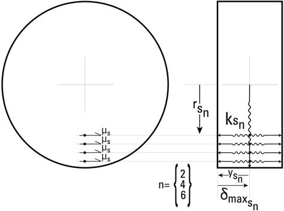
*Figure 4-38: The Sidewall Impact Tire-Terrain Model is an extension of the Radial Spring Model, and simulates forces applied to the tire sidewall.*

**Radial Distance from Wheel Center, rsn** — The springs are evenly spaced at this radial distance from the wheel center. By default, the springs are located along the section height of the tire (the spacing differs according to the tire section height and the number of sidewall springs, above).

**Lateral Distance from Wheel Center, ysn** — This distance specifies the resting length of the springs. By default, this length is one-half of the tire width.

**Sidewall Spring Stiffness Ratio, ksn** — This value provides the linear stiffness of each sidewall spring. The stiffness is assigned as a ratio of the tire radial spring stiffness. By default, the sidewall stiffness is equal to the tire radial spring stiffness divided by the number of sidewall springs.

**Saturation Deflection, dmax,sn** — This value represents the maximum sidewall spring deflection. The simulation terminates if the lateral spring deflection exceeds this value.

The forces acting at the tire sidewall produce additional forces and moments. Because these forces are not friction-limited, they can be much greater than forces generated at the tire-road interface. Sidewall forces also produce moments about the steering axis, affecting vehicle behavior when the Steer DOF Model option is used.

#### Soft Soil Tire Model

The Soft Soil Tire Model is based on research performed by M.G. Bekker [5.3] at the University of Michigan. The purpose of part of Bekker's research was to predict the performance and tractive effort requirements of the lunar rover (since no one had previously driven on the surface of the moon!). In the model (see Figure 4-39), tire sinkage into the soil is calculated using an empirical model developed by Bekker. The empirical model uses three soil descriptors:

**Bekker Soil Deformation Exponent, N** — An empirically derived value describing soil deformation characteristics.

**Soil Frictional Modulus, Kphi** — An empirically derived value describing soil frictional characteristics.

**Soil Cohesive Modulus, Kc** — An empirically derived value describing soil cohesive characteristics.

The reference includes a table of these soil descriptors for approximately 40 different soils of varying clay and moisture content. Many of these soils are included in the HVE Terrain Soils Database. Each terrain polygon includes a material attribute having these descriptors. The Soft Soil Tire Model uses these descriptors and current vertical tire load and size (unloaded radius and current rolling radius, and section width) to calculate the current soil sinkage beneath the tire. Sinkage also affects the earth-fixed elevation of the tire contact patch. Based on the calculated sinkage, the projected frontal and sidewall areas of the tire sinkage are calculated. These areas are then used in conjunction with the three soil descriptors (above) to calculate the Fx' and Fy' tire forces.

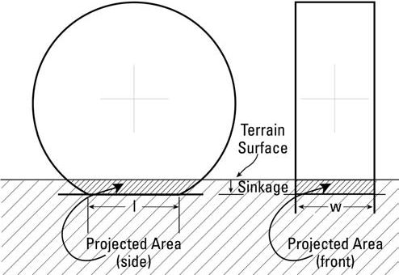
*Figure 4-39: The Soft Soil Tire-Terrain Model calculates the forces on a tire that is sinking into the terrain.*

#### Assigning Tire-Terrain Model Attributes

To assign the desired tire-terrain model and associated parameters, perform the following steps:

1. Choose Wheels from the HVE Set-up menu. The Wheel dialog is displayed, showing the option tabs: Blow-out, Damage, Brakes and Tire-Terrain.
2. Choose Tire-Terrain. The Tire-Terrain dialog is displayed, as shown in Figure 4-40.
3. Click on the Axle option list and select the desired axle location for the tire-terrain data.
4. Click on the Side option list and select the Right or Left side.
5. Click on the Location radio button and select the Inner or Outer tire location.

The Point Contact Tire-Terrain Model is the default selection. To choose a different model:

1. Click the Soft Soil radio button to select that option. When the tire travels over a soft soil (as determined using the Point Contact model approach), GetSurfaceInfo() will apply the Bekker soil parameters for the terrain beneath the tire.
2. Click the Radial Spring radio button to select that option. The additional attributes required by the Radial Spring Tire-Terrain Model will be enabled. Edit the default parameters, if desired.
3. Click the Sidewall Impact check box to select that option. The additional attributes required by the Sidewall Impact option will be enabled. Edit the default parameters, if desired.
4. If desired, use the Axle, Side and Location option lists to select additional tire positions and select the appropriate tire-terrain model.

   > **NOTE:** Different Tire-Terrain models may be assigned to each tire location.
5. Press OK to accept the tire-terrain parameters.

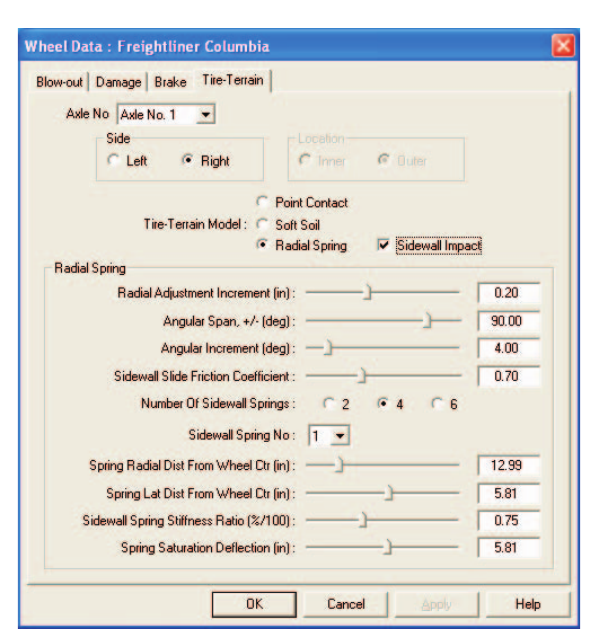
*Figure 4-40: The Tire-Terrain dialog allows the user to select from several available tire-terrain models useful for simulating tire interaction with potholes, curbs and soft soils.*

**See Also:** Vehicle Editor, Brake Information dialog, Vehicle Output Tracks

**Parameters:** The parameters assigned using the Wheels dialogs are shown in Table 4-12.

**Table 4-12: Wheel Editing Parameters**

| Parameter | Unit Name | Description |
|---|---|---|
| Axle Number | UtNone | Axle index (1, 2 or 3) |
| Side | UtNone | Side index (Right or Left) |
| Location | UtNone | Tire location index (Inner or Outer) |
| Tire Is Blown | UtNone | Flag indicating tire is blown |
| AutoStart | UtNone | Flag indicating start time is set by simulation |
| Start Time | UtVehTime | Simulation time at which blow-out or wheel displacement starts |
| Duration | UtVehTime | Duration over which air loss or wheel displacement occurs |
| Stiffness Factor | UtNone | Multiplier for tire stiffness parameters |
| Rolling Resistance Factor | UtNone | Multiplier for tire rolling resistance |
| Change in Coordinates | UtVehDispLength | Vehicle-fixed wheel displacement distance |
| Change in Camber | UtVehDispAngle | Vehicle-fixed wheel camber change angle |
| Percent Peak Lock-up Torque | UtBraPercent | Percentage of nominal torque required to lock wheel |
| Initial Lining Temp | UtEnvTemp | Temperature of brake lining at the start of the simulation |
| Initial Drum Temp | UtEnvTemp | Temperature of brake drum at the start of the simulation |
| Adjuster Slack | UtVehDispLength | Slack adjuster stroke before brake torque begins |
| Percent Brake Failure | UtBraPercent | Fraction of total brake failure at the selected wheel location (0 = no failure; 1 = total failure) |
| Tire-Terrain Model | UtNone | Tire-Terrain Model option |
| Sidewall Impact | UtNone | Flag indicating the Sidewall Impact option is to be used |
| Radial Adjustment Increment | UtTirDispLength | Incremental change in radial spring length used in spring force calculation |
| Angular Span | UtTirDispAngle | Sweep angle for radial springs |
| Angular Increment | UtTirDispAngle | Angular increment between radial springs |
| Sidewall Slide Friction Coefficient | UtNone | Tire sidewall slide friction coefficient |
| Number of Sidewall Springs | UtNone | Number of sidewall springs attached to each radial spring |
| Spring Number | UtNone | Spring index |
| Spring Radial Dist from Wheel Center | UtTirDispLength | Radial distance from wheel center to current lateral spring |
| Spring Lateral Dist from Wheel Center | UtTirDispLength | Distance from tire centerline plane to tire sidewall for current spring |
| Sidewall Spring Stiffness Ratio | UtNone | Ratio of sidewall spring stiffness to radial spring stiffness |
| Spring Saturation Deflection | UtTirDispLength | Maximum allowable deflection for current sidewall spring |

---

## ACCELEROMETERS

**Menu Option:** ACCELEROMETERS

**Purpose:** Assign the locations for up to five vehicle-fixed accelerometers

**Description:** The Accelerometers dialog allows the user to assign the vehicle-fixed x,y,z coordinates for up to five accelerometers. The simulation model can then return the velocity and acceleration at each selected location. Accelerometers are assigned using the Accelerometers dialog, as shown in Figure 4-41.

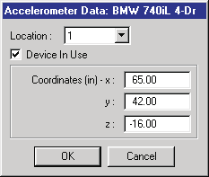
*Figure 4-41: Vehicle Accelerometers dialog.*

To assign one or more accelerometers to the current vehicle, perform the following steps:

1. Click on the Location Number option list and choose a device location.
2. Click the Device In Use check box. The Device Coordinates become editable.
3. Enter the vehicle-fixed coordinates of the accelerometer.
4. Repeat the above three steps for each additional location.
5. Press OK to assign the accelerometer location data.

The simulation reports the velocity and acceleration for the current timestep in the output tracks, Accelerometers group.

**Parameters:** The parameters assigned using this dialog are shown in Table 4-13.

**Table 4-13: Accelerometer Parameters**

| Parameter | Unit Name | Description |
|---|---|---|
| Device Number | UtNone | Device selector number |
| DeviceIsUsed | UtNone | Flag indicating the selected device is in use |
| x-coord, y-coord, z-coord | UtVehDispLinear | Vehicle-fixed coordinates of accelerometer |

**See Also:** Event Model Definition, Output Tracks. *(updated: see also the Options menu items Show Accelerometers and Show Accelerometer Paths, which visualize these locations — [Options Menu](../../01-user-interface/OptionsMenu.md))*

---

## CONTACTS

*(updated: in the current menu, Contacts appears before Restraints; the manual's original order is retained here to match the printed edition's cross-references. See also the code-verified dialog reference: [Contacts Dialog Box](../../09-events-driver-controls/ContactsDlg.md).)*

**Menu Option:** CONTACTS (Ctrl+T)

**Purpose:** Choose allowable human ellipsoid vs vehicle contact surface interactions during calculations and assign combined material attributes for the selected pair of contacts

**Description:** The Contacts dialog allows the user to select the allowable interactions between human ellipsoids and vehicle contact surfaces. For example, there is little chance of a human pedestrian's pelvis interacting with the vehicle's interior contact surfaces (e.g., the seat) during the simulation. Therefore, it makes little sense to perform force calculations for this ellipsoid/contact surface pair. By selecting only those contact surfaces having a chance of interaction, far fewer calculations need to be performed. As a result, the calculation time can be reduced significantly. The Contacts dialog is shown in Figure 4-44.

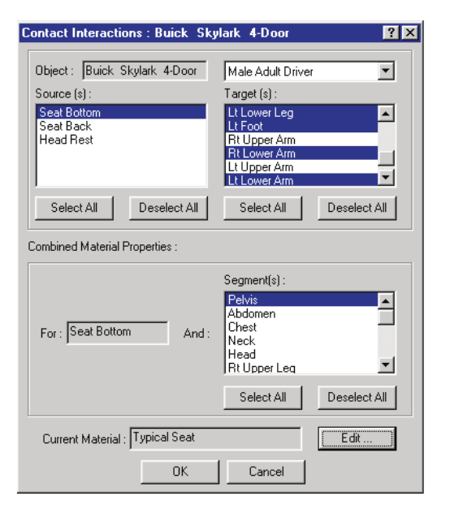
*Figure 4-44: The Contacts dialog allows the user to select the allowable interactions between human ellipsoids and vehicle contact surfaces during an occupant or pedestrian simulation.*

The Contacts dialog has three list boxes:

- **Source Segment** — A multiple selection list box containing all the contacts (human ellipsoids or vehicle contact surfaces) defined for the source object
- **Target Segment** — A multiple selection list box containing all the contacts (human ellipsoids or vehicle contact surfaces) defined for the target object
- **Combined Materials Target Segment** — A multiple selection list box containing all the contacts (human ellipsoids or vehicle contact surfaces) defined for the target object; only those segments selected in the multiple selection Target Segment list box (described above) are selectable in this list box

The source object is the object selected in the Event Editor dialog's Event Humans and Vehicles list box. This object is automatically selected before the Contacts dialog is displayed. The target object is selected from the Contacts dialog's Target Object option list. Once selected, the available contacts are displayed in the Source Segment and Target Segment list boxes. For humans, the list box will display all the human ellipsoids. For vehicles, the list box will display all the vehicle contact surfaces.

> **NOTE:** The Source Object and Target Object may be the same object. For example, the same human object may be selected from both option lists. This allows the user to define the interaction between the selected human's upper arm and torso, for example.

By default, all the vehicle interior contact surfaces are pre-selected for occupant simulations; all vehicle exterior contact surfaces are pre-selected for pedestrian simulations.

### Combined Material Properties

Some simulation models define the human ellipsoid and vehicle contact surface material properties according to the sole properties of the ellipsoid or contact surface; other simulations define the material properties as a combined property shared by the two interacting objects. In the latter case, a combined material property must be assigned for each interacting ellipsoid-contact surface pair.

> **NOTE:** In the former case, the material property is assigned directly in the Human and Vehicle Editors.

The combined material attributes for the selected Source and Target Segments are assigned using Combined Material Properties. By selecting a source and target segment, the Combined Materials Edit pushbutton is enabled. Pressing this button causes the Combined Materials dialog to be displayed (see Figure 4-45).

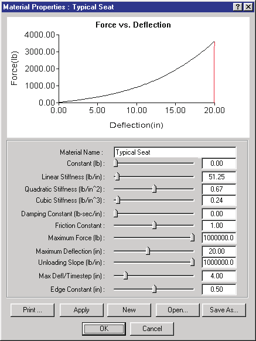
*Figure 4-45: The Combined Materials dialog allows the user to review and edit the material physical parameters associated with interaction between the selected source and target segments. The dialog also includes a graph of the force-deflection relationship for the selected segments.*

To select the allowable interactions for the current event, use the following steps:

1. Select either the human or the vehicle from the Event Humans and Vehicles list box. This object will be the source object.

   > **NOTE:** For vehicle occupant simulations, it is convenient to select the human.
2. Choose Contacts from the Set-up menu. The Contact Interactions dialog is displayed. The selected human or vehicle (see above step) becomes the Source Object.
3. Select one or more segments from the Source Object list box. If the selected object is a human, it may be convenient to click Select All. This will assign contacts for all human segments in a single step.
4. Click on the Target Object option list and choose a target object. The Target Segments list box displays all the available target segments; the default selections are highlighted.
5. Select (highlight) or deselect (unhighlight) the desired segments in the Target Segments list box so only the desired interactions are selected.

If the simulation model requires combined material properties, the Combined Material Properties' Target Segment list box will be enabled. In this case continue with the following optional steps:

1. Choose a target segment from the Target Segment list box.

   > **NOTE:** Only those segments selected earlier (see above) are selectable in this list box.

   > **NOTE:** If multiple segments are selected in the Source Segment list box, combined material attributes are assigned to all source segments.
2. Press Edit. The Combined Materials dialog is displayed for the selected source and target segments (see Figure 4-45).

   > **NOTE:** The default attributes are calculated using an arithmetic average of the individual properties for the selected segments.
3. Edit the desired material attributes.
4. Press Apply. The force-deflection curve for the entered material properties is displayed.

   > **NOTE:** The user also enters a Maximum Force. An error message is displayed if the maximum force cannot be achieved using the entered material constants.

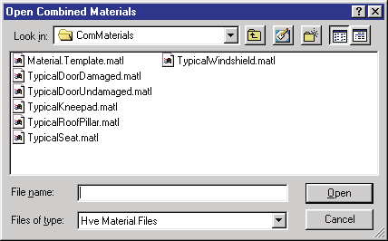
*Figure 4-46: The Combined Materials File Selection dialog allows the user to open and save combined material files.*

### Opening and Saving Material Files

Combined material properties may also be assigned from materials files. To assign combined material properties from a file, perform the following steps:

1. Press Open. The Combined Material File Selection dialog is displayed (see Figure 4-46).
2. Select the desired filename and choose Open. The selected material is displayed in the Combined Material dialog. The force-deflection characteristics are also graphed.
3. If desired, edit the materials properties as described above.
4. If desired, choose Save As. The Combined Material File Selection dialog is again displayed. Enter a filename, followed by Save, to save the new material for use on other events or cases.
5. Press OK to assign the combined material attributes to the selected Source/Target segment pair.
6. Repeat the above steps for each Source/Target segment pair.
7. Press OK to assign the contact interactions for the current event.

**Parameters:** The parameters assigned using the Contacts dialog are shown in Table 4-15.

**Table 4-15: Contact Interactions Dialog Parameters**

| Parameter | Unit Name | Description |
|---|---|---|
| Source Segment | n/a | Name of the source segment (may be either a human ellipsoid or a vehicle contact surface) |
| Target Segment | n/a | Name of the target segment (may be either a human ellipsoid or a vehicle contact surface) |
| Material Name | UtNone | User-editable material name |
| Constant | UtVehForce | Force required to initiate deflection |
| Linear Stiffness | UtVehMatStiffLinear | Linear material deformation coefficient |
| Quadratic Stiffness | UtVehMatStiffQuad | Quadratic material deformation coefficient |
| Cubic Stiffness | UtVehMatStiffCubic | Cubic material deformation coefficient |
| Damping Constant | UtVehMatDamp | Material velocity-dependent deformation constant |
| Friction Constant | UtNone | Inter-segment friction coefficient |
| Maximum Force | UtVehForce | Force at which 3rd-order force-deflection relationship is abandoned |
| Maximum Deflection | UtVehDispLinear | Deflection at which 3rd-order force-deflection relationship is abandoned |
| Unloading Slope | UtVehMatStiffLinear | Linear unloading slope beginning at max deflection |
| Max Defl/Timestep | UtVehDispLinear | Logical distance defining the amount of deformation allowed during one timestep (used to define front/back) |
| Edge Constant | UtNone | Force reduction coefficient for edges |

**See Also:** Human Information dialog, Human Editor, Human Ellipsoids dialog, Vehicle Editor, Vehicle Contact Surfaces dialog, User's Manual for simulation model

---

## RESTRAINTS

**Menu Option:** RESTRAINTS (cascade: Airbags Ctrl+G, Belts Ctrl+B)

**Purpose:** Assign restraint system usage parameters to the selected human

**Description:** The Restraints dialog allows the user to assign a restraint system to the selected human/vehicle pair. Two options are available:

- **Airbag Restraint** — Simulate an airbag restraint system
- **Belt Restraint** — Simulate torso belt and lap belt restraint systems

> **NOTE:** The belt restraint system is defined as part of the vehicle using the Vehicle Editor. However, as we all know, just because a vehicle has a restraint system does not necessarily mean it is being used!

> **NOTE:** If a particular restraint system is not installed in the vehicle at the selected human's seat location, the option will not be selectable.

> **NOTE:** The selected human's seat position (e.g., R/F, L/F, etc.) is defined in its Human Information dialog (see Human Editor).

The Restraint set-up options are described in the following sections.

### Airbag Restraints Option

The Airbag set-up option allows the user to assign an airbag restraint system and its in-use parameters for the selected occupant. To assign the airbag in-use parameters, perform the following steps:

1. Select the desired human from the Active Humans and Vehicles list.
2. Click on the Set-up menu and choose Restraints, then choose Airbags from the cascade menu. The Airbag Restraint System dialog for the selected vehicle is displayed (see Figure 4-42).
3. Click on the Airbag Restraints For option list and choose the desired human occupant.
4. Click on the Device In Use check box. The airbag restraints parameters become enabled for the selected occupant.
5. Using the Allowed Contacts list box, select the contact ellipsoids with which airbag contact is allowed.

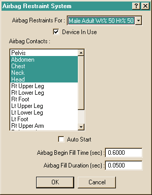
*Figure 4-42: Vehicle Airbag Restraint Systems dialog.*

6. Click on the AutoStart checkbox if you wish to have the airbag automatically deployed. Deployment is normally triggered when the vehicle's acceleration exceeds a threshold.

   > **NOTE:** Support of the AutoStart feature is calculation model-dependent. Refer to the User's Manual for your simulation program to determine if AutoStart is supported.
7. Assign the Airbag Begin Fill Time for the selected occupant.

   > **NOTE:** Airbag Begin Fill Time is disabled if AutoStart is selected.
8. Assign the Fill Duration for the selected occupant.
9. If desired, choose additional human occupants from the Airbag Restraints For option list and repeat the above steps to assign the airbag parameters for each occupant.
10. Press OK to accept the airbag restraint system options for the selected vehicle and its occupant(s).

When the simulation is executed, the airbag parameters will be incorporated into the simulation.

### Belt Restraints Option

The Belt Restraints set-up option allows the user to assign torso and lap belt restraints and in-use parameters for the selected occupant. To assign the belt restraint parameters, perform the following steps:

1. Select the desired vehicle from the Event Humans and Vehicles list.
2. Choose Restraints from the Set-up menu, and choose Belts from the Restraints cascade menu. The Belt Restraints System dialog for the selected vehicle will be displayed (see Figure 4-43).
3. Click on the Belt Restraints For option list and choose the desired human occupant.
4. Click on the Belt Segment option list and choose the desired belt restraint system (Torso Belt or Lap Belt).
5. Click the Device In Use check box. The belt restraints parameters become enabled for the selected occupant.
6. Click on the Attached To option list and select a segment to attach the end of the belt section (the other end is attached to the anchor point on the vehicle; see Vehicle Editor).

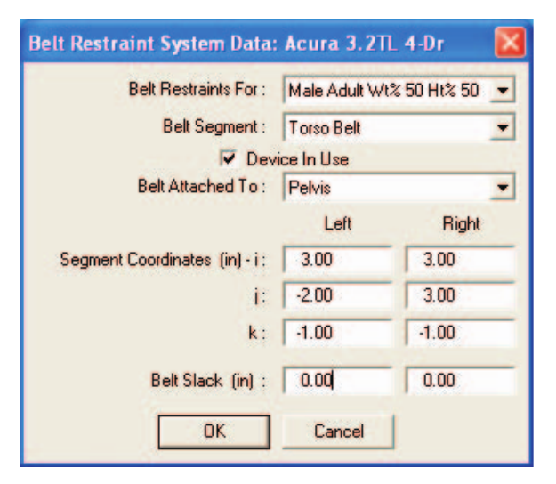
*Figure 4-43: Vehicle Belt Restraint System dialog.*

7. Enter the segment attachment coordinates for the left and right belt endpoints according to the human segment's coordinate system.

   > **NOTE:** These are segment-fixed coordinates, and normally lie on or near the surface of a contact ellipsoid.

   > **NOTE:** The left-side and right-side attachment points should be approximately symmetrical about the segment i-k plane; otherwise, belt tension may cause the human to rotate in an unexpected manner.
8. Enter the desired belt slack for the right and left sections of the selected belt.
9. Repeat the above steps for the other belt system, if desired.
10. Press OK to accept the belt restraint system parameters for the selected vehicle and its occupants.

When the simulation is executed, the belt restraint system parameters will be incorporated into the simulation.

**Parameters:** The parameters assigned using this dialog are shown in Table 4-14.

**Table 4-14: Airbag and Belt Restraint System Parameters**

| Parameter | Unit Name | Description |
|---|---|---|
| x, y and z Attachment Coordinates | UtHumDispLength | Segment-based x,y,z coordinates for the attachment point of the ends of the right and left belt segments |
| Belt Slack | UtVehDispLength | Belt slack. The amount of displacement between the ends of the belt allowed before creating belt tension (a negative value implies pre-load) |
| Airbag Begin Fill Time | UtVehTime | Simulation time at which the airbag is deployed and begins to fill |
| Airbag Fill Duration | UtVehTime | Length of time during which airbag filling occurs |

**See Also:** Human Editor, Human Information dialog, Vehicle Editor, Vehicle Model (Restraint Systems), Occupant Simulation, Human Output Tracks, Vehicle Output Tracks, Vehicle Data Report, User's Manual for selected simulation model

---

## SIGNALS

*(updated: this option was added after the 2006 manual)*

**Menu Option:** SIGNALS

**Purpose:** Set up traffic signals for the current event

**Description:** Choosing Signals from the Set-up menu displays the Event Signals Set-up dialog. Traffic signal lights defined in the environment can be assigned timing and state sequences (e.g., red/amber/green phases) for the current event, so that signal displays are synchronized with the simulation timeline and appear correctly in Event and Playback modes.

---

## NOTES

*(updated: this option was added after the 2006 manual)*

**Menu Option:** NOTES

**Purpose:** Attach text notes to the current event

**Description:** Choosing Notes from the Set-up menu displays the Event Notes dialog, which allows the user to enter one or more free-form text notes for the current event. The notes are stored with the event in the case file, providing a convenient way to document assumptions, data sources and set-up decisions.

<!-- NAV -->

---

← Previous: [Chapter 4: Set-up Menu (Part A — Position/Velocity, Driver Controls)](04a-setup-menu.md)  |  [Index](README.md)  |  Next: [Chapter 5: View Menu](05-view-menu.md) →

<!-- /NAV -->
