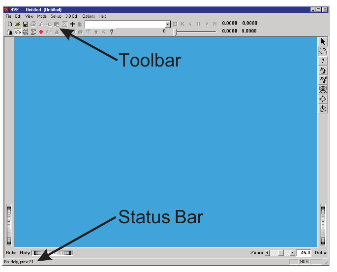
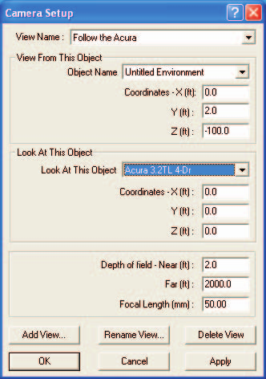
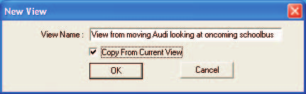
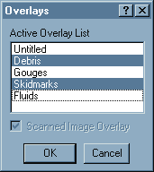

# Chapter 5: View Menu

*HVE User's Manual — Section Two: Menu Reference. Updated edition, verified against current HVE source code (HVEINV-64).*

The View Menu includes the following options:

- **Toolbar** — Displays the toolbar containing shortcuts for performing common tasks
- **Status Bar** — Displays the status bar of current user actions and selections at the bottom of the HVE window
- **Set Camera** — Define the viewing region and the camera reference point
- **Overlays** — Display or remove from the view user-named sets of objects

These options allow you to set up the HVE user interface and to determine how the scene is viewed. Each of the View Menu options is explained in this chapter.

---

## TOOLBAR

**Menu Option:** TOOLBAR

**Purpose:** Displays the toolbar of shortcuts for performing common tasks

**Description:** Choosing Toolbar from the View Menu displays the HVE Toolbar. The Toolbar (see Figure 5-1) provides a set of button choices for performing common tasks, such as changing modes, adding objects, opening and saving case files and executing events. All of these options are also available using HVE's pull-down menus. The Toolbar is simply quicker.

*Figure 5-1: The HVE Toolbar (near the top of the HVE window) provides a set of button choices for performing common tasks. The HVE Status Bar (near the bottom of the HVE window) displays a brief description of user actions and selections.*

---

## STATUS BAR

**Menu Option:** STATUS BAR

**Purpose:** Displays the HVE Status Bar at the bottom of the HVE window

**Description:** Choosing Status Bar from the View Menu displays the HVE Status Bar. The Status Bar (see Figure 5-1) displays a brief description of the user's actions or selections. The Status Bar may be thought of as a first-level help system.

**See Also:** Help

---

## SET CAMERA

**Menu Option:** SET CAMERA

**Purpose:** Determine how the scene is viewed

**Description:** Choosing Set Camera from the View Menu displays the Set Camera dialog. The Set Camera dialog allows the user to define what is visible in the viewers. It is called Set Camera because a camera metaphor is used to perform this task: determining how a scene is viewed is much like looking through a camera. See also the code-verified dialog reference: [Camera Set-up Dialog](../../01-user-interface/CameraSetDlg.md).

The Set Camera dialog is shown in Figure 5-2.

*Figure 5-2: The Set Camera dialog is used to determine how the scene is viewed.*

Setting the camera allows the user to perform the following functions:

- Select, create and store user-named views
- Attach the camera to a fixed or moving object
- Determine what the camera is looking at
- Set the depth of field
- Set the focal length of the lens
- Set the camera tilt (bank) angle
- Use the View From vehicle's vertical for the camera's up direction
- Make the View From vehicle's glass clear

> **NOTE:** Many of these functions may be performed interactively without using the Set Camera dialog. Instead, use the Viewer's pan, dolly, zoom and rotate thumb wheel controls.

To set up the camera, perform the following steps:

1. Choose Set Camera from the View menu. The Set Camera dialog will be displayed.
2. Click on the View From option list to select an object to attach the camera to.

   > **NOTE:** The option list contains the names of the environment and each vehicle in the current window (Event, Preview or Playback).
3. Enter the desired X,Y,Z (or x,y,z) coordinates for the View From object.
4. Click on the Look At option list to select an object to attach the camera to.

   > **NOTE:** The option list also contains the names of the environment and each vehicle in the current window (Event, Preview or Playback).
5. Enter the desired X,Y,Z (or x,y,z) coordinates for the Look At object.

   > **NOTE:** The View From and Look At coordinates are relative to the object the camera is attached to. For example, if View From and Look At are both Mason Convertible (a vehicle), the View From and Look At coordinates will both be relative to the Mason Convertible's CG, and the camera will move with the vehicle!
6. Enter the Near and Far Depth of Field (Clipping Planes).
7. Enter the Focal Length of the lens.
8. Press OK when the desired camera set-up data are entered.

Each of these steps is described more fully in the following paragraphs.

### View Name

The View Name option list displays and allows the user to select from a list of previously created views. The default View Name is Default Camera. Selecting a different view causes the Set Camera parameters (described below) to be updated to those assigned for the selected view. See also Save/Delete View below.

### View From This Object

The View From This Object option list allows the user to select the object from which the scene is viewed. This option list contains all the objects (humans, vehicles and environment) in the event (see Figure 5-1). Attaching the camera to a human or vehicle causes the camera to move with the human or vehicle.

### View From Coordinates

Next, the camera Coordinates are entered. These coordinates are relative to the selected View From object. For example, if the View From object is a vehicle, setting the View From coordinates at 0,0,0 means the scene will be viewed from the vehicle's CG, regardless of the vehicle's location in the environment.

### Look At This Object

The Look At This Object option list allows the user to select the object being viewed. This option list contains all the objects (humans, vehicles and environment) in the event (see Figure 5-1). Attaching the camera to a human or vehicle causes the view to remain fixed on that human or vehicle.

> **NOTE:** This is a very useful feature! For example, if the View From object is Vehicle A and the Look At is Vehicle B, the camera will automatically pan as required to keep viewing Vehicle B from Vehicle A.

> **NOTE:** If the View From and the Look At objects are the same object, the view will not pan. This is essentially the same behavior as existed in earlier versions of HVE.

### Look At Coordinates

The Look At Coordinates define the coordinates on the Look At object to which the view is attached. The coordinates are also relative to the View From object. For example, if the View From object is a vehicle, setting the Coordinates to 100,0,0 causes the view to look at a point 100 feet ahead of the vehicle, regardless of the vehicle's position or orientation.

> **NOTE:** A line drawn from the View From X,Y,Z coordinates to the Look At X,Y,Z coordinates is called the View Axis.

### Depth Of Field

The depth of field is defined by near and far clipping planes. Any object closer to the camera than the near clipping plane, or farther from the camera than the far clipping plane, will not be rendered in the scene.

### Focal Length

The Focal Length is the traditional focal length of a virtual 35 mm camera used to visualize the scene. A Focal Length of 50 mm is the default, and represents a normal view. Focal lengths less than 50 mm are wide-angle lenses; greater than 50 mm are telephoto lenses.

> **NOTE:** You can also set the focal length using the Zoom slider in the viewer. The number reported by the Zoom slider is the included angle of the viewer.

### Save...

*(updated: this button is labeled Save... in the current build.)* Pressing Save... saves the current camera settings as a named view. The named view is added to the View Name list so it can be recalled later. This lets the user quickly change between previously created views. Up to ten views may be stored.

*Figure 5-3: The New Camera View dialog is used to assign and store up to ten views for later retrieval.*

> **NOTE:** A separate Rename View control existed in earlier versions but is hidden and non-functional in the current build.

### Delete View

Pressing Delete View removes the current view from the list of views. The previous view in the View Name list box becomes the current view.

**Parameters:** The parameters assigned using this dialog are shown in Table 5-1.

**Table 5-1: Parameters assigned using the Set Camera dialog**

| Parameter | Unit Name | Description |
|---|---|---|
| View From Object Coordinates | Ut\*DispLength | Components of the X,Y,Z (or x,y,z) distances from the selected object origin to the camera |
| Look At Object Coordinates | Ut\*DispLength | Components of the X,Y,Z (or x,y,z) distances from the selected object origin to the center of the viewer |
| Near, Far Depth of Field (Clipping Planes) | Ut\*DispLength | Distance from the camera to the closest (Near) and farthest (Far) objects which can be viewed |
| Focal Length | Ut\*Camera | Focal length of the virtual camera lens |

\* UtHum for humans, UtVeh for vehicles and UtEnv for environments.

**See Also:** Viewers, Using HVE

---

## OVERLAYS

**Menu Option:** OVERLAYS

**Purpose:** Select or remove overlays from the selected viewer

**Description:** Choosing Overlays from the View Menu displays the Overlays dialog. The Overlays dialog (see Figure 5-4) allows the user to display or remove objects from the scene. The Overlays dialog displays a multiple-selection list box displaying all the overlay names of the objects in the viewer. By default, all objects are selected, and therefore, are displayed in the viewer. Click on an overlay name to remove all objects using that name. See also the code-verified dialog reference: [Overlays Dialog](../../01-user-interface/OverLayDlg.md).

> **NOTE:** A good example of the use of overlays is accident site debris. By using HVE's 3-D Editor to name all objects 'Debris' when they are created, the debris may be displayed or removed from the scene to show how an accident site appeared before and after the accident.

The Scanned Image check box is used to display or remove a scanned image from the environment. A scanned image may be used for the entire environment, or just the sky.

*Figure 5-4: Set Overlays Dialog, used for turning on and off various layers of geometry.*

> **NOTE:** If a scanned image is used for the entire environment, the user must enter the X,Y,Z coordinates from which the picture was taken, the X,Y,Z coordinates for the center of the picture, and the focal length of the camera lens used to take the picture. This information is required for registration between the scanned image and the moving humans and vehicles.

> **NOTE:** You should confirm the scale of the bitmap is correct by noting the time required for a vehicle to travel a known distance between two objects in the photograph.

To select or deselect overlays, perform the following steps:

1. Choose Overlays from the View menu. The Overlays dialog will be displayed, showing a list box with all the overlay names in the current scene. The currently selected overlays will be highlighted.
2. Select additional overlays you wish to be displayed, and deselect those overlays you wish to remove.
3. Click on the Scanned Image Overlay check box to display or remove any scanned environment image.
4. Press OK when the desired overlays and scanned image have been selected.

**See Also:** 3-D Editor, Current Object Attributes, Scanned Images (Bitmaps), Environment Information dialog, Set Camera dialog

<!-- NAV -->

---

← Previous: [Chapter 4: Set-up Menu (Part B — Damage Profiles through Notes)](04b-setup-menu.md)  |  [Index](README.md)  |  Next: [Chapter 6: Options Menu](06-options-menu.md) →

<!-- /NAV -->
