# Chapter 6: Options Menu

*HVE User's Manual — Section Two: Menu Reference. Updated edition, verified against current HVE source code (HVEINV-64). For a compact, code-verified summary of every current Options menu item, see [Options Menu](../../01-user-interface/OptionsMenu.md).*

The Options Menu includes the following options *(updated: list and order verified against the current menu; items marked "new" were added after the 2006 manual)*:

- **Create DB** *(new)* — Rebuilds the HVE object database from the database source files.
- **Show Key Results** — Displays a window during Event and Playback mode containing user-selectable results.
- **Show Axes** — Displays a coordinate axis system for each human and vehicle, as well as the environment.
- **Show Contacts** — Displays the physical contact surfaces on each human and vehicle.
- **Show Belt Anchors** — Displays an icon at the vehicle-fixed anchor point for lap and shoulder belt restraints on each vehicle.
- **Show Velocity Vectors** — Displays a velocity vector on each human and vehicle according to its current velocity and direction.
- **Show Skidmarks** — Displays simulated skidmarks for each vehicle.
- **Show Tracks** *(new)* — Displays the path traced by each tire.
- **Show CGs** *(new)* — Displays a symbol at each vehicle's center of gravity.
- **Show CG Paths** *(new)* — Displays the path traced by each vehicle's CG.
- **Show Accelerometers** *(new)* — Displays a symbol at each vehicle's accelerometer locations.
- **Show Accelerometer Paths** *(new)* — Displays the path traced by each vehicle's accelerometers.
- **Show Position Sequences** *(new)* — Displays position sequence overlays.
- **Show Targets** — Displays positions not used by the current calculation model. These positions are displayed as translucent to distinguish them from positions used by the current calculation model.
- **Show Connections** *(new)* — Displays connections between connected vehicles (e.g., tractor-trailer).
- **Distance Tool** *(new)* — Displays a modeless dialog for measuring distances in the viewer.
- **Show Path** *(new)* — Displays a smooth curved path based on the event's path positions.
- **Autoposition (On/Off)** — During event positioning by the user, causes the selected vehicle to be positioned on top of the environment's physical surface.
- **Grid** — Displays a set of construction lines at user-specified intervals.
- **Units** — Allows the user to select the current system of units.
- **Shadows** *(new)* — Displays the Shadow Options dialog controlling rendered shadows.
- **Render** (Ctrl+R) — Allows the user to choose how objects are drawn on the screen.
- **Playback** — Allows the user to choose the output time interval used for trajectory simulations and reports in Playback Mode.
- **Simulation Controls** (Ctrl+Y) — Allows the user to set various simulation control parameters for the current event.
- **Calculation Options** (Ctrl+J) — Allows the user to assign optional parameters required by the current calculation model.
- **DyMESH** — Allows the user to choose various modeling options available to the DyMESH collision model.
- **Get Surface Info** — Sets options that determine which terrain surface polygons vehicle tires may drive on.
- **Preferences** (Ctrl+F) — Allows the user to choose various user-selectable preferences.

> *(updated: the "Add Playback Window" option described at the end of the 2006 chapter is no longer located in the Options menu. Playback windows are now added from Playback mode; the original description is retained at the end of this chapter for reference.)*

The checked/unchecked options are toggles allowing the user to choose which information HVE displays. Other selections in the Options Menu allow users to customize their HVE user environment. Each of these options is explained on the following pages.

---

## CREATE DB

*(updated: this option was added after the 2006 manual)*

**Menu Option:** CREATE DB

**Purpose:** Rebuild the HVE object database

**Description:** Choosing Create DB rebuilds the HVE object database (ESNDB.db) from the database source files. All vehicle and human binary files are regenerated and the rebuilt database is reloaded. This may take a few moments; the cursor changes to an hourglass while the database is being created.

---

## SHOW KEY RESULTS

**Menu Option:** SHOW KEY RESULTS

**Purpose:** Display or remove Key Results windows for all displayed events

**Description:** Choosing Show Key Results from the Options Menu displays a Key Results window for each object. Key Results windows display user-specified results during Event and Playback modes. Key Results are especially useful during Event mode to monitor the values of one or more variables at each timestep. Use the Variable Selection dialog to select which variables are displayed in the Key Results window. See also the code-verified dialog reference: [Key Results Dialog Box](../../01-user-interface/KeyResDlg.md).

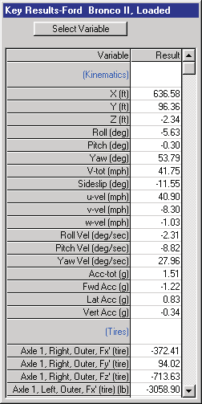
*Figure 6-1: The Key Results window displays the current simulation results for the selected human or vehicle.*

*Figure 6-2: The Variable Selection dialogs for humans (left) and vehicles (right) allow the user to select the variables displayed in the Key Results dialog as well as in the Variable Output window (see Playback Mode).*

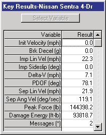
*Figure 6-3: Reconstruction programs also have Key Results windows.*

**See Also:** Variable Selection dialog, Event Execution, Variable Output

---

## SHOW AXES

**Menu Option:** SHOW AXES

**Purpose:** Display or remove coordinate axis systems from all humans, vehicles and environments

**Description:** Choosing Show Axes from the Options Menu displays a set of vectors in the X,Y,Z directions for each human and vehicle, as well as the environment. The origin of the axis system is at the origin of the object. The axes are displayed in all modes.

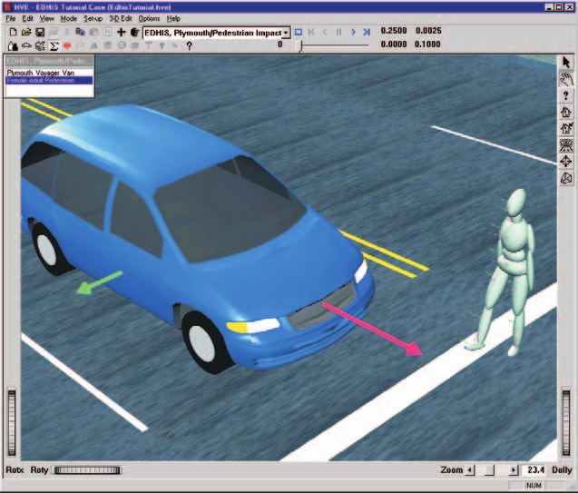
*Figure 6-4: Show Axes Option.*

**See Also:** Coordinate Systems

---

## SHOW CONTACTS

**Menu Option:** SHOW CONTACTS

**Purpose:** Display or remove physical contact surfaces from all humans, vehicles and environments

**Description:** Choosing Show Contacts from the Options Menu displays the physical contact surfaces used for generating forces between human ellipsoids and vehicle contact surface planes. Visualizing these planes can be very useful while creating the ellipsoids and surface planes, and also during Event mode when the interactions are being simulated. However, you may choose to hide contacts during Playback mode if you find them visually distracting.

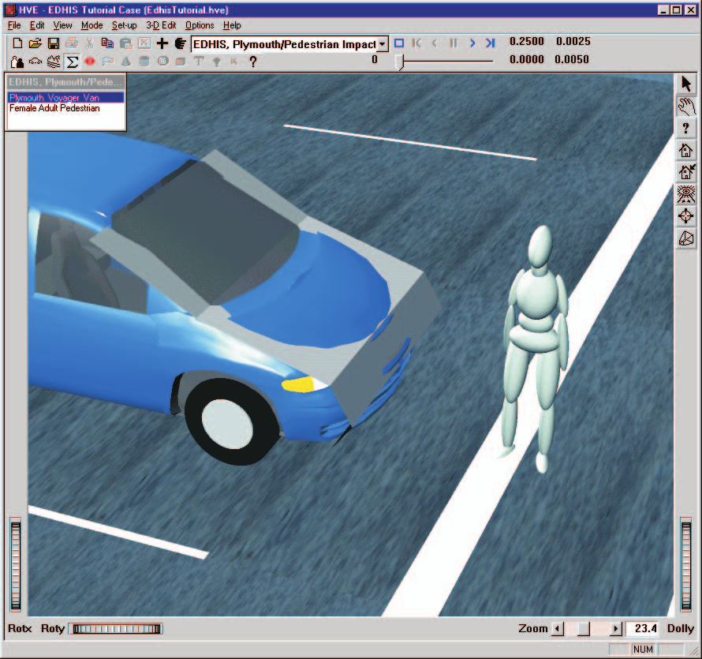
*Figure 6-5: Show Contacts Option for Vehicles.*

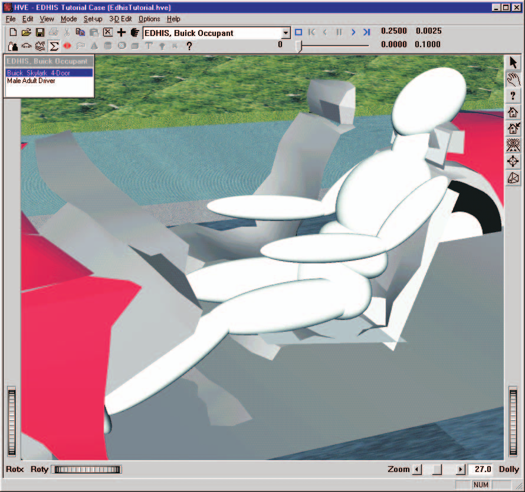
*Figure 6-6: Show Contacts Option for Humans.*

**See Also:** Human Editor, Human Contact Ellipsoids, Vehicle Editor, Vehicle Contact Surfaces, Event Set-up (Inhibiting Contacts)

---

## SHOW BELT ANCHORS

**Menu Option:** SHOW BELT ANCHORS

**Purpose:** Display or remove the icons defining the vehicle-fixed x,y,z coordinates for the lap and torso belt restraints for each vehicle

**Description:** Choosing Show Belt Anchors from the Options Menu displays the vehicle-fixed belt anchor locations for each belt restraint system installed in the vehicle. The location of the icon can provide important visual cues during event set-up as well as during execution.

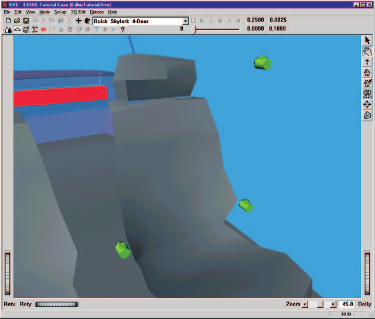
*Figure 6-7: Show Belt Anchors Option for Vehicles.*

**See Also:** Event Set-up, Variable Output

---

## SHOW VELOCITY VECTORS

**Menu Option:** SHOW VELOCITY VECTORS

**Purpose:** Display or remove a vector (arrow) representing the magnitude and direction of the total velocity for all humans and vehicles

**Description:** Choosing Show Velocity Vectors from the Options Menu displays the current velocity vector during Event and Playback modes. Both relative magnitude and direction are shown. (The vector's length shortens as the vehicle slows.) This vector can provide important visual cues during event set-up as well as during execution. *(updated: see also the Long Velocity Vectors option in the User Preferences dialog, which lengthens the displayed vectors.)*

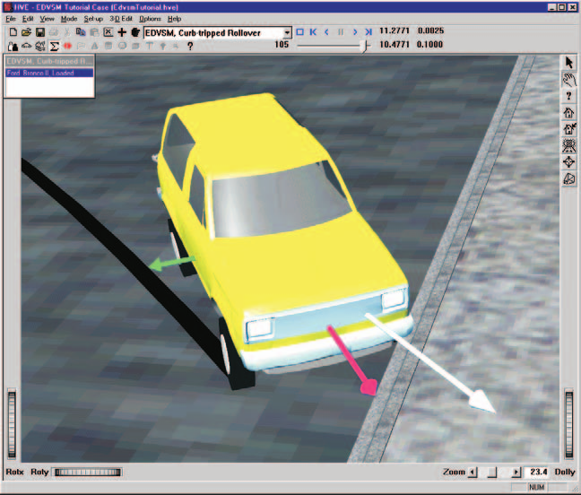
*Figure 6-8: Show Velocity Vectors Option for Vehicles.*

**See Also:** Event Set-up, Variable Output

---

## SHOW SKIDMARKS

**Menu Option:** SHOW SKIDMARKS

**Purpose:** Display or remove simulated vehicle skid and scuff marks in the environment

**Description:** Choosing Show Skidmarks from the Options Menu displays tire skidmarks and scuffmarks calculated by the simulation model. Simulated tire marks are displayed for each tire, including duals, and are displayed according to the current value of Tire Skid in Variable Output (see Variable Selection, Tire Group).

Tire marks are drawn according to the current vertical tire load (higher loads result in darker marks), and longitudinal and lateral tire slip (higher slips result in darker marks). The width of a tire mark is determined by the tire width (according to its tire size designation).

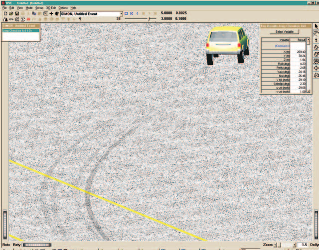
*Figure 6-9: The Show Skidmarks Option displays simulated skidmarks from each tire generated by the simulation.*

**See Also:** Simulation Models, Vehicle Editor (Tire Information), Skidmark Elevation (User Preference)

---

## SHOW TRACKS

*(updated: this option was added after the 2006 manual)*

**Menu Option:** SHOW TRACKS

**Purpose:** Display or remove the wheel track overlay

**Description:** Choosing Show Tracks toggles the display of the path traced by each tire, whether or not the tire is skidding. Wheel tracks are useful for comparing the simulated wheel paths against evidence at the scene.

---

## SHOW CGs / SHOW CG PATHS

*(updated: these options were added after the 2006 manual)*

**Menu Options:** SHOW CGs, SHOW CG PATHS

**Purpose:** Display or remove CG symbols and CG path traces

**Description:** Show CGs toggles the display of a symbol at each vehicle's center of gravity. Show CG Paths toggles the display of the path traced by each vehicle's center of gravity during the event.

---

## SHOW ACCELEROMETERS / SHOW ACCELEROMETER PATHS

*(updated: these options were added after the 2006 manual)*

**Menu Options:** SHOW ACCELEROMETERS, SHOW ACCELEROMETER PATHS

**Purpose:** Display or remove accelerometer symbols and path traces

**Description:** Show Accelerometers toggles the display of a symbol at each vehicle's accelerometer locations (assigned using the Set-up menu Accelerometers option; see [Chapter 4, Part B](04b-setup-menu.md#accelerometers)). Show Accelerometer Paths toggles the display of the path traced by each accelerometer during the event.

---

## SHOW POSITION SEQUENCES

*(updated: this option was added after the 2006 manual)*

**Menu Option:** SHOW POSITION SEQUENCES

**Purpose:** Display or remove position sequence overlays

**Description:** Choosing Show Position Sequences toggles the display of position sequence overlays — a series of vehicle positions displayed at selected times during the event.

---

## SHOW TARGETS

**Menu Option:** SHOW TARGETS

**Purpose:** Display or remove target humans and vehicles from the environment

**Description:** Choose Show Targets from the Options Menu to display target humans and vehicles. Targets are positions you can enter during event set-up that do not enter into simulation calculations (except for the HVE Path Follower), but allow you to visually compare how closely the simulated path matches the actual path represented by the targets. Simulation models may also perform error calculations based on the target positions and velocities to quantify the match between simulated and actual paths.

Target humans and vehicles are translucent to distinguish them from positions used by the calculation model.

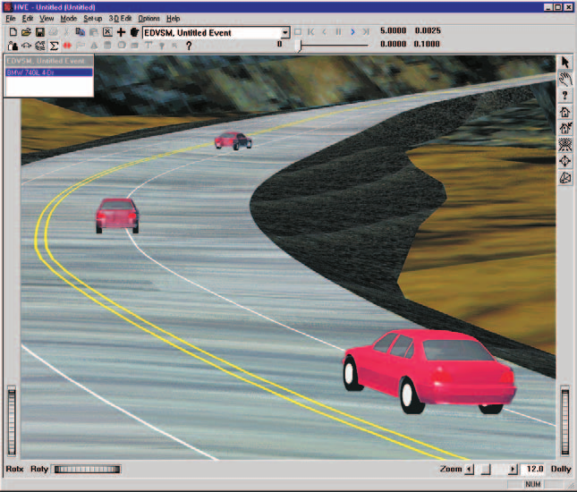
*Figure 6-10: The Show Targets Option displays user-entered vehicle target positions (i.e., positions not required by the reconstruction or simulation model). Target positions are translucent, to distinguish them from other positions. Targets are a useful means of assessing how well the simulated path matches the actual path.*

**See Also:** Event Editor, Event Set-up

---

## SHOW CONNECTIONS

*(updated: this option was added after the 2006 manual)*

**Menu Option:** SHOW CONNECTIONS

**Purpose:** Display or remove vehicle connection markers

**Description:** Choosing Show Connections toggles the display of the connections (e.g., hitches and articulation points) between connected vehicles, such as a tractor and its trailer(s). See also: [Inter-Vehicle Connections Dialog](../../09-events-driver-controls/IntrVehConnsDlg.md).

---

## DISTANCE TOOL

*(updated: this option was added after the 2006 manual)*

**Menu Option:** DISTANCE TOOL

**Purpose:** Measure distances in the viewer

**Description:** Choosing Distance Tool displays the modeless Distance Tool dialog, used for measuring distances in the viewer during Event mode. This option is available only when the case contains at least one event.

---

## SHOW PATH

*(updated: this option was added after the 2006 manual)*

**Menu Option:** SHOW PATH

**Purpose:** Display a smooth curved path based on the event's path positions

**Description:** Choosing Show Path displays the Show Curved Path dialog for the current event. Use it to display a smooth (spline) curved path in the viewer based on the event's path positions; the path display is updated when the dialog is closed with OK.

---

## AUTOPOSITION (On/Off)

**Menu Option:** AUTOPOSITION (On/Off)

**Purpose:** Allows automatic 3-D positioning of vehicles

**Description:** Choosing AutoPosition from the Options Menu causes vehicles to be positioned on top of the environment surface geometry. AutoPosition uses the current surface elevation beneath each wheel and the vehicle's tire radii and ride height to determine the earth-fixed Z coordinate of the vehicle CG which will place the vehicle in equilibrium at the start of a simulation. AutoPosition greatly simplifies initial positioning for 3-D simulations, which otherwise tend to take a while for the simulation to reach equilibrium.

AutoPosition does not include suspension and tire deflections. Therefore, a small disturbance may still be experienced, especially on 3-D terrain which does not form a plane beneath the tires.

AutoPosition is always used for 2-D reconstructions and simulations. Because these models do not include suspension effects, on severely non-planar surfaces tires will appear to come off the ground. This visual effect does not affect calculations.

**See Also:** Event Set-up (Position/Velocity)

---

## GRID

**Menu Option:** GRID

**Purpose:** Set a user-definable distance interval for display and data entry in the environment

**Description:** Choosing Grid from the Options Menu displays markers at user-defined intervals. These markers are used for spatial cues to help determine distances while creating and editing 3-D models of humans, vehicles and environments. See also the code-verified dialog reference: [Set Grid Dialog Box](../../01-user-interface/SetGridDlg.md).

**Parameters:** The parameters assigned using this dialog are shown in Table 6-1.

**Table 6-1: Grid Parameters**

| Parameter | Unit Name | Description |
|---|---|---|
| Grid Space | Ut\*DispLength | Distance between grid lines or markers in the 3-D Editor viewers |

\* Either UtHumDispLength, UtVehDispLength or UtEnvDispLength, depending on the object loaded in the 3-D Editor.

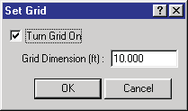
*Figure 6-11: Grid Dialog used for the 3-D Editor.*

**See Also:** 3-D Editor

---

## UNITS

**Menu Option:** UNITS

**Purpose:** Allow the user to switch between US, SI and user-defined systems of units

**Description:** Choosing Units from the Options Menu displays the Units dialog, allowing the user to specify the current system of units. HVE maintains two basic sets of units: program units and user units. Program units are always pounds, inches and seconds (and derivatives of these basic quantities). These units are used for all the internal workings, and the user never sees them. Instead, the user sees the user units, which may be defined according to the user's needs through the use of the proper conversion factors. This conversion factor converts all the user's entries into program units so HVE can operate on them, and also converts all the program's results into user units. See also the code-verified dialog reference: [Units Dialog Box](../../01-user-interface/UnitsDlg.md).

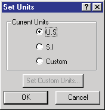
*Figure 6-12: The Set Units dialog allows the user to change the current units.*

**See Also:** Appendix IV

---

## SHADOWS

*(updated: this option was added after the 2006 manual)*

**Menu Option:** SHADOWS

**Purpose:** Control rendered shadows

**Description:** Choosing Shadows displays the Shadow Options dialog. Options include Show Shadows (turns shadow rendering on/off) and user-editable Radius, Quality, Precision and Intensity values that control the size, smoothness and darkness of the rendered shadows.

---

## RENDER

**Menu Option:** RENDER (Ctrl+R)

**Purpose:** Set various options that affect the visual appearance of all 3-D objects

**Description:** Choosing Render from the Options Menu displays the Render dialog. The Render dialog includes several user-definable options which affect the visual quality of the objects displayed by HVE. See also the code-verified dialog reference: [Render Options Dialog](../../01-user-interface/RendOptDlg.md).

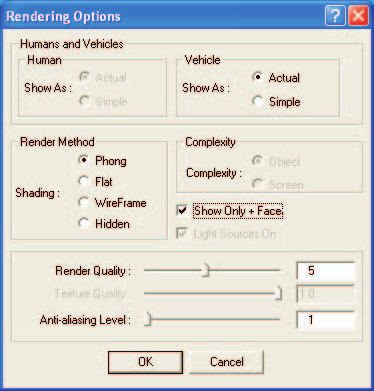
*Figure 6-13: The Render Options dialog allows the user to set various rendering options which determine the image quality and rendering speed.*

> **NOTE:** Increasing render quality makes objects look better, but always increases the time required to display the objects.

The available render options are:

- Show As
- Render Method
- Complexity
- Render Quality
- Anti-aliasing Level

### Show As

Show As is an option for both humans and vehicles. When Show As Actual is selected, HVE displays humans or vehicles using the object's 3-D geometry file. If Show As Simple is selected, humans are displayed as ellipsoids and vehicles are displayed as simplified boxy-shaped objects.

> **NOTE:** The Human Show As choices (Actual/Simple) are currently disabled (grayed out) in the dialog.

> **NOTE:** If a human or vehicle does not have a 3-D geometry file, it will be displayed as a Simple object, regardless of which option is selected.

### Render Method

HVE provides four Render Methods:

- Phong Shading
- Flat Shading
- Wireframe
- Hidden Line

**Phong Shading** is required for realistic images. Only if Phong shading is selected are special lighting and shading calculations performed. Because of these calculations, Phong shading also has the longest rendering time.

**Flat Shading** displays each object according to its user-defined color(s). However, no lighting or shading calculations are performed, so objects appear less realistic when compared to Phong shading; however, objects are rendered more quickly.

**Wireframe** mode shows only the edges of each object; no surfaces are displayed. The resulting display is faster, but realism is lost. Wireframe mode is often useful as a construction technique during model building in the 3-D Editor.

**Hidden Line** is like Wireframe, except it includes depth calculations: objects hidden behind other objects are not displayed. Like Wireframe, Hidden Line mode is often useful as a construction technique during model building in the 3-D Editor.

### Complexity

The Complexity option allows the user to specify whether objects are drawn relative to object space or screen space. If Object is selected, all the object's polygons are rendered, regardless of the distance from the camera. If Screen is selected, HVE uses the object size and distance from the camera to decide whether to render all the object's polygons, or just render its pixels at some average color.

For example, consider an object which is a great distance from the camera. By selecting Object mode, rendering calculations are performed for every polygon, even though the result may simply be only 25 or 30 pixels in size and not even detectable to most viewers. By selecting Screen mode, these objects are displayed much more quickly, although close inspection may reveal a lesser quality image.

> **NOTE:** The Complexity choices (Object/Screen) are currently disabled (grayed out) in the dialog.

### Show Only + Faces

All polygons have a front side and a back side, as determined by the right-hand rule. The positive (+) side is determined by a counter-clockwise order of vertices comprising the polygon. Choosing this option is a way to determine if one or more polygons has the vertices in the wrong order.

> **NOTE:** This is important to DyMESH.

### Render Quality

Render Quality is a user-definable range (1 to 10) which defines how finely objects are subdivided (tessellated). The default value is 5. If a value less than 5 is selected, objects like cones and spheres appear more blocky; surfaces may have unrendered areas. Selecting a value greater than 5 results in smoother cones and spheres; the appearance of surfaces may or may not improve (depending on how they were created). Again, there is a trade-off between speed and image quality.

### Anti-aliasing Level

Anti-aliasing Level is a user-definable range (1 to 10) which defines how smoothly objects are rendered. The default value is 1. If a value greater than 1 is selected, objects are re-rendered up to 10 times (depending on the selected value), resulting in a significant improvement in image quality. However, rendering time is increased significantly.

> **NOTE:** In general, it is best to use the lowest possible rendering quality while editing objects and events. Boost the rendering quality before rendering the final result.

**See Also:** 3-D Editor

---

## PLAYBACK

**Menu Option:** PLAYBACK

**Purpose:** Set the time step for the current playback window

**Description:** Choose Playback from the Options Menu to display the Playback Controls dialog. The Playback Controls dialog allows the user to select the output interval during Playback Mode. This value is used for all outputs, including the Variable Output table and Trajectory Simulations. The value is also used for the Playback Window, which may be routed to video.

> **NOTE:** Options → Playback opens this output-interval dialog. It is distinct from the toolbar transport controls (Reset/Rewind/Play) documented in the code-verified reference [Playback Controls](../../01-user-interface/PlayBackControls.md).

> **NOTE:** For real-time recording to video, this value should be set to 0.0333 sec (1/30 second) for NTSC video or 0.0400 sec (1/25 second) for PAL video.

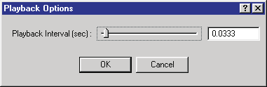
*Figure 6-14: The Playback Options dialog allows the user to edit the time interval for results displayed in Playback Mode.*

**Parameters:** The parameters assigned using this dialog are shown in Table 6-2.

**Table 6-2: Playback Parameters**

| Parameter | Unit Name | Description |
|---|---|---|
| Playback Interval | UtTime | Time interval used during Playback Mode. Affects Variable Output and Trajectory Simulation windows. |

> **NOTE:** For slow-motion recording to video, the Playback Interval may be set to a value less than 1/30th second. For example, setting the value to 0.0033 will result in slow-motion video output at 1/10th real time.

**See Also:** Variable Output, Playback Mode, Trajectory Simulation, Playback Window

---

## SIMULATION CONTROLS

**Menu Option:** SIMULATION CONTROLS (Ctrl+Y)

**Purpose:** Display and allow editing of all simulation control data for the current event

**Description:** Choosing Simulation Controls from the Options Menu displays the Simulation Controls dialog. See also the code-verified dialog reference: [Simulation Controls Dialog](../../09-events-driver-controls/SimuCtrlDlg.md).

> **NOTE:** The Simulation Controls option is only available in Event Mode, and requires that a current event be selected.

Simulation controls options are used by all simulation programs. All simulations require two basic types of simulation controls:

- Integration Timesteps
- Termination Conditions

### Integration Timesteps

Integration Timesteps define the discrete timestep used by the simulation, and are dependent on the purpose and type of the simulation. The individual Integration Timestep Controls provided by HVE are shown in Table 6-3.

### Termination Conditions

Termination Conditions are used to define when the simulation terminates. Termination Linear and Angular Velocities are natural termination conditions which define when a simulated object has stopped moving.

> **NOTE:** Owing to the nature of discrete timestep integration, a simulated object will never stop moving unless some non-zero termination velocity is supplied.

The Simulation Controls dialog is shown in Figure 6-15.

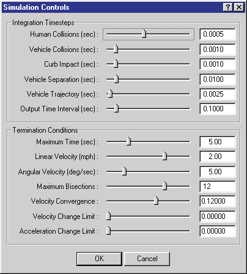
*Figure 6-15: The Simulation Controls dialog allows the user to edit the simulation control parameters for the current event.*

**Parameters:** The parameters assigned using this dialog are shown in Table 6-3.

**Table 6-3: Simulation Parameters**

| Parameter | Unit Name | Description |
|---|---|---|
| Dt, Human Collision | UtHumTime | Integration timestep used during the collision phase for occupant and pedestrian simulations |
| Dt, Vehicle Collision | UtVehTime | Integration timestep used during the collision phase for vehicle simulations |
| Dt, Curb Impact | UtVehTime | Integration timestep used during curb impact for vehicle simulations |
| Dt, Vehicle Separation | UtVehTime | Integration timestep used during the initial portion of the post-impact phase for vehicle simulations |
| Dt, Vehicle Trajectory | UtVehTime | Integration timestep used for vehicle trajectory simulations |
| Dt, Output | UtTime | Event output time interval |
| Maximum Time | UtTime | Maximum simulation time |
| Linear Termination Velocity | Ut\*VelLinear | Minimum linear velocity. Event termination may result if current linear velocity is less than this value. |
| Angular Termination Velocity | Ut\*VelAngular | Minimum angular velocity. Event termination may result if current angular velocity is less than this value. |
| Max. Bisections | UtNone | Maximum number of times the integration timestep may be halved |
| Velocity Convergence | UtNone | Allowable error between predicted and actual integration results |
| Velocity Change Limit | UtNone | Maximum allowable change in velocity during one timestep |
| Acceleration Change Limit | UtNone | Maximum allowable change in acceleration during one timestep |

\* Either UtHum or UtVeh, depending on the current objects.

**See Also:** Event Model, Simulation Model, User's Manual for calculation method

---

## CALCULATION OPTIONS

**Menu Option:** CALCULATION OPTIONS (Ctrl+J)

**Purpose:** Display and allow editing of any calculation-specific parameters

**Description:** Choosing Calculation Options from the Options Menu displays the Calculation Options dialog.

> **NOTE:** The Calculation Options option is available in Event Mode only, and requires that the current calculation model use a Calculation Options dialog.

> **NOTE:** The Calculation Options dialog is different for each calculation model (e.g., EDCRASH, EDGEN, EDHIS, EDSMAC, EDSMAC4, EDSVS, EDVDS, EDVSM, EDVTS, SIMON).

A sample Calculation Options dialog is shown in Figure 6-16.

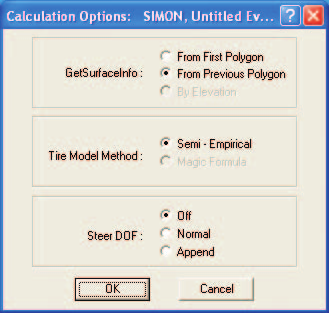
*Figure 6-16: The Calculation Options dialog allows the user to supply calculation-specific parameters.*

**See Also:** Event Model, User's Manual for the specific calculation model

---

## DYMESH

**Menu Option:** DYMESH

**Purpose:** Allows the user to choose various modeling options available to the DyMESH collision model

**Description:** DyMESH is a 3-dimensional collision model used for simulating the collision phase of a collision between two or more vehicles (or a vehicle and the environment). Choosing DyMESH from the Options Menu displays the DyMESH Options dialog.

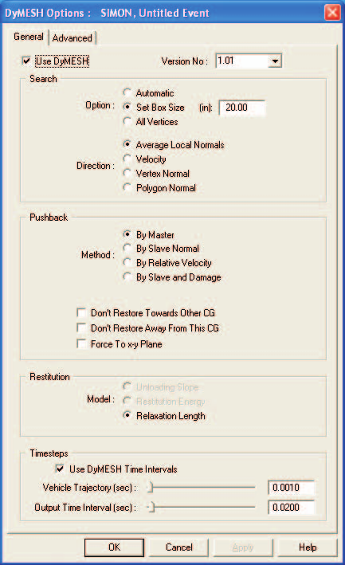
*Figure 6-17: The DyMESH Options dialog allows the user to assign various DyMESH Options. The General Options are shown.*

The DyMESH Options is a tabbed dialog, divided into General and Advanced options (see Figures 6-17 and 6-18). DyMESH is enabled by clicking on the Use DyMESH check box. The DyMESH Version No. is selectable from a drop-down list.

> **NOTE:** The Version No. is available for compatibility with simulations performed using previous versions.

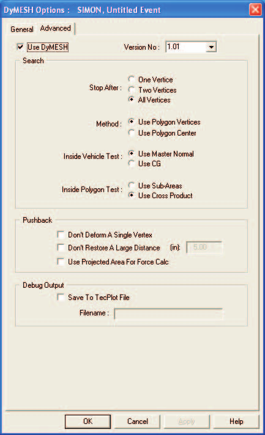
*Figure 6-18: The Advanced DyMESH Options dialog allows the user to assign additional DyMESH options.*

### General Options

The General Options page provides the basic settings for DyMESH. These settings are described below.

#### Search

Search determines how DyMESH decides if a vertex of one vehicle is inside the other vehicle mesh. The user-definable groups are Option and Direction.

**Option** — For each vertex on the slave vehicle, DyMESH must find the candidates for potential contact with polygons on the master vehicle. Three possibilities are:

- **Automatic** — This method locates all polygons that are directly attached to the polygon through which the vertex has penetrated. The process is automatic in that DyMESH finds the candidates by searching at each timestep the penetrated polygon's neighbors. Potentially the fastest method.
- **Set Box Size** (default) — This method finds all polygons on the master vehicle within the specified distance from the slave vertex.
- **All Vertices** — The sledgehammer approach. This method simply assumes every polygon on the vehicle is a candidate. Fool-proof, but slow.

**Direction** — To determine which master polygon candidate(s) a slave vertex may have penetrated, it is necessary to determine a direction in which to search for polygons. Four possibilities:

- **Average Local Normals** (default) — This method uses the average direction of the surface normal vectors for all penetrating slave vertices (see Search Option, above).
- **Velocity** — This method uses the direction of the velocity vector between slave vertex and candidate polygons.
- **Vertex Normal** — This method uses the direction of the slave vertex normal vector.
- **Polygon Normal** — This method uses the direction of the master surface polygon normal vector.

#### Pushback

Pushback determines how each slave vertex is displaced back to the master surface polygon.

**Method** — If the Search Direction (see above) is Average Local Normals, it is necessary to decide which method is used. Four possibilities:

- **By Master** (default) — uses surface normals of nearby polygons on the master vehicle (weighted by nearness)
- **By Slave Normal** — uses average normals of the penetrating slave vertices
- **By Relative Velocity** — uses the average velocity vector of the penetrating slave vertices (the vectors will be different if there is relative rotation of the vehicles)
- **By Slave and Damage** — uses the average normals of the penetrating slave vertices when first damaged (assumes subsequent damage will be in the same direction)

**Options** — Additional Pushback options are available as checkboxes (by default, none are set):

- **Don't Restore Toward Other CG** — This logical flag (TRUE or FALSE) prevents pushback if the pushback direction is toward the master vehicle's CG. Choosing this option helps prevent errant vertex calculations for non-water-tight meshes.
- **Don't Restore Away From This CG** — This logical flag (TRUE or FALSE) prevents pushback if the pushback direction is away from the slave vehicle's CG. Choosing this option helps prevent errant vertex calculations for non-water-tight meshes.
- **Force To x-y Plane** — This option sets the pushback z direction to zero. In collisions with an extremely high closing velocity (say 80 mph+), DyMESH sometimes predicts a severe over-ride (aka ski jump). The issue is exacerbated by significant size mismatch; mesh characteristics also play a role. Choosing this option improves the resulting simulation.

#### Restitution

Classic restitution is defined as the ratio of the rebound (separation) velocity to approach (impact) velocity. In a simulation, restitution cannot be assigned directly because, while the collision phase is in progress, the separation velocity is not yet known. Therefore, restitution is always modeled indirectly, through the use of some technique that results in the effect of restitution.

**Model** — Restitution may be modeled three different ways:

- **Unloading Slope** — This method uses a user-defined unloading slope during rebound (not implemented)
- **Restitution Energy** — This method uses a user-defined restitution energy during rebound (not implemented)
- **Relaxation Length** (default) — This method uses a user-defined percentage of vector displacement during rebound. The value is set for each pair of colliding vehicles (see Set-up, Vehicle Mesh dialog).

#### Timesteps

These options provide a shortcut to the Trajectory Timestep and Output Time Interval Simulation Controls parameters.

> **NOTE:** Collision simulation using DyMESH typically requires smaller integration timesteps. In addition, because the total collision phase is typically rather short, it is often helpful to select a smaller output time interval as well.

The Timesteps parameters are:

- **Vehicle Trajectory** — Integration timestep (same value that is found in the Simulation Controls dialog; see Figure 6-15).
- **Output Interval** — Simulation output interval (same value that is found in the Simulation Controls dialog; see Figure 6-15).

### Advanced Options

These options should not normally be exercised without consultation with EDC Technical Support staff. They can sometimes help in trouble-shooting.

#### Search

These options further define how the search for polygon candidates is conducted.

**Stop After** — This setting determines how DyMESH decides that the correct master surface polygon has been found. Three options are available:

- **One Vertex** — Stop searching as soon as a master surface polygon has been found.
- **Two Vertices** — Stop searching after two polygons have been found. Choose the one with the smaller pushback distance.
- **All Vertices** — Search all polygons as defined by the Search Option (see General DyMESH Options, above). Choose the one with the smallest pushback distance.

**Method** — To select master surface polygons for searching, it is necessary to decide how to include a polygon in the list of candidates. Two options are available:

- **Use Polygon Vertices** (default) — If all three vertices are found in the search, the polygon is included in the list of candidates.
- **Use Polygon Center** — If a polygon's center is found in the search, the polygon is included in the list of candidates. This method is faster, but may omit some polygons.

**Inside Vehicle Test** — Before performing any search, it is necessary to determine if a slave vertex is inside the master vehicle mesh (otherwise, there is no contact, so don't bother any more with this vertex). Two methods are available:

- **Use Master Normal** (default) — If the direction of the master vehicle polygon normal is in the same direction as the direction from the master surface to the slave vertex, the vertex must lie outside the vehicle, so it is ignored.
- **Use CG** — If the direction from the surface to the CG is different from the direction from the surface to the slave vertex, the vertex must lie outside the vehicle, so it is ignored.

**Inside Polygon Test** — To decide if a slave vertex has penetrated a specific polygon, it is necessary to determine if the projection of the slave vertex onto the plane of the polygon lies within the perimeter of the three sides defining the polygon. Two methods are available:

- **Use Sub-Areas** — Create three triangles using as the apex the projection of the slave vertex onto the master surface plane. Sum the areas of the three triangles thus formed. If the sum is equal to the area of the master surface polygon, it is assumed to be the desired polygon.
- **Use Cross-Product** (default) — Compute vectors formed by the sides of the polygon and the vectors formed by the polygon's vertices and the slave vertex. If the resulting cross product for any pair of vectors is negative, the vertex lies outside the master surface polygon.

#### Pushback

These options further assist in calculating the correct pushback direction.

- **Don't Deform A Single Vertex** — This logical flag (TRUE or FALSE) prevents pushback if only one vertex is found.
- **Don't Restore A Large Distance** — This logical flag (TRUE or FALSE) prevents pushback if the resulting pushback displacement distance exceeds a user-specified distance.
- **Use Projected Area For Force Calc** — This option uses the component of the pushback distance that is normal to the projected area on the master surface for calculating the force on a vertex. This option has not been validated and is not recommended at the current time.

#### Debug Output

DyMESH allows the user to export results for debugging.

- **Save To TecPlot File** — This option allows the user to produce a TecPlot-compatible file showing the resulting mesh surface normals and slave vertex displacements (currently disabled).
- **Filename** — This is the path and filename for the TecPlot file.

**See Also:** Event Model, User's Manual for the specific calculation model

---

## GET SURFACE INFORMATION

**Menu Option:** GET SURFACE INFO

**Purpose:** Sets various options that determine which terrain surface polygons vehicle tires may drive on

**Description:** Choosing Get Surface Info from the Options Menu displays the Get Surface Information Options dialog. All vehicle simulation models (e.g., SIMON, EDVSM or EDVDS) must calculate interaction forces between the tires and the terrain. This is accomplished by the simulation's tire model. Various options are available for calculating this interaction. The Get Surface Information dialog displays these options (see Figure 6-19), selectable from the Options menu.

While a simulation is executing, during each integration timestep the tire model searches through the database of terrain polygons to determine the characteristics of the polygon beneath each tire. The Get Surface Information dialog includes two options that affect this search:

- **Search Method** — There are three options:
  - **From First Polygon:** The search starts at the top of the polygon database for every timestep.
  - **From Previous Polygon:** The search starts by looking at the polygon found during the previous timestep. If not the correct polygon, the search spreads in both directions until the correct polygon is found.
  - **By Elevation:** The entire polygon database is searched. The polygon closest to the underside of the undeflected tire is selected.

    > **NOTE:** By Elevation is not implemented.
- **Search Direction** — Each polygon in the terrain has a surface normal whose direction is determined according to the right-hand rule. In general, it makes sense to be driving only on surfaces that have their normals facing upwards.
  - **All Directions:** Choose this option if you wish to include all terrain polygons, regardless of the direction of their surface normals. This option may be useful if the terrain includes ill-behaved surface normals (i.e., some normals pointing up, others pointing down).

    > **NOTE:** Choose this option if you are simulating a stunt driver performing a loop-the-loop.
  - **Upward Facing Only:** Choose this option if you wish only to include terrain polygons with upward-facing normals. This is the most common situation.
  - **Z Component Greater Than:** This option allows the user to assign the range for polygon normals. It is useful when curbs with near-vertical faces are included in the polygon database.

    > **NOTE:** This option may be useful for the Radial Spring and Sidewall Impact Tire Models.

    > **NOTE:** In a vertical face, the Z component should be exactly zero. Because of rounding error when the surfaces were created, it is possible that a vertical face may have a small Z component.

To assign these options, perform the following steps:

1. Choose Get Surface Info from the Options Menu. The Get Surface Information dialog will be displayed, showing the current state of each option.
2. Click on the radio button to select the desired option.
3. Enter the range for surface normal Z Component, if applicable.
4. Choose OK to update the current Get Surface Information options.

*(updated: closing the dialog with OK re-tessellates the environment surfaces used by physics.)*

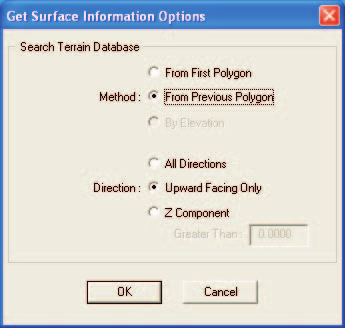
*Figure 6-19: The Get Surface Information Options dialog allows the user to set various options related to tire-terrain interaction.*

---

## PREFERENCES

**Menu Option:** PREFERENCES (Ctrl+F)

**Purpose:** Customize HVE according to various user-selectable preferences

**Description:** Choosing Preferences from the Options Menu displays the Preferences dialog. See also the code-verified dialog reference: [User Preferences Dialog Box](../../01-user-interface/PrefDlg.md). The Preferences dialog allows the user to select the following preferences:

- Diagnostic Level
- Auto Backup
- Date Style
- Background Color
- Skidmark Height
- Font Size (for report windows)

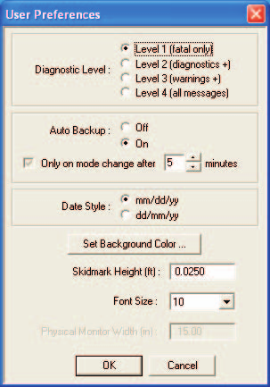
*Figure 6-20: The Preferences dialog allows the user to customize HVE according to various user-selectable preferences.*

### Diagnostic Level

Calculation models can use the Diagnostic Level to determine the severity of messages reported in the output reports. The options are:

- **Level 1 (Fatal Only)** — Only Fatal messages are reported.
- **Level 2 (+ Diagnostic)** — Fatal and Diagnostic messages are reported.
- **Level 3 (+ Informative)** — Fatal, Diagnostic and Informative messages are reported.

> **NOTE:** The Diagnostic Level is usually reported in the Program Data Report (see Playback Mode, Preview Windows).

### Auto Backup

The Auto Backup option allows the user to save his/her work at specified time intervals.

> **NOTE:** To prevent interruption while working, the backup process occurs only when changing modes (e.g., switching between the Event Editor and the Playback Editor).

### Date Style

HVE allows the user to select from two date styles:

- US Standard (month/day/year)
- Military (day/month/year)

Military style is also used in Europe and many other countries.

### Background Color

Use the Background Color option to set the background color of the viewer in the Human and Vehicle Editors.

> **NOTE:** Changing the background color helps while using the Human or Vehicle Editor if the human or vehicle is nearly the same color as the background.

### Skidmark Height

If a skidmark and the road surface are both drawn at the same elevation (earth-fixed Z coordinate), the two objects will visually fight each other to determine which one is visible. Placing the skidmarks slightly above the road surface ensures that the skidmark is properly visualized. The Skidmark Height is the distance above the road surface at which skidmarks are positioned.

By keeping the Skidmark Height small (the default value is 0.25 ft), it is not possible to see that the skidmark does not lie directly on the surface.

> **NOTE:** If a skidmark occurs over a non-uniform surface (e.g., a curb) it may be necessary to increase the Skidmark Height.

> **NOTE:** If the scene is viewed from a great distance, it may be necessary to increase the Skidmark Height.

> **NOTE:** Pavement striping must also be placed above the road surface (for exactly the same reason). Therefore, it is possible that skidmarks may be displayed beneath road stripes. This is another situation in which it may be necessary to increase the Skidmark Height.

### Font Size

Adjusting the size of the font changes the font used in both displayed and printed report windows in the Playback Editor.

**See Also:** Playback Mode, Messages, Human Editor, Vehicle Editor, Environment Options

---

## ADD PLAYBACK WINDOW (legacy)

*(updated: this command is no longer located in the Options menu. Playback windows are now added from Playback mode — see the Playback Information dialog. The original 2006 description is retained below for reference.)*

**Menu Option:** ADD PLAYBACK WINDOW

**Purpose:** Create a Playback Window used for combining multiple events into a complete sequence, creating a compressed simulation movie file and also routing a compressed movie file out to videotape

**Description:** Choosing Add Playback Window displayed the Playback Window dialog. Previously created trajectory simulations were listed in the Active Events table portion of the Playback Window.

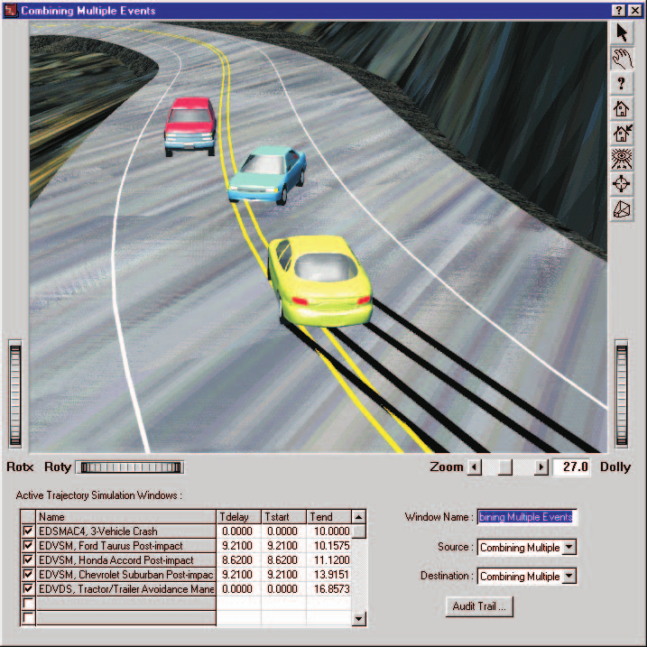
*Figure 6-21: The Playback Window allows the user to combine multiple events into a coherent sequence.*

The Playback Window includes the following components:

- **Playback Window Viewer** — a 3-D window used for viewing trajectory simulations.
- **Active Trajectory Simulation Windows List** — A table used for selecting and editing simulation sequences that are to be included in the 3-D Playback Window viewer.
- **Video Source List** — An option list used for selecting the current video source.
- **Video Destination List** — An option list used for selecting the current video destination.

These components are described below.

### Playback Window Viewer

The Playback Window Viewer is a 3-D viewer that displays trajectory simulations for multiple events in a single window. This viewer is like all other 3-D viewers in HVE. In addition, it has the capability of outputting its contents to a compressed movie file, as well as replaying a previously created movie file in real time.

### Active Trajectory Simulation Windows List

The Active Trajectory Simulation Windows List is a table that is used for selecting trajectory simulations to be included in the Playback Window Viewer, and for editing the sequence of the individual trajectory simulation events. The table includes the following components:

- **Checkbox** — Used to select or deselect trajectory simulations that are to be included in the Playback Window Viewer
- **Name** — The name of the trajectory simulation, assigned by the user when the trajectory simulation report was created
- **Tdelay** — A time offset, used to delay the beginning of the trajectory simulation
- **Tstart** — A time offset, used to remove from the Playback Window Viewer a portion at the start of the trajectory simulation
- **Tend** — A time offset, used to remove from the Playback Window Viewer a portion at the end of the trajectory simulation

### Video Source List

The Video Source List is an option list that displays the current video source, that is, the source of the information displayed in the Playback Window Viewer. There are two options:

- **Playback Window Name** — This is the user-assigned name given to the sequence of Trajectory Simulations defined by the Active Trajectory Simulation Windows Table (described earlier). This source is rendered directly from the simulation output tracks, and thus is typically slower than real time.
- **Movie File Name** — This is the user-assigned name given to a previously saved movie file. Alternatively, it may simply be the name of the last movie file to be created. By default, its name is AVI. This movie file can normally be displayed in real time (depending on the user's hardware).

### Video Destination List

The Video Destination List is an option list that displays the current video destination, that is, the destination of the information displayed in the Playback Window Viewer. There are three options:

- **Playback Window Name** — This is the user-assigned name of the Playback Window Viewer. In this case, the viewer is displaying the sequence of the trajectory simulations defined in the Active Trajectory Simulation Windows Table (described earlier). Choosing Movie File Name or AVI as the source and Playback Window Name as the destination results in the real-time playback of a compressed movie file.
- **AVI** — This is the default destination for the video compressor, selected using the Video Set-up dialog (see Chapter 3, File Menu, Video). Choosing Playback Window Name as the source and AVI as the destination results in the creation of a compressed movie file.
- **Composite Video/S-Video** — Choosing this destination causes the current video source to be routed to the computer's video output port.

  > **NOTE:** This option requires the installation of a video card capable of outputting an NTSC or PAL video signal. See Section Nine, Video Output, for more information.

**See Also:** Playback Editor, Combining Multiple Events, Creating a Compressed Movie File, Creating a Video, Video Set-up, Playback Controller

<!-- NAV -->

---

← Previous: [Chapter 5: View Menu](05-view-menu.md)  |  [Index](README.md)  |  Next: [Chapter 7: Help Menu](07-help-menu.md) →

<!-- /NAV -->
