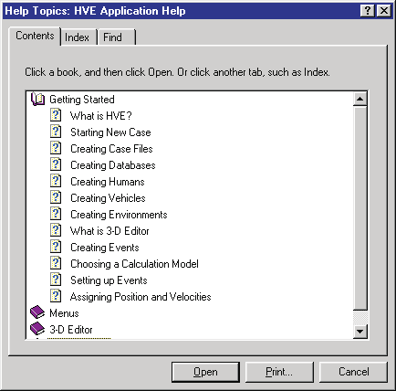
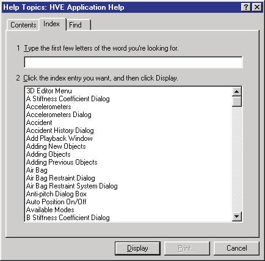
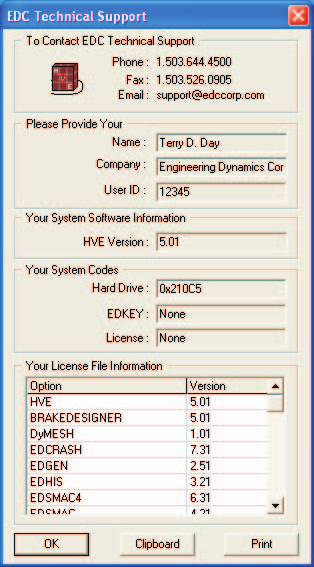
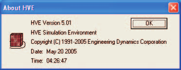

# Chapter 7: Help Menu

*HVE User's Manual — Section Two: Menu Reference. Updated edition, verified against current HVE source code (HVEINV-64).*

The Help Menu contains the following options:

- **Help Topics** — Provides an on-line reference system for terms related to human and vehicle dynamics and general motor vehicle safety. Terms related to accident reconstruction are available as well.
- **User Manuals** — Opens the PDF user manual for HVE or any installed calculation model *(updated: added since the 2006 manual)*
- **Tech Support** — Provides information about the user's name, company name and user ID number. Also provides contact details for EDC Technical Support.
- **About** — Provides information about the user's version of HVE, including the version number and release date.
- **Online Licensing** — Provides commands for registering a User ID Code and refreshing licenses over the Internet *(updated: added since the 2006 manual)*

This chapter describes these help systems.

---

## HELP TOPICS

**Menu Option:** HELP TOPICS

**Purpose:** Provide an on-line help reference, organized by category (Contents) and by term (Index)

**Description:** Choosing Help Topics from the Help Menu displays the Help Topics dialog. This is a single menu item; the Contents and Index views are tabs within the dialog.

The **Contents** tab provides four basic categories of program information.

*Figure 7-1: Typical Help Topics — Contents tab.*

The **Index** tab provides a detailed glossary of terms, including SAE J670e (Vehicle Dynamics Terminology; reference 6.2), SAE J885 (Human Tolerance to Impact Conditions As Relates To Motor Vehicle Design; reference 6.1), and SAE J1675 (Accident Reconstruction Terminology, ref. 6.4).

*Figure 7-2: The Help Topics — Index tab provides definitions of many human and vehicle dynamics terms and terms related to accident reconstruction and motor vehicle safety.*

---

## USER MANUALS

*(updated: this cascade menu was added after the 2006 manual)*

**Menu Option:** USER MANUALS

**Purpose:** Open the PDF user manual for HVE or an installed calculation model

**Description:** Choosing User Manuals displays a cascade menu of the manuals installed with HVE. Selecting an entry opens the corresponding PDF manual. The available manuals include:

- HVE User Manual
- EDCRASH User Manual
- EDGEN User Manual
- EDHIS User Manual
- EDSMAC User Manual
- EDSMAC4 User Manual
- EDVDS User Manual
- EDSVS User Manual
- EDVSM User Manual
- EDVTS User Manual
- SIMON User Manual
- Damage Studio User Manual
- GATB User Manual
- ReadDataFile User Manual

---

## TECH SUPPORT

**Menu Option:** TECH SUPPORT

**Purpose:** Display EDC Technical Support contact details and user information

**Description:** Choosing Tech Support displays the Technical Support Information dialog. The Technical Support Information dialog includes the following information about the installed version of HVE:

- EDC Telephone Number
- EDC Fax Number
- EDC Email Address
- Licensed User Name
- Company Name
- User ID Number

The Technical Support dialog also displays your system software and licensing information. This includes:

- Your HVE Version
- Your System Hardware codes (Hard Drive, EDKEY and License)
- Your License File Information (Programs and Versions)

A sample Technical Support dialog is shown in Figure 7-3.

> **NOTE:** This information is required for assistance when contacting EDC Technical Support regarding licensing issues. The report may be copied to the system clipboard and pasted into an email or printed and faxed directly to EDC Technical Support staff.

To access the HVE Technical Support Help Information, perform the following steps:

1. Choose Tech Support from the Help Menu. The Help Technical Support dialog will be displayed (see Figure 7-3).
2. Press Clipboard to copy the License information to your system clipboard (you may then paste this in an email message to the EDC Technical Support staff).
3. Press Print to print a hard copy of the License information. You may then fax this information to the EDC Technical Support staff.
4. Press OK when you are finished.

*Figure 7-3: The Help Technical Support dialog explains how to contact EDC for Technical Support.*

**See Also:** (none)

---

## ABOUT

**Menu Option:** ABOUT

**Purpose:** Display release information about the user's version of HVE

**Description:** Choosing About displays the Version Information dialog. The Version Information dialog includes the following information about the installed version of HVE:

- HVE System ID Number
- HVE Version Number
- HVE Release Date
- HVE Release Time

> **NOTE:** You should have this information available when you call for Technical Support.

*Figure 7-4: The About HVE Dialog contains useful release information.*

**See Also:** (none)

---

## ONLINE LICENSING

*(updated: this cascade menu was added after the 2006 manual)*

**Menu Option:** ONLINE LICENSING

**Purpose:** Register and refresh HVE licenses over the Internet

**Description:** The Online Licensing cascade menu contains two commands:

- **Register User ID Code** — Displays a dialog for entering the User ID Code supplied by EDC, registering this installation of HVE for online licensing.
- **Refresh Licenses** — Contacts the EDC licensing service and refreshes the local license information for HVE and the installed calculation models.

<!-- NAV -->

---

← Previous: [Chapter 6: Options Menu](06-options-menu.md)  |  [Index](README.md)

<!-- /NAV -->
