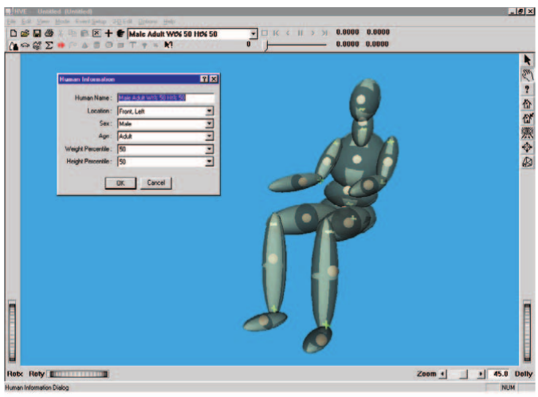
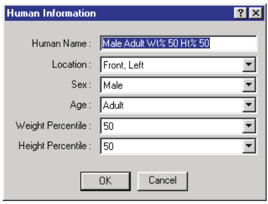
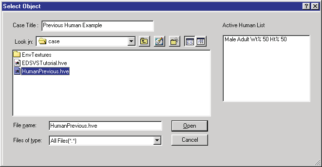

# Chapter 8 — Creating and Editing Humans

*Updated Markdown edition of the HVE User's Manual (HVE Version 5, Seventh Edition, January 2006), Chapter 8, manual pages 8-1 through 8-8. Verified against the current HVE application source (`HVEINV-64/`).*

The Human Editor is used for creating and editing humans for the current case.
These humans may also be used in other cases.

This chapter describes how to use the Human Editor to create and edit humans,
beginning with a description of its components.

> **NOTE:** Refer to the next chapter, [Human Model
> Definition](09-human-model-definition.md), for a detailed description of
> each human model parameter.

## Human Editor Components

To use the Human Editor, choose Human Mode using the mode selector. This puts
HVE in Human Mode and allows access to the Human Editor's components:

- **Human Editor Dialog** — The Human Editor dialog is used for adding humans
  to the current case and to select the current human.
- **Human Viewer** — The Human Viewer is used for visualizing the current
  human and editing his or her parts.

These components are shown in Figure 8-1 and are described later in this
chapter.

*Figure 8-1: Human Editor, Human Information Dialog and Viewer.*

### Human Editor Dialog

The Human Editor dialog is the heart of the HVE Human Editor. It is used to
manage (create and edit) all the humans in the current case. The Human Editor
dialog includes the following functionality:

- **Add Human** — Allows the user to add humans to the current case and
  provides two options: New and Previous. Choose New to add a human from the
  Human Database; choose Previous to add a human from a previous HVE case.
  These options are further described below.
- **Active Humans List** — Displays a list of the names for all the humans
  defined in the current case. The name of the current human is displayed in
  the minimized list. Click on the combo box to view the full list and select
  a different name to change the current human in the viewer. Click on the
  Object Info button on the toolbar to display its Human Information dialog.
- **Delete Human** — Removes the current human from the case. Select Edit,
  Delete on the main menu, or click on the Delete button on the toolbar to
  delete the current human.

> **NOTE:** Pressing Delete deletes the human only from the current case, NOT
> the database!

> **NOTE:** The Delete option is not selectable if the current human is used
> in an event.

### Human Viewer

The Human Viewer displays the current human. It contains the following
components:

- **Current Human** — Allows the user to visualize the current human. Also
  displays the pickable spheres on each of the 15 human segments used for
  editing the current human's parameters (see Selecting and Editing Humans,
  later in this chapter; also see [Chapter 9 — Human Model
  Definition](09-human-model-definition.md)).
- **Viewer Controls** — Allow the user to Rotate, Pan, Zoom and set the
  current Pick Mode (see Chapter 2 for details on using the viewer controls).

> **NOTE:** Although every human's properties are defined using the Human
> Editor, humans are not positioned using the Human Editor. The position of a
> human in any event is an event-related issue, and is performed using the
> Event Editor. Think of it this way: At this point, we don't care what the
> human is doing. All we care about is that the human is a male, weighs 180
> pounds and has other properties of our choosing.

## Adding New Humans

New humans are added to the current case using the Human Information dialog.

*(updated: As of HVE Version 10, new humans are created using the **GEBOD
Human Information dialog**, which generates the human data set directly from
the GEBOD body generator instead of selecting from a fixed database of body
types. The classic Human Information dialog described in the original manual
is still displayed when editing a human that was created from the older,
pre-Version 10 human database. Both dialogs are documented in detail in the
[Human Information Dialog reference
page](../../07-humans/HumanInfoDlg.md).)*

### Classic Human Information Dialog (pre-Version 10 humans)

To add a new human using the classic dialog, perform the following steps:

1. Click on Add New Object. The Human Information dialog (see Figure 8-2)
   will be displayed, containing the following options:
   - **Name** — A user-editable field allowing the user to assign a name to
     the current human.
   - **Location** — Displays a list allowing the user to choose a seat
     position for the current human occupant (Right Front, Left Front, etc.);
     refer to the Vehicle Editor for a description of the available seating
     positions within a vehicle. The user may also choose Pedestrian.

   > **NOTE:** You will notice that human occupants assume a seated position
   > by default, while human pedestrians assume a standing position. This is
   > a reminder, since the simulation program often treats occupants and
   > pedestrians differently. Refer to your simulation program manual for
   > more information.

   
   *Figure 8-2: Human Information dialog, used for adding a new human from the Human Database.*

   - **Sex** — An option list. The user may select either Male or Female.
   - **Age** — An option list allowing the user to select Adult or 3, 6, 9 or
     12 year-old children's ages.
   - **Weight Percentile** — An option list containing the available weight
     percentiles.
   - **Height Percentile** — An option list containing the available height
     percentiles.

   > **NOTE:** Regarding Weight and Height Percentiles: 50 percentile is
   > average; 2.5 percentile means that only 2.5 percent of the population is
   > smaller; 97.5 percentile means that only 2.5 percent of the population
   > is larger.

2. Enter a name for the current human. The name will be used to identify the
   human in each event as well as in all output reports.

   > **NOTE:** The default human name is supplied according to the selected
   > human attributes (Sex, Age, Weight and Height Percentile).

3. Choose a position for the current human.

   > **NOTE:** If a seat position (e.g., Left Front) is selected, the human
   > is assumed to be a vehicle occupant and its motion will be defined
   > relative to the vehicle. If Pedestrian is selected, the human's motion
   > will be defined relative to the earth.

4. Choose the Sex, Age, Weight Percentile and Height Percentile for the
   current human.
5. Choose OK to create the selected human and add it to the case.

The selected human will be added to the Active Humans List and become the
current human.

**Table 8-1: Human Dummy Data, Child**

| Age (years) | Height (in) | Weight (lb) |
|---|---|---|
| 3 | 38.94 | 23.08 |
| 6 | 45.26 | 46.93 |
| 9 | 51.58 | 70.78 |
| 12 | 57.91 | 94.63 |

**Table 8-2: Human Dummy Data, Adult**

| Size (%-ile) | Female Height (in) | Female Weight (lb) | Male Height (in) | Male Weight (lb) |
|---|---|---|---|---|
| 2.5 | 51.19&dagger; | 94.75 | 65.04 | 131.50 |
| 5.0 | 59.94 | — | 65.81 | — |
| 50.0 | 63.82 | 127.24 | 69.82 | 173.50 |
| 95.0 | 67.70 | — | 73.83 | — |
| 97.5 | 68.45 | 159.70 | 74.60 | 215.50 |

*&dagger; Value as printed in the original manual; it is inconsistent with
the 5.0 percentile value (59.94 in) and appears to be a misprint in the
original edition.*

### GEBOD Human Information Dialog *(updated: Version 10 and later)*

In current versions of HVE, clicking Add New Object opens the GEBOD Human
Information dialog. Instead of picking a body type from fixed database keys,
the dialog runs the GEBOD (GEnerator of BOdy Data) regression program to
compute the complete anthropomorphic data set for the requested subject. The
dialog contains:

- **Name** and **Location** — Same purpose as in the classic dialog.
- **Subject Type** — Child, Female, Male or User-defined.
- **Basis** — Selects which body measurement(s) the GEBOD data set is based
  on: Age, Weight, Height or All.
- **Age** — Slider and edit field, entered in Months or Years (Options radio
  buttons).
- **Weight** — Slider and edit field, entered as a percentile or directly in
  weight units.
- **Standing Height** — Slider and edit field, entered as a percentile or
  directly in length units.
- **Filename / Select** — For a user-defined subject, selects the GEBOD data
  file used to create the human.

> **NOTE:** The *User-defined* subject type is not yet supported; selecting
> it reverts to the previous type, and its *Filename / Select* controls are
> inactive.

See the [Human Information Dialog reference
page](../../07-humans/HumanInfoDlg.md) for the complete field-by-field
description of both dialogs.

### Human Database

The Sex, Age, Weight Percentile and Height Percentile are actually keys used
to select the current human from the Human Database. These keys provide
inputs to the GEBOD program [3.10] that are used to calculate anthropomorphic
data for the 15-segment, 14-joint human model described in the next chapter.
*(updated: with the GEBOD Human Information dialog, GEBOD is run directly
from the entered subject type, basis and body measurements, so the available
body descriptions are no longer limited to the discrete database keys listed
in Tables 8-1 and 8-2.)*

The Human Editor creates a copy of the selected human for use in the current
case. The properties of this human may be edited. Changes made to the current
human do not affect the Human Database.

## Adding Humans From Previous Cases

The user may also include humans from other cases in the current case. This
option is useful when another case includes a uniquely modified human which is
substantially similar to a human required for the current case.

To choose a human from a previous case for use in the current case, perform
the following steps:

1. On the Main Menu, select Mode, Add and choose Previous. The Previous Human
   Selection dialog (see Figure 8-3) will be displayed. This dialog contains
   two list boxes: Active Cases and Active Humans.
2. Click on a case name in the Active Cases list box. The Active Humans List
   for that case will be displayed in the Active Humans list box.
3. Choose a name from the Active Humans List.
4. Press Open to add the selected human to the current case.

The selected human will be added to the Active Humans List and become the
current human.

*Figure 8-3: Add Humans, Previous dialog.*

## Selecting and Editing Humans

After a New or Previous human is created, its name is added to the Active
Humans List. The last human added to the case becomes the current human. The
current human is displayed in the Human Viewer and may be edited.

To select and edit any human in the Active Humans List, perform the following
steps:

1. Click on the desired human name in the Active Humans List. The selected
   human becomes the current human and will be displayed in the Human Viewer.
2. If desired, click on the Object Info button on the toolbar to display its
   Human Information dialog (described earlier). This allows the user to
   change the basic attributes of the current human (Name, Position and body
   description). Press OK to update the current human.

   > **NOTE:** If the selected human is from a previous case, the database
   > keys are not editable. *(updated: the body-description controls are also
   > disabled if the human already has event output tracks.)*

3. If desired, edit the current human's properties. Humans are edited on a
   per-segment basis. Click on any of the human's segment CG spheres to
   display a menu containing the human data categories (see the [Human CG
   Dialog reference page](../../07-humans/HumCGDlg.md)):
   - **Inertias** — Displays and allows editing of the inertial properties
     for the selected segment.
   - **Contact Ellipsoids** — Displays and allows editing of the contact
     ellipsoids for the selected segment.
   - **Joints** — Displays and allows editing of the joint properties for
     the selected segment.
   - **Injury Tolerance** — Displays and allows editing of the injury
     tolerance properties for the current human.

Each of these data categories is described in detail in the following
chapter, [Human Model Definition](09-human-model-definition.md).

<!-- NAV -->

---

← Previous: [Section Three: Human Editor](README.md)  |  [Index](README.md)  |  Next: [Chapter 9 — Human Model Definition](09-human-model-definition.md) →

<!-- /NAV -->
