# Chapter 9 — Human Model Definition

*Updated Markdown edition of the HVE User's Manual (HVE Version 5, Seventh Edition, January 2006), Chapter 9, manual pages 9-1 through 9-16. Verified against the current HVE application source (`HVEINV-64/`) and the physics human data structure (`Physics/Include/HUMAN.H`).*

## Overview

The HVE Human Editor displays the current human in the Human Viewer (see
Figure 9-1). The HVE Human model is a physical/mathematical model based on
GEBOD [3.9, 3.10], a program developed at Wright-Patterson Air Force Base
under Federal sponsorship. The model has 15 segments and 14 joints. A
schematic diagram of the HVE Human Model is shown in Figure 9-2. The original
purpose of GEBOD was to produce anthropomorphically correct models of human
pilots for purposes of design of the cockpits of fighter aircraft, although
GEBOD is now used by several occupant dynamics simulators used in the study of
motor vehicle safety [3.15, 3.16].

The Human Model parameters for the HVE Human Model are selected by clicking on
the individual segment CG spheres in the Human Viewer. Clicking on a segment
displays an option list of parameter groups for that segment (see the [Human
CG Dialog reference page](../../07-humans/HumCGDlg.md)). The Human Model
parameters are divided into the following groups:

- Inertial Properties for each segment
- Color for each segment
- Contact Ellipsoid Properties for each segment
- Injury Tolerances for the selected human
- Joint Properties for each segment

These categories, and their associated parameters, are described in the
following sections.

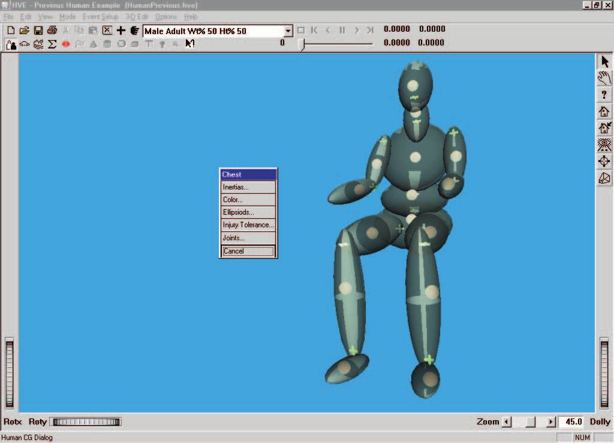
*Figure 9-1: Human Editor, Viewer and Segment Data pop-up menu.*

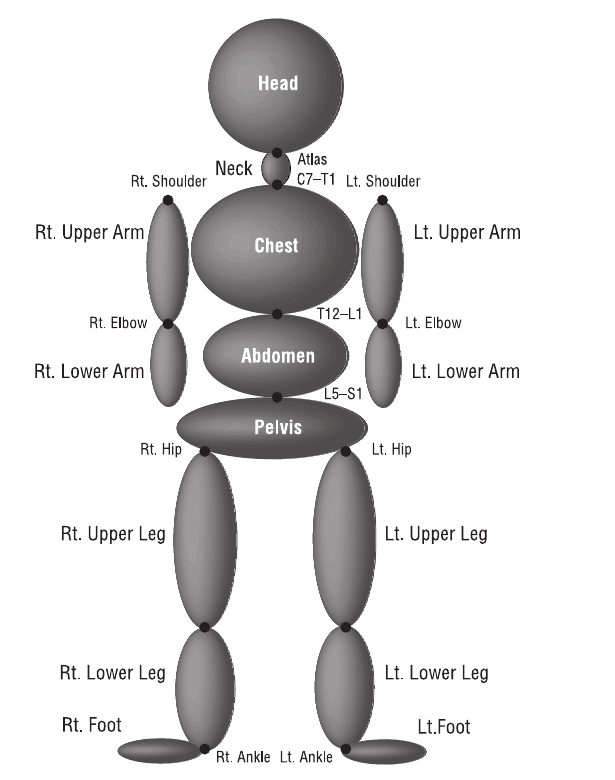
*Figure 9-2: HVE Human Model with 15 segments and 14 joints. The HVE Human Model [3.9] is based on GEBOD [3.10].*

The 15 segments are: Pelvis, Abdomen, Chest, Neck, Head, right and left Upper
Legs, right and left Lower Legs, right and left Feet, right and left Upper
Arms, and right and left Lower Arms *(segment list per the current segment
popup dialog; see the [Human CG Dialog reference
page](../../07-humans/HumCGDlg.md))*.

## Inertial Properties

Inertial parameters for the HVE Human Model are defined for each of the 15
segments. To view and edit the current human's inertial parameters, click on
the desired segment and choose Inertias from the cascade menu. The individual
parameters are displayed in the Inertias dialog, as shown in Figure 9-3 and
Table 9-1. See also the [Inertial Data Dialog reference
page](../../07-humans/Human.md).

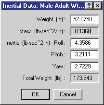
*Figure 9-3: Human Segment Inertias dialog.*

**Table 9-1: Inertial Parameters for each human segment**

| Parameter | Unit Name | Description |
|---|---|---|
| Weight | UtHumForce | Weight of selected segment (HVE calculates and stores the segment mass by dividing the entered weight by the current acceleration of gravity) |
| Rotational Inertias | UtHumInertia | Rotational inertias about the segment i, j and k (roll, pitch and yaw) axes |

*(updated: the current dialog also displays the read-only computed segment
Mass and the read-only Total Weight of the entire human — the sum of all 15
segment masses multiplied by the current acceleration of gravity.)*

## Segment Color

The color of each of the 15 segments is user-definable. To view and edit the
current segment color, click on the desired segment and choose Color from the
cascade menu. The Human Color dialog (see Figure 9-4 and Table 9-2) is
displayed. The current color is displayed in the color patches on the left
side of the dialog (the left patch is the current color, the right patch is
the previous color). To edit the color, click on the color wheel at the
desired color location. To edit the intensity (brightness), drag the intensity
slider to the left (darken) or right (lighten). Click on the Copy To All
Segments checkbox to apply the selected color to all segments.

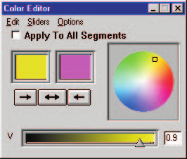
*Figure 9-4: Human Color dialog.*

**Table 9-2: Color Parameters for each human segment**

| Parameter | Unit Name | Description |
|---|---|---|
| RGB Color Values | UtNone | Red, green and blue color values for the selected segment |
| Color Intensity | UtNone | Brightness (0 = dark, 1 = bright) |

## Contact Ellipsoid Properties

Ellipsoid properties for the HVE Human Model are defined for each of the 15
segments. To view and edit the current human's ellipsoid parameters, click on
the desired segment and choose Ellipsoids from the cascade menu. The
individual parameters are displayed in the Contact Ellipsoids dialog, as shown
in Figure 9-5 and Table 9-3. See also the [Contact Ellipsoids Dialog reference
page](../../07-humans/Human1.md).

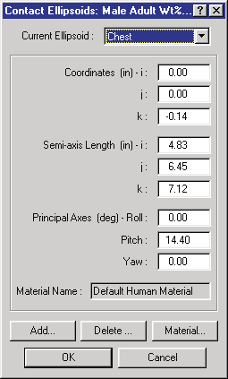
*Figure 9-5: Human Contact Ellipsoids dialog.*

Up to three individual ellipsoids may be supplied for each segment *(code:
`MAXELLIPSOIDSPERSEGMENT` = 3)*. To create a new ellipsoid, click on Add, and
enter a new name. To view and edit the properties of an existing ellipsoid,
click on the combo box arrow to display the list of available ellipsoids, then
select the desired ellipsoid.

**Table 9-3: Contact Ellipsoid Parameters for each human segment**

| Parameter | Unit Name | Description |
|---|---|---|
| Ellipsoid Name | 30-character text string | User-supplied names for each contact ellipsoid |
| Center Coordinates | UtHumDispLength | The coordinates of the center of the selected ellipsoid, defined relative to the segment principal axis system |
| Semi-axis Length | UtHumDispLength | The semi-axis i, j and k lengths of the selected ellipsoid |
| Principal Axes | UtHumDispAngle | The angles of the i, j and k ellipsoid axis system relative to the segment axis system (see Figure 9-6) |
| Ellipsoid Material Name | UtNone | Name for material attached to current ellipsoid |

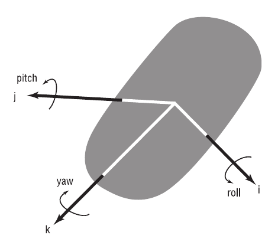
*Figure 9-6: Human Segment Coordinate System.*

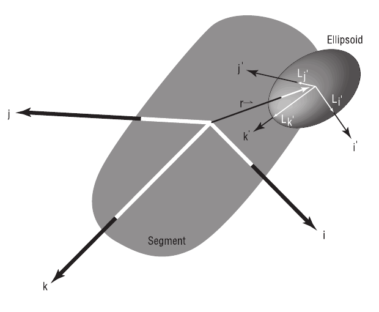
*Figure 9-7: Human Contact Ellipsoids Coordinate System.*

### Contact Ellipsoid Material Properties

Each contact ellipsoid has material attributes. The material attributes are
assigned by selecting a material file. These material files are user-editable.
In addition, material files may be opened and saved for later application.

To view and edit the human ellipsoid material properties, select an ellipsoid
using the Contact Ellipsoids dialog, then click on Material. The Human
Materials dialog is displayed, as shown in Figure 9-8. The material attributes
are defined in Table 9-4. See also the [Human Material Properties Dialog
reference page](../../07-humans/HumMatProp.md), which describes the dialog's
force-deflection graph display.

**Table 9-4: Human Contact Ellipsoid Material Parameters**

| Parameter | Unit Name | Description |
|---|---|---|
| Material Name | UtNone | User-editable material name |
| Constant | UtHumForce | Force required to initiate deflection |
| Linear Stiffness | UtHumMatLinear | Linear material deformation coefficient |
| Quadratic Stiffness | UtHumMatQuad | Quadratic material deformation coefficient |
| Cubic Stiffness | UtHumMatCubic | Cubic material deformation coefficient |
| Damping Constant | UtHumMatDamp | Material velocity-dependent deformation constant |
| Friction Constant | UtNone | Inter-segment friction coefficient |
| Maximum Force | UtHumForce | Force at which 3rd-order force-deflection relationship is abandoned |
| Maximum Deflection | UtHumDispLength | Deflection at which 3rd-order force-deflection relationship is abandoned *(updated: unit name was listed as UtHumDispLinear in the original manual; the current code uses UtHumDispLength)* |
| Unloading Slope | UtHumMatLinear | Linear unloading slope beginning at maximum deflection |

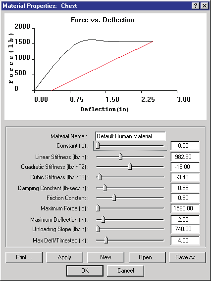
*Figure 9-8: Human Materials Properties dialog displays the current material attributes for the selected ellipsoid. The dialog also allows the user to open and save human material files.*

## Injury Tolerances

Injury Tolerances may be defined for the current human. These injury
tolerances are used during the current event as guidelines to estimate when
specific injuries might occur.

> **NOTE:** Injury Predictions are an available Output Report.

To view and edit the current human's injury tolerances, click on any segment
and choose Injury Tolerances from the cascade menu. The individual parameters
are displayed in the Injury Tolerances dialog, as shown in Figure 9-9 and
Table 9-5. See also the [Injury Tolerance Data Dialog reference
page](../../07-humans/Human2.md).

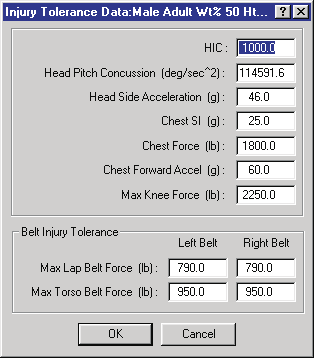
*Figure 9-9: Human Injury Tolerance dialog.*

**Table 9-5: Injury Tolerance Parameters for the current human**

| Parameter | Unit Name | Description |
|---|---|---|
| HIC | n/a | Head Injury Criterion, an empirically derived index [6.1] used to estimate the probability of a closed head injury |
| Head Pitch Concussion | UtHumAccelAngular (deg/sec²) | Angular acceleration of the head about the pitch axis of the neck |
| Head Side Acceleration | UtHumAccelLinear (g) | Linear acceleration of the head in the direction of the head-fixed j-axis |
| Chest SI | UtHumChestSI (g) | Chest Severity Index, an injury index indicating the maximum chest acceleration |
| Chest Force | UtHumForce | The tolerance for peak force against the chest in the direction of the chest-fixed i-axis |
| Chest Forward Acceleration | UtHumAccelLinear (g) | The tolerance for peak chest acceleration in the direction of the chest-fixed i-axis |
| Maximum Axial Femur Load (Max Knee Force) | UtHumForce | The tolerance for peak axial loading of the femur *(updated: labeled "Max Knee Force" in the current dialog and stored as `KneeForce`)* |
| Maximum Lap Belt Force — Left Belt / Right Belt | UtHumForce | The tolerance for lap belt tension, above which injury is expected to occur to the abdomen |
| Maximum Torso Belt Force — Left Belt / Right Belt | UtHumForce | The tolerance for torso belt tension, above which injury is expected to occur to the torso |

*(updated: the original manual listed a single Maximum Lap Belt Force and a
single Maximum Torso Belt Force. The current human model stores four separate
belt injury tolerances — `LeftLap`, `RightLap`, `LeftTorso` and `RightTorso` —
and the current dialog provides separate left-belt and right-belt entries for
both the lap and torso webbing.)*

*(updated: the unit names for the head and chest acceleration tolerances were
listed in the original manual as UtHumAccelAngle and UtHumAccelLength; the
current code uses UtHumAccelAngular and UtHumAccelLinear, and Chest SI has its
own unit type, UtHumChestSI.)*

## Joint Parameters

Joint parameters for the HVE Human Model are defined for each of the 14
joints. To view and edit the current human's joint parameters, click on the
desired segment and choose Joints from the cascade menu. The Joints dialog is
displayed, as shown in Figure 9-10 and Table 9-6. The dialog contains an
option list containing the names of each joint attached to the selected
segment (a segment may have up to 4 attached joints; code:
`MAXJOINTSPERSEGMENT` = 4), and the joint i, j, k coordinates relative to the
selected segment coordinate system (see Figures 9-2 and 9-11). Click on the
option list to display and select a different joint. See also the [Joint Data
Dialog reference page](../../07-humans/Human3.md).

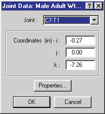
*Figure 9-10: Human Joint Coordinates dialog.*

**Table 9-6: Joint Parameters for each human segment**

| Parameter | Unit Name | Description |
|---|---|---|
| Joint Coordinates | UtHumDispLength | i, j and k coordinates of selected joint, defined relative to the segment principal axis system |

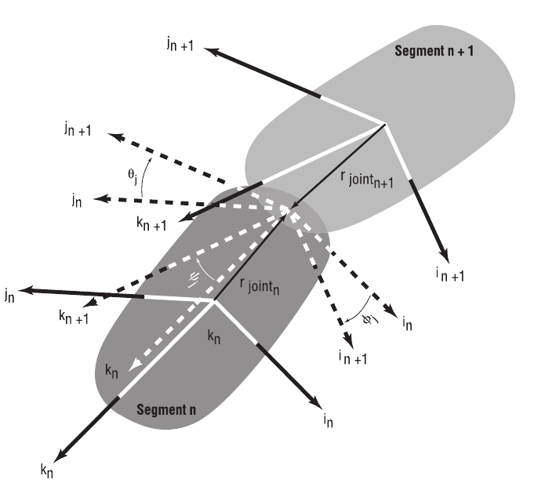
*Figure 9-11: Human Joint Coordinate System.*

### Joint Properties

Each joint is defined by a number of physical properties. To view and edit
these properties, first choose Joints to display the Joint Data dialog (see
Figure 9-10), then click on Properties. The Joint Properties dialog is
displayed, as shown in Figure 9-12. The individual properties are defined in
Table 9-7. Except for the joint type, each property is entered separately for
rotation about the joint's i, j and k axes. See also the [Joint Properties
Dialog reference page](../../07-humans/HumJntPropDlg.md).

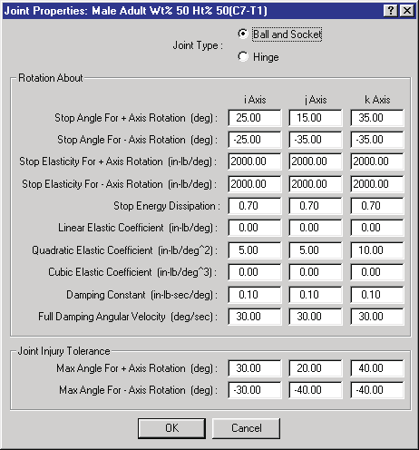
*Figure 9-12: Human Joint Properties dialog.*

**Table 9-7: Joint Properties for each joint**

| Parameter | Unit Name | Description |
|---|---|---|
| Joint Type | n/a | Either Ball-and-Socket or Hinge |
| Stop Angle, + Axis Rotation | UtHumDispAngle | The angle at which the joint stop is applied for positive i, j and k segment rotations |
| Stop Angle, − Axis Rotation | UtHumDispAngle | The angle at which the joint stop is applied for negative i, j and k segment rotations |
| Stop Elasticity, + Axis Rotation | UtHumElastLinear | Joint stop linear elastic property for positive rotations about the i, j and k axes |
| Stop Elasticity, − Axis Rotation | UtHumElastLinear | Joint stop linear elastic property for negative rotations about the i, j and k axes |
| Stop Energy Dissipation | UtNone | Ratio of dissipated to total energy at the joint stop |
| Linear Elastic Constant | UtHumElastLinear | Joint linear elastic property during normal range of motion for rotations about the i, j and k axes |
| Quadratic Elastic Constant | UtHumElastQuad | Joint quadratic elastic property during normal range of motion for rotations about the i, j and k axes |
| Cubic Elastic Constant | UtHumElastCubic | Joint cubic elastic property during normal range of motion for rotations about the i, j and k axes |
| Damping Constant | UtHumDamp | Joint damping property during normal range of motion for rotations about the i, j and k axes |
| Full Damping Angular Velocity | UtHumVelAngular | Angular velocity required to achieve full joint damping |
| Joint Injury Tolerance, Max + Rotation Angle | UtHumDispAngle | The positive joint angle which, if exceeded, is predicted to cause injury to the joint |
| Joint Injury Tolerance, Max − Rotation Angle | UtHumDispAngle | The negative joint angle which, if exceeded, is predicted to cause injury to the joint |

<!-- NAV -->

---

← Previous: [Chapter 8 — Creating and Editing Humans](08-creating-editing-humans.md)  |  [Index](README.md)

<!-- /NAV -->
