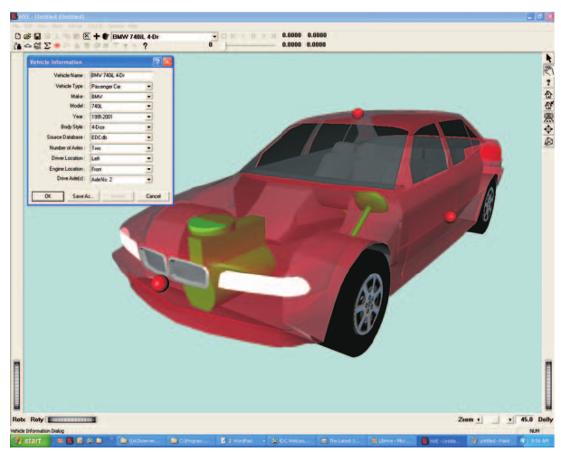
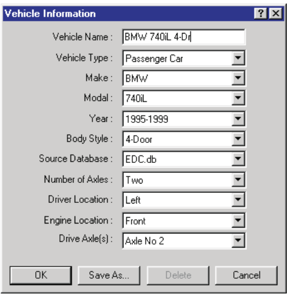

# Chapter 10 — Creating & Editing Vehicles

The HVE Vehicle Editor is used for creating and editing vehicles for the
current case. These vehicles may also be used in other cases.

This chapter describes how to use the Vehicle Editor to create and edit
vehicles, beginning with a description of the Vehicle Editor's components.

> **NOTE:** Refer to the next chapter, [Vehicle Model Definition](11a-sprung-mass.md),
> for a detailed description of each Vehicle Model parameter.

## Vehicle Editor Components

To use the Vehicle Editor, choose Vehicle Mode using the mode selector. This
puts HVE in Vehicle Mode and displays the Vehicle Editor's components:

- **Vehicle Editor Dialog** — The Vehicle Editor dialog is used for adding
  vehicles to the current case and to select the current vehicle.
- **Vehicle Viewer** — The Vehicle Viewer is used for visualizing the current
  vehicle and editing its parameters.

*Figure 10-1: Vehicle Editor, Vehicle Information dialog and Viewer.*

### Vehicle Editor Dialog

The Vehicle Editor dialog is the heart of the HVE Vehicle Editor. It is used
to manage (create and edit) all the vehicles in the current case. The Vehicle
Editor dialog includes the following functions:

- **Add Vehicle** — Allows the user to add vehicles to the current case and
  provides two options: New and Previous. Choose *New* to add a vehicle from
  the Vehicle Database; choose *Previous* to add a vehicle from a previous
  HVE case. These options are further described below.
- **Active Vehicles List** — Displays a list of the names for all the
  vehicles in the current case. The name of the current vehicle is displayed
  in the minimized list. Click on the combo box to view the full list and
  select a different name to change the current vehicle in the viewer. Click
  on the *Object Info* button on the toolbar to display its Vehicle
  Information dialog.
- **Delete Vehicle** — Removes the current vehicle from the case. Select
  *Edit, Delete* on the main menu, or click on the *Delete* button on the
  toolbar to delete the current vehicle.

> **NOTE:** Pressing Delete deletes the vehicle only from the current case,
> NOT the database!

> **NOTE:** The Delete button is not selectable if the current vehicle is
> used in an event.

### Vehicle Viewer

The Vehicle Viewer displays the current vehicle. It contains the following
components:

- **Current Vehicle** — Allows the user to visualize the current vehicle.
  Also displays the pickable vehicle components:
  - **Center of Gravity** — Clicking on the CG allows the user to edit the
    sprung mass parameters: *Inertias, Move CG, Color, 3-D Geometry File,
    Contact Surfaces, Inter-vehicle Connections, Belt Restraints, Airbag
    Restraints, Aerodynamic Drag, Body Torsion*.
  - **Wheels** — Clicking on a wheel allows the user to edit the suspension,
    tire and brake at the selected location. The x,y,z wheel location
    (relative to the CG) may also be edited.
  - **Exterior** — Clicking on the exterior spheres allows the user to edit
    the exterior dimensions and structural stiffness.
  - **Brake Master Cylinder** — Clicking on the brake master cylinder allows
    the user to edit the master cylinder or compressor properties.
  - **Steering Wheel** — Clicking on the steering wheel allows the user to
    edit the steering system properties.
  - **Engine** — Clicking on the engine allows the user to edit the
    drivetrain properties.
- **Viewer Controls** — Allow the user to *Rotate, Pan, Zoom* and set the
  current *Pick Mode* (see Chapter 2 for details on using the viewer
  controls).

> **NOTE:** Although every vehicle's properties are defined using the Vehicle
> Editor, vehicles are not positioned using the Vehicle Editor. The position
> of a vehicle in an event is an event-related issue, and is performed using
> the Event Editor. Think of it this way: At this point, we don't care if the
> Buick crashes, rolls over or simply slows to a stop. All we care about is
> that the Buick weighs 2970 pounds and has other properties of our choosing.

*Figure 10-2: Vehicle Information dialog.*

## Adding New Vehicles

New vehicles are added to the current case using the Vehicle Editor dialog.
To add a new vehicle, perform the following steps:

1. Click on *Add New Object*. The Vehicle Information dialog (see the
   code-verified reference page, [Vehicle Information dialog](../../02-vehicles/VehicleInfoDlg.md))
   will be displayed, containing the following options:
   - **Name** — A user-editable field allowing the user to assign a name to
     the current vehicle. *(updated: if no name is entered, HVE generates a
     default name from the vehicle's year, make and model.)*
   - **Type** — Defines the basic vehicle type. The allowable selections are
     *Passenger Car, Pickup, Sport-Utility, Van, Truck, Trailer, Dolly,
     Fixed Barrier* and *Movable Barrier*. *(updated: only types actually
     present in the installed vehicle databases are listed.)*
   - **Make** — Vehicle manufacturer.
   - **Model** — Vehicle model.
   - **Year** — Model year.
   - **Body Style** — Vehicle body style (e.g., *2-Dr Hardtop, 4-Dr Sedan*).
2. Choose the *Type, Make, Model, Year* and *Body Style* for the current
   vehicle. Each selection filters the choices available in the lists below
   it.

The next option list displays the name of the database containing the
vehicle. Three options available from EDC are *Generic.db*, *EDC.db* and
*Tutorial.db*. When the user extends his/her database, the added vehicles are
contained in the user's own database, called *User.db* (see Save-As below).

> **NOTE:** EDC.db is licensed. Unlicensed users will not be able to add
> vehicles from EDC.db.

> **NOTE:** The same vehicle Make, Model, Year and Body Style may be
> contained in more than one database.

The above parameters determine the basic vehicle. However, additional
attributes are required to completely define its attributes. These
additional attributes are:

- **Number of Axles** — Allowable selections are *None, One, Two* or
  *Three*. *(updated: for a Fixed Barrier, the only selection is None.)*
- **Driver Location** — The allowable selections are *None, Right, Center*
  or *Left*.
- **Engine Location** — Allowable selections are *None, Front, Mid* or
  *Rear*.
- **Drive Axle(s)** — Allowable selections depend on the number of axles:
  *None; Axle 1; Axle 2; Axle 3; Axles 1 & 2; Axles 2 & 3;* or *All Axles*.

3. If desired, click on the *Number of Axles, Driver Location, Engine
   Location* and/or *Drive Axle(s)* to edit these attributes.
4. Choose *OK* to create the selected vehicle and add it to the current
   case.

The selected vehicle will be added to the Active Vehicles List and become
the current vehicle.

*(updated: the current Vehicle Information dialog also includes a
**Wizard...** button that starts the Vehicle Wizard for building a custom
vehicle. It is enabled for Passenger Car, Pickup, Sport-Utility, Van, Truck,
Trailer and Dolly types having 1 to 3 axles; it is disabled for Fixed and
Movable Barriers.)*

### Vehicle Database

The vehicle *Type, Make, Model, Year* and *Body Style* are actually keys
used to select the current vehicle from the Vehicle Database. These keys
provide the basic vehicle definition, while the *Number of Axles, Driver
Location, Engine Location* and *Drive Axle(s)* provide the exact
configuration.

> **NOTE:** You can change the vehicle configuration using these keys!

The Vehicle Editor creates a copy of the selected vehicle for use in the
current case. The properties of this vehicle may be edited. Changes made to
the current vehicle do not affect the Vehicle Database.

### Save-As New Vehicle

New vehicles may be added to the Vehicle Database, thus extending the
vehicle library. To add a new vehicle to the database, perform the following
steps:

1. First, make all required modifications of the current vehicle before
   saving it as a new vehicle.
2. Click the *Object Info* button on the toolbar for the current vehicle in
   the Active Vehicles List. The Vehicle Information dialog will be
   displayed, showing its current database keys.
3. Choose *Save-As*. The Vehicle Save-As dialog will be displayed, allowing
   the user to enter a new *Make, Model, Year* and *Body Style*. A *Version*
   and *3-D Geometry Filename* may also be entered (see the code-verified
   reference page, [Save As New Vehicle dialog](../../02-vehicles/VehSaveAs.md)).

   > **NOTE:** The 3-D geometry file must exist in the
   > `HVE\supportFiles\images\vehicles` subdirectory. If no filename is
   > supplied, or if the file is not found, the vehicle will be visualized
   > as a simple vehicle body (defined according to Type).

4. If desired, enter a *Version Number*. This field may be used for
   licensing purposes and/or documentation.
5. Choose *OK* to add the current vehicle to the user's vehicle database.

## Adding Vehicles from Previous Cases

The user may also include in the current case vehicles from other cases.
This option is useful when another case includes a uniquely modified vehicle
which is substantially similar to a vehicle required in the current case.

To choose a vehicle from a previous case for use in the current case,
perform the following steps:

1. Select *Mode, Vehicle, Add* and choose *Previous*. The Previous Vehicle
   Selection dialog will be displayed (*Figure 10-3*).
   This dialog contains two list boxes: Active Cases and Active Vehicles.
2. Click on a case name in the Active Cases list box. The Active Vehicles
   List for that case will be displayed in the Active Vehicles list box.
3. Choose a name from the Active Vehicles List.
4. Press *OK* to add the selected vehicle to the current case.

> **NOTE:** You can click on the Object Info button for the vehicle's name
> in the Active Vehicles List to display its Vehicle Information dialog.
> However, if the selected vehicle is from a previous case, the database
> keys are not editable.

## Selecting and Editing Vehicles

After a New or Previous vehicle is created, its name is added to the Active
Vehicles List. The last vehicle added to the case becomes the current
vehicle. The current vehicle is displayed in the Vehicle Viewer and may be
edited.

To select and edit any vehicle in the Active Vehicles List, perform the
following steps:

1. Click on the desired vehicle name in the Active Vehicles List. The
   selected vehicle becomes the current vehicle and will be displayed in the
   Vehicle Viewer.
2. If desired, click the *Object Info* button on the toolbar for the desired
   vehicle in the Active Vehicles List to display its Vehicle Information
   dialog (described earlier). This allows the user to change the basic
   attributes of the current vehicle (*Name, Type, Make, Model, Year* and
   *Body Style*). *Number of Axles, Driver Location, Engine Location* and
   *Drive Axle(s)* may also be edited. Press *OK* to update the current
   vehicle.

   > **NOTE:** If the selected vehicle is from a previous case, the database
   > keys are not editable.

If desired, edit the current vehicle's properties. A vehicle is edited by
clicking on its components to bring up data dialogs. To edit the individual
vehicle parameters:

- Click on the CG to edit the sprung mass parameters: *Inertias, Move CG,
  Color, 3-D Geometry File, Contact Surfaces, Inter-vehicle Connections,
  Belt Restraints, Airbag Restraints, Aerodynamic Drag, Body Torsion*.
- Click on a wheel to edit the *Suspension, Tire, Brake, Wheel x,y,z
  coordinates* (relative to the CG) and *Wheel Image* for the selected wheel
  location.
- Click on the front, right, back, left, top and bottom side exterior
  spheres to edit the exterior dimensions and structural stiffness.
- Click on the brake master cylinder to edit the master cylinder or
  compressor properties.
- Click on the steering wheel to edit the steering system properties.
- Click on the engine to edit the drivetrain properties.

Each of these data categories is described in detail in the following
chapter, [Vehicle Model Definition](11a-sprung-mass.md).

---
*Source: HVE User's Manual (Version 5, Seventh Edition, Jan 2006), Chapter
10, pages 10-1..10-8 — updated against source code (HVEINV-64, Physics)
2026-07-05.*

<!-- NAV -->

---

← Previous: [Section Four: Vehicle Editor](README.md)  |  [Index](README.md)  |  Next: [Chapter 11 — Vehicle Model Definition (Part A: Sprung Mass)](11a-sprung-mass.md) →

<!-- /NAV -->
