# Chapter 11 — Vehicle Model Definition (Part A: Sprung Mass)

The HVE Vehicle Editor displays the current vehicle in the Vehicle Viewer.
The HVE Vehicle Model is a general purpose physical/mathematical model of a
vehicle developed by EDC. The HVE Vehicle Model applies to any type of
vehicle having left-side and right-side wheels, including passenger cars,
pickups, vans, sport-utility vehicles, trucks, trailers, dollies and
barriers.

The Vehicle Editor allows editing of the parameters which define the HVE
Vehicle Model. The general categories for these parameters are:

- **Sprung Mass** — Clicking on the CG allows the user to edit the sprung
  mass parameter groups: *Inertias, Move CG, Color, Geometry File, Contact
  Surfaces, Inter-vehicle Connections, Belt Restraints, Airbag Restraints,
  Aerodynamic Drag, Body Torsion* (this part).
- **Unsprung Masses** — Clicking on a wheel allows the user to edit the
  unsprung mass parameter groups at the selected wheel location:
  *Suspension, Tire, Brake, Wheel x,y,z Coordinates* (see
  [Part C — Suspension](11c-suspension.md) and
  [Part D — Brakes, Tires and Wheels](11d-brakes-tires-wheels.md)).
- **Exterior** — Clicking on the exterior spheres allows the user to edit
  the exterior dimensions and structural stiffness (see
  [Part B — Exterior](11b-exterior.md)).
- **Brake Master Cylinder** — Clicking on the brake master cylinder allows
  the user to edit the master cylinder or brake system compressor
  properties; also used for activating the ABS system and editing the ABS
  system properties (see [Part E](11e-drivetrain-steering-brake-system.md)).
- **Steering Wheel** — Clicking on the steering wheel allows the user to
  edit the steering system properties (see
  [Part E](11e-drivetrain-steering-brake-system.md)).
- **Drivetrain** — Clicking on the engine allows the user to edit the
  drivetrain properties: *Engine, Transmission, Differential* (see
  [Part E](11e-drivetrain-steering-brake-system.md)).

These categories and their associated parameters are described in this
chapter.

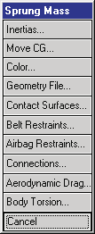
*Figure 11-1: Vehicle Editor, Sprung Mass Data pop-up menu.*

## Inertial Properties

The inertial properties of the vehicle are displayed and edited using the
Inertial Properties dialog. Two versions of the Inertias dialog are
available: **Basic** and **Complex** *(updated: the legacy manual called the
expanded version "Detailed"; the current dialog's toggle buttons are labeled
Basic... and Complex...)*. The Basic version of the Inertias dialog displays
only the sprung-mass properties in a narrowed dialog; the Complex version
displays paired **Total** (i.e., sprung + unsprung) and **Sprung** columns
side by side. *(updated: editing a value in one column automatically
recalculates the corresponding value in the other column using the vehicle's
unsprung masses and their locations. The last-used Basic/Complex state is
remembered between sessions.)*

> **NOTE:** Typically, 2-D models use total vehicle inertial properties; 3-D
> models use the sprung mass properties. Why? The unsprung masses (i.e.,
> wheels and axles) have their own independent equations of motion.

The Inertial Properties dialog also includes a feature that automatically
updates the rotational inertias when the weight is changed.

> **NOTE:** The updated rotational inertias assume the mass distribution is
> unchanged by the weight change. The effect of this assumption is that the
> updated rotational inertia is directly proportional to the weight change.

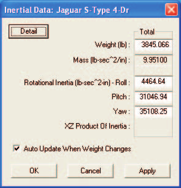
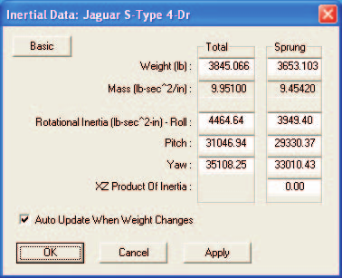
*Figure 11-2: Vehicle Inertias dialog, Basic and Complex versions.*

See also the code-verified reference page,
[Vehicle Inertia dialog](../../02-vehicles/VehInerDlg.md).

The Inertial Properties dialog performs a number of calculations, depending
on which values the user edits.

If the sprung weight, `W_S`, is edited, the total weight, `W_T`, is updated:

    W_T = W_S + Σ(n=1..NumAxles) W_U

where `W_U` = unsprung weight of each wheel (plus axle for solid axle
suspensions).

If the total weight, `W_T`, is edited, the sprung weight, `W_S`, is updated:

    W_S = W_T − Σ(n=1..NumAxles) W_U

If the sprung rotational inertia, `I_Sx`, `I_Sy` or `I_Sz` (roll, pitch or
yaw, respectively), is edited, the total rotational inertia, `I_Tx`, `I_Ty`
or `I_Tz`, is updated using the parallel axis theorem:

    I_T = I_S + Σ(n=1..NumAxles) (I_U + m_U * r_U²)

where

- `I_U` = rotational inertia of each wheel (and axle for solid axle
  suspensions) about its own x, y or z axis
- `m_U` = mass of each wheel (plus axle for solid axle suspensions)
- `r_U` = orthogonal distance from vehicle sprung mass CG to unsprung mass
  CG.

Similarly, if the total rotational inertia, `I_Tx`, `I_Ty` or `I_Tz` (roll,
pitch or yaw, respectively), is edited, the sprung rotational inertia,
`I_Sx`, `I_Sy` or `I_Sz`, is updated using the parallel axis theorem:

    I_S = I_T − Σ(n=1..NumAxles) (I_U + m_U * r_U²)

If the *Auto Update When Weight Changes* checkbox is checked, the rotational
inertias are updated as follows:

a) If the sprung weight is edited, the updated sprung rotational inertias
are:

    I_S = I_S0 * (W_S / W_S0)

where

- `I_S0` = sprung rotational inertia before editing sprung weight
- `W_S0` = sprung weight before editing

The total rotational inertias, `I_T`, are then calculated using the parallel
axis theorem, as shown above.

b) If the total weight is edited, the updated total rotational inertias are:

    I_T = I_T0 * (W_T / W_T0)

The sprung rotational inertias, `I_S`, are then calculated using the
parallel axis theorem, as shown above.

To display or edit the current vehicle's inertial properties, perform the
following steps:

1. In the Vehicle Viewer, click on the CG sphere. The Sprung Mass options
   for the current vehicle will be displayed.
2. Choose *Inertias* from the Sprung Mass option list. The Inertial
   Properties dialog will be displayed.

   > **NOTE:** Either the Basic or the Complex version of the dialog will be
   > displayed, depending on its state during your last visit to the
   > Inertial Properties dialog.

3. View and/or edit the desired properties. The other properties will be
   updated and displayed as described above.
4. Press *OK* to accept the changes.

The Inertial Properties are described below.

- **Weight** — Vehicle total and sprung weight.

  > **NOTE:** The Vehicle Editor actually divides your entered value by the
  > current gravitational constant (see Environment Editor) and stores the
  > resultant mass. That way, if you take the vehicle to the moon, it will
  > behave correctly!

- **Mass (entered as weight)** — Vehicle total and sprung mass (weight/g),
  actually stored by the Vehicle Editor (see above note). This value is not
  user editable.
- **Roll, Pitch and Yaw Rotational Inertias** — Vehicle total and sprung
  mass rotational inertias.
- **x-z Product of Inertia** — Product of inertia about the y axis. This
  value represents the fact that the x-z plane is not a plane of symmetry
  for the vehicle sprung mass. *(updated: entered in the Sprung column
  only.)*

  > **NOTE:** For all practical purposes, a vehicle is symmetrical in the
  > x-y plane (i.e., about the z axis) and in the y-z plane (i.e., about the
  > x axis). Therefore, these inertial products are zero.

*(updated: in HVE-2D, the Roll, Pitch and XZ Product fields are read-only,
the Total column and the Basic/Complex button are hidden, and only the Yaw
inertia may be edited.)*

**Table 11-1: Inertial Properties**

| Parameter | Unit Name | Description |
| --- | --- | --- |
| Weight | UtVehForce | Vehicle total and sprung weight (HVE calculates and stores the mass by dividing the entered weight by the current acceleration of gravity) |
| Rotational Inertias | UtVehInertia | Vehicle total and sprung rotational inertias about the vehicle x, y and z (roll, pitch and yaw) axes |
| x-z Product of Inertia | UtVehInertia | Inertial product about the y axis |

## Move CG

The default CG (center of gravity) location of the vehicle sprung mass is
determined from raw data (e.g., measured or table values). The user may
choose to edit the CG location using the Move CG dialog. See also the
code-verified reference page, [Move CG dialog](../../02-vehicles/MoveCGDlg.md).

> **NOTE:** The default location of the CG is determined by the wheel
> locations (which are defined relative to the CG). Refer to the Wheel
> Location parameters for more information.

> **NOTE:** Changing wheel z coordinates or tire radii for any wheel
> location will change the calculated CG height.

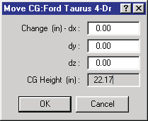
*Figure 11-3: Move CG dialog.*

To display or edit the current vehicle's CG location (relative to the
default location), perform the following steps:

1. In the Vehicle Viewer, click on the CG sphere. The Sprung Mass options
   for the current vehicle will be displayed.
2. Choose *Move CG* from the Sprung Mass option list. The Move CG dialog
   will be displayed.
3. View and/or edit the desired properties.
4. Press *OK* to accept the changes.

The Move CG parameters are described below.

- **dx** — Moves the CG in the +x or −x direction, relative to the
  vehicle-fixed coordinate system (+x is *forward* in all coordinate
  systems).
- **dy** — Moves the CG in the +y or −y direction, relative to the
  vehicle-fixed coordinate system (+y is *to the right* in the SAE
  coordinate system).
- **dz** — Moves the CG in the +z or −z direction, relative to the
  vehicle-fixed coordinate system (+z is *down* in the SAE coordinate
  system).

**Table 11-2: Move CG Parameters**

| Parameter | Unit Name | Description |
| --- | --- | --- |
| dx, dy, dz | UtVehDispLength | Adjustment of the default CG (center of gravity) location relative to the vehicle-fixed coordinate system |
| CG Height | UtVehDispLength | Approximate CG height, calculated from vehicle wheel positions and tire radius. Tire deflection is ignored. |

## Color

The color of the vehicle is obvious from looking at it. The color may be
edited using the Color dialog.

*Figure 11-4: Color Editor dialog.*

To display or edit the current vehicle's color properties, perform the
following steps:

1. In the Vehicle Viewer, click on the CG sphere. The Sprung Mass options
   for the current vehicle will be displayed.
2. Choose *Color* from the Sprung Mass option list. The Vehicle Color dialog
   will be displayed.
3. View and/or edit the color RGB value and intensity.
4. When finished, click on the Close button on the upper right corner of the
   dialog.

The Color Properties are described below.

- **RGB Color Wheel** — A small circle (*hot spot*) in the color wheel that
  determines the current color values. Move the hot spot to the desired
  color; towards the center of the color wheel creates neutral (gray)
  colors.
- **Color Intensity** — A slider ranging from 0 to 1 that determines the
  darkness or lightness of the color. Move the slider towards 0 to darken
  the vehicle.

> **NOTE:** Do not use a Color Intensity of 1.0 if you plan to produce a
> video! Saturated colors (especially red) look bad on video tape. See the
> Video Output section.

## Geometry File

The current vehicle may be visualized using a simplified vehicle shape or an
actual 3-D geometry file created by digitizing the vehicle. If a 3-D
geometry file is available for the current vehicle, it may be selected using
the Geometry File dialog.

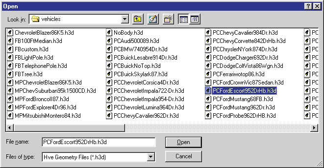
*Figure 11-5: Geometry File dialog.*

### Mechanical Properties

The 3-D geometry file is not only used to visualize the vehicle, it is also
used to define the mechanical/structural properties of the vehicle exterior.
Each vertex includes a complete material specification. These material
properties are:

- **x,y,z coordinates** — Vehicle-fixed coordinates for each vertex (a
  typical mesh includes approximately 2500 to 5000 vertices, not including
  the wheels).
- **Force Constant** — K₀, the force required to initiate vertex
  deformation.
- **Linear Stiffness** — F₁, the linear force-deflection constant for the
  vertex.
- **Quadratic Stiffness** — F₂, the 2nd-order force-deflection constant for
  the vertex.
- **Cubic Stiffness** — F₃, the 3rd-order force-deflection constant for the
  vertex.
- **Damping Constant** — The velocity-dependent force constant for the
  vertex.
- **Friction Constant** — The friction multiplier for the vertex.
- **Maximum Force** — Yield force for the vertex.
- **Maximum Deflection** — Yield at failure for the vertex.
- **Unloading Slope** — Linear force-deflection relationship during
  unloading.

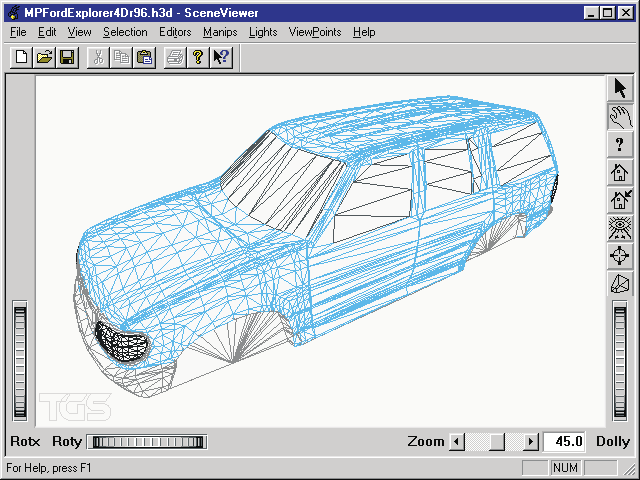
*Figure 11-6: View of 3-D geometry file (mesh). The mesh provides visual properties, as well as mechanical properties that may be used by collision algorithms.*

These material properties are available for collision algorithms to
simulate collision forces and moments, as well as to visualize the resulting
deformation to the vehicle exterior.

> **NOTE:** For more information regarding these parameters and how they are
> used, refer to the User's Manual for the particular simulation model being
> used.

**Table 11-3: Vehicle 3-D Geometry Mechanical Parameters**

| Parameter | Unit Name | Description |
| --- | --- | --- |
| x,y,z coords | UtVehDispLength | Vehicle-fixed vertex coordinates |
| Material Name | UtNone | Material name |
| Constant | UtVehForce | Force required to initiate deflection |
| Linear Stiffness | UtVehMatLinear | Linear material deformation coefficient |
| Quadratic Stiffness | UtVehMatQuad | Quadratic material deformation coefficient |
| Cubic Stiffness | UtVehMatCubic | Cubic material deformation coefficient |
| Damping Constant | UtVehMatDamp | Material velocity-dependent deformation constant |
| Friction Constant | UtNone | Friction coefficient |
| Maximum Force | UtVehForce | Force at which 3rd-order force-deflection relationship is abandoned |
| Maximum Deflection | UtVehDispLinear | Deflection at which 3rd-order force-deflection relationship is abandoned |
| Unloading Slope | UtVehMatLinear | Linear unloading slope beginning at max deflection |

### Geometry File Options

When Geometry File is selected from the Sprung Mass option list, HVE
displays a cascade menu containing more options: *New, Open* and *Save-As*.

> **NOTE:** HVE requires a unique file format for geometry.

> **NOTE:** If you wish to use your own vehicle geometry file, you must
> place it in the `...images/vehicles` subdirectory for vehicle geometry
> files. That's the place HVE expects to find all vehicle 3-D geometry
> files.

#### New

The *New* option removes the existing 3-D geometry file (if any) and
replaces it with the simple vehicle shape.

> **NOTE:** Choose this option if you accidentally select the wrong 3-D
> geometry file and you need to remove it.

To remove the existing 3-D geometry file, perform the following steps:

1. In the Vehicle Viewer, click on the CG sphere. The Sprung Mass options
   for the current vehicle will be displayed.
2. Choose *Geometry File* from the Sprung Mass option list. The 3-D Geometry
   File Selection dialog will be displayed.
3. Choose *New*.

The 3-D geometry is removed from the current vehicle.

#### Open

The *Open* option displays the Vehicle Geometry File Selection dialog and
allows the user to assign a digitized 3-D geometry file for the vehicle. To
open a new 3-D geometry file and assign it to the current vehicle, perform
the following steps:

1. In the Vehicle Viewer, click on the CG sphere. The Sprung Mass options
   for the current vehicle will be displayed.
2. Choose *Geometry File* from the Sprung Mass option list. The 3-D Geometry
   File Selection dialog will be displayed.
3. Click on the *Format* option list to select the file format of the
   desired 3-D geometry file.
4. Select a 3-D geometry file from the list.
5. Press *OK*.

The selected 3-D geometry file is displayed on the current vehicle.

#### Save-As

The *Save-As* option displays the Vehicle Geometry File Selection dialog and
allows the user to save the current 3-D geometry file using a new file
format and file name. To save the current 3-D geometry file as a new file,
perform the following steps:

1. In the Vehicle Viewer, click on the CG sphere. The Sprung Mass options
   for the current vehicle will be displayed.
2. Choose *Geometry File* from the Sprung Mass option list. The 3-D Geometry
   File Selection dialog will be displayed.
3. Click on the *Format* option list to select the file format you wish to
   save the current 3-D geometry file as.
4. Enter a filename or select a filename from the list.
5. Press *OK*.

The selected 3-D geometry file is saved in the `images/vehicles`
subdirectory according to the selected file format and filename.

## Contact Surfaces

The current vehicle may include contact surfaces used for simulating
interaction forces between the vehicle and its occupants or pedestrians.

Contact Surfaces are planes defined by 3 corners (the fourth corner is
automatically assigned by assuming a parallelogram). Contact surfaces are
created using the Contact Surfaces dialog.

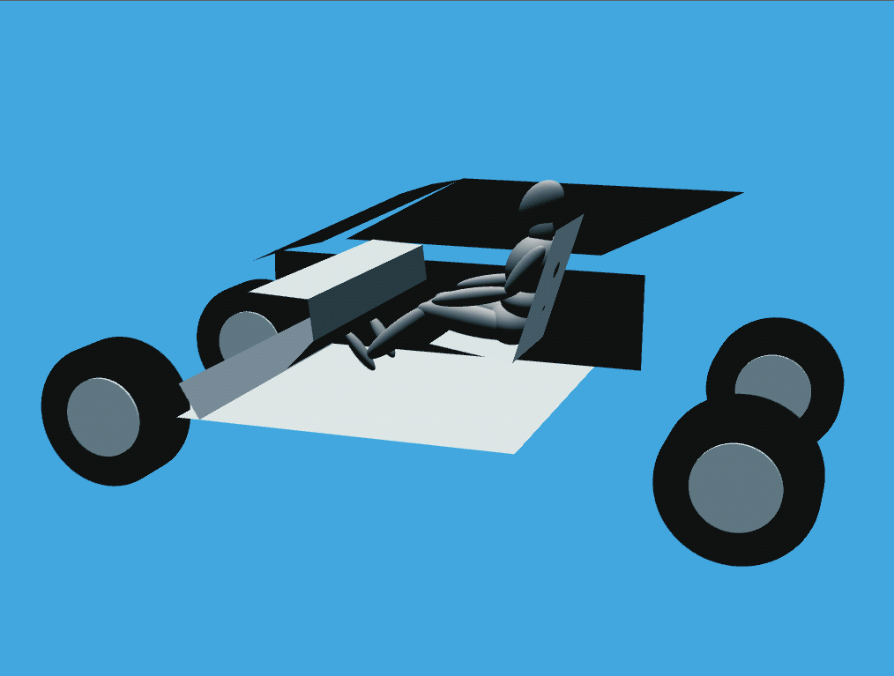
*Figure 11-7: Vehicle contact surfaces — both interior and exterior contact surfaces are permissible.*

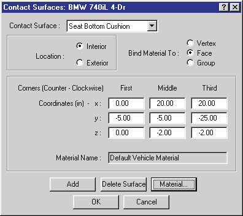
*Figure 11-8: Contact Surfaces dialog.*

To display or edit the current vehicle's contact surfaces properties,
perform the following steps:

1. In the Vehicle Viewer, click on the CG sphere. The Sprung Mass options
   for the current vehicle will be displayed.
2. Choose *Contacts* from the Sprung Mass option list. The Contact Surfaces
   dialog will be displayed.
3. To add a new contact surface, click on *Add* and enter a name for the
   contact surface, followed by *OK*.

   > **NOTE:** If a name already exists in the text field, editing the
   > existing name creates a new surface having the new name. The original
   > name and surface still exist as well.

4. Click the appropriate *Bind Material To* option (*Vertex* or *Face*) to
   define whether the contact material attribute is attached to the vertex
   or face.
5. Click on the *Interior* or *Exterior* radio button to identify the
   contact as an interior or exterior surface.

   > **NOTE:** The simulation may use this information to reduce the number
   > of contacts for which it must calculate forces, based on whether the
   > human is an occupant or pedestrian. For example, it is unnecessary to
   > calculate the force between a pedestrian and seat cushion, since none
   > will occur. (See Event Editor, Contacts Dialog, for more information.)

6. Enter the desired x,y,z (vehicle-fixed) coordinates for three corners of
   the contact surface. Be sure to choose three consecutive corners.

   > **NOTE:** The "right hand rule" is used to determine the positive side
   > of the contact surface; the positive side of the surface is
   > light-colored, while the opposite side is black. Force on the contact
   > surface is only calculated if it is struck on the positive side!

   > **NOTE:** The fourth corner is created automatically assuming a
   > parallelogram.

   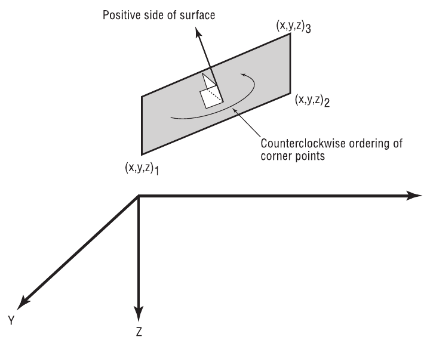
   *Figure 11-9: Convention for contact surfaces — three consecutive corners are selected; the right hand rule determines the positive side.*

7. Choose *Material* to display the Contact Surface Properties dialog.
8. Click on the *Current Material* option button and choose the desired
   material from the materials option list. The properties of the selected
   material will be displayed.
9. If desired, edit the default material properties for the current
   surface.

   > **NOTE:** Any editing applies only to the current contact surface and
   > does not affect the Materials Database.

10. Press *OK* to accept the current material properties.
11. Press *OK* again to update the vehicle's contact surfaces.

It is important to confirm the contact surfaces are correctly positioned
and facing the right direction within the vehicle. Carefully view each
surface to ensure its correct position and orientation.

> **NOTE:** If the contact surfaces are not displayed, click on Options
> (main menu bar) and choose Show Contacts.

To edit an existing contact surface, perform the following steps:

1. If necessary, click on the vehicle CG and choose *Contacts* to display
   the Contact Surface dialog.
2. Click on the *Contact Surface Name* combo box button to display the list
   of contact surfaces.
3. Click on the desired name to make it the current surface. Its coordinates
   will be displayed.
4. If desired, edit the coordinates.
5. If desired, click on *Material* to display and edit the material
   properties or select a different material.
6. Click *OK* to update the list of contact surfaces for the current
   vehicle.

> **NOTE:** No changes take effect until you press OK.

The Contact Surface parameters are described below.

- **Bind Material To** — Assigns an attribute, either *Vertex* or *Face*
  (polygon); the simulation uses this attribute to determine whether the
  material is associated with the vertex or polygonal area.
- **Location** — Assigns an attribute, either *Interior* or *Exterior*,
  available for use by the simulation model to distinguish between surfaces
  on the vehicle's interior and exterior.
- **Material Name** — Assigns a user-editable name to the material; not
  used in calculations.
- **x,y,z** — Assigns the vehicle-fixed x,y,z coordinates for the three
  corners of the contact surface (the fourth is assigned by assuming a
  parallelogram).
- **Linear Stiffness** — The first-order force vs deflection constant for
  the current contact surface.
- **Quadratic Stiffness** — The second-order force vs deflection constant
  for the current contact surface.
- **Cubic Stiffness** — The third-order force vs deflection constant for
  the current contact surface.
- **Damping Constant** — The velocity-dependent force contribution for the
  current contact surface.
- **Friction Constant** — Assigns friction characteristics to the surface;
  normally the friction between two surfaces is the arithmetic average of
  their individual friction coefficients.
- **Maximum Force** — The maximum force resisted by the contact surface; if
  exceeded, force remains constant until the Maximum Deformation is reached.
- **Maximum Deflection** — The maximum allowable material deformation.
- **Unloading Slope** — A value used to assign hysteresis. The unloading
  slope defines the force vs deflection relationship during unloading.

> **NOTE:** The unloading slope should be steeper than the loading slope!

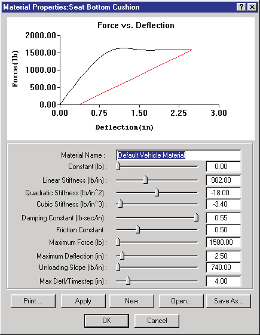
*Figure 11-10: Contact Surfaces Materials dialog.*

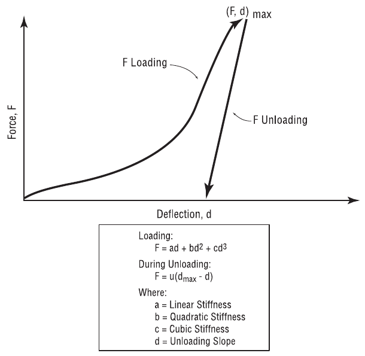
*Figure 11-11: Typical force vs deflection curve for a contact surface. The loading slope (which occurs during penetration) may be defined by a 3rd-order polynomial: F = ad + bd² + cd³, where a = Linear Stiffness, b = Quadratic Stiffness, c = Cubic Stiffness. During unloading the slope is assumed linear: F = u(d_max − d), where u = Unloading Slope.*

**Table 11-4: Vehicle Contact Surface Parameters**

| Parameter | Unit Name | Description |
| --- | --- | --- |
| Bind To | UtNone | Flag indicating whether material attributes are attached to each vertex or each face |
| Location | UtNone | Flag indicating whether the surface is an interior or exterior surface |
| x,y,z coords | UtVehDispLength | Vehicle-fixed vertex coordinates for each of 3 corners |
| Material Name | UtNone | Material name |
| Constant | UtVehForce | Force required to initiate deflection |
| Linear Stiffness | UtVehMatLinear | Linear material deformation coefficient |
| Quadratic Stiffness | UtVehMatQuad | Quadratic material deformation coefficient |
| Cubic Stiffness | UtVehMatCubic | Cubic material deformation coefficient |
| Damping Constant | UtVehMatDamp | Material velocity-dependent deformation constant |
| Friction Constant | UtNone | Friction coefficient |
| Maximum Force | UtVehForce | Force at which 3rd-order force-deflection relationship is abandoned |
| Maximum Deflection | UtVehDispLinear | Deflection at which 3rd-order force-deflection relationship is abandoned |
| Unloading Slope | UtVehMatLinear | Linear unloading slope beginning at max deflection |

## Belt Restraints

The belt restraint systems of the vehicle are displayed and edited using the
Belt Restraints dialog.

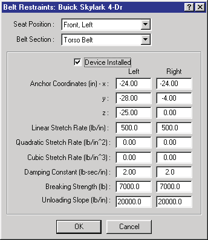
*Figure 11-12: Belt Restraints dialog.*

To display or edit the current vehicle's belt properties, perform the
following steps:

1. In the Vehicle Viewer, click on the CG sphere. The Sprung Mass options
   for the current vehicle will be displayed.
2. Choose *Belts* from the Sprung Mass option list. The Belt Restraints
   properties dialog will be displayed.
3. Click on the *Seat Position* option list and choose the desired seat
   position within the vehicle.
4. Click on the *Belt Section* option list and choose the desired belt
   section (*Torso* or *Lap*).
5. Click on the *Device Installed* checkbox to indicate a selected restraint
   system is installed at the selected seat location. The default belt
   properties for the right and left belt sections will become available for
   editing.
6. View and/or edit the desired properties for the current belt location and
   section.
7. Repeat the above steps for each seat location and belt section.
8. Press *OK* to accept the changes.

The Belt Restraint Properties are described below.

- **Seat Location** — A position index used to determine the location of
  the current belt restraint system.

  > **NOTE:** When the human is created using the Human Editor, it is
  > assigned a position (Right Front, Left Front, ..., Pedestrian). If the
  > vehicle does not have a belt restraint system at a location that matches
  > the occupant position, you will not be able to set up a restraint system
  > during event mode!

- **Belt Section** — A position index used to determine the section (torso
  or lap) of the current belt restraint system.
- **Device Installed** — A check box to indicate the vehicle has a belt
  system at the current location and section.

The following belt restraint material properties may be assigned for the
left and right belt sections:

- **x,y,z Anchor Points** — Assigns the vehicle-fixed x,y,z coordinates
  where the belt is attached to the vehicle.
- **Linear Stiffness** — The first-order force vs deflection constant for
  the belt section.
- **Quadratic Stiffness** — The second-order force vs deflection constant
  for the belt section.
- **Cubic Stiffness** — The third-order force vs deflection constant for
  the belt section.
- **Damping Constant** — The velocity-dependent contribution to stiffness
  for the current belt section.
- **Maximum Force** — The breaking strength of the belt. If exceeded, belt
  force becomes zero.
- **Unloading Slope** — A value used to assign hysteresis. The unloading
  slope defines the force vs deflection relationship during unloading.

> **NOTE:** The unloading slope should be steeper than the loading slope!

**Table 11-5: Belt Restraint System Parameters**

| Parameter | Unit Name | Description |
| --- | --- | --- |
| Location | n/a | Location index (Right Front, Left Front, ..., Left Back) used to assign the location of the current belt section |
| Section | n/a | Torso or Lap belt section |
| Device Installed | BOOLEAN (True or False) | Switch that determines that a restraint is installed at the selected location and section |
| x,y,z | UtVehDispLength | Vehicle-fixed x,y,z coordinates for the anchor point of the belt |
| Linear Stiffness | UtVehMatStiffLinear | First-order force vs deflection constant |
| Quadratic Stiffness | UtVehMatStiffQuad | Second-order force vs deflection constant |
| Cubic Stiffness | UtVehMatStiffCubic | Third-order force vs deflection constant |
| Damping Constant | UtVehMatDamp | Velocity-dependent force contribution |
| Max Force | UtVehForce | Maximum allowable force |
| Unloading Slope | UtVehMatStiffLinear | Force vs deflection constant during unloading |

## Airbag Restraints

The airbag restraint systems of the vehicle are displayed and edited using
the Airbag Restraints dialog.

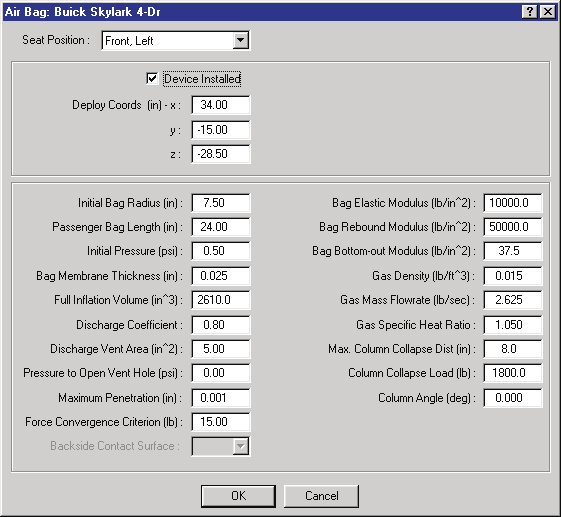
*Figure 11-13: Airbag Restraints dialog.*

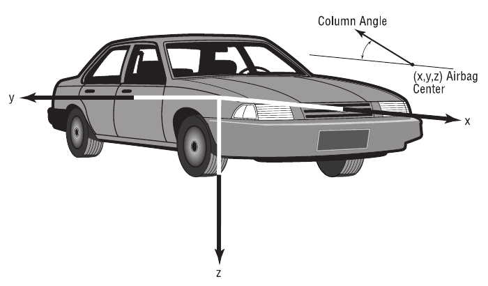
*Figure 11-14: Airbag x,y,z deployment coordinates and deployment (column) angle.*

To display or edit the current vehicle's airbag properties, perform the
following steps:

1. In the Vehicle Viewer, click on the CG sphere. The Sprung Mass options
   for the current vehicle will be displayed.
2. Choose *Airbags* from the Sprung Mass option list. The Airbag Restraints
   properties dialog will be displayed.
3. Click on the *Seat Position* option list and choose the desired seat
   position within the vehicle.
4. Click on the *Device Installed* checkbox to indicate the selected
   restraint system is installed at the selected seat location. The default
   airbag properties for the selected airbag location will become available
   for editing.
5. View and/or edit the desired properties for the selected airbag.
6. Repeat the above steps for each seat location.
7. Press *OK* to accept the changes.

The Airbag Restraint Properties are described below.

- **Seat Location** — A position index used to determine the location of
  the current airbag restraint system.

  > **NOTE:** When the human is created using the Human Editor, he/she is
  > assigned a position (Front Right, Front Center, Front Left, ...,
  > Pedestrian). If this vehicle does not have an airbag restraint system at
  > a location that matches the occupant position, you will not be able to
  > set up a restraint system during event mode!

- **Device Installed** — A checkbox to indicate the vehicle has an airbag
  system at the current location.
- **x,y,z Deployment Coordinates** — Assigns the vehicle-fixed x,y,z
  coordinates where the airbag is installed and deployed.
- **Initial Bag Radius** — Assigns the initial radius for the airbag.
- **Passenger Airbag Length** — Assigns the length for non-driver-side
  airbags.

  > **NOTE:** The driver's position is defined in the Vehicle Information
  > dialog.

- **Initial Pressure** — Assigns the initial pressure for the airbag.
- **Bag Membrane Thickness** — Assigns the material thickness for the
  airbag.
- **Bag Full Inflation Volume** — Assigns the volume inside the airbag when
  fully inflated.
- **Vent Discharge Coefficient** — Assigns the thermodynamic discharge
  coefficient for the airbag vent hole.
- **Vent Discharge Area Coefficient** — Assigns the area of the airbag vent
  hole.
- **Pressure To Open Vent Hole** — Assigns the airbag pressure required to
  cause the vent hole to open.
- **Force Convergence** — Assigns the permissible force imbalance between
  the airbag and contact surfaces.
- **Maximum Penetration** — Assigns the penetration required before any
  force is computed.
- **Bag Elastic Modulus** — Assigns the elastic modulus for the airbag
  material during airbag filling.
- **Bag Rebound Modulus** — Assigns the elastic modulus for the airbag
  material during rebound.
- **Bag Bottom-out Modulus** — Assigns the elastic modulus for the airbag
  material after it has bottomed out.
- **Gas Density** — Assigns the gas density for the airbag filling agent.
- **Gas Mass Flow Rate** — Assigns the mass flow rate for the airbag
  filling rate.
- **Gas Specific Heat** — Assigns the specific heat (ratio) for the airbag
  filling agent.
- **Maximum Column Collapse Distance** — Assigns the maximum distance the
  steering column is allowed to collapse (applies to driver-side airbags
  only).
- **Column Collapse Load** — Assigns the axial load on the steering column
  required to begin collapsing the column (applies to driver-side airbags
  only).
- **Column Angle** — Assigns the steering column angle, about the vehicle's
  pitch axis (normally a negative angle).
- **Backside Contact Surface** — An option list containing all the vehicle
  interior contact surfaces. The selected surface is used to assign the
  material properties for the contact surface supporting the airbag.

> **NOTE:** An airbag must be supported on the backside. Otherwise, the bag
> would simply bounce away from the occupant.

> **NOTE:** This list of backside contact surfaces comes from the vehicle's
> interior contact surfaces.

**Table 11-6: Airbag Restraint System Parameters**

| Parameter | Unit Name | Description |
| --- | --- | --- |
| Location | n/a | Location index (Right Front, Left Front, ..., Left Back) used to assign the location of the airbag |
| Device Installed | BOOLEAN (True or False) | Switch that determines that an airbag restraint is installed at the selected location |
| Deploy x,y,z | UtVehDispLength | Vehicle-fixed x,y,z coordinates for the airbag deployment location |
| Initial Bag Radius | UtVehDispLength | Radius of the (spherical) airbag at the start of filling |
| Passenger Bag Length | UtVehDispLength | Length of the (cylindrical) airbag used for passenger-side airbag systems |
| Initial Bag Pressure | UtVehDispPress | Airbag pressure at the start of filling |
| Membrane Thickness | UtVehDispLength | Thickness of the airbag material |
| Full Inflation Vol | UtVehVolume | Volume of the airbag at full inflation |
| Discharge Coef | UtNone | Thermodynamic discharge coefficient of the airbag vent |
| Discharge Area | UtVehArea | Area of the airbag vent |
| Vent Opening Pressure | UtVehPress | Pressure required to open the vent |
| Bag Penetration for Force | UtVehDispLength | Minimum deflection of an ellipsoid into the airbag required to produce a force |
| Force Convergence Criterion | UtVehForce | Allowable difference between force on the airbag and force on the human |
| Bag Elastic Modulus | UtVehMatStiffQuad | Elastic modulus of the airbag membrane material during force application |
| Bag Elastic Modulus on Rebound | UtVehMatStiffQuad | Elastic modulus of the airbag membrane material during unloading |
| Bag Elastic Modulus When Bottomed Out | UtVehMatStiffQuad | Elastic modulus of the airbag membrane material at maximum penetration |
| Gas Density | UtVehDensity | Density of the airbag filling agent |
| Max Column Collapse | UtVehDispLength | Maximum column stroke before it bottoms out |
| Column Collapse Load | UtVehForce | Force required to initiate column collapse |
| Column Angle | UtVehDispAngle | Deployment (pitch) angle |
| Backside Contact | n/a | The name of the contact surface supporting the airbag (no force can exist between the human and airbag unless the airbag is supported on a contact surface that provides a reaction force) |

*(Note: the legacy table listed the Full Inflation Vol unit as UtVehForce;
this is a typo — the quantity is a volume.)*

## Inter-vehicle Connections

The connections between tow vehicles and trailers are displayed and edited
using the Inter-vehicle Connections dialog.

The available inter-vehicle connections are:

- Ball/Hitch
- Fifth Wheel/King Pin
- Pintle Hook/Eye (drawbars may be *Fixed* or *Hinged*)

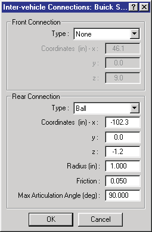
*Figure 11-15: Inter-vehicle Connections dialog.*

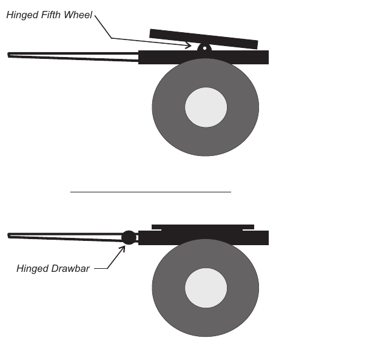
*Figure 11-16: Converter (hinged fifth wheel) and Fixed (hinged drawbar) dollies.*

To display or edit the current vehicle's connection properties, perform the
following steps:

1. In the Vehicle Viewer, click on the CG sphere. The Sprung Mass options
   for the current vehicle will be displayed.
2. Choose *Connections* from the Sprung Mass option list. The Inter-vehicle
   Connections Properties dialog will be displayed.
3. To put a connection on the front of a towed vehicle (e.g., a trailer),
   click on the *Front Connections* option button and select a connection
   type (*None, Hitch, King Pin* or *Pintle Eye*). Then enter the
   vehicle-fixed x,y,z coordinates for the connection.
4. To put a connection on the rear of a tow vehicle (e.g., a passenger car
   or truck tractor), click on the *Rear Connections* option button and
   select a connection type (*None, Ball, Fifth Wheel* or *Pintle Hook*).
   Then enter the vehicle-fixed x,y,z coordinates for the connection,
   friction and friction radius and maximum articulation angle.
5. Press *OK* to accept the changes.

The Inter-vehicle Connection Properties are described below.

- **Front Connection Type** — The type of connection on the front of the
  current vehicle. The allowable types are *None, Hitch, King Pin* and
  *Pintle Eye*.
- **Front Connection Coords** — The vehicle-fixed x,y,z coordinates of the
  front connection.
- **Rear Connection Type** — The type of connection on the rear of the
  current vehicle. The allowable types are *None, Ball, Fifth Wheel* and
  *Pintle Hook*.

  > **NOTE:** During Event Mode, the simulation model normally checks to
  > see the user has selected vehicles with compatible connections: a Hitch
  > on the trailer must be connected to a Ball on the tow vehicle; a King
  > Pin on the trailer must be connected to a Fifth Wheel on the tow
  > vehicle; a Pintle Eye on the trailer must be connected to a Pintle Hook
  > on the tow vehicle. Otherwise, the simulation model should issue a
  > message: Incompatible Connections.

- **Rear Connection Coords** — The vehicle-fixed x,y,z coordinates of the
  rear connection.

  > **NOTE:** The earth-fixed elevation of the connection above ground
  > should be approximately equal on the rear connection of the tow vehicle
  > and the front connection of the trailer. Otherwise, the trailer will be
  > pitched up or down as necessary to make the connection. This can cause
  > some physics models to compute an acceleration. For this reason, the
  > physics model may terminate with an error message.

- **Friction** — The friction coefficient at the connection between the tow
  vehicle and trailer.
- **Friction Radius** — The moment arm at which the frictional torque acts
  at the connection between the tow vehicle and trailer.
- **Maximum Articulation Angle** — The maximum articulation angle allowable
  between the tow vehicle and trailer.

**Table 11-7: Inter-vehicle Connection Parameters**

| Parameter | Unit Name | Description |
| --- | --- | --- |
| Front Connection Type | n/a | Type of front connection (None, Hitch, King Pin or Pintle Eye) |
| Front Connection Coordinates | UtVehDispLength | Vehicle-fixed coordinates of the front connection |
| Rear Connection Type | n/a | Type of rear connection (None, Ball, Fifth Wheel or Pintle Hook) |
| Rear Connection Coordinates | UtVehDispLength | Vehicle-fixed coordinates of the rear connection |
| Connection Friction | n/a | Friction coefficient at the connection |
| Connection Friction Radius | UtVehDispLength | Frictional moment arm |
| Maximum Articulation Angle | UtVehDispAngle | Maximum articulation angle between the tow vehicle and trailer |

## Aerodynamic Drag

The vehicle drag associated with aerodynamic pressure. The Aerodynamic Drag
dialog allows the user to view or edit these properties. See also the
code-verified reference page,
[Aerodynamic Drag dialog](../../02-vehicles/VehDragDlg.md).

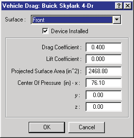
*Figure 11-17: Vehicle Aerodynamic Drag dialog.*

To display or edit the current vehicle's drag factors, perform the following
steps:

1. In the Vehicle Viewer, click on the CG sphere. The Sprung Mass options
   for the current vehicle will be displayed.
2. Choose *Aerodynamic Drag* from the Sprung Mass option list. The
   Aerodynamic Drag dialog will be displayed.
3. Select a surface (by default, the front surface has already been assigned
   those properties associated with velocity-dependent air drag; however,
   data for seven additional surfaces, including wings, air dams and
   spoilers, may also be assigned).
4. View and/or edit the desired properties.
5. Press *OK* to accept the changes.

The Aerodynamic Drag parameters are described below.

- **Surface Option List** — Assigns the selected surface. Available surface
  options are: *Front, Right, Back, Left, Top, Bottom, Front Device, Back
  Device*.
- **Device Installed** — Switch that activates the selected surface.
- **Drag Coefficient** — Assigns the properties resisting motion due to
  dynamic air pressure acting on the selected surface in the direction of
  the vehicle's total velocity vector. The force associated with this
  pressure is proportional to the velocity squared.
- **Lift Coefficient** — Assigns the properties resisting motion due to
  dynamic air pressure acting on the selected surface in the direction
  normal to the vehicle's total velocity vector.
- **Projected Surface Area** — Assigns the projected area parallel to the
  selected surface.
- **Center of Pressure** — Vehicle-fixed coordinates where the effective
  force from aerodynamic pressure is applied.

**Table 11-8: Vehicle Aerodynamic Drag Parameters**

| Parameter | Unit Name | Description |
| --- | --- | --- |
| Surface Name | n/a | Name of selected aerodynamic surface |
| Device Installed | n/a | Flag indicating device is installed and is capable of producing aerodynamic force on the vehicle |
| Drag Coefficient | UtVehDragQuad | Coefficient of aerodynamic drag acting on surface |
| Lift Coefficient | UtVehDragQuad | Coefficient of aerodynamic lift acting on surface |
| Projected Surface Area | UtVehArea | Projected surface area parallel to selected surface |
| Center of Pressure | UtVehDispLength | Vehicle-fixed coordinates where the aerodynamic force is applied |

## Body Torsion

The HVE Vehicle Model includes the capability to model torsional distortion
of the body. By default, the body is assumed to be rigid. However, the user
may wish to edit these default parameters, if the actual torsional stiffness
of the body is known, to study the effect of torsional distortion on vehicle
handling. The Body Torsion dialog is used to edit these properties. See also
the code-verified reference page,
[Body Torsion dialog](../../02-vehicles/BodyTorDlg.md).

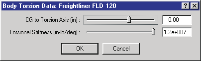
*Figure 11-18: Body Torsion dialog.*

To display or edit the vehicle's torsional data, perform the following
steps:

1. In the Vehicle Viewer, click on the CG sphere. The Sprung Mass options
   for the current vehicle will be displayed.
2. Choose *Body Torsion* from the Sprung Mass option list. The Body Torsion
   dialog will be displayed.
3. Edit the torsional stiffness and torsional roll axis location (distance
   from the CG to the torsion axis).
4. Press *OK* to accept the changes.

**Table 11-9: Vehicle Body Torsion Parameters**

| Parameter | Unit Name | Description |
| --- | --- | --- |
| Axis Location | UtVehDispLength | Vehicle-fixed z-distance from the CG to the torsional roll axis |
| Body Stiffness | UtVehTorque | Torsional stiffness of the body |

---
*Source: HVE User's Manual (Version 5, Seventh Edition, Jan 2006), Chapter
11, pages 11-1..11-35 — updated against source code (HVEINV-64, Physics)
2026-07-05.*

<!-- NAV -->

---

← Previous: [Chapter 10 — Creating & Editing Vehicles](10-creating-editing-vehicles.md)  |  [Index](README.md)  |  Next: [Chapter 11 — Vehicle Model Definition (Part B: Exterior)](11b-exterior.md) →

<!-- /NAV -->
