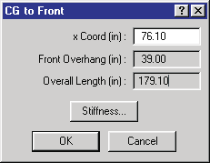
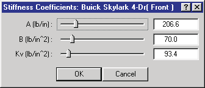
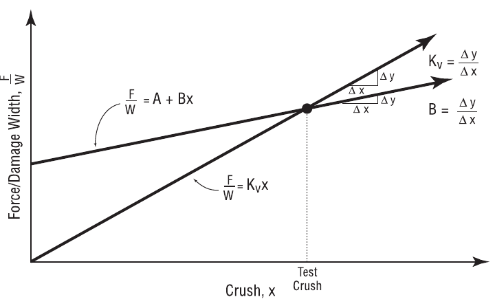

# Chapter 11 — Vehicle Model Definition (Part B: Exterior)

This part covers the vehicle exterior: the exterior dimensions (CG to
Front, Right Side, Back, Left Side, Top and Bottom) and the exterior
structural stiffness coefficients. These properties are edited by clicking
on the exterior spheres displayed on the vehicle in the Vehicle Viewer.

## Vehicle Exterior Dimensions

The vehicle's exterior dimensions are defined by its overall length and
overall width. The user may choose to edit these dimensions using the
Vehicle Dimensions dialogs (CG to Front, Right Side, Back, Left Side, Top,
Bottom).

*Figure 11-19: Vehicle Exterior Dimensions dialogs allow the user to view and edit the dimensions from the CG to the front, right side, back, left side, top and bottom.*

> **NOTE:** The dialog also calculates and displays the overall vehicle
> length (or width), front/rear overhang, overall height and ground
> clearance based on the entered data.

*(updated: the displayed distances are relative to either the sprung-mass
CG or the total-mass CG, according to the current Vehicle Dimensions Basis
selected in the user options. The front/rear overhang and overall length
calculations account for the selected basis, converting between the sprung
and total CG positions as required.)*

To display or edit the current vehicle's overall dimensions, perform the
following steps:

1. In the Vehicle Viewer, click on the Front, Right, Back, Left, Top or
   Bottom exterior sphere. The appropriate dialog (CG to Front, Back, etc.)
   will be displayed.
2. View and/or edit the exterior dimension.
3. Press *OK* to accept the changes. *(updated: an Apply button is also
   available — it applies the entered dimension without closing the
   dialog; Cancel reverts the vehicle to its original dimensions and
   stiffness.)*

The Exterior Dimension parameters are described below.

- **CG to Front** — Assigns the distance from the CG to the front of the
  current vehicle.
- **CG to Right Side** — Assigns the distance from the CG to the right side
  of the current vehicle.
- **CG to Back** — Assigns the distance from the CG to the back of the
  current vehicle (the value will be negative, indicating it is behind the
  CG).
- **CG to Left Side** — Assigns the distance from the CG to the left side
  of the current vehicle (in the SAE coordinate system the value will be
  negative, indicating it is to the left of the CG).
- **CG to Top** — Assigns the distance from the CG to the top of the
  current vehicle (the value will be negative, indicating the roof is above
  the CG).
- **CG to Bottom** — Assigns the distance from the CG to the bottom side of
  the current vehicle.

**Table 11-10: Vehicle Exterior Dimension Parameters**

| Parameter | Unit Name | Description |
| --- | --- | --- |
| CG to Front/Back/Side/Top/Bottom | UtVehDispLength | Vehicle-fixed distance from the CG to the front, right side, back, left side, top or bottom |

See also the code-verified reference pages:
[CG to Front](../../02-vehicles/CGsToAll.md),
[CG to Right Side](../../02-vehicles/CGsToAll1.md),
[CG to Back](../../02-vehicles/CGsToAll2.md),
[CG to Left Side](../../02-vehicles/CGsToAll3.md),
[CG to Top](../../02-vehicles/CGsToAll4.md),
[CG to Bottom](../../02-vehicles/CGsToAll5.md).

## Vehicle Exterior Stiffness Coefficients

The vehicle's structural properties are defined by its stiffness
coefficients. The user may choose to edit these coefficients for the front,
back or sides of the vehicle using the Vehicle Stiffness dialogs.

*Figure 11-20: Vehicle Exterior Stiffness Coefficients dialogs allow the user to view and edit the A, B and Kv stiffness coefficients for the selected surface.*

*(updated: the A/B/Kv Stiffness Coefficients dialog is used when HVE is
running in 2-D mode. In 3-D mode, the Stiffness button in the Vehicle
Dimensions dialogs opens the Vehicle Exterior Stiffness dialog instead,
which additionally supports 3-D — constant/linear/quadratic/cubic —
stiffness definitions, saturation crush and maximum crush. The Stiffness
button is disabled for Fixed Barrier and Movable Barrier vehicle types.)*

To display or edit the current vehicle's A, B and Kv stiffness
coefficients, perform the following steps:

1. In the Vehicle Viewer, click on the front, right side, back or left side
   exterior sphere. The appropriate dialog (CG to Front, Right Side, Back,
   Left Side, Top or Bottom) will be displayed.
2. Click on *Stiffness*. The Stiffness Coefficients dialog for the current
   surface will be displayed.
3. View and/or edit the stiffness properties.
4. Press *OK* to accept the changes.

The Exterior Stiffness parameters are described below.

- **'A' Stiffness Coefficient** — Assigns the force per unit of damage
  width required to initiate permanent crush (see Figures 11-20 and 11-21).
- **'B' Stiffness Coefficient** — Assigns the linear spring rate (force vs
  deflection constant) per unit of damage width required to produce
  permanent crush (see Figures 11-20 and 11-21).
- **'Kv' Stiffness Coefficient** — Assigns the linear spring rate (force vs
  deflection constant) per unit of damage width required to produce
  permanent crush. This value differs from the B constant in that it
  assumes the force vs deflection graph goes through zero (i.e., A = 0).

*Figure 11-21: Force vs Deflection characteristics of a vehicle, and their relationship to the A, B and Kv stiffness coefficients (see also references 2.8–2.14, 4.20, 4.29).*

**Table 11-11: Vehicle Exterior Stiffness Coefficients Parameters**

| Parameter | Unit Name | Description |
| --- | --- | --- |
| A Stiffness | UtVehAStiff | Vehicle 'A' stiffness coefficient |
| B Stiffness | UtVehBStiff | Vehicle 'B' stiffness coefficient |
| Kv Stiffness | UtVehKStiff | Vehicle 'Kv' stiffness coefficient |

See also the code-verified reference pages:
[Stiffness Coefficients dialog (2-D)](../../02-vehicles/StiffCoeffDlg.md),
[A Stiffness](../../02-vehicles/AStiffDlg.md),
[B Stiffness](../../02-vehicles/BStiffDlg.md).

---
*Source: HVE User's Manual (Version 5, Seventh Edition, Jan 2006), Chapter
11, pages 11-36..11-39 — updated against source code (HVEINV-64, Physics)
2026-07-05.*

<!-- NAV -->

---

← Previous: [Chapter 11 — Vehicle Model Definition (Part A: Sprung Mass)](11a-sprung-mass.md)  |  [Index](README.md)  |  Next: [Chapter 11 — Vehicle Model Definition (Part C: Suspension)](11c-suspension.md) →

<!-- /NAV -->
