# Chapter 11 — Vehicle Model Definition (Part C: Suspension)

## Suspension Properties

The suspension parameters of the vehicle are displayed and edited using the
Suspension Data dialog *(updated: the legacy manual calls this the
"Suspension Information" dialog; the current dialog is titled "Suspension
Data" and identifies the current vehicle, axle number and side, e.g.,
"Suspension Data: ... (Axle No. 1, Left Side)")*.

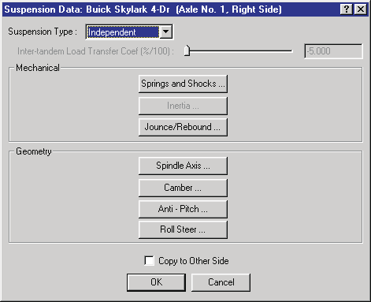
*Figure 11-22: The Suspension Data dialog allows the user to choose specific suspension properties for viewing and editing.*

The Suspension Data dialog includes pushbuttons allowing the user to
select specific suspension properties:

- Suspension Type
- Roll Couple Distribution *(updated: added since the legacy manual — see
  below)*
- Inter-tandem Load Transfer (Tandem Axle suspension types only)
- Mechanical Properties (Springs and Shocks, Inertias, Jounce/Rebound
  Stops)
- Geometry Properties (Spindle Axis, Camber and Half-track Tables,
  Anti-pitch and Roll Steer)

Each of these properties is described in the following sections. See also
the code-verified reference page,
[Suspension Data dialog](../../03-suspension-steering/SuspDlg.md).

### Suspension Type

The HVE Vehicle Model includes the following suspension types:

- **Independent** — The right and left wheels move independently from each
  other (see Figure 11-23a).
- **Solid Axle** — The right and left wheels are rigidly connected (see
  Figure 11-23b).
- **Tandem, 4-Spring** — A set of two solid axle suspensions sharing an
  articulated spring support, such that the force on the rear of the
  leading spring is transferred to the front of the trailing spring (see
  Figure 11-23c).
- **Tandem, Walking Beam** — A set of two solid axle suspensions connected
  by a rigid link (see Figure 11-23d).

*(updated: the tandem types are offered in the list only where a tandem
axle set is possible — on rear axles of vehicles with more than two axles,
and on trailers or dollies with more than one axle. Otherwise the list
contains only Independent and Solid Axle.)*

To choose the suspension type for any axle, perform the following steps:

1. Click the right or left wheel for the selected axle. The Suspension Data
   dialog for the selected wheel is displayed.
2. Click on the *Suspension Type* option button to display the Suspension
   Type option list, and select one of the available types.

> **NOTE:** Inertial properties are disabled for independent suspensions.

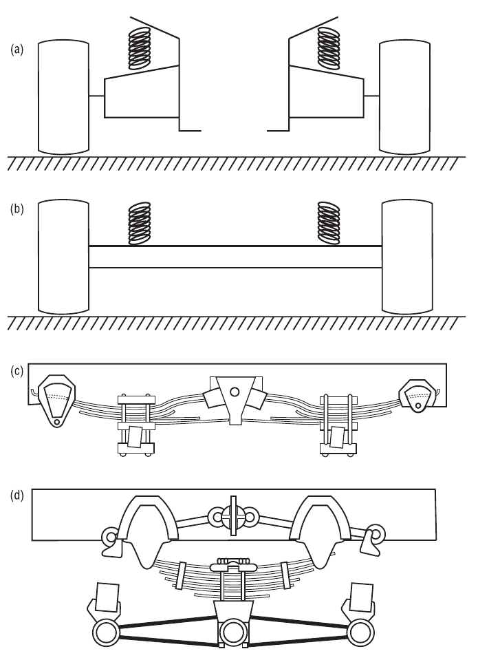
*Figure 11-23: Suspension Types: Independent (a), Solid Axle (b), Tandem Axle, 4-Spring (c) and Tandem Axle, Walking Beam (d).*

### Roll Couple Distribution

*(updated: this option was added after the legacy manual was written.)* A
slider/edit field for the fraction (%/100) of the total sprung mass roll
couple (lateral load transfer) reacted at the selected axle. Values at the
individual axles are automatically balanced so that the distribution over
all axles totals 1.0 — for example, changing the value at a rear axle
adjusts the front axle share accordingly; on three-axle vehicles the
remainder is split between the other axles. The controls are disabled if
the vehicle has fewer than two axles, or if the vehicle has no driver
location defined (except movable barriers).

### Inter-tandem Load Transfer

If the selected suspension type is a tandem axle (either 4-Spring or
Walking Beam), the Inter-tandem Load Transfer parameter is enabled,
allowing the user to enter a value (%/100) for the inter-tandem load
transfer for the selected axle set. To enter the inter-tandem load transfer
for a tandem axle suspension, perform the following steps:

1. Click on *Suspension Type* and choose a tandem axle suspension type
   (4-Spring or Walking Beam). The inter-tandem load transfer parameter is
   enabled.
2. Enter the desired value.

### Springs and Shocks

The Springs and Shocks properties for the selected wheel location are
displayed and edited using the Springs and Shocks dialog. See also the
code-verified reference page,
[Springs and Shocks dialog](../../03-suspension-steering/SprindShocksDlg.md).

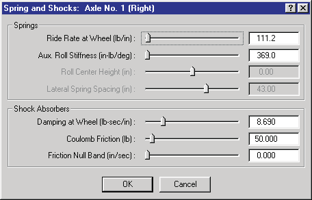
*Figure 11-24: Springs and Shocks dialog for selected wheel location.*

To display or edit the spring and shock parameters for the selected wheel
position, perform the following steps:

1. In the Vehicle Viewer, click on the desired wheel. The Unsprung Mass
   options for the selected wheel are displayed.
2. Choose *Suspension* from the Unsprung Mass option list. The Suspension
   Data dialog is displayed.
3. Choose *Springs and Shocks*. The Springs and Shocks dialog is displayed.
4. View and/or edit the desired properties.
5. Press *OK* to accept the changes. The Suspension Data dialog is still
   displayed.
6. If desired, click *Copy To Other Side* to make the changes apply to both
   sides.
7. Press *OK* to accept the suspension changes to the selected wheel
   position(s).

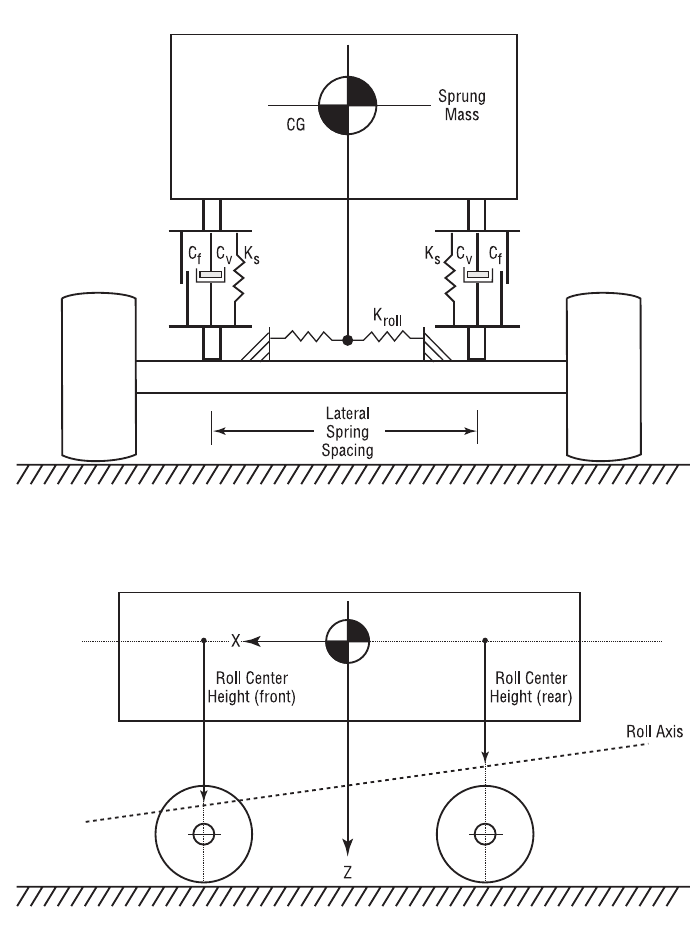
*Figure 11-25: Suspension parameters used in the HVE Vehicle Model. Ks, Cv and Cf are spring rate, damping rate and coulomb friction, respectively, for each wheel position. Kroll is the additional roll stiffness contribution due to an anti-sway bar.*

The Springs and Shocks properties are described below.

- **Ride Rate at Wheel** — Spring rate (force per unit of wheel travel) at
  the selected wheel due to the spring.
- **Auxiliary Roll Stiffness** — Roll stiffness (torque per unit of sprung
  mass roll) added by the addition of an anti-sway bar.
- **Roll Center Height** — Vertical distance from the sprung mass CG down
  (+) to the suspension roll center.
- **Lateral Spring Spacing** — Lateral distance between springs for solid
  axle suspension types.
- **Damping Rate at Wheel** — Velocity-dependent suspension force due to
  shock absorbers.
- **Coulomb Friction** — Friction force required to initiate suspension
  travel.
- **Friction Null Band** — Minimum suspension velocity required for full
  coulomb friction force.

**Table 11-12: Suspension Spring and Shock Parameters**

| Parameter | Unit Name | Description |
| --- | --- | --- |
| Ride Rate | UtSusForce | Linear force vs deflection characteristic effective at the wheel |
| Auxiliary Roll Stiffness | UtSusRollStiff | Moment per unit of body roll produced by an anti-sway bar |
| Roll Center Height | UtSusDispLength | Height of the roll axis measured at the suspension |
| Lateral Spring Spacing | UtSusDispLength | Lateral distance between left and right springs for solid axle suspensions |
| Damping at Wheel | UtSusDamp | Damping rate effective at the wheel |
| Coulomb Friction | UtSusForce | Force required to initiate suspension travel |
| Friction Null Band | UtSusVelLinear | Suspension velocity required for full coulomb friction |

### Axle Inertia

The Suspension Inertial properties for the selected wheel location are
displayed and edited using the Axle Inertia dialog.

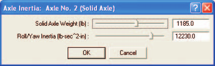
*Figure 11-26: Suspension Inertia dialog for selected axle — the selected wheel shares these parameters with the wheel on the other side of the vehicle.*

To display or edit the suspension inertial parameters for the selected
wheel/axle, perform the following steps:

1. In the Vehicle Viewer, click on the desired wheel. The Unsprung Mass
   options for the selected wheel are displayed.
2. Choose *Suspension* from the Unsprung Mass option list. The Suspension
   Data dialog is displayed.
3. Choose *Axle Inertias*. The Axle Inertia dialog is displayed.

   > **NOTE:** The Axle Inertia option is only available for solid axle
   > suspension systems.

4. View and/or edit the desired properties.
5. Press *OK* to accept the changes. The Suspension Data dialog is still
   displayed.
6. If desired, click *Copy To Other Side* to make the changes apply to both
   sides.

   > **NOTE:** This action is actually irrelevant for the inertias dialog
   > because it automatically applies to the axle shared by both wheels.

7. Click *OK* to accept the suspension changes to the selected wheel
   position(s).

The Suspension Inertial properties are described below.

- **Weight** — Total weight of the axle and springs.

  > **NOTE:** The Vehicle Editor actually divides your entered value by the
  > current gravitational constant (see Environment Editor) and stores the
  > resultant mass. That way, if you take the vehicle to the moon, it will
  > behave correctly!

  > **NOTE:** The weight of the wheels and brakes should not be included
  > here! By convention, the weight of each wheel assembly, including the
  > brake, is to be included in the tire weight (see Tire Physical
  > Parameters).

- **Roll/Yaw Inertia** — Roll and yaw inertia of the axle. Per the above
  note, do not include wheel inertias; they are included with the tires.

  > **NOTE:** The pitch inertia of the axle is assumed to be negligible.

**Table 11-13: Suspension Inertial Parameters**

| Parameter | Unit Name | Description |
| --- | --- | --- |
| Weight | UtSusForce | Weight of the suspension, excluding wheels and brakes |
| Roll/Yaw Inertia | UtSusInertia | Roll and yaw rotational inertias of axle, excluding wheels and brakes |

### Jounce/Rebound

The Jounce and Rebound properties for the selected wheel location are
displayed and edited using the Jounce/Rebound dialog. Suspension stops are
used to limit the travel of the suspension. See also the code-verified
reference page,
[Jounce and Rebound dialog](../../03-suspension-steering/JouAndRebDlg.md).

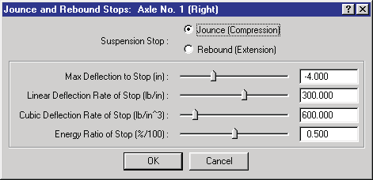
*Figure 11-27: Jounce and Rebound dialog for selected wheel.*

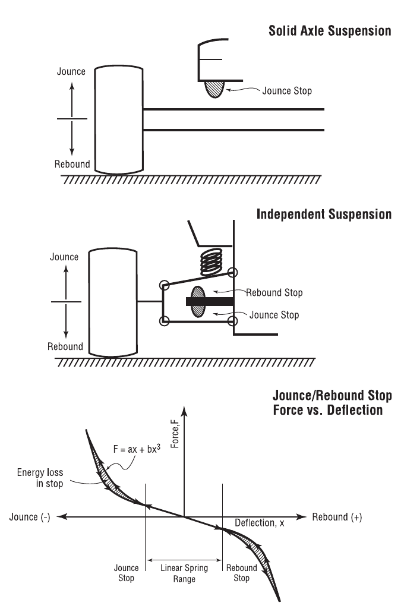
*Figure 11-28: Suspension Jounce and Rebound parameters.*

To display or edit the suspension stop parameters for the selected wheel,
perform the following steps:

1. In the Vehicle Viewer, click on the desired wheel. The Unsprung Mass
   options for the selected wheel are displayed.
2. Choose *Suspension* from the Unsprung Mass option list. The Suspension
   Data dialog is displayed.
3. Choose *Jounce/Rebound*. The Jounce/Rebound dialog is displayed.
4. Click the *Jounce* radio button to view and/or edit the desired jounce
   stop properties.
5. Click the *Rebound* button to view and/or edit the desired rebound stop
   properties.
6. Press *OK* to accept the changes. The Suspension Data dialog is still
   displayed.
7. If desired, click *Copy To Other Side* to make the changes apply to both
   sides.
8. Click *OK* to accept the suspension changes to the selected wheel
   position(s).

The Jounce/Rebound properties are described below.

- **Jounce/Rebound Button** — Type of stop: Jounce (compression travel
  limit) or Rebound (extension travel limit).
- **Maximum Deflection to Stop** — Suspension travel distance from
  equilibrium to selected stop.
- **Stop Linear Rate** — Linear constant (force per unit of wheel travel)
  of the selected suspension stop.
- **Stop Cubic Rate** — Cubic constant (force per unit of wheel travel) of
  the selected suspension stop.
- **Stop Energy Ratio** — Ratio of conserved to total energy (restitution)
  of the selected suspension stop.

**Table 11-14: Suspension Jounce/Rebound Parameters**

| Parameter | Unit Name | Description |
| --- | --- | --- |
| Stop Type | n/a | Location of stop (Jounce or Rebound) |
| Maximum Deflection | UtSusDispLength | Suspension travel from equilibrium to jounce or rebound stop |
| Linear Stop Rate | UtSusRateLinear | Spring linear constant (force per unit of wheel travel) of the selected suspension stop *(the legacy table said "cubic" here — a typo)* |
| Cubic Stop Rate | UtSusRateCubic | Spring cubic constant (force per unit of wheel travel) of the selected suspension stop |
| Energy Ratio | UtSusPercent | Ratio of conserved to total energy (restitution) of the selected suspension stop |

### Spindle Axis

The Spindle Axis geometry properties for the selected wheel location are
displayed and edited using the Spindle Axis dialog. See also the
code-verified reference page,
[Spindle Axis dialog](../../03-suspension-steering/SpndleAxisDlg.md).

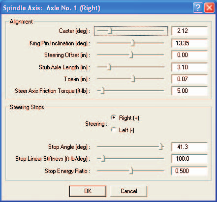
*Figure 11-29: Spindle Axis dialog for selected wheel.*

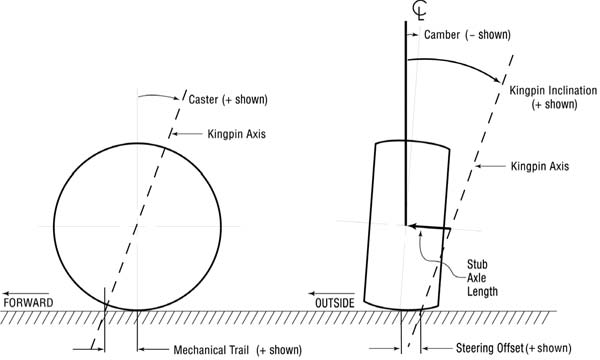
*Figure 11-30: Suspension Spindle Axis geometry parameters.*

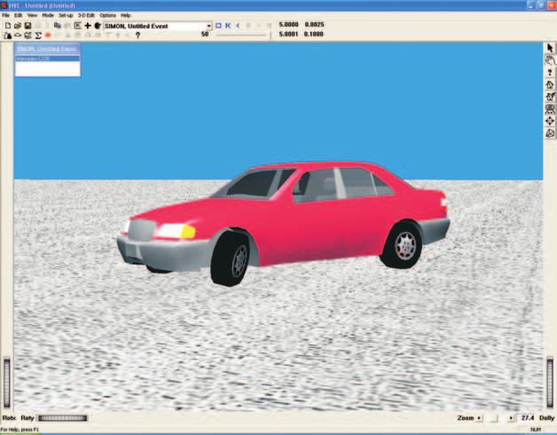
*Figure 11-31: Effect of suspension alignment (in particular, caster, kingpin inclination and stub axle length) on the geometry of a steered wheel — note left front wheel.*

#### Alignment

The Alignment parameters, especially Caster, Camber, Kingpin Inclination
and Steering Offset (see Figure 11-30), play an important role in
determining how tire forces on a steerable axle affect directional
response.

> **NOTE:** Some simulation models assume the wheel steers about a vertical
> axis through the tire plane. This is a simplification. A wheel on a
> steerable axle actually steers about the kingpin axis. Some simulation
> models (e.g., SIMON) rigorously model this behavior.

To display or edit the Alignment parameters for the selected wheel
position, perform the following steps:

1. In the Vehicle Viewer, click on the desired wheel. The Unsprung Mass
   options for the selected wheel are displayed.
2. Choose *Suspension* from the Unsprung Mass option list. The Suspension
   Data dialog is displayed.
3. Choose *Spindle Axis*. The Spindle Axis dialog is displayed.
4. View and/or edit the desired Alignment properties.

> **NOTE:** Kingpin Inclination, Steering Offset and Stub Axle Length are
> inter-related. Editing the Kingpin Inclination or Stub Axle Length will
> automatically recalculate Steering Offset. Similarly, editing Steering
> Offset will automatically update Stub Axle Length.

#### Steering Stops

The Steering Stop parameters define the logical limit to steer angles (+ or
−) at each wheel. They are also used by the Steer DOF model, when it is
employed, to calculate the steering torque that results when a wheel is
steered beyond its limit.

To display or edit the Steering Stop parameters for the selected wheel
position, continue as follows:

1. Click on the *Steering* radio button and choose the Right or Left
   steering stop.
2. Edit the Stop Angle, Stiffness and/or Stop Energy Ratio as desired.
3. Press *OK* to accept the changes to the Alignment and Steering Stop
   parameters. The Suspension Data dialog is still displayed.
4. If desired, click *Copy To Other Side* to make the changes apply to both
   sides of the vehicle.
5. Click *OK* to accept the suspension changes to the selected wheel
   position(s).

> **NOTE:** The Spindle Axis dialog is displayed only for steerable axles!
> (See Steering System.)

The Spindle Axis Alignment properties are described below.

- **Caster** — The fore-aft angle of the spindle axis (see Figure 11-30).
  This angle is largely responsible for the self-aligning properties of a
  steerable axle.

  > **NOTE:** Caster Angle is defined according to SAE J670e as positive
  > (+) when the top of the axis tilts rearward (see Figure 11-30).

- **Kingpin Inclination** — The angle in front elevation between the
  steering axis and a line parallel to the vehicle-fixed z axis (see Figure
  11-30). This angle, along with the caster angle, is responsible for the
  self-aligning properties of a steerable axle.

  > **NOTE:** Kingpin Inclination Angle is defined according to SAE J670e
  > as positive (+) when the top of the axis tilts inward, regardless of
  > right or left side (see Figure 11-30).

- **Steering Offset (Scrub Radius)** — The distance from the center of the
  tire contact patch to the point where the steering axis intersects the
  ground at equilibrium conditions. This distance produces a steering
  torque (positive or negative, depending on the sign of the scrub radius)
  due to longitudinal tire force (either braking or driving).

  > **NOTE:** This value should be kept small. Otherwise, unwanted steering
  > effects will be introduced on acceleration or braking.

- **Stub Axle Length** — (Also called Kingpin Offset at Wheel Center.) The
  distance from the steering axis to the center of the wheel (see Figure
  11-30). As described above, Kingpin Inclination, Steering Offset and Stub
  Axle Length are inter-related; changes to one of these parameters affect
  the others.
- **Toe-in** — The difference in distance between the center of the tire
  plane at the spindle and the front of the tire.
- **Steer Axis Friction Torque** — The coulomb friction in the steering
  axis. This friction produces torque that resists steering moments, either
  from the tire-terrain interface or from the steering wheel. This
  parameter affects the Steer DOF model.

The Steer Axis Steering Stop parameters are described below.

- **Steering Stop** — This radio button allows the user to select the
  desired stop (Right Steer or Left Steer).
- **Stop Angle** — The vehicle-fixed steering angle at which the stop is
  reached.
- **Stop Stiffness** — The mechanical stiffness of the steering stop.
  Additional steering will be resisted by a torque that attempts to return
  the wheel towards zero steer.
- **Stop Energy Ratio** — The ratio of conserved to total energy of the
  selected steering stop (this property is analogous to Jounce and Rebound
  Stops; see Figure 11-28). This parameter keeps the wheel from bouncing
  off the steering stop.

**Table 11-15: Spindle Axis Parameters**

| Parameter | Unit Name | Description |
| --- | --- | --- |
| Caster | UtSusDispAngle | Fore-aft angle of spindle axis |
| Kingpin Inclination | UtSusDispAngle | Lateral angle of spindle axis |
| Steering Offset (Scrub Radius) | UtSusDispLength | Lateral distance from the steering axis to the center of the tire contact patch, measured at the road plane |
| Stub Axle Length | UtSusDispLength | Distance from the steering axis to the center of the wheel |
| Toe-in | UtSusDispLength | Difference in the lateral distance between the tire centerline, measured at the front and rear of the tire |
| Steering Stop | n/a | Stop selector for right or left steering stop |
| Stop Angle | UtSusDispAngle | Steering angle at which the stop is reached |
| Stop Linear Stiffness | UtVehSteeringStiffness | Mechanical stiffness of the steering stop |
| Stop Energy Ratio | UtNone | Ratio of conserved to total energy in the steering stop |

### Camber & Half-track Table

The Camber and Half-track properties for the selected wheel location are
displayed and edited using the Camber & Half-track Table dialog. See also
the code-verified reference page,
[Camber dialog](../../03-suspension-steering/CamberDlg.md).

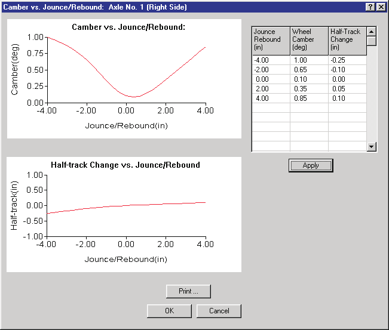
*Figure 11-32: Camber and Half-track Table dialog for selected wheel.*

To display or edit the camber and half-track tables for the selected wheel
position, perform the following steps:

1. In the Vehicle Viewer, click on the desired wheel. The Unsprung Mass
   options for the selected wheel are displayed.
2. Choose *Suspension* from the Unsprung Mass option list. The Suspension
   Data dialog is displayed.
3. Choose *Camber & Half-track Table*. The Camber & Half-track Table dialog
   is displayed.
4. View and/or edit the desired properties.
5. Press *Apply* to graph the changes to the camber and half-track tables.
6. Press *Print* to print the tables.

   > **NOTE:** The tables are printed on the system printer. See Printing
   > for more information.

7. Press *OK* to accept the changes. The Suspension Data dialog is still
   displayed.
8. If desired, click *Copy To Other Side* to make the changes apply to both
   sides.
9. Press *OK* to accept the suspension changes to the selected wheel
   position(s).

The Camber and Half-track Table properties are described below.

- **Jounce/Rebound** — Suspension travel from equilibrium (see Figure
  11-28). Jounce (compression) is negative; rebound (extension) is
  positive.
- **Camber** — Camber angle (see Figure 11-30) at the specified suspension
  deflection.

  > **NOTE:** Camber angle is defined according to SAE J670e as positive
  > (+) when the top of the wheel tilts outward, regardless of right or
  > left side (see Figure 11-30).

- **Half-track Change** — Change in lateral wheel position due to
  suspension jounce or rebound.

**Table 11-16: Camber and Half-track Table Parameters**

| Parameter | Unit Name | Description |
| --- | --- | --- |
| Jounce/Rebound | UtVehDispLength | Suspension travel from equilibrium to Jounce (−) or Rebound (+) stop |
| Camber | UtVehDispAngle | Camber angle of wheel at specified suspension deflection |
| Half-track Change | UtVehDispLength | Change in lateral wheel position due to suspension jounce or rebound |

### Anti-Pitch

The Anti-Pitch properties for the selected wheel location are displayed and
edited using the Anti-Pitch dialog. See also the code-verified reference
page, [Anti-Pitch dialog](../../03-suspension-steering/AntiPitchDlg.md).

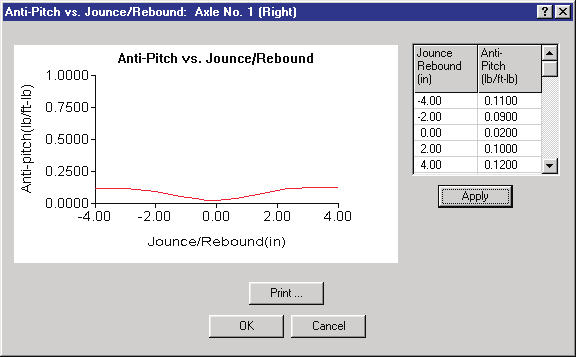
*Figure 11-33: The Vehicle Anti-Pitch dialog allows the user to enter suspension anti-pitch characteristics.*

To display or edit the anti-pitch table for the selected wheel position,
perform the following steps:

1. In the Vehicle Viewer, click on the desired wheel. The Unsprung Mass
   options for the selected wheel are displayed.
2. Choose *Suspension* from the Unsprung Mass option list. The Suspension
   Data dialog is displayed.
3. Choose *Anti-pitch*. The Anti-pitch Table dialog is displayed.
4. Enter jounce/rebound and a corresponding anti-pitch value. Up to 15
   pairs of data may be entered.
5. Press *OK* to accept the changes. The Suspension Data dialog is still
   displayed.
6. If desired, click *Copy To Other Side* to make the changes apply to both
   sides.
7. Click *OK* to accept the suspension changes to the selected wheel
   position(s).

The Anti-pitch Table properties are described below.

- **Jounce/Rebound** — Suspension travel from equilibrium (see Figure
  11-28). Jounce (compression) is negative; rebound (extension) is
  positive.
- **Anti-pitch** — Anti-pitch force at the specified suspension deflection.

**Table 11-17: Anti-pitch Table Parameters**

| Parameter | Unit Name | Description |
| --- | --- | --- |
| Jounce/Rebound | UtSusDispLength | Suspension travel from equilibrium to Jounce (−) or Rebound (+) stop |
| Anti-pitch | UtSusAntiPitch | Anti-pitch force at given suspension jounce or rebound |

### Roll Steer

The Roll Steer properties for the selected wheel location are displayed and
edited using the Roll Steer dialog. The roll steer dialogs are different
for independent and solid axle suspensions: independent suspensions use the
polynomial-coefficient dialog with a *Roll Steer vs. Jounce/Rebound* graph;
solid axle (and tandem) suspensions use a single-coefficient dialog. See
also the code-verified reference pages,
[Roll Steer dialog (independent)](../../03-suspension-steering/RollSteerDlg.md)
and
[Roll Steer Properties (solid/tandem axle)](../../03-suspension-steering/RollSteerNewDlg.md).

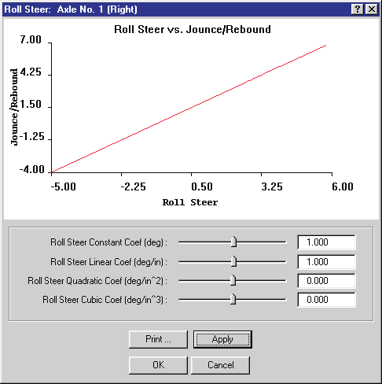
*Figure 11-34: Roll Steer dialog for independent suspensions.*

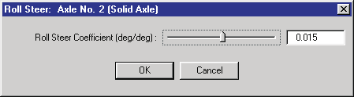
*Figure 11-35: Roll Steer dialog for solid axle suspensions.*

To display or edit the roll steer parameters, perform the following steps:

1. In the Vehicle Viewer, click on the desired wheel. The Unsprung Mass
   options for the selected wheel are displayed.
2. Choose *Suspension* from the Unsprung Mass option list. The Suspension
   Data dialog is displayed.
3. Choose *Roll Steer*. The Roll Steer dialog is displayed.
4. View and/or edit the desired properties.
5. Choose *Apply* to graph the changes.
6. If desired, choose *Print* to print a graph (independent types).
7. Press *OK* to accept the changes. The Suspension Data dialog is still
   displayed.
8. If desired, click *Copy To Other Side* to make the changes apply to both
   sides.
9. Press *OK* to accept the suspension changes to the selected wheel
   position(s).

The Roll Steer parameters are described below.

- **Jounce/Rebound** — Suspension travel from equilibrium (see Figure
  11-28). Jounce (compression) is negative; rebound (extension) is
  positive.
- **Roll Steer Coefficients** — For independent suspensions, the constant,
  linear, quadratic and cubic coefficients of the wheel steer angle vs
  jounce/rebound polynomial. For solid axle suspensions, a single roll
  steer coefficient: the ratio of wheel (axle) steer to body roll. *(The
  legacy manual repeated the Anti-pitch description here — a typo.)*

**Table 11-18: Roll Steer Parameters**

| Parameter | Unit Name | Description |
| --- | --- | --- |
| Jounce/Rebound | UtSusDispLength | Suspension travel from equilibrium to Jounce (−) or Rebound (+) stop |
| Constant | UtSusDispAngle | Initial steer angle at zero roll |
| Linear Coef | UtSusLinearRollSteer | Linear roll steer vs jounce/rebound |
| Quadratic Coef | UtSusQuadRollSteer | Quadratic roll steer vs jounce/rebound |
| Cubic Coef | UtSusCubicRollSteer | Cubic roll steer vs jounce/rebound |
| Coefficient (Solid) | UtNone | Ratio of wheel steer to body roll |

---
*Source: HVE User's Manual (Version 5, Seventh Edition, Jan 2006), Chapter
11, pages 11-40..11-61 — updated against source code (HVEINV-64, Physics)
2026-07-05.*

<!-- NAV -->

---

← Previous: [Chapter 11 — Vehicle Model Definition (Part B: Exterior)](11b-exterior.md)  |  [Index](README.md)  |  Next: [Chapter 11 — Vehicle Model Definition (Part D: Brakes, Tires and Wheels)](11d-brakes-tires-wheels.md) →

<!-- /NAV -->
