# Chapter 11 — Vehicle Model Definition (Part D: Brakes, Tires and Wheels)

This part covers the unsprung-mass properties edited by clicking on a wheel
in the Vehicle Viewer: the Brake Assembly at each wheel, the Tire
properties, the Wheel Location and the Wheel Image.

## Brake Assembly Parameters

The Brake Assembly properties for the selected wheel are displayed and
edited using the Brake Assembly dialog. See also the code-verified
reference page,
[Brake Assembly dialog](../../04-brakes-powertrain/BrkAsmblyDlg.md).

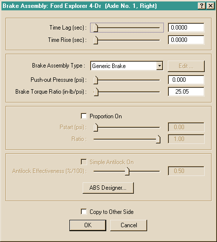
*Figure 11-36: Brake Assembly dialog for editing the properties of the brake system at the selected wheel.*

To display or edit the current vehicle's brake assembly parameters at a
selected wheel, perform the following steps:

1. In the Vehicle Viewer, click on the desired wheel. The Unsprung Mass
   options for the selected wheel are displayed.
2. Choose *Brake* from the Unsprung Mass option list. The Brake Assembly
   dialog for the selected wheel is displayed.
3. View and/or edit the desired properties.
4. Press *OK* to accept the changes.

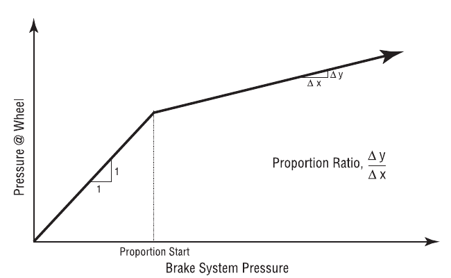
*Figure 11-37: Brake System Proportioning.*

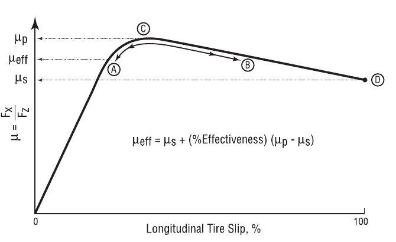
*Figure 11-38: Simple Antilock Model.*

The Brake properties at each wheel are described below.

- **Time Lag** — Time required before the driver's brake pedal inputs reach
  the wheel.
- **Time Rise** — Time required for the brake pressure at the wheel brake
  actuator to reach approximately 90 percent of full system pressure
  (pressure in the air chamber rises at an exponential rate).

  > **NOTE:** If a simulation model does not use HVE's Time Lag or Time
  > Rise parameters, the lag and rise time may be simulated in the Brake
  > Table (see Event Editor, Driver Controls).

- **Brake Type** — An option list displaying the type of brake assembly
  used at the selected wheel location. The default is *Generic*; in this
  case, the Brake Torque Ratio (see below) is defined directly by the user.
  The other types are *Disc, Duo-Servo, Duplex, Single Piston, Dual Piston,
  S-Cam, Single Wedge, Dual Wedge* and *Air Disc* *(updated: Air Disc was
  added since the legacy manual)*.

  > **NOTE:** See the HVE Brake Designer documentation for details on the
  > use of this option. When a specific (non-Generic) brake design is
  > selected, the *Edit Brake...* button opens the Brake Designer dialog
  > for that assembly type, and the Push-out Pressure and Brake Torque
  > Ratio are computed by the Brake Designer. *(updated: selecting Disc or
  > Air Disc also sets the wheel brake assembly type for the axle to Disc,
  > while the drum-based designs set it to Drum.)*

- **Push-out Pressure** — Brake system pressure required to begin causing
  brake torque (any system pressure below this point is simply taking out
  the slack in the system).
- **Brake Torque Ratio** — Wheel brake torque per unit of system pressure
  at the wheel. The actual braking torque at the wheel is the product of
  the current wheel system pressure and the Brake Torque Ratio.
- **Proportioning Check Box** — Click on this check box if the system
  pressure at the selected wheel is reduced by a proportioning valve.
- **Proportioning Starting Pressure** — Beginning at this level of system
  pressure, any additional master cylinder pressure will be reduced (see
  Figure 11-37).
- **Proportioning Ratio** — At master cylinder pressures above the
  Proportioning Starting Pressure, additional pressure is reduced by this
  ratio (see Figure 11-37).
- **Anti-lock Check Box** — Click on this check box if the selected wheel
  has a simple (functional) anti-lock device installed.
- **Anti-lock Efficiency** — A 100% effective anti-lock system maintains a
  longitudinal wheel force associated with the peak coefficient of
  friction. A 0% effective system maintains a longitudinal wheel force
  associated with the slide coefficient of friction. A 50% effective system
  would maintain a longitudinal force halfway between that associated with
  peak and slide friction (see Figure 11-38).
- **ABS Designer** — A pushbutton used to access the ABS Wheel Data dialog
  of the HVE Brake Designer *(updated: the ABS Designer edits detailed ABS
  wheel data — wheel kinematics thresholds such as minimum velocity, tire
  slip range and spin acceleration range, and pressure modulation
  parameters such as cycle rate, apply/release delays and apply/release
  rates)*.

> **NOTE:** The Simple Antilock option is not enabled if the vehicle is
> fitted with an ABS brake system. The ABS Designer pushbutton is not
> enabled if the brake system is not fitted with ABS (ABS is installed in
> the Brake System Pressure vs Pedal Force dialog). See Brake System
> Parameters in [Part E](11e-drivetrain-steering-brake-system.md).

**Table 11-19: Wheel Brake Assembly Parameters**

| Parameter | Unit Name | Description |
| --- | --- | --- |
| Time Lag | UtBraTime | Time required for brake system pressure to reach the wheel |
| Time Rise | UtBraTime | Time required for the brake pressure at the wheel brake actuator to reach approximately 90 percent of full system pressure |
| Push-out Pressure | UtBraPress | Pressure required to begin braking |
| Brake Torque Ratio | UtBraRatio | Brake torque per unit of system pressure at the wheel |
| Proportioning | boolean (TRUE or FALSE) | Flag; if TRUE the wheel pressure is reduced by a proportioning valve |
| Pstart | UtBraPress | Brake system pressure at which proportioning begins for the selected wheel location |
| Proportioning Ratio | UtNone | Ratio of pressure at the wheel to pressure at the master cylinder |
| Antilock | boolean (TRUE or FALSE) | Flag; TRUE if the wheel has an antilock device |
| Anti-lock Efficiency | UtBraPercent | Efficiency of the antilock system at the selected wheel |

### HVE Brake Designer

The HVE Brake Designer provides a detailed brake design capability
integrated directly within the HVE simulation environment. This feature
allows vehicle designers and safety researchers to develop a specific brake
design for each wheel and evaluate the resulting vehicle performance using
a predefined suite of maneuvers or compliance test simulations. The HVE
Brake Designer also includes a detailed tool for simulating ABS.

The Brake Designer dialogs for the individual assembly types are documented
in the code-verified reference pages:
[Disc Brake](../../04-brakes-powertrain/DiskBreakDlg.md),
[Duo-Servo](../../04-brakes-powertrain/DueServoBrkDlg.md),
[Duplex](../../04-brakes-powertrain/DuplexBrkDlg.md),
[Single Piston](../../04-brakes-powertrain/BrkSingPistDlg.md),
[Dual Piston](../../04-brakes-powertrain/DualPistBrkDlg.md),
[Dual Wedge](../../04-brakes-powertrain/DualWedgeBrkDlg.md) and
[Brake Material Properties](../../04-brakes-powertrain/BrkMatPropDlg.md).

## Tire Properties

The tire parameters for the current vehicle are displayed and edited using
the Tire Information dialog. See also the code-verified reference page,
[Tire Information dialog](../../05-tires-wheels/TireInfoDlg.md).

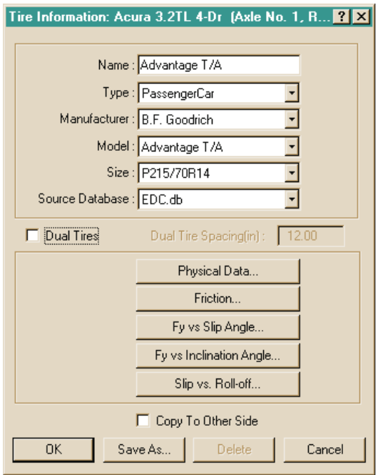
*Figure 11-39: The Tire Information dialog is used for selecting and editing tires, as well as for maintaining the Tire Database.*

The Tire Information dialog includes a user-extendible database that allows
the user to create and edit tires according to the following database keys:

- Tire Type
- Tire Manufacturer
- Tire Model
- Tire Size
- Source Database

To display and possibly change the current tire at a selected wheel,
perform the following steps:

1. In the Vehicle Viewer, click on the desired wheel. The Unsprung Mass
   options for the selected wheel are displayed.
2. Choose *Tire* from the Unsprung Mass option list. The Tire Information
   dialog for the selected wheel is displayed, showing the current tire's
   Name, Type, Manufacturer, Model and Size Designation.
3. If desired, change the tire's Name, Type, Manufacturer, Model and/or
   Size Designation by entering a new name or clicking on the appropriate
   option list and choosing a new option.

   > **NOTE:** The Name is simply a user-editable field available for
   > describing the tire. For example, you may choose a tire from the
   > database and greatly reduce its cornering and camber stiffness to
   > simulate a flat tire. In that case, you might enter the name as "Flat
   > Generic Tire" to indicate its properties have been changed.

4. Press *OK* to accept the changes.

For the selected tire, the Tire Information dialog also allows the user to
edit the following specific tire properties:

- Physical Properties
- Frictional Properties
- Cornering Stiffness Table (Fy vs Slip Angle)
- Camber Stiffness Table (Fy vs Inclination Angle)
- Slip vs Rolloff Tables

Each of these is described in the following sections.

> **NOTE:** For information about adding new tires to the Tire database,
> refer to Chapter 2 (see Creating Databases) and Appendix VIII (User
> Databases).

> **NOTE:** Contact EDC to obtain an interesting video that shows how these
> tire properties are determined from tests on Calspan's Flatbed Tire
> Testing machine. Ask for EDC Library Ref. No. 1077.

### Tire Physical Data

The Tire Physical parameters for the selected wheel position are displayed
and edited using the Tire Physical Data dialog. See also the code-verified
reference page,
[Tire Physical Data dialog](../../05-tires-wheels/TirePhyDataDlg.md).

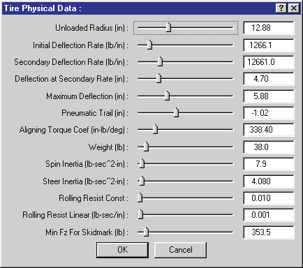
*Figure 11-40: The Tire Physical Data dialog is used for editing the tire's physical parameters.*

To display or edit the current vehicle's physical tire properties at a
selected wheel, perform the following steps:

1. In the Vehicle Viewer, click on the desired wheel. The Unsprung Mass
   options for the selected wheel are displayed.
2. Choose *Tire* from the Unsprung Mass option list. The Tire Information
   dialog for the selected wheel is displayed.
3. If desired, change the tire by selecting a different Tire Type,
   Manufacturer, Model and/or Size.
4. Choose *Physical Data*. The Tire Physical Data dialog for the selected
   tire is displayed.
5. View and/or edit the desired properties.
6. Press *OK* to accept the changes. The Tire Information dialog is still
   displayed.
7. If desired, click *Copy To Other Side* to make the changes apply to both
   sides.
8. Press *OK* to accept the tire physical changes to the selected wheel
   position.

The Tire Physical Data parameters are described below.

- **Unloaded Radius** — Undeflected tire radius (no-load condition).
- **Maximum Width** — *(updated: added in Version 7 tire data.)* Maximum
  section width of the tire. This value is display-only; it is computed
  from the tire size designation string.
- **Tread Width** — *(updated: added in Version 7 tire data.)* Width of the
  tire tread contact patch.
- **Tread Depth** — *(updated: added in Version 7 tire data.)* Depth of the
  tire tread.
- **Nominal Pressure** — *(updated: added in Version 7 tire data.)* Nominal
  (rated) inflation pressure of the tire.
- **Initial Deflection Rate** — The initial tire spring rate (vertical tire
  load per unit of linear tire deflection). See Figure 11-41.
- **Secondary Deflection Rate** — The spring rate under conditions of
  excessive tire vertical load. See Figure 11-41.
- **Deflection At Secondary Rate** — Tire deflection at which the secondary
  deflection rate begins. See Figure 11-41.
- **Maximum Deflection** — Tire maximum deflection. This value is normally
  used to terminate execution, indicating the probability of a damaged or
  broken wheel rim. See Figure 11-41.
- **Pneumatic Trail** — Longitudinal distance from the center of the tire
  contact patch to the center of pressure. Pneumatic trail increases the
  self-aligning tendency of a steerable wheel (negative if the center of
  pressure is behind the center of contact).
- **Aligning Torque Stiffness** — Self-aligning torque due to mechanical
  and pneumatic trail.
- **Weight** — Total weight of the wheel assembly (tire plus rim). For an
  independent suspension, this value reflects the total unsprung mass. For
  a solid axle suspension system, the axle weight is added to the wheel
  weight to determine unsprung mass.

  > **NOTE:** The entered value is divided by the current gravitational
  > constant and stored as mass. That way, if you take the vehicle to the
  > moon, it will behave correctly!

- **Spin Inertia** — Tire rotational inertia about its spin axis.
- **Steer Inertia** — Tire rotational inertia about its steering axis.
- **Rolling Resistance Constant** — Tire rolling resistance force
  coefficient.
- **Rolling Resistance Linear Coefficient** — Tire rolling resistance
  linear, velocity-dependent force coefficient.
- **Minimum Fz For Skid** — Minimum vertical tire load, Fz, required in
  order to leave a tire mark on the road surface. If the current vertical
  tire load is less than this value, no tire mark is displayed.

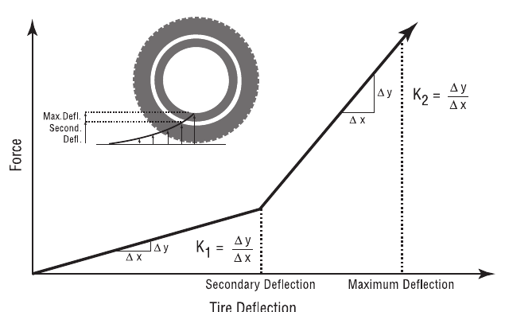
*Figure 11-41: Tire Physical Parameters.*

**Table 11-20: Tire Physical Data Parameters**

| Parameter | Unit Name | Description |
| --- | --- | --- |
| Unloaded Radius | UtTirDispLength | Tire radius in unloaded condition |
| Maximum Width | UtTirDispLength | Maximum section width (computed from size designation) *(updated: Version 7)* |
| Tread Width | UtTirDispLength | Width of the tread contact patch *(updated: Version 7)* |
| Tread Depth | UtTirDispLength | Depth of the tire tread *(updated: Version 7)* |
| Nominal Pressure | UtTirPress | Nominal inflation pressure *(updated: Version 7)* |
| Initial Deflection Rate | UtTirRateLinear | Deflection rate from zero deflection to secondary deflection |
| Secondary Deflection Rate | UtTirRateLinear | Deflection rate after preliminary deflection |
| Deflection At Secondary Rate | UtTirDispLength | Deflection at start of secondary deflection rate |
| Maximum Deflection | UtTirDispLength | Maximum allowable tire deflection |
| Pneumatic Trail | UtTirDispLength | Distance from center of the contact patch to the center of pressure |
| Aligning Torque Stiffness | UtTirAlignTorque | Steering torque produced by tire slip angle |
| Weight | UtTirForce | Total weight of wheel (tire + rim) |
| Spin Inertia | UtTirInertia | Rotational inertia about spin axis |
| Steering Inertia | UtTirInertia | Rotational inertia about steering axis |
| Rolling Constant | UtNone | Ratio of rolling resistance force to total vertical force on tire |
| Rolling Linear Coef | UtTireVelDependence | Velocity-dependent tire rolling resistance force coefficient |
| Min Fz for Skidmark | UtTirForce | Minimum vertical tire force required for a tire to leave a skidmark |

### Tire Friction Data

The tire frictional properties for the selected wheel position are
displayed and edited using the Tire Friction Data dialog. See also the
code-verified reference page,
[Tire Friction Data dialog](../../05-tires-wheels/TireFrictDataDlg.md).

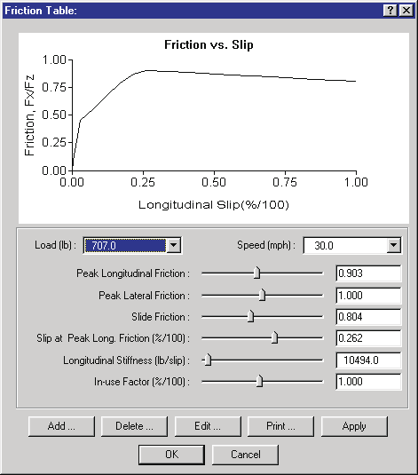
*Figure 11-42: The Tire Friction Data dialog is used for editing the tire's frictional properties.*

To display or edit the current vehicle's tire frictional properties at a
selected wheel, perform the following steps:

1. In the Vehicle Viewer, click on the desired wheel. The Unsprung Mass
   options for the selected wheel are displayed.
2. Choose *Tire* from the Unsprung Mass option list. The Tire Information
   dialog for the selected wheel is displayed.
3. If desired, change the tire by selecting a different Tire Type,
   Manufacturer, Model and Size.
4. Click on *Friction Data*. The Tire Friction Data dialog for the selected
   tire is displayed.
5. Click on the *Load* combo box to view and/or edit the list of vertical
   loads (up to 3 loads may be supplied).
6. Click on the *Speed* combo box to view and/or edit the list of test
   speeds (up to 3 speeds may be supplied).
7. At the selected load and speed, view and/or edit the frictional
   properties and longitudinal stiffness of the tire.
8. Select an *In-use Factor* for the tire. The In-use Factor acts as a
   modifier that multiplies the current dependent tire data.

   > **NOTE:** For example, let's say you believe a given tire's frictional
   > properties are only 90 percent of the values displayed in the dialog.
   > You could calculate 90 percent of the peak and slide friction and
   > longitudinal stiffness values and edit the current data accordingly,
   > or you could simply choose an in-use factor of 0.90.

9. Press *Apply* to update the graph of Fx/Fz vs Longitudinal Slip.
10. Press *Print* to print the graph on the system printer. Press *OK* to
    accept the changes. The Tire Information dialog is still displayed.
11. If desired, click *Copy To Other Side* to make the changes apply to
    both sides.
12. Press *OK* to accept the tire friction data changes to the selected
    wheel position.

The Tire Friction Data parameters are described below.

- **Load** — Vertical tire load at which the frictional values were
  obtained.
- **Speed** — Road speed at which the frictional values were obtained.
- **Peak Longitudinal Friction** — Maximum value of Fx/Fz achieved during
  the test at the given load and speed.
- **Peak Lateral Friction** — Maximum value of Fy/Fz achieved during the
  test at the given load and speed.
- **Slide Friction** — Value of Fx/Fz at 100% longitudinal slip achieved
  during the test at the given load and speed.
- **Slip at Peak Friction** — Longitudinal slip at which the peak
  longitudinal friction was achieved at the given load and speed.
- **Longitudinal Stiffness** — Slope of the Friction vs Slip curve (see
  Figure 11-42) at the graph's origin.

  > **NOTE:** The graph uses the longitudinal stiffness to display the
  > curve up to 0.5 times the Peak Longitudinal Friction.

- **In-use Factor** — Global multiplier for dependent values (Peak and
  Slide Friction, Longitudinal Stiffness).

**Table 11-21: Tire Friction Parameters**

| Parameter | Unit Name | Description |
| --- | --- | --- |
| Load | UtTirForce | Vertical tire load, Fz, during test |
| Speed | UtTirVelLinear | Speed during test |
| Peak Longitudinal Friction | UtNone | Maximum value of Fx/Fz achieved at given load and speed |
| Peak Lateral Friction | UtNone | Maximum value of Fy/Fz achieved at given load and speed |
| Slide Friction | UtNone | Value of Fx/Fz achieved at 100% slip |
| Slip at Peak Long. Friction | UtTirPercent | Longitudinal slip at which Peak Longitudinal Friction was measured |
| Longitudinal Stiffness | UtTirLongStiff | Slope of Friction vs Slip graph at zero slip |
| In-use Factor | UtTirPercent | Multiplier for Peak and Slide Friction and Longitudinal Stiffness |

### Tire Fy vs Slip Angle Table

The Tire Fy vs Slip Angle Data (Cornering Stiffness) for the selected wheel
position are displayed and edited using the Tire Fy vs Slip Angle Data
dialog.

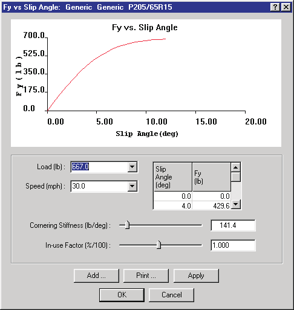
*Figure 11-43: The Tire Fy vs Slip Angle Data dialog is used for editing the selected tire's lateral force producing properties.*

To display or edit the current vehicle's cornering parameters at a selected
wheel, perform the following steps:

1. In the Vehicle Viewer, click on the desired wheel. The Unsprung Mass
   options for the selected wheel are displayed.
2. Choose *Tire* from the Unsprung Mass option list. The Tire Information
   dialog for the selected wheel is displayed.
3. If desired, change the tire by selecting a different Tire Type,
   Manufacturer, Model and Size.
4. Choose *Fy vs Slip Angle Table*. The Fy vs Slip Angle Table dialog will
   be displayed.
5. Click on the *Load* combo box to view and/or edit the list of vertical
   loads (up to 3 loads may be supplied).
6. Click on the *Speed* combo box to view and/or edit the list of test
   speeds (up to 3 speeds may be supplied).
7. At the selected load and speed, view and/or edit the Fy vs Slip Angle
   Table using the scrollable listbox.
8. At the selected load and speed, view and/or edit the cornering stiffness
   of the tire.

   > **NOTE:** The cornering stiffness defines the slope of the Fy vs Slip
   > Angle curve at zero slip angle.

9. Select an *In-use Factor* for the tire. The In-use Factor acts as a
   modifier that multiplies the current dependent tire data.

   > **NOTE:** For example, let's say you believe a given tire is partially
   > deflated, resulting in a 50 percent reduction in cornering stiffness
   > characteristics. You could calculate 50 percent of each Fy and
   > Cornering Stiffness value, then edit the Fy vs Slip Angle Table and
   > Cornering Stiffness. Alternatively, you could achieve the same result
   > by simply choosing an in-use factor of 0.50.

10. Press *Apply* to update the graph of Fy vs Slip Angle.
11. Press *Print* to print the graph on the system printer.
12. Press *OK* to accept the changes. The Tire Information dialog is still
    displayed.
13. If desired, click *Copy To Other Side* to make the changes apply to
    both sides.
14. Press *OK* to accept the tire cornering stiffness parameter changes to
    the selected wheel position.

The Tire Fy vs Slip Angle Data parameters are described below.

- **Load** — Vertical tire load at which the cornering stiffness values
  were obtained.
- **Speed** — Road speed at which the cornering stiffness values were
  obtained.
- **Slip Angle** — Angle (relative to the tire axis system; see Appendix
  III) from the tire's forward axis to its local velocity vector.
- **Fy** — Lateral tire force (relative to the tire axis system) produced
  at the current slip angle for the given load and speed.
- **Cornering Stiffness** — Slope of the Fy vs Slip Angle curve (see Figure
  11-43) at the graph's origin.

  > **NOTE:** The graph uses the cornering stiffness to display the curve
  > up to 0.5 times the first Slip Angle entry in the table.

- **In-use Factor** — Global multiplier for dependent values (Fy and
  Cornering Stiffness).

**Table 11-22: Tire Fy vs Slip Angle Parameters**

| Parameter | Unit Name | Description |
| --- | --- | --- |
| Load | UtTirForce | Vertical tire load, Fz, during test |
| Speed | UtTirVelLinear | Speed during test |
| Slip Angle | UtTirDispAngle | Angle (relative to the tire axis system; see Appendix III) from the tire's forward axis to its local velocity vector |
| Fy | UtTirForce | Lateral tire force (relative to the tire axis system) produced at the current slip angle for the given load and speed |
| Cornering Stiffness | UtTirCalfa | Slope of Fy vs Slip Angle graph at zero slip angle |
| In-use Factor | UtTirPercent | Multiplier for Fy and Cornering Stiffness |

### Tire Fy vs Inclination Angle Table

The Tire Fy vs Inclination Angle Data (sometimes referred to as Camber
Stiffness) for the selected wheel position are displayed and edited using
the Tire Fy vs Inclination Angle Data dialog. See also the code-verified
reference page,
[Fy vs Inclination Angle dialog](../../05-tires-wheels/FyVsInclAngDlg.md).

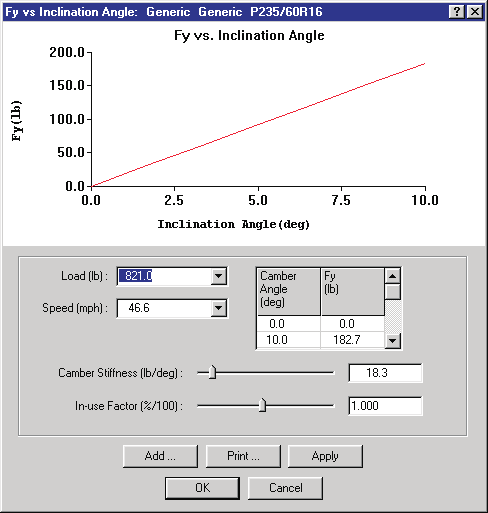
*Figure 11-44: The Tire Fy vs Camber Angle dialog is used for editing the tire's camber stiffness properties.*

> **NOTE:** As a rough estimate, camber stiffness is normally about 1/10 of
> the cornering stiffness.

To display or edit the current vehicle's Fy vs Camber Angle parameters at a
selected wheel, perform the following steps:

1. In the Vehicle Viewer, click on the desired wheel. The Unsprung Mass
   options for the selected wheel are displayed.
2. Choose *Tire* from the Unsprung Mass option list. The Tire Information
   dialog for the selected wheel is displayed.
3. If desired, change the tire by selecting a different Tire Type,
   Manufacturer, Model and Size.
4. Choose *Fy vs Camber Angle Table*. The Fy vs Camber Angle dialog will be
   displayed.
5. Click on the *Load* combo box to view and/or edit the list of vertical
   loads (up to 3 loads may be supplied).
6. Click on the *Speed* combo box to view and/or edit the list of test
   speeds (up to 3 speeds may be supplied).
7. At the selected load and speed, view and/or edit the Fy vs Camber Angle
   Table using the scrollable listbox.
8. At the selected load and speed, view and/or edit the camber stiffness of
   the tire.

   > **NOTE:** The camber stiffness defines the slope of the Fy vs
   > Inclination Angle curve at zero inclination angle.

9. Select an *In-use Factor* for the tire. The In-use Factor acts as a
   modifier that multiplies the current dependent tire data.

   > **NOTE:** For example, let's say you believe a given tire is partially
   > deflated, resulting in a 50 percent reduction in camber stiffness
   > characteristics. You could calculate 50 percent of each Fy and
   > Inclination Angle value, then edit the Fy vs Inclination Angle Table
   > and Camber Stiffness. Alternatively, you could achieve the same result
   > by simply choosing an in-use factor of 0.50.

10. Press *Apply* to update the graph of Fy vs Camber Angle.
11. Press *Print* to print the graph on the system printer.
12. Press *OK* to accept the changes. The Tire Information dialog is still
    displayed.
13. If desired, click *Copy To Other Side* to make the changes apply to
    both sides.
14. Press *OK* to accept the tire parameter changes for the selected wheel
    position.

The Tire Fy vs Inclination Angle Data parameters are described below.

- **Load** — Vertical tire load at which the camber stiffness values were
  obtained.
- **Speed** — Road speed at which the camber stiffness values were
  obtained.
- **Inclination Angle** — Angle (relative to the tire axis system; see
  Appendix III) from the vertical axis of the tire plane to a vector normal
  to the road plane.
- **Fy** — Lateral tire force (relative to the tire axis system) produced
  at the current camber angle for the given load and speed.
- **Camber Stiffness** — Slope of the Fy vs Inclination Angle curve (see
  Figure 11-44) at the graph's origin.

  > **NOTE:** The graph uses the camber stiffness to display the curve up
  > to 0.5 times the first Inclination Angle entry in the table.

- **In-use Factor** — Global multiplier for dependent values (Fy and Camber
  Stiffness).

**Table 11-23: Tire Fy vs Inclination Angle Parameters**

| Parameter | Unit Name | Description |
| --- | --- | --- |
| Load | UtTirForce | Vertical tire load, Fz, during test |
| Speed | UtTirVelLinear | Speed during test |
| Inclination Angle | UtTirDispAngle | Angle (relative to the tire axis system; see Appendix III) from the vertical axis of the tire plane to a vector normal to the road plane |
| Fy | UtTirForce | Lateral tire force (relative to the tire axis system) produced at the current inclination angle for the given load and speed |
| Camber Stiffness | UtTirCgamma | Slope of Fy vs Inclination Angle graph at zero inclination angle |
| In-use Factor | UtTirPercent | Multiplier for Fy and Camber Stiffness |

### Tire Slip vs Rolloff Tables

The Tire Longitudinal and Lateral Slip vs Rolloff Data Tables for the
selected wheel position are displayed and edited using the Tire Slip vs
Rolloff Tables dialog. See also the code-verified reference page,
[Slip vs Rolloff dialog](../../05-tires-wheels/SlipVsRollOffDlg.md).

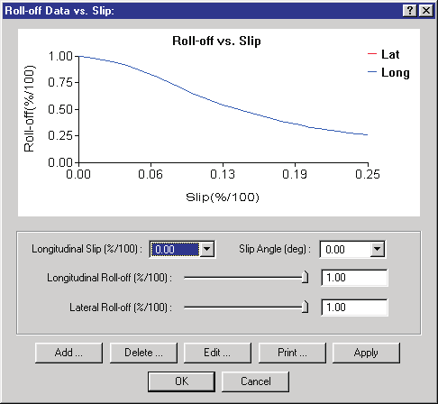
*Figure 11-45: The Tire Longitudinal and Lateral Slip vs Rolloff Tables dialog is used for editing the tire's slip vs rolloff properties.*

To display or edit the current vehicle's Slip vs Rolloff parameters at a
selected wheel, perform the following steps:

1. In the Vehicle Viewer, click on the desired wheel. The Unsprung Mass
   options for the selected wheel are displayed.
2. Choose *Tire* from the Unsprung Mass option list. The Tire Information
   dialog for the selected wheel is displayed.
3. If desired, change the tire by selecting a different Tire Type,
   Manufacturer, Model and Size.
4. Choose *Slip vs Rolloff Table*. The Slip vs Rolloff Table dialog will be
   displayed.
5. Click on the *Longitudinal Slip* combo box to view and/or edit the list
   of longitudinal slips (up to 6 slip values may be supplied).
6. Click on the *Slip Angle* combo box to view and/or edit the list of
   lateral slip angles (up to 6 slip angles may be supplied).
7. At the selected longitudinal and lateral slips, view and/or edit the
   Longitudinal and Lateral Rolloffs.
8. Press *Apply* to update the graphs of Rolloff vs Slip.
9. Press *Print* to print the graph on the system printer.
10. Press *OK* to accept the changes. The Tire Information dialog is still
    displayed.
11. If desired, click *Copy To Other Side* to make the changes apply to
    both sides.
12. Press *OK* to accept the tire slip vs rolloff parameter changes to the
    selected wheel position.

The Tire Slip vs Rolloff Data parameters are described below.

- **Longitudinal Slip** — Longitudinal tire slip at which the lateral
  roll-off values were obtained.
- **Slip Angle** — Lateral tire slip (slip angle) at which the longitudinal
  roll-off values were obtained.
- **Longitudinal Rolloff** — Reduction in lateral tire force (relative to
  the tire axis system; see Appendix III) at the specified longitudinal
  slip.
- **Lateral Rolloff** — Reduction in longitudinal tire force (relative to
  the tire axis system) at the specified lateral slip (slip angle).

**Table 11-24: Tire Slip vs Rolloff Parameters**

| Parameter | Unit Name | Description |
| --- | --- | --- |
| Longitudinal Slip | UtTirPercent | Longitudinal tire slip at which the lateral roll-off values were obtained |
| Slip Angle | UtTirDispAngle | Lateral tire slip (slip angle) at which the longitudinal roll-off values were obtained |
| Longitudinal Rolloff | UtTirPercent | Reduction in lateral tire force (relative to the tire axis system; see Appendix III) at the specified longitudinal slip |
| Lateral Rolloff | UtTirPercent | Reduction in longitudinal tire force (relative to the tire axis system) at the specified lateral slip (slip angle) |

## Wheel Location

The wheel location coordinates relative to the vehicle-fixed coordinate
system are displayed and edited using the Wheel Location dialog. See also
the code-verified reference page,
[Wheel Location dialog](../../03-suspension-steering/WheelLocDlg.md).

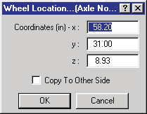
*Figure 11-46: The Wheel Location dialog allows the user to view and edit the wheel's x,y,z vehicle-fixed coordinates.*

To display and possibly change the wheel location coordinates, perform the
following steps:

1. In the Vehicle Viewer, click on the desired wheel. The Unsprung Mass
   options for the selected wheel are displayed.
2. Choose *Location* from the Unsprung Mass option list. The Wheel Location
   dialog for the selected wheel is displayed, showing the current wheel's
   x,y,z vehicle-fixed coordinates.
3. View and/or edit the wheel's x,y,z coordinates.
4. Click *Copy To Other Side* if you wish to apply the edits to the other
   side's wheel location, making the vehicle bilaterally symmetrical.

   > **NOTE:** The resulting x- and z-coordinates for the copied wheel will
   > be the same; the y-coordinates will have the same magnitude but the
   > opposite sign.

5. Press *OK* to accept the changes to the wheel location data.

> **NOTE:** If you wish to move the CG, you can edit each individual
> wheel's x,y,z coordinates. However, an alternative (and easier) way is to
> use the Move CG dialog (see Sprung Mass Parameters in
> [Part A](11a-sprung-mass.md)).

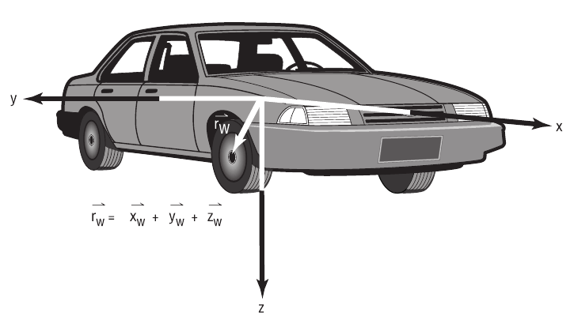
*Figure 11-47: Wheel locations relative to the vehicle-fixed coordinate system.*

The Wheel Location parameters are described below (see Figure 11-47).

- **Wheel x** — The longitudinal distance from the vehicle CG to the
  selected wheel.
- **Wheel y** — The lateral distance from the vehicle CG to the selected
  wheel.
- **Wheel z** — The vertical distance from the vehicle CG to the selected
  wheel.

**Table 11-25: Wheel x,y,z Location Parameters**

| Parameter | Unit Name | Description |
| --- | --- | --- |
| x, y, z coordinates | UtVehDispLength | Vehicle-fixed x,y,z coordinates of the selected wheel relative to the sprung mass CG |

## Wheel Image

The vehicle's wheels may be visualized as either a gray disk or using a
bitmap (texture). In the latter case, a photograph of the wheels may be
taken and used to provide a very realistic representation of the vehicle's
wheels.

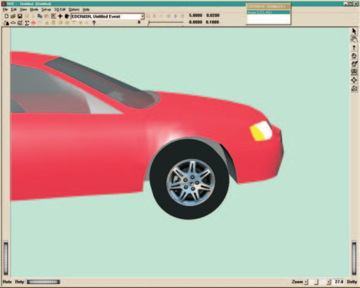
*Figure 11-48: Typical wheel image.*

When *Wheel Image* is selected from the Wheel option list, HVE displays a
cascade menu containing two more options: *New* and *Open*.

> **NOTE:** HVE includes many wheel image files for your use. If you wish
> to supply your own wheel image file, you must place it in the
> `...\Images\Vehicles\WheelTextures` subdirectory.

### New

The *New* option removes the existing wheel bitmap (if any) and replaces it
with the default gray disk.

> **NOTE:** Choose this option if you accidentally select the wrong wheel
> image file and need to remove it.

To remove the existing wheel image file, perform the following steps:

1. In the Vehicle Viewer, click on the desired wheel. The Wheel options for
   the selected wheel will be displayed.
2. Choose *Wheel Image* from the Wheel option list. The Wheel Image cascade
   menu will be displayed.
3. Choose *New*.

Any existing wheel image is removed from the selected wheel.

### Open

The *Open* option displays the Wheel Image File Selection dialog and allows
the user to assign a photographic image (texture map) of the wheel.

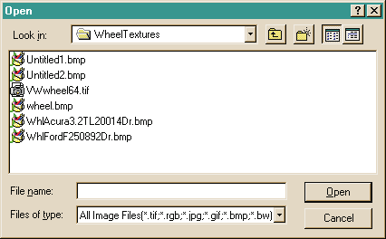
*Figure 11-49: Image File Selection dialog, used for selecting wheel texture images.*

To open a new wheel image and assign it to the current wheel, perform the
following steps:

1. In the Vehicle Viewer, click on the desired wheel. The Wheel options for
   the selected wheel will be displayed.
2. Choose *Wheel Image* from the Wheel option list. The Wheel Image cascade
   menu will be displayed.
3. Choose *Open*. The Wheel Image File Selection dialog will be displayed.
4. Click on the *Format* option list to select the file format of the
   desired wheel image file.
5. Select a wheel image file from the list.
6. Press *OK*.

The selected wheel image is displayed on the selected wheel. Perform these
steps for each wheel.

---
*Source: HVE User's Manual (Version 5, Seventh Edition, Jan 2006), Chapter
11, pages 11-62..11-86 — updated against source code (HVEINV-64, Physics)
2026-07-05.*

<!-- NAV -->

---

← Previous: [Chapter 11 — Vehicle Model Definition (Part C: Suspension)](11c-suspension.md)  |  [Index](README.md)  |  Next: [Chapter 11 — Vehicle Model Definition (Part E: Drivetrain, Steering and Brake System)](11e-drivetrain-steering-brake-system.md) →

<!-- /NAV -->
