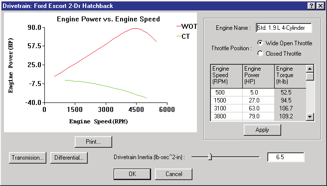
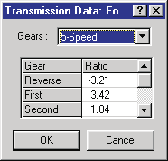
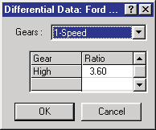
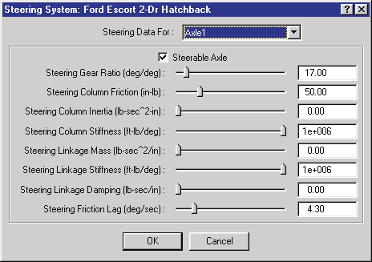
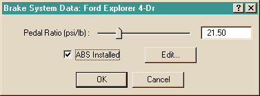

# Chapter 11 — Vehicle Model Definition (Part E: Drivetrain, Steering and Brake System)

This part covers the vehicle-level systems edited by clicking on the Engine
icon (Drivetrain), the Steering Wheel icon (Steering System) and the Brake
Pedal/Master Cylinder icon (Brake System) in the Vehicle Viewer.

## Drivetrain

The Drivetrain parameters for the current vehicle are displayed and edited
using the Drivetrain dialog. The drivetrain is composed of three components
that are edited individually:

- Engine
- Transmission
- Differential

Each of these components is described below. See also the code-verified
reference page,
[Drivetrain dialog](../../04-brakes-powertrain/DriveTraDlg.md).

*Figure 11-50: The Vehicle Drivetrain dialog, including the Engine, Transmission and Differential.*

### Engine

The HVE Vehicle engine is modeled by power vs engine speed table data for
both a wide-open-throttle (WOT) condition and a closed-throttle (CT)
condition.

To display or edit the current vehicle's engine parameters, perform the
following steps:

1. In the Vehicle Viewer, click on the engine. The Drivetrain dialog will
   be displayed. The power vs engine speed curve is displayed, showing two
   curves: one for the WOT condition and the other for the closed-throttle
   condition.
2. To edit the WOT engine parameters, click the *WOT Throttle Position*
   radio button. The WOT Power vs Speed Table is displayed. View and/or
   edit the engine speed and power entries (up to 15 are allowed).

   > **NOTE:** Torque is calculated, but not editable.

3. To edit the closed-throttle engine parameters, click the *Closed
   Throttle Position* radio button. The Closed Throttle Power vs Speed
   Table is displayed. View and/or edit the engine speed and power entries
   (up to 15 are allowed).
4. Press *Apply* to update the graphs of power vs engine speed.
5. Press *Print* to print the graph on the system printer.
6. Press *OK* to accept the changes to the current engine properties.

The Engine parameters are described below.

- **Engine Name** — User-editable description of drivetrain components.
- **Throttle Position** — Switch between WOT and Closed Throttle positions.
- **Engine Speed** — Rotational velocity of the crankshaft.
- **Engine Power** — Rate of work performed by the engine at the current
  engine speed.
- **Engine Torque** — Rotational torque produced at the current engine
  speed (calculated; not editable).
- **Drivetrain Inertia** — Rotational inertia of drivetrain components.
- **Engine Idle Speed (RPM)** — *(updated: new option, not documented in
  the legacy manual.)* Idle speed of the engine.
- **TCS/YSC...** — *(updated: new option, not documented in the legacy
  manual.)* Displays the Electronic Stability System dialog, used to
  indicate whether Traction Control (TCS) and/or Yaw Stability Control
  (YSC) are installed, and to edit their activation thresholds (velocity,
  yaw velocity error, wheel spin velocity error, wheel side-to-side
  difference, axle-to-axle difference, drive torque and brake pressure) and
  activation rates (drive torque change and brake pressure change).

**Table 11-26: Engine Parameters**

| Parameter | Unit Name | Description |
| --- | --- | --- |
| Engine Name | UtNone | Description of drivetrain components |
| Throttle Position | UtNone | Switch for Wide-Open-Throttle (WOT) and Closed Throttle engine tables |
| Engine Speed | UtEngVelAngular | Engine rotational velocity |
| Engine Power | UtEngPower | Engine power |
| Engine Torque | UtEngTorque | Engine torque (calculated; not editable) |
| Drivetrain Inertia | UtVehInertia | Rotational inertia of drivetrain components |

### Transmission

The HVE Vehicle transmission is modeled by a reverse gear, neutral and up
to 12 forward gears. The transmission is edited using the Transmission
dialog. See also the code-verified reference page,
[Transmission Data dialog](../../04-brakes-powertrain/TransDataDlg.md).

*Figure 11-51: The Transmission Data dialog allows the user to edit the transmission ratios.*

To display or edit the current vehicle's transmission parameters, perform
the following steps:

1. In the Vehicle Viewer, click on the Engine icon. The Drivetrain dialog
   is displayed.
2. Click on *Transmission*. The Transmission dialog is displayed, showing
   the current number of forward gears and the table of gear ratios.
3. If desired, click on the *Gears* option list to change the number of
   forward gears.
4. View and/or edit the ratios for each gear.

   > **NOTE:** A reverse gear is always supplied. A neutral gear, although
   > not displayed, always exists and has no user-editable ratio.

5. Press *OK* to accept the changes to the current transmission. The
   Drivetrain dialog is still displayed.
6. Press *OK* on the Drivetrain dialog to accept the changes to the
   drivetrain.

The Transmission parameters are described below.

- **Forward Speeds** — Number of forward speeds in the current transmission
  (up to 12).
- **Gear Ratios** — Ratio for each gear.
- **Transmission Type** — *(updated: new option, not documented in the
  legacy manual.)* Radio buttons selecting *Standard* (manual) or
  *Automatic*. Selecting Automatic enables the Shift Points group, which
  defines the automatic transmission shift schedule (throttle position vs
  engine speed, with upshift and downshift lines between the low- and
  high-speed shift points; the shift schedule graph is redrawn after
  pressing Apply).

**Table 11-27: Transmission Parameters**

| Parameter | Unit Name | Description |
| --- | --- | --- |
| Forward Speeds | UtNone | Number of forward speeds in the current transmission |
| Transmission Gear | UtNone | Ratio for each gear |

### Differential

The HVE Vehicle differential is modeled by up to 3 ratios. The differential
is edited using the Differential dialog. See also the code-verified
reference page,
[Differential Data dialog](../../04-brakes-powertrain/DiffDataDlg.md).

*Figure 11-52: The Differential Data dialog allows the user to edit the differential ratios.*

To display or edit the current vehicle's differential parameters, perform
the following steps:

1. In the Vehicle Viewer, click on the Engine icon. The Drivetrain dialog
   is displayed.
2. Click on *Differential*. The Differential dialog is displayed, showing
   the current number of gears and the table of gear ratios.
3. If desired, click on the *Gears* option list to change the number of
   gears.
4. View and/or edit the ratios for each gear.
5. Press *OK* to accept the changes to the current differential. The
   Drivetrain dialog is still displayed.
6. Press *OK* on the Drivetrain dialog to accept the changes to the
   drivetrain.

The Differential parameters are described below.

- **Forward Speeds** — Number of speeds in the current differential (up to
  3). *(The legacy manual said "transmission" here — a typo.)*
- **Gear Ratios** — Ratio for each gear.
- **Differential Type** — *(updated: the current dialog also shows
  Standard/Limited Slip/Locked radio buttons; these options are presently
  disabled — the HVE drivetrain model assumes an open (standard)
  differential, and Limited Slip and Locked are not yet implemented.)*

**Table 11-28: Differential Parameters**

| Parameter | Unit Name | Description |
| --- | --- | --- |
| Forward Speeds | UtNone | Number of forward speeds in the current differential |
| Differential Gear | UtNone | Ratio for each gear |

## Steering System Parameters

The Steering System parameters for the current vehicle are displayed and
edited using the Steering System dialog. See also the code-verified
reference page,
[Steering System dialog](../../03-suspension-steering/SteerSysDlg.md).

*Figure 11-53: The Steering System dialog allows the user to choose which axles are steerable and to assign gear ratio(s) and mechanical properties for the selected steering linkage system.*

To display or edit the current vehicle's steerable axles and associated
parameters, perform the following steps:

1. In the Vehicle Viewer, click on the Steering Wheel icon. The Steering
   System dialog is displayed.
2. Click the *Current Axle* option list to choose the current axle.

   > **NOTE:** The number of available axles is determined by the basic
   > vehicle parameters defined in the Vehicle Information dialog.

3. If desired, click the *Is Steerable* check box to enable editing of the
   steering system parameters for the selected axle.
4. View and/or edit the desired properties.
5. Press *OK* to accept the changes.

The Steering System parameters are described below.

- **Axle Selector** — Axle number (1, 2 or 3, limited by the number of
  axles defined in the Vehicle Information dialog).
- **Is Steerable Check Box** — Switch to allow or disallow steering at the
  selected axle.
- **Gear Ratio** — Ratio of the steering wheel angle to the wheel angle.
- **Steering Column Friction** — Friction torque measured at the steering
  wheel.
- **Steering Column Inertia** — Rotational inertia of steering wheel and
  column.
- **Column Stiffness** — Torsional stiffness of the steering system between
  the steering wheel and the wheel on the driver's side.

  > **NOTE:** The driver's side is defined in the Vehicle Information
  > dialog.

- **Linkage Mass** — Mass (weight/g) of all translating linkage components.
- **Linkage Stiffness** — Torsional stiffness of the steering system
  between the driver's side wheel and the opposite-side wheel.
- **Steering Linkage Damping** — Linear damping of the linkage system.
- **Steering Friction Lag** — Rotational velocity required to develop
  steering friction torque.

**Table 11-29: Steering System Parameters**

| Parameter | Unit Name | Description |
| --- | --- | --- |
| Axle Selector | n/a | Current axle number |
| Is Steerable | boolean (TRUE or FALSE) | Check box; if TRUE, the current axle is steerable |
| Gear Ratio | UtVehSteeringRatio | Ratio of the steering wheel angle to the wheel angle |
| Steering Column Friction | UtSteTorque | Frictional torque in steering column |
| Steering Column Inertia | UtVehInertia | Rotational inertia of steering wheel and column |
| Column Stiffness | UtVehSteeringStiffness | Torsional stiffness of the steering system between the steering wheel and the wheel on the driver's side |
| Linkage Mass | UtVehMass | Total mass of all translating linkage components |
| Linkage Stiffness | UtVehSteeringStiffness | Torsional stiffness of the steering system between the driver's side wheel and the opposite-side wheel |
| Steering Linkage Damping | UtVehDamp | Linear damping of linkage |
| Steering Friction Lag | UtVehVelAngular | Friction null band for full column friction |

## Brake System Parameters

The Brake System parameters for the current vehicle are displayed and
edited using the Brake System dialog (Brake System Pressure vs Pedal
Force). See also the code-verified reference page,
[Brake System Pressure vs Pedal Force dialog](../../04-brakes-powertrain/BrkSysVsPedFrcDlg.md).

*Figure 11-54: The Brake System dialog allows the user to assign the master cylinder pedal ratio (master cylinder pressure per unit of brake pedal force application) and ABS System status.*

To display or edit the current vehicle's brake master cylinder pressure
ratio, perform the following steps:

1. In the Vehicle Viewer, click on the Brake Pedal/Master Cylinder icon.
   The Brake System dialog is displayed.
2. View and/or edit the master cylinder pressure ratio.
3. If desired, click on the *ABS Installed* checkbox to activate the
   vehicle's antilock brake system.
4. If desired, press *Edit* to display and edit the vehicle's current ABS
   System parameters.
5. Press *OK* to accept the changes.

The Brake System parameters are described below.

- **Pedal Ratio** — Ratio of master cylinder pressure per unit of brake
  pedal force.

  > **NOTE:** While using the Event Editor, Driver Controls, the user may
  > assign a table of pedal force vs time. The entered pedal force is
  > multiplied by the master cylinder pedal ratio to determine the current
  > brake system pressure.

  > **NOTE:** For airbrake systems, the Pedal Ratio is normally set equal
  > to 1.0; thus, for an airbrake system, the pedal force is also equal to
  > the treadle valve outlet pressure.

- **Brake System Type** — *(updated: new option, not documented in the
  legacy manual.)* Radio buttons selecting the type of brake system
  installed on the vehicle: *Hydraulic* or *Air*.
- **Brake Type on Each Axle** — *(updated: new group, not documented in the
  legacy manual.)* Displays and edits the brake assembly type (*Disc* or
  *Drum*) installed on each axle. This setting is also updated
  automatically when a specific brake design is chosen in the Brake
  Assembly dialog (Disc and Air Disc designs set it to Disc; drum-based
  designs set it to Drum). A warning message is issued when the dialog
  opens if the right and left brake types on an axle are different, as this
  is probably a mistake.
- **ABS Installed Checkbox** — Assigns ABS System parameters. Also enables
  the *Edit* pushbutton that displays the ABS System Data dialog and allows
  editing of the ABS System variables *(updated: system-level ABS
  parameters — control source, ABS algorithm, control method, cycle rate,
  ABS pressure threshold, ABS velocity threshold, low friction threshold,
  and delay parameters: delay method, apply delay and release delay)*.

  > **NOTE:** Clicking this checkbox also enables the ABS Designer option
  > and the antilock options in the Wheel Brake Assembly dialog (see
  > [Part D](11d-brakes-tires-wheels.md), Figure 11-36).

**Table 11-30: Brake System Parameters**

| Parameter | Unit Name | Description |
| --- | --- | --- |
| Pedal Ratio | UtBraPedalRatio | Brake system pressure per unit of pedal force |
| ABS Installed | UtNone | Flag indicating an ABS system is installed on the vehicle |

## HVE Brake Designer

The HVE Brake Designer provides a detailed brake design capability
integrated directly within the HVE simulation environment. This feature
allows vehicle designers and safety researchers to develop a specific brake
design for each wheel and evaluate the resulting vehicle performance using
a predefined suite of maneuvers or compliance test simulations. The HVE
Brake Designer also includes a detailed tool for simulating ABS.

The Brake Designer is accessed from the Brake Assembly dialog (via the
Brake Type option list and Edit Brake pushbutton — see
[Part D](11d-brakes-tires-wheels.md)) and from the ABS Designer pushbutton
(per-wheel ABS data) and the Brake System dialog's ABS Edit pushbutton
(system-level ABS data). The individual Brake Designer dialogs are
documented in the code-verified reference pages in
[Brakes and Powertrain](../../04-brakes-powertrain/README.md):
[Disc Brake](../../04-brakes-powertrain/DiskBreakDlg.md),
[Duo-Servo](../../04-brakes-powertrain/DueServoBrkDlg.md),
[Duplex](../../04-brakes-powertrain/DuplexBrkDlg.md),
[Single Piston](../../04-brakes-powertrain/BrkSingPistDlg.md),
[Dual Piston](../../04-brakes-powertrain/DualPistBrkDlg.md),
[Dual Wedge](../../04-brakes-powertrain/DualWedgeBrkDlg.md) and
[Brake Material Properties](../../04-brakes-powertrain/BrkMatPropDlg.md).
*(updated: the legacy manual described the Brake Designer in detail in its
Section Eleven; the current brake types additionally include Air Disc.)*

---
*Source: HVE User's Manual (Version 5, Seventh Edition, Jan 2006), Chapter
11, pages 11-87..11-98 — updated against source code (HVEINV-64, Physics)
2026-07-05.*

<!-- NAV -->

---

← Previous: [Chapter 11 — Vehicle Model Definition (Part D: Brakes, Tires and Wheels)](11d-brakes-tires-wheels.md)  |  [Index](README.md)

<!-- /NAV -->
