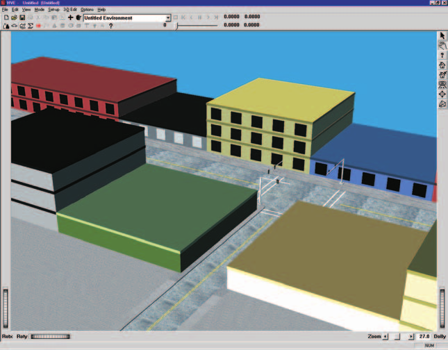
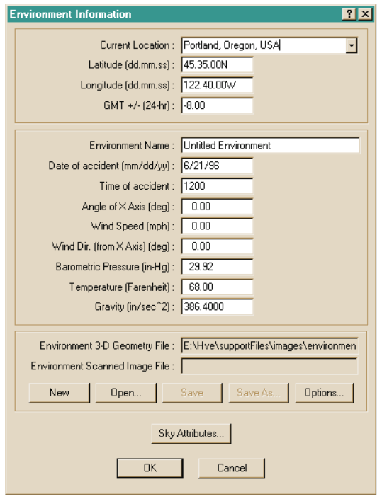
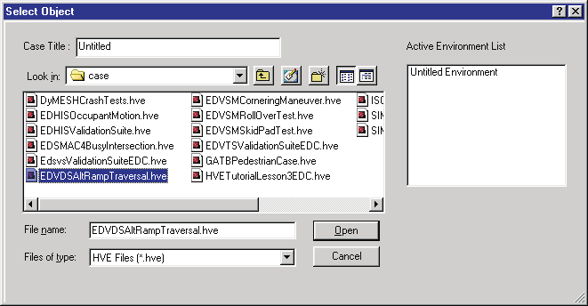
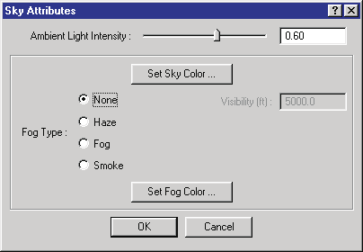
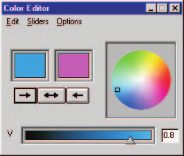
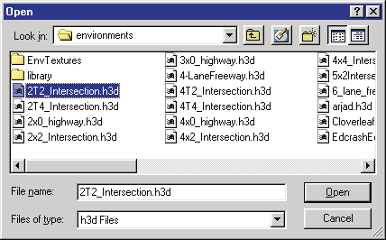
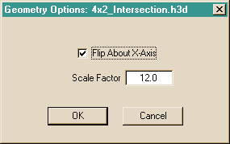
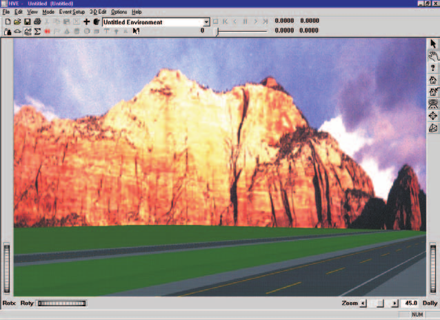
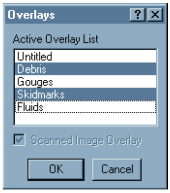

# Chapter 12 — Creating & Editing Environments

The HVE Environment Editor is used for creating and editing environments
for the current HVE case. These environments may also be used in other
cases. This chapter describes how to create and edit environments, beginning
with a description of the Environment Editor's components.

> **NOTE:** The environment is optional; none is required. If an environment
> is not supplied, the surface is assumed to be flat and cannot be
> visualized.

> **NOTE:** Refer to the next chapter, [Environment Model Definition](13-environment-model-definition.md),
> for a detailed description of each Environment Model parameter.

## Environment Editor Components

To use the Environment Editor, choose Environment Mode using the mode
selector. This puts HVE in Environment Mode and allows access to the
Environment Editor's components:

- **Environment Information Dialog** — The Environment Information dialog
  is used for adding an environment to the current case and for editing its
  parameters.
- **Environment Viewer** — The Environment Viewer is used for visualizing
  the current environment.

*Figure 12-1: Environment Editor dialog and Viewer, showing the Blind Intersection environment model used in the EDSMAC4 Tutorial.*

### Environment Editor Dialog

The Environment Editor dialog is the heart of the HVE Environment Editor.
The dialog includes the following functionality:

- **Add Environment** — Allows the user to add an environment to the
  current case and displays two options: New and Previous. Choose *New* to
  create a new environment; choose *Previous* to add an environment from a
  previous HVE case. These options are further described below.
- **Current Environment Label** — Displays the name of the current
  environment. Click on the *Object Info* button on the toolbar to display
  the Environment Information dialog for the current environment.

> **NOTE:** The Current Environment Label serves exactly the same purpose as
> the Active Humans List or Active Vehicles List.

- **3-D Editor** — Loads the current environment into the 3-D Editor for
  editing of its physical and visual properties. To launch the 3-D Editor,
  select *Launch 3D Editor* from the *3D-Edit* menu option.

### Environment Viewer

The Environment Viewer displays the current environment. It contains the
following components:

- **Current Environment** — Allows the user to visualize the current
  environment.

> **NOTE:** There are no pickable objects in the Environment Viewer.

- **Viewer Controls** — Allows the user to Rotate, Pan, Zoom and set the
  current Pick Mode (see Chapter 2 for details about using the viewer
  controls).

## Adding a New Environment

A new environment is added to the current case using the Environment Editor
dialog. To add a new environment, perform the following steps:

1. Click on *Add New Object*. The Environment Information dialog (see
   Figure 12-2) will be displayed. *(updated: this dialog is a tabbed
   property sheet. Three top-level fields — Name (Environment Name), Date
   and Time — sit above the tabs, and the tabs organize the remaining
   parameters:* Terrain, Sky, Physical, Location *and* Traffic Signals. *In
   HVE-3D all five tabs are shown; in HVE-2D only the Terrain tab is
   present. See the code-verified [Environment Information Dialog](../../08-environment/EnvtInfoDlg.md).)*
   The following user-definable parameters are available:

   - **Location Database** *(Location tab)* — A user-editable database of
     locations:
   - **City, State/Province and Country** — A user-entered location name.
     No formatting is required; however, the user is encouraged to maintain
     a consistent format to improve the usability of the database.
   - **Latitude and Longitude** — Used to define the global latitude and
     longitude, entered in degrees.minutes.seconds. N and S denote north
     and south latitudes, respectively; E and W denote east and west
     longitudes, respectively.
   - **GMT** — (Also called UTC offset.) The difference between the local
     standard time and the time at zero longitude. West longitudes are
     negative (e.g., New York City is -5 hours).

   > **NOTE:** The location is used, along with the time and date of the
   > crash and the orientation of the earth-fixed coordinate system (see
   > below), to determine the location of the sun in the environment. See
   > [Chapter 13, Environment Model Definition](13-environment-model-definition.md).

   
   *Figure 12-2: Environment Information dialog. See the code-verified field reference: [Environment Information Dialog](../../08-environment/EnvtInfoDlg.md).*

   - **Name** *(top-level field)* — A user-editable field allowing the user
     to assign a name to the current environment.
   - **Date** *(top-level field)* — The date of the crash or test being simulated. *(updated:
     the entry format follows the user's date-style preference — mm/dd/yyyy
     (US) or dd/mm/yyyy (European) — and the field label displays the
     expected format.)*
   - **Time** *(top-level field)* — The standard time of day (24-hour) for
     the crash or test being simulated.
   - **Angle of X-Axis** *(Physical tab)* — The angle of the user-defined earth-fixed
     coordinate system relative to true north. *(updated: valid range is
     -360 to +360 degrees.)*

   > **NOTE:** True North and Magnetic North are normally very nearly
   > equal; however, you should confirm the conditions in your area before
   > making that assumption.

   - **Wind Speed** *(Physical tab)* — The ambient wind velocity.
   - **Wind Direction** *(Physical tab)* — The ambient wind direction
     relative to the earth-fixed X-axis.
   - **Barometric Pressure** *(Physical tab)* — The ambient barometric pressure.
   - **Temperature** *(Physical tab)* — The ambient temperature.

   > **NOTE:** The wind speed and direction, barometric pressure and
   > temperature may be used for aerodynamic calculations.

   > **NOTE:** *(updated)* The Physical (atmospheric) fields — Wind Speed,
   > Wind Direction, Temperature and Barometric Pressure — are not present
   > in HVE-2D. The entire Physical tab is built only in RUN_MODE_3D
   > (HVE-3D), so in HVE-2D these fields are simply not shown; they are not
   > displayed read-only.

   - **Gravitational Constant** *(Physical tab)* — The local acceleration of gravity.

   > **NOTE:** If you're simulating a lunar excursion module, you had
   > better change this value!

2. Click on the Location combo box to choose the desired location, or enter
   a new City, State and Country, adding the Local Latitude, Longitude and
   Hours from GMT.

   > **NOTE:** You can usually find latitude and longitude information in a
   > pocket atlas (or from any online mapping service). Airline magazines
   > usually contain time zone information.

3. Enter a Name, Date, Time, Angle of X-Axis, Wind Speed and Direction,
   Barometric Pressure, Temperature and Gravitational Constant for the
   current environment.

   > **NOTE:** All these fields are optional.

4. If desired, select the file type and click on *Open* to select a
   previously created Environment 3-D Geometry file, aerial photograph
   and/or scanned photograph background (see 3-D Geometry, later in this
   chapter, for additional information).
5. If desired, use the Geometry File Options dialog (displayed when
   opening a geometry file) to scale and rotate the environment 3-D
   geometry file.
6. If desired, select the *Sky* tab to set sky color, fog and
   visibility for the current environment (see Sky Attributes, later in
   this chapter, for additional information).
7. Choose OK to add the current environment to the case.

> **NOTE:** You can click on the *Object Info* button on the toolbar to
> display the Environment Information dialog and attributes for the current
> environment.

## Adding a Previous Environment

The user may also include environments from other cases in the current
case. This option is useful when another case includes a study at the same
or similar location (intersection, highway, etc.).

*Figure 12-3: Adding Environments from previous cases.*

To choose an environment from another case, perform the following steps:

1. Click on *Mode, Environment, Add* and choose *Previous*. The Previous
   Environment Files Selection dialog will be displayed (see Figure 12-3).
   This dialog displays a list of case names for all cases in the `\case`
   subdirectory.
2. Click on a case name. The Environment Name for the selected case will be
   displayed.
3. Press OK to add the selected environment to the current case.

## Sky Attributes

Sky attributes determine the appearance of the background when a 3-D
geometry file is displayed. *(updated: the sky attributes are now set on
the* Sky *tab of the Environment Information property sheet — not through a
separate "Set Sky Attributes" button and dialog. The Sky tab is shown only
in 3-D run modes or with a 3-D camera viewer.)* The following attributes are
available:

*Figure 12-4: Environment Sky Attributes dialog.*

- **Ambient Intensity** — Allows the user to determine the ambient lighting
  level in the scene. This attribute may be used for visualizing various
  levels of daylight, dusk/dawn and darkness.
- **Sky Color** — Allows the user to edit the current sky color, using
  either a color wheel or by supplying directly the red, green and blue
  color values.
- **Fog Type** — A user-selectable type of visual occlusion. The options
  are:
  - None
  - Fog
  - Haze
  - Smoke

> **NOTE:** The difference in the above fog types is in the way visibility
> is reduced as a function of distance. *None* implies no reduction. *Fog*
> has a linear reduction, *Haze* has a quadratic reduction and *Smoke* has a
> cubic reduction. See [Chapter 13, Environment Model Definition](13-environment-model-definition.md),
> for additional information.

- **Maximum Visibility** — A user-editable field defining the distance
  (from the camera) at which objects are no longer visible.

> **NOTE:** Because the camera position represents the eye position of a
> person viewing the scene, the Maximum Visibility attribute is very useful
> for visibility studies!

*Figure 12-5: Sky Color tool for assigning the color of the sky.*

To set the sky attributes, perform the following steps:

1. Display the Environment Information dialog (if it is not currently
   displayed) by double-clicking on the Current Environment in the
   Environment Editor dialog.
2. Select the *Sky* tab (see Figure 12-4). *(updated: the Sky tab is
   available only when a 3-D camera viewer is in use; it is not present in
   HVE-2D.)*
3. Set the Ambient Light Intensity field using the slider or by typing in a
   number.
4. Click on *Sky Color* to display the Set Sky Color dialog (see Figure
   12-5). Set the sky color using the color wheel (move the hot spot in the
   color wheel) or by typing in the Red, Green and Blue color values. Press
   *Accept* to see the result in the sample window.
5. Choose the desired fog type (None, Fog, Haze or Smoke).
6. If a Fog Type was selected, enter the desired Maximum Visibility
   distance.
7. Press OK to accept the current sky attributes.

## Traffic Signals

*(updated)* The Environment Information property sheet includes a *Traffic
Signals* tab, used to configure the timing of traffic signals placed in the
environment. Like the Sky tab, it is shown only in 3-D run modes or with a
3-D camera viewer. Select a signal from the Traffic Signals list to edit its
timing; the Type and Layout fields describe the selected signal, and the
*Is Active*, *Repeating* and *Signal Timing* controls (Start Time, or
*Follow* another signal with an Overlap) define its cycle. See the
code-verified [Environment Information Dialog](../../08-environment/EnvtInfoDlg.md)
for the full field reference.

## 3-D Environment Geometry

The user may supply a 3-D geometry file used for visualizing the
environment. This geometry is also used by the current calculation model to
provide detailed information about the surface elevation, slope and friction
beneath each tire.

> **NOTE:** If no 3-D geometry file is supplied, the current simulation
> model will normally assume a flat terrain with uniform friction
> (associated with the vehicle's individual tires; refer to the Vehicle
> Editor for details regarding the tire's frictional properties).

*Figure 12-6: Environment File Selection dialog used for opening and saving 3-D Geometry and image files. See Table 12-1 for supported formats.*

3-D Geometry information for the current case is supplied using the *Files*
group of the Environment Information dialog. *(updated: the current dialog
uses a single Files group with a File Type selector — Terrain, Aerial Photo
or Sky Image, depending on licensed features — in place of the separate 3-D
Geometry File and Scanned Image File entries in earlier versions.)* The
following buttons are provided:

- **New** — Removes the current environment file of the selected type from
  the current case. *(updated: any terrain, aerial or backdrop file
  currently in use is cleared, and aerial image coordinates are reset to
  their defaults.)*
- **Open** — Allows the user to add a previously created 3-D geometry file
  (or image) to the current case.
- **Save / Save-As** — Allows the user to save the current 3-D geometry
  file in the HVE `.h3d` file format.

### New

To remove the current 3-D geometry or image environment file, perform the
following steps:

1. Display the Environment Information dialog (if it is not currently
   displayed) by clicking the *Object Info* button on the toolbar.
2. Select the desired File Type and click on *New*.
3. Press OK.

The current environment geometry and/or image will be gone.

### Open

To open an environment 3-D geometry file, perform the following steps:

1. Display the Environment Information dialog (if it is not currently
   displayed) by clicking the *Object Info* button on the toolbar.
2. Choose *Open* to display the File Selection dialog (see Figure 12-6).
3. Choose the format of the desired file (e.g., HVE Geometry or other
   supported format) using the file-type filter.

   > **NOTE:** The current format acts as a file filter for the files in
   > the `images/environments` subdirectory. Table 12-1 provides a list of
   > formats and their associated extensions. The number of supported
   > formats increases as new translators become available.

4. Select the desired 3-D geometry file and press OK. The selected filename
   will appear in the Environment Information dialog.
5. Press OK.

The selected 3-D environment will be displayed in the Environment Viewer.

**Table 12-1: HVE Supported File Formats** *(updated to current file
dialogs)*

| Format | Type | Extension |
|---|---|---|
| HVE Geometry (internal format) | 3-D Geometry | `.h3d` |
| Inventor | 3-D Geometry | `.iv` |
| VRML | 3-D Geometry | `.wrl` |
| OBJ | 3-D Geometry | `.obj` |
| DXF (requires DXF translator feature) | 2-D or 3-D Geometry | `.dxf` |
| DWG (requires DXF translator feature) | 2-D or 3-D Geometry | `.dwg` |
| Bitmap | 2-D Image | `.bmp` |
| TIFF | 2-D Image | `.tif` |
| GIF | 2-D Image | `.gif` |
| RGB | 2-D Image | `.rgb` |
| JPEG | 2-D Image | `.jpg` |

*(updated: JPEG support has been added; 3D Studio import listed in some
older editions is handled via the DXF/translator features. Image formats
are used for Aerial Photo and Sky Image file types.)*

### Save-As

To save the current environment as a new 3-D geometry file, perform the
following steps:

1. Display the Environment Information dialog (if it is not currently
   displayed) by clicking the *Object Info* button on the toolbar.
2. Choose *Save-As* to display the File Selection dialog.
3. Enter a name for the file.

   > **NOTE:** HVE automatically appends its own `.h3d` extension. Texture
   > pathnames are stored relative to the HVE `envtextures` directory.

4. Press OK to save the file.
5. Press OK to close the Environment Information dialog.

The selected 3-D environment will be displayed in the Environment Viewer.

### 3-D Geometry File Options

Most popular CAD packages use a conventional coordinate system in which the
Z-axis points up. HVE uses the coordinate system adopted by the Society of
Automotive Engineers (see Appendix III). In this coordinate system, the
Z-axis points down (in the direction of gravity). In addition, users may
have created their geometry files using meters, feet, or any other unit of
length. In HVE, program units for length are always inches (user units,
however, may be anything the user desires).

*Figure 12-7: Geometry File Options dialog, used for flipping over the environment (HVE requires the Z-axis to point down) and for scaling the environment (HVE requires internal units of inches).*

The Geometry File Options dialog allows the user to perform these simple
conversions. *(updated: this dialog is displayed automatically when opening
a terrain geometry file — the axis flip and scale entries apply chiefly to
DXF files, and the dialog also offers the option to use the opened file as
the default environment.)* Perform the following steps:

1. Open a 3-D Geometry file, as described on the previous pages. The
   Geometry Options dialog is displayed (see Figure 12-7).
2. Click *Flip About X-Axis* to make the Z-axis point down.
3. Enter the Scale Factor required to convert your drawing units to inches.
   For example, if your drawing is in feet, the conversion factor is 12.0;
   if your drawing is in meters, the conversion factor is 39.37.
4. Press OK. The Geometry File Options dialog is removed.
5. Press OK. The environment geometry is flipped and scaled, and the result
   is displayed in the Environment Viewer.

### Environment Image File Subdirectory

All environment image files, whether 3-D geometry or 2-D images, are found
in the `\images\environments` subdirectory.

> **NOTE:** If you use another tool to create a 2-D image or 3-D geometry
> file, you must copy the file to the `\images\environments` subdirectory in
> order for HVE to find it. See Appendix I for more information.

## Scanned Photographs

A scanned photograph (a 2-D image, or bitmap) may be used to visualize the
environment. Using a scanned photograph is a very quick and convenient way
to provide a realistic environment background or sky. *(updated: the current
Environment Information dialog distinguishes two image uses — an* Aerial
Photo, *displayed on a ground polygon at user-entered ground coordinates,
and a* Sky Image, *used as a fixed backdrop. The discussion below applies to
the Sky Image/backdrop use.)*

> **NOTE:** Scanned photographs are created using a scanner or a digital
> camera.

*Figure 12-8: Example of a 3-D Geometry file used as the foreground and a scanned image used as the background and sky.*

Scanned photographs differ in an important and fundamental way from 3-D
geometry files: they are a fixed, 2-D image. The image is not affected by
manipulating the viewer thumbwheels or changing the view using the Set
Camera dialog.

> **NOTE:** The key to using a scanned accident site image is to use the Set
> Camera dialog to assign the same camera position, picture center and
> camera focal length as were used to take the original picture. This
> process links the view of the photograph to the view of the simulation.

> **NOTE:** If you do not know the exact location from which the photograph
> was taken, you can use the viewer thumbwheels (along with a little trial
> and error!) to figure out the correct camera location.

In addition, a scanned photographic image provides no physical information
(elevation, slope, friction) to the current calculation model.

To add a scanned background image, perform the following steps:

1. Display the Environment Information dialog (if it is not currently
   displayed) by clicking the *Object Info* button on the toolbar.
2. Select the *Sky Image* file type and choose *Open* to display the File
   Selection dialog.
3. Choose the format of the desired file (e.g., BMP, TIFF, JPEG or other
   supported image format). The Environment File Selection dialog is
   displayed, showing all the environment images of the selected file
   format.

   > **NOTE:** HVE automatically distinguishes between 3-D geometry formats
   > and image formats. Table 12-1 provides a list of formats, file types
   > and their associated extensions.

4. Select the desired scanned image file from the list box and press OK.
   The selected filename will appear in the Environment Information dialog.
5. Press OK to display the current environment scanned image.

An example of a sky bitmap and 3-D geometry terrain is shown in Figure 12-8.

> **NOTE:** Both a 3-D Geometry file and a scanned photograph may be
> selected. Scanned images are always placed behind the 3-D geometry. Thus,
> you can provide a photograph for the visual effect and the 3-D geometry
> file for the physical information.

> **NOTE:** Scanned images make great skies. The RGB format includes several
> pre-defined skies for your use. See Figure 12-8 for an example of this
> effect.

> **NOTE:** If a scanned photograph is used, the view is fixed! This means
> that the user may attach the camera only to the environment, and not to
> any of the humans or vehicles.

> **NOTE:** If a scanned image is used for the road surface, you should
> confirm the scanned image was imported at the correct scale. The best way
> to do this is to identify some known landmarks in the viewer (you'll need
> to know the actual distance between these landmarks), then perform a
> simple simulation test to confirm that it takes the vehicle the correct
> time to travel between the landmarks. *(updated: the Aerial Photo file
> type addresses this directly — the Aerial Image dialog asks for the
> upper-left and lower-right ground coordinates of the image, which fixes
> the scale.)*

## Overlays

Each 3-D geometry object (road surface, trees, delineation, etc.) has an
overlay name (see the 3-D Editor documentation for additional information
about overlay names). The *Overlays* option in the *View* menu displays a
list containing every overlay name, as shown in Figure 12-9. By selecting or
deselecting an overlay name, the user can decide whether an object is
displayed in the viewer.

*Figure 12-9: The Display Overlays dialog allows the user to select and deselect overlays.*

> **NOTE:** If you deselect an overlay, its 3-D surface data (elevation,
> slope and friction) are still supplied to the current calculation model.
> One option is to include both a scanned photograph and a 3-D geometry file
> with all the overlays deselected. That way, the simulation will include
> the 3-D surface information, but the view will be from a photograph.

To display or remove selected overlays, perform the following steps:

1. Choose *Overlays* from the *View* menu. The Overlays dialog will be
   displayed, showing a list box with all the overlay names in the current
   scene. The currently selected overlays will be highlighted.
2. Select additional overlays you wish to be displayed, and deselect those
   overlays you wish to remove.
3. Click on the *Scanned Image Overlay* check box to display or remove any
   scanned environment image.
4. Press OK when the desired overlays and scanned image have been selected.

## Editing the Current Environment

After a new or previous environment has been created, it may be edited. To
edit the current environment, perform the following steps:

1. Click on the *Object Info* button on the toolbar. The Environment
   Information dialog will be displayed.
2. Edit any of the available fields to update the physical environment, as
   described earlier in this chapter.
3. Select the *Sky* tab to update the sky attributes, as described
   under Sky Attributes.
4. Click on *New*, *Open* or *Save-As* to update the environment 3-D
   Geometry, aerial photo or scanned image file, as described under 3-D
   Environment Geometry.
5. Press OK to update the current environment.

---

*See also (code-verified dialog references):*
[Environment Information Dialog](../../08-environment/EnvtInfoDlg.md) ·
[Environment Material Properties](../../08-environment/EnvrMatPropDlg.md) ·
[Surface Editor](../../08-environment/SurfEdDlg.md)

<!-- NAV -->

---

← Previous: [Section Five — Environment Editor](README.md)  |  [Index](README.md)  |  Next: [Chapter 13 — Environment Model Definition](13-environment-model-definition.md) →

<!-- /NAV -->
