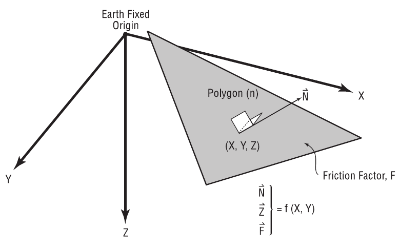
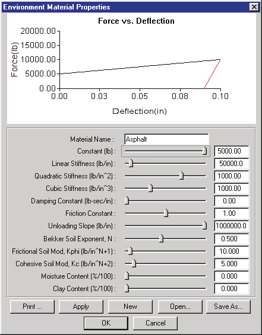
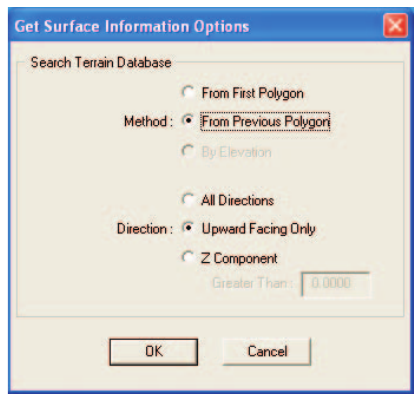
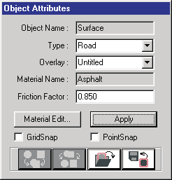
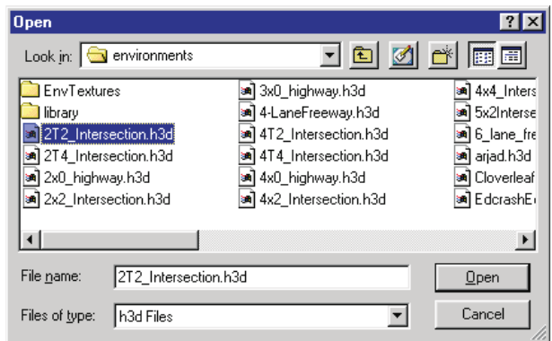
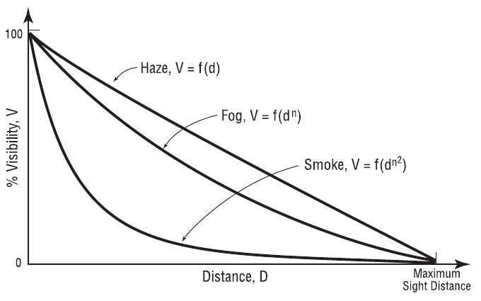
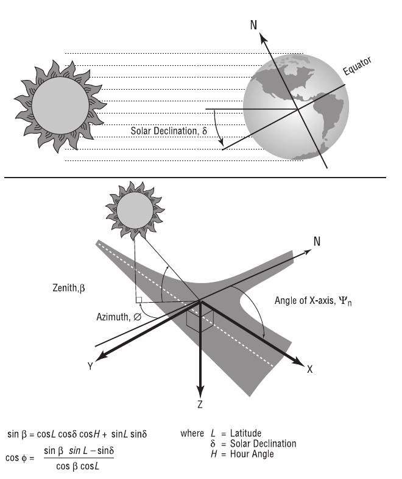
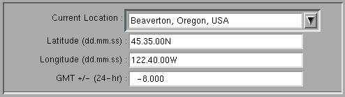

# Chapter 13 — Environment Model Definition

This chapter provides a detailed definition of the HVE Environment Model.
The Environment Model's parameters define both the physical and the visual
characteristics used by the current reconstruction or simulation model.

## Overview

Chapter 13 is a very important chapter. One of HVE's most powerful features
is the ability of humans and vehicles to interact with (drive on or slide
on) the earth's surface. Another important feature is HVE's ability to view
scenes obstructed by smoke or fog. These features are part of HVE's
environment model. The mechanisms by which these features are implemented
are described in this chapter.

The subject of the environment is divided into three basic topics:

- **Earth's Surface** — Gravitational Constant and 3-D Driving Surfaces
  used to calculate interaction forces.
- **Atmosphere** — Sky Color, Temperature, Pressure, Wind Velocity and
  Direction, Fog and Sight Distance used to help visualize the scene.
- **Sun Position** — Latitude, Longitude, GMT, Time/Date and Angle of the
  Earth-fixed X-axis used to determine the location of the sun and its
  lighting effects on the scene.

Each of these topics is addressed in this chapter.

## Surface Model

The Environment Surface Model defines how humans and vehicles interact with
the environment to produce forces that affect motion. The two physical
factors in the Environment Surface Model are:

- 3-D Physical Surfaces
- Gravitational Constant

### 3-D Physical Surface Characteristics

Perhaps the single most powerful feature of HVE is the fact that HVE
actually views the 3-D environment as a physical surface. Humans and
vehicles may interact with this physical surface during execution to
determine tire and other forces. The importance of this simple statement
cannot be stressed enough! It means that, if the environment has a road, any
simulated human or vehicle will roll or drive on the surface; if the
environment has a hill, a simulated vehicle will naturally drive up the
hill; if it has a ditch, the vehicle may roll into it; if it has a cliff,
the vehicle may drive off it.

> **NOTE:** This capability of HVE must be taken advantage of by the human
> or vehicle simulation model using the `GetSurfaceInfo` function. Refer to
> the individual calculation model's documentation to determine if this
> feature is included in the model.

#### How It Works

During execution, the reconstruction or simulation model may request the
following information for any earth-fixed X,Y coordinates of the HVE
environment (see Figure 13-1, Figure 13-2 and Table 13-1):

*Figure 13-1: 3-D Surface Model Definition.*

- **Elevation** — The Z-coordinate of the environment surface at X,Y.
- **Slope** — The surface normal vector, ux, uy,
  uz, of the environment at X,Y.
- **Material Name** — A user-editable name describing the terrain at X,Y.
- **Force Constant** — The force required to initiate deflection of the
  terrain at X,Y.
- **Linear Stiffness** — The first-order force-deflection coefficient of
  the terrain at X,Y.
- **Quadratic Stiffness** — The second-order force-deflection coefficient
  of the terrain at X,Y.
- **Cubic Stiffness** — The third-order force-deflection coefficient of the
  terrain at X,Y.
- **Damping Constant** — The velocity-dependent force contribution of the
  terrain at X,Y.
- **Friction Factor** — The friction multiplier for the environment surface
  at X,Y.

> **NOTE:** The Friction Factor is a multiplier, not a friction coefficient!
> See below for details.

- **Unloading Slope** — The first-order unloading force-deflection
  coefficient of the terrain at X,Y.
- **Bekker Soil Exponent, N** — The exponent of deformation used in the
  soil mechanics equations for the terrain at X,Y (used by the Soft Soil
  Tire-Terrain Model).
- **Frictional Soil Modulus, Kphi** — Frictional soil constant used in soil
  sinkage calculations for the terrain at X,Y (used by the Soft Soil
  Tire-Terrain Model).
- **Cohesive Soil Modulus, Kc** — Cohesive soil constant used in soil
  sinkage calculations for the terrain at X,Y (used by the Soft Soil
  Tire-Terrain Model).
- **Moisture Content** — The amount of moisture in the soil for the terrain
  at X,Y.
- **Macrotexture** — The surface macrotexture depth of the terrain at X,Y,
  used by tire-road friction (e.g., wet-road) calculations. *(updated: the
  current material model carries Macrotexture in place of the Clay Content
  parameter listed in earlier editions; see `envMaterial` in the current
  source and the [Environment Material Properties dialog](../../08-environment/EnvrMatPropDlg.md).)*

*Figure 13-2: Environment Terrain Material Properties dialog. For the current, code-verified field list — including sliders, valid ranges and defaults — see [Environment Material Properties](../../08-environment/EnvrMatPropDlg.md).*

> **NOTE:** The Bekker Soil Exponent, Frictional Soil Modulus and Cohesive
> Soil Modulus are used by the Soft Soil Tire-Terrain Model. See the
> Tire-Terrain Model discussion in Chapter 4.

A vehicle simulation's tire model obviously can benefit from this
information: given a tire's current X,Y (earth-fixed) coordinates, the
simulation's tire model can learn all the above attributes for the terrain
in the vicinity of each tire. A human simulation's contact ellipsoids can
also include these effects when calculating forces on each human body
segment for pedestrians struck on the roadway. The same is true of the
vehicle's 3-D geometry; these data are used for rollover simulation.

**Table 13-1: Environment Terrain Material Parameters**

| Parameter | Unit Name | Description |
|---|---|---|
| Z-coord | UtEnvDispLength | Elevation at X,Y |
| ux, uy, uz | UtNone | Unit normal vector defining the slope at X,Y |
| Material Name | UtNone | User-editable material name for terrain at X,Y |
| Constant | UtEnvForce | Force required to initiate deflection at X,Y |
| Linear Stiffness | UtEnvMatLinear | Linear material deformation coefficient at X,Y |
| Quadratic Stiffness | UtEnvMatQuad | Quadratic material deformation coefficient at X,Y |
| Cubic Stiffness | UtEnvMatCubic | Cubic material deformation coefficient at X,Y |
| Damping Constant | UtEnvMatDamp | Material velocity-dependent deformation constant at X,Y |
| Friction Constant | UtNone | Friction multiplier at X,Y |
| Unloading Slope | UtEnvMatForce | Linear unloading slope beginning at maximum deflection |
| Bekker Soil Exponent | UtNone | Soil deformation exponent for sinkage calculations |
| Frictional Soil Modulus | UtEnvKphi | Frictional soil constant for sinkage calculations |
| Cohesive Soil Modulus | UtEnvKc | Cohesive soil constant for sinkage calculations |
| Moisture Content | UtEnvPercent | Percentage of moisture in the soil |
| Macrotexture | UtEnvDispLength | Surface macrotexture depth at X,Y *(updated: replaces the Clay Content (UtEnvPercent) row in earlier editions)* |

#### How to Define Surface Characteristics

The surface model characteristics are defined directly by the 3-D surface
polygons (sometimes called 3-D geometry) used to create the environment.
The 3-D geometry database often includes tens of thousands of polygons.
During execution, the simulation must test the entire list of polygons to
determine which polygon is currently beneath each tire or contact surface,
to determine the elevation, slope and friction factor of the polygon.

To reduce the number of polygons tested by the calculation model (and thus
reduce processing time), HVE's 3-D Editor allows the user to define several
types of objects. The following object types are available:

- **Human** — Object type for all human polygons
- **Vehicle** — Object type for all vehicle polygons
- **Road** — Default object type for all environment polygons
- **Friction Zone** — User-assignable object type for environment polygons
- **Other** — User-assignable object type for environment polygons

*(updated: the current environment data structures also carry* Curb *and*
Water *polygon types — water polygons include water depth, depth method and
water friction multiplier attributes used by water-related tire models; see
`RoadPoly` in `Physics/Include/ENVIRON.H`.)*

Polygons of type Human are tested only for human vs. vehicle/road/friction
zone interaction. Polygons of type Vehicle are tested only for
human/road/friction zone interaction. Polygons of type Other are not tested
or used by the calculation model.

> **NOTE:** It makes no sense to test the red lens of a traffic signal, or
> the sides of a 10-story building, for interaction with a vehicle's tires!

> **NOTE:** If you know an environment object will not be in contact with a
> simulated human or vehicle, be sure to define its type as *Other* to
> reduce processing time.

#### How Surfaces Are Tested for Physical Contact

So far, this section seems pretty straightforward. Now, let's ask a few
questions:

- Suppose the vehicle is on an overpass. What prevents the calculation
  model from using the elevation of the surface beneath the overpass?
- Alternatively, suppose the vehicle is on an underpass. What prevents the
  calculation model from using the elevation of the road surface on the
  overpass? How about the underside of the overpass?
- Suppose the user has created an oil slick and placed it on the road
  surface. What prevents the calculation model from using the road, instead
  of the oil slick surface?

#### Get Surface Information

*Figure 13-3: Get Surface Information dialog.*

To answer these and similar questions, a strict definition is required. HVE
uses two different methods to determine which polygon gets used:

- **GetSurfaceInfo()** — Used by the Point Contact and Soft Soil
  Tire-Terrain Models (see the Event Set-up Wheels option; Chapter 4). This
  method searches in the direction of the earth-fixed gravity vector (i.e.,
  straight down) to determine the desired terrain polygon.
- **GetTerrainInfo()** — Used by the Radial Spring and Sidewall Impact
  Tire-Terrain Models (again, see the Event Set-up Wheels option; Chapter
  4). This method searches in a programmatically defined direction (i.e.,
  in the direction of a tire radial or sidewall spring) to determine the
  desired terrain polygon.

The Get Surface Information dialog has four search methods *(updated: a
fourth method, From Previous Polygon, Sorted, has been added since the
legacy edition and is now the default)*:

- Use First Polygon
- Use Previous Polygon
- Use Previous Polygon, Sorted *(updated: current default)*
- Use Elevation

The following rules are used by `GetSurfaceInfo()` or `GetTerrainInfo()`,
according to the selected option:

**From First Polygon**

- *The first surface found beneath the specified X,Y coordinates is used.*
  The search ends when a surface is found. This rule reduces calculation
  time. By returning the results for the first surface, it is not necessary
  to read every polygon in the database and then decide which one to use.
- *Friction Zones are used first.* This is an important rule. It means
  there is a hierarchy: if two polygons exist, one just above the other,
  the first one found in the database will be used. To ensure that the oil
  slick is used instead of the surface beneath it (see third bullet,
  above), assign its type as a *Friction Zone*. To ensure the top surface
  of the overpass is used instead of the underside of the overpass or the
  road below the underpass (see first and second bullets, above), assign
  its type as a *Friction Zone*.

**From Previous Polygon**

- *The surface used during the previous timestep is tried first.* If the
  wheel is still on that surface, that surface is used. This method has the
  potential for working much faster, because the chances are good that the
  tire is still on the same surface.
- *Search in both directions.* If the tire is not on the surface used
  during the previous timestep, try the next polygon in the database, then
  try the previous polygon (rather than starting over with the first
  polygon). This also helps to increase calculation speed because polygon
  databases are typically organized such that surfaces lying physically
  adjacent to each other are also stored next to each other in the
  database.

**From Previous Polygon, Sorted** *(updated)*

- Works like From Previous Polygon, but the polygon database is first
  sorted so that physically adjacent polygons are stored adjacently,
  making the previous-polygon search still more effective. This is the
  default search method in the current version (`CaGetSurfaceInfo`
  default `nMethod = PrevPolySorted`).

**By Elevation**

- *The surfaces are searched by elevation.* The highest surface still
  beneath the wheel center is used. This method is the most robust, but is
  very time-consuming because the entire polygon database must be searched
  at every timestep. *(updated: this option remains in the dialog for
  compatibility but is not supported by the current physics models; use one
  of the polygon-search methods instead.)*

The Get Surface Information dialog also allows the user to define the
allowable direction for surface normals on each terrain polygon (see Figure
13-1). The options are:

- **All Directions** — All terrain polygons are used by the tire model,
  regardless of the direction of the Z-component of the terrain surface
  normal.

> **NOTE:** Use this option if you wish to simulate a stunt driver
> performing a loop-de-loop!

- **Upward Facing Only** — Only terrain polygons with a positive
  Z-component are included by the tire model.
- **User-Defined** — The tire model uses a range for surface Z-components
  that is defined by the user.

If User-Defined is selected, the user may enter the allowable range for the
Z-component of the surface normal.

> **NOTE:** This method is often required for curb impact simulation in
> which the curb face is not exactly vertical due to rounding error. Try
> entering 0.001.

#### Assigning the Object Type Attribute

Object Type is an attribute assigned using the 3-D Editor (see Figure
13-4). The default type for all human 3-D geometry is Human; for all
vehicle 3-D geometry, Vehicle; for all environment 3-D geometry, Road.

*Figure 13-4: Assigning the Object Attributes using the 3-D Editor.*

By default, all environment surfaces will be used by the calculation model.
To ensure a particular surface is used by a calculation model, assign its
type as Friction Zone.

> **NOTE:** See the 3-D Editor documentation for more information about
> assigning object type attributes.

#### Importing 3-D Files from Other Modeling Programs

HVE can import a variety of 3-D formats used by other programs. The
imported geometry will be used by the current calculation model. Thus, the
surface elevation and normal for each polygon will be assigned according to
the rules defined earlier.

Because other modeling programs do not assign a friction factor or surface
type, default values (Friction Factor = 1.0, Type = Road) will be assigned
and used. The default Friction Factor and Type of objects in imported files
may be edited using HVE's 3-D Editor.

*Figure 13-5: Environment File Selection dialog used for opening and saving 3-D Geometry and image files. See Table 12-1 for supported formats.*

To load 3-D files from other modeling programs and edit the default surface
attributes, perform the following steps:

1. Display the Environment Information dialog (if it is not currently
   displayed) by clicking on the *Object Info* button on the toolbar.
2. Click *Open* to display the File Selection dialog (see Figure 13-5).
3. Choose the format of the desired file (e.g., DXF or other supported
   format) using the file-type filter.

   > **NOTE:** The current format is a file filter for the files in the
   > `images/environments` subdirectory. Table 12-1 provides a list of
   > formats and their associated extensions. Formats not yet available are
   > grayed out. The number of supported formats increases as new
   > translators become available.

4. Select the desired 3-D geometry file from the list box and press OK. The
   selected filename will appear in the Environment Information dialog.
5. Press OK. The selected 3-D environment will be displayed in the
   Environment Viewer.
6. Choose *3-D Editor* from the Environment Editor dialog. The current
   environment will be loaded in the HVE 3-D Editor.
7. Click on the desired object to select it. The object's attributes
   (Object Name, Type, Overlay and Friction Factor) will be displayed in
   the 3-D Editor's Object Attributes Tool.
8. Click on the Object Type option list (the current type will be Road) and
   select either *Friction Zone* (to increase its priority) or *Other* (to
   remove it from the list of physical surface objects).
9. Edit the object's friction factor.
10. Close the 3-D Editor and return to Event Mode to execute an event using
    the new object type and friction surface attributes.

> **NOTE:** It is crucial when creating a 3-D environment using another
> editor to consider the way the individual objects will be treated when
> imported into the HVE 3-D Editor. This is especially important when
> creating object groups and surfaces. See the 3-D Editor documentation for
> more information.

> **NOTE:** While creating a 3-D environment, it is quite possible to
> (accidentally) create two surfaces sharing the same space. Although the
> visual appearance will be unaffected, the `GetSurfaceInfo()` function may
> use the wrong surface. Be careful!

### Gravitational Constant

The gravitational constant defines the natural acceleration of objects
towards the center of the earth (in the direction of the earth-fixed
Z-axis). The value of the gravitational constant varies only slightly as a
function of earth-fixed coordinates. However, if the human or vehicle being
simulated may be taken to the moon or Mars, it is simple (and important) to
determine the effect of differences in the gravitational constant.

To edit the gravitational constant, perform the following steps:

1. Display the Environment Information dialog (if it is not currently
   displayed) by double-clicking on the Current Environment in the
   Environment Editor dialog.
2. Enter the desired gravitational constant (see Table 13-2 for selected
   gravitational constants).
3. Press OK.

The entered value will be assigned to the current environment.

> **NOTE:** Because all inertial objects are stored according to mass, the
> correct weight will be displayed in the Human or Vehicle Editor. During
> Event mode, the correct inertial properties of the object will be used for
> the current environment.

**Table 13-2: Gravitational Constants for Selected Environments**

| Location | Gravitational Constant (in/sec²) |
|---|---|
| Earth — Common Range | 386.08 – 386.4 |
| Earth — At Equator | 385.06 |
| Earth — London (51°32') | 386.29 |
| Earth — Poles (90°) | 387.09 |
| Moon | 64.4 |
| Mars | 146.8 |
| Jupiter | 1024.0 |

## Atmospheric Model

### Physical Characteristics

The physical characteristics of the atmosphere include the following
parameters:

- Temperature
- Barometric Pressure
- Wind Velocity and Direction

These parameters may be used to determine the aerodynamic drag force on an
object by calculating the current level of dynamic pressure.

#### Air Density

Air density, δ, is calculated using the current temperature and pressure
according to the following formula:

    δ = p / (R·T)

where

| Symbol | Meaning |
|---|---|
| δ | Air Density, lb/in³ |
| p | Atmospheric Pressure, lb/in² |
| R | Gas Constant, 639.6 in-lb/lb-°R |
| T | Absolute Temperature, °R (°F + 460) |

#### Dynamic Pressure and Force

Given the current air density and wind velocity, the force, Fair,
acting on a vehicle (or any object) due to aerodynamic pressure is as
follows:

    F_air = (c_a · δ · A · V_a²) / (2·g)

where

| Symbol | Meaning |
|---|---|
| Fair | Air Resistance Force, lb |
| ca | Air Drag Coefficient, dimensionless |
| δ | Air Density, lb/in³ |
| A | Projected Area, in² |
| Va | Wind Velocity relative to vehicle, in/sec |
| g | Gravitational Constant, in/sec² |

> **NOTE:** The aerodynamic drag coefficient and projected area are vehicle
> parameters. Refer to Chapter 11, Vehicle Model Definition, for further
> details.

### Visibility

The visual characteristics of the atmosphere include the following
parameters:

- Fog Type
- Maximum Sight Distance (graph of attenuation vs. distance)
- Sky and Fog Color

#### Fog Type

HVE provides three types of atmospheric effects that limit visibility:

- **Fog** — The percentage of vision attenuation increases as a linear
  function of distance from the camera (see Figure 13-6).
- **Haze** — The percentage of vision attenuation increases as a quadratic
  function of distance from the camera (see Figure 13-6).
- **Smoke** — The percentage of vision attenuation increases as a cubic
  function of distance from the camera (see Figure 13-6).

*(Note: the legacy edition's text transposed the quadratic/cubic
assignments between its Chapter 12 and Chapter 13 discussions; the ordering
above — Fog linear, Haze quadratic, Smoke cubic — matches the Chapter 12
description and the rendering behavior.)*

These atmospheric effects determine how sight distance is attenuated.
Visual attenuation is determined algorithmically.

*Figure 13-6: Visibility vs. Distance for Fog, Smoke and Haze.*

#### Maximum Sight Distance

Maximum Sight Distance is used in the fog calculations to determine the
distance at which vision is 100 percent attenuated. The Maximum Sight
Distance is entered using the Sky Attributes dialog.

#### Sky and Fog Color

Sky and Fog Color are used to create a visually accurate representation of
the environment. The assessment of color is qualitative, and is not subject
to objective calculations. The Sky and Fog Color are entered using the Sky
Attributes dialog.

## Sun Position

The location of the sun is used to assign directional lighting to the
environment. The sun is also displayed as a sphere at the correct
astronomical location.

The following parameters are used to assign the sun position:

- **Latitude** — The angular distance from the equator, expressed in
  degrees, minutes and seconds north (+ or N) or south (- or S) from the
  equator.
- **Longitude** — The angular distance from the prime meridian, expressed
  in degrees, minutes and seconds west (+ or W) or east (- or E) from the
  prime meridian.
- **Hours from GMT** — The time, expressed in hours, from the prime
  meridian.

> **NOTE:** GMT stands for Greenwich Mean Time — the difference, in integer
> hours, from the time at Greenwich, England, to the local time zone. GMT
> for nearly any global location may be found in most world atlases and
> travel references.

- **Date** — The date of the event (month, day, year).
- **Time** — The time of the event (24-hour clock; e.g., 10:15 PM is 2215).

> **NOTE:** Daylight saving time is not considered! If an event occurred
> during daylight saving time, you need to subtract one hour from the stated
> time.

### Sun Azimuth and Zenith

Given the data above, HVE calculates the location of the sun in the current
environment. The sun location is used for determining the location of the
solar light source, resulting in the correct shading of objects, as well as
for displaying the sun in the environment. Figure 13-7 illustrates the sun
position calculations.

*Figure 13-7: Sun Azimuth and Zenith calculations.*

> **NOTE:** By displaying the sun, you might stumble onto the notion that a
> driver was looking into the sun at the time of an accident.

### Environment Location Database

The HVE Environment Editor includes a user-extendible database of
environment locations, stored according to the Location Name, Latitude,
Longitude and GMT, as shown in Figure 13-8.

*Figure 13-8: The Location Database allows the user to store Latitude, Longitude and GMT for any location, normally entered as City/State/Country.*

**Table 13-3: Environment Model Parameters**

| Parameter | Unit Name | Description |
|---|---|---|
| Current Location | 30-character text string | City, State (or Province), Country (Location Database) |
| Latitude | UtEnvDispAngle | Latitude for the current location. The user-specified value is stored in the location database for future use. |
| Longitude | UtEnvDispAngle | Longitude for the current location. The user-specified value is stored in the location database for future use. |
| GMT | UtTime | The number of hours from Greenwich, England, to the specified location (conventionally +/- 24 hours; west of Greenwich is negative) |
| Environment Name | 30-character text string | User-entered name for the current environment |
| Date of Crash | Text string | Entered value is parsed according to month/day/year (or day/month/year, per the user's date-style preference) to determine the date relative to the solar calendar. |
| Time of Crash | Text string | Entered value is parsed according to a 24-hour clock (i.e., 2230 is 10:30 PM) to determine the time relative to midnight (standard time is used; daylight saving time is not considered). |
| Angle of X-Axis | UtEnvDispAngle | Angle of the user-specified earth-fixed X-axis relative to true north. The user must make any adjustments from magnetic north if a compass was used to identify direction. |
| Wind Speed | UtEnvVelLinear | Wind velocity |
| Wind Direction | UtEnvDispAngle | Wind direction relative to true north. The user must make any adjustments from magnetic north if a compass was used to identify direction. |
| Barometric Pressure | UtEnvPressure | Ambient barometric pressure |
| Temperature | UtEnvTemp | Ambient temperature |
| Gravitational Constant | UtEnvAccelLinear | Local gravitational constant |

---

*See also (code-verified dialog references):*
[Environment Information Dialog](../../08-environment/EnvtInfoDlg.md) ·
[Environment Material Properties](../../08-environment/EnvrMatPropDlg.md) ·
[Linear Friction Zone Properties](../../08-environment/LinFriPropDlg.md) ·
[Surface Editor](../../08-environment/SurfEdDlg.md)

<!-- NAV -->

---

← Previous: [Chapter 12 — Creating & Editing Environments](12-creating-editing-environments.md)  |  [Index](README.md)

<!-- /NAV -->
