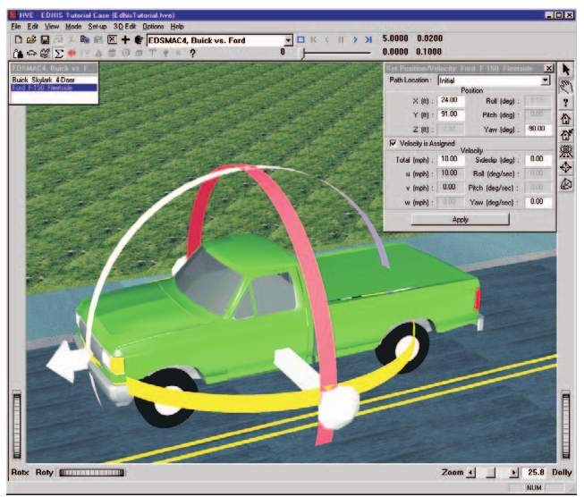
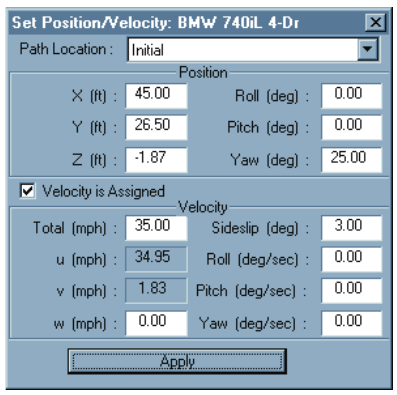
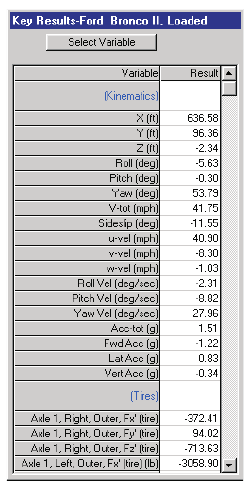
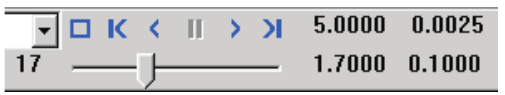
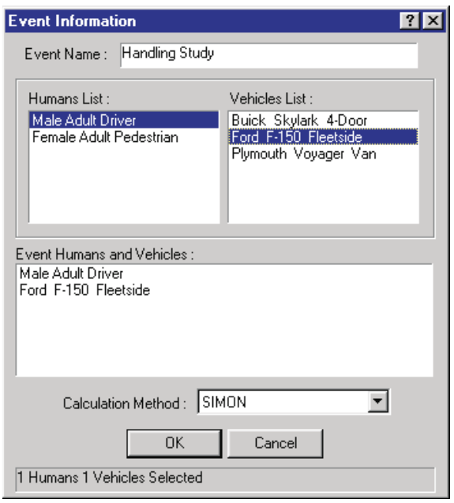
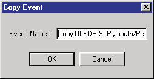

# Chapter 15 — Creating & Editing Events

The HVE Event Editor is used for creating and editing events for the
current HVE case. These events may also be viewed and combined with other
events in the Playback Editor, as described in Section Seven (Playback
Editor).

This chapter describes how to set up and execute events. This process is
central to the user's goals when using HVE.

> **NOTE:** Refer to the next chapter, [Event Model Definition](16-event-model-definition.md),
> for a detailed description of the Event Model parameters.

## Event Editor Components

To use the Event Editor, choose Event Mode using the mode selector. This
puts HVE into Event Mode and displays the Event Editor's components:

- **Event Information Dialog** — The Event Information dialog is used for
  adding events to the current case and to select the current event.
- **Event Viewer** — The Event Viewer displays the current environment and
  is used for visualizing the current event and editing human and vehicle
  positions.
- **Event Controller** — The Event Controller is part of the Event Editor
  dialog and includes a VCR-like panel of buttons allowing the user to
  start, stop, reset and play events forwards and backwards.

*Figure 15-1: Event Editor, Viewer, Position/Velocity dialog and Event Controller.*

### Event Editor Dialog

The Event Editor dialog is the heart of the HVE Event Editor. The dialog
includes the following functionality:

- **Add Event** — Allows the user to add an event to the current case.
- **Active Events List** — Displays a list of the names for all events in
  the current case. The name of the current event is displayed in the
  Current Event label. Click on the drop-down list to select a different
  event. Click on the *Object Info* button to display its Event Information
  dialog.
- **Copy Event** — Creates an exact copy of the current event.
- **Delete Event** — Removes the current event from the case.

> **NOTE:** Delete is not selectable if the current event is used in a
> Playback Window (see Section Seven: Playback Editor).

### Event Viewer

The Event Viewer (see Figure 15-1) displays the current event. The Event
Viewer contains the following components:

- **Current Event** — Allows the user to visualize the humans, vehicles and
  environment used in the current event.
- **Event Humans** — Displays each of the humans used in the current event.
- **Event Vehicles** — Displays each of the vehicles used in the current
  event.
- **Viewer Controls** — Allow the user to Rotate, Pan, Zoom and set the
  current Pick Mode (see the Viewers documentation for details about using
  the viewer controls).

### Position/Velocity Dialog

The Position/Velocity dialog (see Figure 15-2) displays the position and
orientation of the selected human or vehicle. It includes the following
components (for the current, code-verified field reference see the
[Position/Velocity dialog page](../../09-events-driver-controls/PosVelDlg.md)):

*Figure 15-2: Position/Velocity dialog, used for assigning positions and velocities to humans and vehicles in the current event.*

- **Path Location Listbox** — Allows the user to choose a path location at
  which to place the vehicle. The available path locations are Initial,
  Begin Perception, Begin Braking, Impact, Separation, Point on Curve, End
  of Rotation and Final/Rest.
- **X, Y, Z Position Fields** — Allow the user to enter or edit the
  selected object's coordinates.

> **NOTE:** If the object is a human occupant, the X, Y, Z fields are
> relative to the vehicle's CG. Otherwise, the X, Y, Z fields are relative
> to the earth-fixed origin.

> **NOTE:** If the current calculation model is 2-dimensional, the Z
> coordinate is assigned using AutoPosition, and is not user-editable.

- **Roll, Pitch, Yaw Orientation Fields** — Allow the user to enter or edit
  the selected object's orientation.

> **NOTE:** If the object is a human occupant, the Roll, Pitch, Yaw fields
> are relative to the vehicle's coordinate axis system. Otherwise, the
> fields are relative to the earth-fixed axis system.

> **NOTE:** The order of rotations is Yaw, Pitch, Roll. Rotation is not
> commutative in 3-space!

> **NOTE:** If the current calculation model is 2-dimensional, the roll and
> pitch orientations are assigned using AutoPosition, and are not
> user-editable.

- **Velocity Is Assigned Check Box** — Clicking on this check box allows
  the user to assign a velocity to the object at the selected position.
- **Total Velocity, Vertical Velocity and Sideslip Fields** — Allow the
  user to assign a linear velocity to the object at the selected position.

> **NOTE:** If the object is a human occupant, the velocity is relative to
> the vehicle-fixed coordinate system. For vehicles and human pedestrians,
> the velocity is relative to the earth-fixed coordinate system.

> **NOTE:** If the current calculation model is 2-dimensional, the vertical
> velocity field is not available.

> **NOTE:** The forward velocity (u) and lateral velocity (v) are
> auto-computed from the total velocity, Vt, and sideslip, β
> (u = Vt cos β and v = Vt sin β), but remain
> user-editable. Editing U, V or the Sideslip angle recomputes the other
> components accordingly.

- **Roll, Pitch, Yaw Velocity Fields** — Allow the user to enter or edit
  the selected object's angular velocities.

> **NOTE:** If the object is a human occupant, the Roll, Pitch, Yaw
> velocities are relative to the vehicle's coordinate axis system. For
> vehicles and human pedestrians, the velocities are relative to the
> earth-fixed axis system.

> **NOTE:** If the current calculation model is 2-dimensional, the roll and
> pitch velocities are ignored and are not user-editable.

### Key Results Windows

Key Results windows (see Figure 15-3) display the current value of one or
more user-specified variables during execution.

*Figure 15-3: Key Results Window, used for displaying important, real-time results during events. Simulation models display a Simulation Key Results window; reconstruction models have a similar window.*

> **NOTE:** The Kinematics variables are displayed by default.

For more information about Key Results windows, see Menu Reference, Options
Menu.

### Event Controller

The current event is executed using the Event Controller, shown in Figure
15-4. The Event Controller has buttons that function much like a VCR
controller:

- **Reset** — Reinitializes the current calculation model for re-execution.
- **Rewind to Start** — Returns the current simulation to t0.
- **Reverse** — Plays the current simulation in reverse.
- **Stop/Pause** — Pauses the current simulation.
- **Forward (Play)** — Plays the current calculation model.
- **Advance to End** — Advances the current simulation to the end of the
  run.

*Figure 15-4: Event Controller, used for starting and stopping event execution. The Event Controller can also be used for replaying previously executed events, both forward and backward.*

## Adding New Events

New events are added to the current case using the Event Editor dialog. To
add a new event, perform the following steps:

1. Click on *Add New Object*. The Event Information dialog (see Figure
   15-5) will be displayed, allowing the user to enter or select the
   following options (see also the code-verified
   [Event Information dialog page](../../09-events-driver-controls/EventInfo.md)):

   - **Event Name** — A user-editable field allowing the user to assign a
     name to the current event.
   - **Active Humans List** — A list of all the active humans created for
     the current HVE case. Click on one or more humans to be included in
     the current event.
   - **Active Vehicles List** — A list of all the active vehicles created
     for the current HVE case. Click on one or more vehicles to be included
     in the current event.
   - **Event Humans & Vehicles List** — A list of the humans and vehicles
     to be used in the current event.

   > **NOTE:** The order of selection may be important. For example, for a
   > tractor-trailer simulation, the first vehicle is assumed to be the tow
   > vehicle, the second vehicle is towed by the first vehicle, and so on.

   - **Calculation Model Option Button** — An option button displaying the
     current calculation model (e.g., EDSMAC4, EDVSM, SIMON). Press this
     button to display the list of calculation models available for
     selection.

   > **NOTE:** Calculation methods are licensed. If you choose a method for
   > which you have no license, HVE will issue a message and your selection
   > will be ignored.

   
   *Figure 15-5: Event Information dialog.*

2. Enter a name for the current event.
3. Click on the names of the desired human(s) and vehicle(s) in the Active
   Humans and Active Vehicles Lists, respectively.
4. Click on the Calculation Model options list and choose the desired
   calculation model.
5. Press OK.

### Event Verify

When OK is pressed in the Event Information dialog, HVE automatically
confirms the selected humans, vehicles and environment are compatible with
the selected event. This process is called Event Verification. HVE tests
for such things as:

- Are the selected object types compatible with the selected event? For
  example, you cannot load a human into a single vehicle simulator.
- Are the object's attributes compatible with the selected event? For
  example, you cannot load a tandem-axle vehicle into a simulator which
  does not accept tandem axles.
- Are the inter-vehicle connections compatible? For example, you cannot
  connect a tow vehicle with a fifth wheel to a trailer with a hitch (a
  kingpin is required).

The event cannot be set up and executed if the event verify returns an
error condition.

> **NOTE:** Technically, it is up to the developer of the calculation model
> to perform these tests and return an error condition so HVE can tell the
> user what is wrong.

If an error condition is displayed, the user must reselect from the
available humans, vehicles and calculation models, or press Cancel.

After compatibility is successfully verified, the calculation model
communicates back to HVE, telling HVE which Event Set-up options to make
available in the Set-up menu (e.g., Driver Controls, Collision Pulse; see
below), as well as which output types it produces (e.g., Messages,
Trajectory Simulation, etc.). For simulations, the calculation model also
tells HVE which simulation variables (e.g., Sprung Mass X, Y, Z; Tire Fx,
Fy, Fz; Suspension dz; Driver Throttle Position; Steer Angle; etc.) it
produces. Refer to the following chapter, Event Model Definition, for a
complete description of all HVE outputs.

## Event Set-up

After selecting the humans, vehicles and calculation method, the next step
is to set up the event. This process involves positioning the humans and
vehicles in the environment, providing velocities, and entering other
event-related parameters, such as damage profiles, payloads and collision
pulses.

To set up the event, perform the following steps:

1. Click on a human or vehicle in the Event Editor dialog's Selected
   Objects list box. The selected object will be highlighted, indicating it
   is the current human or vehicle.
2. Click on *Set-up* for the current human or vehicle. The following event
   set-up options are available:

   - Position/Velocity
   - Driver Controls (Throttle, Brakes, Steering, Gear Selection, Path
     Follower, Wheel Data)
   - Damage Profiles
   - Payload
   - Collision Pulse
   - Mesh
   - Wheels (Blow-out, Displacement, Brakes)
   - Accelerometers
   - Contacts
   - Restraints

   > **NOTE:** Normally, the first option you'll choose is
   > Position/Velocity, in order to assign positions and velocities to the
   > selected human or vehicle.

   > **NOTE:** Only those options meaningful for the selected human or
   > vehicle will be available in the menu.

   > **NOTE:** For studies involving human occupants, you must position the
   > vehicle first.

   > **NOTE:** Each of the event set-up options is described in detail in
   > the following chapter, [Event Model Definition](16-event-model-definition.md).

3. Enter or edit the data requested by the selected event set-up option,
   and press OK to accept the data.
4. Choose and edit additional event set-up options, as desired.
5. Repeat the above steps to set up each human and/or vehicle in the event.

## Event Execution

After the event is set up, the next step is to execute it. The current
event is executed using the Event Controller (see Figure 15-4). To execute
the current event, perform the following steps:

1. Press *Play* to begin execution of the event.

   > **NOTE:** If the current calculation model is a reconstruction, it
   > will finish almost instantly. For reconstruction programs, only the
   > Play and Reset buttons are used.

2. Press *Pause* to stop the event momentarily, perhaps to view the current
   tire forces or other important parameters in the Key Results windows.
3. Press *Play* to continue execution of the event.

   > **NOTE:** If you do not intervene, the event will continue to
   > completion.

After the event runs to completion, the buttons will reset, allowing the
user to replay the event, forwards and backwards, without performing the
calculations. To replay the event:

1. Press *Rewind* to return the humans and vehicles to their initial
   position.
2. Press *Play*, *Pause* and/or *Reverse*, as desired, to view the
   simulation.

> **NOTE:** If you press Reset, all your current results will be erased! If
> you wish to save the results for viewing during Playback mode, do NOT
> press Reset! Use the Pause/Stop pushbutton instead.

After viewing the reconstruction or simulation, the user often wishes to
make adjustments to the event and re-execute it. To make these adjustments:

1. Press *Reset*.

   > **NOTE:** If you don't press Reset, any event set-up changes will have
   > no effect!

2. Choose a human or vehicle, either by clicking on it in the Event Viewer
   or by selecting it from the Event Humans & Vehicles List in the Event
   Editor dialog.
3. Click on *Set-up* in the menu bar and choose the desired event set-up
   option (Position/Velocity, Driver Controls, etc.).
4. Make the desired changes.
5. Re-execute the event, as described above.

> **NOTE:** For more information about execution, refer to the
> documentation manual for the selected calculation model.

## Selecting and Editing the Current Event

After an event is created (i.e., its humans, vehicles and calculation model
have been selected and verified by the Event Information dialog), it is
added to the Active Events List. The last event added to the case becomes
the current event. The current event is displayed in the Event Viewer and
may be edited.

To select and edit any event in the Active Events List, perform the
following steps:

1. Click on the desired event name in the Active Events List. The selected
   event becomes the current event and will be displayed in the Event
   Viewer.
2. Optionally, click on the *Object Info* button on the toolbar to display
   its Event Information dialog (described earlier; see Figure 15-5). This
   allows the user to change the basic attributes of the current event
   (Name, Selected Humans and Vehicles, Calculation Model and Calculation
   Options). Press OK to update the current event.

   > **NOTE:** Updating the current event removes any previous results and
   > reinitializes the event.

3. If desired, choose a human or vehicle and edit its event set-up
   parameters.
4. Press *Play* to re-execute the event.

> **NOTE:** For more information about setting up and executing events,
> refer to the documentation manual for the selected calculation model.

## Copying an Event

After an event is created, set up and executed, a complete copy of the
event can be created. This is quite useful for multiple studies of the same
event with only a single parameter change (e.g., different steering
inputs).

To copy an event, perform the following steps:

1. Click on the desired event name in the Active Events List. The selected
   event becomes the current event and will be displayed in the Event
   Viewer.
2. Click on *Edit* in the main menu bar and choose *Copy*. The Copy Event
   dialog is displayed (see Figure 15-6) with the default event name for
   the new event (the default name is "Copy Of " + the selected event
   name).

   
   *Figure 15-6: Copy Event dialog.*

3. Edit the event name as desired.
4. Press OK.

A copy of the selected event is created. The new copy becomes the current
event and is displayed in the Event Viewer.

## Deleting an Event

An event may also be deleted. To delete the current event, perform the
following steps:

1. Choose *Edit, Delete*. A message box will ask you if you're sure you
   want to delete the current event.
2. Press OK. The current event will be deleted.

## Deleting a Vehicle Position

A vehicle position can be removed from the current event. To remove a
vehicle position, perform the following steps:

1. Select the vehicle position, either by clicking on the unwanted vehicle
   position or by clicking on any vehicle position and choosing the
   unwanted position from the Path Location listbox.
2. Choose *Edit, Delete*. A message box will ask you if you're sure you
   want to delete the vehicle position.
3. Press Yes. The selected vehicle position will be deleted.

---

*See also (code-verified dialog references):*
[Event Information](../../09-events-driver-controls/EventInfo.md) ·
[Event Setup menu](../../09-events-driver-controls/EventSetup.md) ·
[Position/Velocity](../../09-events-driver-controls/PosVelDlg.md) ·
[Driver Controls](../../09-events-driver-controls/DriverControls.md)

<!-- NAV -->

---

← Previous: [Section Six — Event Editor](README.md)  |  [Index](README.md)  |  Next: [Chapter 16 — Event Model Definition](16-event-model-definition.md) →

<!-- /NAV -->
