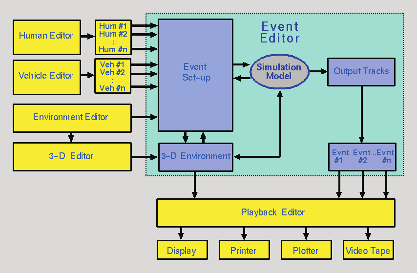
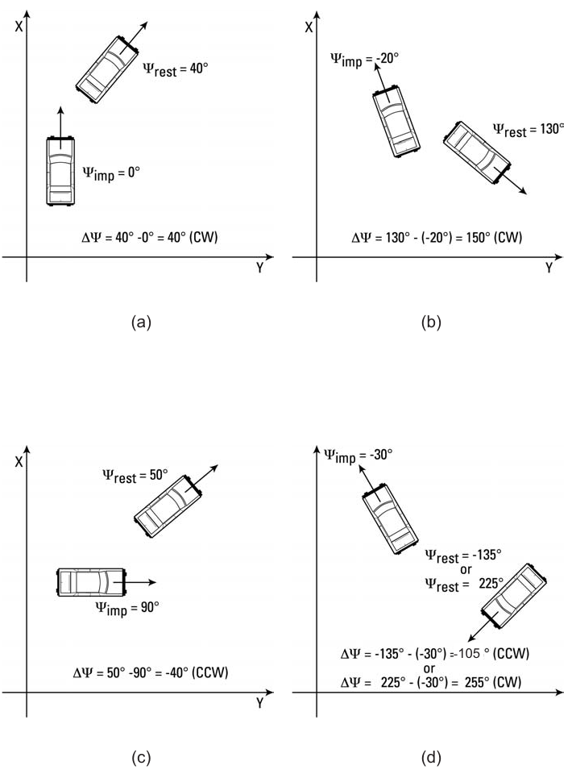
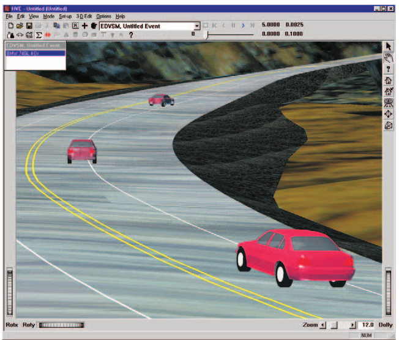
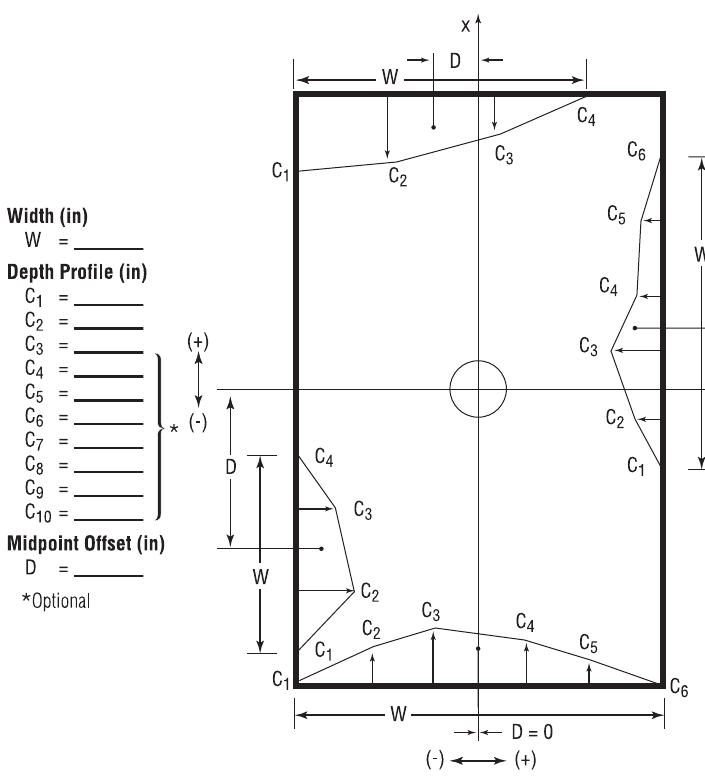
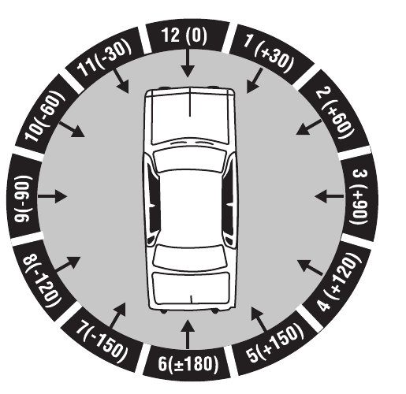
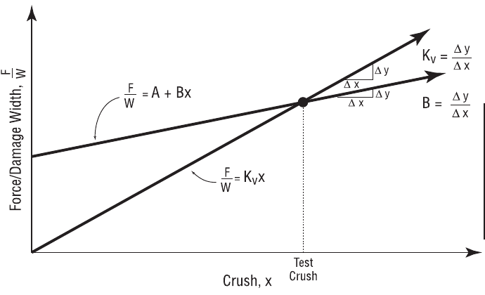

# Chapter 16 — Event Model Definition

The HVE Event Editor is a fully 3-dimensional environment for executing
human and vehicle dynamics models. Both reconstruction-type (i.e.,
backwards calculating) and simulation-type (i.e., forwards calculating or
predictive) models are accommodated. The HVE Event Editor inherently uses
3-D visualization to provide feedback to the user; that is, all the motion
calculated by the model is displayed in HVE's 3-D Event Viewer and may be
visualized from any perspective. Numeric results are displayed in viewers
called Key Results windows.

The HVE execution environment has an open architecture: users may choose to
execute commercially available reconstructions and simulations or develop
their own. Any HVE-compatible reconstruction or simulation model may be
executed. The details of writing HVE-compatible reconstruction and
simulation models are provided in the HVE Developer's Toolkit references.

## Overview

The HVE Event Editor is used for setting up and executing reconstructions
and simulations involving the selected humans, vehicles and environment.
The Event Model thus requires two basic definitions:

- Event set-up definitions for all inputs required by an HVE-compatible
  reconstruction or simulation model
- Event output track definitions for all outputs produced by the
  reconstruction or simulation model

This chapter provides these definitions, beginning with a general overview
of the HVE execution environment.

## General Overview

*Figure 16-1: HVE system environment, showing the Human, Vehicle, Environment, Event and Playback Editors.*

A block diagram for the HVE execution environment is shown in Figure 16-1.
The basic components of this environment are:

- **Human Editor** — Creates and manages all the humans used in the current
  case.
- **Vehicle Editor** — Creates and manages all the vehicles used in the
  current case.
- **Environment Editor** — Creates and manages the current environment.
- **Event Editor** — Creates and manages all the events in the current
  case.
- **Playback Editor** — Manages all the output from each event and allows
  the user to specify various forms of output.

A more detailed review of the Event Editor reveals it performs the
following functions:

- Loads the selected objects (humans and/or vehicles) into the current
  event
- Adds the requested event set-up parameters (position, velocity, vehicle
  damage, etc.)
- Executes the event
- Stores the program output

The event set-up definition provides the exact format for the parameters
passed to the calculation model as input. The output track definition
provides the exact format for the parameters produced by the calculation
model and stored by the event as output. The remainder of this chapter
provides the details of the event set-up and output track definitions.

## Event Set-up Parameters

Event set-up parameters are selected from the HVE Set-up menu (see Chapter
4). The following options are available:

- Position/Velocity
- Driver Controls (Throttle, Brakes, Steering, Gear Selection, HVE Driver
  path follower, Wheel Data and — where supported — Lights)
- Vehicle Damage (Damage Profile)
- Vehicle Payload
- Collision Pulse
- Mesh
- Wheels (Blow-out, Damage, Tire-Terrain and Brakes)
- Accelerometers
- Human vs. Vehicle Contacts
- Belt and Airbag Restraint Systems Usage

### Position/Velocity

The Position/Velocity Event Set-up parameters are defined in Table 16-1.

**Table 16-1: Position/Velocity Event Set-up Parameters**

| Parameter | Unit Name | Description |
|---|---|---|
| X or x, Y or y, Z or z | Ut\*DispLength | Linear distance from earth-fixed origin (vehicles and human pedestrians) or vehicle-fixed origin (human occupants) |
| Roll, Pitch, Yaw | Ut\*DispAngle | Angular displacement about the vehicle-fixed z, y and x axes (in that order) or human segment-fixed z, y and x axes (again, the order is important). For trailers and human segments other than the pelvis, these angles are articulation angles relative to the upstream vehicle or human segment. |
| Fwd, Lat, Vert velocity | Ut\*VelLinear | Linear velocity components in the vehicle-fixed or human segment-fixed forward, lateral and vertical directions |
| Roll, Pitch, Yaw velocity | Ut\*VelAngular | Angular velocities about the vehicle-fixed z, y and x axes or human segment-fixed z, y and x axes. For trailers and human segments other than the pelvis, these are articulation velocities relative to the upstream segment. |

\* UtVeh for human occupants, UtEnv for human pedestrians and vehicles.

Position and velocity may be assigned for the current human or vehicle. The
following positions and velocities may be assigned:

- Initial
- Begin Perception
- Begin Braking
- Impact
- Separation
- Point-on-curve
- End-of-rotation
- Final/Rest

The position(s) and velocities required by a reconstruction or simulation
model vary from model to model. In general, simulation-type models require
only initial positions and velocities. Reconstruction-type models normally
require positions at impact and rest. However, all the above positions may
be entered for any model. The reconstruction or simulation model knows
which positions are actually used by the model. Positions which are entered
but not used are called *target positions* because they provide visual
feedback to the user regarding how close the simulated path matches the
desired path.

> **NOTE:** Target humans and vehicles are translucent, to distinguish them
> from positions which are used by the model.

When a human or vehicle is selected for positioning, its Position/Velocity
dialog is displayed. The Position/Velocity dialog allows the user to enter
the position and velocity according to the following procedures.

#### Positioning Unit Vehicles

Single vehicles, and the tow vehicle of vehicle-trailer combinations, are
positioned relative to the earth-fixed coordinate system. X, Y, Z linear
positions and roll, pitch, yaw orientations may be entered. Total velocity
and sideslip angle are entered. Vertical velocity may be entered for 3-D
models. The forward (U) and lateral (V) velocity are auto-computed from the
total velocity, sideslip angle and vertical velocity, but remain editable;
editing U, V or the sideslip angle recomputes the other components. *(updated)*

#### Positioning Trailers

Trailers and dollies are positioned relative to the vehicle pulling them;
thus only relative roll, pitch and yaw positions and velocities are
required.

> **NOTE:** Trailer and dolly names are not displayed in the selected
> objects list. To select a trailer or dolly for event set-up (positioning,
> driver controls, etc.), click on the desired object in the Event Viewer.

#### Positioning Human Occupants

Human occupants are positioned using the CG of the pelvis segment, and are
positioned relative to the vehicle-fixed coordinate system. x, y, z linear
positions and roll, pitch, yaw orientations of the pelvis may be entered.
i, j, k linear velocities and roll, pitch, yaw angular velocities are
entered relative to the pelvis segment's local coordinate system.

#### Positioning Human Pedestrians

Human pedestrians are positioned using the CG of the pelvis segment, and
are positioned relative to the earth-fixed coordinate system. X, Y, Z
linear positions and roll, pitch, yaw orientations of the pelvis may be
entered. i, j, k linear velocities and roll, pitch, yaw angular velocities
are entered relative to the pelvis segment's local coordinate system.

For both human occupants and pedestrians, segments other than the pelvis
are positioned using joint articulation angles relative to the upstream
(i.e., closer to the pelvis) adjoining segment; thus only relative roll,
pitch and yaw positions and velocities are required.

> **NOTE:** 2-D, yaw-plane models do not use Z, roll or pitch information.
> HVE will automatically make these fields non-user-editable and calculate
> the values using AutoPosition.

#### Deleting Human and Vehicle Positions

Human and vehicle positions may be deleted from an event. This is done
simply by selecting the undesired human or vehicle in the viewer, then
choosing *Delete* from the *Edit* menu.

> **NOTE:** If no object is selected before choosing Delete, you will be
> asked if you want to delete the entire event! Therefore, you must first
> select a human or vehicle before choosing Delete from the Edit menu.

#### Rotation Direction

According to the SAE coordinate system, rotation direction is defined using
the right-hand rule. Thus, positive rotation is clockwise about a given
axis. For example, looking down on the X-Y plane from above, a vehicle
turning right will have a positive rotation direction.

It follows that the coordinate system convention has implications when
entering a sequence of positions (e.g., Impact, Separation, Rest). When two
successive positions are entered, the direction of rotation is defined by
the difference in the heading angles. For example, if the heading angle at
impact, Ψimp, is 35 degrees and the heading angle at rest,
Ψrest, is 80 degrees, then the difference from impact to rest is
Ψrest - Ψimp = 80 - 35 = +45 degrees. The positive
sign indicates the direction of rotation from impact to rest is positive
(i.e., clockwise). In general, any rotation direction is defined as
follows:

    ΔΨ = Ψ(n) − Ψ(n−1)

where

| Symbol | Meaning |
|---|---|
| n | a position in a sequence of positions (e.g., rest) |
| n−1 | the previous position in a sequence of positions (e.g., impact) |

If ΔΨ is positive, the direction is clockwise; if ΔΨ is negative, the
direction is counter-clockwise. The above applies to roll and pitch
rotations as well as yaw (heading angle) rotations.

> **NOTE:** This definition is especially important to EDVAP/EDCRASH users.
> In those earlier programs, the direction of rotation was entered directly
> by the user as Clockwise, Counter-clockwise or None. In HVE, the direction
> of rotation is not entered directly; it is determined as shown above.

*Figure 16-2: Examples of rotation direction for various position sequences.*

### Driver Controls

The Driver Control Event Set-up parameters are defined in Tables 16-2
through 16-6. Driver controls may be selected for the current vehicle. The
available driver controls are:

- Throttle
- Brakes
- Steering
- Gear Selection
- HVE Driver (Path Follower)
- Wheel Data
- Lights *(updated: a Lights page is available when the calculation method
  supports light systems and the vehicle has lights defined)*

The Driver Controls dialog is a tabbed property sheet; the pages that
appear depend on the capabilities of the current event's calculation method
and on the selected vehicle. For the current, code-verified page-by-page
reference, see [Driver Controls](../../09-events-driver-controls/DriverControls.md).
The Driver Controls options are described below.

#### Throttle

The Throttle Table Event Set-up parameters are defined in Table 16-2.

**Table 16-2: Throttle Table Event Set-up Parameters**

| Parameter | Unit Name | Description |
|---|---|---|
| Time | UtVehTime | Time associated with the current level of throttle input |
| Throttle Input | UtVehPercent, UtVehForce or UtVehPercent | Current value for throttle input |

Throttle controls are available for simulations, and are used to accelerate
the vehicle. Three methods of throttle control tables are available (see
also the code-verified [Throttle page](../../09-events-driver-controls/DriverControls4.md)):

- **Wide-open Throttle (Percent WOT)** — This method allows the user to
  enter a table of throttle position versus time. The resulting table
  determines how much engine power is applied. An entry of 100 percent
  applies a drive torque associated with 100 percent of the current
  vehicle's engine power at the current engine speed. *(updated: this
  option engages the vehicle's engine and drivetrain data.)*

  > **NOTE:** This method is available only if the current simulation
  > includes an engine model with the ability to calculate drive torque
  > according to the current engine speed and throttle position. A Gear
  > Table must also be supplied.

- **Tractive Effort** — This method allows the user to enter a table of
  tractive effort (total force accelerating the vehicle) versus time. The
  resulting table determines how much accelerating force is applied at each
  drive wheel.

  > **NOTE:** The Tractive Effort Table only allows entries at drive
  > wheels, as specified by the Vehicle Information dialog.

- **Percent Available Friction** — This method allows the user to enter a
  table of available tractive effort (percentage of total available
  frictional force accelerating the vehicle) versus time. The resulting
  table determines how much accelerating force is applied at each drive
  wheel. The calculations are performed by the simulation model, which
  multiplies the entered value by the currently available tire friction and
  vertical tire load.

  > **NOTE:** The Percent Available Friction Table only allows entries at
  > drive wheels, as specified by the Vehicle Information dialog.

#### Brakes

The Brake Table Event Set-up parameters are defined in Table 16-3.

**Table 16-3: Brake Table Event Set-up Parameters**

| Parameter | Unit Name | Description |
|---|---|---|
| Time | UtVehTime | Time associated with the current level of brake input |
| Brake Input | UtVehForce or UtVehPercent | Current value for brake input |

Brake controls are available for simulations. Three methods are available
(see also the code-verified [Brake page](../../09-events-driver-controls/DriverControls3.md)):

- **Pedal Force** *(called "At Pedal" in the legacy edition)* — This method
  allows the user to enter a table of brake pedal force versus time. The
  resulting table determines how much brake torque is applied at each
  wheel. The brake torque at each wheel is the product of the entered table
  value, master cylinder ratio, proportioning rate and wheel torque ratio.
  *(updated: this is the only option that engages the vehicle's brake
  system — and Brake Designer — data.)*

  > **NOTE:** The Pedal Force option is available only if the current
  > simulation includes a brake model with the ability to calculate brake
  > torque according to the brake system parameters and brake pedal force.

- **Brake Force** — This method allows the user to enter a table of brake
  force (total force decelerating the vehicle) versus time. The resulting
  table determines how much decelerating force is applied at each wheel.
- **Percent Available Friction** — This method allows the user to enter a
  table of available braking force (percentage of total available
  frictional force braking the vehicle) versus time. The resulting table
  determines how much brake force is applied at each wheel. The
  calculations are performed by the simulation model, which multiplies the
  entered value by the currently available tire friction and vertical tire
  load.

#### Steering

The Steer Table Event Set-up parameters are defined in Table 16-4.

**Table 16-4: Steer Table Parameters**

| Parameter | Unit Name | Description |
|---|---|---|
| Time | UtVehTime | Time associated with the current level of steer input |
| Steer Input | UtVehDispAngle | Current value for steer input |

Steering controls are available for simulations. Two methods are available:

- **At Steering Wheel** — This method allows the user to enter a table of
  steering wheel angle versus time. The entered value is divided by the
  axle's steering gear ratio to determine the nominal steer angle at the
  tire.

  > **NOTE:** The actual steer angle of an individual tire may be affected
  > by roll steer and/or toe-in. The inclusion of these parameters is
  > simulation-dependent.

- **At Axle** — This method allows the user to enter a table of steer angle
  at each tire of a steerable axle. The entered value is applied directly
  to the tire, and is unaffected by any roll steer or toe-in.

*(updated: the current Steer page also provides a* Use Ackermann Steering
*check box — when checked, the simulation applies Ackermann geometry to the
steer angles, so that the inside and outside tires of a steerable axle are
steered through slightly different angles. See the code-verified
[Steer page](../../09-events-driver-controls/DriverControls.md).)*

#### Gear Selection

The Gear Selection Table Event Set-up parameters are defined in Table 16-5.

**Table 16-5: Gear Selection Table Event Set-up Parameters**

| Parameter | Unit Name | Description |
|---|---|---|
| Time | UtVehTime | Time associated with the current gear shift |
| Gear Selection | n/a | Current gear number for transmission or differential |

The Gear Selection dialog is available for simulations. This dialog allows
the user to enter a table of gear selection versus time. Separate tables
may be entered for the transmission and differential.

> **NOTE:** This option is available only if the current Throttle Method is
> Wide-open Throttle.

The dialog has a user-selectable option for transmission and differential.

> **NOTE:** The differential option is available only if the selected
> vehicle has more than one differential ratio.

#### HVE Driver (Path Follower)

The HVE Path Follower — presented in the current version as the **HVE
Driver** page — allows the user to define a 3-D path using target
positions. Using this path, the simulation model determines the steering,
throttle and braking inputs required to make the vehicle follow the path.
The HVE Path Follower Event Set-up parameters are defined in Table 16-6.

*(updated: the current HVE Driver page offers two driver-model versions,*
Ver. 1 *and* Ver. 2*, selected by radio buttons enabled when* Use Path
Follower *is checked, and a Path Source selector — Position/Velocity dialog
positions, or a path table (reserved). See the code-verified
[HVE Driver page](../../09-events-driver-controls/DriverControls7.md).)*

The HVE Path Follower includes several features, some required and some
optional. These features are:

- **Path Generator (required)** — user-defined path positions (e.g.,
  Initial, Begin Braking, etc.) to define the attempted path
- **General Parameters (required)** — user-entered parameters required for
  HVE Path Follower operation
- **Method (required)** — user-entered parameters defining how the
  correction is accomplished
- **Speed Follower (optional)** — user-entered velocities at each path
  position are used to define an attempted speed at each point on the path
- **Neuro-muscular Filter (optional)** — user-entered parameters that
  define driver physiological capabilities

##### Path Generator

A primary input to a path follower is the procedure used to define the
attempted path. The HVE Path Follower uses up to eight user-defined path
positions (see Event Set-up, Assigning Positions). These positions and
orientations are used as nodes in a 3-D spline path (see Figure 16-3). It
is this spline path that the vehicle attempts to follow.

##### General Parameters

The basic parameters required for use of the HVE Path Follower are the path
(described above), Start Time and Sample Interval, Preview Distance (the
point ahead of the vehicle where the driver is actually looking and
presumably wants to go), the Allowable Path Error and the level of Lateral
Acceleration acceptable to the driver. *(updated: the current Driver tab
specifies the preview point by a* Driver Preview Time *(sec) together with
a* Driver Minimum Preview Distance *(ft) used at low speeds, plus a* Path
Error Null Distance*, a* Max Speed Error *and a* Driver Comfort Level *(g);
see the code-verified [HVE Driver page](../../09-events-driver-controls/DriverControls7.md).)*

##### Method

Two methods are available in the HVE Path Follower. These are:

- **Variable Steering** — The path correction is accomplished by means of a
  steering correction. In this case, the user supplies an Initial Steer
  Angle, Maximum Steering Wheel Velocity, Steering Correction Factor and
  Steer Damping.
- **Variable Torque** — The path correction is accomplished by means of a
  torque application at the steerable wheels. In this case, the user
  supplies an Initial Steering Wheel Torque, Maximum Steering Wheel Torque,
  Torque Correction Factor and Torque Damping.

> **NOTE:** *(updated)* The Variable Torque option is currently disabled in
> the user interface; Variable Steering is the available path follower
> method.

**Table 16-6: HVE Path Follower Parameters**

| Parameter | Unit Name | Description |
|---|---|---|
| Start Time | UtVehTime | Simulation time for start of path follower |
| Sample Time | UtVehTime | Time increment for path sampling |
| Driver Preview Distance | UtEnvDispLength | Distance ahead of vehicle where driver is looking *(updated: entered via Driver Preview Time and Minimum Preview Distance in the current dialog)* |
| Max Path Error | UtEnvDispLength | Allowable distance from desired path to point projected ahead of vehicle at the Driver Preview Distance |
| Max Lat Accel | UtVehAccelLinear | Driver's limit for comfortable lateral acceleration |
| Path Follower Method | UtNone | Method used to accomplish path following (Variable Steer or Torque) |
| Initial Steer Angle | UtSteDispAngle | Steering wheel angle at Driver Start Time |
| Max Steer Velocity | UtSteVel | Limit on steering wheel angular velocity |
| Steer Correction Factor | UtSteVelRate | Amount of steering correction per unit of path error |
| Steer Correction Damping | UtSteVelDamp | Damping, used to limit steering activity |
| Initial Steering Torque | UtSteTorque | Steering wheel torque at Driver Start Time |
| Max Steering Torque | UtSteTorque | Limit on steering wheel torque |
| Torque Correction Factor | UtSteTorqueRate | Amount of steering torque correction per unit of path error |
| Torque Damping | UtSteTorqueDamp | Damping, used to limit steering activity |
| Max Speed Error | UtVehVelLinear | Allowable difference between current speed and desired speed |
| Max Throttle Pedal | UtVehPercent | Maximum allowable pedal position |
| Max Brake Pedal | UtVehForce | Maximum allowable pedal force |
| Driver Lag Time | UtHumTime | Neuro-muscular filter lag time |
| Driver Lead Time | UtHumTime | Neuro-muscular filter lead time |
| Driver Time Delay | UtHumTime | Neuro-muscular filter time delay |

##### Speed Follower

The speed follower option attempts to maintain the required speed, as
established by the user-entered velocities at each path position (if a
velocity for any path position is not entered, an error message will be
issued and the method will abort). In addition, the user supplies an
Allowable Speed Error, Maximum Throttle Application and Maximum Brake Pedal
Force.

*Figure 16-3: The HVE Path Follower uses up to eight user-assigned positions to define a 3-D path. Intermediate path positions are determined using a 3-D spline.*

> **NOTE:** *(updated)* The legacy edition stated that the Speed Follower
> option was not implemented. The Speed follower is implemented in the
> current version: user-entered velocities at each path position define an
> attempted speed at each point on the path, and the driver model applies
> throttle and brake pedal inputs to achieve those speeds. See the
> code-verified [Speed Follower page](../../09-events-driver-controls/DriverControls8.md).

##### Neuro-muscular Filter

The neuro-muscular filter from the original HVOSM VD-2 model has been
included in the HVE Path Follower. Originally developed for NASA, the
neuro-muscular filter represents a simplified model of the physiological
operator which incorporates a Time Delay, Lead Time and Lag Time. These
parameters correspond to the first-order effects of the neurological and
muscular systems of a human driver. *(See the code-verified
[Filter page](../../09-events-driver-controls/DriverControls6.md).)*

To use the HVE Path Follower, first you must assign at least two path
positions for the vehicle, then perform the following steps:

1. Choose *Driver Controls* from the Set-up menu.
2. Choose the *HVE Driver* (Path Follower) page. The HVE Path Follower
   parameters will be displayed.
3. Assign the desired HVE Path Follower parameters.
4. Press OK when the desired parameters are assigned.

#### Wheel Data

The Wheel Data Event Set-up parameters are defined in Table 16-7.

**Table 16-7: Wheel Data Event Set-up Parameters**

| Parameter | Unit Name | Description |
|---|---|---|
| Pre-impact Drag Factor | UtBraPercent | Linear deceleration rate from Begin Braking to Impact |
| Percent Friction | UtBraPercent | Constant percent of available friction at each wheel used to decelerate the vehicle between impact and rest |
| Steer Angle | UtSteDispAngle | Constant steer angle at each wheel |

The Wheel Data dialog is available for reconstruction models. This dialog
allows the user to enter the following information:

- **Pre-impact Deceleration Rate (Drag Factor)** — The entered value is
  multiplied by the gravitational constant to determine the total vehicle
  deceleration between the user-entered Begin Braking and Impact positions.
  This value is relevant only if the user has supplied a Begin Braking
  position for the current vehicle.
- **Rotation/Lateral Skidding Checkbox** — This checkbox may be used by
  reconstruction models to trigger special calculations for spinning
  vehicles.

  > **NOTE:** Spinning vehicles have tire forces which vary, resulting in a
  > variable deceleration rate between impact and rest!

- **Percent Available Friction used at each wheel** — The entered value
  represents the percentage of the available friction force used in
  longitudinal braking at each wheel during the post-impact phase.
- **Steer Angle at each wheel** — The entered value is used to determine
  the steer angle at each wheel. This angle is assumed to remain constant,
  and applies only during the post-impact phase.

### Damage Profile

The Damage Profile Event Set-up parameters are defined in Table 16-8.

**Table 16-8: Damage Profile Event Set-up Parameters**

| Parameter | Unit Name | Description |
|---|---|---|
| CDC | (none) | Collision Deformation Classification, 7-character damage code describing location and character of damage |
| PDOF | UtVehDispAngle | Principal Direction Of Force, the direction of the collision impulse (same as direction of delta-V) |
| Impulse Center | UtVehDispLength | Vehicle-fixed x,y coordinates of the impulse center |
| EES | UtVehVelLinear | Equivalent Energy Speed, the barrier impact speed required to cause the observed vehicle damage |
| Width | UtVehDispLength | Total width of damage |
| Offset | UtVehDispLength | Longitudinal or lateral distance from the CG to the center of the damage profile |
| Crush Depth | UtVehDispLength | Measured depth of crush at up to 10 points along the damage profile |
| A Stiffness | UtVehAStiff | Force per unit of damage width required to initiate measurable damage (for each crush zone) |
| B Stiffness | UtVehBStiff | Force per unit of crush depth per unit of damage width required to cause the measured damage (for each crush zone) |

The Damage Profile dialog allows the user to enter a damage profile for the
selected vehicle. The damage profile is obtained by post-crash inspection
of the vehicle, and provides a significant amount of useful information
about the collision, including:

- Damage Energy
- Peak Force
- Linear and angular velocity change
- Principal Direction of Force (PDOF)

This information, in turn, can be used to help estimate impact speed and
collision severity.

#### CDC

HVE's Damage Profile dialog asks the user for a Collision Deformation
Classification (CDC), a seven-character damage code describing the vehicle
damage. The CDC is an SAE Recommended Practice, and is defined in SAE
J224, portions of which are included in the HVE Help Index.

The entered CDC is used to define a default PDOF and damage profile, which
includes damage width, depth and location. The default data provided by the
CDC are used to fill in the fields in the Damage Profile dialog. The
resulting delta-V, damage energy and peak force are calculated and
displayed in the dialog.

> **NOTE:** The calculated values define what would happen if the current
> vehicle struck a rigid barrier, not another vehicle! To determine what
> would happen during a collision with another vehicle requires information
> about the second vehicle (in particular, its mass and damage energy).

The specific damage profile parameters are defined below.

#### PDOF

Simply stated, the PDOF is the direction of the impulse. This, of course,
has physical significance, because the direction of the impulse is the same
as the direction of the delta-V. In fact, because the damage analysis has
no way of computing the forward and lateral components of the delta-V, the
user-entered PDOF is used for this purpose.

> **NOTE:** If scene data are entered, the PDOF can often be calculated.
> This serves as an excellent cross-check on the user-entered value.

The PDOF is assigned by the CDC as the closest hour angle (or clock
direction), as shown in Figure 16-5. Each hour equals 30 degrees. The
Damage Profile dialog displays the resulting PDOF in degrees. It may be
edited by the user.

#### Use Newton's 3rd Law

Some reconstruction programs (e.g., EDCRASH) are able to calculate the PDOF
of one vehicle in a two-vehicle collision based on the impact heading
angles and the PDOF of the other vehicle. Clicking on the *Use Newton's 3rd
Law* check box executes that option.

> **NOTE:** You can only choose this option for one of the vehicles; if you
> choose this option for both vehicles (or the other vehicle is a barrier),
> the program will normally display an error message.

#### Impulse Center

The Impulse Center X,Y coordinates define the vehicle-fixed location
through which the PDOF acts. The default impulse center is calculated by
summing moments and forces for each zone (see Damage Profile Zones, below)
in the damage profile. These coordinates are user-editable.

> **NOTE:** Once edited by the user, further changes to the damage profile
> data (width, crush depths, offset) will no longer affect the displayed
> values for the impulse center.

#### Basis

After entering a CDC, HVE calculates a default damage profile, delta-V and
other damage-related information. This provides the starting point for
damage-based calculations. The results may be further refined by editing
either the EES or the Damage Profile.

> **NOTE:** Whether the reconstruction program uses the damage profile or
> EES is program-dependent.

#### EES

If the Basis is EES (Equivalent Energy Speed), the default value for EES is
assigned from the total delta-V (initially calculated from the CDC). The
EES may then be user-edited.

#### Damage Profile Zones

When the Basis is Damage Profile, the damage data may be edited, causing
the delta-V, Damage Energy and Peak Force to be updated. This method also
allows the user to edit the A and B stiffness coefficients that are used in
the calculations (see below). The Damage Profiles drop-down list allows the
user to select the number of Crush Zones (and therefore, the number of
Crush Depths) in the damage profile.

> **NOTE:** See also Crush Zones and Crush Depths, later in this section.

#### Damage Width

The Damage Width is the width of the damaged region (see Figure 16-4). The
default value assigned by the CDC does not include induced damage
(non-contact damage adjacent to the area of actual contact with another
vehicle). In most cases, the user should include induced damage if the goal
is to estimate delta-V.

#### Damage Offset

The Damage Offset is simply the longitudinal or lateral distance from the
CG to the midpoint of the damage profile (see Figure 16-4).

#### Crush Depths

A table of crush depths defines the shape of the damage profile. Up to 10
equally spaced crush depths may be provided along the total damage width,
as shown in Figure 16-4.

*Figure 16-4: Damage Profile examples.*

#### Stiffness Coefficients

The damage analysis requires empirical coefficients determined by crash
tests. These coefficients are called stiffness coefficients, because they
define the structural stiffness of the vehicle. Two coefficients are
provided:

- **A Coefficient** — The A coefficient has units of force per unit of
  damage width, and defines the force necessary to begin crushing the
  vehicle's exterior.
- **B Coefficient** — The B coefficient has units of force per unit of
  crush depth per unit of damage width, and defines the linear spring rate
  of the vehicle's exterior.

Given values for A and B, the crush force per unit of damage width is
assumed to have a linear relationship with crush depth. Figure 16-6 shows
this relationship. The A and B coefficients are provided in the A Stiffness
and B Stiffness dialogs, respectively (see Menu Reference, Set-up menu).
The A Stiffness and B Stiffness dialogs allow the user to assign equal
coefficients for every zone or vary the coefficients from zone to zone.

#### Crush Zones

The area between any two crush depth measurements is called a crush zone;
thus the number of crush zones will always be one less than the number of
entered crush depths, as shown in Figure 16-4.

Obviously, the actual stiffness of a vehicle varies according to the
structure absorbing the crush, especially on the side of a vehicle, where
one area, such as the quarter panel, contains unsupported sheet metal,
while another area, such as a wheel, might be quite rigid. A separate set
of A and B coefficients may be assigned to each crush zone.

> **NOTE:** The A and B coefficients are not independent from each other;
> one should never be adjusted without adjusting the other. In addition,
> the percentage of adjustment should be the same for both the A and B
> stiffness coefficients.

*Figure 16-5: The default PDOF is assigned by its clock direction (12, 01, 02, etc.) in the first two characters of the CDC.*

*Figure 16-6: Force vs. Crush characteristics.*

### Mesh

The Vehicle Mesh Event Set-up parameters are defined in Table 16-9.

**Table 16-9: Mesh Event Set-up Parameters**

| Parameter | Unit Name | Description |
|---|---|---|
| Maximum Side Length | UtVehDispLength | Determines the longest side of a polygon |
| Inter-vehicle Friction | UtNone | Inter-vehicle friction coefficient for the selected pair of vehicles |
| Relaxation Length | UtVehPercent | Determines the amount of reduction in displacement vector |

The Vehicle Mesh Event Set-up options are:

- **Tessellate** — The user enters a value for the maximum length of a side
  for any triangle in the vehicle mesh. Each triangle is then re-evaluated
  and any side longer than the specified value is again halved until all
  sides of every triangle are no larger than the specified Maximum Side
  Length.
- **Inter-Vehicle Friction** — The user specifies the inter-vehicle
  friction for the selected pair of vehicles (or vehicle body and
  environment) in a vehicle simulation.
- **Relaxation Length** — This value represents the amount (as a percentage
  of deformation) of reduction in vertex displacement.

### Payload

The Payload Event Set-up parameters are defined in Table 16-10.

**Table 16-10: Payload Event Set-up Parameters**

| Parameter | Unit Name | Description |
|---|---|---|
| x, y, z coordinates | UtVehDispLength | x, y and z distances from the vehicle CG to the Payload CG |
| Weight | UtVehForce | Payload weight |
| Rotational Inertia | UtVehRotInertia | Payload rotational inertia about its x, y and z axes |

The Payload dialog allows the user to assign a payload to the selected
vehicle. The payload may be any object which adds inertia to a vehicle that
is not accounted for in the vehicle's inertial properties. Examples include
cargo and occupants.

The availability of these fields is dependent on the reconstruction or
simulation model. For example, a 2-D model will not ask the user for roll
or pitch inertia because they aren't required. Some models do not allow a
lateral payload offset, so the y-coordinate is not requested.

The vehicle's center of gravity shifts when a payload is added. Therefore,
HVE will calculate and update the earth-fixed coordinates of the vehicle's
CG. The new X, Y, Z coordinates are displayed in the Position/Velocity
dialog. This same updating of the vehicle CG location occurs when occupants
are added. Refer to the User's Manual for the specific calculation model to
see if it supports automatic repositioning of the vehicle CG when occupants
are added to the vehicle.

### Collision Pulse

The Collision Pulse Event Set-up parameters are defined in Table 16-11.

**Table 16-11: Collision Pulse Event Set-up Parameters**

| Parameter | Unit Name | Description |
|---|---|---|
| Pulse Type | UtNone | Type of collision pulse (Position, Velocity, Acceleration, or Force/Moment) |
| Longitudinal, Lateral and Vertical linear motion | UtVehDispLinear, UtVehVelLinear, UtVehAccelLinear or UtVehForce | Vehicle-fixed components of the linear motion |
| Roll, Pitch, Yaw angular motion | UtVehDispAngular, UtVehVelAngular, UtVehAccelAngular or UtVehTorque | Angular motion about the vehicle's roll, pitch and yaw axes |
| Pulse Factors | UtVehPercent | Multipliers for individual directions |
| Threshold Acceleration | UtVehAccel | Minimum total linear acceleration required for inclusion in the collision pulse |
| Tstart | UtVehTime | Event time at which the collision pulse begins |
| Impulse Center x, y, z | UtVehDispLength | Vehicle-fixed coordinates of the impulse center (Force/Moment pulse type only) |

The Collision Pulse parameters define the acceleration vs. time response of
a vehicle. The collision pulse is used for occupant simulations.

The Pulse Factors are a convenient way to evaluate the outcome by reducing
or increasing the acceleration(s) by a user-defined percentage.

Setting the Threshold Acceleration allows the user to specify a minimum
acceleration for the collision pulse. The table begins only after the
acceleration reaches this minimum value and ends after the acceleration
drops below this value.

Tstart specifies the time at which the collision pulse begins. Setting
Tstart to a non-zero value allows the user to choose only a portion of the
collision pulse, if desired.

Impulse Center x, y, z specifies the vehicle-fixed coordinates for the
point of application of the force in a Force/Moment collision pulse table.

### Wheels

The Wheels Event Set-up options are:

- **Tire Blow-out** — Parameters that activate the HVE Tire Blow-out Model,
  a time-dependent variation in tire properties.
- **Wheel Damage** — Parameters that allow the time-dependent relocation of
  wheels and wheel lock-up, as from a collision.
- **Brakes** — Parameters that model the slack adjusters and lining and
  drum temperatures.
- **Tire-Terrain** — Parameters that model tire-terrain interaction.

The Wheel Event Set-up parameters are defined in Table 16-12.

**Table 16-12: Wheel Editing Event Set-up Parameters**

| Parameter | Unit Name | Description |
|---|---|---|
| Axle Number | UtNone | Axle index (1, 2 or 3) |
| Side | UtNone | Side index (Right or Left) |
| Location | UtNone | Tire location index (Inner or Outer) |
| Tire Is Blown | UtNone | Flag indicating the tire is blown |
| AutoStart | UtNone | Flag indicating the start time is set by the simulation |
| Start Time | UtVehTime | Simulation time at which blow-out or wheel displacement starts |
| Duration | UtVehTime | Duration over which air loss or wheel displacement occurs |
| Stiffness Factor | UtNone | Multiplier for tire stiffness parameters |
| Rolling Resistance Factor | UtNone | Multiplier for tire rolling resistance |
| Change in Coordinates | UtVehDispLength | Vehicle-fixed wheel displacement distance |
| Change in Camber | UtVehDispAngle | Vehicle-fixed wheel camber change angle |
| Percent Peak Lock-up Torque | UtBraPercent | Percentage of nominal torque required to lock the wheel |
| Initial Lining Temp | UtEnvTemp | Temperature of the brake lining at the start of the simulation |
| Initial Drum Temp | UtEnvTemp | Temperature of the brake drum at the start of the simulation |
| Adjuster Slack | UtVehDispLength | Slack adjuster stroke before brake torque begins |

**Table 16-12: Wheel Editing Event Set-up Parameters (continued —
Tire-Terrain)**

| Parameter | Unit Name | Description |
|---|---|---|
| Axle Number | UtNone | Axle index (1, 2 or 3) |
| Side | UtNone | Side index (Right or Left) |
| Location | UtNone | Tire location index (Inner or Outer) |
| Tire-Terrain Model | UtNone | Tire-Terrain Model option |
| Sidewall Impact | UtNone | Flag indicating the Sidewall Impact option is to be used |
| Radial Adjustment Increment | UtTirDispLength | Incremental change in radial spring length used in the spring force calculation |
| Angular Span | UtTirDispAngle | Sweep angle for radial springs |
| Angular Increment | UtTirDispAngle | Angular increment between radial springs |
| Sidewall Slide Friction Coefficient | UtNone | Tire sidewall slide friction coefficient |
| Number of Sidewall Springs | UtNone | Number of sidewall springs attached to each radial spring |
| Spring Number | UtNone | Spring index |
| Spring Radial Dist from Wheel Center | UtTirDispLength | Radial distance from the wheel center to the current lateral spring |
| Spring Lateral Dist to Wheel Center | UtTirDispLength | Distance from the tire centerline plane to the tire sidewall for the current spring |
| Sidewall Spring Stiffness Ratio | UtNone | Ratio of sidewall spring stiffness to radial spring stiffness |
| Spring Saturation Deflection | UtTirDispLength | Maximum allowable deflection for the current sidewall spring |

### Accelerometers

The Accelerometers Event Set-up parameters are defined in Table 16-13.

**Table 16-13: Accelerometers Event Set-up Parameters**

| Parameter | Unit Name | Description |
|---|---|---|
| Device Number | UtNone | Device selector number |
| Device Is Used | UtNone | Flag indicating the selected device is in use |
| x-coord, y-coord, z-coord | UtVehDispLinear | Vehicle-fixed coordinates of the accelerometer |

Simulations can report the local velocity and acceleration for each of up
to five vehicle-fixed accelerometer locations.

- **Device Number** is the index for the specified accelerometer.
- The **Device Is Used** check box is used to activate the specified
  accelerometer.
- **x, y, z-coordinates** are the vehicle-fixed coordinates for the
  specified accelerometer.

### Contacts

The Contacts Event Set-up parameters are defined in Table 16-14.

**Table 16-14: Contact Event Set-up Parameters**

| Parameter | Unit Name | Description |
|---|---|---|
| Source Segment | n/a | Name of the source segment (may be either a human ellipsoid or a vehicle contact surface) |
| Target Segment | n/a | Name of the target segment (may be either a human ellipsoid or a vehicle contact surface) |
| Material Name | UtNone | User-editable material name |
| Constant | UtVehForce | Force required to initiate deflection |
| Linear Stiffness | UtVehMatStiffLinear | Linear material deformation coefficient |
| Quadratic Stiffness | UtVehMatStiffQuad | Quadratic material deformation coefficient |
| Cubic Stiffness | UtVehMatStiffCubic | Cubic material deformation coefficient |
| Damping Constant | UtVehMatDamp | Material velocity-dependent deformation constant |
| Friction Constant | UtNone | Inter-segment friction coefficient |
| Maximum Force | UtVehForce | Force at which the 3rd-order force-deflection relationship is abandoned |
| Maximum Deflection | UtVehDispLinear | Deflection at which the 3rd-order force-deflection relationship is abandoned |
| Unloading Slope | UtVehMatStiffLinear | Linear unloading slope beginning at maximum deflection |
| Max Defl/Timestep | UtVehDispLinear | Logical distance defining the amount of deformation allowed during one timestep (used to define front/back) |
| Edge Constant | UtNone | Force reduction coefficient for edges |

The Contacts parameters are used by occupant and pedestrian simulations.
The Contacts dialog allows the user to display all human ellipsoid vs.
vehicle contact surface pairs and deselect them, if desired.

The purpose of deselecting the interaction of a particular ellipsoid vs.
contact surface pair is to reduce calculation time by removing irrelevant
ellipsoid vs. contact force calculations. For example, it is clear that a
pedestrian will not strike the seat bottom cushion, so by removing this
(and similar) ellipsoid/contact pairs, the simulation will skip the
calculations required to determine their interaction.

Some human simulations use the human ellipsoid material properties and the
vehicle contact surface material properties together to define the force
vs. deflection relationship for a particular ellipsoid/surface pair. Other
human simulations do not use these individual properties; instead they use
a single Combined Material property. In that case, the Combined Material
Properties dialog is used to assign these properties. The material
properties for an ellipsoid/surface pair are defined by first selecting the
pair, and then choosing *Combined Material* in the Contacts dialog. A
standard materials dialog is displayed for the selected pair. *(See the
code-verified [Contacts dialog page](../../09-events-driver-controls/ContactsDlg.md).)*

### Restraints

The Restraints Event Set-up parameters are defined in Table 16-15.

**Table 16-15: Restraint Event Set-up Parameters**

| Parameter | Unit Name | Description |
|---|---|---|
| x, y and z Attachment Coordinates | UtHumDispLength | Segment-based x, y, z coordinates for the attachment point of the ends of the right and left belt segments |
| Belt Slack | UtVehDispLength | Belt slack. The amount of displacement between the ends of the belt allowed before creating belt tension (a negative value implies pre-load) |
| Airbag Begin Fill Time | UtVehTime | Simulation time at which the airbag is deployed and begins to fill |
| Airbag Fill Duration | UtVehTime | Length of time during which airbag filling occurs |

The Restraints parameters allow the user to provide in-use restraint system
parameters for occupant events. For Belt Restraint systems, this means
assigning the segment-fixed belt attachment point on the human (the other
end of the belt is attached to the vehicle, and is therefore a vehicle
parameter assigned in the Vehicle Editor) and belt slack.

> **NOTE:** Most occupant simulators will view negative belt slack as
> pretensioning.

For Airbag Restraint systems, the in-use factors are deployment time and
fill duration.

> **NOTE:** To assign in-use parameters for either the belt or airbag
> restraint systems requires that a restraint exist at the seated position
> of the occupant.

> **NOTE:** The seated position of the occupant is assigned using the Human
> Editor when the human is created.

> **NOTE:** The seat position of each restraint system is assigned using
> the Vehicle Editor.

## Output Track Parameters

The Event output track definition is dependent on object type, Human or
Vehicle. Output track results are displayed during Event Mode in Key
Results windows and, during Playback Mode, in the Variable Output Table.

Human and Vehicle Output Track Parameters are provided below.

### Human Output Tracks

The output tracks for HVE humans are divided into five categories:

- Kinematics
- Joints
- Occupant Contacts
- Belts
- Airbags

The output track parameter definitions for each of these groups are
described below. Specific definitions are provided in Tables 16-16 through
16-20.

#### Kinematics

The Human Segment Kinematics output groups are defined in Table 16-16.

**Table 16-16: Human Segment Kinematics Output Track Group Parameters**

| Parameter | Unit Name | Description |
|---|---|---|
| x or X, y or Y, z or Z | UtVehDispLength for occupants, UtEnvDispLength for pedestrians | Coordinates for the center of gravity of each segment, relative to the vehicle-fixed coordinate system (occupants) or earth-fixed coordinate system (pedestrians) |
| Roll, Pitch, Yaw | UtVehDispAngle for occupants, UtEnvDispAngle for pedestrians | Orientation of each segment, relative to the vehicle-fixed coordinate system (occupants) or earth-fixed coordinate system (pedestrians) |
| Vtotal, i vel, j vel, k vel | UtHumVelLinear | Total, i, j and k velocity of each segment, relative to the vehicle-fixed coordinate system (occupants) or earth-fixed coordinate system (pedestrians) |
| Roll Vel, Pitch Vel, Yaw Vel | UtHumVelAngular | Roll, pitch and yaw velocities of each segment relative to the segment's axis system |
| Atotal, i acc, j acc, k acc | UtHumAccelAngular | Roll, pitch and yaw acceleration of each segment relative to the segment's axis system |

The Human Segment Kinematics output tracks define the current position,
velocity and acceleration for each human segment.

#### Joints

The Human Joints output groups are defined in Table 16-17.

**Table 16-17: Human Inter-segment Joint Output Track Group Parameters**

| Parameter | Unit Name | Description |
|---|---|---|
| Roll, Pitch, Yaw | UtHumDispAngle | Angular orientation of segment relative to the upstream segment's coordinate axis system |
| FxElastic, FyElastic, FzElastic | UtHumForce | Segment-fixed joint force components from elasticity |
| FxDamping, FyDamping, FzDamping | UtHumForce | Segment-fixed joint force components from damping |
| FxTotal, FyTotal, FzTotal | UtHumForce | Segment-fixed total joint force components |
| MxElastic, MyElastic, MzElastic | UtHumTorque | Moment about the upstream joint's i, j, k axis system from joint elasticity |
| MxDamping, MyDamping, MzDamping | UtHumTorque | Moment about the upstream joint's i, j, k axis system from joint damping |
| MxTotal, MyTotal, MzTotal | UtHumTorque | Total moment about the upstream joint's i, j, k axis system from joint torques |

The Human Joint output tracks define the current conditions at each joint.

#### Contacts

The Human Contacts output groups are defined in Table 16-18.

**Table 16-18: Human Contacts Output Track Group Parameters**

| Parameter | Unit Name | Description |
|---|---|---|
| x, y, z | UtVehDispLength | Contact surface contact coordinates |
| Deflection | UtVehDispLength | Contact surface deflection at x, y, z |
| F (total) | UtVehForce | Total contact force |
| F (normal) | UtVehForce | Contact surface normal force |
| F (friction) | UtVehForce | Contact surface frictional force |

The Human Contacts output tracks define the current interaction between
each selected human ellipsoid and vehicle contact surface.

> **NOTE:** These are the same values reported in the Vehicle Contacts
> output tracks.

#### Belts

The Human Belt Restraints output groups are defined in Table 16-19.

**Table 16-19: Human Belt Restraints Output Track Group Parameters**

| Parameter | Unit Name | Description |
|---|---|---|
| Belt Attachment i-coord, j-coord, k-coord | UtHumDispLength | The i, j, k segment-fixed coordinates for the belt attachment point |
| Belt Strain | UtVehPercent | Simulated belt strain |
| Belt Tension | UtVehForce | Simulated belt tension |
| Belt Pressure | UtVehForce | Simulated belt force against the segment |

The Human Belt output tracks define the current belt outputs.

#### Airbags

The Human Airbag Restraints output groups are defined in Table 16-20.

**Table 16-20: Human Airbag Restraints Output Track Group Parameters**

| Parameter | Unit Name | Description |
|---|---|---|
| Pressure | UtVehPress | Airbag internal pressure |
| Radius | UtVehDispLinear | Airbag radius |
| Bag Fn | UtHumForce | Normal contact force between human and airbag |
| Bag Fmu | UtHumForce | Friction contact force between airbag and vehicle |
| Bag x, Bag y, Bag z | UtHumDispLength | Human contact point with airbag |

The Human Airbag Restraints output tracks define the current interaction
between the human occupant and the airbag.

> **NOTE:** These are similar to the values reported in the Vehicle Airbag
> Restraints output tracks.

### Vehicle Output Tracks

The output tracks for HVE vehicles are divided into the following
categories:

- Kinematics
- Kinetics
- Accelerometers
- Damage
- Tires
- Wheels
- Connections
- Drivetrain
- Driver Inputs
- Occupant Contacts
- Belts
- Airbags

The output track parameter definitions for each of these groups are
described below. Specific definitions are provided in Tables 16-21 through
16-32.

#### Sprung Mass Kinematics

The Vehicle Sprung Mass Kinematics output groups are defined in Table
16-21.

**Table 16-21: Vehicle Sprung Mass Kinematics Output Track Group
Parameters**

| Parameter | Unit Name | Description |
|---|---|---|
| X, Y, Z | UtEnvDispLength | Coordinates of the vehicle center of gravity relative to the earth-fixed coordinate system |
| Roll, Pitch, Yaw | UtEnvDispAngle | Orientation of the vehicle-fixed coordinate system relative to the earth-fixed coordinate system (order of rotations is Yaw, Pitch, Roll) |
| Radius | UtEnvDispLength | Path radius of the vehicle CG |
| Nu (Course Angle) | UtEnvDispAngle | Angle of the total velocity vector relative to the earth-fixed coordinate system |
| Vtotal, u vel, v vel, w vel | UtVehVelLinear | Total, u (longitudinal), v (side) and w (normal) velocity of the vehicle (see SAE J670e for definitions) |
| Beta (Sideslip Angle) | UtVehDispAngle | arctan(v vel / u vel), angle from the vehicle heading vector to the velocity vector |
| Roll Velocity, Pitch Velocity, Yaw Velocity | UtVehVelAngular | p (roll), q (pitch) and r (yaw) velocity about the vehicle's x, y, z axis system |
| Atotal, u dot, v dot, w dot, Long Acc, Lat Acc, Vert Acc | UtVehAccelLinear | Total, u, v and w accelerations, and Longitudinal, Lateral and Vertical accelerations (see SAE J670e for definitions) |
| Roll Acc, Pitch Acc, Yaw Acc | UtVehAccelAngular | Roll, pitch and yaw accelerations about the vehicle's x, y, z axis system |
| Translation KE, Rotation KE, Total KE | UtVehEnergy | Kinetic energy associated with translation, rotation and their sum |

The Vehicle Kinematics output tracks define the current position, velocity
and acceleration, and other related parameters, at the current timestep.

#### Sprung Mass Kinetics

The Vehicle Sprung Mass Kinetics output groups are defined in Table 16-22.

**Table 16-22: Vehicle Sprung Mass Kinetics Output Track Group Parameters**

| Parameter | Unit Name | Description |
|---|---|---|
| FxSusp, FySusp, FzSusp | UtVehForce | Summation of suspension forces at the vehicle CG relative to the vehicle-fixed axis system |
| MxSusp, MySusp, MzSusp | UtVehTorque | Summation of suspension moments about the vehicle CG relative to the vehicle-fixed axis system |
| FxColl, FyColl, FzColl | UtVehForce | Summation of collision forces at the vehicle CG relative to the vehicle-fixed axis system |
| MxColl, MyColl, MzColl | UtVehTorque | Summation of collision moments about the vehicle CG relative to the vehicle-fixed axis system |
| FxAero, FyAero, FzAero | UtVehForce | Summation of aerodynamic forces at the vehicle CG relative to the vehicle-fixed axis system |
| MxAero, MyAero, MzAero | UtVehTorque | Summation of aerodynamic moments about the vehicle CG relative to the vehicle-fixed axis system |
| FxConn, FyConn, FzConn | UtVehForce | Summation of inter-vehicle connection forces at the vehicle CG relative to the vehicle-fixed axis system |
| MxConn, MyConn, MzConn | UtVehTorque | Summation of connection moments about the vehicle CG relative to the vehicle-fixed axis system |

The Vehicle Sprung Mass Kinetics output tracks define the forces and
moments at the sprung mass CG due to the various sources listed above.

#### Accelerometers

The Accelerometers Output Group parameters are defined in Table 16-23.

**Table 16-23: Vehicle Accelerometers Output Track Group Parameters**

| Parameter | Unit Name | Description |
|---|---|---|
| x, y, z | UtVehDispLength | Vehicle-fixed accelerometer coordinates |
| V-tot, u-vel, v-vel, w-vel | UtVehVelLinear | Accelerometer velocity at x, y, z, resolved according to the vehicle-fixed coordinate system |
| X-dot, Y-dot, Z-dot | UtVehVelLinear | Accelerometer velocity at x, y, z, resolved according to the earth-fixed coordinate system |
| Acc-tot, Long Acc, Lat Acc, Vert Acc | UtVehAccLinear | Accelerometer acceleration at x, y, z |
| u-dot, v-dot, w-dot | UtVehAccLinear | Accelerometer acceleration at x, y, z; time derivative of u-vel, v-vel, w-vel |

The Accelerometers output tracks define the position, velocity (earth-fixed
and vehicle-fixed) and acceleration (earth-fixed and vehicle-fixed) for
each installed accelerometer. Up to five accelerometers may be defined (see
Event Set-up, Accelerometers).

#### Damage

The Damage Output Group parameters are defined in Table 16-24.

**Table 16-24: Vehicle Damage Output Track Group Parameters**

| Parameter | Unit Name | Description |
|---|---|---|
| Is Damaged | UtNone | Flag indicating the vertex sustained damage since the previous timestep |
| Vertex ID | UtNone | Vertex number, used for indexing |
| x, y, z | UtVehDispLength | Vertex vehicle-fixed coordinates |
| Fx, Fy, Fz | UtVehForce | Vehicle-fixed force components at x, y, z |
| F0 (surf), F1 (surf), F2 (surf), F3 (surf) | UtVehForce, UtVehMatStiffLinear, UtVehMatStiffQuad, UtVehMatStiffCubic | Force-deflection characteristics of the vertex |
| Mu (surf) | UtNone | Vertex friction multiplier |
| Fmax (surf) | UtVehForce | Vertex maximum force characteristic |
| Fu (surf) | UtVehMatStiffLinear | Vertex unloading linear stiffness |

Each vehicle vertex has associated with it the above data. These data are
currently not available to the user through the variable output interface.

> **NOTE:** The x, y, z coordinates are used to visualize the damage done
> to the vehicle exterior.

#### Tires

The Vehicle Tires output groups are defined in Table 16-25.

**Table 16-25: Vehicle Tires Output Track Group Parameters**

| Parameter | Unit Name | Description |
|---|---|---|
| x, y, z | UtVehDispLength | Coordinates of the tire contact patch relative to the vehicle-fixed coordinate system (see SAE J670e) |
| X, Y, Z | UtEnvDispLength | Coordinates of the tire contact patch relative to the earth-fixed coordinate system (used for drawing tire marks) |
| Fx', Fy', Fz' | UtTirForce | Longitudinal, lateral and normal force at the tire contact patch relative to the tire's coordinate axis system |
| Mx', My', Mz' | UtTirTorque | Rolling resistance moment, overturning moment and aligning torque relative to the tire's coordinate axis system |
| Trad | UtTirDispLength | Tire loaded radius |
| LongSlip | UtTirPercent | Longitudinal tire slip |
| LatSlip | UtTirDispAngle | Tire slip angle |
| Inclination Angle | UtTirDispAngle | Angle from the tire z-axis to the surface normal |
| SkidMark | UtNone | Opacity of skidmark (0 = clear; 1 = opaque) |
| Mu (surf) | UtNone | Friction multiplier of the surface |
| Nx, Ny, Nz | UtNone | Earth-fixed unit normal of the terrain at X,Y |
| F0 (surf), F1 (surf), F2 (surf), F3 (surf) | UtEnvForce, UtEnvMatLinear, UtEnvMatQuad, UtEnvMatCubic | Force-deflection characteristics of the terrain at X,Y |
| N, Kphi, Kc | UtNone, UtEnvKphi, UtEnvKc | Bekker soil constants for the terrain at X,Y |
| Moisture | UtEnvPercent | Moisture content of the terrain at X,Y |
| Clay | UtEnvPercent | Clay content of the terrain at X,Y *(updated: the Clay track is retained; the terrain Macrotexture parameter was added as an additional track, not as a replacement — see Chapter 13)* |
| Sinkage | UtEnvDispLength | Soil deformation at X,Y |
| Fx' plow, Fy' plow | UtTirForce | Wheel-fixed tire plow force at X,Y |
| Fx Sidewall, Fy Sidewall, Fz Sidewall | UtTirForce | Longitudinal, lateral and normal tire sidewall force (sidewall-impact model) |
| Water Depth | UtTirDispLength | Depth of water on the terrain at X,Y |
| Macrotexture | UtTirDispLength | Terrain macrotexture depth at X,Y |
| Water Mu Mult | UtNone | Friction multiplier applied for the water depth at X,Y |
| Water RR | UtNone | Rolling-resistance contribution from the water depth at X,Y |

Tire-related vehicle output tracks define the conditions at the tire
contact patch for each tire.

#### Wheels

The Vehicle Wheels output groups are defined in Table 16-26.

**Table 16-26: Vehicle Wheel Output Track Group Parameters**

| Parameter | Unit Name | Description |
|---|---|---|
| x (wheel), y (wheel), z (wheel) | UtVehDispLinear | Coordinates of the wheel center with respect to the vehicle-fixed axis system |
| dz (axle) | UtVehDispLength | Vertical axle displacement (solid axles) |
| phi (axle) | UtVehDispAngle | Solid axle vehicle-fixed roll angle |
| gamma (wheel) | UtVehDispAngle | Wheel camber relative to the vehicle-fixed axis system (+ clockwise about an axis parallel to, and in the direction of, the x-axis) |
| spin (wheel) | UtVehDispAngle | Wheel rotation angle about the spin axis |
| delta (wheel) | UtVehDispAngle | Vehicle-fixed wheel steer angle |
| Vtot (wheel) | UtVehVelLinear | Total earth-fixed velocity at the wheel center |
| Xvel (wheel) | UtVehVelLinear | Earth-fixed X velocity at the wheel center |
| Yvel (wheel) | UtVehVelLinear | Earth-fixed Y velocity at the wheel center |
| Zvel (wheel) | UtVehVelLinear | Earth-fixed Z velocity at the wheel center |
| vtot (wheel) | UtVehVelLinear | Vehicle-fixed total velocity at the wheel center |
| u-vel (wheel) | UtVehVelLinear | Vehicle-fixed forward velocity at the wheel center |
| v-vel (wheel) | UtVehVelLinear | Vehicle-fixed lateral velocity at the wheel center |
| w-vel (wheel) | UtVehVelLinear | Vehicle-fixed vertical velocity at the wheel center |
| zdot (axle) | UtVehVelLinear | Solid axle vehicle-fixed vertical velocity |
| phid (axle) | UtVehVelAngular | Solid axle roll velocity |
| gamma-dot | UtVehVelAngular | Wheel camber change rate |
| Spin Vel (wheel) | UtVehVelAngular | Wheel rotational speed about the spin axis |
| Delta-dot | UtVehVelAngular | Wheel steer velocity |
| A tot, X acc, Y acc, Z acc | UtVehAccLinear | Wheel center acceleration relative to the earth-fixed coordinate system |
| Along, Alat, Avert | UtVehAccLinear | Wheel center acceleration relative to the vehicle-fixed coordinate system |
| zddot (axle) | UtVehAccLinear | Solid axle vehicle-fixed vertical acceleration |
| phidd (axle) | UtVehAccAngular | Solid axle vehicle-fixed angular acceleration |
| gamma-ddot | UtVehAccAngular | Wheel camber acceleration |
| Spin Acc | UtVehAccAngular | Wheel spin angular acceleration |
| Delta-ddot | UtVehAccAngular | Wheel steer angular acceleration |
| zddot | UtVehAccelLinear | Wheel jounce/rebound acceleration |
| Fx, Fy, Fz | UtVehForce | Force at the wheel center with respect to the vehicle-fixed axis system |
| Mx, Mz | UtVehTorque | Wheel moments about the camber and steer axes (see axle Drive/Brake Torque) |
| dz (susp) | UtVehDispLinear | Suspension vertical displacement (+ down) |
| zvel (susp) | UtVehVelLinear | Suspension vertical velocity (+ down) |
| Fz Susp, Fz Damp, Fz A-P | UtVehForce | Suspension force components from suspension spring, damping (i.e., shock absorber) and anti-pitch |
| RollStf | UtVehTorque | Auxiliary roll stiffness from anti-sway bar |
| WheelBrkPress | UtBraPress | Brake pressure at the wheel cylinder |
| Drive Tq, Brake Tq | UtVehTorque | Torque applied about the wheel spin axis |
| FxDrv (Att), FxBrk (Att) | UtVehForce | Attempted drive or brake force (from throttle and/or braking inputs) |
| Brk Stroke | UtVehDispLength | Stroke of the wheel cylinder or slack adjuster before brake torque is applied |
| Brk Press | UtBraPress | Brake fluid pressure (air or hydraulic) at the wheel cylinder or brake chamber |
| F Piston | UtBraForce | Force from the piston or slack adjuster on the braking mechanism |
| T Interface | UtEnvTemp | Temperature at the interface between the brake lining and drum |
| T Drum | UtEnvTemp | Brake drum temperature |
| T Lining | UtEnvTemp | Brake lining temperature |

The above table defines output tracks for each wheel location. Some are
axle-related (choosing the right or left side for these parameters will
display the same results). Some parameters are effective at the wheel
center, some are at the suspension and some are at the brake.

#### Inter-vehicle Connections

The Vehicle Inter-vehicle Connections output groups are defined in Table
16-27.

**Table 16-27: Vehicle Connections Output Track Group Parameters**

| Parameter | Unit Name | Description |
|---|---|---|
| Roll, Pitch, Yaw | UtVehDispAngle | Roll, pitch and yaw orientation relative to the towing vehicle's coordinate system |
| Roll Vel, Pitch Vel, Yaw Vel | UtVehVelAngular | Roll, pitch and yaw articulation velocities relative to the towing vehicle's coordinate system |
| Rollddot, Pitchddot, Yawddot | UtVehAccelAngular | Roll, pitch and yaw articulation accelerations relative to the towing vehicle's coordinate system |
| Fx, Fy, Fz | UtVehForce | Connection forces in the vehicle-fixed coordinate system |
| Mx, My, Mz | UtVehTorque | Connection moments in the vehicle-fixed coordinate system |

The Inter-vehicle Connections output tracks define the conditions at the
connection point between the towing and towed vehicle.

#### Drivetrain

The Vehicle Drivetrain output groups are defined in Table 16-28.

**Table 16-28: Vehicle Drivetrain Output Track Group Parameters**

| Parameter | Unit Name | Description |
|---|---|---|
| Engine speed | UtEngVelAngular | Engine rotational velocity (i.e., RPM) |
| Power | UtEngPower | Engine power |
| Torque | UtEngTorque | Engine torque |
| Transmission Ratio | UtNone | The current numeric ratio for the transmission |
| Differential Ratio | UtNone | The current numeric ratio for the differential |

The Vehicle Drivetrain output tracks define the current drivetrain
conditions.

#### Driver Controls

The Vehicle Driver Controls output groups are defined in Table 16-29.

**Table 16-29: Vehicle Driver Controls Output Track Group Parameters**

| Parameter | Unit Name | Description |
|---|---|---|
| % WOT | UtEngPercent | Throttle position, percent of WOT |
| Brake Force | UtBraForce | Brake pedal force |
| Brake Press | UtBraPress | Brake system master cylinder pressure |
| Trans Gear | UtNone | Transmission gear selection |
| Diff Gear | UtNone | Differential gear selection |
| Steer Angle | UtVehDispAngle | Steering wheel angle |
| Steer Ang Vel | UtVehVelAngular | Steering wheel angular velocity |
| Steer Ang Acc | UtVehAccAngular | Steering wheel angular acceleration |
| Steer Tq | UtSteTorque | Steering wheel torque |
| Path X, Path Y | UtEnvDispLength | Earth-fixed X,Y coordinates of the path used by the HVE Path Follower |
| Path X Att, Path Y Att | UtEnvDispLength | Earth-fixed X,Y coordinates of the path at the preview distance |
| Path Err | UtEnvDispLength | Distance from the attempted path to the desired path |
| DX Preview, DY Preview | UtEnvDispLength | Earth-fixed coordinates of the preview point |

The Vehicle Driver Controls output tracks define the current driver inputs.
Results from the steer degree of freedom and HVE Path Follower are also
included in the Vehicle Driver output group.

#### Contacts

The Vehicle Contacts output groups are defined in Table 16-30.

**Table 16-30: Vehicle Contacts Output Track Group Parameters**

| Parameter | Unit Name | Description |
|---|---|---|
| x, y, z | UtVehDispLength | Contact surface contact coordinates |
| Deflection | UtVehDispLength | Contact surface deflection at x, y, z |
| Ftotal | UtVehForce | Total contact force |
| Fnormal | UtVehForce | Contact surface normal force |
| Ffriction | UtVehForce | Contact surface frictional force |

The Vehicle Contacts output tracks define the current interaction between
each selected human ellipsoid and vehicle contact surface.

> **NOTE:** These are the same values reported in the Human Contacts output
> tracks.

#### Belt Restraints

The Vehicle Belt Restraints output groups are defined in Table 16-31.

**Table 16-31: Vehicle Belt Restraints Output Track Group Parameters**

| Parameter | Unit Name | Description |
|---|---|---|
| Belt x, Belt y, Belt z | UtVehDispLength | Vehicle-fixed belt anchor point coordinates |
| Belt Azimuth | UtVehDispAngle | The angle of the belt in the vehicle-fixed x-y plane |
| Belt Zenith | UtVehDispAngle | The elevation angle of the belt in the vehicle-fixed coordinate system |
| Belt Strain | UtVehPercent | Simulated belt strain |
| Belt Stretch | UtVehDispLength | Simulated belt stretch |
| Belt Tension | UtVehForce | Simulated belt tension |

The Vehicle Belt output tracks define the current belt forces and stretch.

#### Airbag Restraints

The Vehicle Airbag Restraints output groups are defined in Table 16-32.

**Table 16-32: Vehicle Airbag Restraints Output Track Group Parameters**

| Parameter | Unit Name | Description |
|---|---|---|
| Pressure | UtVehPress | Airbag internal pressure |
| Radius | UtVehDispLength | Airbag radius |
| Bag Defl | UtVehDispLength | Airbag deflection caused by the back-side contact surface |
| Bag Fn | UtVehForce | Airbag normal force from the back-side contact surface |
| Bag Fmu | UtVehForce | Frictional force between the back-side contact surface and the airbag |
| Deploy x, Deploy y, Deploy z | UtVehDispLength | Airbag vehicle-fixed deployment coordinates |

The Vehicle Airbag Restraints output tracks define the current interaction
between the human occupant and the airbag.

> **NOTE:** These are similar to the values reported in the Human Airbag
> Restraints output tracks (see Human Output Tracks, Airbags).

## Static Reports

In addition to the time-dependent output track parameters described above,
additional output parameters related to the HVE human or vehicle may be
monitored. These results are stored in the form of static reports and
include:

- Accident History
- Damage Data
- Damage Profile
- Driver Data
- Environment Data
- Event Data
- Human Data
- Injury Data
- Messages
- Momentum Diagram
- Program Data
- Site Drawing
- Vehicle Data

Whereas the event produces human and vehicle output tracks at each output
interval, the above static reports are produced only once at the end of the
run.

> **NOTE:** There is an important and fundamental difference between the
> output track definitions and the information displayed in the Static
> Reports: each available output track parameter is strictly defined by the
> HVE Event Model. However, the static reports may contain any information
> the developer of the reconstruction or simulation model chooses to
> report.

---

*See also (code-verified dialog references):*
[Event Information](../../09-events-driver-controls/EventInfo.md) ·
[Event Setup](../../09-events-driver-controls/EventSetup.md) ·
[Position/Velocity](../../09-events-driver-controls/PosVelDlg.md) ·
[Driver Controls](../../09-events-driver-controls/DriverControls.md) ·
[Contacts](../../09-events-driver-controls/ContactsDlg.md) ·
[Inter-vehicle Connections](../../09-events-driver-controls/IntrVehConnsDlg.md) ·
[Simulation Controls](../../09-events-driver-controls/SimuCtrlDlg.md)

<!-- NAV -->

---

← Previous: [Chapter 15 — Creating & Editing Events](15-creating-editing-events.md)  |  [Index](README.md)

<!-- /NAV -->
