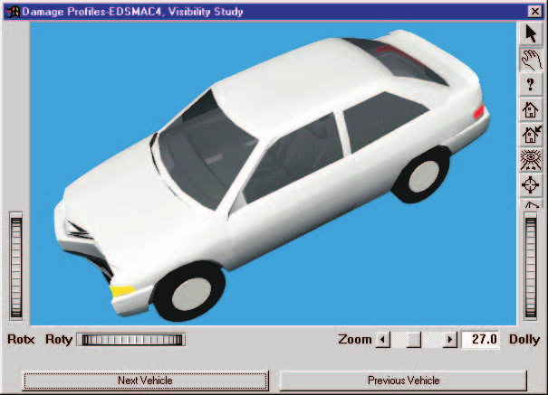

# Chapter 17 — Creating Report and Playback Windows

The purpose of the Playback Editor is to allow the user to view and manage all program outputs by performing the following operations:

- View all program outputs (numeric, graphic and simulation).
- Print all program outputs.
- Edit the accident sequence.
- Combine multiple simulation events into a single Playback Window.
- Record the Playback Window to a movie file. *(updated: output is recorded to an AVI movie file using the built-in video interface; direct routing to a video tape recorder is no longer the normal workflow.)*

This chapter describes how to use the Playback Editor to perform these functions, beginning with a description of the Playback Editor's components.

## Playback Editor Components

To use the Playback Editor, choose Playback Mode using the mode selector *(Mode menu, Playback, or Ctrl+5)*. This puts HVE into Playback Mode and displays the Playback Editor's components:

- **Playback Editor Dialog** — The Playback Editor dialog is used for adding report and playback windows to the current case and to select the current window.
- **Report Window(s)** — A Report Window displays the selected output and is used for viewing various program outputs (these are described later in this chapter).
- **Playback Window** — The Playback Window displays one or more trajectory simulations and is used for visualizing sequences involving multiple events. The Playback Window is also used for recording output to the current video destination (movie file). It also includes video input (source) and output (destination) selection options.
- **Playback Controller** — The Playback Controller displays a VCR-like panel of buttons allowing the user to start, stop, reset and play events forwards and backwards. *(updated: the Playback Controller is implemented as the playback controls on the main toolbar; see [Playback Controls (Toolbar)](../../01-user-interface/PlayBackControls.md).)*

*Figure 17-1 — Playback Editor, Report Windows and Playback Controller.*

### Playback Editor Dialog

The Playback Editor dialog is the heart of the HVE Playback Editor. The dialog includes the following functionality:

- **Add Report Window** — Allows the user to add a Report Window to the current case.
- **Add Playback Window** — Allows the user to add a Playback Window to the current case.
- **Delete Window** — Removes the current Report or Playback Window from the case.

*(updated: in the current version the Playback Editor dialog is a docked window list; each Report and Playback window in the case appears in the list, and the current window is chosen by selecting it in the list or in the window-name combo box on the toolbar. Report windows are added with the Add New Object toolbar button, and windows are removed with the Delete Object toolbar button.)*

> **NOTE:** The Delete pushbutton is not selectable if the current window is a Traj Sim Window that is used in a Playback Window.

### Report Windows

Report Windows are used for displaying the results of each event. The results are displayed in several forms:

- **Numeric Output Windows** — Allow the user to view numeric reports produced by any event (see Figure 17-2 for an example). The following output reports are available:
  - **Accident History** — A table of important positions and velocities during the event (see [Accident History](../../11-reports-output/AcciHistDlg.md)).
  - **Damage Data** — Vehicle damage sustained during the event (see [Damage Data](../../11-reports-output/DamageData.md)).
  - **Driver Data** — Vehicle driver inputs (Throttle, Steering, Brake and Gear Selection) during the event.
  - **Environment Data** — Environment parameters used by the event.
  - **Event Data** — Event-related parameters.
  - **Injury Data** — Human injuries sustained during the event.
  - **Messages** — Program diagnostics produced by the event.
  - **Program Data** — General program parameters used by the event.
  - **Vehicle Data** — Vehicle properties used by the event.

  Numeric reports are displayed in a scrollable Common Reports window (see [Common Reports Dialog](../../11-reports-output/CommRepDlg.md)).

*Figure 17-2 — Report Window with Numeric Results.*

*Figure 17-3 — Report Window with a Graphic Output; an example of a Damage Profile report from a simulation.*

- **Graphic Output Windows** — Allow the user to view graphic reports produced by an event (see Figure 17-3 for an example). The following Graphic Output reports are available:
  - **Damage Profile** — A visual showing the damage sustained by each vehicle during impact. The visual is static for reconstruction-type programs; it is dynamic (i.e., time-dependent) for simulations.
  - **Momentum Diagram** — A vector diagram produced by collision models showing the pre- and post-impact momentum.
  - **Site Drawing** — A static visual showing each vehicle at its user-entered positions (Impact, Separation, Rest, etc.) (see [Common Scene Reports](../../11-reports-output/CommSceDlg.md)).
- **Variable Output Table** — A table of simulation results as a function of time, reported at the current Playback time increment (see Figure 17-4 for an example, and [Variable Output Report](../../11-reports-output/VarOutRepDlg.md)). Refer to Chapter 16, Event Model Definition, for information about the available output parameters.
- **Trajectory Simulation Viewers** — Allow the user to visualize the selected event (see Figure 17-5 for an example, and [Trajectory Simulation Report](../../11-reports-output/TrajRepDlg.md)). Trajectory simulation viewers use the same viewer controls (Pan, Zoom and Pick Mode) as other HVE viewers.

*Figure 17-4 — Report Window with a Variable Output Table.*

*Figure 17-5 — Report Window with the Trajectory Simulation results from a single event.*

### Playback Window

The Playback Window allows the user to visualize multiple events in a single viewer and record the results to a movie file. The Playback Window viewer uses the same viewer controls (Pan, Zoom and Pick Mode) as other HVE viewers. The Playback Window also includes the following components:

#### Audit Trail

Each Playback Window may contain the results from several events. The merging of these events requires a considerable amount of logic. For example, the pre-impact phase of an accident sequence may use one simulation model, the impact phase may use a second, and one of the vehicles might use a third model for the post-impact phase.

The HVE Playback Window has an internal table to determine which objects are driven by which events during which time intervals. This table is called the Audit Trail (see Figure 17-6); it may be displayed and printed. The Audit Trail is a scrollable text box containing the following information about each event in the Playback Window:

- Report Window Name
- Event Name
- Event Objects used in the Playback Window

> **NOTE:** Even though an event may include two objects, the motion of one of its objects may be controlled by a different event. For example, after impact, a vehicle might roll over. You can use a different (3-D) model to control this portion of the object's motion in the Playback Window. See [Chapter 18, Editing the Event Sequence](18-editing-event-sequence.md).

- The starting and ending times during which the object's motion is controlled by that event.

The Audit Trail is a convenient way to document the simulation models that control the motion of each object in the Playback Window.

*Figure 17-6 — The Audit Trail displays a table of each event included in the current Playback Window, including the objects and the starting and ending times for each object.*

### Playback Controller

The Playback Controller (see Figure 17-7) is used for controlling the motion in Trajectory Simulation, Damage Profile and Playback output windows. Like the Event Controller described earlier (see Chapter 15, Creating and Editing Events), the Playback Controller works much like a VCR in both form and function. For example, it has the same buttons:

- **Stop/Reset** — Stop the simulations displayed in Trajectory Simulation and/or Playback Windows and initialize them to their starting conditions.
- **Rewind** — Return to the start of the simulation.
- **Reverse** — Run the simulation backwards.
- **Pause** — Pause the simulation(s).
- **Play** — Run the simulation forwards or execute a reconstruction model.
- **Advance To End** — Advance to the end of the simulation.

> **NOTE:** The only difference between Pause and Stop has to do with video recording devices: Pause leaves the recording engaged, while Stop disengages the recording mechanism.

*Figure 17-7 — Playback Controller, used for displaying trajectory simulations and playback windows.*

In addition to the above trajectory simulation control features, the Playback Controller also includes the following components:

- **Time Display** — Displays the current simulation time.
- **Frame Control Slider** — Allows the user to visually choose a frame within the sequence. To move to the first frame, move the slider all the way to the left; to choose a frame near the middle of the sequence, move the slider to the middle, and so forth.
- **Frame Counter** — Displays the number of the frame currently being displayed. *(updated: the toolbar also displays the Output Time Interval used for playback frames; see [Playback Controls](../../01-user-interface/PlayBackControls.md) for the full list of controls.)*

## Adding Report Windows

New Report Windows are added to the current case using the Playback Editor. To add a new Report window, perform the following steps:

1. Click on **Add New Object**. The Report Window dialog (see Figure 17-8, and [Report Window Dialog Box](../../01-user-interface/PrevWnd.md)) will be displayed, containing the following components:
   - **Active Events List** — A list box containing all the events in the current case.
   - **Status** — A non-editable field describing the status of the selected event, Executed or Not Executed.

   > **NOTE:** If the event status is Not Executed, no output reports will be available.

   - **Name** — A user-editable text box allowing the user to assign a name to the Report Window.
   - **Report Type** — An option list containing all the available output types for the selected event. *(updated: this option list was labeled "Output Type"/"Select Output" in earlier versions; it is now labeled Report Type.)*
2. Select an event from the Active Events List. A default Report Window name will be assigned according to the selected event.
3. If desired, edit the default Report Window Name.
4. Click on the Report Type option list and choose the desired output report.
5. Press OK to display the selected Report Window.

The selected output will be displayed in a Report Window.

*Figure 17-8 — Report Window dialog.*

## Adding Playback Windows

A Playback Window is added to the current case using the Playback Editor. To add a Playback window, perform the following steps:

1. Add a Playback Window. *(updated: the legacy "Options, Add Playback Window" menu command no longer exists; the Playback Window and its Playback Information dialog are created from Playback mode using the Playback Editor.)* The Playback Information dialog (see Figure 17-9) will be displayed, containing the following components:
   - **Active Trajectory Simulations List** — A table containing all the Trajectory Simulation Report Windows in the current case. Each row includes a check box used to select the event for playback, the event name, and the Tdelay, Tstart and Tend timing fields (see [Chapter 18](18-editing-event-sequence.md)).

   > **NOTE:** Only Trajectory Simulations are displayed in the table, because only trajectory simulations may be added to the Playback Window, which, by definition, is a visual simulation of all the combined events.

   - **Window Name** — A user-editable text box allowing the user to assign a name to the Playback Window.
   - **Source** — An option list which allows the user to choose the source of the information displayed in the Playback Window (the live playback, or a previously recorded movie file).
   - **Destination** — An option list which allows the user to route the Playback Window to a user-selectable destination. *(updated: the destination is now the playback window itself or an AVI movie file; tape-deck destinations such as "S-Video/Composite Video" are obsolete.)*
   - **Video Setup pushbutton** — Displays the Video Setup dialog, used to select the movie format, compressor, recording size and recording speed.
   - **Recording Information** — A read-only summary of the current video settings (Format, e.g. AVI; Compressor; Recording Size, e.g. HDTV 1080p (1920x1080); Recording Speed, e.g. frames/sec). *(updated: new in the current version.)*
   - **Audit Trail pushbutton** — Displays the Audit Trail for the current Playback Window.
   - **Key Results pushbutton** — Displays [Key Results windows](../../01-user-interface/KeyResDlg.md) showing user-selected variables during playback. *(updated: new in the current version.)*
   - **Traffic Signals pushbutton** — Displays the traffic signal setup for signals placed in the environment with the 3-D Editor's Signal Tool. *(updated: new in the current version.)*
   - **Reorder Events pushbutton** — Allows the user to change the order of the events in the Active Trajectory Simulations table (important for object precedence; see [Chapter 18](18-editing-event-sequence.md)). *(updated: new in the current version.)*

   > **NOTE:** For more information about Source and Destination, see Creating A Video, later in this chapter. Also refer to Section Nine: Video Output, as well as the Video Setup option.

2. Check one or more Traj Sims in the Active Trajectory Simulations table.
3. If desired, edit the default Playback Window Name.
4. If desired, click on Audit Trail to display the Audit Trail for the current Playback Window.
5. Press Apply.

The selected Trajectory Simulations will be displayed in the Playback Window.

> **NOTE:** There is only one Playback Window.

*Figure 17-9 — Playback Information dialog.*

## Displaying Simulations

Simulations in both the Report Windows and Playback Window are displayed and controlled using the Playback Controller.

To display one or more simulations using the Playback Controller, perform the following steps (the following steps assume one or more Trajectory Simulation Report Windows and a Playback Window have been added using the steps described in the previous sections):

1. If necessary, drag the windows to convenient locations on the screen.
2. Note the initial Source and Destination are assigned the Playback Window Name, e.g., Untitled Playback Window.

   > **NOTE:** If no Playback Window exists, these options would be unavailable.

3. Note the Time field displays the current simulation time, 0.0000 seconds.
4. Click **Play**. The simulations in each Report Window and the Playback Window will begin. The Frame Slider thumb control will advance and the Frame Counter will display the current frame number.

   > **NOTE:** You can iconify (minimize) any window if it is not necessary to watch it. Because iconified windows do not have to be rendered, the simulations will play more quickly.

5. Press **Pause**. The simulations will stop.
6. Press **Reverse**. The simulations will play in reverse. Press **Stop**.
7. Press **Rewind**. The simulations will return to the start.
8. Press **End**. The simulations will advance to the end of the longest event.
9. Click on the Frame Slider thumb control and drag it towards the middle of the range. On releasing the thumb control, the simulations will display the selected frame and the Time field will display the current simulation time.

## Creating A Video

One of the most powerful features of HVE is its ability to create professional quality video output using its built-in video interface. Once a Playback Window has been created, producing a video is quick and easy.

To create a video of the current Playback Window, use the Playback Controller to perform the following steps:

1. If necessary, return the simulation to the start using any of these methods:
   - Slide the Frame Slider thumb control all the way to the left, or
   - Press Rewind.
2. Click on the Source option button and choose the current playback window name.
3. Click on the Destination option button and choose the video output destination. *(updated: choose the AVI movie file destination; use the Video Setup dialog to set the movie filename, compressor, resolution and frame rate.)*
4. Press Play.

The simulation in the Playback Window will be recorded to the movie file as it plays. For more information about using HVE's built-in video interface, refer to Section Nine: Video Output.

## Printing

Any of the Playback windows may be printed on the system printer. To print the desired window, perform the following steps:

1. Select the desired window.
2. Choose Print from the File menu.

The selected window will be printed on the system printer.

> **NOTE:** The system printer is selected using your computer's Print Manager, selected using the Windows control panel. Contact your system administrator if no printer has been installed on your system.

For more information about using the Playback Controller, refer to the next chapter, [Editing the Event Sequence](18-editing-event-sequence.md), and to Section Nine: Video Output.

---
*Converted and updated from the legacy HVE User's Manual (Seventh Edition, Jan 2006), Chapter 17; verified against current source code (HVEINV-64: PlayBackDlg.cpp, PreviewWindowDialog*.cpp, HVERSNT.rc) 2026-07-05.*

<!-- NAV -->

---

← Previous: [Section Seven: Playback Editor](README.md)  |  [Index](README.md)  |  Next: [Chapter 18 — Editing the Event Sequence](18-editing-event-sequence.md) →

<!-- /NAV -->
