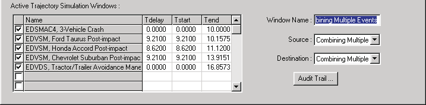
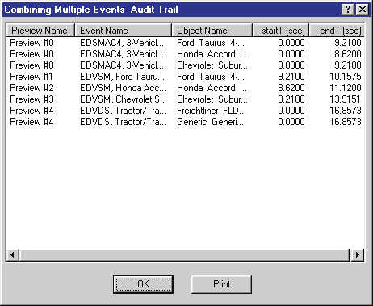

# Chapter 18 — Editing the Event Sequence

## Overview

Using the Playback Editor, simulations from several events may be edited into a single, coherent sequence involving multiple humans and vehicles. For example, a multiple vehicle collision with several occupants and pedestrians may be created using the Playback Editor. The purpose of this chapter is to explain how to edit multi-event sequences.

Editing multi-event sequences involves two basic steps:

- Combining the desired events
- Editing the sequence

These steps are described below.

## Combining Events

The first step in creating an accident sequence that includes multiple events is to select the events (each Traj Sim Window displays exactly one event). The order of events in the Playback Editor is important, and is discussed in detail in the Object Precedence section of this chapter.

> **NOTE:** The following example assumes several Traj Sim Windows containing simulation events have already been created, as explained in [Chapter 17](17-report-playback-windows.md).

*Figure 18-1 — The Playback Window allows the user to combine multiple events.*

To select the events, use the Playback Editor to perform the following steps:

1. Display the Playback Information dialog (see Figure 18-1). *(updated: the legacy "File, Options, Add Playback Window" command has been removed; the Playback Information dialog is opened from Playback mode as described in Chapter 17.)* This dialog includes the Active Trajectory Simulations table.
2. Choose the desired events from the Active Trajectory Simulations table by setting the check box next to each event.

   > **NOTE:** The order of events displayed in the Active Trajectory Simulations table is important; see Playback Object Table, later in this chapter. *(updated: the current dialog includes a Reorder Events pushbutton, so the order can be changed after the windows have been created.)*

3. Enter a name for the Playback Window (the name is optional).

The Playback Window will include all the humans and vehicles used in each of the selected events.

## Editing Events

After the events are selected, they normally must be edited so each event occurs at the proper time and sequence. In addition, certain non-calculated information may be edited. While performing these operations, the user assumes a role much like a movie editor: the Output Tracks produced by each event are the film, and each event's Active Trajectory Simulations listing becomes the cutter and splicer. These editing operations are described below.

*Figure 18-2 — Active Trajectory Simulations table found in the lower portion of the Playback Information dialog. The editing parameters, Tdelay, Tstart and Tend, are located in this table.*

### Timing The Sequence

The timing of each event is accomplished using the Active Trajectory Simulations table. As shown in Figure 18-2, each event's listing includes fields that allow the user to set the following timing parameters:

- **Editing Tdelay** — Set Tdelay to delay the onset of an event by the user-entered time value.
- **Editing Tstart and Tend** — Set Tstart and Tend to display a portion of the entire event, defined from Tstart to Tend.

> **NOTE:** Tstart and Tend allow you to select a specific portion of the event. For example, an occupant simulation may contain 50 milliseconds of irrelevant motion while the human settles into the seat and reaches equilibrium. By selecting Tstart as 50 milliseconds after the output begins, you can remove this undesired motion.

To edit the timing of an event, perform the following steps:

1. Choose the desired event and enter the delay time, start time and end time. The Active Trajectory Simulations table will be updated when you press Enter in each field.
2. Using the Playback Controller, press Rewind, then press Play. You will notice that objects for that event will not begin moving until the current simulation time reaches Tstart in either the Traj Sim or Playback Window.
3. Repeat the above steps for each event you wish to edit.

The motion for each event is displayed separately in its Traj Sim Window. Use the Traj Sim Window to confirm the event(s) are correctly synchronized. The Playback Window shows all the events correctly synchronized in a single window.

> **NOTE:** After a Playback Window has been created, you may wish to iconify (minimize) all the Report Windows to reduce rendering time.

### Object Precedence

It seems like a fairly simple task: create a window, put all the events in it and start the simulation running. However, there are some technical issues to be concerned with. For example:

- What if two events in the window have the same object?
- What if an object is changed (for example, suppose a vehicle is damaged in the middle of the sequence)?

The solution to these problems is based on a simple observation: the number of objects included in the Playback Window remains fixed. If you think about it, this makes sense! Cars and humans cannot disappear and/or reappear in the middle of an accident sequence (contrary to some of the stories you hear!).

### Rules

To implement the above solution requires a few important rules that describe the hierarchy of objects:

- **Rule 1:** The number of objects (humans and vehicles) in the Playback Window remains fixed.
- **Rule 2:** Object Names, assigned when the Human or Vehicle Editor was used to create the object, are used to distinguish different humans and vehicles.
- **Rule 3:** Parentheses in object names are used to distinguish between different instances of the same object. For example, the user may create two vehicles: *Ford F-150* and *Ford F-150 (Damaged)*. The Playback Editor views these as the same vehicle. This allows the user to model changes to a vehicle that occurred during the sequence.
- **Rule 4:** If more than one instance of an object exists at the same time, the last one in wins. Thus, the order that events are selected in the Active Trajectory Simulations list is important. New instances replace existing instances. For example, if *Ford F-150* appears in an event that starts at t=0 seconds and also in a second event that starts at t=2.1 seconds, the motion of the Ford will be driven by the first event from 0 to 2.1 seconds and by the second event thereafter (or until a third event takes over).
- **Rule 5:** Vehicles containing humans have the lowest precedence. Thus, if an occupant event includes *Ford F-150* and, simultaneously, a vehicle event also includes *Ford F-150*, the F-150 in the occupant event will be ignored. The F-150's motion will be driven by the vehicle simulation event.

### Playback Object Table (Audit Trail)

The above rules are used to create an internal table, called the Playback Object Table. This table determines exactly which events are driving which objects. If you are curious about this table, take a look at the Audit Trail: the Audit Trail (see Figure 18-3) is actually a printable dialog that displays the Playback Object Table!

Refer to the Tutorial section of this manual for examples of editing an accident sequence.

*Figure 18-3 — Audit Trail.*

## Editing Non-calculated Results

The developer of a human or vehicle simulation model may choose to make certain simulation results editable by the HVE user. For example, a 2-D simulation may allow the user to edit the sprung mass Z position and roll and pitch orientations. By editing these non-calculated fields, the user can create a 3-D sequence using a 2-D program.

> **NOTE:** The term non-calculated is slightly misleading. Actually, the Z, roll and pitch values will be calculated automatically by HVE using AutoPosition.

Non-calculated results are edited using the Variable Output Window (see [Variable Output Report](../../11-reports-output/VarOutRepDlg.md)). To edit these results, perform the following steps:

1. Choose **Add New Object**. The Report Window dialog will be displayed.
2. Select a simulation event (only simulations produce a Variable Output Window).
3. Click on Report Type and choose Variable Output.
4. Optionally, enter a name for the Variable Output window.
5. Press OK.

The Variable Output Table for the selected event will be displayed. Repeat the above procedure for each event you wish to edit.

The next step is to select the non-calculated results for each event:

1. Click on **Select** in the Variable Output window for the desired event. The [Variable Selection dialog](../../11-reports-output/VarSelDlg.md) for the event will be displayed.
2. Click the Object Name option button and select the desired human or vehicle.
3. Select the desired non-calculated results for the human or vehicle.

   > **NOTE:** Refer to the Simulation Model's documentation to determine which results are non-calculated.

4. Press OK.

The selected variables will be displayed in the Variable Output Window.

*Figure 18-4 — Edit Variables dialog.*

The next step is to edit the selected variables:

1. Click **Edit**. The [Variable Edit dialog](../../11-reports-output/VarOutEdDlg.md) will be displayed, containing a table of the selected variables.
2. Edit the table.
3. Press OK.

The edited values are displayed in the Variable Output Table. Now, use the Playback Controller to visualize the changes:

1. Press Rewind.
2. Press Play.

The Trajectory Simulation window (and possibly the Playback Window, if one is present and it includes the edited Traj Sim Window) will display the edited results.

---
*Converted and updated from the legacy HVE User's Manual (Seventh Edition, Jan 2006), Chapter 18; verified against current source code (HVEINV-64: PlayBackDlg.cpp, hversntview.cpp, VarOutEdDlg/VarSelDlg reference pages) 2026-07-05.*

<!-- NAV -->

---

← Previous: [Chapter 17 — Creating Report and Playback Windows](17-report-playback-windows.md)  |  [Index](README.md)

<!-- /NAV -->
