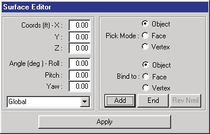
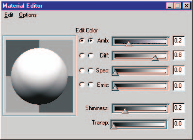
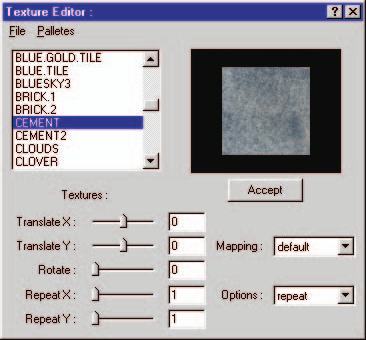
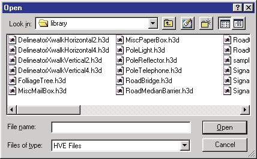

# Chapter 19 — Using the HVE 3-D Editor

The purpose of the 3-D Editor is to provide the user a tool to create and edit 3-D objects used to visualize humans, vehicles and environments. In addition to providing visual information, the surfaces are also physical surfaces, with physical properties, including surface normal and friction properties, that simulate a physical environment for human and vehicle dynamics models. This chapter provides an overview of the 3-D Editor's basic components.

## Description

The 3-D Editor consists of the following basic components (see Figure 19-1):

- Viewers
- Object Attributes Dialog
- Object Editor Dialog

This chapter provides detailed descriptions for each of these components.

*Figure 19-1 — 3-D Editor, including four viewers, Object Attributes dialog and current object (in this case, Surface) dialog.*

## Viewers

As shown in Figure 19-1, the 3-D Editor has four viewers:

- **Perspective Viewer** — Displays the object at any user-specified perspective.
- **X-Y Orthographic Viewer** — Displays the object as viewed along an axis normal to the X-Y plane (i.e., along the Z axis) — the plan view.
- **Y-Z Orthographic Viewer** — Displays the object as viewed along an axis normal to the Y-Z plane (i.e., along the X axis) — the front view.
- **X-Z Orthographic Viewer** — Displays the object as viewed along an axis normal to the X-Z plane (i.e., along the Y axis) — the side view.

The user may select and edit any object displayed in any of these viewers.

*(updated: the 3-D Edit menu now includes a Viewer option that displays the 3-D Editor Viewer Options dialog. Its Show Viewer(s) drop-down selects which viewer layout is displayed while editing: the XZ (side), YZ (front) or XY (plan) orthographic viewer alone, the Perspective viewer alone, or All (all four viewers at once). See [3-D Editor Menu](../../01-user-interface/3dEditor.md).)*

## 3-D Editor Dialog

The 3-D Editor dialog is the heart of the 3-D Editor. As shown in Figure 19-2, the 3-D Editor dialog contains the following basic components:

- **Object Attributes Tool** — Allows the user to assign the Object Type, Overlay Name and Friction Factor attributes for the current object. The Object Name is assigned when the object is created (according to the tool used to create it; see Current Object Tool, below), and the Material Name is assigned according to the current object's material attributes.
- **Group Tool** — Allows the user to combine and disassemble previously created objects, as well as to load and save previously created objects for future use in other 3-D geometry files.

*Figure 19-2 — The 3-D Editor dialog includes the Current Object Tool, Object Attributes Tool and Group Tool.*

## Current Object Tool

An object, such as a surface or sphere, is always created by first selecting an object tool. *(updated: the object tools are now selected from the toolbar rather than from the 3-D Editor dialog.)* The following Object Tools are available (see Figure 19-3):

- **Surface** — Used for creating surfaces. This tool allows the user to create drivable surfaces (roads, medians and adjacent surfaces).
- **Cone** — Used for creating basic cone-shaped objects (great for highway delineators).
- **Box** — Used for creating basic box-shaped objects (for example, buildings and curbs).
- **Sphere** — Used for creating spherical- and ellipsoidal-shaped objects.
- **Cylinder** — Used for creating cylindrical-shaped objects (man-hole covers, speed bumps).
- **Text** — Used for adding text to objects (for example, street signs, building signs and highway delineation).
- **Light** — Used for adding light sources (such as street lights).
- **Signal** — Used for creating traffic signal lights in the environment. *(updated: new tool, not present in the legacy manual.)*
- **Edit** — Used for selecting objects for editing.

*Figure 19-3 — The Current Object Tool allows the user to create and edit objects.*

To use the Object Tool to create an object, perform the following steps:

1. Click on the desired Object Tool (e.g., Box). The Box Editor dialog will be displayed.
2. Place the mouse cursor in any viewer and press/drag mouse button 1. The object will be placed in the viewer at the selected cross hairs location.
3. Drag the mouse to position the object at the desired location.

   > **NOTE:** You can also use the Box Editor's position fields to directly enter the desired location.

4. Release the mouse button. The Edit Tool becomes the current tool and the object will remain selected so its attributes may be edited.

## Object Dialog

The Object Dialog (see Figure 19-4) displays 3-D geometry data for the current object. The contents of this dialog are dependent on the currently selected Object Tool (e.g., Surface or Cone). Generally speaking, each object dialog displays information about the current object, including its size and position/orientation.

> **NOTE:** See the next chapter, [Object Tools](20-object-tools.md), for a complete description of each object dialog.

*Figure 19-4 — The Current Object Dialog allows the user to edit the geometric properties of the current object. Each Object Tool has a special Object Dialog to meet the needs of the object; the Surface Object dialog is shown.*

## Object Attributes Tool

Every object created using the 3-D Editor has the following attributes (see also the code-verified [Object Attributes Dialog Box](../../01-user-interface/ObjAttrDlg.md) reference):

- **Object Name** — A non-editable text field that displays the name of the tool used to create the object (e.g., Box).
- **Object Type** — An option list that allows the user to define the type of object (Human, Vehicle, Road, Friction Zone, Curb, Water or Other). *(updated: the Curb and Water types have been added since the legacy manual; selecting Water enables Water Depth controls.)*
- **Overlay Name** — A combo box that allows the user to assign an overlay name for the current object.
- **Material Name** — A non-editable text field that displays the material name of the current object.
- **Friction Factor** — A user-editable field allowing the user to enter the friction multiplier for the current object.
- **Material Pushbutton** — A button that allows the user to select or edit material attributes for the current object.

The current attributes for the selected object are displayed and edited using the Object Attributes Tool (see Figure 19-5).

*Figure 19-5 — The Object Attributes Tool allows the user to view and edit the attributes for the current object.*

### Object Name

The Object Name is simply the name of the object tool used to create the object (e.g., Surface, Box, Cylinder). If the selected object is a group composed of several individual objects, the Object Name is Group. If the grouped object was selected from the Highway Furnishings Library, the Object Name is the object's filename.

> **NOTE:** Groups are further discussed later in this chapter.

### Object Type

Every object created by the 3-D Editor has an Object Type attribute. The available types are:

- **Human** — The default object type attribute for humans.
- **Vehicle** — The default object type for vehicles.
- **Road** — The default object type for environments. Road objects have physical properties (surface elevation, normal and friction factor) used by the current reconstruction or simulation model.
- **Friction Zone** — An optional object type. Friction Zone objects have physical properties (surface elevation, normal and friction factor) used by the current reconstruction or simulation model.
- **Curb** — An optional object type identifying the object as a curb for calculation models that include curb impacts. *(updated: new type.)*
- **Water** — An optional object type identifying the surface as water; selecting Water enables the Water Depth controls. *(updated: new type.)*
- **Other** — An optional object type for purely visual objects.

> **NOTE:** An object type of Road or Friction Zone must be selected if the object is part of the physical environment with which a human or vehicle may interact.

> **NOTE:** If an environment object will probably not interact with humans or vehicles (for example, the top of a tree or the roof of a building), you should select Other. Setting the object type to Other removes the object from the list of surfaces the physics needs to evaluate, thus reducing the computation time.

To assign the object type to the selected object, perform the following steps:

1. If necessary, select an object (a bounding box is displayed around the selected object). The attributes (Name, Type, Overlay and Friction Factor) for the selected object are displayed.
2. Click on the current Object Type. The Object Type option list is displayed.
3. Choose the desired object type from the list.

The current object type is updated.

### Overlay Name

Every object created using the 3-D Editor belongs to a named overlay. Examples of named overlays are Accident Debris and Measured Skids.

> **NOTE:** The default Overlay Name is "Untitled".

HVE maintains a list of current overlay names. This list is available in the Overlays dialog by choosing Overlays from the View menu (see [Overlays Dialog Box](../../01-user-interface/OverLayDlg.md)). The user may display or remove one or more overlays using the Overlays dialog.

Overlays serve several very useful purposes. Some examples are:

- Overlays may be used to show an accident scene as it appeared before and after the accident by creating overlays named Accident Debris and Skidmarks. Turning off these overlays shows the scene as it appeared before the accident; turning them on shows the scene after the accident.
- An overlay may be used to compare simulated and measured skidmarks.
- A scanned image (bitmap) overlay may be used to compare a 3-D model of the accident site with a photograph to confirm the model's accuracy.

To assign an overlay name to the selected object, perform the following steps:

1. If necessary, select an object (a bounding box is displayed around the selected object). The attributes (Name, Type, Overlay and Friction Factor) for the selected object are displayed.
2. Modify the current overlay name using either of the following procedures:
   - Click on the Overlay Name combo box button to display a list of previously created overlay names and choose the desired name, or
   - Place the mouse cursor in the Overlay Name combo box text field (it will become a text cursor) and edit the current name to create a new overlay name. Press Enter to update the list of overlays.

The current overlay name is updated.

### Friction Factor

Objects created using the 3-D Editor have friction properties. The Friction Factor is a user-editable object attribute used by the current calculation model to determine the frictional properties of all objects.

Use Friction Factors to create regions with different frictional properties from the base surface. Examples include gravel shoulders, oil slicks and other regions.

To edit the friction factor for the selected object, perform the following steps:

1. If necessary, select an object (a bounding box is displayed around the selected object). The attributes (Name, Type, Overlay and Friction Factor) for the selected object are displayed.

   > **NOTE:** If the current object type is Other, the Friction Factor field is disabled. To enable the Friction Factor field, change the object type to Road or Friction Zone.

   > **NOTE:** If the current object type is Other, the object's friction and other geometrical properties will not be used by the current calculation model.

2. Place the mouse cursor in the Friction Factor field and edit the value.
3. Press Enter to update the value.

The friction multiplier for the selected object is updated.

> **NOTE:** For more information about how the friction attribute is used, see Environment Model Definition.

## Materials Editor

The Materials Editor (see Figures 19-6 and 19-7) allows the user to apply material attributes (color and texture) to an object's surface, and to determine how that surface reflects light from its surroundings. The object's basic color is determined using a color wheel, located in the upper right quadrant of the dialog, and a color intensity slider, located just below the color wheel. The remaining attributes are assigned using a series of sliders located below the color wheel. A sample illustrating the results of the current color attributes is displayed on a sphere located in the upper left quadrant of the dialog.

The surface appearance is determined by six attributes:

- **Ambient** — The intensity of the color that is reflected in response to the ambient lighting in the environment. Because the lighting in the environment is normally white (or nearly white) light, increasing this attribute normally does not change the color of the object, but makes it brighter. However, if, for example, the object is a vehicle passing beneath a yellow street light, the vehicle's color will become more yellow.
- **Diffuse** — The intensity of the object's basic color. Increasing this attribute also makes the object brighter.
- **Specular** — The intensity of an object's highlights. Increasing this attribute creates a "sparkling" effect. Normally this field is kept at a low level.
- **Emissive** — The intensity of light produced by the object. Increasing this attribute causes the object to glow. An example of an emissive object is a vehicle's taillight. By increasing its emissivity, the taillight appears to be on; however, it does not cast light on other objects.
- **Shininess** — Adds reflectivity to an object. Increasing this attribute creates the appearance of a polished surface.
- **Transparency** — Makes an object invisible. Increasing this attribute increases the object's transparency.

To modify an object's color and appearance, perform the following steps:

1. Click on the object to select it. A bounding box is displayed about the object indicating it has been selected for editing.
2. Using the HVE menu bar, click on 3-D Edit and choose Material Color or Material Texture. The Material Color or Material Texture Editor dialog is displayed, showing the current color or texture attributes.
3. To change the object's basic color, click the Edit radio button next to the attribute to be changed (e.g., Ambient), then click the circle in the color wheel and drag it to the desired color location. The sample sphere reflects the new color.
4. To lighten the object, drag the intensity slider to the right; to darken it, drag it to the left.

   > **NOTE:** To create a black object, drag the intensity slider all the way to the left.

5. To modify the object's appearance, drag the appearance sliders, noting the effect on the current appearance, as displayed in the sample sphere.
6. To apply the current color and attributes to the selected object, you do not need to do anything else. The object's color and appearance are automatically updated.

*Figure 19-6 — The Materials Editor allows the user to assign color and other material attributes for the current object.*

*Figure 19-7 — The HVE Texture Editor is used for applying textures to objects.*

### Texture Editor

HVE includes a powerful tool called the Texture Editor. Textures (more formally referred to as Texture Maps) are basically photographs you can attach to 3-D objects. The texture mapping engine applies the photo to the surface by "mapping" coordinates from the photograph to coordinates on the polygon surface.

Some examples of the use of Texture Maps are:

- **Road Surface** — You can create a road surface and apply a concrete or asphalt texture to it. The result is a road surface that looks like concrete or asphalt.
- **Buildings** — Create the exterior of a building and attach a photo of a building to it.
- **Signs** — Create realistic signs of any type (street signs, billboards, etc.).
- **Dirt/Grass** — Create the roadside adjacent to the road and apply a grass (or dirt) texture to it.
- **Water** — Create a pond, make the bottom surface of type Road, and the water surface of type Other. Apply a water texture to the top surface, increase its transparency slightly, and you can drive into a lake (hydrodynamics are currently ignored!). *(updated: the current Object Type list also includes a dedicated Water type with a Water Depth setting; see the Object Type section above.)*

#### Using the HVE Texture Editor

Texture editing is performed using the 3-D Editor. Textures are only available in Environment mode. Textures are most often applied to surface objects, although textures may also be attached to cones, spheres and other objects. The Material Editor and the Texture Editor may be used in conjunction with each other to achieve the desired appearance.

The Texture Editor includes the following components:

- **Available Textures List** — A collection of textures placed in a single group. HVE includes several default textures, including buildings, road materials, grass and signs. You can also add your own textures to this list (see Adding New Textures, below).
- **Appearance Attributes** — A collection of controls that allow you to modify the texture's appearance. The available controls are:
  - **Translate** — A percentage of the texture (-1 to 1) that is offset before the texture is applied in the X or Y direction. A translation of 0 means the texture is applied starting from the center. A Translate X of -0.5 means that the start of the texture is moved 50 percent to the right. Note that the sliders are positive left, negative right; this arrangement reinforces that concept.
  - **Rotate** — Degrees of rotation of the texture.
  - **Repeat** — The number of times a texture is repeated or "wrapped" across a face. A repeat of 1 means the texture is stretched from one edge of the face to the other. A repeat of 10 means the texture is repeated 10 times across the face in that direction. The Repeat control is typically used to "scale" the texture to the desired surface.
  - **Mapping** — Not yet implemented.
  - **Options** — Repeat or Clamp. Note that the Repeat sliders change to Scale when the Options selection is changed from Repeat to Clamp. Options affects how the texture is applied to a face. Repeat is explained above. Clamping allows the user to directly scale the texture, with the last pixel of the picture (texture) being repeated to the edge of the face for scaling less than 1.
- **Accept (Apply) Button** — Causes the current Appearance Attributes to be applied to the object.

> **NOTE:** Textures are applied per FACE, not per object. This has a noticeable effect on objects such as roads (see the example below).

Let's say you want to texture a 200 ft x 40 ft piece of road using a texture called Cement.rgb. To apply the concrete texture to the road, perform the following steps:

1. Find Cement.rgb in the list and click on it. The cube in the render area to the right of the palette should have the concrete texture applied to it, and all fields should have 0's for Translate X and Y and Rotate, and 1's for Repeat X and Y.
2. Press Accept. The texture is applied to the road, but it doesn't look quite right if you zoom in on it. This is because the picture is being stretched to each edge of the face, therefore making it blurry when you look closely at it. When you zoom out, the texture looks magnified.

To fix this you must increase the Repeat (or wrapping) of the texture:

1. Try changing the Repeat X to 54 and the Repeat Y to 45.5 and press Accept. This produces a "rutted" texture across the road.
2. The ruttedness comes from one edge of the picture not blending with the opposing edge. You can fix this by editing the image in a paint program and matching the edges using a clone tool from one side to the other; we leave this as an exercise for the reader. Note that rutting can be used in a positive way to create the appearance of tire ruts in a road.

#### Adding New Textures

To add a new texture (for example, a new Cement.rgb) to the existing texture list, perform the following steps:

1. Be sure the Texture Editor is not displayed on your desktop. Now, using your file browser, copy the texture file into the `\HVE\supportFiles\images\environments\EnvTextures` directory.
2. Select 3-D Edit, Material Texture from the main menu.
3. Scroll down the list of textures until you see the file you just copied into the directory.
4. Press Accept. The texture is applied to the road.

## Group Tool

A group is a collection of objects that are manipulated as a single object. Groups are created by combining individually created objects (Surfaces, Boxes, etc.).

HVE's 3-D Editor includes the following group tools (see Figure 19-8):

- **Group** — Combines the selected objects into a group (single object).
- **Ungroup** — Decomposes the selected group into its individual objects or groups.
- **Load (Open)** — Displays a file selection dialog allowing the user to add a previously created group to the current human, vehicle or environment.
- **Save** — Displays a file selection dialog allowing the user to save the currently selected group for use in other cases.

*Figure 19-8 — The Group Tool allows the user to create and disassemble grouped objects, to save grouped objects and to insert grouped objects into other scenes.*

### Group

To create a group, perform the following steps:

1. Use the Object Tool to create two or more individual objects.
2. Select the individual objects using multiple selection (hold the Shift key down while clicking on the desired objects).

   > **NOTE:** Groups can be nested (placed inside other groups).

3. Choose Group.

The desired group will be created.

### Ungroup

To disassemble an existing group, perform the following steps:

1. Click on the grouped object to select it.
2. Choose Ungroup.

The grouped object will be disassembled into its individual objects.

*Figure 19-9 — The Group Object File Selection dialog allows the user to load and save grouped objects.*

### Open

To add a previously created group to the current scene, perform the following steps:

1. Click on the 3-D Editor's Open icon. The Highway Furnishings Library file selection dialog will be displayed (see Figure 19-9).
2. Select the desired filename and press OK.
3. Click the mouse in the viewer to add the group to the current scene (just like adding a box or any other object).

The grouped object will be displayed in the scene.

> **NOTE:** The grouped object will be located according to the earth-fixed coordinates where it was saved. If you want the default location of the grouped object to be the origin, you must move it there before saving it in the library.

After adding the grouped object to the scene, it may be positioned and edited like any other object.

### Save

To save the current group for future use, perform the following steps:

1. Click on the grouped object to select it.
2. Click on the 3-D Editor's Save icon. The Highway Furnishings Library file selection dialog will be displayed (see Figure 19-9).
3. Select or enter a filename and press OK.

The named group will be added to the library.

> **NOTE:** Objects are saved according to their current location relative to the origin. This fact is important when the object is later selected from the library and positioned in the environment. If the object was located 50 ft from the origin when it was saved, it will be located 50 ft from the current coordinates when it is pasted back into the environment. Thus, you will normally want to move the object to the origin before saving it in the library.

---
*Converted and updated from the legacy HVE User's Manual (Seventh Edition, Jan 2006), Chapter 19; verified against current source code (HVEINV-64, SceneViewer) and the code-verified dialog reference pages 2026-07-05.*

<!-- NAV -->

---

← Previous: [Section Eight: 3-D Editor](README.md)  |  [Index](README.md)  |  Next: [Chapter 20 — 3-D Editor Object Tools](20-object-tools.md) →

<!-- /NAV -->
