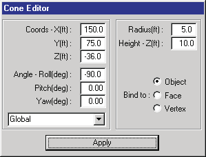
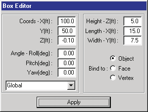
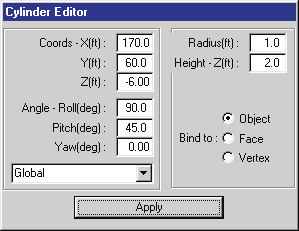
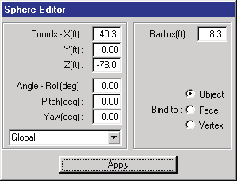
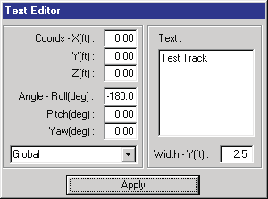
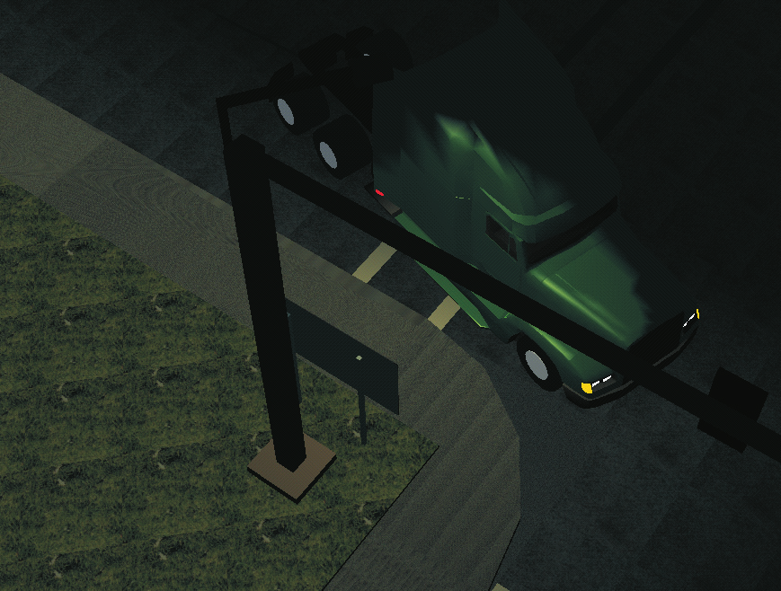
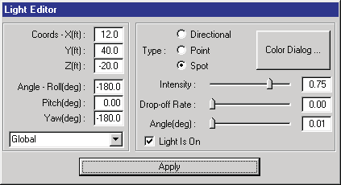
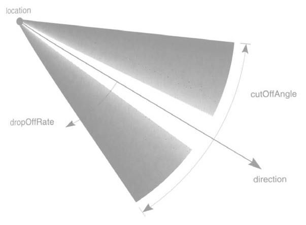

# Chapter 20 — 3-D Editor Object Tools

The 3-D Editor is used for creating and editing the objects used by HVE. These objects are broadly categorized as human, vehicle or environment objects. The user creates and edits these objects using the 3-D Editor's selection of creation and editing tools.

## Overview

An object, such as a surface or sphere, is always created by first selecting an object tool from the toolbar. The following Object Tools are available:

- **Surface Tool** — Used for creating surfaces, such as roads, shoulders and adjacent highway environment.
- **Cone Tool** — Used for creating cone-shaped objects such as traffic cones.
- **Box Tool** — Used for creating box-shaped objects, including buildings, sidewalks and bridges.
- **Sphere Tool** — Used for creating spherical- and ellipsoidal-shaped objects, such as commercial building signs.
- **Cylinder Tool** — Used for creating cylindrical-shaped objects, such as signs, sidewalk corners and tanks.
- **Text Tool** — Used for labeling objects such as signs, buildings and vehicles.
- **Light Tool** — Used for creating light sources in the environment.
- **Signal Tool** — Used for creating traffic signal lights in the environment. *(updated: new tool; signal timing is coordinated with the Traffic Signals option in the Playback Information dialog.)*
- **Edit Tool** — Used for editing existing objects.

Each of these object tools is described in this chapter. The field-by-field dialog descriptions are kept in the code-verified reference pages linked from each section.

## Surface Tool

The Surface Object Tool allows the user to create and edit 3-D surfaces, such as roads, medians and any other object which may be defined by a series of polygons. The Surface Editor dialog, shown in Figure 20-1, displays information about the current surface object.

*Figure 20-1 — The Surface Editor dialog allows the user to edit the geometric properties of the current surface.*

### Surface Editor Dialog

See the code-verified [Surface Editor Dialog](../../08-environment/SurfEdDlg.md) reference for full details. In summary, the dialog provides:

- **X,Y,Z Position Fields** — Display and allow editing of the selected object's local or global coordinates.
- **Roll, Pitch, Yaw Orientation Fields** — Display and allow editing of the selected object's local or global orientation (active only in Object mode).
- **Local/Global Option Switch** — Allows switching between local and global coordinates and angles.
- **Pick Mode Switch** — Allows switching between picking of surface objects, faces or vertices. *(updated: a fourth mode, Subdivide, has been added — a scissors mode used to split a surface; the split is performed when Apply is clicked.)*
- **Add Face Pushbutton** — Allows adding additional faces (usually, a face is an individual triangle) to the current surface object.
- **End Pushbutton** — Closes the current face or face set (a face set is a connected set of triangles).
- **Reverse Normal (Rev Nrml)** — Reverses the direction of the selected face's surface normal (faces with normals pointing away from the sun will not be lit by the sun).
- **Dec/Tes Pushbutton** — Displays the Decimate/Tessellate dialog, used to reduce (decimate) or refine (tessellate) the surface mesh. *(updated: new in the current version.)*
- **Apply** — Accepts the entered parameters; Surface Editor actions applied this way are registered with the Undo/Redo manager. *(updated.)*

*(updated: the "Bind To" radio buttons that appeared on this dialog in some earlier versions are no longer part of the Surface Editor; they remain in the Cone and Cylinder editors. Also, when the Surface tool is selected the editor now starts in Vertex mode so the vertices of a new surface can be entered immediately.)*

*Figure 20-2 — Surface geometrical properties. The example shows a single surface object composed of a single face set containing five triangles, created by clicking points 1 through 5 in counter-clockwise order.*

### Creating A New Surface

To create a new surface, perform the following steps:

1. Choose the Surface Object tool.
2. Enter the X,Y,Z coordinates of at least three vertices (a minimum of three points is necessary to create a single face).
   - **Using the Mouse:** Click the mouse at the desired X,Y,Z coordinates of each vertex.
   - **Using the Keyboard:** Enter the X,Y,Z coordinates in the coordinate fields in the Surface Editor dialog. Each vertex is created when you press Apply.
3. Close the face.
   - **Using the Mouse:** Reselect the first vertex you entered (the first vertex is highlighted in a different color), or press End in the Surface Editor dialog.
   - **Using the Keyboard:** Instead of pressing Enter, press Ctrl+Enter after entering the coordinates for the last vertex.
4. Repeat steps 2 and 3 for each desired face.

When finished creating the surface object, choose the Edit tool. After creating the surface it becomes the current object and its materials and other properties may be edited.

### Editing an Existing Surface

To edit an existing surface, perform the following steps:

1. Choose the Edit tool (if necessary).
2. Click on an existing surface object (the Attributes Tool will confirm the current object name is Surface). The Surface Editor dialog is displayed.

   > **NOTE:** If you click on a surface and the current object name is Group or a user-entered name, the surface you clicked on is part of a grouped object that must be disassembled before it can be edited.

3. Choose the Pick Mode according to the desired editing operation:
   - Choose **Object** (the default) to reposition the surface object or apply different attributes (Type, Overlay, Friction Factor or Material).
   - Choose **Face** to edit a single face (usually to reverse its normal).
   - Choose **Vertex** to edit an existing X,Y,Z coordinate location.
   - Choose **Subdivide** to split the surface with a scissors line; press Apply to perform the split. *(updated.)*
4. Perform the desired editing operation.

> **NOTE:** The Surface object remains selected for additional editing operations.

## Cone Tool

The Cone Object Tool allows the user to create and edit 3-D cones. Cones are useful for creating highway delineator cones and simple trees. The Cone Editor dialog, shown in Figure 20-3, displays information about the current cone object.

*Figure 20-3 — The Cone Editor dialog allows the user to edit the geometric properties of the current cone.*

### Cone Editor Dialog

See the code-verified [Cone Editor Dialog](../../08-environment/ConeEdtDlg.md) reference. In summary, the dialog provides:

- **X,Y,Z Position Fields** — Display and allow editing of the selected object's local or global coordinates.
- **Roll, Pitch, Yaw Orientation Fields** — Display and allow editing of the selected object's local or global orientation.
- **Local/Global Option Switch** — Allows switching between local and global coordinates and angles.
- **Base Radius** — Allows editing the cone's base radius.
- **Height** — Allows editing the cone's height.

*Figure 20-4 — Cone geometrical properties.*

### Creating a New Cone

To create a new cone, perform the following steps:

1. Choose the Cone Object tool.
2. Enter the X,Y,Z coordinates where you wish the cone to be placed.
   - **Using the Mouse:** Click the mouse at the desired X,Y,Z coordinates for the base of the cone.
   - **Using the Keyboard:** Enter the X,Y,Z coordinates in the coordinate fields in the Cone Editor dialog and press Apply.
3. Enter the orientation angles about the X,Y,Z axes.
   - **Using the Mouse:** Click on the 3-D Edit menu and choose Manipulators. A cascade menu displays several manipulator types. Choose the appropriate manipulator (see [Chapter 21, Manipulators](21-manipulators.md), to decide which manipulator suits your needs). Then pick the manipulator handles and position the cone as desired.
   - **Using the Keyboard:** Enter the desired angles for the cone in the orientation fields in the Cone Editor dialog and press Apply.

After the cone is positioned, the 3-D Editor will return to Edit mode. The cone becomes the current object and its materials and other properties may be edited.

### Editing an Existing Cone

To edit an existing cone object, perform the following steps:

1. Choose the Edit tool (if necessary).
2. Click on an existing Cone object to select it for editing (the Attributes Tool will confirm the current object name is Cone). The Cone Editor dialog is displayed.

   > **NOTE:** If you click on a Cone and the current object name is Group or a user-entered name, the cone you clicked on is part of a grouped object that must be disassembled before it can be edited.

3. Perform the desired editing operations:
   - Edit its position and orientation using either the mouse or the keyboard, as described in the previous section.
   - Edit its Object Type, Overlay and Friction Factor attributes using the Attributes Tool.
   - Edit its materials attributes by choosing Material Color or Material Texture from the 3-D Edit menu.

> **NOTE:** The Cone object remains selected for additional editing operations.

## Box Tool

The Box Object Tool allows the user to create and edit 3-D boxes. Boxes are useful for creating buildings, sidewalks, curbs and other box-shaped objects. The Box Editor dialog, shown in Figure 20-5, displays information about the current Box object.

*Figure 20-5 — The Box Editor dialog allows the user to edit the geometric properties of the current box.*

### Box Editor Dialog

See the code-verified [Box Editor Dialog](../../08-environment/BoxEdDlg.md) reference. In summary, the dialog provides:

- **X,Y,Z Position Fields** — Display and allow editing of the selected object's local or global coordinates.
- **Roll, Pitch, Yaw Orientation Fields** — Display and allow editing of the selected object's local or global orientation.
- **Local/Global Option Switch** — Allows switching between local (object-based) and global coordinates and angles.
- **Length** — Allows the user to edit the box's length in the local x' direction.
- **Width** — Allows the user to edit the box's width in the local y' direction.
- **Height** — Allows the user to edit the box's height in the local z' direction.

*Figure 20-6 — Box geometrical properties. Boxes are useful for creating a variety of objects, such as buildings and sidewalks.*

### Creating a New Box

To create a new box, perform the following steps:

1. Choose the Box Object tool.
2. Enter the X,Y,Z coordinates where you wish the box to be placed.
   - **Using the Mouse:** Click the mouse at the desired X,Y,Z coordinates for the center of the box.
   - **Using the Keyboard:** Enter the X,Y,Z coordinates in the coordinate fields in the Box Editor dialog and press Enter (or click Apply).
3. Enter the orientation angles about the X,Y,Z axes.
   - **Using the Mouse:** Click on the 3-D Edit menu and choose Manipulators. A cascade menu displays several manipulator types. Choose the appropriate manipulator (see [Chapter 21, Manipulators](21-manipulators.md)). Then pick the manipulator handles and position the box as desired.
   - **Using the Keyboard:** Enter the desired angles for the box in the orientation fields in the Box Editor dialog and press Enter.

After the box is positioned, the 3-D Editor will return to Edit mode. The box becomes the current object and its materials and other properties may be edited.

### Editing an Existing Box

To edit an existing box object, perform the following steps:

1. Choose the Edit tool (if necessary).
2. Click on an existing box object to select it for editing (the Attributes Tool will confirm the current object name is Box). The Box Editor dialog is displayed.

   > **NOTE:** If you click on a Box and the current object name is Group or a user-entered name, the Box you clicked on is part of a grouped object that must be disassembled before it can be edited.

3. Perform the desired editing operations:
   - Edit its position and orientation using either the mouse or the keyboard, as described in the previous section.
   - Edit its Object Type, Overlay and Friction Factor attributes using the Attributes Tool.
   - Edit its materials attributes by choosing Material Color or Material Texture from the 3-D Edit menu.

> **NOTE:** The Box object remains selected for additional editing operations.

## Cylinder Tool

The Cylinder Object Tool allows the user to create and edit 3-D cylinders. Cylinders are useful for creating telephone poles, sign posts and numerous other objects. The Cylinder Editor dialog, shown in Figure 20-7, displays information about the current cylinder object.

*Figure 20-7 — The Cylinder Editor dialog allows the user to edit the geometric properties of the current cylinder.*

### Cylinder Editor Dialog

See the code-verified [Cylinder Editor Dialog](../../08-environment/CylinEdDlg.md) reference. In summary, the dialog provides:

- **X,Y,Z Position Fields** — Display and allow editing of the selected object's local or global coordinates.
- **Roll, Pitch, Yaw Orientation Fields** — Display and allow editing of the selected object's local or global orientation.
- **Local/Global Option Switch** — Allows switching between local and global coordinates and angles.
- **Radius** — Allows the user to edit the cylinder's radius.
- **Length** — Allows the user to edit the cylinder's length.

*Figure 20-8 — Cylinder geometrical properties. Cylinders are useful for modeling poles, trees and a variety of other cylinder-shaped objects.*

### Creating a New Cylinder

To create a new cylinder, perform the following steps:

1. Choose the Cylinder Object tool.
2. Enter the X,Y,Z coordinates where you wish the cylinder to be placed.
   - **Using the Mouse:** Click the mouse at the desired X,Y,Z coordinates for the center of the cylinder.
   - **Using the Keyboard:** Enter the X,Y,Z coordinates in the fields in the Cylinder Editor dialog and press Enter.
3. Enter the orientation angles about the X,Y,Z axes.
   - **Using the Mouse:** Click on the 3-D Edit menu and choose Manipulators. A cascade menu displays several manipulator types. Choose the appropriate manipulator (see [Chapter 21, Manipulators](21-manipulators.md)). Then click and drag the manipulator handles and position the cylinder as desired.
   - **Using the Keyboard:** Enter the desired angles for the cylinder in the orientation fields in the Cylinder Editor dialog and press Enter.

After the cylinder is positioned, the 3-D Editor will return to Edit mode. The cylinder becomes the current object and its materials and other properties may be edited.

### Editing an Existing Cylinder

To edit an existing cylinder object, perform the following steps:

1. Choose the Edit tool (if necessary).
2. Click on an existing cylinder object to select it for editing (the Attributes Tool will confirm the current object name is Cylinder). The Cylinder Editor dialog is displayed.

   > **NOTE:** If you click on a Cylinder and the current object name is Group or a user-entered name, the Cylinder you clicked on is part of a grouped object that must be disassembled before it can be edited.

3. Perform the desired editing operations:
   - Edit its position and orientation using either the mouse or the keyboard, as described in the previous section.
   - Edit its Object Type, Overlay and Friction Factor attributes using the Attributes Tool.
   - Edit its materials attributes by choosing Material Color or Material Texture from the 3-D Edit menu.

> **NOTE:** The Cylinder object remains selected for additional editing operations.

## Sphere Tool

The Sphere Object Tool allows the user to create and edit 3-D spheres. Spheres are useful for creating spherical- or ellipsoidal-shaped objects. The Sphere Editor dialog, shown in Figure 20-9, displays information about the current sphere object.

*Figure 20-9 — The Sphere Editor dialog allows the user to edit the geometric properties of the current sphere.*

### Sphere Editor Dialog

See the code-verified [Sphere Editor Dialog](../../08-environment/SpereEdtDlg.md) reference. In summary, the dialog provides:

- **X,Y,Z Position Fields** — Display and allow editing of the selected object's local or global coordinates.
- **Roll, Pitch, Yaw Orientation Fields** — Display and allow editing of the selected object's local or global orientation.
- **Local/Global Option Switch** — Allows switching between local and global coordinates and angles.
- **Radius** — Allows editing the sphere's radius.

> **NOTE:** The sphere can be elongated in each direction using a manipulator (see [Chapter 21, Manipulators](21-manipulators.md)).

*Figure 20-10 — Sphere geometrical properties.*

### Creating a New Sphere

To create a new sphere, perform the following steps:

1. Choose the Sphere Object tool.
2. Enter the X,Y,Z coordinates where you wish the sphere to be placed.
   - **Using the Mouse:** Click the mouse at the desired X,Y,Z coordinates for the center of the sphere.
   - **Using the Keyboard:** Enter the X,Y,Z coordinates in the fields in the Sphere Editor dialog and press Enter.
3. Enter the orientation angles about the X,Y,Z axes.
   - **Using the Mouse:** Click on the 3-D Edit menu and choose Manipulators. A cascade menu displays several manipulator types. Choose the appropriate manipulator (see [Chapter 21, Manipulators](21-manipulators.md)). Then click and drag the manipulator handles and position the sphere as desired.
   - **Using the Keyboard:** Enter the desired angles for the sphere in the orientation fields in the Sphere Editor dialog and press Enter.

After the sphere is positioned, the 3-D Editor will return to Edit mode. The sphere becomes the current object and its materials and other properties may be edited.

### Editing an Existing Sphere

To edit an existing sphere object, perform the following steps:

1. Choose the Edit tool (if necessary).
2. Click on an existing sphere object to select it for editing (the Attributes Tool will confirm the current object name is Sphere). The Sphere Editor dialog is displayed.

   > **NOTE:** If you click on a Sphere and the current object name is Group or a user-entered name, the Sphere you clicked on is part of a grouped object that must be disassembled before it can be edited.

3. Perform the desired editing operations:
   - Edit its position and orientation using either the mouse or the keyboard, as described in the previous section.
   - Edit its Object Type, Overlay and Friction Factor attributes using the Attributes Tool.
   - Edit its materials attributes by choosing Material Color or Material Texture from the 3-D Edit menu.

> **NOTE:** The Sphere object remains selected for additional editing operations.

## Text Tool

The Text Object Tool allows the user to create and edit 3-D text. Text may be used to label signs, buildings and other objects. The Text Editor dialog, shown in Figure 20-11, displays information about the current text object.

*Figure 20-11 — The Text Editor dialog allows the user to create and place text strings in the scene.*

### Text Editor Dialog

See the code-verified [Text Editor Dialog](../../01-user-interface/TextEdDlg.md) reference. In summary, the dialog provides:

- **X,Y,Z Position Fields** — Display and allow editing of the selected object's local or global coordinates.
- **Roll, Pitch, Yaw Orientation Fields** — Display and allow editing of the selected object's local or global orientation.
- **Local/Global Option Switch** — Allows switching between local and global coordinates and angles.
- **Height** — Allows editing the text height.
- **Text** — Allows the user to enter or edit the desired text string.

*Figure 20-12 — Text properties. Text strings are used for road signs and other labels.*

### Creating a New Text String

To create a new text string, perform the following steps:

1. Choose the Text Object tool.
2. Enter the X,Y,Z coordinates where you wish the text to be placed.
   - **Using the Mouse:** Click the mouse at the desired X,Y,Z coordinates for the base of the text.
   - **Using the Keyboard:** Enter the X,Y,Z coordinates in the fields in the Text Editor dialog and press Enter.
3. Enter the orientation angles about the X,Y,Z axes.
   - **Using the Mouse:** Click on the 3-D Edit menu and choose Manipulators. A cascade menu displays several manipulator types. Choose the appropriate manipulator (see [Chapter 21, Manipulators](21-manipulators.md)). Then click and drag the manipulator handles and position the text as desired.
   - **Using the Keyboard:** Enter the desired angles for the text string in the orientation fields in the Text Editor dialog and press Enter.

After the text string is positioned, the 3-D Editor will return to Edit mode. The text string becomes the current object and its materials and other properties may be edited.

### Editing an Existing Text String

To edit an existing text string, perform the following steps:

1. Choose the Edit tool (if necessary).
2. Click on an existing text string to select it for editing (the Attributes Tool will confirm the current object name is Text). The Text Editor dialog is displayed.

   > **NOTE:** Text is frequently grouped with other objects, such as signs.

   > **NOTE:** If you click on a Text string and the current object name is Group or a user-entered name, the Text object you clicked on is part of a grouped object that must be disassembled before it can be edited.

3. Perform the desired editing operations:
   - Edit its position and orientation using either the mouse or the keyboard, as described in the previous section.
   - Edit its Object Type, Overlay and Friction Factor attributes using the Attributes Tool.
   - Edit its materials attributes by choosing Material Color or Material Texture from the 3-D Edit menu.

> **NOTE:** The Text object remains selected for additional editing operations.

## Light Tool

The Light Object Tool allows the user to create and edit light sources. Lights are objects that cast light on other objects, making them visible. An example is shown in Figure 20-13.

Lights are unique in several ways:

- You cannot see them, only the effects caused by them (i.e., other objects are lit up).
- Lights cannot be grouped like other objects can. This means you cannot create a streetlight that includes a light source that moves when you move the streetlight; instead, you must re-attach the light after you have positioned the pole.

HVE supports three types of lights:

- **Directional** — The light source illuminates uniformly along a specified direction. Its location is not used. An example is the sun.
- **Point** — The light source is located at user-specified coordinates and radiates light in all directions. An example is a light bulb.
- **Spot** — The light source is located at user-specified coordinates and radiates a beam of light. An example is a headlight on a car.

*Figure 20-13 — An example of a light source; in this case, a street light illuminating a vehicle traveling beneath the light.*

*Figure 20-14 — The Light Editor dialog allows the user to create light sources and place them in the scene.*

### Light Editor Dialog

See the code-verified [Light Editor Dialog](../../01-user-interface/LightEdDlg.md) reference. In summary, the dialog provides:

- **X,Y,Z Position Fields** — Display and allow editing of the light's coordinates. Used for Point and Spot lights; for Directional lights the fields remain enabled but the position values are simply ignored (a directional light illuminates from a direction, not a location).
- **Azimuth, Zenith Angle Fields** — The direction in which the light points, entered as an azimuth (heading) angle and a zenith (angle from vertical). These fields are used for Directional and Spot lights. *(updated: earlier versions of this dialog used Roll/Pitch/Yaw orientation fields; the current dialog uses Azimuth/Zenith angles.)*
- **Local/Global Option Switch** — Allows switching between local and global coordinates and angles.
- **Color pushbutton** — Displays the Color dialog, used to edit the light color.
- **Type** — Selects from the three available light types described earlier (Point, Directional and Spot).
- **Intensity** — The brightness of the light.
- **Drop-off Rate** — For Spot lights only, the light attenuation rate from the center of the beam to its edge.
- **Cone (deg)** — For Spot lights only, the included angle of the cone of light. *(updated: formerly labeled "Cut-off Angle".)*
- **Light Is On** — Check box that activates and deactivates the light source.

*Figure 20-15 — Illustration of the light types: Directional Light (top), Point Light (middle) and Spot Light (bottom).*

### Creating a New Light

To create a new light, perform the following steps:

1. Click on the Light Object tool.
2. Enter the X,Y,Z coordinates where you wish the light to be placed.
   - **Using the Mouse:** Click the mouse at the desired X,Y,Z coordinates for the light.
   - **Using the Keyboard:** Enter the X,Y,Z coordinates in the fields in the Light Editor dialog and press Enter.
3. Enter the light direction.
   - **Using the Mouse:** Click and drag the manipulator handles and orient the light as desired.
   - **Using the Keyboard:** Enter the desired light direction using the Azimuth and Zenith fields in the Light Editor dialog and press Enter. *(updated.)*

After the light is positioned, the 3-D Editor will return to Edit mode and a manipulator is displayed at the selected location (remember, you cannot see the light, only its effects on the scene; therefore the manipulator is required to tell you the light exists and where it is located). The light becomes the current object and its attributes may be edited.

*Figure 20-16 — Spot Light attributes: Drop-off Rate and Cone (Cut-off) Angle.*

### Editing an Existing Light

To edit an existing light, perform the following steps:

1. Choose the Edit tool (if necessary).
2. Click on an existing light to select it for editing (the Attributes Tool will confirm the current object name is Light). The Light Editor dialog is displayed.
3. Perform the desired editing operations:
   - Edit its position and direction using either the mouse or the keyboard, as described in the previous section.
   - Edit its Type, Color and/or Intensity attributes using the Light Editor dialog.
   - If the light type is Spot, edit its Drop-off Rate and/or Cone angle using the Light Editor dialog.
   - Alternatively, if the light is a Spot light, click and drag the cone manipulator to edit the cone angle.

> **NOTE:** Editing of light attributes instantly updates the light properties.

## Edit Tool

The Edit Tool allows the user to deselect any currently selected object and select a different object for editing. The Edit tool is also automatically selected after each object is created to allow for its immediate editing.

To edit an existing object, perform the following steps:

1. Choose the Edit tool (if necessary).
2. Click on the desired object to select it for editing (the Attributes Tool will confirm the correct object has been selected; for example, if you attempt to click a box and the current object name is Text, you have selected the wrong object, so try again). The Object Editor dialog for the selected object is also displayed.

   > **NOTE:** If you click on an object and the current object name is Group or a user-entered name, the object you clicked on is part of a grouped object that must be disassembled before it can be edited.

3. Perform the desired editing operations:
   - Edit its position and orientation using either the mouse or the keyboard, as described in the previous sections.
   - Edit its Object Type, Overlay and Friction Factor attributes using the Attributes Tool.
   - Edit its materials attributes by choosing Material Color or Material Texture from the 3-D Edit menu.

> **NOTE:** The object remains selected for additional editing operations.

---
*Converted and updated from the legacy HVE User's Manual (Seventh Edition, Jan 2006), Chapter 20; verified against current source code (HVEINV-64, SceneViewer) and the code-verified dialog reference pages 2026-07-05.*

<!-- NAV -->

---

← Previous: [Chapter 19 — Using the HVE 3-D Editor](19-using-3d-editor.md)  |  [Index](README.md)  |  Next: [Chapter 21 — Manipulators](21-manipulators.md) →

<!-- /NAV -->
