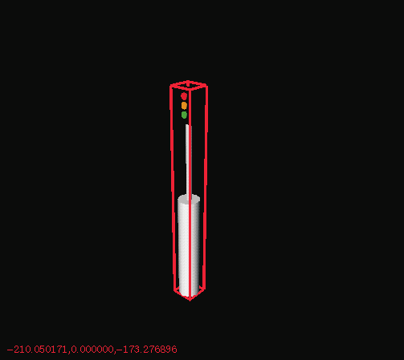
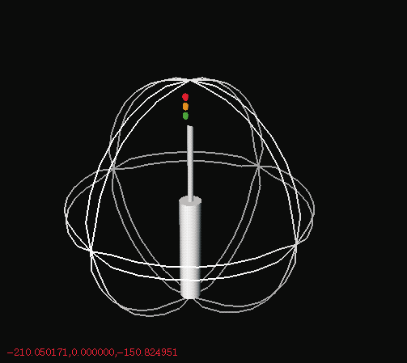
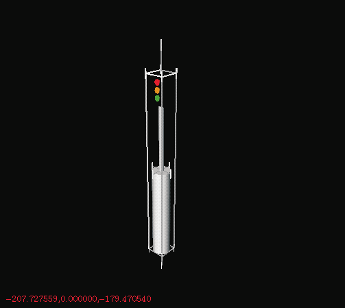
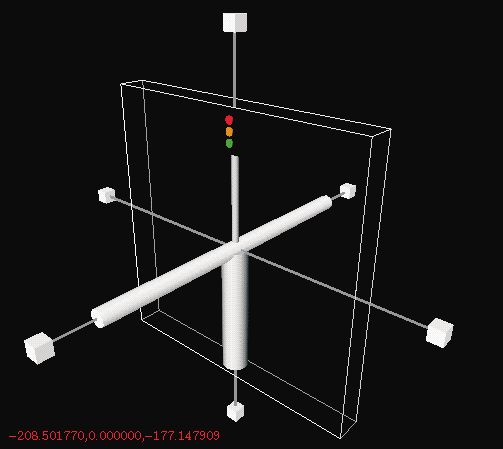
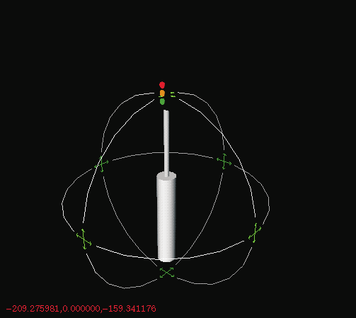
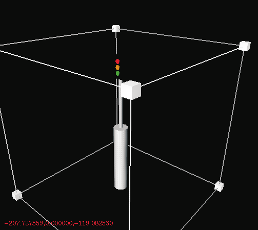
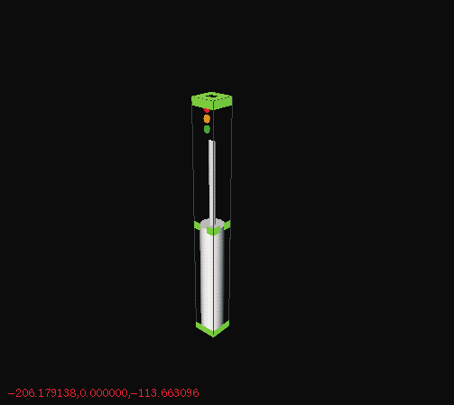

# Chapter 21 — Manipulators

## Overview

A selected object may be manipulated, that is, it may be positioned and oriented relative to other objects. A manipulator is a tool used for visually positioning an object. Manipulators have handles, which are the places the user clicks on in order to modify the selected object.

The types of handles and resulting object modifications depend on the current manipulator. In general, three types of modifications are possible:

- **Translation** — The entire object is translated, that is, moved in the X, Y and/or Z direction(s). Most translation manipulators allow translation in one or two directions. Three-dimensional translation manipulators are not used by HVE.

  > **NOTE:** To move an object in three dimensions, use two different viewers. For example, use the X-Y viewer to move the object to the desired X,Y coordinate, then use the X-Z viewer to move it in the Z direction.

  > **NOTE:** 3-dimensional manipulation in the perspective viewer is not recommended.

- **Rotation** — The entire object is rotated, normally about a single axis of rotation. The specific rotation axis depends on the manipulator.
- **Scale** — The object is scaled (stretched or shortened) in a selected direction.

The specific manipulators available in the 3-D Editor are as follows (see also the code-verified [3-D Editor Menu](../../01-user-interface/3dEditor.md) reference):

- **Direct** — No manipulator is used. Instead, the user clicks directly on the object and moves it.
- **Trackball** — 3-D rotation of the selected object; no translation.
- **HandleBox** — 3-D translation and scaling; no rotation.
- **Jack** — Scales the selected object in all directions. *(updated: the current 3-D Edit menu documentation describes the Jack manipulator as scale-only — no translation or rotation; the legacy manual additionally described 3-D translation and rotation via its axes, which remains available through the Jack's axis handles in the viewer.)*
- **Centerball** — Translates the object center to new X,Y,Z coordinates; rotates the object about the new center.
- **TransformBox** — Scales the object in all directions; translates and rotates the object in the selected direction.
- **TabBox** — Translates and scales the object in the selected plane.

To use a manipulator, perform the following steps:

1. If necessary, start the 3-D Editor with an object (or add a new object).
2. Click on an object (Surface, Box, Cylinder, etc.) to select it. A red bounding box will be displayed around the object to indicate it is selected.
3. Choose Manipulators from the 3-D Edit menu. A cascade menu displays the list of available manipulators.
4. Choose a manipulator (e.g., Trackball) from the list. The selected manipulator will be displayed about the selected object.

   > **NOTE:** The Direct manipulator does not display any handles or pick points; the object itself is used.

5. Manipulate the object using the methods available for the selected manipulator.

Each manipulator performs a specific function or set of functions (translation, rotation and scaling). Each manipulator is described below.

## Direct Manipulator

The Direct manipulator provides 2-dimensional translation in the viewer plane. The Direct manipulator is shown in Figure 21-1.

*Figure 21-1 — Direct Manipulator.*

To use the Direct manipulator, perform the following steps:

1. Click on the object to select it (if necessary). A red bounding box will be displayed around the entire object.
2. Click anywhere on the object and drag the object to a new location. The object is dragged in the viewer plane.

   > **NOTE:** Dragging an object in the perspective viewer often yields unpredictable results because the viewer plane is not explicitly defined by the user.

3. When the object is positioned correctly, release the mouse button.

The object position is updated.

## Trackball Manipulator

The Trackball manipulator provides 3-dimensional rotation of the selected object. The Trackball manipulator is shown in Figure 21-2.

*Figure 21-2 — Trackball Manipulator.*

To use the Trackball manipulator, perform the following steps:

1. Click on the object to select it (if necessary). Three rotation bands will be displayed around the entire object.
2. Click on any of the bands and drag in a tangential direction. The object rotates about an axis normal to the selected band.
3. Click at the intersection of two bands for general rotation.
4. When the object is positioned correctly, release the mouse button.
5. Click and drag on another band to rotate the object about a different axis.

The object orientation is updated.

## HandleBox Manipulator

The HandleBox manipulator provides 3-dimensional translation and scaling of the selected object. The HandleBox manipulator is shown in Figure 21-3.

*Figure 21-3 — HandleBox Manipulator.*

To use the HandleBox manipulator, perform the following steps:

1. Click on the object to select it (if necessary). A 3-dimensional bounding box with several pick points (also called handles) will be displayed around the entire object.
2. Click and drag any of the handles to stretch the object in that direction. When the object is scaled correctly, release the mouse button.

The object dimensions are updated.

## Jack Manipulator

The Jack manipulator provides scaling of the selected object, along with translation and rotation using its axes. The Jack manipulator is shown in Figure 21-4.

*Figure 21-4 — Jack Manipulator.*

To use the Jack manipulator, perform the following steps:

1. Click on the object to select it (if necessary). A set of orthogonal axes (note that one axis has a thick portion) will be displayed with the object at its origin. Pick points (handles) are displayed at each end of the axes.
2. Click and drag any of the handles to stretch (scale) the object in the direction of the axis.
3. Click and drag any of the thin axes to rotate about either of the other axes.
4. Click and drag on the thick portion of the axis to translate the object in the direction of the axis. Release the mouse button when the object has been correctly positioned and scaled.

The object position and scale are updated.

## Centerball Manipulator

The Centerball manipulator provides 3-dimensional rotation of the selected object about a user-defined origin. The Centerball manipulator is shown in Figure 21-5.

*Figure 21-5 — Centerball Manipulator.*

To use the Centerball manipulator, perform the following steps:

1. Click on the object to select it (if necessary). Three rotation bands are displayed with the object at its origin. A set of arrows is displayed where the bands intersect.
2. Click and drag any of the arrows to translate the origin of the object to a new location.
3. Click and drag any of the bands to rotate the object about an axis normal to the band. The object rotates about the new origin. When the object is positioned correctly, release the mouse button.

The object position and orientation are updated.

## TransformBox Manipulator

The TransformBox manipulator provides 3-dimensional translation, rotation and scaling of the selected object. The TransformBox manipulator is shown in Figure 21-6.

*Figure 21-6 — TransformBox Manipulator.*

To use the TransformBox manipulator, perform the following steps:

1. Click on the object to select it (if necessary). A bounding box with handles will surround the object.
2. Click and drag any of the handles to scale the entire object uniformly in all directions.
3. Click and drag any of the edges of the bounding box to rotate the object about an axis parallel to the selected edge.
4. Click and drag any of the sides of the box to translate the object in a plane parallel to the selected side. When the object is positioned correctly, release the mouse button.

The object position, orientation and scale are updated.

## TabBox Manipulator

The TabBox manipulator provides 3-dimensional translation and scaling in the selected plane. The TabBox manipulator is shown in Figure 21-7.

*Figure 21-7 — TabBox Manipulator.*

To use the TabBox manipulator, perform the following steps:

1. Click on the object to select it (if necessary). A bounding box will be displayed around the object with tabs at the corners and middle.
2. Click on any of the tabs to scale in one, two or three directions, depending on the number of sides on the selected tab.

   > **NOTE:** A corner tab has three sides and, therefore, scales in three directions. An edge tab has two sides and scales in two directions. A side tab has one side and scales in one direction.

3. When the object is scaled correctly, release the mouse button.

The object position and scale are updated.

---
*Converted and updated from the legacy HVE User's Manual (Seventh Edition, Jan 2006), Chapter 21; verified against current source code (HVEINV-64, SceneViewer) and the code-verified 3-D Editor menu reference 2026-07-05.*

<!-- NAV -->

---

← Previous: [Chapter 20 — 3-D Editor Object Tools](20-object-tools.md)  |  [Index](README.md)  |  Next: [Chapter 23 — Basic 3-D Editor Tutorial](23-tutorial.md) →

<!-- /NAV -->
