# Chapter 23 — Basic 3-D Editor Tutorial

## Overview

This tutorial contains three basic lessons that describe how to use the HVE 3-D Editor:

- Lesson 1 — Creating a Simple Road Surface
- Lesson 2 — Editing a Surface
- Lesson 3 — Using Groups

> **NOTE:** The Advanced Tutorial chapter referenced by the legacy manual (Chapter 24) is reserved for future use.

Even though HVE's interface uses standard techniques for input and editing, all graphics editors are somewhat different, and HVE's 3-D Editor is no exception. Don't be discouraged if you don't understand something right away. The HVE 3-D Editor is a well-designed program and everything happens for a reason. As these reasons become clear to you, you will learn how things work and predict how something is going to work before you try it; it simply takes a little practice.

> **NOTE:** We assume that HVE is up and running and that you are familiar with HVE's basic features, such as using HVE's dialogs and 3-D viewers, as well as the HVE Human, Vehicle, Environment, Event and Playback Editors. The purpose of this tutorial is to use those basic features to learn how to use the HVE 3-D Editor. For a refresher on these topics, the user is referred to the Using HVE section of this manual.

## Lesson 1 — Creating a Simple Road Surface

This lesson is designed to make you generally familiar with how the 3-D Editor works. In this lesson, you will learn the following:

- Starting the 3-D Editor
- Creating a Simple Road Surface
- Assigning friction characteristics to the surface
- Assigning material and texture attributes to the surface
- Assigning overlay names
- Saving the surface in the case file
- Saving the surface as a unique file

> **NOTE:** We assume HVE is already running and you're ready to begin a new case. If necessary, refer to Chapter 2, Using HVE, for information about starting HVE. Also, check out Chapter 32, HVE Tutorial.

*Figure 23-1 — Environment Information dialog, used to assign physical environment parameters.*

### Starting the 3-D Editor

To start the 3-D Editor, perform the following steps:

1. Choose Environment mode. The Environment Editor is displayed.
2. Click on Add New Object. The Environment Information dialog is displayed (see Figure 23-1, and the [Environment Information reference](../../08-environment/EnvtInfoDlg.md)), allowing you to assign basic environment attributes. Because these attributes are not relevant to building our 3-D environment, let's accept the current values.
3. Press OK. The default environment information is assigned and the Environment Viewer and Editor are displayed, as shown in Figure 23-2.

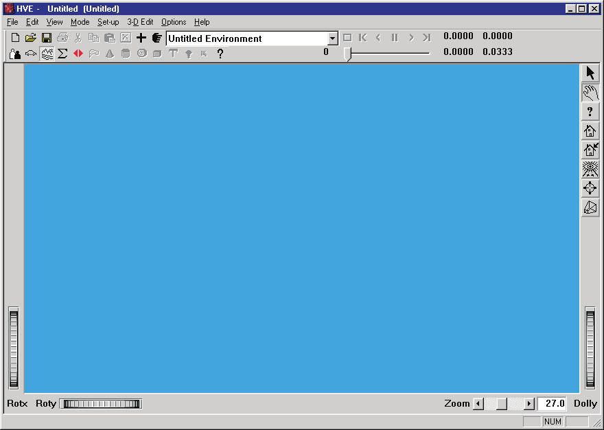
*Figure 23-2 — Environment Editor and 3-D Viewer. No 3-D geometry has been created yet, so the 3-D viewer is empty.*

At this point, the 3-D Viewer is empty because no geometry file was specified. In our first tutorial, we'll create one.

To create a geometry file, we need to start the HVE 3-D Editor:

1. Select 3-D Edit on the main menu and then select Launch 3-D Editor on the cascade menu *(or press Ctrl+L)*.

The 3-D Editor is displayed. Its basic components are the four viewers (X-Y, X-Z, Y-Z and Perspective), the 3-D Editor dialog and the Current Object Tool dialog (when first started, the Edit Tool is displayed). These components are shown in Figure 23-3.

*(updated: you can also choose 3-D Edit, Viewer to display the Viewer Options dialog and select which viewer layout is shown — a single XZ, YZ, XY or Perspective viewer, or All four at once.)*

Typically, you will want to arrange these components to suit your personal needs. To move a dialog or viewer, click on its title bar and drag it to the desired location.

> **NOTE:** Because most of your work will probably be done using the X-Y viewer (lower left) and Perspective viewer (lower right), you may find it convenient to keep the lower area of the screen clear. Therefore, you should position the Object Attributes dialog near the top of the screen.

We're now ready to begin working on our single-surface environment.

*Figure 23-3a — 3-D Editor, including 4 viewers (X-Y, X-Z, Y-Z and Perspective).*

*Figure 23-3b — 3-D Editor, Current Object Editor.*

*Figure 23-4 — Line drawing showing the crowned road surface we wish to create using the 3-D Editor. Each lane drops 0.5 feet over its 12-foot width. Vertex coordinates: (0,0,0), (0,12,0.5), (200,12,0.5), (200,0,0) for one lane, and (0,-12,0.5), (200,-12,0.5) for the other.*

### Creating a Simple Road Surface

The diagram of the road surface we wish to create is shown in Figure 23-4. It consists of two individual surfaces, each with four vertices. Like most roads, the surface is crowned slightly. The coordinates are also shown in Figure 23-4.

> **NOTE:** At a minimum, you should always create a crowned road surface, if one exists, to take advantage of HVE's core 3-D functionality!

To create the surface, perform the following steps:

1. Click on the Surface Tool icon on the toolbar. The Surface Editor is now enabled (see Figure 23-5), ready to begin creating a surface.

The Surface Tool dialog includes X,Y,Z coordinate fields and Roll, Pitch, Yaw orientation fields. Beneath these on the left side is the Local/Global option switch. On the right side, the Surface Tool dialog includes the Pick Mode radio buttons and the Add, End, Rev Nrml and Dec/Tes buttons. See [Chapter 20](20-object-tools.md) and the [Surface Editor reference](../../08-environment/SurfEdDlg.md) for a detailed description of each of these features. *(updated: the "Bind To" radio buttons mentioned in the legacy manual are no longer part of the Surface Editor; a Subdivide pick mode and a Dec/Tes (Decimate/Tessellate) button have been added. The editor starts in Vertex mode, ready for vertex entry.)*

*Figure 23-5 — Surface Tool dialog, used for entering and editing 3-D surfaces.*

Let's create the surface. To enter the coordinates for the first surface, perform the following steps:

1. Place the cursor in the Surface Tool's X-coordinate field and press Enter.

Pressing Enter causes the X,Y,Z coordinates to be accepted, and the first vertex will appear in the viewers at 0,0,0. A small, bright marker is displayed at the location of the first vertex.

> **NOTE:** The X,Y,Z coordinates default to 0,0,0. Because these are the desired values, they need not be entered. Simply pressing Enter creates the vertex at the current location.

Let's continue entering the other three vertices. To enter the second vertex, perform the following steps:

1. Enter 12.0 (do not press Enter yet) in the Y coordinate field, and 0.5 in the Z coordinate field.
2. Press Enter to create the vertex at 0, 12, 0.5.

A vertex will appear in the viewer at the desired location of the second vertex.

> **NOTE:** The default X value remains at 0.0, from our previous vertex.

3. Enter 200.0 in the X coordinate field, followed by Enter.

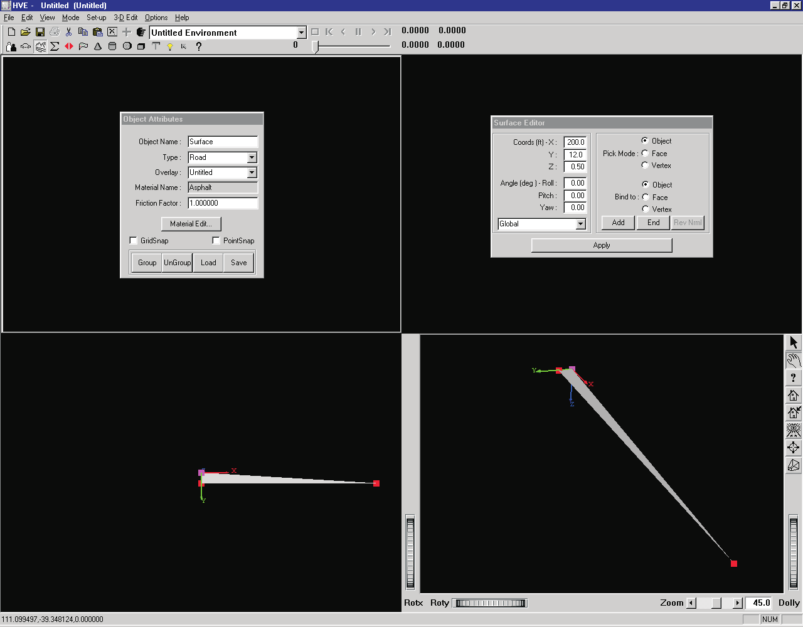
*Figure 23-6 — Creating the first surface, shown after entering the first three vertices.*

The vertex is displayed for the third coordinate at 200, 12, 0.5. See Figure 23-6 for an in-progress view of our first surface.

> **NOTE:** Again, note the Y and Z coordinates remain unaltered from their previous values.

4. Enter 0.0 in the Y coordinate field and 0.0 in the Z coordinate field, followed by Enter.

All four vertices for the first surface have been entered. To create the surface, click the Surface Tool's End button. The surface is displayed, as shown in Figure 23-7.

> **NOTE:** The vertices were entered in counter-clockwise order. Thus, according to the right-hand rule, the positive side of the surface is facing up. This is important! The simulation's tire model will generally not recognize any surfaces with the positive side facing down.

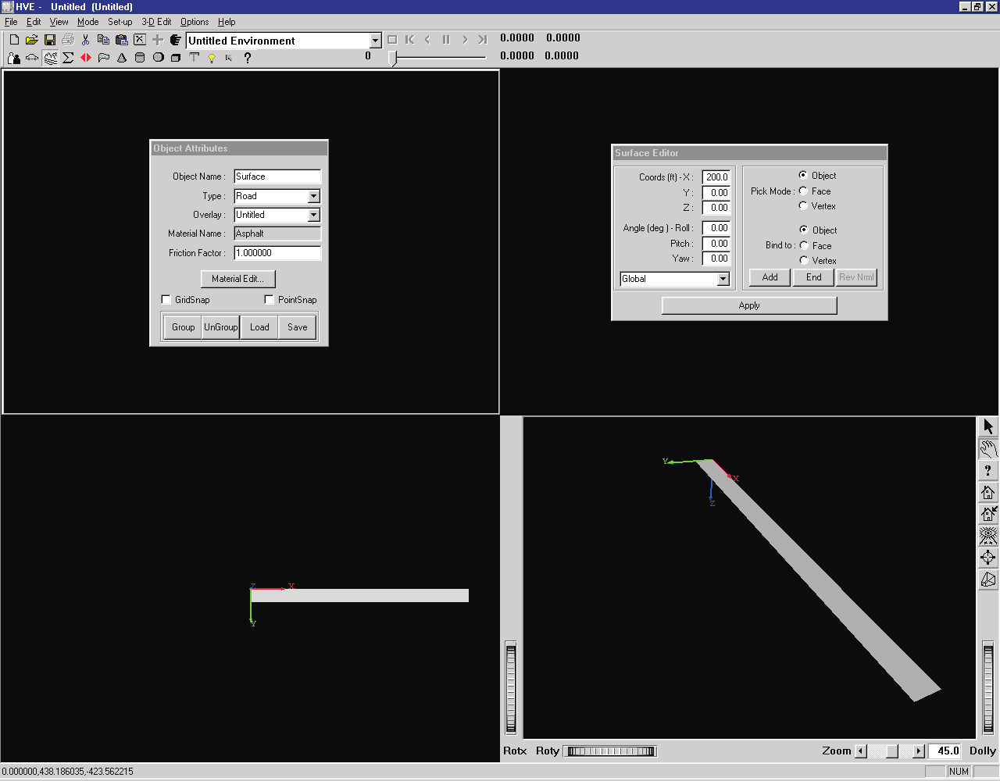
*Figure 23-7 — 3-D Editor Perspective viewer after creating the first surface.*

Let's create a second surface next to the first surface:

1. Place the mouse cursor in the X-coordinate field and press Enter to accept and display the first vertex at 200,0,0.

   > **NOTE:** The starting coordinate for the second surface is the same as the last-entered coordinate for the first surface. This is often the case, and always saves a little time.

2. Enter -12.0 in the Y coordinate field, and 0.5 in the Z coordinate field, followed by Enter to accept and display the next vertex at 200,-12,0.5.
3. Enter 0.0 in the X coordinate field, followed by Enter to accept and display the next vertex at 0,-12,0.5.

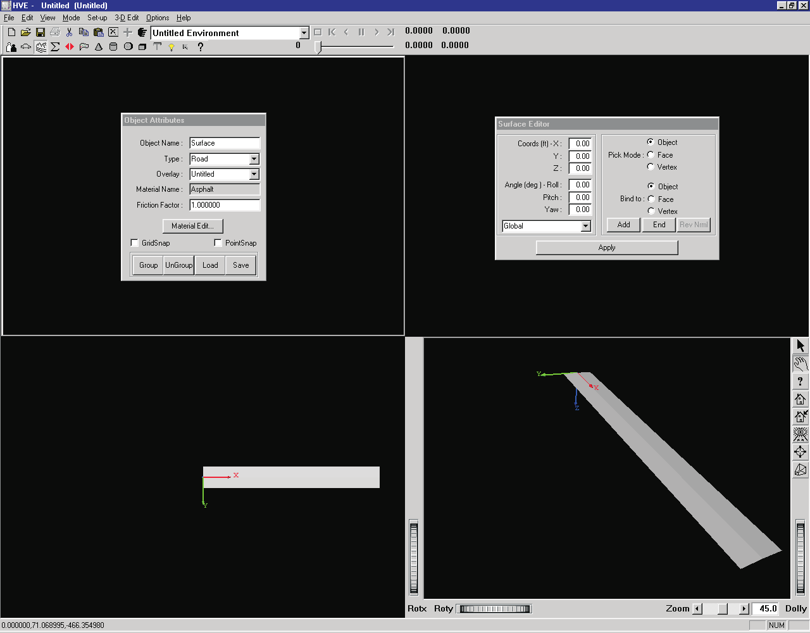
*Figure 23-8 — 3-D Editor Perspective viewer after creating the second surface.*

4. Enter 0.0 in the Y-coordinate field and 0.0 in the Z-coordinate field, followed by Enter, to display the fourth vertex at 0,0,0.
5. Press the End button in the Surface Editor dialog.

The red vertex icons disappear and the second surface is displayed in the viewers, as shown in Figure 23-8.

Our surface object is complete, so let's edit the surface:

1. Click on the Edit tool icon on the toolbar.

The Surface Tool is closed and the object is selected (as indicated by the red box surrounding it) and ready for editing.

Let's edit the surface by assigning friction characteristics and material attributes.

*Figure 23-9 — The Object Attributes dialog is used for assigning surface friction properties.*

### Surface Friction

The friction characteristics are defined by two parameters:

- Object Type
- Friction Multiplier

These parameters are assigned using the 3-D Editor.

#### Object Type

The main object types available for environment objects are Road, Friction Zone and Other *(updated: Curb and Water types are also available in the current version; see the [Object Attributes reference](../../01-user-interface/ObjAttrDlg.md))*. The default type is Road, and that's what we want, so no action is required.

> **NOTE:** The selection of Road and Friction Zone object types establishes a hierarchy used by simulations: by default, all Friction Zone objects are searched first, then Road objects. Thus, if both a Friction Zone and a Road object exist beneath a tire, the Friction Zone will be used.

> **NOTE:** Simulations ignore objects of type Other.

Lesson 2 in this tutorial discusses object hierarchy. See also [Chapter 19, Using the HVE 3-D Editor](19-using-3d-editor.md), for more information about object types.

#### Friction Multiplier

The friction multiplier is a user-entered value that modifies the dependent tire friction properties for every tire driving on a particular polygon. Thus, it may be used to increase or decrease the peak and slide friction properties for each tire that travels on that surface. In our example, let's assume the surface is well-traveled asphalt having 95 percent of the friction properties that were measured for the tires on a flat-bed tire tester. To change the friction properties for the surface, perform the following steps:

1. First, confirm the object is selected (as indicated by the red bounding box surrounding the object). If it is not selected, you can select the road surface by clicking on it.
2. Place the mouse cursor in the Friction Factor field and change the default Friction Factor to 0.950 from 1.000, followed by Enter. Then click on the Apply button (see Figure 23-9).

   > **NOTE:** Be sure to press Enter and click the Apply button; otherwise the new value will not take effect.

The surface friction is now reduced to 95 percent of the original tire's peak and slide friction, as shown in Table 23-1.

**Table 23-1 — Tire friction properties, as modified by the current Friction Factor.** As each tire travels onto a new surface, its peak and slide friction properties are modified according to the surface's Friction Factor.

| Surface | mu-peak (used by tire model) | mu-slide (used by tire model) |
|---|---|---|
| Normal (Factor = 1.0) | 0.930 | 0.732 |
| Modified (Factor = 0.95) | 0.884 | 0.695 |

*Figure 23-10 — Material Color Editor (left) and Texture Editor (right).*

### Assigning Material and Texture Attributes

An object's material attributes (color, intensity, and other factors affecting its appearance) are edited using the Material and Texture Editors. The default material is light gray in color. Let's change its appearance by assigning a texture to the surface.

To change the material attributes, perform the following steps:

1. First, confirm the object is selected (as indicated by the red bounding box surrounding the object). If it is not selected, you can select the road surface by clicking on it.
2. Choose the 3-D Edit menu option in the main menu bar, and click on Material Color or Material Texture. The Material Editor and Texture Editor dialogs are shown in Figure 23-10.

Note the Material Editor includes sliders for the Material Appearance attributes and an example viewer demonstrating the present appearance of a selected object. To change the color of an object, click on the Color radio button for the attribute (typically Diffuse) and a color wheel dialog will be displayed. The present color is indicated by the small box located on the color wheel. The Texture Editor includes a list of available textures and also attributes that affect the texture's appearance.

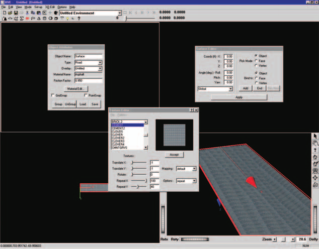
*Figure 23-11 — Road surface after applying a texture.*

Let's add a texture to the surface:

1. Select the object and then choose 3-D Edit and Material Texture. The Texture Editor dialog will be displayed.
2. Choose Cement from the list of available textures. Cement is displayed in the Texture Window.
3. Press Accept. The concrete texture is applied to our road surface.

Although the texture has been applied, it is blurry. The texture is out of focus because it has been stretched over a very large surface. To improve the appearance, we need to edit the Texture Attributes using the Texture dialog:

1. Change Repeat X to 100 from 1.0.
2. Change Repeat Y to 40 from 1.0.
3. Press Accept. The texture now looks much better.

> **NOTE:** The Advanced Tutorial chapter with an in-depth discussion of textures is reserved for future use; see the Texture Editor section of [Chapter 19](19-using-3d-editor.md) in the meantime.

The resulting road surface is displayed in Figure 23-11.

4. Click on the Close dialog control button (upper right corner) to close the Texture Editor.

### Assigning an Overlay Name

Overlays are used to improve your efficiency as an HVE user. Because all 3-D objects take time to render, it makes sense to allow the user to select certain objects for rendering, and deselect other objects that are not important for the current task.

> **NOTE:** The most obvious time to use overlays is during Event mode. Because you are executing a simulation that relies on physical surfaces, it makes sense to select those surfaces that are involved in the physical interaction with humans and vehicles, and deselect all other objects to reduce rendering time. This can greatly speed up your work during Event mode. Then, during Playback mode, while creating your video, you can turn these overlays back on before rendering your final simulation sequence.

> **NOTE:** Even though an object is not rendered if its overlay is turned off, its surface geometry is still used by the tire model. In other words, your vehicle would be driving up on the embankment, even though you could not see the embankment.

Overlays are created using the Object Attributes dialog. When you create any object, it is assigned to the current overlay, according to the current overlay name.

> **NOTE:** The default overlay is named Untitled. The Untitled overlay is just like any other overlay.

Overlay names are assigned by editing the current Overlay Name. Let's change the overlay name of our road surface from Untitled to Road:

1. Place the mouse cursor in the Overlay field and replace the existing overlay name, Untitled. Enter: Road, followed by Enter.

   > **NOTE:** You must press Enter; otherwise the name will not be assigned. See Chapter 32, HVE Tutorial, for more information about entering data in modeless dialogs.

The new name is displayed in the Overlays combo box, as shown in Figure 23-12.

In order to turn overlays on or off, we will need to first deselect the objects displayed in the 3-D Editor.

2. Move the cursor to a location not over any objects and click the left mouse button. The red bounding box disappears.

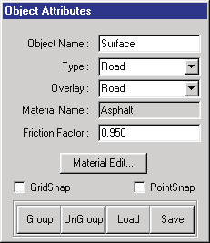
*Figure 23-12 — The 3-D Editor dialog after adding our new overlay, named Road. Clicking on the combo box's button displays all the overlays in the current environment.*

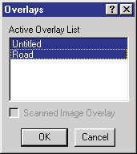
*Figure 23-13 — Overlays dialog, showing all the overlays selected in our current case.*

Because we assigned a unique overlay name, we can choose to render, or not render, the Road object we just created using the Overlays dialog, selectable from the View menu (see the [Overlays reference](../../01-user-interface/OverLayDlg.md)). Let's illustrate this point:

1. Click on the View option in the HVE menu bar, and choose Overlays. The Overlays dialog is displayed, as shown in Figure 23-13. Note that Road is in the Active Overlays list, and it is selected (highlighted). Let's turn off the Road overlay:
2. In the Active Overlays list, click Road to deselect it.
3. Press OK.

The Overlays dialog is removed, and our 3-D Editor viewers are empty! Let's not leave it this way:

1. Click View in the HVE menu bar, and choose Overlays. The Overlays dialog is displayed.
2. Select Road.
3. Press OK.

The road surface is again displayed in the 3-D viewers.

> **NOTE:** This is a rather trivial example of the use of overlays. This single surface is rendered faster than we can comprehend. However, if we were rendering a scene with an overlay containing a million polygons, turning that overlay on and off would make a huge difference in rendering time (and therefore, productivity!).

### Saving Your Work

Now, let's save our work. Two methods may be used:

- Saving it in the case
- Saving it as a 3-D geometry file

The benefits of these two methods are described below.

#### Saving The Object In The Case File

Saving the object in the case actually embeds the geometry in the case file. The next time you open the case, the geometry is automatically included in that case. Also, if you create a copy of the case and give it to another HVE user, that person's case file also includes the embedded geometry. This, of course, is essential because the geometry is a physical surface used during event execution.

To save the object in the case file, perform the following steps:

1. Choose the File menu option in the main menu bar, and choose Save As. The File Selection dialog is displayed, prompting you to enter a case title and filename.
2. First, enter a case title. This title appears as a heading on all your printed output reports. Enter: My First Road.
3. Next, enter a filename. This is the name of the case file that stores all the case information. Enter: 3dEdTutor1.
4. Click on Save.

The case is now saved, and the 3-D geometry is part of the case.

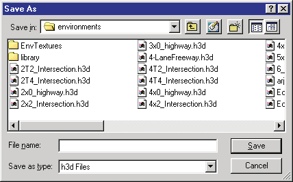
*Figure 23-14 — File Selection dialog, used for loading and saving 3-D geometry files.*

#### Saving The Object As A Unique File

What if you wanted to use your newly created environment in other cases? The best way would be to simply give it a unique filename. To save your environment by a unique filename, perform the following steps:

1. First, close the 3-D Editor by selecting 3-D Edit on the main menu and choosing Close 3-D Editor on the cascade menu. The 3-D Editor is closed, revealing the Environment Editor and Viewer with your road surface.
2. Click on the Object Info button on the toolbar. The Environment Information dialog is displayed (shown earlier in Figure 23-1), allowing us to view and edit the current environment attributes. Note we also use this dialog for opening and saving 3-D geometry files.
3. Click on Save As. The File Selection dialog is displayed, allowing us to save our geometry using the desired file format and filename (see Figure 23-14).
4. Click on the Format option list to display the available file formats, and choose HVE.

   > **NOTE:** Only HVE is currently supported for saving files.

5. Enter a filename for the 3-D geometry file. Enter: TutorEnvLesson1.

   > **NOTE:** There is no need to supply an extension, because HVE will automatically supply the .h3d extension.

6. Click OK in the File Selection dialog. The file is now saved in the `...\hve\supportFiles\images\environments` subdirectory.
7. Click OK in the Environment Information dialog.

We are now ready to continue.

### Ending the Session

The last thing to do is end the session. This is done using the File menu:

1. Choose the File menu option in the main menu bar, and click on Exit. You are asked if you would like to save your changes.
2. Choose Yes.

> **NOTE:** It is always safest to save your file, unless you are certain you will not need it again.

HVE has now shut down.

### Summary

This concludes Lesson 1 — Learning the Basics. You should now be familiar with starting the 3-D Editor, creating simple surfaces, applying surface friction attributes and material textures, and saving your 3-D geometry.

## Lesson 2 — Editing a Surface

This lesson is designed to teach you how to edit existing surfaces using the 3-D Editor. In this lesson, you will learn the following:

- Moving vertices
- Reversing surface normals
- Changing object hierarchy

> **NOTE:** We assume HVE is already running and you have completed Lesson 1 — Creating a Simple Road Surface. If you have not finished Lesson 1, you should do that before continuing with this lesson.

Surface editing tasks are performed for a variety of reasons. Examples include correcting errors that occurred when the surface was created and modifying an imported geometry file. In any case, the surface editing procedures are important to learn and use.

In Lesson 2, we will start with the 3-D geometry file we created in Lesson 1, so let's begin by loading that file:

1. If necessary, switch to Environment mode. The Environment Editor is displayed.
2. Click Add New Object. The Environment Information dialog is displayed.
3. Choose Open. The Environment Geometry File Selection dialog is displayed.
4. Select TutorEnvLesson1.h3d and press OK. The File Selection dialog disappears.
5. Press OK again. The Environment Information dialog disappears and the selected environment is displayed in the Environment 3-D viewer.

Spend a few moments manipulating the viewer to look at various views of the simple road surface we created in Lesson 1.

Now we're ready to edit the surface geometry. Editing 3-D geometry is always performed using the 3-D Editor, so let's start the editor:

1. Select 3-D Edit and choose Launch 3-D Editor. The 3-D Editor is started with our simple road surface displayed in each of the four viewers.
2. Arrange your desktop to your liking.

   > **NOTE:** Remember that most of the editing is usually performed using the perspective viewer in the lower right and X-Y plane viewer in the lower left. With this in mind, you'll probably want to position your dialogs in the top portion of the desktop.

Now, we're ready to begin editing our simple surface.

### Moving Vertices

In Lesson 1, we created a simple road surface. Now, we'll edit that road to create a larger road. Our original road was 200 feet long and 24 feet (2 lanes) wide. Let's make it 2000 feet long and 4 lanes wide, plus a 4-foot wide median (making the total width 52 feet).

> **NOTE:** It is common for beginners to make the environment too small. It is normally just as easy, especially for straight roads, to make the road as long as possible; there's really no reason to artificially shorten it!

Let's begin editing the surface:

1. Confirm the 3-D Editor is in Edit mode (see Figure 23-15).
2. Confirm the perspective viewer is in Pick mode (i.e., the crosshairs cursor is displayed when the mouse is in the perspective viewer).
3. Click on the surface in the perspective viewer. A red bounding box surrounds the object, indicating it is now selected for editing.

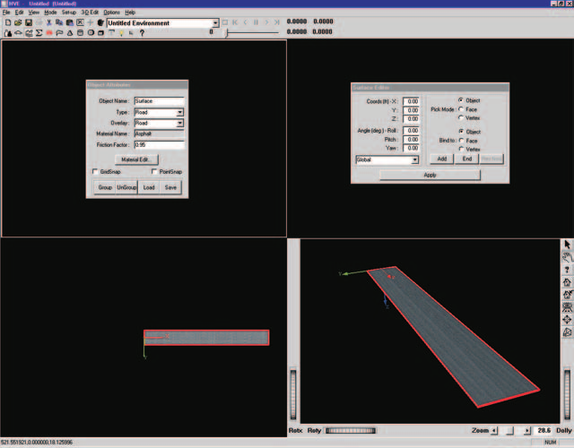
*Figure 23-15 — 3-D Editor, ready to edit our simple surface.*

The Surface Editor dialog is displayed, showing the current coordinates for the surface object.

> **NOTE:** The current coordinates and orientation are both 0,0,0. This is initially the case for all objects. When the object is moved from its original position, the coordinates and/or orientation will change.

The Surface Editor dialog also displays the current Pick mode. The default is Object. To edit the vertices, the Surface Editor must be in Vertex Pick mode:

1. Click the Vertex radio button.

Now we're ready to edit vertices. Let's start by editing the vertex at the origin:

1. Click near the origin inside the red bounding box. A vertex manipulator is displayed for the selected vertex and the vertex coordinates, 0,0,0, are displayed in the Surface Editor dialog's coordinate fields. See Figure 23-16.

   > **NOTE:** If you click outside the bounding box, you'll deselect the surface.

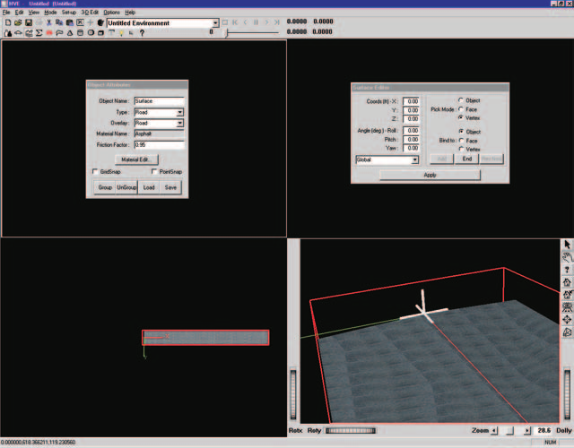
*Figure 23-16 — Simple surface, after zooming in and selecting the vertex near the origin.*

Let's edit the vertex coordinates:

1. Enter -1000.0 ft in the X field, followed by Enter. The vertex is repositioned at -1000,0,0 (see Figure 23-17).
2. Click the vertex inside the red bounding box near 0.0, 12.0, 0.5. A vertex manipulator is displayed for the selected vertex and the vertex coordinates are displayed.

   > **NOTE:** Again, remember to click inside the bounding box; otherwise you'll deselect the surface.

Edit the vertex coordinates:

3. Enter -1000 in the X field and 26 in the Y field, followed by Enter. The vertex is repositioned at -1000, 26, 0.5.

Edit the remaining vertices using the same procedures:

4. Click the vertex near 200,12,0.5 and change its X coordinate to 1000 and its Y coordinate to 26 (remember to press Enter).
5. Click the vertex near 200,0,0 and change its X coordinate to 1000.

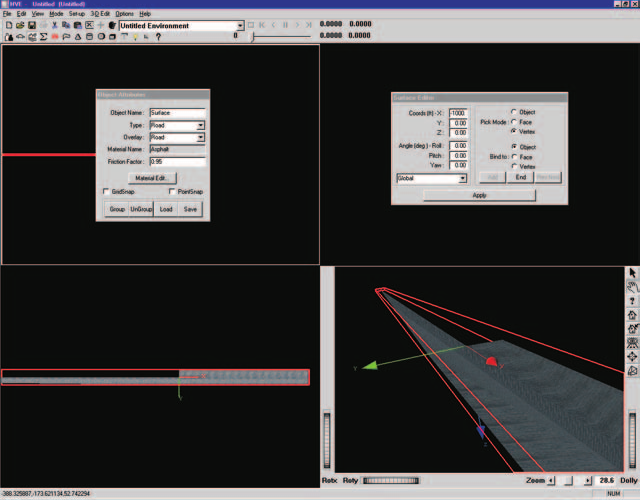
*Figure 23-17 — Simple surface after moving the first vertex from 0,0,0 to -1000,0,0.*

Half the surface has been edited. Let's repeat the steps to edit the other side. If necessary, adjust the view so it appears somewhat like Figure 23-18. Then edit as follows:

1. Click near the origin. The vertex at 0,0,0 is selected.

   > **NOTE:** Since the vertex is not displayed until it is selected, you need to estimate where the vertex is located and click in that vicinity.

2. Edit the X value, changing it to -1000, followed by Enter.
3. Click near the vertex near 200,0,0 (see Figure 23-19) and change its X coordinate to 1000.
4. Click near the vertex at 200,-12,0.5 and change its X coordinate to 1000 and its Y coordinate to -26.
5. Click near the vertex at 0,-12,0.5 and change its X coordinate to -1000 and its Y coordinate to -26.
6. Click outside of the bounding box. The editing operation is completed and the surface is deselected.

The resulting surface is displayed in Figure 23-20.

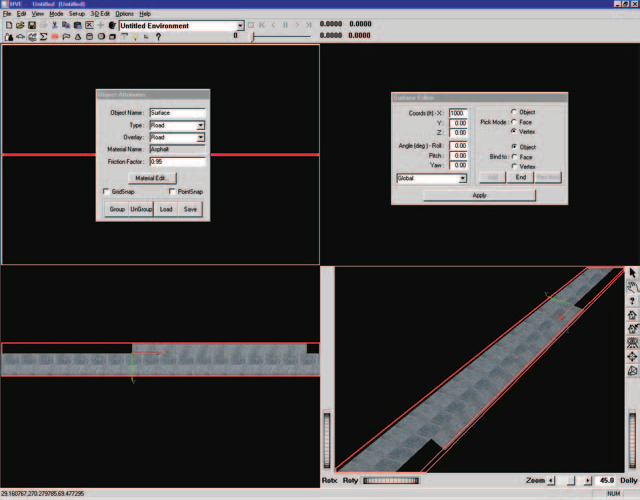
*Figure 23-18 — Simple surface after editing half the surface; the view has been adjusted to get better access to the remaining surface.*

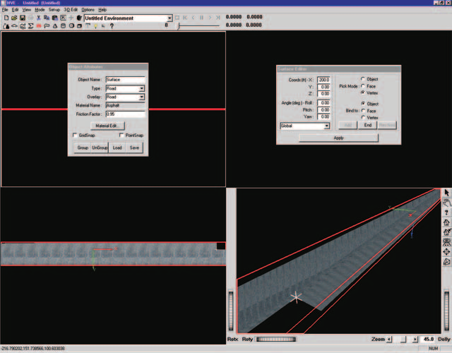
*Figure 23-19 — Simple surface with vertex at 200,0,0 selected, ready to move to 1000,0,0.*

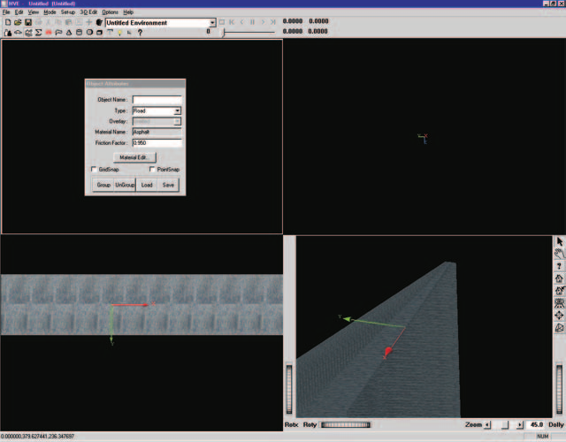
*Figure 23-20 — Simple surface after editing is complete.*

### Reversing Surface Normals

Each 3-D surface has a (+) side and a (-) side. The surface's (+) or (-) side is determined by the direction of its surface normal. As shown in Figure 23-21, a surface normal is a vector drawn perpendicular to a specific location on the surface. The direction is determined using the right-hand rule according to the order in which the vertices were entered. Vertices must be entered in counter-clockwise order to establish that the positive side is facing you as you view the surface.

If you accidentally enter the vertices in the wrong order, the wrong side of the surface will be rendered. In addition, a tire will not see the surface and will fall through it.

> **NOTE:** Vehicles can drive only on the (+) side of a surface.

> **NOTE:** Some CAD programs (namely AutoCAD Release 13 and earlier) do not assign surface normals in a consistent manner. Thus, you may experience difficulty with the direction of the surface normals after importing files from these programs.

The HVE Surface Editor allows you to change the direction of the surface normals for every face. Let's illustrate this process using the surface we're currently working on. Start by adding a new surface:

1. Choose the Surface tool. The Surface Editor dialog is displayed.

Let's create a Tee intersection by adding another road surface:

2. Enter X = -20 ft, Y = 26 ft, Z = 0.5 ft. Press Enter to create the first vertex.
3. Enter X = 20 ft, Y = 26 ft, Z = 0.5 ft. Press Enter to create the second vertex.
4. Enter X = 20 ft, Y = 500 ft, Z = 25 ft. Press Enter to create the third vertex.
5. Enter X = -20 ft, Y = 500 ft, Z = 25 ft. Press Enter to create the fourth vertex.
6. Press End to create the surface.

Where is our surface? It's right in front of us — it's just upside down, so we can't see it! Change the view as required to look on the under side of the surface, as shown in Figure 23-22. You will find it is indeed there. We need to turn it over:

1. Choose Edit mode by clicking the Edit Tool button on the toolbar. A red bounding box is displayed around the object, indicating it is selected.

*Figure 23-21 — Surface normal. The example shows a single surface object composed of a single face set containing five triangles, created by clicking points 1 through 5 in counter-clockwise order. The normal is perpendicular to the triangle composed of points 2, 3 and the computed center point.*

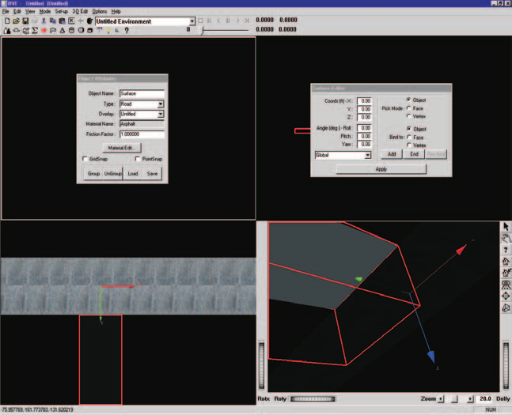
*Figure 23-22 — Upside-down surface, revealed by turning the view over and finding the texture attached to the under side.*

The Surface Editor's Pick Mode is currently set to Object. To edit a face, we need to pick a face:

1. Click the Face Pick Mode radio button. Nothing happens yet, because we need to pick a face.
2. Click on the surface somewhere inside the bounding box. A face is selected and a vector is displayed where we clicked. This vector is the surface normal (see Figure 23-23).
3. Click Rev Nrml. The surface is reversed, as shown in Figure 23-24.

> **NOTE:** In some imported DXF files, you may have thousands of polygon faces that need to be edited. In addition, the DXF file information has the vector reversed, so it always shows the NEGATIVE direction! EDC has some advanced tricks that will solve these problems, so please contact EDC Technical Support if you need assistance.

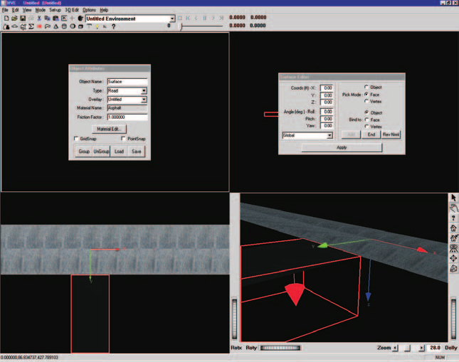
*Figure 23-23 — Upside-down surface with normal vector displayed. Note the vector is pointing down (in the wrong direction).*

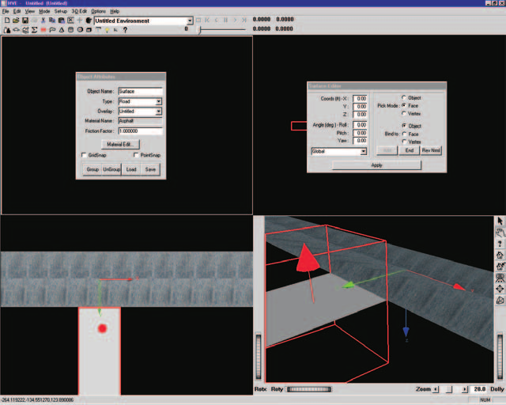
*Figure 23-24 — Surface after reversing the direction of the surface normal.*

### Changing Object Hierarchy

Objects (surfaces, spheres, etc.) created using the 3-D Editor have a hierarchy; that is, they have an ordered relationship to each other (kind of like the relationship between a computer file system's directory, that directory's sub-directories, and each sub-directory's subdirectories, and so on, and so on...).

As a user of HVE, you don't need to be aware of object hierarchy, with two exceptions:

- Creating grouped objects (this is the subject of the next lesson in this tutorial), and
- Understanding how a vehicle's tire chooses which surface to drive on.

When an HVE-compatible simulation is executed, the tire model uses an HVE function, called `GetSurfaceInfo()`, to determine the elevation, surface normal and material attributes (e.g., friction) of the surface beneath the tire. If two or more surfaces exist beneath the tire, HVE uses the hierarchy to determine which surface to use. The subject of hierarchy is described in detail in [Chapter 20](20-object-tools.md), and will not be described further. However, we'll illustrate the issue with a simple example.

Let's create a raised median for our 4-lane highway:

1. Click on the Box Tool icon on the toolbar. The Box Editor is displayed, as shown in Figure 23-25.

A 10x10x10 box is placed at the earth-fixed origin. It is covered with the current Concrete texture, which is just fine.

2. Using the Box Editor dialog, change the current length to 1996 ft, the width to 4 ft, and the height to 1 ft.
3. Press Enter or click on Apply to implement your new dimensions.
4. Click on the 3-D Edit menu option and choose Material Color. The Material Editor dialog is displayed.

Let's change the color of the median to yellow (we're going to do some more with this median in Lesson 3):

5. Using the Material Editor dialog, click on the radio button for Diffuse Color. The color wheel dialog for Diffuse Color is now displayed.
6. Click in the bright yellow area of the color wheel. Close the color wheel dialog by clicking on the close dialog button.

Edit the color attributes:

7. Change the Diffuse Color to 1.00, the Specular Color to 0.50 and the Shininess to 0.50. The median becomes yellow, as shown in Figure 23-26.

There's only one problem with what we've done: if you execute an event on this road, you'll find that a vehicle drives right through the median; its tires don't respond to it. This happens because the road was created first, so `GetSurfaceInfo()` finds it first, and the tire never sees the median at all. Let's quickly solve this problem:

1. Using the Object Attributes dialog, click on the Type option list (see Figure 23-27) and change the Type from Road to Friction Zone.

Now the tire will respond to the median.

> **NOTE:** When the simulation is executed, it loads all Friction Zone objects before loading Road objects. Therefore, `GetSurfaceInfo()` returns the information about the median.

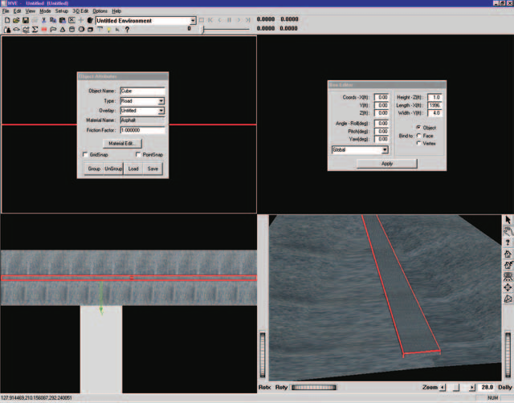
*Figure 23-25 — Creating a raised median using the Box Tool.*

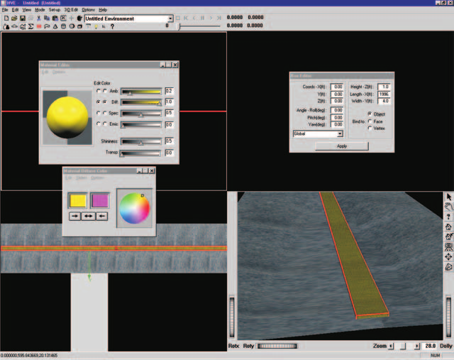
*Figure 23-26 — Environment after adding a raised median and assigning yellow concrete material attributes.*

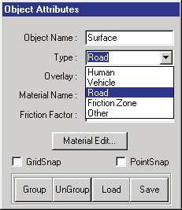
*Figure 23-27 — 3-D Editor dialog with Object Type option list displayed.*

Let's save our work for use in Lesson 3. Using the method described in Lesson 1 (refer back to Lesson 1 if you need a quick refresher), save your 3-D geometry file as a unique file named TutorEnvLesson2.

### Summary

This concludes Lesson 2 — Editing a Surface. You should now be familiar with vertex editing, reversing surface normals and changing object hierarchy. You may either shut down HVE or continue with Lesson 3 — Using Groups.

## Lesson 3 — Using Groups

This lesson describes the use of grouped objects in the 3-D environment. In this lesson, you will learn the following:

- Creating a Grouped Object
- Ungrouping a Grouped Object
- Saving a Grouped Object in a Library
- Using a Grouped Object from a Library

> **NOTE:** We assume HVE is up and running and that you have already completed Lesson 1 — Creating a Simple Road Surface, and Lesson 2 — Editing a Surface. If you have not finished those lessons, you should do that before continuing.

Grouped objects, or simply groups, are objects that are assembled from two or more individual objects. When manipulated, they act as a single unit. Examples of grouped objects include:

- Telephone Pole (vertical pole with one or more horizontal crossbars)
- Tree (vertical pole with branches and leaves)
- Sign (pole(s) with a rectangular placard)
- Traffic Cone (cone with rectangular, horizontal base)
- Fire Hydrant (vertical cylinder, several lateral cylinders, topped with a sphere)

One of the greatest benefits of using groups is that the entire object is positioned at once. For example, while placing a sign at an intersection, it is not necessary to position pole and placard separately. This is a great time saver, especially for complex objects composed of many parts. The use of grouped objects should become a common and frequent task while using the 3-D Editor.

In Lesson 3, we will start with the environment we created in Lesson 2:

1. If necessary, switch to Environment mode. The Environment Editor is displayed.
2. Click Add New Object. The Environment Information dialog is displayed.
3. Choose Open. The Environment Geometry File Selection dialog is displayed.
4. Select TutorEnvLesson2.h3d and press OK. The File Selection dialog disappears.
5. Press OK again. The Environment Information dialog disappears and the selected environment is displayed in the Environment 3-D viewer.

Spend a few moments manipulating the viewer to look at various views of the environment.

Now we're ready to edit the geometry. Editing 3-D geometry is always performed using the 3-D Editor, so let's start the editor:

1. Select 3-D Edit on the menu and Launch 3-D Editor. The 3-D Editor is started with our simple road surface displayed in each of the four viewers.
2. Arrange your desktop to your liking.

   > **NOTE:** Remember that most of the editing is usually performed using the perspective viewer in the lower right and X-Y plane viewer in the lower left. With this in mind, you'll probably want to position your dialogs in the top portion of the desktop.

Now, we're ready to begin.

### Creating a Grouped Object

In Lesson 2, we created a simple raised median. Let's extend that object by adding a raised grass section in the center and circular concrete end caps at both ends. We'll also make it shorter and copy it to both sides of the Tee intersection.

Start by making the median shorter:

1. Arrange your viewer so the median is easily selectable, as shown in Figure 23-28.
2. Click on the median. A bounding box is displayed around it, indicating it has been selected. The Box Editor dialog is also displayed.
3. Change the length to 496 from 1996 ft (remember to press Enter). The median length is updated.

Now, let's put the concrete end caps on both ends:

1. Click on the Cylinder Tool icon on the toolbar. The Cylinder Editor dialog is displayed.
2. Change the default radius to the desired value, 2 ft, and the default length to 1 ft (remember to press Enter).
3. Edit the cylinder's position by changing its X coordinate to 248 ft. The cylinder is displayed at one end of the median, but its orientation is incorrect.
4. Change the default roll angle, 0 degrees (about the X axis), to 90 degrees.

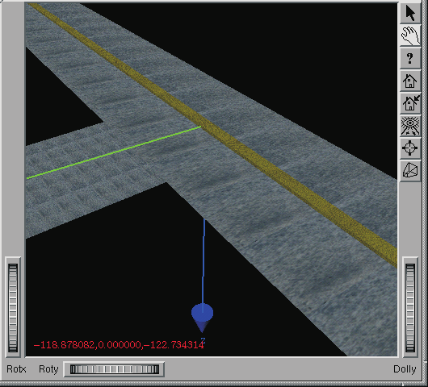
*Figure 23-28 — Environment from Lesson 2.*

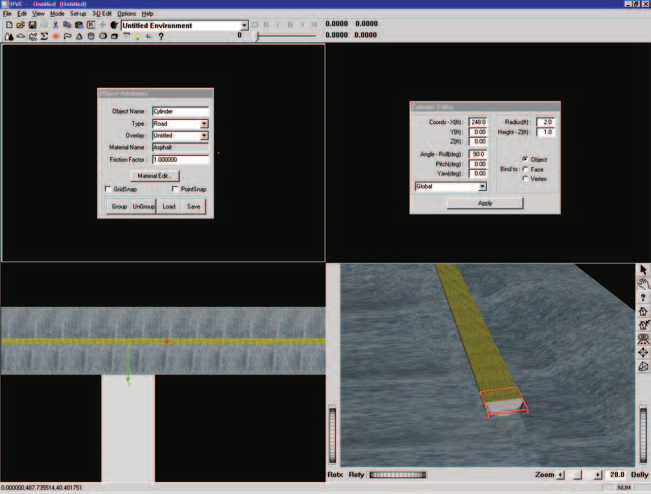
*Figure 23-29 — Cylinder at end of median, before changing the material to Concrete.*

If the cylinder does not have Concrete material attributes, perform the following steps:

1. Select 3-D Edit and choose Material Texture. The Texture Editor is displayed.
2. Select Cement from the list of available textures. A sample of the concrete texture is displayed in the Texture window.
3. Press Accept. The concrete texture is applied to the object.

Change the color of the concrete using the Material Editor dialog:

1. Select 3-D Edit and choose Material Color. The Material Editor is displayed.
2. Click on the radio button for Diffuse Color. Click in the bright yellow area of the color wheel dialog that appears. Close the color wheel dialog.
3. Change the attributes as follows: set the Diffuse color to 1.0, the Specular color to 0.5 and the Shininess to 0.5. The color on the end of the median is updated.

   > **NOTE:** These values are simply the result of finding attributes that are pleasing to the user. They need not be exact.

The concrete end cap now matches the concrete median.

Let's put a concrete end cap on the other end:

1. Click on the Cylinder Tool icon on the toolbar. The Cylinder Editor dialog is displayed.
2. Change the default radius to the desired value, 2 ft, and the default length to 1 ft, followed by Enter.
3. Edit the cylinder's position by changing its X coordinate to -248 ft. The cylinder is displayed at the other end of the median. It also has the current texture attribute (Concrete).
4. Change the default roll orientation to 90 degrees from 0 degrees.

The median now includes caps at both ends. Now, let's add the grass:

1. Click on the Box Tool icon on the toolbar. The Box Editor dialog is displayed.
2. Change the default length to the desired value, 496 ft, the default width to 3 ft, and the default height to 1.5 ft.
3. Press Enter to display the new box.

Now, let's make it grass:

1. Click on 3-D Edit on the menu and choose Material Texture. The Texture Editor is displayed.
2. Select Grass2 from the available textures list. A sample of the Grass texture is displayed in the Texture window.
3. Change Repeat X to 200 from 1.0; the Repeat Y value does not need to be changed.
4. Press Accept. The texture is applied to the grass median. The median now has a grass strip down the middle. However, the median looks slightly yellow.
5. Using the Material Editor's Diffuse color wheel as discussed in previous steps, click in the green area. The color is updated to the selected color, as shown in Figure 23-30.

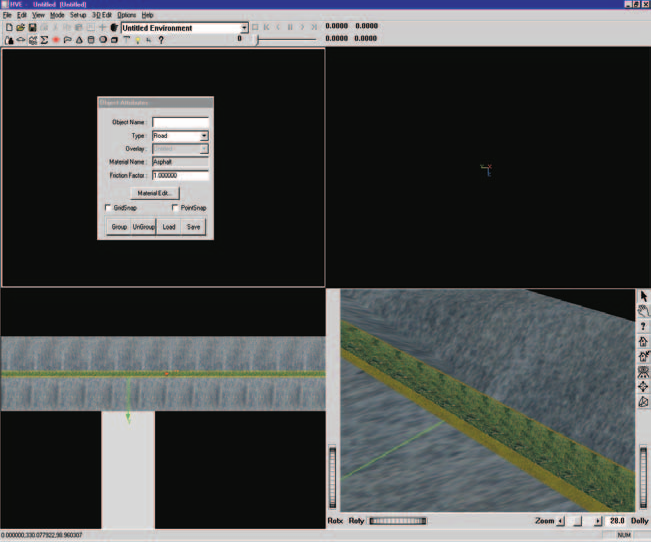
*Figure 23-30 — Concrete median with grass.*

We now have a good looking grass median, but it's in the wrong place; we want two medians on either side of the intersection. We have two options: we could move each individual part of the median to the desired location, or (much better) we could make these individual parts into a group, and then move the whole thing at once.

Let's create a group:

1. Hold down the Shift key and click on the grass, the concrete median (only the curb portion is visible after adding the grass) and both end caps. As you click on each part, a bounding box is displayed around it, indicating it has been selected.

   > **NOTE:** You will need to manipulate the viewer to be able to click on all the objects.

After selecting the grass, the concrete median and both concrete end caps, the viewer should appear as shown in Figure 23-31.

Now let's create the group:

2. Using the 3-D Editor's Group Tools (see Figure 23-32), click on the Group icon. The individual bounding boxes are removed and a single bounding box is displayed around the entire object, indicating it is now a group.

### Ungrouping a Grouped Object

Occasionally you will need to disassemble a grouped object into its individual parts. Possible reasons include:

- You wish to change the color or texture of a single part.
- You wish to edit the size or shape of the object.
- You wish to remove a part from the grouped object.

To ungroup the grouped median into its individual parts:

1. Click the Ungroup icon (see Figure 23-32).

The bounding box disappears, indicating the object has been deselected. In fact, it is no longer even a single object. Let's make it a grouped object again:

1. Hold down the Shift key and click on the grass, concrete median, and both end caps. As you click on each part, a bounding box is displayed around it, indicating it has been selected.
2. Click on the Group icon (see Figure 23-32). The individual bounding boxes are removed and a single bounding box is displayed around the entire object, indicating it is now a group.

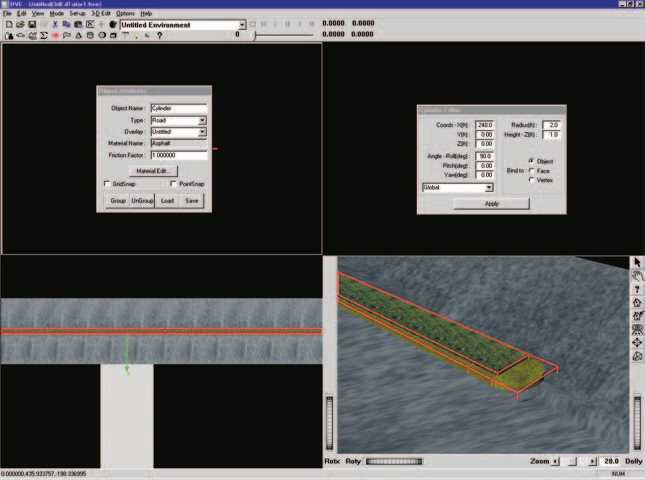
*Figure 23-31 — Selection of the individual objects making up the concrete median. Note a red bounding box surrounds each individual object (the view is zoomed in on the end of the median).*

*Figure 23-32 — 3-D Editor Group Tools (Group, Ungroup, Open and Save).*

### Saving Grouped Objects in a Library

This median is a great object! We might even want to use it again in other environments. We can make it available for future use in any environment by adding it to our Highway Furnishings Library. To add the median to our library, perform the following steps:

1. Confirm the object is selected by the presence of a bounding box. If necessary, click on the median to select it.
2. Click on the 3-D Editor's Save Group icon (see Figure 23-32). The Highway Furnishings File Selection dialog is displayed (see Figure 23-33).
3. Click on the Save as type option list and choose HVE.

   > **NOTE:** HVE is probably already displayed; although several formats are available for opening (i.e., importing), HVE is the only currently supported format for saving.

4. Enter a filename for the median: enter Median.
5. Press OK.

The median has been saved in our Highway Furnishings Library for use in future environments.

> **NOTE:** Objects are saved according to their current location relative to the origin. This fact is important when the object is later selected from the library and positioned in the environment: if the object was located 50 ft from the origin when it was saved, it will be pasted 50 feet from the selected coordinates when it is selected from the library and positioned! Thus, you normally want to move the object to the origin before saving it in the library.

Let's finally place the median at the desired location:

1. Confirm the object is selected by the presence of a bounding box. If necessary, click on the median to select it.
2. The Editor dialog displays the coordinates of its local origin relative to the earth-fixed origin. Its current coordinates are still 0,0,0 (where we created it). Let's move it:
3. Change the current X coordinate to -270. After pressing Enter, the median moves to the desired location (see Figure 23-34).

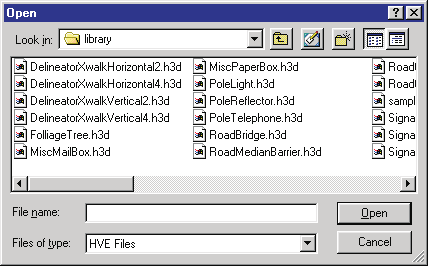
*Figure 23-33 — Object Selection dialog, used for saving and opening objects in the Highway Furnishings Library.*

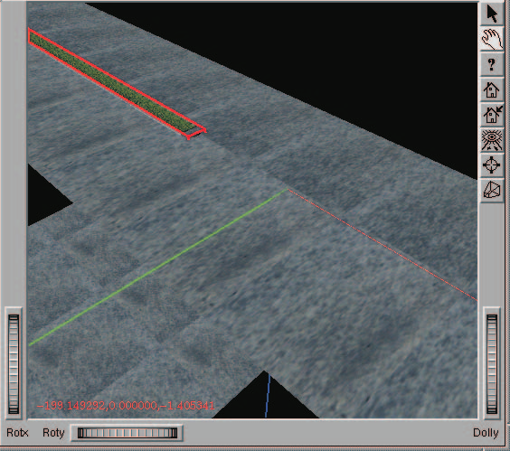
*Figure 23-34 — Our environment after positioning the first median section.*

### Using Library Objects

Now we need an additional copy of the median for the other end of our environment. We could create it from scratch, but it's obviously easier to grab it from our Highway Furnishings Library and simply place it where we want it. Let's proceed:

1. Click on the 3-D Editor's Library Open icon (see Figure 23-32). The Highway Furnishings File Selection dialog is displayed (see Figure 23-33).
2. Click on the file type option list and choose HVE.

   > **NOTE:** HVE is probably already displayed. You can use almost any popular modeling package to create your library objects.

3. Select Median.h3d from the file selection list.
4. Press OK.

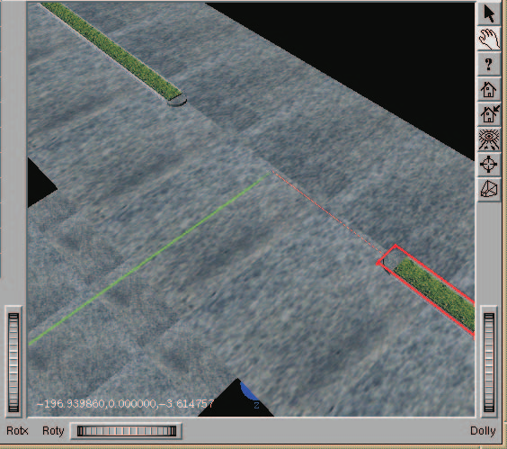
*Figure 23-35 — Our environment after positioning the second median section.*

The median is displayed at the earth-fixed origin.

> **NOTE:** Remember the object was saved according to its current location relative to the origin. Thus, it is initially redisplayed according to that same earth-fixed location.

> **NOTE:** This is why you almost always want to move an object to the origin before saving it in the Highway Furnishings Library!

Let's position the median at the correct location:

1. Confirm the object is selected by the presence of a bounding box. If necessary, click on the median to select it.
2. The Box Editor dialog displays the coordinates of its local origin relative to the earth-fixed origin. Its current coordinates are still 0,0,0 (where we created it). Let's move it:
3. Change the current X coordinate to 270 and press Enter.

The median moves to the desired location (see Figure 23-35).

### Ending the Session

The last thing to do is end the session. To save your environment by a unique filename, perform the following steps:

1. First, close the 3-D Editor by selecting 3-D Edit and choosing Close 3-D Editor. The 3-D Editor is closed, revealing the Environment Editor and Viewer with your road surface.
2. Click on Object Info. The Environment Information dialog is displayed (shown earlier in Figure 23-1), allowing us to view and edit the current environment attributes. Note we also use this dialog for opening and saving 3-D geometry files.
3. Click on Save As. The File Selection dialog is displayed, allowing us to save our geometry using the desired file format and filename (shown earlier in Figure 23-14).
4. Click on the Format option list to display the available file formats, and choose HVE.
5. Enter a filename for the 3-D geometry file. Enter: TutorEnvLesson3.

   > **NOTE:** There is no need to supply an extension, because HVE will automatically supply the .h3d extension.

6. Click OK in the File Selection dialog. The file is now saved in the `...\hve\supportFiles\images\environments` subdirectory.
7. Click OK in the Environment Information dialog.

We are now ready to shut down HVE. This is done using the File menu:

1. Choose the File menu option in the main menu bar, and click on Exit. You are asked if you would like to save your changes.
2. Choose No.

> **NOTE:** You saved your work in a unique 3-D geometry file, named TutorEnvLesson3.h3d. There is no need to save your case.

HVE has now shut down.

### Summary

This concludes Lesson 3 — Using Groups. You should now be familiar with creating and disassembling grouped objects, saving groups in the Highway Furnishings Library, and selecting objects from the Library and placing them in the scene.

---
*Converted and updated from the legacy HVE User's Manual (Seventh Edition, Jan 2006), Chapter 23; verified against current source code (HVEINV-64, SceneViewer) and the code-verified dialog reference pages 2026-07-05.*

<!-- NAV -->

---

← Previous: [Chapter 21 — Manipulators](21-manipulators.md)  |  [Index](README.md)

<!-- /NAV -->
