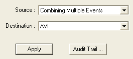

# Chapter 27 — Using The HVE Video Interface

*Updated Markdown edition of the HVE User's Manual (HVE Version 5, Seventh
Edition, January 2006), Chapter 27, pages 27-1 through 27-12. Verified against the current HVE application source
(`HVEINV-64/VideoDlg.cpp`, `VideoOptionsDlg.cpp`, `AviWrite.cpp`,
`CVideoWndPlay.cpp`, `PlayBackDlg.cpp`, `hversntview.cpp`).*

This chapter describes the process of producing high-quality video directly
from simulation output using the HVE video interface.

*(updated: In the original edition this chapter described routing playback to
external video tape recorders. Current HVE records simulation movies directly
to compressed **AVI** files (optionally MPEG, or individual frame image
files) using the codecs installed in Windows. The Playback window in current
HVE is opened with **Video Creator...** on the Files menu. The chapter below
reflects the current workflow; legacy tape-recorder material is flagged.)*

The video interface includes two basic tools:

- **Video Options (Video Set-up) Dialog** — Opened with the Video Setup
  button on the Playback (Video Creator) window; used for selecting the
  video format (movie and/or single frames), movie size, frame rate, video
  compressor (codec) and output directory.
- **Playback Window (Video Creator)** — Available in the Playback Editor,
  used for recording and playing back video results.

Whether recording a new movie or replaying a saved one, these two tools are
used. They are described below.

## Video Setup Dialog

HVE has a dialog for configuring video output before recording. In the
original edition this was described as installing a "video device" (loading
device drivers and setting up communication between the computer and an
external recorder), much like installing a printer. In current HVE no device
installation is required: the Video Options dialog simply configures how the
movie file is written.

*Figure 27-1 — Video Set-up dialog.*

*(updated: the current Video Options dialog — resource `IDD_VIDEO_2011_UPDATE`
in `VideoOptionsDlg.cpp` — contains the following options:)*

- **Video Format** — Two check boxes select the output format(s):
  - **Movie** — Records the playback to a movie file (AVI). An *Overwrite*
    check box controls whether an existing movie file is replaced.
  - **Single Frames** — Writes each rendered frame to an individual image
    file. A *Filename* field sets the base frame filename and an *Overwrite*
    check box controls replacement of existing frames.
- **Compressor** — Displays the current video compressor. The **Select...**
  button opens the standard Windows compressor-selection dialog listing all
  codecs installed on the system. If no compressor has been selected, movies
  are written as "Full Frames (Uncompressed)".
- **Video Size** — Selects the movie frame size: Default (playback window
  size), DVD, 480p, 720i, 1080i, 1080p or 4K.
- **Recording Speed / FPS** — Slider and text field selecting the recording
  frame rate (frames of simulation output per second of video).
- **Output Directory** — Selects the directory where movies and frames are
  written (by default the `movies` support-files directory; see
  [Appendix I](../11-appendices/appendix-01-installation.md)).

> **NOTE:** The Video Setup options are stored in HVE's configuration file.
> Therefore, you will not need to set up the options again unless you
> re-install HVE or wish to change them.

### Video Devices *(legacy)*

The original procedure installed a video output device as follows:

1. Choose Video from the Files menu. The Video Setup dialog is displayed,
   showing the current video setup options.
2. If *S-Video/Composite Video* is not displayed in the Device Name field,
   click on the Device Name option list.
3. Select the desired video device. For real-time movie file recording,
   choose *S-Video/Composite Video*. This allowed use of HVE's integrated
   video output display, sized to match the video format.
4. Press OK to activate the selected video device.

*(updated: the legacy Video Setup dialog (`VideoDlg.cpp`) still exists in the
source, but its Device Name, Connect To (Serial 1/Serial 2/Video Out), Test
Medium and Time Codes controls are permanently disabled — external video
devices are no longer supported. Video output is always written to a file.)*

### Video Compressor

If you wish to compress the recorded movie (strongly recommended — an
uncompressed AVI grows very large very quickly), you must select a video
compressor. Several video compressors may be present, depending on the
software installed on your system.

To select a video compressor, perform the following steps:

1. Open the Video Options dialog (Video Setup button on the Playback
   window).
2. Press the **Select...** button next to the Compressor field. The standard
   Windows compression dialog is displayed, listing all available codecs.
   Select the desired compressor. *(updated: the original manual instructed
   users to select the Cinepak Codec, which is long obsolete; choose any
   modern codec installed on your system.)*
3. Press OK to activate the selected video compressor.

> **NOTE:** The selected compressor is stored in HVE's configuration file.
> Therefore, you will not need to set up the compressor again unless you
> re-install HVE or wish to use a different video compressor.

> **NOTE:** Compressed video sequences are often referred to as "movies".

## Playback Controller

Video output is recorded and played back using the Playback Editor's
Playback Controller. While using the video interface, there is always a
*video source* and a *video destination*. The Playback (Video Creator) window
allows the user to choose the current video source and destination from two
option lists.

*Figure 27-2 — Close-up of the portion of the Playback Window used for
selecting the video source and destination.*

### Video Source

The video source is, as the name implies, the source of the video
information. The two possible video sources are:

- **Playback Window Name** — If a Playback Window has been created, it
  contains a sequence of frames that may be viewed. The Playback Window
  normally displays an accident sequence that includes one or more HVE
  simulation events.
- **Movie Filename** — If a sequence has been saved as a movie, that
  sequence may be played back in the Playback Window. *(updated: the source
  list includes the default video file (`Default.avi`) if one has been
  recorded, plus every other `.avi` file found in the movies directory, so a
  previously recorded movie may be chosen directly.)*

### Video Destination

For any video source, there must be a destination. The possible video
destinations are:

- **Playback Window Name** — By default, all sources are routed to the
  current Playback Window for viewing.
- **Video File** — If the source is the Playback Window, the rendered
  sequence is recorded to the movie file (and/or single-frame files)
  configured in the Video Options dialog.

*(updated: the original manual listed a third destination, **Video Device
Name** (e.g., a VTR), for routing output to a video recorder. External video
devices are no longer supported; the corresponding "S-Video / Composite
Video" destination entry is disabled in the current code.)*

## Recording A Movie

The above video sources and destinations provide the user significant
flexibility when using HVE's video tools. To record a real-time simulation
movie, perform the following steps:

1. Configure the video options (format, size, frame rate, compressor), as
   described earlier in this chapter.
2. Execute the desired HVE simulations (e.g., EDSMAC4, SIMON, EDVSM...)
   using the HVE Event Editor.
3. Choose **Video Creator...** from the Files menu and create a Playback
   Window that includes the desired simulations.
4. Set the view using either the viewer's thumbwheels or the Set Camera
   dialog.
5. Click on the **Source** option list and choose the playback window name
   (e.g., *Untitled Playback Window*) as the source.
6. Click on the **Destination** option list and choose the video file (AVI)
   as the destination.
7. Press **Play**.

HVE will record the simulation displayed in the playback window (the Source)
to the `Default.avi` compressed disk file (the Destination) one frame at a
time until the end of the simulation or until the user presses Pause or Stop.

To view the sequence in real time, perform the following steps:

1. Click on the **Source** option list and choose the movie file as the
   source.
2. Click on the **Destination** option list and choose the Playback Window
   (e.g., *Untitled Playback Window*) as the destination.
3. Press **Play** on the HVE Playback Controller.

The movie is displayed in the Playback Window in real time.

## Video File Selection

The video recorder creates a file of the video sequence. These files may be
saved and opened using a file selection dialog, similar to other files.

*Figure 27-3 — Video File Selection dialog, used for opening and saving
compressed video output.*

### Saving Compressed Video Files

After creating the video sequence, the user can save the video file by a
unique filename for future viewing or editing. To save the current video
file, perform the following steps:

> **NOTE:** At this point, it is assumed you are in playback mode, have just
> executed a simulation and the current video destination is the video file.

1. Open the Video Setup dialog.
2. Choose **Save-As**. The Video File Selection dialog is displayed.
3. Select a filename from the list of existing video files, or enter a new
   filename.

   > **NOTE:** HVE will append the appropriate extension to the name you
   > enter. For example, the filename *MyVideo* will be saved as
   > `MyVideo.avi`. You do not need to explicitly specify a filename
   > extension.

   > **NOTE:** All video files are stored in the `movies` subdirectory; see
   > [Appendix I](../11-appendices/appendix-01-installation.md).

4. Press OK.

The compressed video file will be saved by the selected filename.

### Viewing Previously Saved Video Files

To replay a previously saved video file, perform the following steps:

1. Open the Video Setup dialog.
2. Choose **Open**. The Video File Selection dialog is displayed (current
   HVE lists AVI and MPEG files).
3. Select a filename from the list of existing video files.
4. Press OK. The selected filename will be displayed in the Source File
   field.
5. Press OK in the Video Setup dialog.

The next step is to play and view the simulation. Perform the following
steps:

1. If necessary, choose Playback Mode and add a Playback Window. (You must
   have a Playback Window in order to play a simulation movie within HVE.)
2. Click on the **Source** option list and choose the movie filename (e.g.,
   `MyVideo.avi`). *(updated: saved movies in the movies directory also
   appear directly in the Source list, so the Open step above is often
   unnecessary.)*
3. Click the **Destination** option list and choose the Playback Window.
4. Using the Playback Controller, press **Play** to play the simulation
   movie.

The simulation sequence will be displayed in real time in the playback
window.

> **NOTE:** Because this is a pre-recorded sequence, you cannot change the
> view. In addition, the simulation time in the Playback Controller is not
> displayed.

> **NOTE:** You can save this video file using the same procedure as for
> saving the default video, described earlier.

## Creating Multiple Video Sequences

The user will often require a series of simulations recorded back-to-back.
Examples include:

- Viewing the same crash sequence from several different perspectives
  (i.e., driver(s), witness(es), fly-by, general perspective)
- Creating alternative scenarios of a crash sequence (driver's version,
  witness's version, your version)

To produce a video containing multiple sequences recorded back-to-back,
record each sequence to a movie file, then either:

- Record each successive sequence to the same movie file. When you save to
  an existing filename, HVE asks whether you wish to **replace** the
  existing file or **append** the current video sequence to the existing
  sequence — choose append to build up a back-to-back movie; or
- Record each sequence to its own movie file and assemble them in a video
  editing package.

*(legacy)* On tape-based systems the equivalent procedure was:

1. Record the first sequence.
2. At the end of the first sequence, pause the VCR (leave the VCR in Record
   mode).
3. Using the Playback Controller, choose the second sequence as the Source.
4. Release the VCR's pause button, allowing the VCR to run for a few
   seconds.
5. Using the Playback Controller, press Play to record the second sequence.
6. Repeat the above steps for each sequence to be recorded.

## Step-by-step Examples

The following examples illustrate the use of the HVE Video Interface to
perform a complete and inter-related set of video output tasks.

### Example 1: Recording the current simulation in real time in the Playback Window

Video compression allows the user to view a sequence in real time in the
current HVE Playback Window. The obvious advantage of this approach is time
savings; the recording may be previewed before it is distributed.

To create a real-time simulation movie, perform the following steps:

1. Create a Playback Window (Files menu, Video Creator...) that includes the
   desired simulations. Set the view using either the viewer's thumbwheels
   or the Set Camera dialog.
2. Choose the Playback Window name (e.g., *Untitled Playback Window*) as the
   source.
3. Choose the video file (AVI) as the destination.
4. Press **Play**.

HVE will route the simulation in the Playback Window (i.e., the source) to
the computer hard disk using the video compressor (i.e., the destination) one
frame at a time until the end of the simulation or until the user presses
Pause or Stop.

> **NOTE:** HVE automatically sends the video to a default filename
> (`Default.avi`) in the movies subdirectory of your HVE support files. For
> more information, see the next example.

### Example 2: Save the current compressed video file

The compressed video created in Example 1 (above) is saved in a default
file. If the user wishes to save the file for later viewing and editing, the
file may be saved using the HVE Video Set-up dialog. To save the current
video by a user-defined filename, perform the following steps:

1. Create a compressed video as described in Example 1, above.
2. Open the Video Set-up dialog.
3. Choose **Save-As**. The Video File Selection dialog is displayed.
4. Enter or select a filename from the Files list and press OK.

   > **NOTE:** If you choose an existing filename, HVE will ask if you wish
   > to replace the existing file or append the current video sequence to
   > the existing sequence.

5. Press OK to return to the Playback Editor.

The resulting video file is now saved and is available for later viewing, as
described in the next example.

### Example 3: Play a previously saved compressed video file

After saving a compressed video file as described above, the video file may
be viewed in the HVE Playback Editor. To view the previously saved compressed
video file, perform the following steps:

1. Create a compressed video as described in Example 1, above, and save it
   as described in Example 2, above.
2. Using the Playback Window, choose the saved video filename as the source
   (select it directly from the Source list, or open it via the Video Set-up
   dialog's **Open** button), and choose the playback window as the
   destination.
3. Press **Play**.

The sequence in the selected video file will be displayed in real time in the
current playback window.

### Example 4: Record the current compressed video file to tape *(legacy)*

On legacy systems with video-out hardware, a saved compressed video file
could be recorded to a VTR as follows:

1. Create, save and select a compressed video as described in Examples 1–3.
2. Optionally, press Play to play the sequence to confirm it is exactly what
   you want to record.
3. Activate the video-out capabilities of your computer (these steps are
   hardware-dependent).
4. Confirm the VTR settings are correct.
5. Insert a tape into the VTR.
6. Using the Playback Window, choose a video device name (e.g.,
   S-Video/Composite Video) as the destination.
7. Press Play. HVE routes the movie (the source) to the selected video
   device (the destination), displaying it in a specially formatted
   full-frame viewer designed to work with the computer's video sub-system.
8. Start the recording process (i.e., press the Record and Play buttons on
   the VCR).
9. Press the Play button on the viewer to play the movie.

The simulation movie is displayed on the screen as well as recorded on the
VTR at real-time speed.

*(updated: current HVE has no video-device destination. To put a simulation
movie on physical media or another device, record it to an AVI file and use
standard authoring/conversion tools.)*

For more information about video concepts, see
[Chapter 26, Video Basics](26-video-basics.md).

## Problem Determination

If you are experiencing problems while trying to create a video, perform the
following steps:

1. Confirm the video options (format, compressor, output directory) are
   properly set in the Video Options dialog. If a movie fails to record with
   a particular codec, try a different compressor or Full Frames
   (Uncompressed). *(legacy: on tape-based systems, confirm the video
   cable(s) connecting the computer's video hardware to the video recorder
   are properly connected to both devices — in general, the computer's video
   out is connected to the recorder's video in, and vice-versa — and confirm
   the video device controls are properly set, per the specification sheets
   supplied with the computer and video subsystem.)*
2. Confirm there is sufficient disk space in the output directory —
   uncompressed movies are very large.
3. Refer to Tips and Suggestions (see
   [Chapter 26, Video Basics](26-video-basics.md)) for techniques and
   suggestions on improving the quality of your videos.

<!-- NAV -->

---

← Previous: [Chapter 26 — Video Basics](26-video-basics.md)  |  [Index](README.md)

<!-- /NAV -->
