# Chapter 29 — HVE Brake Designer

*Updated Markdown edition of the HVE User's Manual (HVE Version 5, Seventh
Edition, January 2006), Chapter 29, pages 29-1 through 29-30. Verified against the current HVE application source
(`HVEINV-64/HveBrakes.cpp`, `BrakeDesign*.cpp`, `BrakeAssemblyDlg.cpp`).*

## Overview

The HVE Brake Designer allows brake design engineers and safety researchers
to design wheel brake assemblies and to evaluate how a given brake design
affects vehicle braking performance. A major benefit of the HVE Brake
Designer is that it is integrated directly into the HVE simulation
environment; thus, designers can generate a brake design and then use
simulation to directly evaluate its effectiveness for a specified suite of
vehicle performance tests or maneuvers.

The HVE Brake Designer may be used to design and evaluate the following
brake types:

- Disc Brake
- Duo-Servo Drum Brake
- Duplex Drum Brake
- Single Piston Drum Brake
- Dual Piston Drum Brake
- S-Cam Drum Brake
- Single Wedge Drum Brake
- Dual Wedge Drum Brake
- Air Disc Brake *(updated: added since the original edition — an
  air-actuated caliper disc brake for heavy vehicles, combining the caliper
  disc geometry with air-chamber actuation, slack adjuster and stroke-based
  actuation factor)*

The HVE Brake Designer incorporates advanced features, such as the effect of
sliding speed and temperature on lining friction. The model also includes the
capability to study brake fade characteristics associated with reduced
braking capacity of heavy trucks on long downhill grades.

*Figure 29-1 — Brake Information dialog.*

To use the HVE Brake Designer, perform the following steps:

1. In the Vehicle Viewer, click on the desired wheel. The Unsprung Mass
   options for the selected wheel are displayed.

   > **NOTE:** Refer to Chapters 10 and 11 for details about using the HVE
   > Vehicle Editor.

2. Choose Brakes from the Unsprung Mass option list. The Brake Information
   (Brake Assembly) dialog for the selected wheel is displayed (see Figure
   29-1). The default brake type is Generic and the default brake torque
   ratio is displayed.
3. Click on the Brake Assembly Type option list and choose the desired brake
   type (e.g., S-Cam).
4. Press Edit. The HVE Brake Designer dialog for the selected brake type is
   displayed, as shown in Figure 29-2. Default values are assigned for each
   parameter, and the calculated brake factor, actuation factor and brake
   torque ratio are displayed.

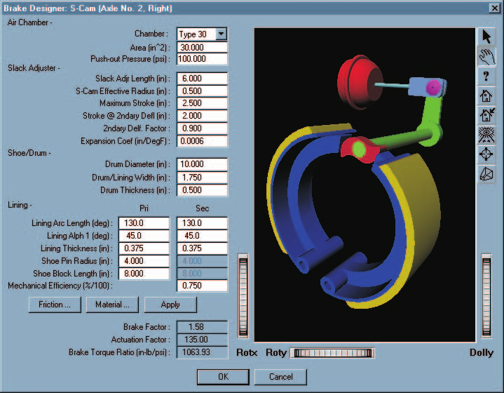
*Figure 29-2 — HVE Brake Designer for an S-cam brake.
Each Brake Designer dialog includes an embedded schematic preview drawing of
the selected brake, updated to reflect the current dimensions.*

> **NOTE:** When used in this manner, the calculated brake factor and brake
> torque ratio are based on the environment's ambient temperature and zero
> sliding velocity at the pad/rotor (or lining/drum) interface. While a
> simulation is executing, the brake factor and brake torque ratio may be
> calculated using the current brake internal temperature and sliding
> velocity calculated by the simulation.

5. Edit any of the parameters, then press Apply. The brake factor and brake
   torque ratio are calculated and displayed.
6. When finished editing the brake parameters, press OK.

The HVE Brake Designer dialog is removed. Note that the calculated brake
torque ratio and pushout pressure associated with the selected design are now
displayed in the Brake Information dialog.

> **NOTE:** If the Brake Designer has been used to calculate the brake
> torque ratio, the calculated value cannot be edited directly. If you wish
> to enter the brake torque ratio directly, you must first change the Brake
> Assembly Type to Generic.

## Brake Torque

The HVE Brake Designer uses the following fundamental approach in the
calculation of brake torque for a given wheel:

$$BT = BF \times TR \times AF \times Factor \qquad (\text{29-1})$$

where

| Symbol | Description |
| --- | --- |
| $BT$ | Brake torque at wheel (in-lb) |
| $BF$ | Brake Factor, the ratio of friction force to actuation force produced in the braking device (dimensionless) |
| $TR$ | Radius of the friction force (in) |
| $AF$ | Actuation Force produced by the brake actuation device (lb), (i.e., caliper piston, wheel cylinder, S-cam or wedge) |
| $Factor$ | Percentage of reduction in actuation force (%/100), normally resulting from excessive air chamber stroke |

Thus, it can be seen that to calculate brake torque under any given set of
conditions, one must be able to calculate the brake factor, brake torque
radius, actuation force and actuation factor. These calculations are
described in detail below. For an excellent treatise on brake design, see
Limpert [4.31], as well as references 4.2 and 4.32 through 4.38.

## Brake Factor

Brake factor is defined as the ratio of the lining friction force to the
brake actuation force. As a ratio, it is a dimensionless quantity. The lining
friction force is produced at the pad/rotor interface (disc brake) or the
shoe/drum interface (drum brake). The actuation force is produced by the
caliper piston, wheel cylinder, S-cam or wedge under the influence of brake
system pressure.

### Lining Friction

Brake factor is heavily influenced by the friction coefficient between the
lining material and the rotor or drum. Lining friction, in turn, is
influenced by temperature and sliding velocity at the interface between the
lining and rotor or drum. The HVE Brake Designer allows the user to directly
study these influences by allowing the user and/or simulation model to
determine the correct value of lining friction as a function of brake
temperature and sliding velocity.

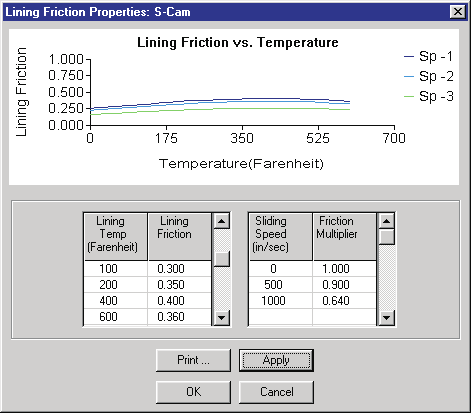
*Figure 29-3 — Lining Friction dialog, used for entering lining friction vs
temperature (left) and lining friction factor vs sliding speed (right) data
tables. (The original caption is misnumbered "Figure
30-3".)*

**Table 29-1 — Lining Friction Designation (from SAE J866 MAR85 [6.5])**

| Code Letter | Friction Coefficient |
| --- | --- |
| C | Not over 0.15 |
| D | Over 0.15 but not over 0.25 |
| E | Over 0.25 but not over 0.35 |
| F | Over 0.35 but not over 0.45 |
| G | Over 0.45 but not over 0.55 |
| H | Over 0.55 |
| Z | Unclassified |

Lining friction is determined using linear interpolation of the friction vs
temperature table (see Figure 29-3). The default values are assigned
according to SAE J866 MAR85, Friction Coefficient Identification System for
Brake Linings [6.5] (see Table 29-1), and are user-editable.

> **NOTE:** The nominal friction for a brake lining can be identified by a
> 2-character code stamped on the edge of the lining. The first of the two
> characters defines the nominal friction at low temperature, and the second
> character represents the friction at high temperature.

Lining friction is then modified using linear interpolation of the friction
factor vs sliding speed table (see Figure 29-3). The default values are
derived from brake dynamometer test data in references 4.37 and 4.38. Values
are user-editable.

The calculation of brake factor lies at the heart of a brake design. Each
type of brake works in a unique manner and has a governing set of brake
factor equations. These equations are described in the following sections.

### Disc Brake

A free body analysis of a disc brake yields the following simple calculation
for brake factor:

$$BrakeFactor = 2.0 \times \mu_L \qquad (\text{29-2})$$

where

| Symbol | Description |
| --- | --- |
| $\mu_L$ | Lining friction at temperature and sliding speed |

### Drum Brake

Two basic types of brake shoe designs are used in drum brakes: pinned shoes
and abutted shoes. In both designs, the direction of drum rotation influences
the brake factor. This influence results from the fact that the friction
force produced between the drum and shoe produces an increased actuation
force for a leading shoe and a decreased actuation force for a trailing
shoe. These influences are seen in the following calculations for pinned and
abutted shoes.

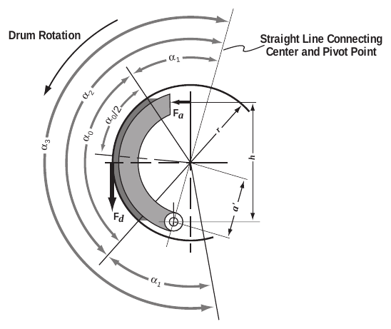
*Figure 29-4 — Analysis of a pinned brake shoe [4.31].*

#### Pinned Shoe

A free body analysis of a pinned shoe (see Figure 29-4) results in the
following equation for brake factor:

$$
BF = \frac{\mu_L \, \dfrac{h}{r}}
{\dfrac{a'}{r}\left(\dfrac{\alpha_0 - \sin\alpha_0 \cos\alpha_3}
{4\sin\left(\dfrac{\alpha_0}{2}\right)\sin\left(\dfrac{\alpha_3}{2}\right)}\right)
\pm \mu_L \left(1 + \dfrac{a'}{r}\cos\left(\dfrac{\alpha_0}{2}\right)\cos\left(\dfrac{\alpha_3}{2}\right)\right)}
\qquad (\text{29-3})
$$

where (see Figure 29-4)

| Symbol | Description |
| --- | --- |
| $F_a$ | Actuation force (lb) |
| $F_d$ | Friction force produced by brake linings (lb) |
| $\mu_L$ | Lining friction coefficient at current lining temperature |
| $h$ | Brake block width (in) |
| $r$ | Drum inner radius (in) |
| $a'$ | Shoe pin radius (in) |
| $\alpha_0$ | Lining material arc length (rad) |
| $\alpha_1$ | Angular dimension (deg) |
| $\alpha_3$ | $2\alpha_1 + \alpha_0$ |

Eq. 29-3 is applicable to both leading and trailing shoes; for a leading
shoe, the negative sign is employed in the denominator and for a trailing
shoe the positive sign is employed. The negative sign results in a larger
brake factor and represents the *self-energizing* effect of the brake
leading shoe.

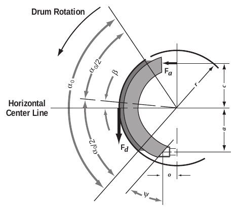
*Figure 29-5 — Analysis of an abutted brake shoe [4.31].*

#### Abutted Shoe

A free body analysis of an abutted shoe (see Figure 29-5) results in the
following calculation for brake factor for a leading shoe:

$$BF = \frac{\mu_L D_B + \mu_L^2 E_B}{F_B - \mu_L G_B + \mu_L^2 H_B} \qquad (\text{29-4})$$

and for a trailing shoe:

$$BF = \frac{\mu_L D_B - \mu_L^2 E_B}{F_B + \mu_L G_B + \mu_L^2 H_B} \qquad (\text{29-5})$$

where (see Figure 29-5)

| Symbol | Description |
| --- | --- |
| $F_a$ | Actuation force (lb) |
| $F_d$ | Friction force produced by brake linings (lb) |
| $\mu_L$ | Lining friction coefficient at current lining temperature |
| $c$ | Center to actuation force distance (in) |
| $a$ | Center to abutment vertical distance (in) |
| $o$ | Center to abutment horizontal distance (in) |
| $r$ | Drum inner radius (in) |
| $\alpha_0$ | Lining material arc length (rad) |
| $\beta$ | Arc center angle (rad), shown + in Figure 29-5 |
| $\Psi$ | Abutment angle (rad) |
| $\mu_s$ | Abutment sliding friction coefficient |

and

$$D_B = \left(\frac{c}{r} + \frac{a}{r} + (\mu_s + \tan\Psi)\left(\frac{o}{r}\right)\right)\cos\beta + (\mu_s + \tan\Psi)\left(\frac{c}{r}\right)\sin\beta$$

$$E_B = (\mu_s + \tan\Psi)\left(\frac{c}{r}\right)\cos\beta - \left(\frac{c}{r} + \frac{a}{r} + (\mu_s + \tan\Psi)\left(\frac{o}{r}\right)\right)\sin\beta$$

$$F_B = \left(\frac{\alpha_0 + \sin\alpha_0}{4\sin\left(\dfrac{\alpha_0}{2}\right)}\right)\left(\frac{a}{r} + (\mu_s + \tan\Psi)\left(\frac{o}{r}\right)\right)$$

$$G_B = \cos\beta + (\mu_s + \tan\Psi)\sin\beta$$

$$H_B = F_B - \big((\mu_s + \tan\Psi)\cos\beta - \sin\beta\big)$$

Like the pinned shoe equations, the + and − signs in equations 29-4 and 29-5
represent the *self-energizing* effect on the leading and trailing shoes.

Application of these basic equations is shown later in this section for each
of the brake types supported by the HVE Brake Designer.

## Brake Torque Radius

Brake torque radius is simply the moment arm at which the lining friction
force is applied. For disc brakes:

$$TorqueRadius = (R_o + R_i)/2 \qquad (\text{29-6})$$

where

| Symbol | Description |
| --- | --- |
| $R_o$ | Rotor swept area outside radius (in) |
| $R_i$ | Rotor swept area inside radius (in) |

For drum brakes:

$$TorqueRadius = R \qquad (\text{29-7})$$

where

| Symbol | Description |
| --- | --- |
| $R$ | Drum inner radius (in) |

*(updated: the original text printed eq. 29-7 as "R/2"; the drum torque
radius is the drum inner radius, which the code computes as drum
diameter/2 — `TorqueRad = DrumDia*0.5` in `HveBrakes.cpp`. Similarly, the
disc torque radius is computed as (outer diameter + inner diameter)/4, which
equals $(R_o+R_i)/2$.)*

## Actuation Force

An actuation force causes the pads to contact the rotor (or shoes to contact
the drum). Various brake system types use different methods to produce an
actuation force. Hydraulic brake systems use caliper pistons (disc brakes) or
wheel cylinders (drum brakes). Air brake systems use air chambers, slack
adjusters and an S-cam or wedge — or, for air disc brakes, an air chamber
acting on a caliper. Actuation force calculations for each of these actuator
types are shown below.

### Hydraulic Disc Brake

The actuation force for a disc brake is simply the combined product of the
hydraulic pressure, piston area, number of pistons and mechanical
efficiency:

$$ActuationForce = (P_{Line} - P_{Pushout}) \times A_{Piston} \times N_{Pistons} \times \eta_{Mech} \qquad (\text{29-8})$$

where

| Symbol | Description |
| --- | --- |
| $P_{Line}$ | Hydraulic pressure entering the piston chamber (psi), after proportioning |
| $P_{Pushout}$ | Hydraulic pressure required to cause the brake pads to contact the rotor (psi), normally nil for disc brake systems |
| $A_{Piston}$ | Surface area of one piston (in²) |
| $N_{Pistons}$ | Number of pistons in a brake caliper |
| $\eta_{Mech}$ | Mechanical efficiency of the caliper assembly (%/100), approximately 1.0 for a properly maintained disc brake caliper |

### Hydraulic Drum Brake

The actuation force for a hydraulic drum brake system is produced by
hydraulic pressure pushing against one or more pistons. The pistons, in
turn, push directly against the brake shoe or against a pushrod that pushes
the brake shoe.

The actuation force for a hydraulic drum brake is:

$$ActuationForce = (P_{Line} - P_{Pushout}) \times A_{Piston} \times N_{Piston} \times \eta_{Mech} \qquad (\text{29-9})$$

where

| Symbol | Description |
| --- | --- |
| $P_{Line}$ | Hydraulic pressure entering the piston chamber (psi), after proportioning |
| $P_{Pushout}$ | Hydraulic pressure required to cause the brake linings to contact the drum (psi), normally 5 to 100 psi for hydraulic drum brake systems |
| $A_{Piston}$ | Surface area of one piston (in²) |
| $N_{Piston}$ | Number of pistons |
| $\eta_{Mech}$ | Mechanical efficiency of the wheel cylinder assembly (%/100), estimated between 0.90 and 0.95 for a properly maintained hydraulic drum brake |

### Drum S-cam Air Brake

The actuation force for a drum S-cam air brake system is produced by an air
chamber pushing a pushrod. The pushrod, in turn, pushes a lever called a
slack adjuster. The slack adjuster turns an S-cam (see Figures 29-6 and
29-7). The S-cam pushes against the brake shoes causing the actuation force.
This system is obviously much more complicated than a hydraulic brake
system. It can even be further complicated by the loss of pushrod force when
the system is out of adjustment (see Actuation Factor, later in this
chapter).

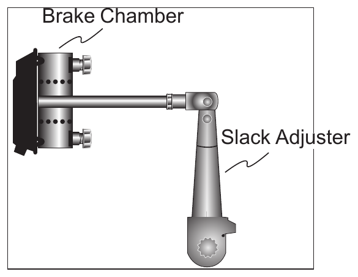
*Figure 29-6 — Components of an S-cam brake assembly (brake chamber, slack
adjuster, S-cam).*

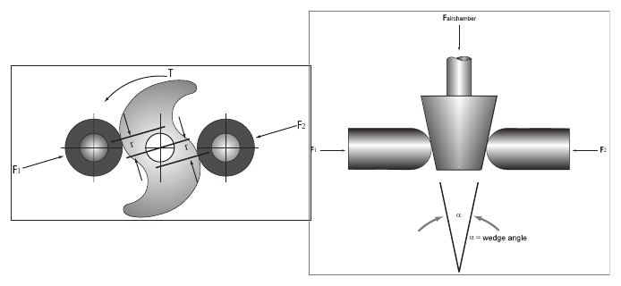
*Figure 29-7 — Brake actuators: S-cam (left) and wedge (right).*

The actuation force for an S-cam air brake is:

$$ActuationForce = (P_{Line} - P_{Pushout}) \times A_{AirChamber} \times \left(\frac{L_{Slack}}{2 R_{S\text{-}cam}}\right) \times \eta_{Mech} \qquad (\text{29-10})$$

where

| Symbol | Description |
| --- | --- |
| $P_{Line}$ | Air pressure entering the air chamber (psi), after proportioning |
| $P_{Pushout}$ | Air pressure required to cause the brake linings to contact the drum (psi), normally about 5 psi for air drum brake systems [4.38] |
| $A_{AirChamber}$ | Surface area of one air chamber (in²) |
| $L_{Slack}$ | Slack adjuster lever arm (in) |
| $R_{S\text{-}cam}$ | Effective radius of S-cam (in), normally 0.50 in |
| $\eta_{Mech}$ | Mechanical efficiency of the S-cam assembly (%/100), normally between 0.70 and 0.75 for properly maintained air brake systems [4.2] |

### Drum Wedge Air Brake

The actuation force for a drum wedge air brake system is produced by an air
chamber pushing a tapered wedge between two pushrods. The pushrods push
directly on the brake shoes causing the actuation force (see Figure 29-7).
The actuation force for a wedge air brake is:

$$ActuationForce = (P_{Line} - P_{Pushout}) \times A_{AirChamber} \times \left(\frac{1}{2\tan\left(\frac{\alpha}{2}\right)}\right) \times \eta_{Mech} \qquad (\text{29-11})$$

where

| Symbol | Description |
| --- | --- |
| $P_{Line}$ | Air pressure entering the air chamber (psi), after proportioning |
| $P_{Pushout}$ | Air pressure required to cause the brake linings to contact the drum (psi), normally about 5 psi for air drum brake systems [4.38] |
| $A_{AirChamber}$ | Surface area of one air chamber (in²) |
| $\alpha$ | Included wedge angle (rad) |
| $\eta_{Mech}$ | Mechanical efficiency of the wedge assembly (%/100), normally between 0.80 and 0.88 for properly maintained air brake systems [4.2] |

## Actuation Factor

The actuation force for a drum air brake with an S-cam or wedge actuator (or
an air disc brake) is heavily influenced by its state of adjustment (see
Figure 29-8). To account for the loss in actuation force at increased levels
of stroke, an *actuation factor* is employed.

The actuation factor is an empirically derived relationship between
actuation force and piston stroke. The actuation factor is the percentage of
the theoretical pushrod force available as stroke increases. Figure 29-8
reveals a characteristic "knee" in the force vs stroke relationship. When
the stroke extends beyond the knee, pushrod force drops off significantly.
The knee normally occurs at about 2.00 inches. The maximum stroke for most
air chambers is 2.5 inches, although some "long stroke" chambers have a
3.00-inch (or longer) maximum stroke. By definition, no pushrod force is
produced at or beyond maximum stroke.

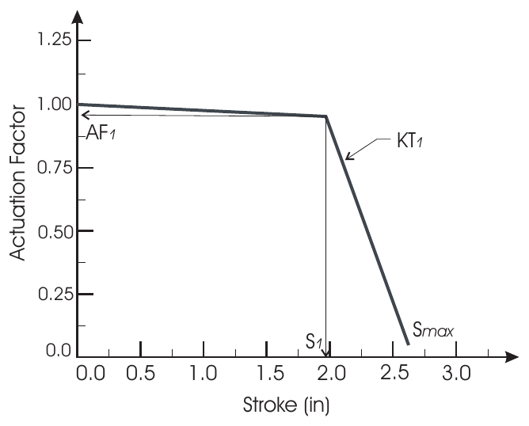
*Figure 29-8 — Actuation Factor vs stroke relationship for a typical Type 30
S-cam brake, showing the knee at (S₁, AF₁), the expansion coefficient KT₁
and the maximum stroke Smax.*

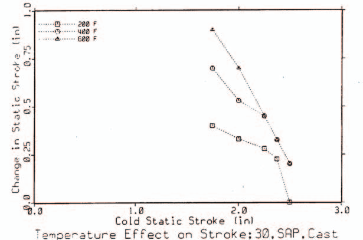
*Figure 29-9 — Effect of temperature on brake stroke for a Type 30 cast iron
drum S-cam brake [4.32].*

Increased piston stroke due to increased brake temperature is also
empirically derived. Testing [4.2, 4.32] has revealed that stroke increases
approximately linearly with brake temperature. Figure 29-9 illustrates this
relationship. Values of 0.0004 to 0.0008 in/deg F are commonly found in the
literature; 0.0006 in/deg F is used as the default in the HVE Brake
Designer.

The brake actuation factor is calculated using the following logic:

**Inputs**

| Symbol | Description |
| --- | --- |
| $S_{100}$ | Measured stroke at 100 psi (in), measured cold |
| $S_1$ | Stroke at "knee" in force vs stroke relationship (in), (see Figure 29-8) |
| $AF_1$ | Actuation Factor at $S_1$ (%/100) |
| $S_{max}$ | Maximum stroke (in) |
| $KT_1$ | Expansion Coefficient at $S_1$ (in stroke/deg F) |
| $T_i$ | Current temperature (calculated by simulation) at the lining/drum interface (deg F) |
| $T_a$ | Ambient temperature (deg F) |

Using these inputs, the following steps are used to calculate the actuation
factor at the current brake temperature:

**Step 1** — Calculate $T_i$ (this step is performed by the simulation model
for the current simulation time).

**Step 2** — Calculate $\delta_s$, the increase in stroke at $T_i$:

$$\delta_s = KT_1 (T_i - T_a) \qquad (\text{29-12})$$

**Step 3** — Calculate current stroke at $T_i$:

$$S = S_{100} + \delta_s \qquad (\text{29-13})$$

**Step 4** — Calculate current actuation factor, $AF$. If $S < S_1$:

$$AF = AF_1 + \left(\frac{S_1 - S}{S_1}\right) \times (1.0 - AF_1) \qquad (\text{29-14})$$

otherwise,

$$AF = AF_1 - \left(\frac{S - S_1}{S_{max} - S_1}\right) \times AF_1 \qquad (\text{29-15})$$

## Brake Fade

An important issue when dealing with brake systems, from both a design as
well as a safety standpoint, is the subject of brake fade. Brake fade is the
in-use loss of braking capability (when compared to the design capability).
Brake fade is normally associated with two factors:

- Reduction in lining friction at extremely high lining temperatures
- Reduction in actuation force due to drum expansion at high drum
  temperatures

The HVE Brake Designer allows users to study brake fade resulting from both
of these sources. Lining temperature calculations are accomplished in the
Brake Temperature Model, described in
[Chapter 30](30-brake-temperature.md); loss in actuation force was
discussed earlier in this chapter (see Actuation Factor).

**Table 29-2 — HVE Brake Model Parameters (see Figures 29-4 to 29-8)**

| Parameter | Unit Name | Description |
| --- | --- | --- |
| BrakeType | UtNone | Brake assembly type (Generic, Disc, Duo-servo, Duplex, Single Piston, Dual Piston, S-Cam, Single Wedge, Dual Wedge, Air Disc) |
| LiningAngle, $\alpha_0$ | UtVehDispAngle | Included angle spanned by brake shoe lining |
| Alpha1, $\alpha_1$ | UtVehDispAngle | Angular dimension used in pinned brake shoes (see Figure 29-4) |
| MuLining, $\mu_L$ | UtNone | Friction coefficient between the lining and drum or pad and rotor |
| BrakeBlockWidth, $h$ | UtVehDispLength | Distance between supports for pinned brake shoes (see Figure 29-4) |
| DrumRadius, $R$ | UtVehDispLength | 1/2 the diameter of the brake drum |
| DiscOuterRadius, $R_o$ | UtVehDispLength | 1/2 the outer diameter of the brake rotor |
| DiscInnerRadius, $R_i$ | UtVehDispLength | 1/2 the inner diameter of the brake rotor |
| LiningWidth | UtVehDispLength | Width of lining material |
| LiningThickness | UtVehDispLength | Thickness of lining material |
| PadIncludedAngle | UtVehDispAngle | Included angle formed by pad |
| ShoePinRadius, $a'$ | UtVehDispLength | Radial distance from the center of the brake shoe to the anchor pin for pinned brake shoes |
| ActuationDist, $c$ | UtVehDispLength | Vertical distance from the center of the brake shoe to the actuation piston for abutted brake shoes |
| AbutmentDist, $a$ | UtVehDispLength | Vertical distance from the center of the brake shoe to the lower abutment for abutted brake shoes |
| AbutmentWidth, $o$ | UtVehDispLength | 1/2 the horizontal distance from the center of the brake shoe to the lower abutment for abutted brake shoes |
| ArcCenterAngle, $\beta$ | UtVehDispAngle | Angle from the horizontal centerline to the midpoint of the span defined by $\alpha_0$ (shown positive in Figure 29-5) |
| AbutmentAngle, $\Psi$ | UtVehDispAngle | Angle of abutment surface relative to brake shoe support surface |
| AbutmentFriction, $\mu_s$ | UtNone | Coefficient of sliding friction between the abutment surface and the brake shoe support surface |
| LinePress | UtBraPress | Current brake system pressure at the inlet to the piston or air chamber (after proportioning) |
| PushoutPress | UtBraPress | Pressure required to overcome force associated with return springs and begin developing brake torque |
| PistonArea | UtVehArea | Effective area for the wheel cylinder (hydraulic systems) or air chamber (air systems) |
| NPistons | UtNone | Number of pistons in a disc brake caliper (applies only to disc brakes) |
| $\eta_{Mech}$ | UtBraPercent | Mechanical efficiency of the actuation system (caliper, wheel cylinder, air chamber/slack adjuster/S-cam, wedge) |
| LSlack | UtVehDispLength | Lever arm length of slack adjuster |
| RS-cam | UtVehDispLength | Effective radius of the S-cam (normally 0.5 inches) |
| WedgeAngle, $\alpha$ | UtVehDispAngle | Included angle of actuation wedge |
| Initial Slack, $S_{100}$ | UtVehDispLength | Pushrod stroke at 100 psi, measured cold |
| Stroke knee, $S_1$ | UtVehDispLength | Pushrod stroke at knee in force vs stroke relationship (see Figure 29-8) |
| $AF_1$ | UtBraPercent | Actuation factor at $S_1$ |
| $S_{max}$ | UtVehDispLength | Maximum pushrod stroke |
| $KT_1$ | UtBraExpansionCoef | Empirical expansion coefficient defining the increase in stroke due to temperature-related brake expansion |

*(updated: the original table also listed **NRotors** (number of rotors in a
disc brake assembly). This parameter has been removed from the current Disc
Brake designer dialog — the model uses a single rotor per wheel. See the
[Disc Brake dialog reference](../../04-brakes-powertrain/DiskBreakDlg.md).)*

## Disc Brake

The brake torque for a disc brake is:

$$BrakeTorque = BF \times TR \times AF$$

where the brake factor, $BF$, is calculated using equation 29-2, the torque
radius, $TR$, is calculated using equation 29-6, and the actuation force,
$AF$, is calculated using equation 29-8. *(The original text cited equations
"29-1" and "30-6" here; the correct references are 29-2 and 29-6.)*

The HVE Brake Designer dialog for disc brakes is shown in Figure 29-10.

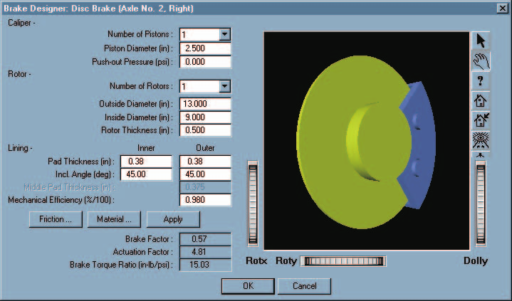
*Figure 29-10 — HVE Brake Designer for disc brake types.*

The lining friction and material attributes are selectable from the dialog's
pushbuttons. The lining friction attributes are shown earlier in this
chapter (see Lining Friction). The material attributes, used for thermal
analysis of the brake assembly, are described in
[Chapter 30](30-brake-temperature.md).

See also the code-verified dialog reference:
[Disc Brake dialog](../../04-brakes-powertrain/DiskBreakDlg.md).

## Duo-Servo Drum Brake

The brake factor for a duo-servo drum brake is calculated by assuming the
primary shoe is an abutted, leading shoe and the secondary shoe is a pinned
leading shoe. A duo-servo brake is a unique type of brake in that both shoes
are self-energizing, and the secondary shoe's brake factor is increased by
the first shoe's brake factor. Thus its brake factor is quite high.

The brake factor for the primary shoe is calculated using equation 29-4 for
an abutted leading shoe. The brake factor for the secondary shoe is
calculated using equation 29-3 for a pinned leading shoe. The brake factor
for the secondary shoe is multiplied by the following factor, which accounts
for abutment force from the primary shoe:

$$BF_{MOD} = \frac{c + BF_1 \, r}{a} \qquad (\text{29-16})$$

where $c$, $a$ and $r$ are as defined earlier in equations 29-4/29-5, and
$BF_1$ is the brake factor for the abutted leading shoe.

Thus, the total brake factor for a duo-servo brake is:

$$BF = BF_1 + BF_{MOD} \, BF_2 \qquad (\text{29-17})$$

The torque radius, $TR$, is calculated using equation 29-7, and the
actuation force is calculated using equation 29-9. The resulting brake
torque for a duo-servo drum brake is:

$$BrakeTorque = BF \times TR \times AF$$

The HVE Brake Designer dialog for duo-servo brakes is shown in Figure 29-11.

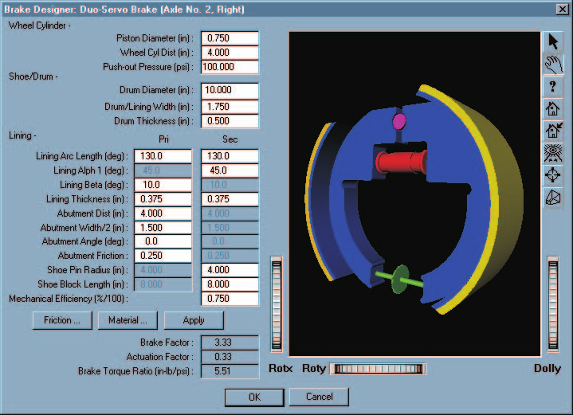
*Figure 29-11 — HVE Brake Designer for duo-servo drum brake types.*

See also the code-verified dialog reference:
[Duo-Servo Drum Brake dialog](../../04-brakes-powertrain/DueServoBrkDlg.md).

## Duplex Drum Brake

The brake factor for a duplex drum brake is calculated by assuming the
primary and secondary shoes are each abutted, leading shoes.

The brake factor for both shoes is calculated using equation 29-4 for an
abutted leading shoe. Thus, the total brake factor for a duplex brake is:

$$BF = BF_1 + BF_2$$

*(updated: the original text printed this as $BF = 2 \times BF_1$; the code
calculates the two shoes' brake factors separately — allowing different
front and rear lining angles — and sums them, which reduces to
$2 \times BF_1$ when the shoes are identical.)*

The torque radius is calculated using equation 29-7, and the actuation force
is calculated using equation 29-9. The resulting brake torque for a duplex
drum brake is:

$$BrakeTorque = BF \times TR \times AF$$

The HVE Brake Designer dialog for duplex drum brakes is shown in Figure
29-12.

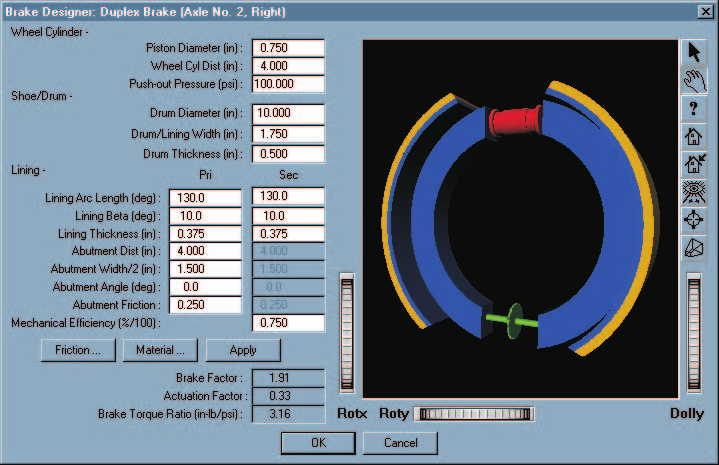
*Figure 29-12 — HVE Brake Designer for duplex drum brake types.*

See also the code-verified dialog reference:
[Duplex Drum Brake dialog](../../04-brakes-powertrain/DuplexBrkDlg.md).

## Single Piston Drum Brake

The brake factor for a single piston drum brake is calculated by assuming
the primary shoe is a pinned leading shoe and the secondary shoe is a pinned
trailing shoe. The brake factor for the primary shoe is calculated using
equation 29-3 for a pinned leading shoe using the negative sign in the
denominator. The brake factor for the secondary shoe is again calculated
using equation 29-3 for a pinned trailing shoe, except the positive sign is
used in the denominator. The torque radius is calculated using equation
29-7.

Some single piston drum brakes use a different piston area for the primary
and secondary shoes. Therefore, the actuation force is calculated separately
for the primary and secondary shoes. Equation 29-9 is used for both shoes.
For the primary shoe, the actuation force is:

$$AF_{Primary\,Shoe} = (P_{Line} - P_{Pushout}) \times A_{Primary\,Piston}$$

and for the secondary shoe, the actuation force is:

$$AF_{Secondary\,Shoe} = (P_{Line} - P_{Pushout}) \times A_{Secondary\,Piston}$$

Although only one dual-acting wheel cylinder is used, it may have different
sized pistons on each end. Therefore, the primary and secondary pistons may
have a different size.

The resulting brake torque for a single piston drum brake is:

$$BrakeTorque = (BF_1 \, AF_{Primary\,Shoe} + BF_2 \, AF_{Secondary\,Shoe}) \times TR \times \eta_{Mech}$$

*(updated: the original text printed the torque as
$(AF_{Primary} + AF_{Secondary}) \times TR \times \eta_{Mech}$, omitting the
brake factors; the code applies each shoe's brake factor to its own
actuation force before summing.)*

The HVE Brake Designer dialog for single piston drum brakes is shown in
Figure 29-13.

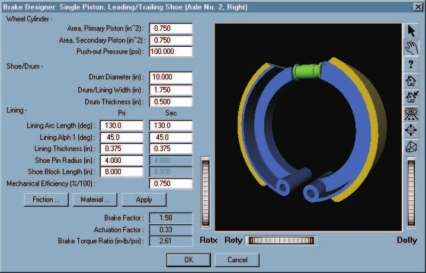
*Figure 29-13 — HVE Brake Designer for single piston drum brake types.*

See also the code-verified dialog reference:
[Single Piston Drum Brake dialog](../../04-brakes-powertrain/BrkSingPistDlg.md).

## Dual Piston Drum Brake

The brake factor for a dual piston drum brake is calculated by assuming the
primary and secondary shoes are each a pinned leading shoe, using equation
29-3. The torque radius is calculated using equation 29-7.

Like a single piston brake, some dual piston drum brakes use a different
piston area for the primary and secondary shoes. Therefore, the actuation
force is calculated separately for the primary and secondary shoes. Equation
29-9 is used for both shoes. For the primary shoe, the actuation force is:

$$AF_{Primary\,Shoe} = (P_{Line} - P_{Pushout}) \times A_{Primary\,Piston}$$

and for the secondary shoe, the actuation force is:

$$AF_{Secondary\,Shoe} = (P_{Line} - P_{Pushout}) \times A_{Secondary\,Piston}$$

The resulting brake torque for a dual piston drum brake is:

$$BrakeTorque = (BF_1 \, AF_{Primary\,Shoe} + BF_2 \, AF_{Secondary\,Shoe}) \times TR \times \eta_{Mech}$$

*(updated: as for the single piston brake, the code applies each shoe's
brake factor to its own actuation force.)*

The HVE Brake Designer dialog for dual piston drum brakes is shown in Figure
29-14.

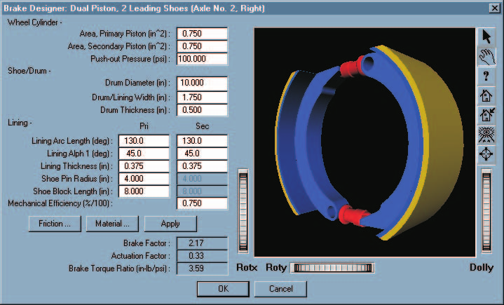
*Figure 29-14 — HVE Brake Designer for dual piston drum brake types.*

See also the code-verified dialog reference:
[Dual Piston Drum Brake dialog](../../04-brakes-powertrain/DualPistBrkDlg.md).

## S-Cam Drum Brake

The brake factor for an S-cam drum brake is calculated by assuming the
primary shoe is a pinned leading shoe and the secondary shoe is a pinned
trailing shoe. The brake factor for the leading shoe is calculated using
equation 29-3, with the negative sign in the denominator. The brake factor
for the secondary shoe is again calculated using equation 29-3 for a pinned
trailing shoe, except the positive sign is used in the denominator. Because
the S-cam applies equal *displacement* (rather than equal force) to the two
shoes, the combined brake factor is:

$$BF = \frac{4 \, BF_1 \, BF_2}{BF_1 + BF_2}$$

*(updated: the original edition summed the leading- and trailing-shoe brake
factors, $BF = BF_1 + BF_2$. The current code (`HveBrakes.cpp`, S-cam case)
uses the equal-displacement relationship above, per Limpert, Eq. 2-22, which
correctly accounts for the fixed-cam force redistribution between the
shoes.)*

Actuation force is calculated using equation 29-10. The torque radius is
calculated using equation 29-7.

Unlike the hydraulic brake types, S-cam brakes use an actuation factor to
account for the level of adjustment. The actuation factor is calculated
using equations 29-12 through 29-15.

The resulting brake torque for an S-cam drum brake is:

$$BrakeTorque = BF \times TR \times AF \times Factor$$

The HVE Brake Designer dialog for S-cam drum brakes is shown in Figure
29-15.

*Figure 29-15 — HVE Brake Designer for S-cam drum brake types.*

## Single Wedge Drum Brake

The brake factor for a single wedge drum brake is calculated by assuming the
primary shoe is a pinned leading shoe and the secondary shoe is a pinned
trailing shoe. The brake factor for the leading shoe is calculated using
equation 29-3, with the negative sign in the denominator. The brake factor
for the secondary shoe is again calculated using equation 29-3 for a pinned
trailing shoe, except the positive sign is used in the denominator. The
total brake factor is the sum of the two shoe brake factors. The torque
radius is calculated using equation 29-7. The actuation force is calculated
using equation 29-11 and the actuation factor is calculated using equations
29-12 through 29-15.

The resulting brake torque for a single wedge drum brake is:

$$BrakeTorque = BF \times TR \times AF \times Factor$$

The HVE Brake Designer dialog for single wedge drum brakes is shown in
Figure 29-16.

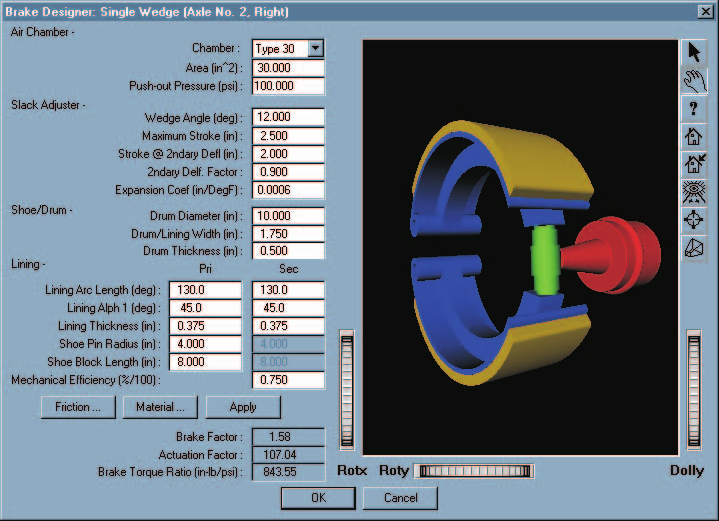
*Figure 29-16 — HVE Brake Designer for single wedge drum brake types.*

## Dual Wedge Drum Brake

The brake factor for a dual wedge drum brake is calculated by assuming the
primary and secondary shoes are both abutted leading shoes, using equation
29-4 for each shoe. The total brake factor is the sum of the two shoe brake
factors. The torque radius is calculated using equation 29-7. The actuation
force is calculated using equation 29-11 and the actuation factor is
calculated using equations 29-12 through 29-15.

The resulting brake torque for a dual wedge drum brake is:

$$BrakeTorque = BF \times TR \times AF \times Factor$$

The HVE Brake Designer dialog for dual wedge drum brakes is shown in Figure
29-17.

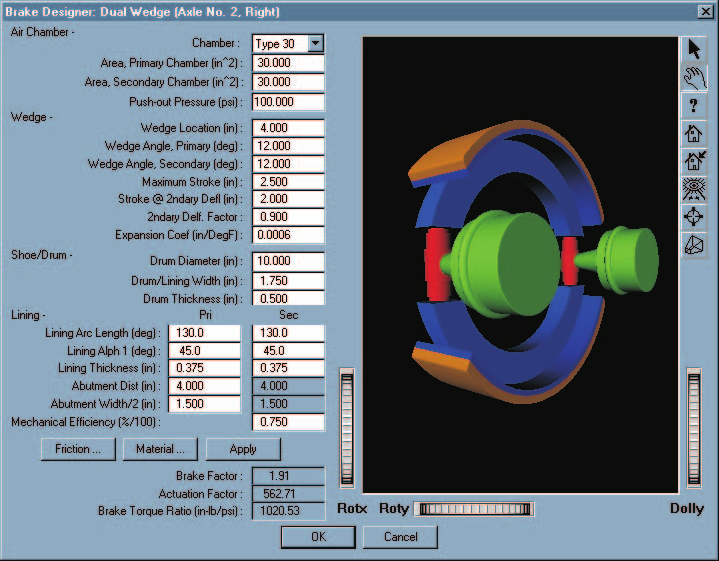
*Figure 29-17 — HVE Brake Designer for dual wedge drum brake types.*

See also the code-verified dialog reference:
[Dual Wedge Drum Brake dialog](../../04-brakes-powertrain/DualWedgeBrkDlg.md).

## Air Disc Brake

*(updated: this brake type was added after the original edition of the
manual; it is documented here from the current source code
(`BrakeDesignAirDiscBrake.cpp`, `HveBrakes.cpp` type 9).)*

The air disc brake combines the caliper disc brake friction model with
air-chamber actuation. The brake factor is calculated using equation 29-2
(caliper brake, $BF = 2\mu_L$), and the torque radius using equation 29-6.
The actuation force is produced by an air chamber acting through an internal
lever (eccentric) mechanism:

$$ActuationForce = (P_{Line} - P_{Pushout}) \times A_{AirChamber} \times \eta_{Mech} \times L_{Ratio}$$

where $L_{Ratio}$ is the internal lever (slack adjuster) ratio of the
caliper mechanism.

Like the S-cam and wedge brakes, the air disc brake actuation force is
multiplied by the stroke-based actuation factor calculated using equations
29-12 through 29-15, allowing out-of-adjustment and thermal-expansion
effects to be studied.

The resulting brake torque for an air disc brake is:

$$BrakeTorque = BF \times TR \times AF \times Factor$$

## Notes on the Brake Designer Dialogs

- Each per-type Brake Designer dialog displays an embedded schematic preview
  drawing of the brake, updated to reflect the current dimensions. *(The
  legacy dialogs included a separate Preview button; it has been removed —
  the preview is now always displayed.)*
- The **Friction ...** button opens the Lining Friction Properties dialog
  (friction vs temperature and friction factor vs sliding speed tables; see
  Figure 29-3).
- The **Material ...** button opens the
  [Brake Designer Material Properties dialog](../../04-brakes-powertrain/BrkMatPropDlg.md),
  used for the thermal analysis described in
  [Chapter 30](30-brake-temperature.md).
- The **Apply** button recomputes the Brake Factor, Actuation Factor and
  Brake Torque Ratio from the current physical parameters.

<!-- NAV -->

---

← Previous: [Section Eleven: HVE Brake Designer](README.md)  |  [Index](README.md)  |  Next: [Chapter 30 — Brake Temperature Model](30-brake-temperature.md) →

<!-- /NAV -->
