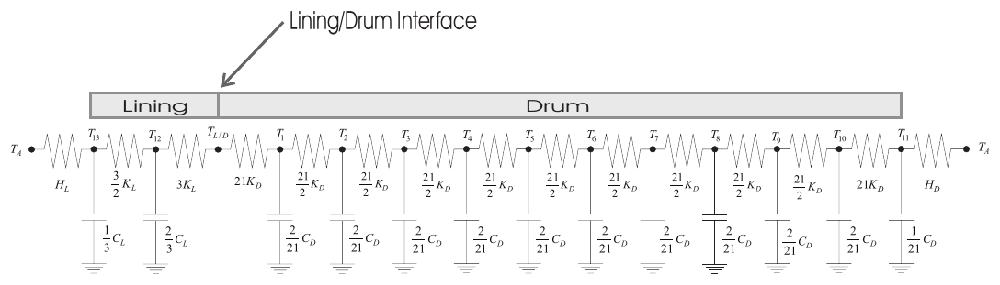
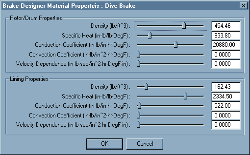

# Chapter 30 — Brake Temperature Model

*Updated Markdown edition of the HVE User's Manual (HVE Version 5, Seventh
Edition, January 2006), Chapter 30, pages 30-1 through 30-16. Verified against the current HVE application source
(`HVEINV-64/BrakeDesignMaterialProperties.cpp` and the brake model in
`HveBrakes.cpp`); see also the code-verified
[Brake Designer Material Properties dialog reference](../../04-brakes-powertrain/BrkMatPropDlg.md).*

## Overview

During braking, the vehicle's kinetic energy is converted into heat energy by
the wheel brake assemblies. This energy causes a temperature rise in the
brake assembly components (linings and rotor or drum) that is dissipated into
the atmosphere through conduction and convection.

The modeling procedure used in the HVE Brake Temperature Model was adapted
from the lumped mass method proposed by MacAdam, et al [4.2]. This chapter
describes how brake temperatures are calculated. This description involves
four subjects:

- Modeling Technique
- Model Inputs
- Model Outputs
- Equations

Temperature change affects the performance of the wheel brake assemblies by
expansion of the components and by altering the friction of the lining
material. Therefore, the HVE Brake Designer (see
[Chapter 29](29-brake-designer.md)) includes the temperatures calculated by
this model as an independent input to the equations for brake torque.

## Modeling Technique

Calculating the temperature of brake system components is a classic heat
flow problem. $\dot{H}$, the rate of work (heat energy) into the system is:

$$\dot{H} = Work \times Rate \qquad (\text{30-1})$$

In the case of a wheel brake assembly, the rate of work at any instant is:

$$\dot{H} = Brake\ Torque \times Wheel\ Spin\ Velocity \qquad (\text{30-2})$$

This energy is absorbed into the brake linings and drum/rotor through
conduction, stored through capacitance and removed through convection.

> **NOTE:** Radiant heat transfer is considered negligible for the range of
> temperatures encountered and, thus, is not considered by the model.

Using a lumped mass model, the rotor/drum is divided into 10 nodes across
its thickness, the lining is one node and the lining and rotor or drum
exterior surfaces each represent a node. Thus, the model includes a total of
13 nodes at which the temperature may be calculated (see Figure 30-1).
Associated with each node are its thermal parameters: conductivity,
convectivity and heat capacitance. At any instant the First Law of
Thermodynamics (i.e., an energy balance) may be expressed as:

$$[M]\left[\frac{dT}{dt}\right] = [S][T] + [C]\,T_{L/D} + [D]\,T_A \qquad (\text{30-3})$$

where

| Symbol | Description |
| --- | --- |
| $[M]$ | Capacitance matrix |
| $\left[\frac{dT}{dt}\right]$ | Thermal rate matrix |
| $[S]$ | Internal Temperature Coefficient matrix |
| $[T]$ | Temperature matrix |
| $[C]$ | Boundary condition conductivity matrix |
| $T_{L/D}$ | Interface temperature |
| $[D]$ | Boundary condition convectivity matrix |
| $T_A$ | Ambient temperature |

*Figure 30-1 — Representation of the 13-node lumped parameter brake
temperature model [4.2]: ambient air — lining exterior surface node T₁₃ —
lining node T₁₂ — lining/drum interface T_L/D — drum/rotor nodes T₁ … T₁₀ —
drum/rotor exterior surface node T₁₁ — ambient air, with conductances
(3/2 K_L, 3K_L on the lining side; 21K_D, 21/2 K_D between drum nodes),
convection coefficients H_L and H_D at the exposed surfaces, and nodal
capacitances (C_L/3, 2C_L/3 for the lining; 2C_D/21 for interior drum nodes
and C_D/21 at the drum surface).*

This matrix equation is solved for $[T]$, the temperature at each node, at
each integration timestep. The outputs of interest are $T_5$ (the temperature
at the interior of the drum or rotor), $T_{L/D}$ (the temperature at the
interface between the lining and drum or rotor), and $T_{12}$ (the
temperature at the interior of the lining). The specific model inputs,
outputs and solution procedure are described below.

## Model Inputs

The inputs to the lumped mass model are:

- **Drum Diameter (Drum Brake), $D_D$** — Inside diameter of the brake
  drum. The torque radius (half the drum diameter) is the lever arm of the
  force applied by the brake lining.
- **Rotor Inner and Outer Diameter (Disc Brake), $D_i$, $D_o$** — Rotor
  outer and inner diameter. The torque radius is defined as the midpoint
  between the inner and outer radii.
- **Lining Width (Drum Brake), $W_L$** — Width of the rubbing surface in
  the inside diameter of the drum.
- **Included Angle (Disc Brake), $\gamma_L$** — Pad included angle. The
  included angle and inner and outer diameter define the pad contact surface
  area with the rotor.
- **Drum/Rotor Specific Heat, $C_{pD}$** — Specific heat of the drum or
  rotor material.
- **Drum/Rotor Material Density, $\rho_D$** — Density of the drum or rotor.
- **Drum/Rotor Conduction Coefficient, $K_D$** — Coefficient of thermal
  conduction for the drum or rotor material.
- **Drum/Rotor Convection Coefficients, $H_{0D}$, $H_{1D}$** — Coefficients
  of thermal convection at the drum or rotor interface with the surrounding
  air. The first coefficient, $H_{0D}$, is the static convection
  coefficient; the second coefficient, $H_{1D}$, is the velocity-dependent
  convection coefficient to account for the effect of vehicle velocity on
  convective heat transfer.
- **Lining Specific Heat, $C_{pL}$** — Specific heat of the brake shoe or
  pad lining material.
- **Lining Mass, $M_L$** — Mass of the brake shoe or pad lining material,
  calculated from the product of the volume and material density.
- **Lining Conduction Coefficient, $K_L$** — Coefficient of thermal
  conduction for the brake shoe or pad lining material.
- **Lining Convection Coefficients, $H_{0L}$, $H_{1L}$** — Coefficients of
  thermal convection at the brake lining material interface with the
  surrounding air. The first coefficient, $H_{0L}$, is the static convection
  coefficient; the second coefficient, $H_{1L}$, is the velocity-dependent
  convection coefficient to account for the effect of vehicle velocity on
  convective heat transfer.

*Figure 30-2 — Brake Material Properties dialog. Default material properties
are assigned for cast iron drums and rotors, and common lining friction
materials. (See the [dialog reference page](../../04-brakes-powertrain/BrkMatPropDlg.md).)*

These parameters, shown in Table 30-1, are assigned using the HVE Brake
Designer dialogs (see Figures 29-10 through 29-17) and the Brake Material
Properties dialog (see Figure 30-2).

The remaining independent parameters for the brake temperature model are
assigned by the user during event set-up:

- **Environment Ambient Temperature, $T_A$** — Ambient temperature,
  assigned using the Environment Information dialog (see Section Five).
- **Initial Rotor/Drum Temperature, $T_{0D}$** — Temperature of the drum or
  rotor at the start of the simulation, assigned using the Event Editor.
- **Initial Lining Temperature, $T_{0L}$** — Temperature of the lining at
  the start of the simulation, assigned using the Event Editor (see Section
  Six).

> **NOTE:** See Table 29-2 for parameter definitions related to shoe and
> rotor/drum geometry.

**Table 30-1 — Brake Material Properties**

| Parameter | Unit Name | Description |
| --- | --- | --- |
| Rotor/Drum Material Density | UtVehDensity | Density of rotor or drum material (used for calculating the mass of the rotor or drum) |
| Rotor/Drum Specific Heat | UtVehSpecificHeat | Change in enthalpy of the brake rotor or drum material with respect to temperature at constant pressure |
| Rotor/Drum Conduction Coefficient | UtVehConduction | Energy transfer coefficient through the brake rotor or drum material |
| Rotor/Drum Convection Coefficient | UtVehConvection | Static convective energy transfer coefficient between the brake rotor or drum surface and adjacent air |
| Rotor/Drum Velocity-Dependent Convection Coefficient | UtVehConvectionVel | Velocity-dependent energy transfer coefficient between the brake rotor or drum surface and adjacent air (i.e., this coefficient is multiplied by vehicle linear velocity to determine the convection rate) |
| Lining Material Density | UtVehDensity | Density of lining material (used for calculating the mass of the pads or shoe linings) |
| Lining Specific Heat | UtVehSpecificHeat | Change in enthalpy of the brake lining material with respect to temperature at constant pressure |
| Lining Conduction Coefficient | UtVehConduction | Energy transfer coefficient through the brake lining material |
| Lining Convection Coefficient | UtVehConvection | Static convective energy transfer coefficient between the brake lining surface and adjacent air |
| Lining Velocity-Dependent Convection Coefficient | UtVehConvectionVel | Velocity-dependent energy transfer coefficient between the brake lining surface and adjacent air (i.e., this coefficient is multiplied by vehicle linear velocity to determine the convection rate) |

> **NOTE:** Drum Diameter, Rotor Inner and Outer Diameter, Lining Width and
> Included Angle are defined in [Chapter 29, HVE Brake
> Designer](29-brake-designer.md).

## Model Outputs

The outputs from the model are:

- **Lining Exterior Surface Temperature, $T_{LS}$** — Temperature at the
  interface between the lining and the outside air (node 13).
- **Lining Internal Temperature, $T_L$** — Internal lining temperature 1/3
  of the distance from the interface to the lining exterior (node 12).
- **Interface Temperature, $T_{L/D}$** — Temperature at the interface
  between the lining and drum or rotor. This point is important as it
  represents the location where heat energy is introduced into the system
  (see Figure 30-1).
- **Rotor/Drum Internal Temperature, $T_D$** — Internal temperature of the
  rotor or drum at node 5.
- **Exterior Rotor/Drum Temperature, $T_{DS}$** — Temperature at the rotor
  or drum interface with the outside air (node 1). *(Per the node layout in
  Figure 30-1, the drum exterior surface is the last drum node, node 11.)*

$T_L$, $T_{L/D}$ and $T_D$ are available in the Vehicle Output Tracks, Wheel
Group (Key Results or Variable Output; see Chapter 15, Event Model).

## Model Equations

The fundamental equations for the solution of $T_{L/D}$ and $T_N$ were shown
earlier in matrix form (see eq. 30-3). The following sections provide details
for the calculation of the interface temperature and matrix coefficients.

### Interface Temperature

The temperature at the interface between the lining and drum/rotor is:

$$T_{L/D} = \frac{\dot{H} + 21 K_D T_{D_1} + 3 K_L T_{D_{10}}}{21 K_D + 3 K_L} \qquad (\text{30-4})$$

where $T_{D_1}$ is the temperature of the drum/rotor node adjacent to the
interface (node 1) and $T_{D_{10}}$ (as printed in the original) refers to
the temperature of the lining node adjacent to the interface (node 12 in
Figure 30-1).

### Capacitance Matrix, M

The thermal capacitance coefficients are calculated as follows:

#### Rotor/Drum

$$C_D = C_{PD}\,\rho_D\,V_D \qquad (\text{30-5})$$

where

| Symbol | Description |
| --- | --- |
| $C_D$ | Capacitance coefficient for rotor or drum |
| $C_{PD}$ | Specific heat of rotor or drum material |
| $\rho_D$ | Density of rotor or drum material |
| $V_D$ | Volume of rotor or drum |

$$V_D = \frac{\pi}{4}\left(D_o^2 - D_i^2\right) x_D \quad \text{(Rotor)}$$

where $D_o$ = rotor outer diameter, $D_i$ = rotor inner diameter and $x_D$ =
rotor thickness;

$$V_D = \pi D_D W_L x_D \quad \text{(Drum)}$$

where $D_D$ = drum diameter, $W_L$ = lining width and $x_D$ = drum
thickness.

#### Lining

$$C_L = C_{PL}\,\rho_L\,V_L \qquad (\text{30-6})$$

where

| Symbol | Description |
| --- | --- |
| $C_L$ | Capacitance coefficient for lining |
| $C_{PL}$ | Specific heat of lining material |
| $\rho_L$ | Density of lining material |
| $V_L$ | Volume of lining material |

$$V_L = \frac{\gamma_L \pi}{1440}\left(D_o^2 - D_i^2\right) x_D \quad \text{(Rotor brake pad)}$$

where $\gamma_L$ = pad arc length (deg), $D_o$ = outer rotor diameter, $D_i$
= inner rotor diameter and $x_D$ = pad thickness; and

$$V_L = \left(\frac{\alpha_{o,Pri} + \alpha_{o,Sec}}{360}\right)\pi D_D W_L x_D \quad \text{(Drum brake lining)}$$

where $\alpha_{o,Pri}$ = arc length of primary shoe (deg), $\alpha_{o,Sec}$
= arc length of secondary shoe (deg), $D_D$ = drum diameter, $W_L$ = lining
width and $x_D$ = lining thickness.

Using these capacitance coefficients, $C_D$ and $C_L$, the capacitance
matrix, $M$, for the 13-node lumped mass model is the diagonal matrix:

$$
[M] = \mathrm{diag}\!\left(
\underbrace{\tfrac{2}{21}C_D,\; \cdots,\; \tfrac{2}{21}C_D}_{\text{drum nodes }1\ldots10},\;
\tfrac{C_D}{21},\;
\tfrac{2}{3}C_L,\;
\tfrac{C_L}{3}
\right)
$$

(the first ten diagonal entries, for the interior drum/rotor nodes, are
$\tfrac{2}{21}C_D$; the eleventh, for the drum/rotor exterior surface node,
is $\tfrac{C_D}{21}$; the twelfth, for the lining node, is
$\tfrac{2}{3}C_L$; and the thirteenth, for the lining exterior surface node,
is $\tfrac{C_L}{3}$).

### Internal Temperature Coefficient Matrix

The internal temperature coefficient matrix is composed of both conduction
and convection coefficients. The conduction coefficients are calculated as
follows:

#### Rotor/Drum

$$K_D = \frac{k_D A_D}{x_D} \qquad (\text{30-7})$$

where

| Symbol | Description |
| --- | --- |
| $K_D$ | Conductivity coefficient of rotor or drum |
| $k_D$ | Conductivity of rotor or drum material |
| $A_D$ | Heat transfer area of rotor or drum |
| $x_D$ | Thickness of rotor or drum |

$$A_D = \frac{\pi}{4}\left(D_o^2 - D_i^2\right) \quad \text{(rotor)}$$

where $D_o$ = rotor outer diameter and $D_i$ = rotor inner diameter;

$$A_D = \pi D_D W_L \quad \text{(drum)}$$

where $D_D$ = drum diameter and $W_L$ = lining width.

#### Lining

$$K_L = \frac{k_L A_L}{x_L} \qquad (\text{30-8})$$

where

| Symbol | Description |
| --- | --- |
| $K_L$ | Conductivity coefficient for lining |
| $k_L$ | Conductivity of lining material |
| $A_L$ | Heat transfer area of lining |
| $x_L$ | Thickness of lining |

$$A_L = \frac{\gamma \pi}{1440}\left(D_o^2 - D_i^2\right) \quad \text{(Disc brake pad)}$$

where $\gamma$ = included pad angle, $D_o$ = outer rotor diameter and $D_i$
= inner rotor diameter; and

$$A_L = \left(\frac{\alpha_{o,Pri} + \alpha_{o,Sec}}{360}\right)\pi D_D W_L \quad \text{(Drum brake shoes)}$$

where $\alpha_{o,Pri}$ = included angle of primary shoe, $\alpha_{o,Sec}$ =
included angle of secondary shoe, $D_D$ = drum diameter and $W_L$ = lining
width.

The convection coefficients are calculated as follows:

#### Rotor/Drum

$$H_D = (H_{0D} + H_{1D} V)\, A_D \qquad (\text{30-9})$$

where

| Symbol | Description |
| --- | --- |
| $H_D$ | Convectivity matrix coefficient for rotor or drum |
| $H_{0D}$ | Convection coefficient for rotor or drum |
| $H_{1D}$ | Velocity-dependent convection coefficient |
| $V$ | Vehicle linear velocity |
| $A_D$ | Convective surface area for rotor or drum (same as previously defined rotor or drum area) |

#### Lining

$$H_L = (H_{0L} + H_{1L} V)\, A_L \qquad (\text{30-10})$$

where

| Symbol | Description |
| --- | --- |
| $H_L$ | Convectivity matrix coefficient for pad or lining |
| $H_{0L}$ | Convection coefficient for pad or lining |
| $H_{1L}$ | Velocity-dependent convection coefficient |
| $V$ | Vehicle linear velocity |
| $A_L$ | Convective surface area for pad or lining (same as previously defined pad or lining area) |

*(The original printing of eq. 30-10 shows "$H_{1D}$" inside the
parentheses; the lining velocity-dependent coefficient $H_{1L}$ is
intended, as defined in the symbol list.)*

The internal temperature coefficient matrix for the 13-node lumped mass
model is the tridiagonal matrix:

$$
[S] =
\begin{bmatrix}
-\frac{63}{2}K_D & \frac{21}{2}K_D & & & & & \\
\frac{21}{2}K_D & -21K_D & \frac{21}{2}K_D & & & & \\
& \frac{21}{2}K_D & -21K_D & \frac{21}{2}K_D & & & \\
& & \ddots & \ddots & \ddots & & \\
& & & \frac{21}{2}K_D & -\frac{63}{2}K_D & 21K_D & \\
& & & & 21K_D & -21K_D - H_D & \\
& & & & & -\frac{9}{2}K_L & \frac{3}{2}K_L \\
& & & & & \frac{3}{2}K_L & -\frac{3}{2}K_L - H_L
\end{bmatrix}
$$

Rows 1 through 10 form the drum/rotor conduction chain; row 11 is the
drum/rotor exterior surface node, which includes the drum convection loss
term; rows 12 and 13 are the lining node and lining exterior surface node,
the latter including the lining convection loss term $H_L$. *(The original
printing shows "$-21K_D - H_L$" in row 11; the drum surface convection
coefficient $H_D$ is intended there.)*

### Internal Temperature Matrix, T

$T$ is a matrix of dependent temperature results for each of the 10 rotor
(or drum) nodes, the lining node and the two surface nodes. The $T$ matrix
is as follows:

$$[T] = \begin{bmatrix} T_1 \\ T_2 \\ T_3 \\ T_4 \\ T_5 \\ T_6 \\ T_7 \\ T_8 \\ T_9 \\ T_{10} \\ T_{11} \\ T_{12} \\ T_{13} \end{bmatrix}$$

The $T$ matrix contains the brake model outputs:

- **Lining Temperature, $T_{12}$** — Temperature at node 12, 1/3 of the
  distance from the interface to the lining exterior.
- **Rotor/Drum Temperature, $T_5$** — Temperature at node 5, approximately
  half way from the interface to the rotor/drum exterior.

### Boundary Condition C Matrix

The boundary condition $C$ matrix provides the heat conduction coefficients
for the drum and lining. The conduction coefficients were defined earlier;
see eq. 30-7 for the rotor/drum conduction coefficients and eq. 30-8 for the
lining conduction coefficients.

The resulting matrix for the 13-node lumped mass model is as follows:

$$[C] = \begin{bmatrix} 21K_D \\ 0 \\ 0 \\ 0 \\ 0 \\ 0 \\ 0 \\ 0 \\ 0 \\ 0 \\ 0 \\ 3K_L \\ 0 \end{bmatrix}$$

(the interface heat input enters the system at drum node 1 and lining node
12, the two nodes adjacent to the lining/drum interface).

### Boundary Condition D Matrix

The boundary condition $D$ matrix provides the heat convection coefficients
between the drum and lining and the surrounding air. The convection
coefficients were defined earlier; see eq. 30-9 for the rotor/drum
convection coefficients and eq. 30-10 for the lining convection
coefficients.

The resulting matrix for the 13-node lumped mass model is as follows:

$$[D] = \begin{bmatrix} 0 \\ 0 \\ 0 \\ 0 \\ 0 \\ 0 \\ 0 \\ 0 \\ 0 \\ 0 \\ H_D \\ 0 \\ H_L \end{bmatrix}$$

(convective losses to ambient air occur at the drum/rotor exterior surface,
node 11, and the lining exterior surface, node 13; the original printing
shows these entries as "$K A_D$" and "$K A_L$", i.e., the convection
coefficient times the surface area, which is the definition of $H_D$ and
$H_L$ in eqs. 30-9 and 30-10).

### Solution Procedure

The $M$, $S$, $T$, $C$ and $D$ matrices are used in the solution for the
current temperature matrix, $T$. Eq. 30-3, defined earlier, is rearranged by
inverting the $M$ matrix. Then, three new working matrices are defined:

$$[S'] = [M]^{-1}[S]$$
$$[C'] = [M]^{-1}[C]$$
$$[D'] = [M]^{-1}[D]$$

where $[M]^{-1}$ is the inverted $[M]$ matrix.

Rearranging eq. 30-3 to solve for $\left[\frac{dT}{dt}\right]$ yields:

$$\left[\frac{dT}{dt}\right] = [S'][T_{Prev}] + [C']\,T_{L/D} + [D']\,T_A \qquad (\text{30-11})$$

where

| Symbol | Description |
| --- | --- |
| $\left[\frac{dT}{dt}\right]$ | Time rate of change in temperature |
| $[T_{Prev}]$ | Temperature at each node during the previous timestep |

Finally, the current temperature at each node can be calculated:

$$[T] = \left[\frac{dT}{dt}\right]\Delta t + [T_{Prev}] \qquad (\text{30-12})$$

where

| Symbol | Description |
| --- | --- |
| $\Delta t$ | Integration timestep |

The resulting temperature at nodes 5 and 12 (internal drum and lining
temperatures, respectively) and the temperature at the lining/drum (or
pad/rotor) interface are available in the output tracks (Wheels Group). In
addition, the lining temperature is used (along with the current wheel spin
velocity) by the wheel brake torque calculations (see
[Chapter 29](29-brake-designer.md)) to assign the current lining friction
coefficient.

<!-- NAV -->

---

← Previous: [Chapter 29 — HVE Brake Designer](29-brake-designer.md)  |  [Index](README.md)  |  Next: [Chapter 31 — Antilock Braking Systems](31-abs.md) →

<!-- /NAV -->
