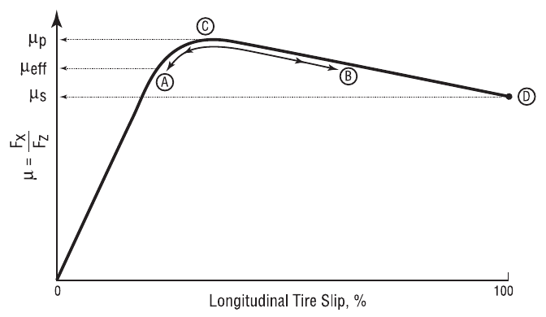
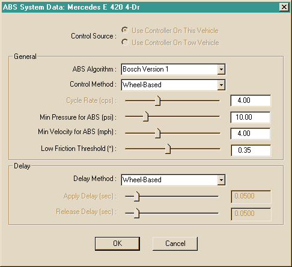
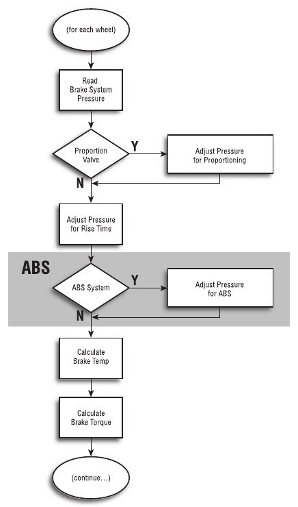
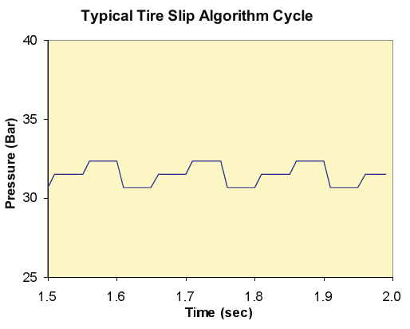
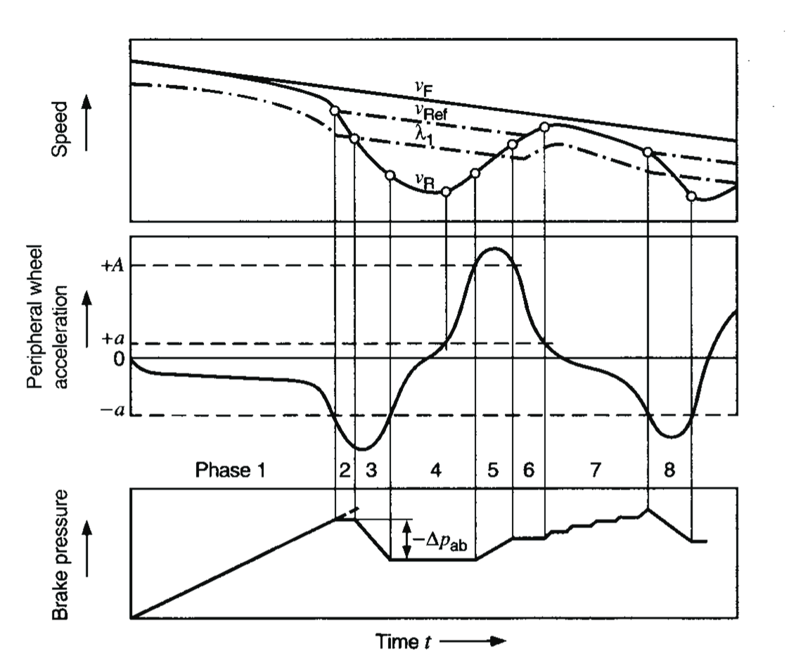
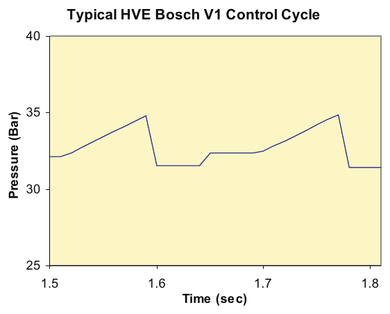

# Chapter 31 — Antilock Braking Systems

*Updated Markdown edition of the HVE User's Manual (HVE Version 5, Seventh
Edition, January 2006), Chapter 31, pages 31-1 through 31-22. Verified against the current HVE application source
(`HVEINV-64/ABSSystemDlg.cpp`, `ABSDesignerDlg.cpp`, `BrakePage.cpp`).*

## Overview

Most vehicles built today are fitted with anti-lock braking systems (ABS).
Accurate simulation modeling of these vehicles during braking, as well as
combined braking and steering maneuvers, thus requires the effects of the
ABS to be included. This is especially true for the simulation of complex
crash avoidance maneuvers.

This chapter describes the ABS model implemented in the HVE user
environment. It is a general purpose model, available for use by any
HVE-compatible vehicle simulation model. The model is applicable to the
design of ABS systems, as well as the study of loss-of-control crashes of
ABS-equipped vehicles.

This chapter covers the following topics:

- **ABS Methodologies** — A basic overview describing how ABS works
- **ABS State Variables** — A list of the parameters that determine the
  current state of the ABS system
- **Typical Hardware** — A description of the hardware components common to
  most ABS systems
- **HVE ABS User Interface** — A detailed description of the parameters
  included in the HVE ABS dialogs and how the parameters are used to model
  various ABS systems
- **Current Models** — An overview of the ABS models currently implemented
  in HVE
- **Procedures** — A step-by-step overview of the procedures for simulating
  an ABS system on a vehicle

## ABS Methodologies

The basic concept behind ABS is quite simple and can be demonstrated by the
graph of normalized braking force vs longitudinal tire slip shown in Figure
31-1. This graph is traditionally called a *mu-slip curve*. It defines the
relationship between longitudinal tire slip and the resulting longitudinal
(braking) force. A key observation is that the maximum braking force occurs
at the peak braking coefficient, $\mu_p$, in the vicinity of 10 to 15
percent longitudinal tire slip (this varies somewhat from tire to tire).
Also, as the tire slip continues to increase to 100 percent, the available
braking force falls off. The region of tire slip between $\mu_p$ and $\mu_s$
(slide friction coefficient, or 100 percent longitudinal tire slip,
associated with locked-wheel braking) is a region of dynamic instability. As
slip begins to increase beyond $\mu_p$ it quickly increases to 100 percent
(i.e., the tire locks) with a commensurate loss in available braking force.

The goal of an ABS system is simply to prevent the tire slip from increasing
significantly beyond $\mu_p$ — regardless of how much brake pedal force is
applied by the driver. By keeping the longitudinal slip in the stable region
below the peak (see Figure 31-1), the tire continues to roll and, therefore,
maintains directional control capability (i.e., the driver can steer the
vehicle). In addition, the available braking force is larger than for a
locked tire and, therefore, braking distance can be reduced.

*Figure 31-1 — Typical graph of normalized braking force vs longitudinal
tire slip, also called a mu-slip curve.*

ABS simulation takes advantage of the simulation model's wheel spin degree
of freedom, wherein the braking force is calculated from first principles,
rather than simply specified as a force at the tire-road interface. To truly
simulate ABS, the algorithm must modulate the simulated brake pressure at
the wheel, just as it does on an actual vehicle. The procedures for
accomplishing this task are described below.

All ABS methodologies work by controlling tire longitudinal slip. This is
accomplished through the use of wheel sensors that compare the tire
circumferential velocity to the current reference velocity, $V_r$, normally
calculated using the current spin velocities of two or more wheels (see
reference 4.42 for a detailed discussion of the calculation of reference
velocity). On a vehicle, the longitudinal tire slip cannot be measured
directly. Instead, slip is calculated:

$$Slip = \frac{V_r - \dot{\Omega}_w \times R_{tire}}{V_r} \qquad (\text{31-1})$$

where

| Symbol | Description |
| --- | --- |
| $V_r$ | Reference velocity |
| $\dot{\Omega}_w$ | Wheel spin velocity |
| $R_{tire}$ | Current tire rolling radius |

### State Variables

To accomplish the required control of longitudinal slip, the following state
variables are monitored or calculated by the vehicle's ABS control module:

- **Vehicle Velocity** — Linear velocity of the vehicle sprung mass
- **Wheel Spin Velocity** — Angular velocity of each wheel (or axle on some
  systems)
- **Tire Longitudinal Slip** — Relative velocity between the tire and road,
  expressed as a fraction of vehicle velocity
- **Wheel Spin Acceleration** — Angular acceleration of each wheel
- **Tire-Road Surface Friction** — Ratio of the maximum braking force to
  the normal tire force
- **Brake System Pressure** — Pressure produced as a result of the driver's
  brake pedal application (input variable)
- **Wheel Brake Pressure** — Pressure supplied to the wheel brake assembly
  (output variable)

### Typical Hardware

To monitor or calculate the above state variables, the typical ABS system
includes the following hardware components:

- **Electronic Control Unit (ECU)** — This is the vehicle's microcomputer.
  It is programmed with the algorithm that reads the current state
  variables, determines the required pressure at each wheel and sends the
  appropriate signals to the brake pressure modulator (see below).
- **Wheel Speed Sensors** — These components directly measure the wheel
  spin velocity of each wheel using a wheel-mounted pulse rotor (a notched
  metal ring) and a fixed, magnetic sensor that measures the rotation of the
  pulse rotor.
- **Brake Pressure Modulator** — This component (or components, depending
  on the system) controls the wheel brake pressure according to the control
  conditions specified by the ECU.
- **Brake Master Cylinder/Air Compressor** — This component provides the
  fluid pressure source.
- **Wheel Brake Caliper/Cylinder/Chamber** — This component applies the
  specified braking force at each wheel according to the wheel brake
  pressure.

The basic hardware requirements are generally the same for all vehicle
types, ranging from passenger cars to on-highway trucks. Reference 4.42
provides a detailed description of these required components.

## ABS User Interface

The HVE ABS user interface allows the user to select an ABS algorithm and to
enter and edit the independent parameters required by the selected ABS
algorithm. The interface includes numerous options; thus, various algorithms
may be supported. The interface is divided into two sections:

- **System Variables** — Variables that are applicable to the entire
  vehicle
- **Wheel Variables** — Variables that may be specified independently for
  each wheel

The interface, dialogs and associated variables are described below.

*Figure 31-2 — ABS System Data dialog. These parameters affect the entire
vehicle (compare with the ABS Wheel Data dialog).*

*Figure 31-3 — ABS Wheel Data dialog. These parameters affect the selected
wheel (compare with the ABS System Data dialog).*

**Table 31-1 — HVE ABS System variables. These variables apply to the entire
vehicle (compare with Wheel Variables in Table 31-2).**

| Parameter | Unit Name | Description |
| --- | --- | --- |
| Control Source | UtNone | Location of ABS controller (This Vehicle or Tow Vehicle) |
| Algorithm | UtNone | ABS algorithm selected from a list of available algorithms |
| Control Method | UtNone | ABS control method (Vehicle-Based, Axle-Based or Wheel-Based) |
| Cycle Rate | UtFrequency | Determines the time required for a complete ABS cycle |
| Threshold Brake System Pressure | UtBraPress | Minimum system pressure for ABS activation |
| Threshold Vehicle Velocity | UtVehVelLinear | Minimum vehicle velocity for ABS activation |
| Low Friction Threshold | UtNone | Tire-terrain surface friction threshold |
| Delay Method | UtNone | ABS delay method (Vehicle-Based, Axle-Based or Wheel-Based) |
| Apply Delay | UtBraTime | Time delay for start of controlled output pressure increase |
| Release Delay | UtBraTime | Time delay for start of controlled output pressure decrease |

**Table 31-2 — HVE ABS Wheel variables. These variables apply to the
selected axle or wheel (compare with System Variables in Table 31-1).**

| Parameter | Unit Name | Description |
| --- | --- | --- |
| Wheel Minimum Velocity | UtVehVelLinear | Minimum wheel forward velocity for ABS control |
| Tire Slip, Minimum | UtBraPercent | Minimum tire longitudinal slip for pressure modulation |
| Tire Slip, Maximum | UtBraPercent | Maximum tire longitudinal slip for pressure modulation |
| Spin Accel, Minimum | UtVehAccelAngular | Minimum wheel angular acceleration for pressure modulation |
| Spin Accel, Maximum | UtVehAccelAngular | Maximum wheel angular acceleration for pressure modulation |
| Cycle Rate | UtFrequency | Determines the time required for one complete ABS cycle |
| Apply Delay | UtBraTime | Time delay for start of controlled wheel output pressure increase |
| Apply Rate, Primary | UtBraPressRate | Primary rate of controlled wheel output pressure increase |
| Apply Rate, Secondary | UtBraPressRate | Secondary rate of controlled wheel output pressure increase |
| Release Delay | UtBraTime | Time delay for start of controlled output pressure decrease |
| Release Rate | UtBraPressRate | Rate of controlled wheel output pressure decrease |

### System Variables

The ABS System variables included in the HVE ABS model are included in the
ABS System Data dialog. The variables and a brief description are shown in
Table 31-1. A detailed description of each variable follows.

- **Controller Source** — This selection defines the location of the ABS
  control unit (ECU; see Typical Hardware, above). For unit vehicles (e.g.,
  passenger cars, vans), it is always This Vehicle. However, the controller
  for a trailer may be on This Vehicle or the Tow Vehicle. Selecting Tow
  Vehicle causes the remaining parameters on the ABS System dialog to be
  disabled; the ABS system parameters are assigned according to those
  selected for the tow vehicle.
- **ABS Algorithm** — This is the ABS algorithm, selected from a list of
  the various ABS algorithms available to the user. The algorithms currently
  available are **Tire Slip** and **Bosch Version 1**. This list is updated
  as new algorithms become available.
- **Control Method** — This option determines if all wheels are controlled
  by a single controller or if the individual wheels or axles are controlled
  separately. Vehicle-based control uses the same control cycle (see below)
  for all wheels; Axle-based control allows different control cycles for
  each axle (typically only the rear axle is controlled); Wheel-based
  control allows different control cycles for each wheel.
- **Cycle Rate** — If the Control Method is Vehicle-based, this parameter
  determines the maximum time required to perform a complete ABS cycle. It
  is the same for all wheels.

  Specifying the cycle rate is a way an ABS algorithm can enforce a
  specified periodic cycling of the brake pressure. However, most ABS
  algorithms do not use the Cycle Rate parameter. Instead, the cycle rate is
  the natural result of the Apply and Release Delays and the Apply and
  Release Rates (see below).

  > **NOTE:** Cycle Rate is disabled if the Control Method is Axle-based or
  > Wheel-based. Instead, the Cycle Rate is set separately for each wheel
  > (see ABS Wheel Data dialog).

- **Minimum ABS Pressure (Threshold Brake System Pressure)** — This
  parameter provides a minimum system pressure threshold for ABS actuation.
  ABS is bypassed when system pressure falls below this value.
- **Minimum Vehicle Velocity (Threshold Vehicle Velocity)** — This
  parameter provides a minimum vehicle velocity threshold for ABS actuation.
  ABS is bypassed when vehicle velocity falls below this value.
- **Low Surface Friction Threshold** — This parameter sets a threshold
  defining low friction surfaces. Algorithms can use this parameter to
  invoke friction-dependent modulation behaviors. For example, the Apply
  Delay or Release Delay (see below) may be reduced for low friction
  surfaces.
- **Delay Method** — This parameter determines if control pressure delays
  are Vehicle-based, Axle-based or Wheel-based. Vehicle-based delay uses the
  same delay period for each wheel; Axle-based delay allows different delay
  periods for each axle; Wheel-based delay allows different delay periods
  for each wheel.
- **Apply Delay** — If the Delay Method is Vehicle-based, this parameter
  determines the delay period for all wheels before output pressure is
  increased. (See Wheel Variables for Axle-based and Wheel-based delay.)
  This value defines the period of constant pressure before pressure begins
  to increase (see Figures 31-5 through 31-7).
- **Release Delay** — If the Delay Method is Vehicle-based, this parameter
  determines the delay period for all wheels before output pressure is
  reduced. (See Wheel Variables for Axle-based and Wheel-based delay.) This
  value defines the period of constant pressure before pressure begins to
  decrease (see Figures 31-5 through 31-7).

  > **NOTE:** Apply Delay and Release Delay are disabled if the Delay
  > Method is Axle-based or Wheel-based. Instead, the Apply and Release
  > Delays are set separately for each wheel (see ABS Wheel Data).

*Figure 31-4 — Flow chart showing integration of the HVE ABS model into a
vehicle simulation.*

### Wheel Variables

The ABS Wheel variables are shown in Table 31-2. A brief description of each
variable follows.

- **Minimum Wheel Velocity** — This parameter specifies a minimum wheel
  velocity threshold for ABS actuation. ABS is bypassed when the wheel
  velocity falls below this value.
- **Minimum Tire Slip** — This parameter may be used in an algorithm to
  establish a lower threshold for tire longitudinal slip.
- **Maximum Tire Slip** — This parameter may be used in an algorithm to
  establish an upper threshold for tire longitudinal slip.
- **Minimum Wheel Spin Acceleration** — This parameter may be used in an
  algorithm to establish a lower threshold for wheel spin acceleration.
- **Maximum Wheel Spin Acceleration** — This parameter may be used in an
  algorithm to establish an upper threshold for wheel spin acceleration.
- **Cycle Rate** — If the ABS System Control Method is Axle-based or
  Wheel-based, this parameter determines the maximum time required to
  perform a complete ABS cycle for the selected axle or wheel.

  Specifying the cycle rate is a way an ABS algorithm can enforce a
  specified periodic cycling of the brake pressure. However, most ABS
  algorithms do not use the Cycle Rate parameter. Instead, the cycle rate is
  the natural result of the Apply and Release Delays and the Apply and
  Release Rates (see below).

  > **NOTE:** Cycle Rate is disabled if the Control Method is
  > Vehicle-based. Instead, Cycle Rate is set in the ABS System Data
  > dialog.

  > **NOTE:** If the Control Method is Axle-based, the specified cycle rate
  > is applied to both wheels on the selected axle.

- **Apply Delay** — If the Delay Method is Axle-based or Wheel-based, this
  parameter determines the control pressure delay period before output
  pressure is increased at the selected wheel. This value defines the period
  of constant pressure before pressure begins to increase (see Figures 31-5
  through 31-7).
- **Primary Application Rate** — This parameter determines the initial rate
  of pressure increase. This value defines the slope as pressure increases
  (see Figures 31-5 through 31-7).
- **Secondary Application Rate** — This parameter provides an alternative
  rate of pressure increase, usually substantially lower than the Primary
  Application Rate. This value defines the slope as pressure increases (see
  Figures 31-5 through 31-7).
- **Release Delay** — If the Delay Method is Axle-based or Wheel-based,
  this parameter determines the control pressure delay period before
  application pressure is reduced at the selected wheel. This value defines
  the period of constant pressure before pressure begins to decrease (see
  Figures 31-5 through 31-7).
- **Release Rate** — This parameter determines the rate of pressure
  decrease (see Figures 31-5 through 31-7).

Selection of the values for the above parameters effectively determines the
cycle rate for an ABS system. Using this approach (instead of assigning a
specific Cycle Rate; see earlier description of the Cycle Rate variable) has
the advantage of varying the cycle time according to the current operating
conditions.

> **NOTE:** Apply Delay and Release Delay are disabled if the Delay Method
> is Vehicle-based. Instead, the Apply and Release Delays are set in the ABS
> System Data dialog.

> **NOTE:** If the Delay Method is Axle-based, the specified Apply Delay and
> Release Delay are automatically assigned to both wheels on the selected
> axle.

The ABS System and Wheel Data variables are provided as a palette of
parameters available to the designer of an ABS system algorithm. The
selection of individual variables and their effect on the simulated
characteristics of any specific ABS system are algorithm-dependent.

## Implementation

To integrate the ABS model into a vehicle dynamic simulation requires that
the simulation have the following features:

- A brake system model, including a pressure source and optional
  proportioning, lag times and rise times
- A wheel brake model that computes brake torque ratio as a function of
  current wheel brake pressure
- A spin degree of freedom for each wheel

A flowchart showing the integration of the ABS model into an existing
vehicle simulation is shown in Figure 31-4. See also reference 4.43.

## Current Algorithms

Two ABS algorithms are currently implemented. These are Tire Slip and Bosch
Version 1. These algorithms are described below.

### Tire Slip Algorithm

This is a simple and straight-forward ABS algorithm. It is designed based on
the fundamental goal of an ABS system, that is, to maintain tire slip in the
vicinity of the peak friction coefficient (refer to Figure 31-1).

On brake pressure application, once ABS is invoked (that is, the minimum
vehicle velocity and brake pressure thresholds are exceeded), the algorithm
incorporates switching logic depending on the current tire slip:

- **Tire Slip ≤ Minimum Tire Slip** — Under this condition, the status of
  the ABS during the previous sample determines how pressure is modulated
  for the current cycle. If the ABS modulation status was off, the output
  pressure is set equal to the input pressure and the ABS system parameters
  (delays, etc.) are reset. Otherwise, brake pressure will be controlled.
  One of two possibilities exists: (a) Input pressure is decreasing — in
  this case, output pressure is set equal to input pressure and the ABS
  status is turned off; or (b) Input pressure is constant or increasing — in
  this case, the output pressure is maintained constant for the specified
  Apply Delay, after which output pressure is increased according to the
  Primary Apply Rate.
- **Minimum Tire Slip < Tire Slip < Maximum Tire Slip** — Under this
  condition, pressure will be controlled. One of two possibilities exists:
  (a) Input pressure is decreasing — in this case, output pressure is set
  equal to input pressure and the ABS status is turned off; or (b) Input
  pressure is constant or increasing — in this case, the output pressure is
  maintained constant for the specified Apply Delay, after which output
  pressure is increased according to the Secondary Apply Rate.
- **Tire Slip ≥ Maximum Tire Slip** — Under this condition, pressure will
  be controlled. The output pressure is maintained constant for the
  specified Release Delay, after which the output pressure is reduced
  according to the Release Rate.

*Figure 31-5 — Typical control cycles for the Tire Slip algorithm (wheel
pressure vs time during a hard brake application).*

Figure 31-5 shows a typical pressure vs time history for a few cycles of a
hard brake pedal application (i.e., enough system pressure to lock the
wheel). The parameters used by the Tire Slip algorithm are shown in Table
31-3. Additional details for the Tire Slip algorithm, including a flow
chart, are provided in reference 4.43.

**Table 31-3 — Variables used by the Tire Slip ABS algorithm**

| Parameter |
| --- |
| Control Method |
| Threshold Brake System Pressure |
| Threshold Vehicle Velocity |
| Tire Longitudinal Slip, Minimum |
| Tire Longitudinal Slip, Maximum |
| Delay Method |
| Apply Delay |
| Apply Rate, Primary |
| Apply Rate, Secondary |
| Release Delay |
| Release Rate |

### HVE Bosch Version 1 Algorithm

The HVE Bosch Version 1 ABS algorithm is based on the algorithm described in
reference 4.42. The Bosch ABS system is used on many passenger cars. The
algorithm is based on wheel spin acceleration and a critical tire slip
threshold.

*Figure 31-6 — Idealized control sequence for the Bosch algorithm (reprinted
from reference 4.42). Compare the lower portion with the pressure cycle
displayed in Figure 31-7.*

*Figure 31-7 — Simulated control cycle for the HVE Bosch Version 1
algorithm. Compare with the lower portion of Figure 31-6.*

Upon brake pressure application, once ABS is invoked (i.e., the thresholds
are exceeded), the current brake pressure application is divided into eight
phases (see Figure 31-6):

- **Phase 1 — Initial application.** Output pressure is set equal to input
  pressure. This phase continues until the wheel angular acceleration
  (negative) drops below the Wheel Minimum Wheel Spin Acceleration, $-a$.
- **Phase 2 — Maintain pressure.** Output pressure is set equal to the
  previous pressure. This phase continues until the tire longitudinal slip
  exceeds the slip associated with the Slip Threshold. At this time, the
  current tire slip is stored and used as a criterion in later phases. This
  slip corresponds to the maximum slip; the tire is beginning to lock.
- **Phase 3 — Reduce pressure.** Output pressure is decreased according to
  the Release Rate until the wheel spin acceleration again becomes positive
  (this is a slight modification to the sequence shown in Figure 31-6, in
  which the pressure is decreased until the wheel spin acceleration exceeds
  $-a$).
- **Phase 4 — Maintain pressure.** Output pressure is set equal to the
  previous pressure for the specified Apply Delay, or until the wheel spin
  acceleration (positive) exceeds $+A$, a multiple (normally 10×) of the
  Wheel Maximum Spin Acceleration (signifying the wheel spin velocity is
  increasing at an excessive rate).
- **Phase 5 — Increase pressure.** Output pressure increases according to
  the Primary Apply Rate. This phase continues until the wheel spin
  acceleration drops and again becomes negative (this is a slight
  modification to the sequence shown in Figure 31-6, in which the pressure
  is increased until the wheel spin acceleration drops below $+A$).
- **Phase 6 — Maintain pressure.** Output pressure is set equal to the
  previous pressure for the specified Apply Delay, or until wheel angular
  acceleration again exceeds the Wheel Minimum Spin Acceleration
  (negative).
- **Phase 7 — Apply pressure.** Output pressure increases according to the
  Secondary Apply Rate, normally a fraction (1/10) of the Primary Apply
  Rate. This achieves greater braking performance while minimizing the
  potential for wheel lock-up at tire longitudinal slip in the vicinity of
  peak friction. This phase continues until wheel angular acceleration drops
  below the Wheel Minimum Angular Acceleration (negative), indicating wheel
  lock-up is imminent.
- **Phase 8 — Release pressure.** At this point an individual cycle is
  complete, the process returns to Phase 3 and a new control cycle begins.

As stated, some minor differences exist between the HVE implementation and
the Bosch description provided in reference 4.42. These differences reflect
some inconsistencies between the acceleration and pressure profiles shown in
Figure 31-6. For example, unless the throttle is applied, it is physically
inconsistent that the wheel spin acceleration would be positive, let alone
increase (as shown in Phase 5), in the presence of increased brake pressure
(and, therefore, brake torque).

Each of the above phases begins with a comparison between the current tire
longitudinal slip and the value stored during Phase 2. If the current slip
exceeds this value, the normal logic is bypassed and resumed at Phase 3.
This effectively allows the algorithm to "learn" the wheel slip associated
with wheel lock-up on the current surface. This is referred to as *adaptive
learning*, and is a key to the success of this ABS algorithm. As the tire
travels onto surfaces with differing friction characteristics, the ABS model
is able to maximize its performance accordingly.

Default parameters used by the HVE Bosch Version 1 algorithm were developed
through the evaluation of numerous simulation runs. See reference 4.43 for
typical parameters applicable to a P195/75R14 passenger car tire.

Figure 31-7 shows a typical pressure vs time history for a single cycle of a
hard brake pedal application (i.e., enough system pressure to lock the
wheel). The parameters used by the HVE Bosch Version 1 algorithm are shown
in Table 31-4. Additional details for the HVE Bosch Version 1 algorithm,
including a flow chart, are provided in reference 4.43.

**Table 31-4 — Variables used by the HVE Bosch Version 1 ABS algorithm**

| Parameter |
| --- |
| Control Method |
| Threshold Brake System Pressure |
| Threshold Vehicle Velocity |
| Tire Longitudinal Slip, Minimum |
| Wheel Spin Acceleration, Minimum |
| Wheel Spin Acceleration, Maximum |
| Delay Method |
| Apply Delay |
| Apply Rate, Primary |
| Apply Rate, Secondary |
| Release Delay |
| Release Rate |

### Other ABS Algorithms

The ABS model implemented in HVE is not restrictive in terms of the
algorithms it can support, other than its need to provide the parameters
required by the algorithm. Endless tweaking of an algorithm is possible,
resulting in different ABS system characteristics, each with its advantages
and disadvantages. Thus, it is certain that new ABS algorithms will be
developed and implemented in HVE over time, both to develop and to model new
ABS systems.

## Procedures

The steps for using the HVE ABS model are:

1. Display the Brake System Information dialog.
2. Click the ABS Installed checkbox.
3. Optionally, edit the vehicle's ABS System parameters.
4. Optionally, edit the vehicle's ABS Wheel parameters for each wheel.

These steps are described below.

*Figure 31-8 — Vehicle Brake System Information dialog. Click on ABS
Installed to invoke the ABS model. Click on Edit to display the ABS System
Data dialog for the selected vehicle.*

### Invoking the ABS Model

Vehicles in the EDC Generic Database (Generic.db) and the EDC Custom Vehicle
Database (EDC.db) are currently created with the ABS model turned off.

To model an ABS system, perform the following steps:

1. Choose Vehicle Mode. The Vehicle Editor displays the current vehicle.
2. Choose the desired vehicle from the list of active vehicles. The vehicle
   is displayed in the viewer.
3. Click on the vehicle's brake system icon. The Brake System Information
   dialog is displayed (see Figure 31-8).
4. Click the ABS Installed checkbox. The Edit button becomes enabled.

The vehicle's ABS parameters may now be edited.

### Editing ABS System Parameters

After invoking the ABS model, as described in the previous section, the ABS
System parameters may be edited. To edit the ABS System parameters, use the
Brake System Information dialog (see Figure 31-8), and perform the following
steps:

1. Press Edit. The ABS System Data dialog is displayed (see Figure 31-2).
2. Edit the various ABS system parameters as desired.

### Editing ABS Wheel Parameters

After invoking the ABS model, as described earlier, the ABS wheel parameters
may be edited. To edit the ABS wheel parameters, perform the following
steps:

1. Click on the desired wheel and choose Brakes from the Wheel Data pop-up
   menu. The Brake Assembly dialog is displayed.
2. Press the ABS Designer button to display the ABS Wheel Data dialog for
   the selected wheel.
3. Edit the ABS parameters as desired.
4. Press OK. The Brake Assembly dialog is still displayed.
5. Press Copy to Other Side if you wish the left-side and right-side wheels
   to have the same properties.

   > **NOTE:** If the Control Method and/or Delay Method are Axle-based,
   > those parameters are automatically copied to the other side.

6. Press OK to assign the ABS Wheel parameters for the selected wheel(s).

Any event that supports the HVE ABS model (e.g., SIMON) will now include the
effects of the ABS system when the event is executed.

### Tips and Suggestions

The following tips and suggestions are helpful when using the HVE ABS
Model:

- Although the ABS Model will be executed each trajectory integration
  timestep, the simulation will output results according to the currently
  specified output time interval (default value 0.1000 sec). Therefore, if
  you wish to evaluate detailed results from an ABS event, you should reduce
  the output interval (see Simulation Controls dialog) to 0.0100 seconds (or
  less). Otherwise, the (rather large) output interval will act as a filter,
  and the details of the pressure modulation will be lost.
- To monitor results from an ABS simulation, use the Variable Selection
  dialog and choose the desired output parameters. The most interesting
  results for an ABS simulation include the following parameters:
  - Tire Group — Fx', Fy', Fz'; Long Slip; Skidmark
  - Wheel Group — Spin Velocity; Spin Accel; Brake Pressure
  - Driver Group — Brake (System) Pressure

  Using Variable Output to graph these results is most helpful.
- Two conditions are required to cause a tire to leave a skidmark. First,
  the tire must be skidding (as determined by the value of the Skidmark
  output variable), and second, the radial load on the tire (Fz') must be
  sufficient to leave a mark (see Minimum Fz for Skidmark; this value is
  assigned in the Vehicle Editor, Tire Information, Physical Data dialog).
  Otherwise, even a locked tire may not leave a black rubber tire mark on
  the road.
- In early versions of HVE, the skidmark was either ON or OFF. HVE now has
  the capability to vary the skidmark intensity according to the current
  level of tire longitudinal and lateral slip and vertical tire load. This
  capability is particularly useful for ABS simulation, wherein the
  skidmarks are faint, rather than pure black. HVE simulates this effect.
- To illustrate the presence of faint skidmarks on a textured road surface,
  remove the texture (right-click on the road surface and choose No
  Texture). You can actually see the faint skidmarks on the untextured
  surface.

<!-- NAV -->

---

← Previous: [Chapter 30 — Brake Temperature Model](30-brake-temperature.md)  |  [Index](README.md)

<!-- /NAV -->
