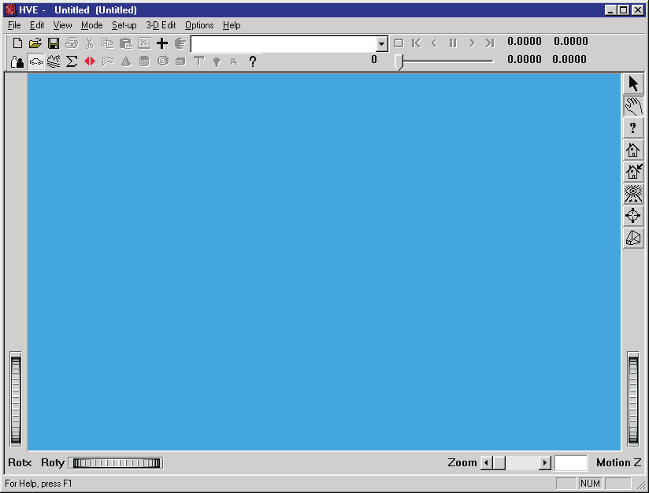
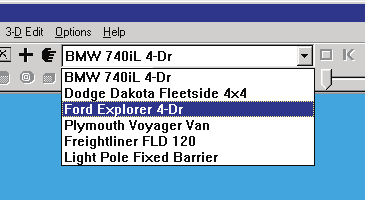
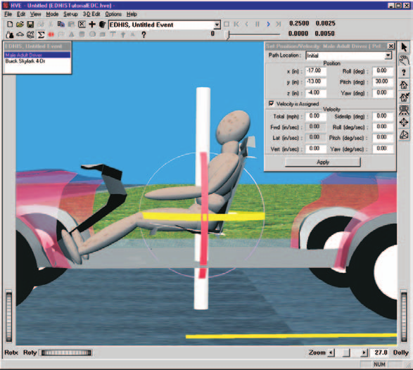
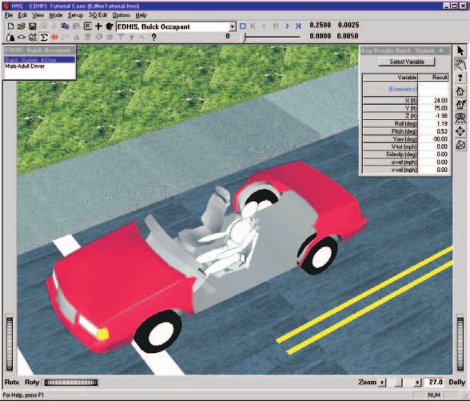
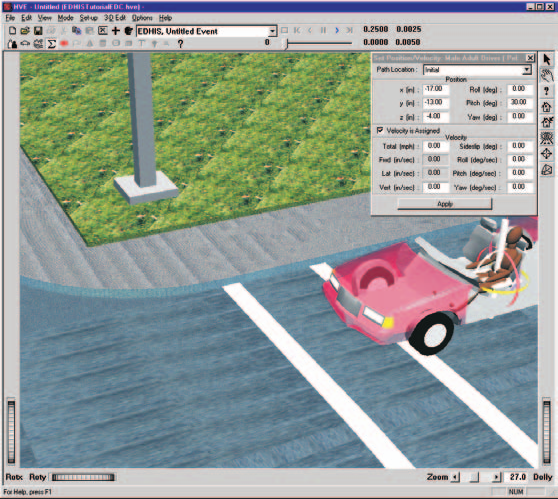
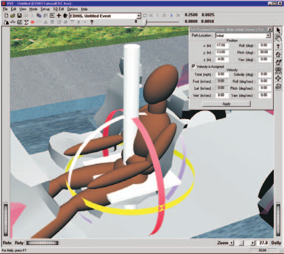
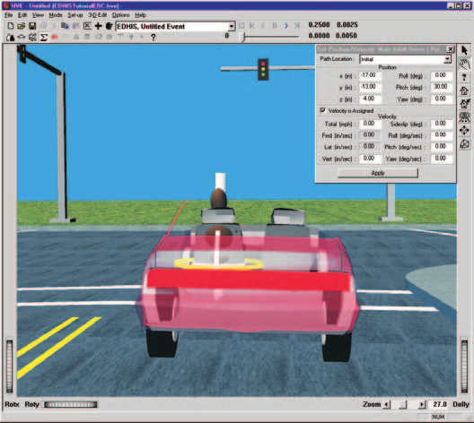
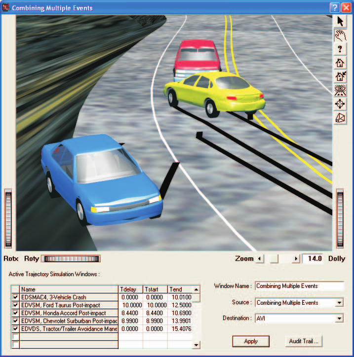

# Chapter 32 — HVE Tutorial

*Updated Markdown edition of the HVE User's Manual (HVE Version 5, Seventh
Edition, January 2006), Tutorial section, pages 32-1 through 32-60. Verified against the current HVE application source
(`HVEINV-64/`).*

This section of the HVE User's Manual contains a tutorial illustrating HVE's
features. For any new HVE user, this section is very important. The tutorial
describes the use of HVE's basic components, but even more important, the
tutorial provides a basic framework for using HVE. Users will soon realize
they perform the same basic operations each time they use HVE, so
understanding these basic operations is fundamental to its use.

The purpose of the HVE Tutorial is to provide a solid grasp of the
fundamentals of using HVE, and to accelerate the user's learning curve.

## Overview

This chapter presents a series of basic tutorials that demonstrate various
HVE techniques and capabilities. This is accomplished through a series of
high-level, task-oriented procedures using a step-by-step approach. While
this tutorial explores many of HVE's important features, it does not provide
detailed explanations. For these details, the tutorial refers to specific
chapters, and the user should refer to those chapters when necessary.

> **NOTE:** In addition to this tutorial, every EDC physics model has a
> Program Manual that includes a comprehensive tutorial specific to that
> physics model. Manuals from 3rd-party vendors typically include a tutorial
> as well.

The Tutorial is divided into four individual lessons:

- **Lesson 1 — Navigating in HVE** — Techniques that promote efficiency;
  how to move quickly within HVE to perform fundamental tasks.
- **Lesson 2 — Running a Simulation Model** — The best way to set up and
  execute HVE-compatible physics models (reconstructions and simulations
  involving human and vehicle dynamics).
- **Lesson 3 — Combining Multiple Events** — How to merge two or more
  individual simulations into a coherent and seamless sequence involving
  multiple humans and vehicles.
- **Lesson 4 — Creating a Video** — A quick and easy lesson describing how
  to create your first video.

## Lesson 1 — Navigating in HVE

Lesson 1 is a lesson in fundamentals, with an emphasis on efficiency. In
this lesson you will learn to perform the following fundamental tasks:
Starting HVE; Learning About the Menu Bar; Managing Dialogs and Viewers;
Choosing an Editor; Using Dialogs; Using Viewers; Shutting Down HVE.

Do not skip this lesson! By spending time performing these tasks, you will
be able to navigate within HVE more quickly, more efficiently and (perhaps
most important) more intuitively.

### Starting HVE

To start HVE, use the Start menu (or desktop shortcut) to select the HVE
program icon, just as you would start any other program on your computer.
After starting HVE, the HVE Menu Bar and current HVE Editor dialog are
displayed.

*Figure 32-1 — The Desktop after starting HVE: main program window with Menu
Bar, Tool Bar, integrated Event and Playback Controller, Viewer Manipulators
and Zoom Slider.*

> **NOTE:** HVE saves the current editor when you exit; thus, the editor
> now displayed is the one you were using when you last exited HVE.

### Learning About the Menu Bar

*Figure 32-2 — Menu Bar. HVE's menu bar is very traditional, with File,
Edit, View, Mode, Set-up, 3D-Edit, Options and Help menus. It also includes
the Dialog Control button, the Title Bar, the Active Objects List, the Event
Controller, the Minimize/Maximize buttons, the Close button, and several
toolbar buttons for quick access to functions.*

The Menu Bar contains the program's fundamental options: File, Edit, View,
Mode, Set-up, 3D-Edit, Options and Help.

- **File** — Basic system operations, such as starting new cases, opening
  and saving files, working with video, printing and exiting HVE.
- **Edit** — Operations that allow you to edit selected objects. (No Edit
  menu options are available until an object is selected. Other menus also
  have disabled options until the appropriate situation is present.)
- **View** — Operations that determine how you look at simulations.
- **Mode** — Selects which Editor you are currently using, and adds new or
  previous objects into the Editor (e.g., Select Mode, Add New, Add
  Previous).
- **Set-up** — Inputs for setting up your simulation or reconstruction
  events.
- **3D-Edit** — Launches and closes the 3-D Editor while in Environment
  mode, plus edits material attributes, colors and textures or changes
  manipulators while in the 3-D Editor.
- **Options** — Several user-definable options and preferences.
- **Help** — Access to the various HVE Help System options.

The **Dialog Control button** is located in the upper left corner of the
Menu Bar. Its options allow you to move the dialog, change its size,
minimize it, and maximize it. All dialogs and viewers have a Dialog Control
button.

The **Title Bar** displays the current case title, followed by the current
filename in parentheses. Clicking on the Title Bar and dragging the mouse
moves the dialog — a fundamental navigation task that allows you to move
dialogs and viewers anywhere you wish.

The **Active Objects List** is integrated into the Menu Bar. It displays a
drop-down list of active objects while in the Human, Vehicle, Environment
and Event modes. The current object is displayed in the viewer. To add a new
object to the list, click on the Add New Object button (a + sign) on the
toolbar. To display the Object Information dialog for the current object,
click on the Object Info button (a pointing hand) immediately to the left of
the list.

*Figure 32-3 — Active Objects List drop-down shown in Vehicle Mode.*

The **Event (and Playback) Controller** is integrated directly into the Menu
Bar. Its information displays are:

- **Current Simulation Frame** — The current frame of simulation output (a
  frame is equivalent to one timestep of output).
- **Max Simulation Time** — The selected Simulation Controls Maximum
  Simulation Time termination condition.
- **Simulation Timestep** — The integration timestep used for typical
  vehicle trajectory calculations, as set in Simulation Controls.
- **Current Simulation Time** — The current timestep of the complete event.
- **Output Interval** — The timestep interval used for displayed results,
  as set in Simulation Controls.

The Event Controller Slider can be used to move forward or backward through
each simulation frame — an easy means to locate a specific point in a
simulation without having to Play and Stop.

*Figure 32-4 — Event Controller.*

The Menu Bar also includes **Minimize** and **Maximize** buttons and a
resizable dialog frame. Clicking the frame and dragging resizes the dialog
(some dialogs cannot be resized); clicking on the frame also raises the
dialog to the top of the display.

> **NOTE:** Maximizing the program window allows you to use the whole
> screen for your work. A high display resolution provides an even larger
> work area.

### Viewers

Viewers are used to display 3-D objects.

*Figure 32-5 — Typical Viewer. Pick Mode or Manipulate Mode is selected by
choosing the arrow or hand icon near the upper right edge of the viewer.
RotX and RotY thumbwheels rotate the object about the viewer's X and Y axes.
The Dolly thumbwheel moves the camera toward or away from the object. The
Zoom slider changes the viewer's included angle.*

Viewers have the same window manager components as the Menu Bar, plus:

- **Viewer Mode Selector** — Switches between Pick mode (used for choosing
  objects in the viewer and performing editing operations) and Manipulate
  mode (used for changing the 3-D view using direct manipulation).
- **Viewer Controls** — Viewer X and Y rotation thumbwheels, Dolly
  thumbwheel, and Zoom slider.

### HVE Mode Selector

*Figure 32-6 — HVE Mode Selector, located at the left side of the toolbar.*

The HVE Mode Selector has five buttons (left to right): Human Editor,
Vehicle Editor, Environment Editor, Event Editor and Playback Editor. Click
on each button in the Mode Selector to display the various HVE editors.

### Managing Dialogs and Viewers

Becoming an efficient HVE user requires a few simple, but important,
procedures:

- Arranging your desktop to allow you to be as efficient as possible
- Raising viewers and dialogs to the top of the desktop
- Minimizing windows to help improve system performance (especially for
  3-D viewers that must be rendered)

**Minimizing Windows.** While using HVE, your desktop may become cluttered
with numerous data windows and viewers, especially in the Playback Editor
when a case has multiple events with several output reports, or multiple
Trajectory Simulation windows. In these instances, minimize windows so they
take less screen space.

> **NOTE:** A minimized window maintains all the data associated with it;
> minimizing simply replaces the visual representation of the window with an
> icon.

> **NOTE:** Minimized 3-D viewer windows are not rendered. Because it takes
> time and computer resources to render a window, minimizing 3-D viewer
> windows can significantly speed up your work!

Practice (using the supplied tutorial case): open the case file
`EdhisTutorialEDC.hve` (File menu, Open), choose Playback mode, click on a
Traj Sim window to bring it to the top, then use its Dialog Control button
and choose Minimize.

*Figures 32-7 and 32-8 — Playback Editor with multiple reports, before and
after one report window is minimized.*

### Choosing an Editor

HVE is designed around five fundamental editors:

- **Human Editor** — Selecting and editing 3-D humans
- **Vehicle Editor** — Selecting and editing 3-D vehicles
- **Environment Editor** — Selecting and editing 3-D environments
- **Event Editor** — Setting up and executing reconstruction and simulation
  models
- **Playback Editor** — Creating visual and numeric output reports and
  videos

Switching editors is performed using the Mode Selector. Using the tutorial
case, press each of the Mode Selector's pushbuttons in turn and observe: the
Human Editor with the current human displayed in the Human 3-D viewer
(Figure 32-9); the Vehicle Editor with the current vehicle displayed,
including contact surfaces if Show Contacts is selected (Figure 32-10); the
Environment Editor with the current environment (Figure 32-11 — note there
is no Active Environments list, because there is only one environment); the
Event Editor with the current event (Figure 32-12); and the Playback Editor
with its report windows (Figure 32-13).

*Figures 32-9 through 32-13 — The five HVE editors.*

To inspect an object's basic attributes, select it in the Active Objects
list and click the Object Info button on the toolbar. For a vehicle, the
Vehicle Information dialog shows its basic attributes (Driver Location,
Engine Location, Number of Axles, Drive Axles; Figure 32-14). For the
environment, the Environment Information dialog (Figure 32-15) is used for
assigning physical event information (sun position; wind direction and
velocity for aerodynamics calculations; air temperature and pressure for use
in air density calculations; and gravity constant), for assigning a 3-D
geometry file to drive on, and for sky color and fog for visibility studies.

*Figure 32-14 — Vehicle Information dialog. Figure 32-15 — Environment
Information dialog.*

### Using Dialogs

HVE has more than 200 dialogs for entering and editing information. All HVE
dialogs have default information already assigned; therefore, when using a
dialog, you are always editing existing default data.

**Modal vs Modeless Dialogs.** HVE (like most applications) uses two types
of dialogs:

- A **modal** dialog requires the user to complete an action by pressing OK
  or Cancel before another action can be performed. (You cannot make any
  other program selection until you remove the modal dialog — HVE beeps if
  you try. The File Selection dialog is a typical modal dialog.)
- A **modeless** dialog allows you to enter and edit data in the dialog, as
  well as make selections from the menu bar and manipulate objects in
  viewers, while the dialog is still displayed. The most important example
  is the Position/Velocity dialog used by the Event Editor (Figure 32-16).
  You can tell it is modeless because it does not have OK/Cancel/Help
  buttons.

*Figure 32-16 — HVE Event Editor's Position/Velocity dialog.*

> **NOTE:** Nothing happens in a modeless dialog until you press the
> `<Enter>` key (or the Apply button). Pressing OK on a modal dialog is like
> pressing `<Enter>`; since a modeless dialog does not have an OK button,
> you must explicitly press `<Enter>` for the value(s) in the dialog to be
> updated.

> **NOTE:** You can enter several values into the dialog, then press
> `<Enter>` once to have all the values updated at the same time. This can
> save time, since HVE re-renders the viewer whenever the viewer's contents
> change.

### Using 3-D Viewers

HVE uses 3-D viewers to display humans, vehicles and the environment, and to
visualize motion during Event and Playback modes. The user can perform the
following viewer operations:

**Resizing Viewers.** Click on any edge of the viewer frame (the cursor
changes shape) and drag to grow the viewer in width and/or height; drag a
corner to resize in both directions. Clicking the edge of a partially
covered window also brings it to the top of the desktop. While 3-D viewers
may be resized, dialogs normally cannot. In general, make your viewers nice
and BIG!

*Figure 32-17 — Using HVE 3-D viewers.*

**Panning.** Panning moves the scene horizontally and vertically within the
viewer. Confirm the viewer is in Manipulate mode (click the hand icon), place
the mouse cursor in the middle of the viewer, then press the middle mouse
button and drag (or press the left mouse button while holding `<Shift>`).

*Figure 32-18 — Panning the camera in a 3-D viewer.*

**Zooming In and Out.** Zooming changes the lens of the virtual camera. The
zoom slider is located along the lower right edge of the viewer. Dragging
the slider zooms in (analogous to changing from a 50 mm lens to a 150 mm
telephoto lens) or out.

**Dollying In and Out.** Dollying changes the camera position, moving it
closer to or farther from the object (just like filming a movie scene).
Press both the left and middle mouse buttons and drag down/up (or press the
left mouse button with `<Shift>`+`<Ctrl>`), or use the Dolly thumbwheel.
Pressing `<Escape>` with the cursor in the viewer toggles between Pick and
Manipulate modes — equivalent to clicking the viewer mode icons.

*Figure 32-19 — Dollying the camera in a 3-D viewer.*

> **NOTE:** The thumbwheel's range of motion is not limited by its visible
> size — click it and keep dragging.

> **NOTE:** Both dollying and zooming appear to have the same effect (making
> objects appear larger). However, if you zoom in too close, the objects
> become distorted as if you were using a fisheye lens. For this reason, we
> recommend dollying instead of zooming if your goal is a close-up view.

**Changing Camera Position.** In Manipulate mode, click the left mouse
button and drag horizontally: the object spins about the viewer's vertical
axis; drag vertically and it spins about the viewer's horizontal axis.

*Figure 32-20 — Moving the camera in a 3-D viewer.*

> **NOTE:** This is an important concept: while using direct manipulation,
> the scene always spins about the center of the viewer.

Spend time practicing direct manipulation combined with panning, dollying
and rotating. By mastering viewer manipulation you will benefit every time
you use HVE.

### Shutting Down HVE

When you are finished working with HVE, end your session by saving your work
and exiting HVE. It is important to exit HVE gracefully because HVE asks you
to save your work if it has changed since your last save, and because HVE
updates your configuration file so your next HVE session uses the same
preferences and options selected in the current session. HVE also saves the
current editor when you exit.

To shut down HVE, click on the File menu and choose Exit, then answer the
save-changes prompt.

## Lesson 2 — Running a Simulation Model

Lesson 2 is a high-level overview describing how to use HVE to execute a
single event (reconstruction or simulation program). In this tutorial we
execute an EDVSM simulation. You will learn: Selecting Humans; Selecting
Vehicles; Selecting Environments; Creating Events; Setting Up Events;
Executing Events. Mastering these tasks is important because they are the
same tasks you'll use every time you use HVE — regardless of the
reconstruction or simulation model you're executing.

### Selecting Humans

1. Switch to Human mode. The Human Editor is displayed.
2. Click Add New Object. The Human Information dialog is displayed. It
   includes option buttons allowing the user to select a seat position
   within the vehicle (alternatively, Pedestrian could be selected), and
   assign the human's attributes according to Sex, Age, Weight Percentile
   and Height Percentile.
3. Choose: Location = Front, Left; Sex = Male; Age = Adult; Weight
   Percentile = 50; Height Percentile = 50.
4. Replace the default name with a more meaningful one — enter `Fred` — and
   press OK.

Fred is displayed in the Human Editor's 3-D viewer (Figure 32-21), in a
seated position because we assigned him as an occupant. Spend a few moments
visualizing Fred using the techniques from Lesson 1.

### Selecting Vehicles

1. Choose Vehicle Mode. The Vehicle Editor is displayed.
2. Click Add New Object. The Vehicle Information dialog is displayed,
   allowing selection of the basic vehicle attributes according to Type,
   Make, Model, Year and Body Style.

   > **NOTE:** The Vehicle Information dialog also allows you to edit the
   > Driver Location, Engine Location, Number of Axles and Drive Axle(s).
   > These options affect the basic vehicle configuration and do not need
   > to be changed for this tutorial.

3. Choose: Type = Passenger Car; Make = Dodge; Model = Charger; Year =
   1968–1970; Body Style = 2-Door; Source Database = Tutorial.db.
4. Click OK to add the Dodge Charger to the Active Vehicles list.

The Charger is displayed in the Vehicle Editor's 3-D viewer (Figure 32-22).

### Selecting Environments

1. Switch to Environment mode and click Add New Object. The Environment
   Information dialog is displayed.
2. Choose Open. The 3-D Geometry File Selection dialog is displayed (Figure
   32-23). If necessary, set Files of Type to HVE files.
3. Choose `4x2_Intersection.h3d` and press OK.
4. Replace the default environment name — enter `Tutorial Lesson 2
   Intersection` — and press OK.

The selected environment is displayed in the Environment Editor's 3-D viewer
(Figure 32-24).

### Event Editor

Using the Event Editor involves three steps:

- **Creating the Event** — Choosing the humans, vehicles and the
  calculation method (reconstruction or simulation model) for the event.
- **Setting Up the Event** — Assigning the position and velocity for each
  human and vehicle in the event; may also involve driver controls,
  restraint systems, damage profiles, other event set-up options,
  simulation controls and calculation-specific options.
- **Executing the Event** — Pressing the Execute pushbutton and observing
  the results; normally also making adjustments to inputs and performing
  range-checking runs to identify sensitivities.

To create the event:

1. Switch to Event Mode and click Add New Object. The Event Information
   dialog is displayed (Figure 32-25), containing the Active Humans list,
   Active Vehicles list and Calculation Method option list.
2. Select the Dodge Charger from the Active Vehicles list; it is added to
   the Event Humans & Vehicles list.
3. Choose EDVSM from the Calculation Method option list.
4. Change the default event name to `Sample Event` and press OK.

To set up the event (initial position/velocity and a steer table):

1. Select the Dodge Charger in the Event Humans & Vehicles list, then
   choose Set-up from the menu bar. The Event Set-up options for EDVSM are
   displayed (Figure 32-26).

   > **NOTE:** If no object is selected, no options are enabled in the
   > Set-up menu. Only the set-up options applicable to the chosen physics
   > program are displayed — each physics program tells HVE which set-up
   > options to make available.

2. Select Position/Velocity. The Initial Position/Velocity dialog is
   displayed and the Charger appears at the earth-fixed origin (Figure
   32-27).
3. Enter the initial position: X = −70.0 ft, Y = 37.5 ft; and initial Total
   Velocity = 25.0 mph, followed by `<Enter>`.

   > **NOTE:** By waiting until all the data are entered before pressing
   > `<Enter>`, the 3-D viewer is only re-rendered once. Clicking Apply is
   > the same as pressing `<Enter>`.

4. Choose Set-up, Driver Controls, and select the Steer tab. Enter the steer
   table (Figure 32-28):

   **Table 32-1 — Steer Table entries for the Dodge Charger's left turn**

   | Time (sec) | Steering Wheel Angle (deg) |
   | --- | --- |
   | 0.00 | 0.0 |
   | 0.50 | 0.0 |
   | 1.00 | −150.0 |
   | 3.50 | −150.0 |
   | 4.00 | 0.0 |

5. Press OK to accept the steer table.

Use the Event Controller (Figure 32-29) to execute the event. The Event
Controller's buttons function like a VCR controller: **Reset** (reinitialize
the calculation model for re-execution), **Rewind to Start**, **Reverse**,
**Pause**, **Execute/Play**, and **Advance to End**.

> **NOTE:** If you make changes to any of the event set-up options, those
> changes have no effect unless you press Reset before pressing Play.

Press Execute/Play. The Dodge Charger begins moving as its motion is
simulated according to the vehicle model, the current environment terrain,
the initial position and velocity, and the specified driver steering inputs
(Figure 32-30). The simulation continues until the default maximum
simulation time, 5.0 seconds, is reached.

Replay the event using Rewind — this redisplays the current output tracks
without re-executing the physics calculations.

**Key Results.** Numeric results are displayed in Key Results windows for
each timestep during execution. If a Key Results window is not displayed,
choose Options, Show Key Results. By default, the vehicle's Sprung Mass
Kinematics results are displayed. To add tire forces:

1. Click Select Variables in the Key Results window. The Variable Selection
   dialog is displayed (Figure 32-31).
2. Click Tires, Axle 1, Right, Outer; select Fx, Fy and Fz; press OK.
3. Press Execute/Play to redisplay the event with the selected Key Results
   at each timestep (Figure 32-32).

> **NOTE:** Like all events, this EDVSM event produces several output
> reports (Accident History, Messages, Vehicle Data and others). The
> Playback Editor is used to view (and print) these reports. Refer to the
> program manual for the specific simulation program for further
> information.

## Lesson 3 — Combining Multiple Events

Most crashes involve a sequence of events (e.g., loss of control, collision,
occupant ejection). HVE's open architecture allows users to choose the tool
best suited for each specific event from a variety of reconstruction and
simulation tools. The HVE Playback Editor combines these individual events
into a single window, and edits the sequence so each event is timed properly
with respect to the other events. The result is a seamless, real-time view
of the entire multiple-event sequence.

In this lesson you will learn: Displaying Multiple Trajectory Simulation
Events; Combining the Multiple Events Into a Single Playback Window; Editing
the Time Sequence for the Events. These tasks are also a prerequisite for
creating video output, the subject of Lesson 4.

Open the prepared case: File, Open; select `HveTutorialLesson3EDC` and press
OK. Choose Event mode. The tutorial case includes five events (Figure
32-33):

- **Event 1** — EDSMAC4, 3-Vehicle Crash (Ford Taurus, Honda Accord,
  Chevrolet Suburban)
- **Event 2** — EDVSM, Ford Taurus Post-impact
- **Event 3** — EDVSM, Honda Accord Post-impact
- **Event 4** — EDVSM, Chevrolet Suburban Post-impact
- **Event 5** — EDVDS, Tractor-trailer Avoidance

Review each event: choose it in the Active Events list and press Play in the
Event Controller, watching it in the Event 3-D viewer from different
perspectives.

> **NOTE:** The post-impact events begin at separation, not at the start of
> the entire sequence.

### Displaying Multiple Trajectory Simulations

1. Choose Playback mode. The Playback Editor is displayed (Figure 32-34);
   initially no reports are displayed.
2. Click Add New Object. The Report Window Information dialog is displayed
   (Figure 32-35), showing each event in the Active Events list.
3. Select the first event, EDSMAC4, 3-Vehicle Crash; choose Traj Sim from
   the Select Output option list; press OK. The Trajectory Simulation
   window for the first event is displayed (Figure 32-36).
4. Repeat for the remaining four events. After adding the fifth window and
   arranging them, the desktop appears as in Figure 32-38.

### Editing the Time Sequence

Three of the five events require editing the start time so the motion for
each event begins at the proper time. Because these events begin at
separation following the 3-vehicle collision, the times are available in the
Accident History report of the first event. Add it via Add New Object,
select EDSMAC4, 3-Vehicle Crash, choose Accident History, press OK (Figure
32-39). From the report:

- **Event 2** — EDVSM, Ford Taurus Post-impact: separation begins at 8.99
  seconds; however, the vehicle still has residual velocity at the end of
  the simulation time (10.00 seconds), so the final position is used for
  the start of this event. *(This vehicle is involved in two impacts; the
  end of the second impact, with the Chevrolet Suburban, is chosen for the
  separation conditions.)*
- **Event 3** — EDVSM, Honda Accord Post-impact: separation occurs at 8.44
  seconds.
- **Event 4** — EDVSM, Chevrolet Suburban Post-impact: the event's start
  must be delayed until separation at 8.99 seconds.

### Combining the Multiple Events

1. Select Options, Add Playback Window from the main menu. The Playback
   Window is displayed (Figure 32-41). The Active Trajectory Simulations
   list displays all five Trajectory Simulation windows in creation order
   (Figure 32-42).
2. Make sure all five Trajectory Simulations are selected for display
   (check boxes next to the event names).
3. Edit the Window Name field from `Untitled Playback Window` to
   `Combining Multiple Events`.
4. Set the timing: enter Tdelay = 10.0000 sec for EDVSM, Ford Taurus
   Post-impact; Tdelay = 8.4400 sec for EDVSM, Honda Accord Post-impact;
   and Tdelay = 8.9900 sec for EDVSM, Chevrolet Suburban Post-impact —
   pressing `<Enter>` after each (this is a modeless dialog).
5. Press Play. The playback window shows the entire sequence properly
   timed. Although you cannot tell by inspection, the motion for all three
   colliding vehicles is first handled by EDSMAC4, then transferred to
   EDVSM following their impact.

**Audit Trail.** Press Audit Trail to display a table report of each event
in the Playback window (Figure 32-43) — it tells the user which events are
controlling the motion of each object. Press OK to remove it.

Finally, save the case file (File, Save): enter case title `Combining
Multiple Events` and filename `HveTutorialLesson4`, then press OK. The file
is saved in the `HVE\supportFiles\case` subdirectory. (The Case Title
appears as a heading on all printed output reports.)

## Lesson 4 — Creating a Video

The final task while using HVE often includes creating a video of the crash
sequence. Because it is visual, a video presentation is often the best means
of describing and explaining how a crash occurred.

HVE's Playback Editor includes an integrated video output interface that
allows you to produce a simulation movie without additional software. (If
you want to create a full-length movie containing multiple views of the
crash sequence, use a software program dedicated to editing movie clips
together.)

In this lesson you will learn to: route a multi-event crash sequence to the
video recorder; replay the sequence in real time; and save the sequence to a
Video for Windows (AVI) file.

First confirm the video options. Open the Video Setup dialog and check the
compressor selection (Figure 32-44). *(updated: the original tutorial
recommended selecting the Cinepak Codec from choices such as Full Frames
(Uncompressed) and Microsoft Video 1; those codecs are obsolete — choose any
modern codec installed on your system, or Full Frames (Uncompressed) for a
lossless master. In current HVE the Video Options dialog is opened with the
Video Setup button on the Playback window, and also sets the movie size and
frame rate; see [Chapter 27](../09-video-output/27-video-interface.md).)*

If you just finished Lesson 3 and are still in the Playback Editor, proceed
directly. Otherwise open the prepared case `HveTutorialLesson4EDC` and
choose Playback mode.

> **NOTE:** The Traj Sim reports might be minimized in a single stack in the
> bottom left corner of the desktop. You may wish to leave them minimized to
> reduce the load on your graphics card, which would otherwise refresh all
> viewers at every frame of output.

### Route to Video Recorder

The HVE video interface has three simple components:

- **Playback Controller** — a VCR-like panel that allows you to display and
  record the results of your simulation
- **Source Option List** — all the possible sources of the simulation
  displayed in the Playback Window
- **Destination Option List** — all the possible destinations that can
  receive the simulation displayed in the Playback Window

*Figure 32-45 — Close-up of part of the Playback Window dialog, used for
playing and recording simulations.*

Think about the Source and Destination options for a moment. It is really a
simple concept: get the simulation from the Source and put it in the
Destination. To record our simulation:

1. Click on the Source option list and choose `Combining Multiple Events`
   (the Playback Window). *(updated: on legacy systems the list showed the
   playback window, S-Video/Composite Video and AVI; current HVE lists the
   playback window and saved movie files.)*
2. Click on the Destination option list and choose the video file (AVI).
3. Confirm the current simulation time is 0.0000 seconds (otherwise
   recording would start after the beginning of the sequence).
4. Click on the Options menu and choose Playback. Confirm the Playback
   Interval is set to 0.0333 seconds (30 frames/sec) or 0.0250 seconds (25
   frames/sec). Press OK.

   > **NOTE:** If you halve the Playback Interval, the simulation will be
   > recorded in slow motion (twice as slow as normal).

5. Confirm you have set the view in the Playback Window to your liking
   (Figure 32-46).
6. Confirm no other windows are covering the Playback Window — otherwise
   they will show up in your simulation movie.
7. Press Play. The simulation is recorded to disk, and is also displayed in
   the Playback Window so you can monitor its progress.

> **NOTE:** Recording is not real-time — each frame is rendered and
> compressed individually. For a complex sequence, you may wish to go get a
> cup of coffee (or tea) while recording.

### Replay in Real Time

After the simulation has been recorded to disk, you can replay the entire
sequence in real time. All you need to do is switch the Source and
Destination:

1. Click on the Source option list and choose the movie file (AVI).
2. Click on the Destination option list and choose `Combining Multiple
   Events` (the Playback Window).
3. Press Play.

The simulation data is retrieved from the disk and displayed in real time in
the Playback Window.

> **NOTE:** The viewer controls are not available while replaying a movie.
> That's because the view was established when the simulation was recorded
> and cannot be modified afterward.

### Route to Videotape *(legacy)*

On legacy systems with video-out hardware, an optional step was to create a
videotape: choose S-Video/Composite Video as the Destination, activate the
computer's video-out capability, press Play to activate the special
full-frame display, turn on the VCR, insert a good-quality blank tape,
advance the tape about 20 seconds of leader, press the VCR's Record button,
wait 5 seconds (recording an initial still image, which prepares the viewer
for what they are about to see), then press Play on the special display.
After the sequence finished, wait another 5 seconds before pressing the
VCR's Stop button. *(updated: current HVE has no video-device destination;
to produce physical media, record the AVI file and use standard authoring
tools.)*

### Saving the AVI File

The final step is to save the AVI file for convenient future viewing:

1. Open the Video Setup dialog.
2. Choose Save As. The File Selection dialog is displayed.
3. Enter a filename: `HveTutorialLesson4`. Press OK.

The AVI video is saved as `HveTutorialLesson4.avi` (HVE appends the `.avi`
extension) in the `hve\supportFiles\images\movies` subdirectory.

### Changing the View

Figure 32-46 shows a view of the crash scene from an interesting
perspective — all the collision action is displayed. However, it does not
show what each driver saw as the crash sequence evolved. These views are
important: by viewing the sequence as seen by each driver, it becomes
obvious how the crash occurred and which driver made the first mistake.

To view the sequence from each driver's perspective, attach a virtual camera
to each vehicle and replay the simulation:

1. Click on the View menu and choose Set Camera. The Set Camera dialog is
   displayed (Figure 32-47).
2. Click the View From This Object option list and choose Honda Accord.
3. Replace the View From coordinates with a location above and behind the
   driver's head: x = −13.0 ft, y = −1.5 ft, z = −5.0 ft.
4. Click the Look At This Object option list and choose Chevrolet Suburban,
   with Look At coordinates x = 0.0, y = 0.0, z = 0.0 ft (the Suburban's
   CG).
5. Press OK. The scene is viewed from the Honda driver's perspective
   (Figure 32-48).
6. Press Play. The Playback viewer displays the entire sequence as viewed
   by the driver of the Honda.

Repeat, using the Set Camera dialog to watch the sequence from each driver's
perspective — simply select the desired vehicles in the View From This
Object and Look At This Object option lists; the coordinates don't require
adjusting.

> **NOTE:** Even though you used the Set Camera dialog to set the view, you
> can still use the viewer controls (thumbwheels and direct manipulation) to
> fine-tune the view.

### Ending the Tutorial

This concludes Lesson 4 — Creating a Video. In Lesson 4, we learned how to
create an AVI video file, play it back on the computer in real time, and
save the simulation movie file for future viewing using HVE (or any other
AVI viewer).

<!-- NAV -->

---

← Previous: [Back Matter: Tutorial, Appendices and Index](README.md)  |  [Index](README.md)  |  Next: [Appendix I — Installation & Setup](appendix-01-installation.md) →

<!-- /NAV -->
