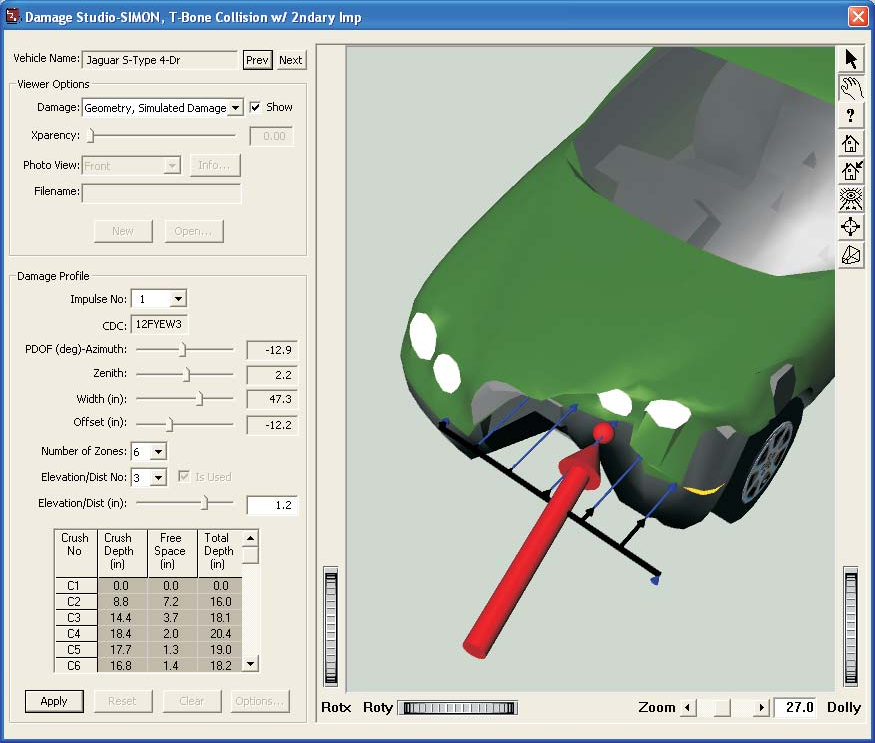
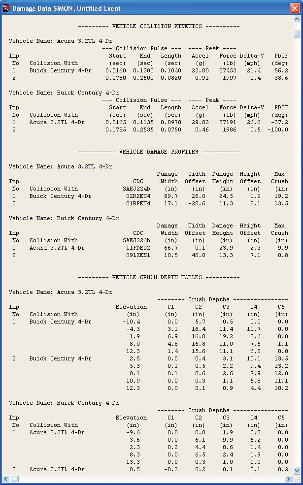

# Chapter 32 — The DamageStudio Interface

## Overview

DamageStudio is a graphical analysis tool that allows vehicle crash safety engineers to visualize collision data, and to correlate collision damage with the kinetics (force magnitude and direction), delta-V, acceleration and other important collision parameters. DamageStudio is a component in the HVE Playback Editor.

DamageStudio may be used to study all types of collisions (e.g., barrier, single vehicle, multi-vehicle, secondary impact, rollover, ...) for all types of vehicles (e.g., passenger car, van, truck, trailer, dolly, ...).

DamageStudio provides the following information about a collision:

- Numeric and visual damage profile results for up to 10 individual impulses (collisions) per vehicle
- Collision Deformation Classification (CDC)
- PDOF azimuth (horizontal) and zenith (vertical) angles
- Damage width and horizontal offset
- Damage height and vertical offset
- Crush table (crush depth, free space and total crush) for up to 10 points along the damage width and up to 5 elevations along the damage height
- Crush vectors (color-coded arrows) that illustrate crush depth, free space and total crush
- Damage profile visualization of the damage profile, along with a vector (arrow) that illustrates the PDOF and a sphere that illustrates the impulse center location

*(The limits above are code-verified: the enums `MAX_COLLISION_PULSES = 10`, `MAX_CRUSH_DEPTHS = 10` and `MAX_CRUSH_ELEVATIONS = 5` live in `HVEINV-64/CalcStructs.h`. `Physics/Include/Hvedef.h` defines the same numeric limits under different names — `MAXCOLLISIONPULSES = 10`, `MAXCRUSHENTRIES = 10` and `MAXELEVATIONS = 5` (`Hvedef.h:44,48,49`).)*

*Figure 32-1: Typical DamageStudio window.*

A typical DamageStudio window is displayed in Figure 32-1.

> **NOTE:** Much of the numeric data displayed by DamageStudio may also be found in tabular form in the Damage Data output report.

The DamageStudio window includes a 3-D viewer and two groups of supporting information:

- Viewer Options
- Damage Profile

These two features differentiate DamageStudio from the HVE Damage Profiles output report window.

The window also includes a *Vehicle Name* field with *Prev* and *Next* buttons for switching between the vehicles in the event, and a row of buttons below the Damage Profile group: *Apply*, *Reset*, *Clear* and *Options...* *(updated: the Reset, Clear and Options... buttons are additions since the original manual; Options... opens the DamageStudio Options dialog described later in this chapter)*.

## Viewer Options

The Viewer Options group determines what is displayed in the 3-D viewer. The five viewer (damage display) options are:

| Original manual name | Current dropdown name | Status |
|---|---|---|
| Geometry, Simulated Damage | *Simulated* | Available (simulation events only) |
| Geometry, Undamaged | *None* | Available |
| Geometry, From File | *From File* | Available |
| Damage Photograph | *Photograph(s)* | Defined in the code, but currently removed from the dropdown (not selectable) |
| Damage, User-entered | *User-entered* | Available |

*(updated: the current Damage dropdown uses the short names shown in the middle column — the list describes the source of the damage shown for the vehicle geometry. "Simulated" is only offered for simulation events. The "Photograph(s)" entry is commented out of the dropdown in `DamageStudioReportDlg.cpp`, so the Damage Photograph view cannot currently be selected, although its supporting code — seven photo views with descriptions and an Info... button — remains present.)*

The current Viewer Option is selected from the *Damage* dropdown list. The view is activated by clicking the *Show* checkbox. Clicking *Show* for more than one viewer option causes the selected views to be super-imposed (see Multiple Views, later in this chapter) for purposes of comparison.

A *Transparency* slider and edit field (labeled *Xparency* or *Trans*) is provided so each view can be made partially transparent (0.0 = opaque, 1.0 = fully transparent). This is particularly useful when super-imposing several views.

### Geometry, Simulated Damage ("Simulated")

When the *Simulated* damage viewer option is selected, the 3-D viewer displays the vehicle damage calculated by the simulation. It is similar to the Damage Profiles output report window found in the Playback Editor. As the simulation is played, the damage profile dynamically updates, showing the current damage profile. Unlike the Damage Profiles window, DamageStudio also displays the PDOF, impulse center and color-coded crush vectors showing crush depth, free space and total crush depth.

#### Damage Profile

The Damage Profile group is enabled when the viewer option is *Simulated*. The Damage Profile group displays the current impulse number (up to 10 individual impulses per vehicle may be displayed), along with the following results for the current impulse:

- **Collision Deformation Classification (CDC)** — This is a full implementation of SAE J224B. The first two characters are the clock direction of the PDOF; the 3rd character is the major contact surface (Front, Right, Back, Left, Top, Undercarriage); the 4th character is the specific location of damage on the major surface defined by the 3rd character; the 5th character is the damage elevation (for Front, Right, Back and Left damage) or damage width along the vehicle-fixed x axis (for Top and Undercarriage damage); the 6th character is the type of damage (Wide, Narrow, Sideswipe, Corner); the 7th character defines the maximum extent (depth) of crush. Refer to Appendix V of the HVE User's Manual for more information on SAE J224B. See also the [Damage Data dialog](../../11-reports-output/DamageData.md), which uses the CDC to assign default user-entered damage profiles in the Event Editor.
- **PDOF** — By definition, the PDOF is the direction of the impulse (and, therefore, the delta-V). Because HVE is 3-dimensional, the PDOF has both an azimuth angle (the traditional PDOF in the vehicle's x-y plane) and a zenith angle (the vertical component of the PDOF).
- **Width (in)** — For side and end damage, this is the horizontal width of damage. For top and undercarriage damage, this is the width of damage in the y-direction.
- **Offset (in)** — For side and end damage, this is the horizontal distance from the CG to the center of the damage width. For top and undercarriage damage, this is the lateral distance from the CG to the center of the damage width.
- **Number of Zones** — Dropdown list selecting the number of crush zones (1 to 9) across the damage width; the number of crush measurements is the number of zones + 1 (up to 10).
- **Elevation/Distance** — For side and end damage, this is the vertical elevation at up to five locations (above/below the CG) for the crush depths displayed in the crush table. For top and undercarriage damage, this is the x-distance from the CG at up to five locations for the crush depths displayed in the crush table. The *Elevation/Dist No* dropdown selects which of the five elevations is displayed, and the *Elevation/Dist* field displays (and, for user-entered damage, edits) its value.
- **Crush Table** — These are the actual crush depth for physically observable damage, the free space and the total crush depth (sum of actual crush depth and free space). The table columns are *Crush No*, *Crush Depth*, *Free Space* and *Total Depth*. Up to 10 crush depths may be displayed (five is the default).

The 3-D viewer displays the current impulse center and PDOF vector, as well as a set of color-coded arrows (vectors) that illustrate the crush depth, free space and total crush depth for each selected elevation/distance.

### Damage, User-entered ("User-entered")

When the *User-entered* damage viewer option is selected, the 3-D viewer initially displays the original (undamaged) vehicle geometry. This option is similar to the Setup, Damage Profiles dialog found in the Event Editor (see the [Damage Data dialog](../../11-reports-output/DamageData.md) page). There is no time domain information available when using this option. The user simply enters and edits one or more damage profiles and observes the results in the 3-D viewer. This process is described in [Using DamageStudio](02-using-damagestudio.md).

#### Damage Profile

The Damage Profile group is enabled when the viewer option is *User-entered*. The Damage Profile group displays the current impulse number (up to 10 individual impulses per vehicle may be displayed), and the CDC field for the current impulse, initially *None*. Upon entering a valid CDC, the damage profile information associated with the CDC (i.e., the PDOF, damage width, etc.) are calculated and displayed (refer to the previous Damage Profile section for a complete description of each field). These values may then be edited.

The 3-D viewer displays the damaged vehicle and its current impulse center and PDOF vector, and color-coded arrows (vectors) that illustrate the crush depth and free space for each selected elevation/distance.

### Geometry, Undamaged ("None")

When the *None* (undamaged geometry) viewer option is selected, the 3-D viewer displays the original (undamaged) vehicle geometry. This view may be used for comparison with the simulated vehicle damage.

*(updated: the original manual listed this option as "Not implemented"; it is implemented in the current code — see `updateUndamagedView()`/`loadUndamagedVehicle()` in `DamageStudioReportDlg.cpp` — including per-view transparency for overlay comparison.)*

#### Damage Profile

The Damage Profile group is disabled when the viewer option is *None*.

### Geometry, From File ("From File")

When the *From File* viewer option is selected, the 3-D viewer displays a user-supplied vehicle geometry file (selected with the *Filename* field and *Open...* button). This file may show a damaged vehicle or undamaged vehicle. This view may be used for comparison with the simulated vehicle damage.

*(updated: the original manual listed this option as "Not implemented"; it is implemented in the current code — see `updateFromFileView()` in `DamageStudioReportDlg.cpp`, which reads the named geometry file into the viewer scene.)*

#### Damage Profile

The Damage Profile group is disabled when the viewer option is *From File*.

### Damage Photograph ("Photograph(s)")

When the *Photograph(s)* viewer option is selected, the 3-D viewer displays one or more user-supplied vehicle photographs. Seven photographs are allowed for each vehicle.

A dropdown list is provided that suggests the photographic views are Front, Right, Back, Left, Top, Undercarriage and Oblique. However, these are only suggestions; the actual views are up to the user. The views may be used for comparison with the simulated vehicle damage.

A text box (displayed with the *Info...* button) is provided for each view that may contain user-supplied information that is descriptive of the view (e.g., camera position, focal length, etc.).

*(updated: the Damage Photograph option remains unavailable in the current release — the entry is commented out of the viewer dropdown in `DamageStudioReportDlg.cpp`, although the underlying photo-view data structures (`CaDamageStudioData::PhotoView`, seven views with filenames, descriptions and per-view camera settings) and display code are present in the source.)*

#### Damage Profile

The Damage Profile group is disabled when the viewer option is *Photograph(s)*.

## Multiple Views

Each viewer option includes a *Show* checkbox. By clicking *Show* for more than one viewer option, views from different viewer options may be super-imposed. For example, the undamaged geometry may be super-imposed over the *Simulated* damage view or *User-entered* damage view. The purpose of this capability is to compare the various views and confirm the damage profile results. The per-view *Transparency* control is useful for making the overlaid views readable.

## DamageStudio Options

*(updated: this dialog is an addition since the original manual; see `DamageStudioOptionsDlg.cpp` and the `IDD_DAMAGE_STUDIO_OPTIONS` dialog resource.)*

Clicking the *Options...* button displays the DamageStudio Options dialog, which controls the graphic annotations drawn in the 3-D viewer:

- **PDOF/Forces** — Radio buttons selecting what force information is shown: *None*, *Current Force* or *PDOF/Impulse Center*. In the current release only *PDOF/Impulse Center* is enabled. A *Color...* button (currently disabled) is provided for selecting the vector color.
- **Crush Vectors** — Radio buttons selecting which crush vectors are shown: *None*, *Current Elevation* or *All Elevations*. In the current release only *All Elevations* is enabled. A *Color...* button (currently disabled) is provided for selecting the vector color.
- **Select Key Results** — A multiple-selection list of result variables. Each selected variable is displayed as a text annotation in the 3-D viewer (updated as the event plays), so key numeric results can be read directly off the DamageStudio display.

For simulation events, the available key results are: Time; Impulse No; Total, Longitudinal, Side and Normal velocity; Delta-V (total, x, y, z); Damage Energy; Total, Forward, Lateral and Tangential acceleration; Impulse (magnitude); Impulse Center x, y, z; PDOF Azimuth and Zenith; Impact force (total, Fx, Fy, Fz); Impact moments (Mx, My, Mz); CDC; Damage Width; Width Offset; Damage Height; Height Offset; and Max Crush. For reconstruction events, a similar (per-impulse rather than time-based) subset is available.

## CollisionData

The backbone of DamageStudio is a group of calculated parameters, collectively referred to as CollisionData. CollisionData are calculated at each integration timestep during the simulation (see `Physics/Source/LibHve/CollisionData.cpp`). The CollisionData include the following parameters for each colliding vehicle:

- **Impulse Number** — Sequential index used to track individual pulses
- **Other Vehicle** — The ID for the vehicle sharing the pulse
- **Damaged Vertices** — The vertex IDs for the current pulse, and associated with contact with the Other Vehicle
- **Peak Acceleration** — The highest total acceleration for the pulse
- **Peak Force** — The highest force for the pulse
- **Pulse Times (Start, End, Duration)** — Simulation time at which the collision begins and ends, and the difference. The start and end are determined by the time interval during which the collision force is non-zero.
- **PDOF** — Principal Direction of Force, taken as the direction of the peak force
- **Delta-V** — Speed change for the pulse, determined by accumulating the area under the acceleration vs. time history
- **Impulse Center** — The vehicle-fixed coordinates for the force associated with the accumulated force vs. time history

The CollisionData are used to develop a detailed 3-dimensional impulse history that may include secondary and/or multiple simultaneous impacts on the subject vehicle. At the conclusion of the simulation, the damaged vertices and acceleration data accumulated by CollisionData are used to calculate a Collision Deformation Classification (CDC) for each collision pulse on each vehicle.

The CollisionData form the backbone of DamageStudio. In fact, it is quite accurate to think of DamageStudio as a visual interface into the CollisionData. DamageStudio has the advantage of showing more information, as well as allowing the user to interact with the CollisionData and view the CollisionData as a function of time.

## Damage Data Output Report

The above data are then used to produce the Damage Data output report, an example of which is shown in Figure 32-2. The Damage Data report is divided into three sections:

- Collision Kinetics
- Damage Profiles
- Crush Tables

*Figure 32-2: Typical Damage Data output report produced from the CollisionData.*

### Collision Kinetics Table

This report displays the following results for each vehicle:

- **Impulse Number** — A sequential index identifying the unique impulse
- **Collision With** — The name of the other vehicle sharing the impulse
- **Collision Pulse Start, End and Length** — The time at which the impulse begins and ends, and the duration (end time minus start time), identified by the presence of a force acting on any of the vertices included in the pulse
- **Peak Acceleration** — The highest total acceleration occurring during the pulse
- **Peak Force** — The highest total force acting on the vertices included in the pulse
- **Delta-V** — The integrated acceleration vs. time history for the pulse
- **PDOF** — The direction of the peak force occurring during the pulse

CollisionData calculates the traditional PDOF azimuth angle (i.e., the angle in the vehicle's x-y plane), as well as the zenith angle (the vertical angle). Only the azimuth angle is displayed in the table.

Because each vehicle may have up to 10 collision pulses, the Collision Kinetics table provides detailed impulse information about each collision the vehicle encounters during an event. The individual breakdown for each impulse can be extremely useful when addressing issues involving occupant exposure to injury.

### Damage Profiles

This report displays the following results for each vehicle:

- **Impulse Number** — A sequential index identifying the unique impulse (same as above)
- **Collision With** — The name of the other vehicle sharing the impulse (same as above)
- **CDC** — The Collision Deformation Classification, as defined by SAE Recommended Practice J224b, for the pulse
- **Damage Width** — The width of damage, determined by the minimum and maximum coordinates of the damaged vertices along the end or side of the vehicle. For top or bottom damage, the width is in the direction of the vehicle's x axis (consistent with SAE J224b).
- **Damage Offset** — The lateral distance from the vehicle CG to the center of the damage width
- **Damage Height** — The vertical height of damage, also determined by the minimum and maximum coordinates of the damaged vertices along the end or side of the vehicle. For top or bottom damage, the height is in the direction of the vehicle's y axis (consistent with SAE J224b).
- **Height Offset** — The vertical distance from the vehicle CG to the center of the damage height
- **Maximum Crush** — The maximum vehicle actual crush depth (excluding free space), defined by the damage vertex with the greatest deformation

Note that the Damage Profile information is 3-dimensional. The 3rd character may be 'T' (top) or 'U' (undercarriage). The 5th character of the CDC describes the elevation of damage (i.e., below the beltline, under-ride, overall height, etc.). A complete CDC is generated for a rollover (actually, it will probably be a series of CDCs for the individual impulses).

### Crush Depth Tables

This report displays the following results for each vehicle:

- **Impulse Number** — A sequential index identifying the unique impulse (same as above)
- **Collision With** — The name of the other vehicle sharing the impulse (same as above)
- **Elevation** — By default, the CollisionData routine divides the damage height into 4 zones, resulting in crush measurements at 5 elevations
- **Crush Depths** — By default, the CollisionData routine divides the damage width into 4 zones, resulting in 5 crush depths at each elevation (columns C1 through C10 as needed)

Crush depth is calculated by creating a vector at each crush location that is parallel to the vehicle x-y plane and perpendicular to the vehicle surface. The vector's origin is on the "shoebox" that is defined by the vehicle's overall dimensions, and is directed inward. The point of intersection with the undamaged surface geometry defines the free space for that crush location. The point of intersection with the damaged surface defines the total crush depth. The actual crush depth is the difference between the total crush depth and free space.

The CollisionData routine calculates the actual crush depth, free space and total crush depth on the impacted surface. By default, only the actual crush depth (excluding free space) is displayed in the Damage Data crush depth table. *(updated: current physics models (SIMON, EDSMAC4) provide an "Include Free Space" calculation option checkbox; when checked, the Crush Depth Tables report total crush including free space instead — the table heading indicates "Excl. Free Space" or "Incl. Free Space" accordingly.)*

Continue with [Using DamageStudio](02-using-damagestudio.md).

<!-- NAV -->

---

← Previous: [HVE DamageStudio](README.md)  |  [Index](README.md)  |  Next: [Chapter 32 (continued) — Using DamageStudio](02-using-damagestudio.md) →

<!-- /NAV -->
