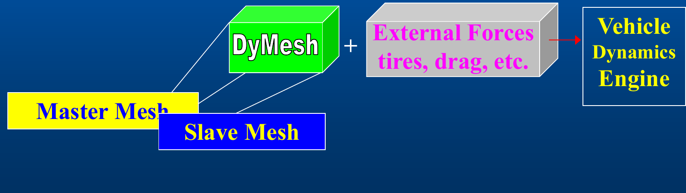

# DyMESH Overview

## What DyMESH is

**DyMESH** — *Dynamic Mechanical Shell* — is a general, three-dimensional method
for simulating collisions. The exterior surfaces of the vehicles and/or objects
(collectively, *bodies*) taking part in an event are discretized with a
triangular mesh. When two bodies interact, the meshes inter-penetrate; DyMESH
detects that penetration, deforms the meshes to enforce a no-penetration
condition, and computes collision forces at the nodes of the deformed mesh. The
deformation of the mesh **is** the damage (crush) profile, and the same mesh is
used both for the physics and for the visual display, so damage is visualized
directly.

The collision forces DyMESH produces are combined with the other external forces
acting on each vehicle and the equations of motion are then solved. In short:

> Collision forces at the nodes of the deformed mesh are computed and combined
> with other external forces to solve for the motion of the vehicle or object.

*Figure: block diagram — Master Mesh + Slave Mesh feed "DyMesh", which is summed with "External Forces (tires, drag, etc.)" into the Vehicle Dynamics Engine.*

DyMESH is integrated into a **six degree-of-freedom vehicle dynamics model**
(SIMON). It is not a stand-alone code; it supplies the impact forces and moments
that the host dynamics model integrates each time step.

## Why DyMESH (vs. 2-D impulse-momentum methods)

DyMESH goes beyond the existing two-dimensional methods for vehicle collision
simulation and allows the potential for more accurate simulations. Because it is
fully three-dimensional and force-based, it can represent phenomena that planar,
impulse-momentum collision models cannot:

- **Non-uniform crush in the z (vertical) direction.**
- **Override and underride.**
- **Rollover.**

Key distinctions:

- It is a **collision simulation**, *not* an idealized impulse-momentum method.
  Forces are developed continuously through the contact from the mesh
  deformation, rather than being resolved as a single instantaneous impulse.
- DyMESH simulations are **interactive**, running in a number of minutes on a
  typical workstation.
- DyMESH does **not** require the expense of generating a complex,
  three-dimensional, finite-element-like mesh. The user is not concerned with
  meshing the vehicle — the display mesh already present in the vehicle geometry
  is what DyMESH uses.

## Where DyMESH sits in HVE / which models use it

DyMESH is the collision engine invoked by HVE's simulation models — primarily
**SIMON**, and also available to **EDSMAC4**. It is enabled and configured per
event through the **DyMESH Options** dialog (Options menu). When DyMESH is
enabled, the host model calls it each collision time step for every interacting
pair of bodies; the returned forces and moments are added to the vehicle's force
system before the equations of motion are integrated.

DyMESH can also compute contact against the **environment** (terrain / fixed
objects) when the *Include Environment* option is selected, and — as of
Version 3 — against the individual **wheels** of a vehicle (see
[Version 3](03-version-3.md)).

*(updated: In the current code DyMESH is a licensed feature gated by
`FeatureMgr::GetDyMesh()`; the DyMESH Options dialog refuses to enable it without
a license.)*

## History

DyMESH has a long development lineage at EDC:

| Date | Milestone |
|------|-----------|
| 6/98 | Development begins |
| 1/99 | Prototype code, proof-of-concept |
| — | Published: SAE 1999-01-0104 and 2000-01-0844 |
| 6/99 – 1/01 | Port to HVE |
| 1/01 | SIMON/DyMESH prototype |
| — | Commercial development |
| **5/04** | **Commercial release** |
| 2/08 | Major update |
| 12/11 | Major update |
| 1/18 | Major update — improvement to the contact algorithm: *Vertex Displacement (Crush Depth)* |

The 2/08, 12/11 and 1/18 updates correspond to the modeling improvements that
define DyMESH **Version 2** (improved accelerations, crush-depth simulation /
general damage profile, and restitution) and **Version 3** (user-defined
third-order force-deflection curve fit, and the DyMESH Wheels collision model).

*(updated: The current source implements DyMESH with selectable **Version 3** and
**Version 4** behavior — the DyMESH Options dialog exposes "Version 3" and
"Version 4" radio buttons, and `Event.h` carries a `VersionNo` field. Version 4
additionally enables the "pushback reduction" restoration refinement
(`UsePushbackReduction = (VersionNo == 4)` in `DyMeshInitialize`). The 2026 decks
describe the model through "Version 3"; Version 4 is a further code-level
refinement not covered by the slides.)*

---
*Source: DyMESH Collision Simulation (2026 HVE Forum) — organized and verified against DYMESH.H / Dymesh.cpp, 2026-07-05.*

<!-- NAV -->

---

← Previous: [DyMESH Reference Manual](README.md)  |  [Index](README.md)  |  Next: [DyMESH Collision Model](02-collision-model.md) →

<!-- /NAV -->
