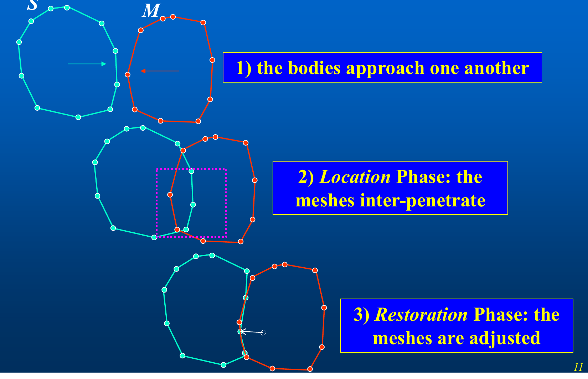
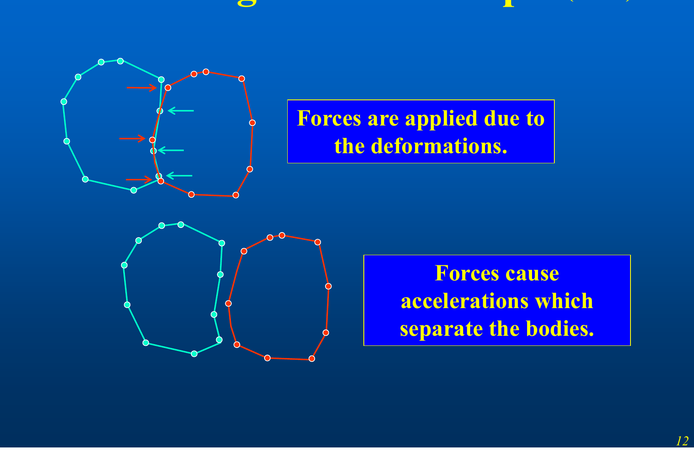
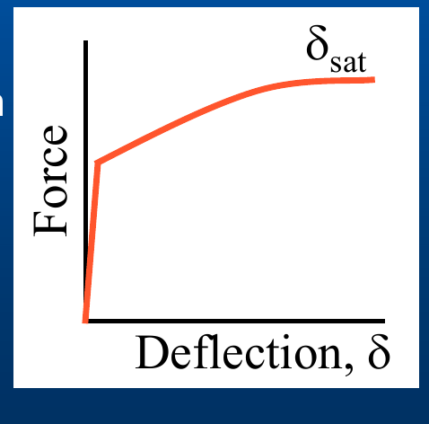
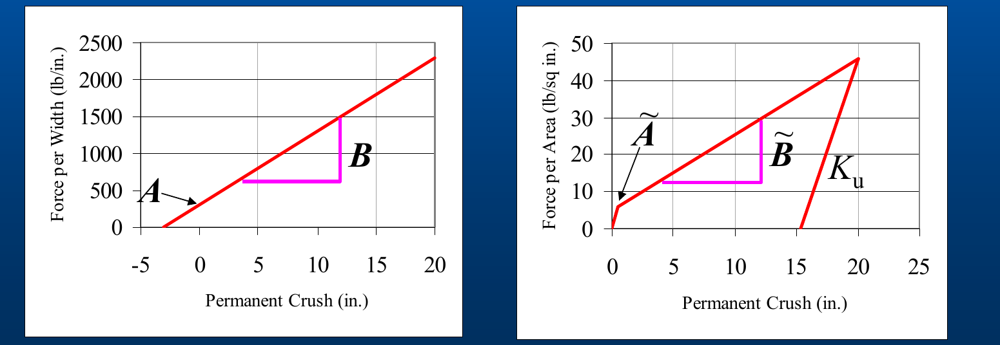
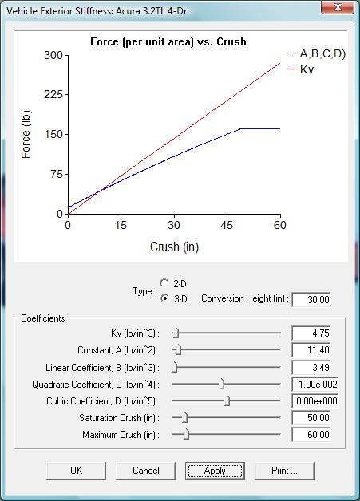
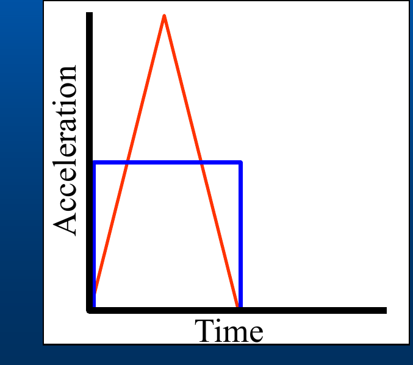

# DyMESH Collision Model

This chapter describes the technical model implemented by DyMESH: the mesh
representation, the contact (Location) and restoration algorithm, the node
force–deflection law, the three-dimensional stiffness, the vertex-displacement
(crush-depth) treatment, restitution, and the coupling to the vehicle equations
of motion. The description follows the *DyMESH Collision Simulation* deck and has
been verified against `DYMESH.H` and `Dymesh.cpp`.

## 1. Mesh representation

Each body is represented by the same **triangular surface mesh** used for its
display. In the code this is a `DyMeshData` structure per body, holding an array
of vertices (`VertArray`) and an array of triangular polygons (`PolyArray`):

- Each polygon stores its three vertex indices (`Vndx[3]`), an earth-fixed
  outward **normal** (`EarthNormal`), an earth-fixed **center** (`EarthCtr`), and
  its current and original **area** (`Area`, `AreaOrig`).
- Each vertex stores undamaged and current (damaged) coordinates in both
  earth-fixed and vehicle-fixed frames (`EarthCoordUndamaged`, `EarthCoord`,
  `VehCoord`, ...), its current deformation vector (`Delta`), its accumulated
  maximum deformation (`DeltaMaxTotal`), the force acting on it, and a per-vertex
  **stiffness** array and **saturation crush**.

During a run, one body is designated the **Master** (M) and the other the
**Slave** (S). Master *surfaces* (polygons) are tested against Slave *nodes*
(vertices): the algorithm finds, for each slave node, the master surface it has
penetrated. The roles can be swapped every time step, or multiple times per time
step, so that both bodies accumulate damage.

Because the search over all polygons would be expensive, DyMESH restricts each
test to a **search box** around each slave vertex (`GLOBAL_SEARCH_BOX`,
`NaborBox` lists) and to precomputed neighbor lists (`NaborSurf`). The neighbor
lists are only recomputed every few time steps (`CALC_NABOR_INTERVAL`) for
efficiency. The box size is either computed automatically from the vehicle
extents (`SetBoxSize`) or set by the user.

## 2. Contact algorithm

DyMESH uses a contact algorithm similar to that used in explicit, dynamic
finite-element simulation codes. The contact algorithm has **two main
functions**:

1. **Location** — determining mesh inter-penetration (which slave nodes are
   inside which master surfaces).
2. **Restoration** — altering the positions of the nodes of the mesh to enforce
   the no-penetration condition.

The sequence over a contact is:

1. The bodies approach one another.
2. **Location phase:** the meshes inter-penetrate; the region of overlap is
   identified.
3. **Restoration phase:** the meshes are adjusted (nodes pushed back to the
   contact surface).
4. Forces are applied due to the deformations; these forces produce
   accelerations that separate the bodies.

*Figure: three-panel contact-algorithm example — (1) bodies approach, (2) Location phase overlap box, (3) Restoration phase adjustment.*

*Figure: force application and separation — deformation forces at overlapping nodes drive the bodies apart.*

### Locating the master surface for a slave node

A slave node is matched to the master surface it has penetrated. A candidate
contact point is the intersection of a search ray from the slave node with the
master triangle; an **inside-polygon test** (`InsidePolygonTest_CrossProd`, using
the cross-product method) confirms the intersection lies within the triangle.
The direction of the search ray can be chosen among several methods
(`USE_LOCAL_AVERAGE_NORMAL`, `USE_VELOCITY`, `USE_POLY_NORMAL`,
`USE_SPECIFIED_DIRECTION`; the disabled `USE_VERT_NORMAL`), and the local search
may stop after the first, best-of-two, or best-of-all candidates
(`STOP_AFTER_ONE / _TWO / _ALL`). These are exposed on the **Advanced** tab of
the DyMESH Options dialog.

### Restoration (pushback)

Once a slave node is found interior to a master surface, its penetration depth
is the distance from the node to the master surface along the restoration
direction. The node is restored (pushed back) toward the surface; the amount of
that pushback, accumulated over time, is the node's permanent deformation. To
prevent numerical instabilities, the pushback can be reduced
(`PushbackReduction`, limited by `PUSHBACK_REDUCE_LIMIT`) and constrained not to
restore across implausible distances (`TOOFAR_MARGIN`, `TOOFAR_MAXIMUM`).

*(updated: `PushbackReduction` is only active when DyMESH **Version 4** is
selected — `UsePushbackReduction = (Event.Info.DyMeshOptions.VersionNo == 4)` in
`DyMeshInitialize()`. Under Version 3 the reduction is not applied.)*

## 3. Node force–deflection law

A central design point is that **any force-deflection relationship can be used**;
the force–deflection behavior is prescribed *a priori* per surface. The standard
$A$ and $B$ crush coefficients prescribe the three-dimensional force-deflection
relationship. **DyMESH Version 3 extends the force-deflection relationship to a
third-order polynomial** by adding $C$ and $D$ coefficients together with a
**saturation deflection** $\delta_\mathrm{sat}$.

The force on a single node is computed by `NodeForce()`. Let $\delta$ be the
node's current total deflection (penetration depth), $A_v$ be the area associated
with the node, and $\delta_0$ be a small **null-band** offset (`NULL_TEST`,
0.5 in) below which only the constant term acts. For increasing penetration
($\delta > \delta_\mathrm{max}$) the node force per unit area follows a cubic:

$$
F \;=\; \Big[\, A + B\,(\delta-\delta_0) + C\,(\delta-\delta_0)^2 + D\,(\delta-\delta_0)^3 \,\Big]\, A_v
\qquad (\text{Eq. 1})
$$

where $A$ (constant, lb/in²), $B$ (linear, lb/in³), $C$ (quadratic, lb/in⁴), and
$D$ (cubic, lb/in⁵) are the per-node stiffnesses (`Stiffness[0..3]`). Below the
null band the force is simply $F = A\,A_v$. Once the deflection reaches the
node's **saturation crush** $\delta_\mathrm{sat}$ (`SatCrush`, `nodeSat`), the
force is held at its saturation value and does not increase further:

$$
F_\mathrm{sat} \;=\; \Big[\, A + B\,(\delta_\mathrm{sat}-\delta_0) + C\,(\delta_\mathrm{sat}-\delta_0)^2 + D\,(\delta_\mathrm{sat}-\delta_0)^3 \,\Big]\, A_v
\qquad (\text{Eq. 2})
$$

*Figure: Force vs. Deflection curve rising then flattening at the saturation deflection $\delta_\mathrm{sat}$.*

The stiffnesses are assigned per body **surface** — front, right, back, left,
top, bottom — via the `BodySurface` enumeration (`DefineVertStiffness`), so
different faces of a vehicle can have different crush behavior.

## 4. Three-dimensional (per-area) force-deflection

The published crush coefficients ($A$, $B$) are two-dimensional — force per unit
crush **width**. DyMESH needs force per unit crush **area**. The 3-D stiffness
coefficients are obtained by dividing the standard (2-D) coefficients by the
**conversion height** $H$ of the crush region that was used to derive the 2-D
coefficients:

$$
\tilde{A} = \frac{A}{H}, \qquad \tilde{B} = \frac{B}{H}
\qquad (\text{Eq. 3})
$$

Here $A$ has units of force per width (lb/in) and $\tilde{A}$ has units of force
per area (lb/in²); likewise $B$ (lb/in²) becomes $\tilde{B}$ (lb/in³). The
default conversion height is 30 in (`CRUSH_HEIGHT = 30.0` in `DYMESH.H`, matching
the dialog default).

*Figure: two force-deflection plots — Force per Width (lb/in) vs. Permanent Crush with intercept $A$ and slope $B$; and Force per Area (lb/in²) vs. Permanent Crush with $\tilde{A}$, $\tilde{B}$ and unloading slope $K_u$.*

### 3-D stiffness dialog

The 3-D stiffness dialog lets the user enter $A$, $B$, $C$ and $D$ coefficients
and a **Saturation Crush**, and to "tune" the coefficients using the
**Conversion Height** to arrive at accurate 3-D stiffnesses. The dialog fields
are: $K_v$ (lb/in³, unloading), Constant $A$ (lb/in²), Linear $B$ (lb/in³),
Quadratic $C$ (lb/in⁴), Cubic $D$ (lb/in⁵), Saturation Crush (in), Maximum Crush
(in), and Conversion Height (in, default 30). The user can now define their own
third-order curve fit.

*Figure: "Vehicle Exterior Stiffness" dialog showing the Force-per-area vs. Crush plot (A,B,C,D curve vs. $K_v$ line) and the coefficient sliders.*

### Note on occupant response

The **selection** of stiffness coefficients is important for simulations
involving occupant response: two acceleration pulses (e.g. a tall triangular
pulse and a lower square pulse) can share the same velocity change $\Delta v$ yet
represent very different loading severities for the occupant. Choosing physically
representative stiffness/saturation values therefore matters beyond matching the
gross $\Delta v$.

*Figure: Acceleration vs. Time — a triangular pulse and a rectangular pulse with equal area (equal $\Delta v$).*

## 5. Vertex displacement (crush depth) — sharing crush between bodies

The 1/18 "Crush Depth" update refined how the total penetration is *partitioned*
between the two vehicles so that the **forces on the two bodies are equal and
opposite** (Newton's third law) even when their stiffnesses differ.

Given the master vehicle stiffness $A_\mathrm{master}, B_\mathrm{master}$, the
slave vehicle stiffness $A_\mathrm{slave}, B_\mathrm{slave}$, and the total slave
vertex displacement $\delta_\mathrm{total}$ (the total penetration — **always
computed using the slave vehicle**), the force each vehicle *would* carry at the
full penetration is:

$$
F_\mathrm{master} = A_\mathrm{master} + B_\mathrm{master}\,\delta_\mathrm{total}
\qquad (\text{Eq. 4})
$$

$$
F_\mathrm{slave} = A_\mathrm{slave} + B_\mathrm{slave}\,\delta_\mathrm{total}
\qquad (\text{Eq. 5})
$$

To equalize the forces, define the sharing fraction

$$
\theta = \frac{F_\mathrm{master}}{F_\mathrm{master} + F_\mathrm{slave}}
\qquad (\text{Eq. 6})
$$

and assign the slave vehicle its share of the crush:

$$
\delta_\mathrm{slave} = \delta_\mathrm{total}\,\theta
\qquad (\text{Eq. 7})
$$

There is no need to compute $\delta_\mathrm{master}$ separately — the master's
share is the remainder, $\delta_\mathrm{total}(1-\theta)$. The softer body
receives the larger share of crush, and the contact force is consistent for both
bodies.

*(updated: In the code, the master triangle's effective stiffness used at a
contact is the average of its three corner vertices' stiffnesses
(`SlaveNodeForce()` averages `Stiffness[0]` and `Stiffness[1]` over the three
master verts), consistent with this force-equalization approach.)*

## 6. Restitution (unloading)

After peak penetration the node **unloads** along an unloading branch. In
`NodeForce()`, unloading is governed by a restitution coefficient
$e$ (`RestitutionCoef`): a node only carries force while its current deflection
exceeds $(1-e)\,\delta_\mathrm{max}$, i.e. force goes to zero once the node has
relaxed by the restitution fraction of its maximum deflection:

$$
F = 0 \quad\text{when}\quad \delta \le (1-e)\,\delta_\mathrm{max}
\qquad (\text{Eq. 8})
$$

On the rebound branch the force is evaluated at the **rebound deformation**
$\delta_r = \delta - (1-e)\,\delta_\mathrm{max}$ using the same cubic law as
Eq. 1 (with $\delta_r$ in place of $\delta-\delta_0$), while the stored maximum
deflection $\delta_\mathrm{max}$ is *not* updated. The unloading state of each
node is tracked through a small state machine (`CANNOT_UNLOAD`,
`START_UNLOAD`, `CAN_UNLOAD`, `NOW_UNLOADING`, `FINISHED_UNLOADING`) with
thresholds `UNLOAD_BEGIN`, `UNLOAD_POT`, `UNLOAD_STOP`, and a per-step growth
limit `MAX_GROW_UNLOAD`. A separately stored unloading slope $K_u$
(`UnloadSlope`) defines the steeper unloading line (see the $K_u$ line in the
force-per-area plot).

DyMESH Version 2 "greatly improved" the restitution model together with the
accelerations and the crush-depth (general damage profile) simulation.

## 7. Friction

Tangential (frictional) forces at the contact are computed by
`SlaveNodeFriction()` using a material friction coefficient $\mu$
(`FrictionCoefficient` for vehicle-vehicle interactions; per-material `Mu` for
wheels), with a friction null band (`FRICTION_NULL_BAND`) that suppresses
spurious tangential force at very low relative sliding velocity.

## 8. Coupling to the equations of motion

For each interacting pair, DyMESH sums the node forces and moments into a
resultant force and moment on each body's center of gravity. `SumForcesMoments()`
accumulates the earth-fixed node forces into vehicle-fixed `SumForce` and
`SumMoment` (about the CG). These collision forces and moments are then **added
to the vehicle's other external forces** (tires, drag, gravity, suspension) and
the six-degree-of-freedom equations of motion are integrated by the host model
(SIMON) over the collision time step. Because DyMESH is called every collision
time step and the meshes are advanced with the vehicle motion, the collision
force develops continuously through the contact rather than as a single impulse.

The vehicle orientation used to transform between the vehicle-fixed and
earth-fixed frames is the standard Euler-angle direction-cosine matrix
$A$ (`Amtx`), built from roll $\phi$, pitch $\theta$, and yaw $\psi$ (see the
transformation listing in `DYMESH.H`).

---
*Source: DyMESH Collision Simulation (2026 HVE Forum) — organized and verified against DYMESH.H / Dymesh.cpp, 2026-07-05.*

<!-- NAV -->

---

← Previous: [DyMESH Overview](01-overview.md)  |  [Index](README.md)  |  Next: [DyMESH Version 3](03-version-3.md) →

<!-- /NAV -->
