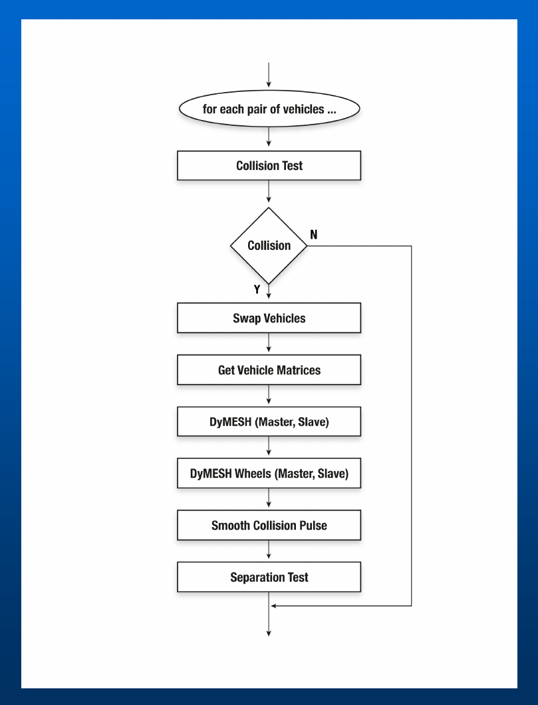
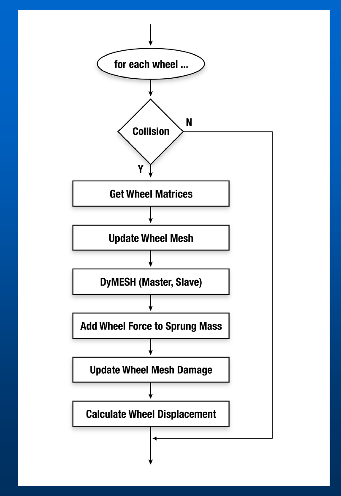
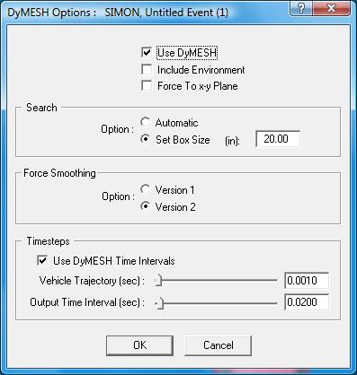
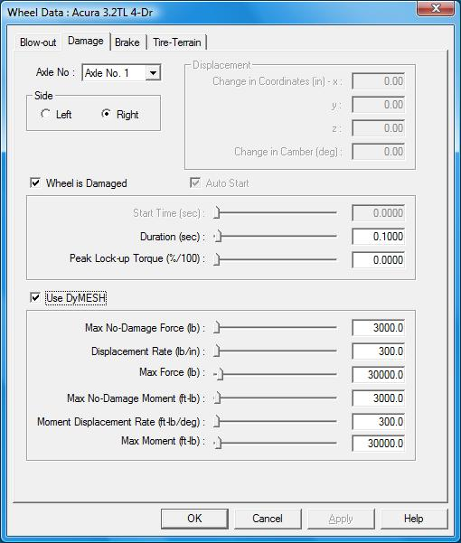
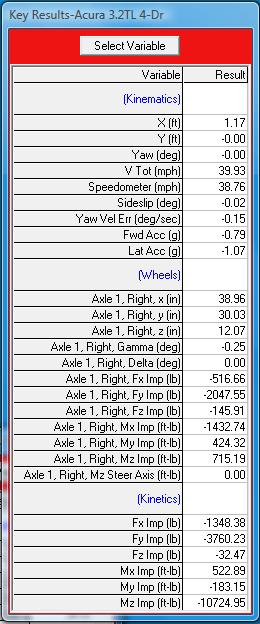
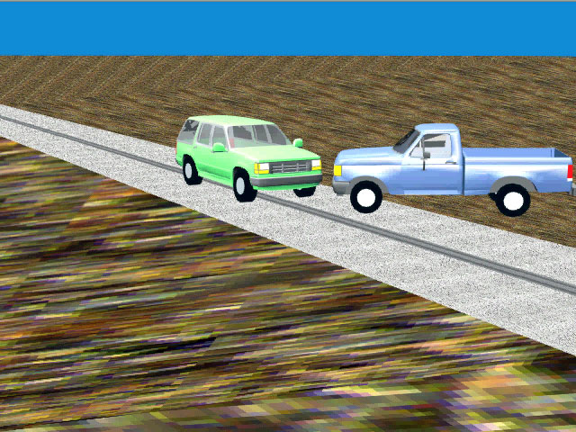
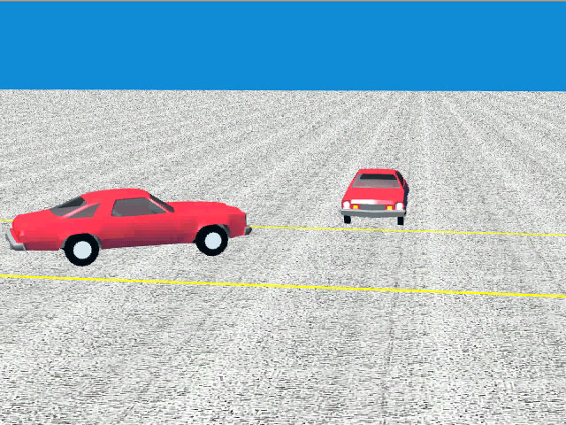
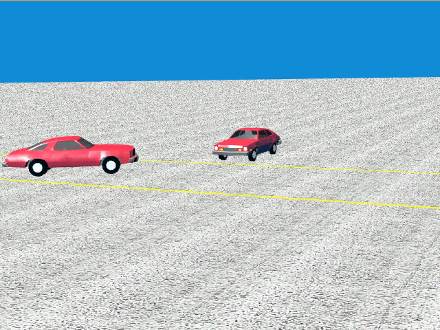

# DyMESH Version 3

DyMESH Version 3 (Engineering Dynamics Company, 2026 HVE Forum) adds a
collision model for the vehicle **wheels** — *DyMESH Wheels* — so that impact
forces and moments developed at the tires/wheels are computed and fed into the
vehicle dynamics. Version 3 also finalizes the user-defined third-order
force-deflection stiffness described in the [Collision Model](02-collision-model.md)
chapter.

## Problem statement

- DyMESH **Version 2** calculated 3-D collision forces and moments **only for
  the sprung mass** (the vehicle body).
- However, **significant collision forces and moments can occur during impact at
  the wheel(s)** — e.g. an angled wheel-to-wheel or wheel-to-body strike.
- **Ignoring these forces affects the collision dynamics** (post-impact heading,
  spin, and trajectory).

## Solution criteria

The wheel collision model had to:

- Calculate forces and moments from the collision at **each individual wheel**.
- Integrate the results **directly into the equations of motion**.
- Be **robust**, accounting for:
  - **Wheel shape** — a round cylinder.
  - **Wheel location / displacement** (the wheel can be moved by the impact).
  - **Wheel steering and camber change.**
  - **Wheel spin** (tangential friction).

## Solution

The wheel model reuses the DyMESH machinery by treating each wheel as its own
DyMESH body:

- **Treat each wheel as an independent DyMESH object.**
- **Create the wheel mesh based on tire size.** In the code
  (`InitializeDyMeshWheels` / `calcWheelMesh` in `Dymesh.cpp`) a cylindrical
  wheel mesh is built from the tire radius and width, with
  `NUM_DYMESH_WHEEL_INC` (80) angular increments. Wheel material stiffnesses are
  set to their own constants — `TRUCK_WHEEL_A_STIFF` / `TRUCK_WHEEL_B_STIFF`
  (500 / 100) or `PASS_CAR_WHEEL_A_STIFF` / `PASS_CAR_WHEEL_B_STIFF` (250 / 50)
  — and a saturation deflection tied to the wheel half-width is assigned per
  vertex (`deflMax`).
- **Place transforms in front of and following the DyMESH calculation** to carry
  the wheel's location, steer, camber, and spin into and out of the collision
  computation.
- **The user can select individual wheels for analysis** (for computational
  efficiency — only the wheels expected to be involved need be simulated).

## Flow charts

Version 3 adds a wheel loop nested within the existing sprung-mass collision
loop.

**Sprung Mass loop** — for each pair of vehicles:

1. Collision Test → if no collision, skip.
2. Swap Vehicles (assign Master / Slave).
3. Get Vehicle Matrices.
4. **DyMESH (Master, Slave)** — the body-to-body collision.
5. **DyMESH Wheels (Master, Slave)** — the wheel collisions.
6. Smooth Collision Pulse.
7. Separation Test.

*Figure: Sprung Mass flow chart.*

**Wheel loop** — for each wheel:

1. Collision? → if no, skip.
2. Get Wheel Matrices.
3. Update Wheel Mesh (apply location/steer/camber/spin transform).
4. **DyMESH (Master, Slave)** — run the contact algorithm on the wheel mesh.
5. Add Wheel Force to Sprung Mass.
6. Update Wheel Mesh Damage.
7. Calculate Wheel Displacement.

*Figure: Wheels flow chart.*

*(updated: In the current code these steps are implemented in
`Physics/Source/Simon/PHYMODEL.CPP` as `DyMeshWheels()`, `UpdateWheelMesh()`,
`AddWheelForceToSprungMass()`, `UpdateWheelMeshDamage()`, and
`DyMeshWheelDispl()`.)*

## DyMESH Wheels user interface

The wheel model is driven by three areas of the interface: the **DyMESH
Options**, the per-wheel **Set-up**, and the **Output vs. Time** results.

### DyMESH Options dialog

The DyMESH Options dialog (Options menu) as shown in the deck contains:

- **Use DyMESH** (master enable).
- **Include Environment** — also run DyMESH contact against the environment.
- **Force To x-y Plane** — constrain the collision deformation/force to the
  horizontal plane.
- **Search** — *Automatic* (use the calculated box size) or *Set Box Size* (use
  a user-entered box size, e.g. 20.00 in).
- **Force Smoothing** — *Version 1* or *Version 2*.
- **Timesteps** — *Use DyMESH Time Intervals*, with Vehicle Trajectory (e.g.
  0.0010 s) and Output Time Interval (e.g. 0.0200 s).

*Figure: "DyMESH Options" dialog.*

*(updated: The current `CDyMeshOptionsDlg` differs from the deck screenshot. The
General area now also carries a **DyMESH Version No** selector — radio buttons
**Version 3** and **Version 4** — a **Tow Vehicle / Trailer Contact** checkbox
(`DyMeshGeometryConnection`), and separate **DyMESH start time** and
**Environment start time** fields. The **Force Smoothing** radio labels have been
renamed to "**Version 1 and 2**" and "**Version 3 and Later**". The stand-alone
**Timesteps** group shown in the deck is commented out in the current dialog
code. An **Advanced** tab exposes the low-level search controls — Stop After
one/two/all vertices, inside-vehicle test (master normal vs. CG), inside-polygon
test (sub-areas vs. cross product), pushback method, "don't deform a single
vertex", and "don't restore a large distance".)*

### Set-up (Wheels)

Each wheel is configured on the **Damage** tab of the Wheel Data dialog: Axle
No., Side (Left / Right), *Wheel is Damaged*, *Auto Start*, Start Time, Duration
(e.g. 0.1 s), and Peak Lock-up Torque. A **Use DyMESH** section supplies the
wheel force-deflection and moment-deflection parameters:

| Parameter | Example | Meaning |
|-----------|---------|---------|
| Max No-Damage Force | 3000 lb | Force threshold below which the wheel is not permanently displaced |
| Displacement Rate | 300 lb/in | Force per unit wheel displacement (stiffness) |
| Max Force | 30000 lb | Saturation force |
| Max No-Damage Moment | 3000 ft-lb | Moment threshold below which no permanent reorientation |
| Moment Displacement Rate | 300 ft-lb/deg | Moment per unit angular change |
| Max Moment | 30000 ft-lb | Saturation moment |

*Figure: "Wheel Data" dialog, Damage tab, with the Use DyMESH force/moment fields highlighted.*

See also the wheel-data / wheel-displacement inputs documented in
[`../../05-tires-wheels/WheelsDlg1.md`](../../05-tires-wheels/WheelsDlg1.md).

### Output vs. time

The Key Results output reports, per wheel, the collision impulses and moments in
addition to the usual kinematics and kinetics — e.g. for "Axle 1, Right":
`Fx Imp`, `Fy Imp`, `Fz Imp` (lb) and `Mx Imp`, `My Imp`, `Mz Imp` (ft-lb),
alongside the whole-vehicle (Kinetics) impulses. This lets the user see how much
of the collision load each wheel carried.

*Figure: "Key Results" output table highlighting the per-wheel impulse rows.*

## Wheel displacement capping *(updated)*

*(updated: The current code adds a refinement not present in the 2026 decks. In
`PHYMODEL.CPP`, `UpdateWheelMeshDamage()` now tracks the largest actual movement
of any wheel-mesh vertex during contact, `MaxContactDispl` (the magnitude of the
damaged-minus-undamaged vertex displacement). `DyMeshWheelDispl()` then **caps
the computed permanent wheel displacement by that physical contact motion**: the
force-derived displacement `Displ = (Ftotal - FConst)/FLinear` is limited by
`Displ = min(Displ, MaxContactDispl)`, and the per-time-step change in the x/y
wheel displacement is likewise scaled so it cannot exceed `MaxContactDispl`. This
prevents the wheel from being "bent" further than the collision physically moved
it. See commits `12131c2` / `16a1825`, "Cap DyMesh wheel displacement by contact
motion.")*

## Validation

Validation is described as under way, starting from the initial conceptual
design (see the Dial Engineering white-paper presentation at the 2012 HVE Forum),
covering vehicle-to-vehicle collisions and other configurations.

## Examples

The deck shows the wheel model applied to: an **intersection collision**, a
**truck tractor**, a **trailer under-ride**, and (memorably) **monster trucks**.
The main technical deck additionally shows angled collisions — a Ford
pickup vs. Explorer on a graded road, and the RICSAC 1 (20 mph) and RICSAC 2
(32 mph) staged tests — as sample DyMESH validations.

*Figure: Angled collision, Ford pickup vs. Explorer.*

*Figure: RICSAC 1 (20 mph) angled collision.*

*Figure: RICSAC 2 (32 mph) angled collision.*

## Summary

- **DyMESH Wheel Impact is robust.**
- **Clean integration into the existing vehicle dynamics model (SIMON).**
- **More validation is needed.**
- **Initially released as a Beta option, now included in the commercial
  release.**

---
*Source: DyMESH Version 3 (2026 HVE Forum) — organized and verified against DYMESH.H / Dymesh.cpp, 2026-07-05.*

<!-- NAV -->

---

← Previous: [DyMESH Collision Model](02-collision-model.md)  |  [Index](README.md)  |  Next: [DyMESH — Facts of Life](04-facts-of-life.md) →

<!-- /NAV -->
