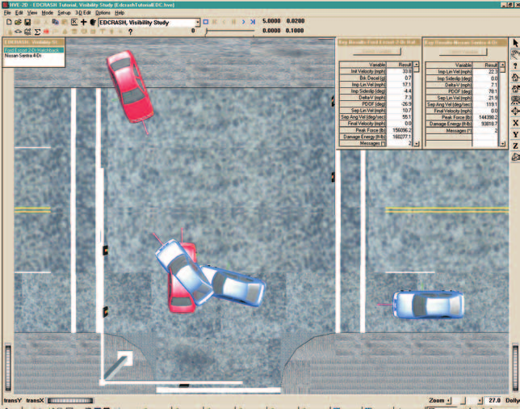

# Chapter 1 — EDCRASH Program Description

## Overview

EDCRASH (Engineering Dynamics Corporation Reconstruction of Accident Speeds on the Highway) is an analysis used to reconstruct single and two vehicle accidents. EDCRASH is based on the Calspan Reconstruction of Accident Speeds on the Highway (CRASH) [1,2,3] and includes refinements and enhancements provided by the National Highway Traffic Safety Administration (NHTSA) [4,5,6] and Engineering Dynamics Corporation [7,8,9,10,11]. The program determines the conditions of impact, including the impact speeds and delta-V of the vehicles, using information obtained from vehicle and accident site inspections.

The output generated by EDCRASH depends on the amount of information supplied. The minimum information required is a description of the vehicle damage. Therefore, when accident site information is not supplied, the resulting output will be limited to an analysis of the severity of impact, including delta-V (speed change) and magnitude and principal direction of force. When accident site information is supplied, the output will also include the speed of the vehicle(s) at impact.

EDCRASH is a useful tool for investigating the circumstances of an accident. These circumstances include the effect of human, vehicle, and environmental factors on the pre-impact, impact, and post-impact events.

An extremely useful feature of EDCRASH is the ability to quickly and accurately review the results generated from different input scenarios. Termed *what if* analysis, changes can be made to an isolated variable or set of variables and the effects are displayed immediately. Only the parameters that change need to be modified; the HVE Event Editor saves all the previously entered information. For example, the sensitivity of the results to impact positions, rest positions or principal direction of force can be analyzed by merely changing the event and re-executing.

*Figure 1-1: EDCRASH Event.*

## Model Inputs

EDCRASH inputs include either one or two vehicles and an optional environment. Event set-up parameters include optional vehicle positions (positions are optional; however, speed at impact cannot be calculated unless at least impact and rest positions are supplied), Driver Controls (Percent Wheel Lock-up) and Damage Profiles (damage profiles are optional; however, impact speed cannot be computed for collinear collisions unless damage profiles are supplied).

## Model Outputs

The primary outputs from the EDCRASH analysis are impact speed and speed change (Delta-V) during the crash. The output reports produced by EDCRASH include Numeric Reports (Messages, Accident History, Vehicle Data, Damage Data and Program Data) and Graphic Reports (Site Drawing, Damage Profile and Momentum Diagrams).

## Validation

The computational accuracy of the program has increased with additional refinements of the algorithms. During program development, early validation of the damage-based method of computing delta-V [11] revealed an accuracy in the range of 12 percent (95 percent confidence level) when compared to staged collisions conducted by Calspan. More recent validation of impact speed estimates [10] revealed an accuracy in the range of −1.2 to +3.7 percent of the combined impact speed (95 percent confidence level) for oblique collisions and −7.1 to +3.2 percent of combined impact speed for collinear (damage-based) collision results. These validation studies were performed using staged collisions, wherein the data were available directly after the crash. Poor quality data can be expected to reduce the quality of the results.

For damage-based results, the linear approximation of delta-V versus crush has been shown to over-estimate delta-V for severe impacts when structural disintegration becomes a major factor. For low impact speeds the effect of the coefficient of restitution is ignored, resulting in an under-estimation of delta-V. However, for the normally experienced range of speed changes, the damage-based results are reasonable.

## HVE-2D and HVE

EDCRASH is compatible with both HVE-2D and HVE. While EDCRASH has been extended and revalidated for use in the HVE environment to account for 3-D terrain, EDCRASH is essentially a 2-dimensional physics reconstruction program.

If you are using EDCRASH within the HVE environment, the Human, Vehicle, and Environment Editors will have additional features that are not available in HVE-2D. These features are described in great detail in the HVE User's Manual. While some dialogs do look different between HVE-2D and HVE, the required input for EDCRASH is found in both. Where there are differences related to the use of EDCRASH, these differences are noted in this manual.

## Basic Procedure

The procedure for using EDCRASH is substantially the same as using any reconstruction or simulation model in the HVE environment. The basic procedure may be divided into three categories:

- **Data Acquisition** — Obtaining raw data from field inspections and other research
- **Data Reduction** — Converting the raw field measurements into data in the form required by the analysis
- **Data Analysis** — Analyzing (using the laws of physics) the data

### Data Acquisition and Reduction

Obtaining error-free results using EDCRASH is no simple task, because results must be consistent with all of the physical laws of nature to be displayed without Fatal or Diagnostic messages. This can be frustrating because an investigator's information is frequently sketchy or estimated from several sources.

> "Any analysis produced by EDCRASH without error messages is consistent with the laws of physics (Newton's laws, the conservation of energy and the conservation of momentum) and is totally consistent with the input data which produced it."

When preparing for an EDCRASH analysis, the following procedure is recommended:

1. It is convenient (and highly recommended) to prepare data sheets to hold the required information before entering data into the computer. Separate "Site Data" and "Vehicle Data" forms work extremely well. Damage Profile Data Sheets are available from EDC by simply calling. For a Site Data form, we suggest you simply start with a large, clean sheet of paper.
2. Gather all accident site and vehicle information.
3. Transfer the accident site and vehicle information to scaled accident site and vehicle diagrams.
4. Using the scaled accident site diagram, along with a scale and protractor, measure the positions and headings at all path locations. Enter this information on the Site Data sheet.
5. Enter the pre-impact sideslip angles and coefficient(s) of friction on the Site Data sheet.
6. Using the scaled vehicle diagrams, measure the damage profile and transfer the measurements (width, depths and damage offset) to the Vehicle Data sheet.
7. Confirm the vehicle dimensional, inertial and tire properties using direct measurement if possible.

### Data Analysis

Once the raw data are acquired and reduced, analyzing the data involves the following procedures:

- Use the Vehicle Editor to add one or more vehicles to the case. Edit the vehicle(s) as required to suit the needs of the current case.
- Optionally, use the Environment Editor to create a visual and physical environment.
- Use the Event Editor to set up and execute the EDCRASH reconstruction model by performing the following steps:
  - Choose one or two vehicles from the list of vehicles created earlier.
  - Choose the EDCRASH calculation model.
  - Choose the desired Trajectory option.
  - Optionally, position the vehicle(s) in the environment.
  - Optionally, assign damage profiles to the vehicle(s).
  - Optionally, assign driver controls (Wheel Data) for each vehicle.
- Execute the reconstruction event.
- Modify the event set-up parameters as required to eliminate any fatal errors; diagnostic messages should be reviewed to determine their effect on the results.
- Finally, use the Playback Editor to view the various reports and trajectory simulations. If desired, produce a video output of the simulation.
- Save your case!

---

*Previous: [Table of Contents](README.md) · Next: [Chapter 2 — EDCRASH Program Input](02-program-input.md)*

<!-- NAV -->

---

← Previous: [EDCRASH — Collision Reconstruction](README.md)  |  [Index](README.md)  |  Next: [Chapter 2 — EDCRASH Program Input](02-program-input.md) →

<!-- /NAV -->
