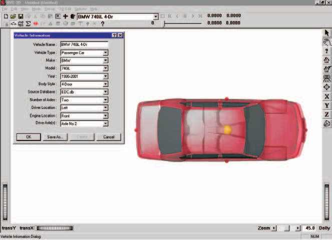
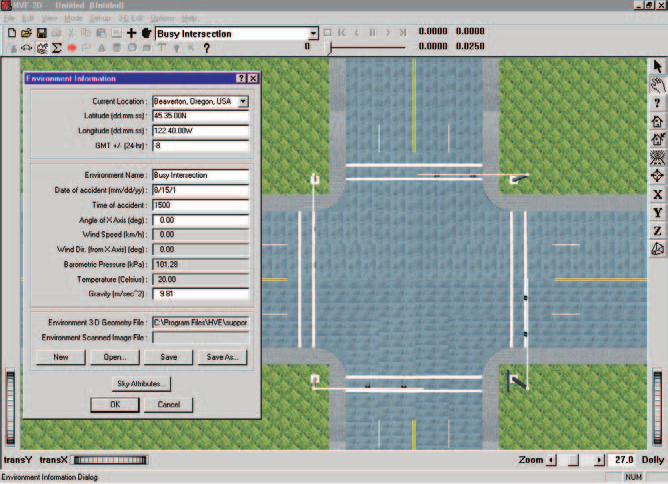
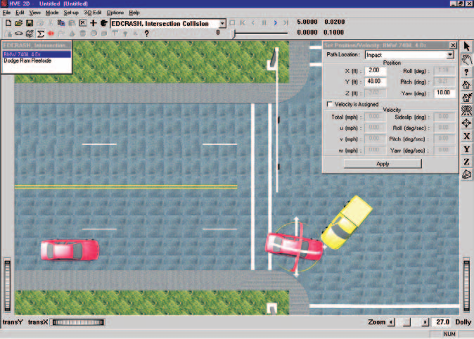
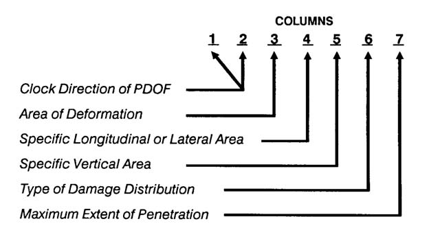
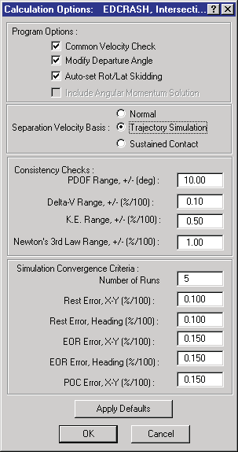
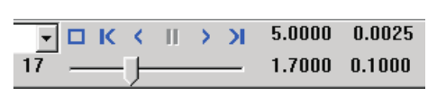

# Chapter 2 — EDCRASH Program Input

This chapter defines the objects (vehicles and environment) and the event set-up parameters (positions, damage profiles, wheel lock-ups, and so forth) used by the EDCRASH analysis. In general, the chapter is divided into the following sections:

- **Objects** — The number of vehicles, and the specific vehicle parameters actually used by EDCRASH.
- **Events** — The various options available for setting up and executing an EDCRASH event.

## Objects Overview

The objects used by the EDCRASH model are:

- **Vehicles** — One or two vehicles may be studied by EDCRASH.
- **Environment** — Like the real world, EDCRASH has exactly one environment.

> **NOTE:** The environment is used in any reconstruction or simulation model.

The following sections describe how the vehicle and environment provide the required inputs to the EDCRASH calculation model.

## Vehicles

EDCRASH uses one or two vehicles created using the Vehicle Editor. Vehicles are selected from the Vehicle Database by choosing the following attributes:

- **Type** — EDCRASH supports the following vehicle types: Passenger Car, Pickup, Van, Sport-Utility, Truck, Movable Barrier and Fixed Barrier.
- **Make** — EDCRASH supports all available vehicle makes.
- **Model** — EDCRASH supports all available vehicle models, within the limits defined by number of axles and drive axles; see below.
- **Year** — EDCRASH supports all available vehicle years.
- **Body Style** — EDCRASH supports all available vehicle body styles.

Each vehicle also has the following additional user-editable parameters:

- **Driver Location** — The Driver Location is not used by EDCRASH. However, Driver Location must not be *None*; otherwise, the Driver Controls (Wheel Data) will not be available during Event mode.
- **Engine Location** — The Engine Location is not used by EDCRASH.
- **Number of Axles** — EDCRASH supports only 2-axled vehicles.
- **Drive Axle(s)** — The Drive Axle is not used by EDCRASH.

To add a vehicle to the current case, perform the following steps:

1. Choose Vehicle Mode. The Vehicle Editor is displayed.
2. Choose Add New Object. The Vehicle Information dialog is displayed.
3. Click on the Type, Make, Model, Year and Body Style option buttons to select a vehicle from the database.
4. If desired, modify the Driver Location, Engine Location, Number of Axles and Drive Axle(s) for the current vehicle.
5. Enter a name for the current vehicle. A default name is supplied for each selected vehicle. Its name is user-editable, and does not affect calculations.

   > **NOTE:** Duplicate vehicle names are not allowed in the same case.

6. Click OK to add the vehicle to the current case.

*Figure 2-1: Vehicle Editor.*

The following Vehicle Parameter groups are assigned using the Vehicle Editor:

- Sprung Mass
  - Inertias
  - Move CG
- Unsprung Mass
  - Wheel Location
  - Tire Data
  - Suspension Data
  - Brake Data
- Steering System
- Exterior
  - Overall Dimensions
  - Crush Stiffness Coefficients

The specific data used in each of the above parameter groups are defined in Tables 2-1 through 2-3.

### Sprung Mass

**Table 2-1: Vehicle Sprung Mass Parameters Used By EDCRASH**

| Parameter | Description |
|---|---|
| Total Weight | Total vehicle weight |
| Total Yaw Inertia | Total rotational inertia about the vehicle-fixed z axis |
| Move CG x | Relocates the CG in the vehicle-fixed x direction. This entry causes an automatic adjustment of all other vehicle dimensions to reflect the new CG location. |

#### Inertias

EDCRASH uses the total vehicle weight (converted to mass according to the current gravitational constant; see Environment), and the total yaw rotational inertia.

Because EDCRASH does not have separate degrees of freedom for the unsprung masses, the yaw moment of inertia used by EDCRASH is the sum of the sprung mass yaw inertia plus the additional yaw inertia created by the individual wheels. See also EDCRASH Output, Vehicle Data report.

#### Move CG

Move CG is not directly used by EDCRASH. Its current value does not show up in the results. However, the Move CG fields may be used to quickly move the vehicle's center of gravity. The x,y,z coordinates for the wheels are updated to reflect the new CG location.

> **NOTE:** Bilateral symmetry is assumed. Moving the CG in the +y or −y direction will have no effect on the EDCRASH calculations.

#### Geometry File

The Geometry File is not used by EDCRASH.

### Unsprung Mass

**Table 2-2: Vehicle Unsprung Mass Parameters Used By EDCRASH**

| Parameter | Description |
|---|---|
| Wheel Location | The vehicle-fixed x,y,z wheel center coordinates |
| Tire Slide Friction | The slide coefficient of friction for each tire |
| Tire Friction Table, Test Load/Speed | The load and speed for a given set of friction results (EDCRASH uses the middle load and middle speed) |
| Friction In-use Factor | Multiplier for Slide Friction |
| Tire Cornering Stiffness | Tire lateral force per unit of tire lateral slip for small amounts of slip |
| Cornering Stiffness In-use Factor | Multiplier for Cornering Stiffness |

#### Wheel Location

Although HVE-2D provides values for the vehicle-fixed x,y,z coordinates of each wheel, EDCRASH uses the following parameters: $a$, the distance from the CG to the front axle; $b$, the distance from the CG to the rear axle; and $t_w$, the average of the front and rear track widths.

> **NOTE:** EDCRASH uses the average $x_{wheel}$ for the front wheels to calculate $a$ and the average $x_{wheel}$ for the rear wheels to calculate $b$. Similarly, EDCRASH uses the total distance between right-side and left-side tires to calculate track width. Bilateral symmetry is assumed. Finally, EDCRASH does not use $z_{wheel}$ for calculations.

#### Tire

The tire parameters provide the following data groups:

- Physical Data
- Friction Table
- Cornering Stiffness Table
- Slip-vs-Rolloff Table

EDCRASH's use of these parameters is described below.

#### Physical Data

EDCRASH does not use the Tire Physical Data.

#### Friction Data

The Friction Data used by EDCRASH are shown in Table 2-2. EDCRASH uses the slide friction coefficient.

Because EDCRASH's tire model does not include a load or speed dependence, if friction data for more than one load or speed is supplied in the HVE Tire Data dialog, EDCRASH uses the friction coefficient for the middle load and/or speed.

> **NOTE:** If there is any doubt about which value is actually used by EDCRASH, you can check the Vehicle Data output report.

The In-use Factor, available in HVE, is a convenient way to reduce or increase the dependent friction value for a specific case.

#### Cornering Stiffness Data

If (and only if) the Trajectory Simulation option is selected, EDCRASH uses the Cornering Stiffness value.

Like the Friction Table, EDCRASH's tire model does not include a load or speed dependence. If more than one load or speed is supplied in the HVE Tire Data dialog, EDCRASH uses the cornering stiffness for the middle load and/or speed.

> **NOTE:** If there is any doubt about which value is actually used by EDCRASH, you can check the Vehicle Data output report.

The In-use Factor is a convenient way to reduce or increase the cornering stiffness.

> **NOTE:** If you are simulating a vehicle with a flat tire, you'll probably want to reduce the In-use Factor to about 0.1.

#### Slip-vs-Rolloff Table

EDCRASH does not use the Tire Slip-Rolloff data.

#### Suspension

EDCRASH does not use the Suspension data.

#### Brake

EDCRASH does not use the Brake data.

### Exterior

EDCRASH uses the following Vehicle Exterior Data:

- Exterior Dimensions
- A and B Stiffness Coefficients

**Table 2-3: Vehicle Exterior Parameters Used By EDCRASH**

| Parameter | Description |
|---|---|
| CG to Front, Right, Back and Left | The vehicle's exterior dimensions |
| A Stiffness Coefficient | The force per unit width required to initiate permanent deformation |
| B Stiffness Coefficient | The vehicle crush rate, that is, the force per unit of permanent crush depth per unit of damage width |

### Steering System Data

EDCRASH does not use the Steering System data.

### Brake System Data

EDCRASH does not use the Brake System data.

## Environment

EDCRASH uses the environment created by the HVE Environment Editor. The environment is created by defining the following groups of attributes:

- Visual Data
- Physical Data

*Figure 2-2: Environment Editor.*

### Creating an Environment

To add an environment to the current case, perform the following steps:

1. Choose Environment Mode. The Environment Editor is displayed.
2. Click Add New Object. The Environment Information dialog is displayed.
3. Click on the Location combo box to select the desired city, state and country, and associated Latitude, Longitude and GMT.
4. Enter the Time and Date for the event.
5. Enter the Angle of the X axis, Wind Speed and Direction, Barometric Pressure and Temperature for the event.
6. Enter the Gravity Constant for the event.
7. Enter an environment name. A default name is supplied for the current environment. The name is user-editable, and does not affect calculations.
8. Click OK to add the environment to the current case.

### Visual Data

The following visual parameters may be edited:

- **Environment Location** — A database containing the name (City/State/Country), Latitude and Longitude and GMT for the selected location.
- **Time and Date** — The local standard time and date for the event.

The visual data are not used by the event; they are provided for studies related to visibility at the time of an event (e.g., avoidability of an accident).

> **NOTE:** The visual data (Location, Time, Date and Angle of earth-fixed X axis) affect the lighting of the event! Depending on your view (Camera Position) the scene may be shaded and difficult to see. If the time is after sundown, the view will be dark.

### Physical Data

The Physical Data groups are:

- Angle of X Axis
- Wind Speed and Direction
- Atmospheric Temperature and Pressure
- Gravity Constant
- Surface Geometry

**Table 2-4: Environment Parameters Used By EDCRASH**

| Parameter | Description |
|---|---|
| Gravitational Constant | The local acceleration of gravity |
| 3-D Surface Geometry (Friction Factor, Elevation, Slope) | The polygon database used to create the 3-D environment |

#### Angle of X Axis

The angle of the X axis is used to position the earth-fixed coordinate system on the surface of the earth.

> **NOTE:** The angle is specified relative to true north. If you are using a compass to determine direction at the scene of an accident, you should provide a correction factor before entering this angle.

> **NOTE:** The angle of the X axis affects how you visualize an EDCRASH event because it affects the location of the sun.

#### Wind Speed and Direction

EDCRASH does not use the Wind Speed and Direction.

#### Atmospheric Temperature and Pressure

EDCRASH does not use the atmospheric temperature and pressure.

#### Gravitational Constant

The gravitational constant converts mass to force. An object's mass and rotational inertias are properties that are the same throughout the universe; however, the weight of an object is dependent on the local gravitational constant.

#### Surface Geometry

If the Trajectory Simulation option is used, EDCRASH uses the geometry to calculate the friction multiplier for the current X,Y position of each tire during the simulation.

In HVE, it is also used to calculate the elevation and slope.

> **NOTE:** Geometry is used only if a trajectory simulation is requested. The traditional, energy-based analysis does not use the surface geometry.

## Event

EDCRASH uses the Event Editor to create, set up and execute an event. Each of these topics is described below.

*Figure 2-3: Event Editor, setting up and executing an EDCRASH Event.*

### Creating an Event

An EDCRASH event is created using the Event Information dialog.

To create an EDCRASH event:

1. Choose Event Mode. The Event Editor is displayed.
2. Choose Add New Object. The Event Information dialog is displayed.
3. Select one or two vehicles from the Active Vehicles list.
4. Select the calculation model, EDCRASH, from the Calculation Model options list.
5. Enter an event name. A default name is supplied for the selected event. The name is user-editable, and does not affect calculations.

   > **NOTE:** Duplicate event names are not allowed in the same case.

6. Click OK to create the EDCRASH event.

   > **NOTE:** If you choose a vehicle that is not compatible with EDCRASH, a message will be displayed describing the problem. You will not be allowed to proceed until EDCRASH-compatible objects are selected.

### Setting Up an EDCRASH Event

EDCRASH uses the following event set-up options:

- Position/Velocity
- Driver Controls
- Damage Profiles

**Table 2-5: Event Set-up Parameters Used By EDCRASH**

| Parameter | Description |
|---|---|
| Vehicle Position: Begin Braking, Impact, Point-on-curve, End-of-rotation, Final/Rest | The earth-fixed X,Y coordinates and heading angles of each vehicle for each of the selected positions |
| Driver Controls, Wheel Data | Pre-impact Drag Factor, Rotation/Lateral Skidding Flag, % Wheel Lock-up, Steer Angle\* |
| Damage Profile | CDC, PDOF, x,y Impulse Coordinates, Damage Width, up to 10 crush depths, damage Midpoint Offset, A and B Stiffness Coefficients for each crush zone |

\* Steer Angle applies only if the Trajectory Simulation option was selected.

#### Position/Velocity

Each vehicle is positioned relative to the earth-fixed coordinate system by supplying the X,Y,Z coordinates of its CG, and roll ($\phi$), pitch ($\theta$) and yaw ($\psi$) angles about the vehicle x, y and z axes, respectively (Table 2-5).

> **NOTE:** In EDCRASH, +230 degrees is not the same as −130 degrees because the relative magnitude between two angles implies the rotation direction! For example, if the impact heading angle is 180 degrees and the rest heading angle is 230 degrees, the change in heading angle between impact and rest is +50 degrees clockwise; if the rest heading angle is −130 degrees, the change in heading angle is −310 degrees and the direction of rotation is counter-clockwise. Refer to the HVE or HVE-2D User's Manual for more information.

> **NOTE:** In HVE-2D, Z is equal to the CG height above ground, and roll and pitch are equal to 0.0.

> **NOTE:** In HVE, Z, roll and pitch are supplied automatically using AutoPosition.

EDCRASH uses the following positions:

- **Begin Braking** — The X,Y coordinates and heading angle of the vehicle when the brakes are applied before impact.
- **Impact** — The X,Y coordinates and heading angle of the vehicle at impact.

  > **NOTE:** The positions of two vehicles at impact should overlap such that they share the same impulse center.

- **Point-on-curve (POC)** — The X,Y coordinate on a curved path between impact and end-of-rotation or rest.

  > **NOTE:** Only the X,Y coordinate is required; the heading angle is not used.

- **End-of-rotation (EOR)** — The X,Y coordinate and heading angle that specify where the vehicle's motion changed from rotating/lateral skidding to pure rollout.
- **Final/Rest** — The X,Y coordinates and heading angle of the vehicle at its rest position. A velocity may also be entered. This value is used as the final velocity at the end of the path.

Positions are not required. However, if an estimate of impact speed is desired, Impact and Rest positions must be supplied. Begin Braking, End-of-rotation and Point-on-curve positions are optional.

#### Driver Controls

EDCRASH uses the Driver Controls, Wheel Data option. The Wheel Data dialog allows the user to enter the following parameters:

**Pre-impact Wheel Lock-up** — The total combined wheel lock-up (percent of available friction used by all wheels) by the vehicle during its travel from the user-entered Begin Braking position to the Impact position.

Typical values for non-braking rolling resistance for passenger car tires are provided for reference in Table 2-6 [11]. These values should be entered in the Driver Controls – Brakes dialog using the Percent Available Friction option. Representative values for locked-wheel (slide) friction coefficients for passenger car tires on a variety of surfaces are also provided, in Table 2-7 [10]. While the table is very complete, EDC makes no claim as to the accuracy of the data. The user is urged to perform thorough research in order to supply EDCRASH with the best possible data.

**Rot/Lat Skidding** — A checkbox. Choose this option if the vehicle's sideslip angle was changing during the post-impact phase.

> **NOTE:** If Rot/Lat Skidding is selected, EDCRASH uses the modified Marquard analysis to account for vehicle spinning.

**% Lock-up** — The percent of available longitudinal friction used by each tire. The entered value is assumed constant during the entire post-impact phase.

> **NOTE:** Enter only the longitudinal component! If the vehicle is sliding laterally, EDCRASH will determine that condition and account for it. If you also account for the lateral sliding, it will be accounted for twice!

**Steer Angles** — The constant steer angle at each tire.

**Table 2-6: Rolling Resistance Braking Inputs for Pavement [11]**

| Tire/Wheel Condition | % Available Friction |
|---|---|
| Normal Inflation | $0.010/\mu$ |
| Partial Inflation | $0.013/\mu$ |
| Damaged | 0.0 to 1.0 |
| Engine Braking — High Gear | $0.150/\mu$ to $0.200/\mu$ |
| Engine Braking — Low Gear | $0.200/\mu$ to $0.400/\mu$ |

**Table 2-7: Tire-Ground Friction Coefficients on Various Surfaces [10]**

| Surface | Dry <30 mph | Dry >30 mph | Wet <30 mph | Wet >30 mph |
|---|---|---|---|---|
| **Portland Cement** | | | | |
| — New, Sharp | 0.80–1.20 | 0.70–1.00 | 0.50–0.80 | 0.40–0.75 |
| — Traveled | 0.60–0.80 | 0.60–0.75 | 0.45–0.70 | 0.45–0.65 |
| — Polished | 0.55–0.75 | 0.50–0.65 | 0.45–0.65 | 0.45–0.60 |
| **Asphalt or Tar** | | | | |
| — New, Sharp | 0.80–1.20 | 0.65–1.00 | 0.50–0.80 | 0.45–0.75 |
| — Traveled | 0.60–0.80 | 0.55–0.70 | 0.50–0.80 | 0.45–0.75 |
| — Polished | 0.55–0.75 | 0.45–0.65 | 0.45–0.65 | 0.40–0.60 |
| — Excess Tar | 0.50–0.60 | 0.35–0.60 | 0.30–0.60 | 0.25–0.55 |
| **Gravel** | | | | |
| — Packed, Oiled | 0.55–0.85 | 0.50–0.80 | 0.40–0.80 | 0.40–0.60 |
| — Loose | 0.40–0.70 | 0.40–0.70 | 0.45–0.75 | 0.45–0.75 |
| **Cinders** | | | | |
| — Packed | 0.50–0.70 | 0.50–0.70 | 0.65–0.75 | 0.65–0.75 |
| **Rock** | | | | |
| — Crushed | 0.55–0.75 | 0.55–0.75 | 0.55–0.75 | 0.55–0.75 |
| **Ice** | | | | |
| — Smooth | 0.10–0.25 | 0.07–0.20 | 0.05–0.10 | 0.05–0.10 |
| **Snow** | | | | |
| — Packed | 0.30–0.55 | 0.35–0.55 | 0.30–0.60 | 0.30–0.60 |
| — Loose | 0.10–0.25 | 0.10–0.20 | 0.30–0.60 | 0.30–0.60 |

#### Damage Profile

EDCRASH uses the CDC to assign an initial damage profile (Damage Width, Crush Depths, Midpoint Offset). The Collision Deformation Classification (CDC) is a seven-character code which describes the vehicle damage. The characters in the CDC identify the Principal Direction of Force (PDOF) in clock direction, the impacted surface (front, right, back, or left), the shape of the damage profile, and the extent of maximum penetration. If a more accurate direction than the clock direction is known, the PDOF may be entered in degrees after the CDC. Detailed explanations of the parameters making up the CDC definitions are found in the HVE-2D User's Manual, Appendix V.

*Figure 2-4: Definition of each column within the seven-character CDC code.*

After entering the CDC, the damage profile may be edited by over-riding the default width, crush depths and damage offset. In addition, up to 10 crush depths may be entered, and up to 9 sets of A and B stiffness coefficients may be supplied. To delete the damage profile, enter *None* in the CDC field.

> **NOTE:** The Damage Profile dialog displays barrier results (Delta-V, damage energy and force) for the current vehicle. Please note these results do not apply to a 2-vehicle collision!

**Use Newton's 3rd Law** — Clicking on this checkbox causes EDCRASH to calculate the PDOF for the selected vehicle based on the vehicles' impact heading angles and the PDOF for the other vehicle. This is a convenient way to assign the PDOF for one vehicle.

> **NOTE:** You cannot use this checkbox for both vehicles.

#### Payload

The Payload Data are not used by EDCRASH. Payload inertias may be added to the vehicle inertias and the CG may be moved longitudinally using the Move CG dialog.

> **NOTE:** Lateral and vertical relocation of the CG are not supported by EDCRASH.

### Simulation Controls

If the Trajectory Simulation option is selected, EDCRASH uses the Vehicle Trajectory integration timestep and the maximum simulation time parameters in the Simulation Controls dialog (see Options Menu, Simulation Controls).

**Table 2-8: Simulation Control Parameters Used By EDCRASH**

| Parameter | Description |
|---|---|
| Vehicle Trajectory Integration Timestep | The integration timestep used by the numerical integration routine |
| Output Interval | The timestep used to send output results back to HVE |
| Maximum Simulation Time | The maximum simulation time determines how long the simulation is allowed to run before normal termination |
| Min Linear Velocity | The linear velocity used to terminate the run (if the linear and angular velocities for both vehicles are simultaneously less than these termination velocities, the run terminates) |
| Min Angular Velocity | The angular velocity used to terminate the run (see above) |

### Calculation Options

EDCRASH has the following calculation options:

- Program Options
- Separation Velocity Basis
- Consistency Checks
- Simulation Convergence Criteria

These options control the basic execution of an EDCRASH event. The current EDCRASH calculation options are displayed in the EDCRASH Program Data output report (refer to the following chapter). Each of these options is described below. For a complete, code-verified description of every control in the dialog, see [Calculation Options for EDCRASH](../../10-calculation-options/CalcOptEDCRASHDlg.md).

*Figure 2-5: EDCRASH Event Calculation Options dialog.*

#### Program Options

During execution of an EDCRASH event, certain features may be turned on or off. These features are:

- **Common Velocity Check** (default = TRUE) — The EDCRASH damage procedure assumes the vehicles' impulse centers reach a common earth-fixed velocity at the end of the collision phase. The Common Velocity Check compares the separation velocities for both vehicles to determine if this condition is satisfied. EDCRASH produces a warning or error message if the condition is not satisfied (see Chapter 6, Messages, for more information).

  > **NOTE:** The Common Velocity Check is performed during a normal CRASH3 run.

- **Modify Departure Angle** (default = TRUE) — If a point on curve is not entered, but a vehicle's post-impact phase has an angular separation velocity and a change in heading angle between separation and end of rotation (or rest), EDCRASH modifies the departure angle using an empirical relationship [3].

  > **NOTE:** Modify Departure Angle is performed during a normal CRASH3 run.

- **Auto-set Rot/Lat Skidding** (default = TRUE) — The Event Wheel Data dialog includes a check box, labeled Rot/Lat Skidding. That check box is used by EDCRASH to invoke the modified Marquard analysis [3, 15] for vehicles spinning after impact. Enabling this option causes EDCRASH to automatically assign the status for that program option. When enabled, EDCRASH sets the Rot/Lat Skidding flag to TRUE under the following circumstances: (a) the change in heading angle requires a tighter turn radius than the vehicle is capable of (as defined by its wheel base and maximum steer angle), or (b) the departure sideslip angle exceeds 10 degrees.

  > **NOTE:** The Auto-set Rot/Lat Skidding feature is not included in CRASH3.

- **Include Angular Momentum Solution** (default = FALSE) — When checked, EDCRASH includes a conservation of angular momentum solution in addition to the standard linear momentum solution. *(updated: this fourth check box appears in the current Calculation Options dialog but is disabled (grayed out) and cannot be changed.)*

If all of the above options are turned off, EDCRASH performs a simplistic analysis comparable to what is traditionally done on a hand-held calculator.

#### Separation Velocity Basis

EDCRASH has the following user-selectable trajectory model options:

- **Normal** — Choosing Normal causes EDCRASH to perform its standard, energy-based calculations to provide an estimate for separation forward, lateral and angular velocities and departure angle.
- **Trajectory Simulation** — Choosing Trajectory Simulation causes EDCRASH to perform its standard, energy-based calculations (same as choosing Normal, above), and then use these separation velocities and departure angles as the initial conditions for a trajectory simulation.
- **Sustained Contact** — Choosing Sustained Contact causes EDCRASH to use a weighted drag factor based on the wheel lock-ups and weights of the individual vehicles.
- **Iterate on Sideslip** — *(updated: the current dialog offers a fourth radio button, Iterate on Sideslip, which requests an iterative solution on vehicle sideslip angle. This option is not supported by the current EDCRASH physics engine; selecting it causes the event to terminate with an error.)*

> **NOTE:** You cannot choose both Sustained Contact and Trajectory Simulation because the EDCRASH Trajectory Simulation does not account for the inter-vehicle contact force during the post-impact phase.

#### Consistency Checks

EDCRASH performs a series of internal consistency checks to confirm that various individual pieces of data are consistent with each other. When results are found to be inconsistent, as determined by these user-editable ranges, messages are produced and displayed in the Messages Output Report (refer to Chapter 6, Messages). The following internal consistency checks are performed:

- **PDOF Range** (default = ±10 deg) — If the collision type is oblique and the user also enters damage data for both vehicles, EDCRASH can compare the PDOFs computed by the momentum analysis with the values entered by the user. If the difference between the momentum-based and user-entered values exceeds the PDOF Range, a message is displayed in the Messages Output Report.
- **Delta-V Range** (default = ±10%, entered as 0.10) — If the collision type is oblique and the user also enters damage data for both vehicles, EDCRASH can compare the delta-Vs computed by the momentum analysis with the results computed by the damage analysis. If the difference between the momentum-based and damage-based results exceeds the Delta-V Range, a message is displayed in the Messages Output Report.
- **K.E. Range** (default = ±50%, entered as 0.50) — If the collision type is oblique and the user also enters damage data for both vehicles, EDCRASH can compare the kinetic energy loss computed using the momentum-based impact speeds with the kinetic energy loss computed using the damage-based impact speeds. This difference is also directly compared with the damage energy calculated from the damage analysis. If the difference in kinetic energy from the momentum-based or damage-based impact speeds differs from the damage energy computed from the damage analysis by more than the K.E. Range, a message is displayed in the Messages Output Report.
- **Newton's 3rd Law Range** (default = ±100%, entered as 1.00) — If damage data are entered for two vehicles in a collision, EDCRASH can compare the peak forces computed independently for each vehicle. If the difference in peak forces exceeds the Newton's 3rd Law Range, a message is displayed in the Messages Output Report.

  > **NOTE:** For barriers, the collision force is not calculated independently; the force on the barrier is set equal to the force on the deformable vehicle.

#### Simulation Convergence Criteria

If the Separation Velocity Basis was selected as Trajectory Simulation (see above), a series of tests are performed comparing the simulated path with the actual path (i.e., the path defined by the user-entered path positions). EDCRASH then reports the difference between the simulated path and actual path by calculating the distance between the individual simulated and actual path positions. The difference is reported as an error for each path position entered by the user (i.e., point on curve, end of rotation and rest). If one or more errors exceeds the allowable value(s), the separation velocities are adjusted and the simulation is re-executed.

For the simulation to successfully converge, each error must be less than that specified in the Simulation Convergence Criteria. When the difference between the simulated and actual paths is acceptable for all positions, the trajectory simulation is said to have converged. The simulation will be re-executed (up to 5 runs by default) in an effort to achieve convergence. If, after the specified number of runs, the simulation has not converged, the separation conditions that produced the smallest total error are used by EDCRASH.

The default convergence tolerances are: Rest Error X-Y = 0.10, Rest Error Heading = 0.10, EOR Error X-Y = 0.15, EOR Error Heading = 0.15, POC Error X-Y = 0.15 (all as fraction, %/100). See [Calculation Options for EDCRASH](../../10-calculation-options/CalcOptEDCRASHDlg.md) for details.

The Program Data report displays all the calculation options used for the current EDCRASH event (see also Chapter 3). The results for the trajectory simulation, if selected, are also displayed in the Program Data Output Report.

### Executing an Event

To execute an EDCRASH event, use the Event Controller, a component of the Event Editor.

*Figure 2-6: Event Controller, used for starting and stopping event execution.*

The Event Controller's buttons have the following functions:

- **Reset** — Reinitialize the calculation model for re-execution
- **Rewind to Start** — Return to the start of the simulation
- **Reverse** — Play the simulation backwards
- **Pause** — Pause the simulation
- **Play** — Execute the EDCRASH event or play the simulation forwards
- **Advance to End** — Advance to the end of the simulation

Because EDCRASH is a reconstruction program (as opposed to a simulation program), it performs a single set of calculations and terminates. Therefore, the only buttons meaningful to EDCRASH are the Play and Reset buttons. Pressing Play causes the EDCRASH calculations to be performed, then the program automatically terminates. Pressing Play again will cause the calculations to be repeated. Pressing Reset causes the event output (next chapter) to be erased; it does not affect the event input.

> **NOTE:** EDCRASH is fundamentally a reconstruction program, not a simulation program. Thus, pressing Play executes the calculations, but since there is no time-dependent simulation to display, nothing appears to happen. However, if you watch your Key Results windows, you will see the effects of execution.

> **NOTE:** You will probably find it very useful to execute an EDCRASH run, make changes to the event set-up options (see previous section), and re-execute the event. You will very quickly discover the event-related parameters to which the analysis is sensitive.

> **NOTE:** If the Trajectory Simulation option is selected, the simulation is performed, but not visualized.

> **NOTE:** Remember to use the Options Menu to choose useful options, such as Key Results, Axes and Velocity Vectors.

---

*Previous: [Chapter 1 — Program Description](01-program-description.md) · Next: [Chapter 3 — EDCRASH Program Output](03-program-output.md)*

<!-- NAV -->

---

← Previous: [Chapter 1 — EDCRASH Program Description](01-program-description.md)  |  [Index](README.md)  |  Next: [Chapter 3 — EDCRASH Program Output](03-program-output.md) →

<!-- /NAV -->
