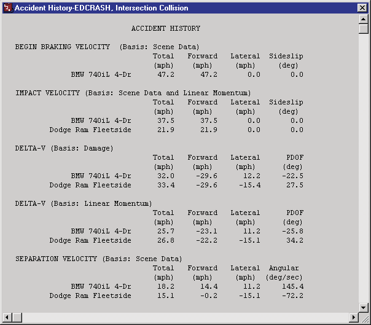
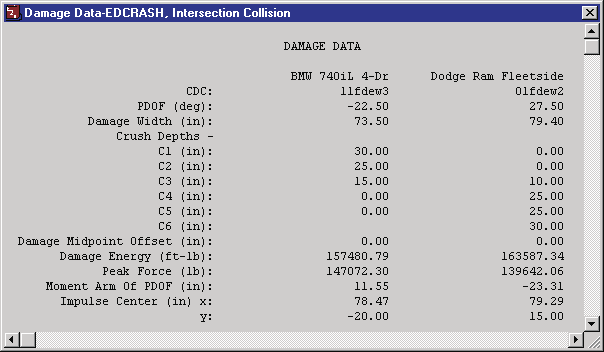
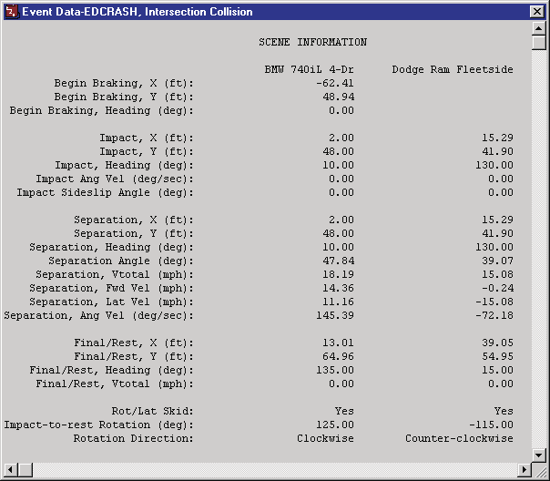
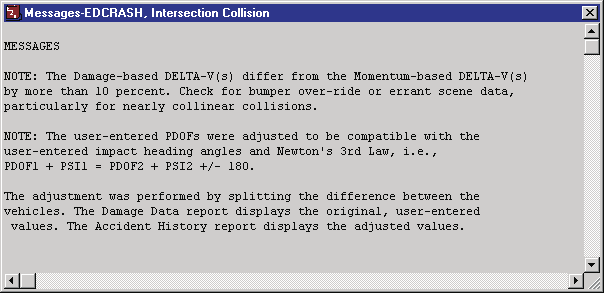
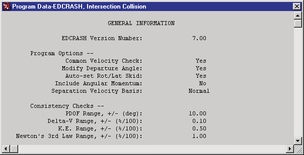
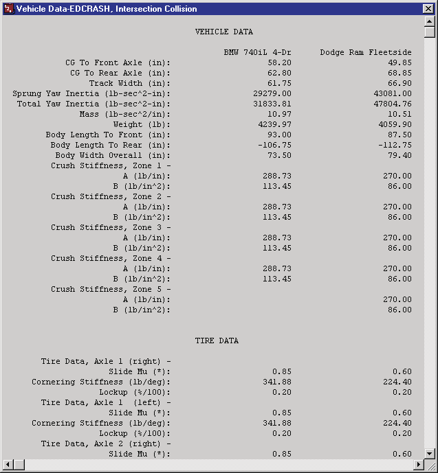
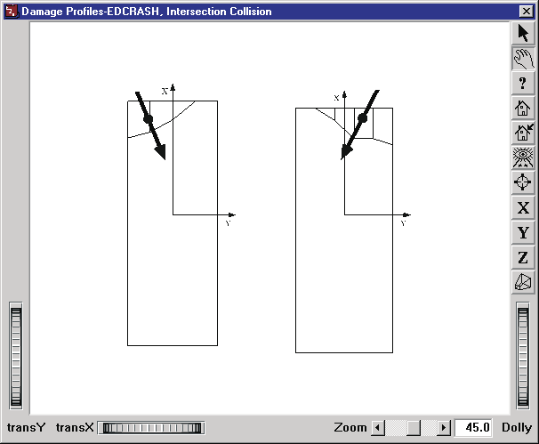
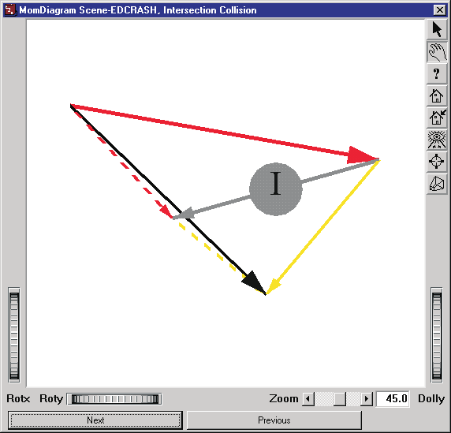
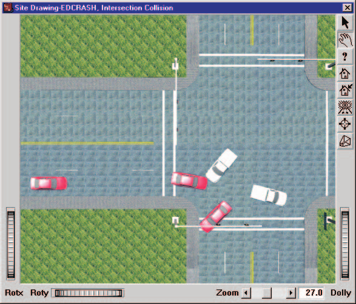

# Chapter 3 — EDCRASH Program Output

This chapter defines the outputs available from an EDCRASH event. The reports produced by EDCRASH are available in the Playback Editor.

## Output Overview

EDCRASH produces two types of output reports:

- **Alpha-Numeric Reports** — Reports containing text and numeric information, such as vehicle dimensional parameters
- **Graphic Reports** — Reports containing static visual information, such as momentum diagrams and damage profiles

> **NOTE:** Each of these reports may be printed on the system printer. To print a report, click on the menu bar of the desired output report (the menu bar will change colors indicating that it is selected), then either choose Print from the Files menu or click on the Print icon in the toolbar. Refer to the User's Manual for further details.

To view any of these reports, perform the following steps:

1. Choose Playback Mode. The Playback Editor is displayed.
2. Choose Add New Object. The Report Window Information dialog is displayed, showing a list of all the current events in the case.
3. Select an EDCRASH event from the list. Once an event is selected, the Selected Output option list is displayed, containing all the available reports for the selected event.
4. Choose the desired report from the Selected Output list.
5. Enter a Report Window Name. A default name is supplied for the selected report window. The name is user-editable, and does not affect calculations.

   > **NOTE:** Duplicate Report Window names are not allowed. Because the name is truncated to 30 characters, you should ensure that two truncated names are not the same.

6. Click OK to display the report.

## Alpha-Numeric Reports

EDCRASH produces the following alpha-numeric reports:

- **Accident History** — A table of initial and final positions and velocities computed by EDCRASH; also includes restitution information
- **Damage Data** — A table of damage-based results produced by EDCRASH
- **Event Data** — A table of all the user-entered scene data used by EDCRASH
- **Messages** — A list of messages produced by the current run
- **Program Data** — A table containing program control information for the current run
- **Vehicle Data** — A series of tables containing the vehicle data used by EDCRASH

### Accident History

The Accident History Report displays a table of initial and final positions and velocities for the vehicle.

*Figure 3-1: Typical Accident History Output Report produced by EDCRASH.*

- **Begin Braking** — Total velocity, forward and lateral velocity components, and sideslip angle for each vehicle for which a begin braking position was given.
- **Impact** — Total velocity, forward and lateral velocity components, and sideslip angle for each vehicle at impact.

  > **NOTE:** The total velocity is the vector sum of the forward and lateral components, i.e.: $\vec{V} = \vec{V}_{fwd} + \vec{V}_{lat}$

  > **NOTE:** A sideslip angle greater than +90 degrees or less than −90 degrees implies the vehicle is moving backwards (i.e., the forward velocity component is negative) at impact.

  Next to "Impact Velocity" is the basis for results. It specifies which delta-V calculation method (damage or linear momentum) was used in the computation of impact speed. For collinear impact, the results will be based on impact-to-rest phase calculations (trajectory) and vehicle damage. Otherwise, the results will be based on trajectory and the conservation of linear momentum.

- **Delta-V** — The change in velocity and forward and lateral components of velocity change for each vehicle due to the collision. Also, Principal Direction of Force, PDOF.

  If the collision was collinear, only the damage-based delta-V will be displayed. If the collision was oblique, a delta-V computed from scene data (i.e., linear momentum) will be displayed in addition to the damage-based delta-V.

  > **NOTE:** If a fatal error occurred, impact speed will not be reported; the calculated results will be limited to the damage-based delta-V.

  When the momentum solution is used, two important means of helping to ensure valid results are available (see also Warning Messages):

  - the delta-V computed by momentum should be approximately equal to (within ±10% of) the delta-V computed by damage
  - the value of the momentum-based PDOF should be approximately equal to (within ±10% of) the damage-based PDOF

- **Separation Velocity** — Total velocity, forward and lateral velocity components, and sideslip angle for each vehicle at separation.

  > **NOTE:** Separation velocity is only computed when scene data are entered (see Calculation Method).

- **Relative Velocity** — The closing velocity of the vehicles at impact and the coefficient of restitution.

  By definition, the relative velocity is computed in a direction defined by the line between the vehicle CGs. The coefficient of restitution should be positive (a negative value results in a warning message; see Warning Messages).

### Damage Data

The Damage Data Report includes the following information:

- **CDC** — User-entered Collision Deformation Classification for each vehicle.
- **PDOF** — User-entered Principal Direction of Force for each vehicle. This is the direction in which the peak collision force (see below) acts.
- **Damage Width** — User-entered Damage Width for each vehicle.
- **Crush Depths** — User-entered Crush Depths for up to nine crush zones on each vehicle.
- **Damage Midpoint Offset** — User-entered distance from the vehicle CG to the middle of the damage region for each vehicle.
- **Damage Energy** — The calculated damage energy for each vehicle.

  The energy dissipated by damage is based on the damage data (damage profile and crush stiffness coefficients) and not on the conservation of energy. A check for agreement with the conservation of energy is performed. If the results are not consistent, a warning message is issued (see Messages). This is also an important means of helping to ensure valid results.

- **Peak Collision Force** — The calculated peak collision force for each vehicle. The peak collision force acts through the impulse center in the direction of the PDOF.
- **Moment Arm of PDOF** — Perpendicular distance from the vehicle CG to the peak collision force.

  > **NOTE:** A positive moment arm produces clockwise rotation; a negative moment arm produces counter-clockwise rotation. These directions should normally be consistent with the user-entered rotation directions. Otherwise a warning message will be issued (see Warning Messages).

- **Impulse Center** — The vehicle-fixed x,y coordinates for the center of impulse for each vehicle.

  The impulse center is calculated from the summation of forces and moments acting on the vehicle. The peak collision force acts through the impulse center in the direction of the PDOF.

  > **NOTE:** For a homogeneous vehicle (i.e., equal stiffness coefficients in all crush zones), the impulse center is the same as the damage centroid.

*Figure 3-2: Typical Damage Data Output Report produced by EDCRASH.*

### Event Data

The Event Data Report includes the following scene information for each vehicle if scene data were entered:

- **Impact Information** — The user-entered impact position and orientation for each vehicle. Also includes angular velocity and sideslip angle at impact.

  > **NOTE:** The angular rotation rate at impact will always be zero.

  > **NOTE:** For collinear collisions, the pre-impact sideslip angle may be modified by EDCRASH to be consistent with the user-entered PDOFs and calculated separation velocities. If the modified sideslip angles are inconsistent with other information, you should carefully review, and perhaps modify, the PDOFs and/or departure angles.

- **Separation Information** — The separation position and orientation for each vehicle. Also includes departure angle and separation linear and angular velocities at separation.

  > **NOTE:** The separation positions and headings are identical to the impact positions and headings — the result of assuming a quasi-instantaneous impact.

  Separation linear and angular velocities are displayed in the vehicle-fixed coordinate system (the forward and lateral velocity components are relative to the vehicle heading). The separation angle of the velocity vector (or departure angle) is relative to the earth-fixed coordinate system and is the angle used by the momentum analysis to establish the momentum-based delta-V.

  The separation velocities are the results of the impact-to-rest phase computations (see Calculation Method). If no rotational or lateral skidding was specified, the angular velocity will be zero and the linear velocity will be based on simple energy relationships. Otherwise, special calculations will be performed which account for simultaneous linear and angular velocity. If a trajectory simulation has been performed, the linear and angular velocities may be modified if the simulation did not converge on the first run.

- **Point-on-curve (POC) Information** — The user-entered X,Y POC position for each vehicle (if entered).
- **End-of-rotation (EOR) Information** — The user-entered X,Y EOR position and orientation for each vehicle (if entered).
- **Final/Rest Information** — The user-entered final/rest position and orientation for each vehicle. Also includes final velocity.

*Figure 3-3: Typical Event Data Output Report produced by EDCRASH.*

### Messages

The Messages Report lists all Fatal, Warning and Note messages produced by the current run. For a complete listing of messages issued by EDCRASH, see Chapter 6.

*Figure 3-4: Typical Messages Output Report produced by EDCRASH.*

### Program Data

The Program Data Report displays general program control information for the current run, including:

- **EDCRASH Version Number** — The version of the EDCRASH calculation model used for the run.
- **Program Options** — The status (Yes/No) of the Common Velocity Check, Modify Departure Angle, Auto-set Rot/Lat Skid and Include Angular Momentum options, and the selected Separation Velocity Basis (e.g., Normal).
- **Consistency Checks** — The current PDOF Range (deg), Delta-V Range, K.E. Range and Newton's 3rd Law Range values.
- **Trajectory Simulation Results** — If Trajectory Simulation was selected as the Separation Velocity Basis, the convergence results for the simulation are also displayed.

The Program Data report is a useful record of exactly which calculation options (see Chapter 2 and [Calculation Options for EDCRASH](../../10-calculation-options/CalcOptEDCRASHDlg.md)) were in effect for the current event.

*Figure 3-5: Typical Program Data Output Report produced by EDCRASH.*

### Vehicle Data

The Vehicle Data Report includes the following information:

- **Dimensional, Inertial and Crush Stiffness Properties** — The vehicle dimensional, inertial and crush stiffness parameters that were used by EDCRASH in the current event.

  > **NOTE:** The Yaw Inertia value displayed in the Vehicle Data report includes the additional rotational inertia created by the unsprung masses (wheels and axles); thus the value printed is greater than the one displayed in the Vehicle Editor's Inertias dialog.

- **Tire Data** — The tire parameters, cornering stiffness and percent wheel lock-ups used by EDCRASH in the current event.

*Figure 3-6: A portion of a typical Vehicle Data output report produced by EDCRASH.*

## Graphic Reports

EDCRASH produces the following Graphic reports:

- **Damage Profiles** — A plan view of the vehicles showing their damage profiles (damage width, depth and midpoint offset).
- **Momentum Diagrams (Scene and Damage)** — A vector diagram showing the pre-impact and post-impact momentum vectors for each vehicle. The scene-based diagram uses impact velocity calculated from the momentum-based delta-V; the damage-based diagram uses the impact velocity calculated from the damage-based delta-V.
- **Site Drawing** — A static perspective view of the accident site showing the vehicles at their user-entered positions.

### Damage Profiles

The Damage Profile Graphic Report includes the following information:

- **Plan View** — Vehicle outline and damage profile shown in plan view. The vehicles are drawn to scale (the scale is determined such that the vehicle(s) fit into the allotted space). The damage profile shows the width, crush depths, damage midpoint offset, PDOF, and center of impulse.

The Damage Profiles are very useful for confirming the damage data were entered properly (see Warning Messages). This is extremely helpful in debugging.

*Figure 3-7: Typical Damage Profiles output report produced by EDCRASH.*

### Momentum Diagram

The Momentum Diagram Report includes the following information:

- **Pre-impact and Post-impact Momentum Vectors** — Vectors displayed to scale (the scale is determined by HVE to allow the vectors to fill the viewer) representing each vehicle's momentum (mass × velocity) at the instant before and after the collision.
- **Impulse Vector** — A vector showing the earth-fixed direction of the impulse vector, labeled with an "I".
- **Total Momentum** — A vector showing the total system momentum (before and after impact; they are, of course, the same).

*Figure 3-8: Typical Momentum Diagram output report produced by EDCRASH.*

### Site Drawing

The Site Drawing Graphic Report includes the following information:

- **Crash Site Environment** — A user-selectable view (plan or perspective) of the environment where the crash occurred.
- **Vehicle Positions** — The vehicles are displayed at each position supplied for the event.

The Site Drawing is very useful for confirming that the scene data were entered properly (see Warning Messages).

*Figure 3-9: Typical Site Drawing output report produced by EDCRASH.*

---

*Previous: [Chapter 2 — Program Input](02-program-input.md) · Next: [Chapter 4 — Calculation Method](04-calculation-method.md)*

<!-- NAV -->

---

← Previous: [Chapter 2 — EDCRASH Program Input](02-program-input.md)  |  [Index](README.md)  |  Next: [Chapter 4 — Calculation Method](04-calculation-method.md) →

<!-- /NAV -->
