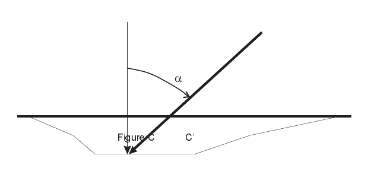

# Chapter 4 — Calculation Method

## Basis for Analysis

The analytical techniques used by EDCRASH to calculate the results are the same as previous CRASH programs, which are well documented. For this reason, the following discussion speaks only to the general analytical approach. For a detailed description of the procedures and algorithms, the interested reader is referred to the EDCRASH Training Manual [15] and EDCRASH Source Code [9]. The applications and limitations of CRASH are also described in the technical literature [19]. Several other references are listed in the References section at the end of this manual.

All three accident phases are analyzed by EDCRASH. These are the pre-impact phase, impact phase and the impact-to-rest phase. The general methods used to analyze each phase are described below.

### Impact Phase

This phase of analysis includes all of the dynamics associated with inter-vehicle contact. The major criterion is the delta-V (velocity change), that is, the reduction (or increase) in vehicle velocity directly attributable to the force of impact. The approach used depends directly upon the angle of impact (specifically, the included angle between the pre-impact velocity vectors).

If the included angle between the pre-impact velocity vectors is equal to or less than 10 degrees, the impact is termed *collinear* and the damage-based solution is used. The impact is also treated as *collinear* when the velocity vectors are within 10 degrees of being anti-parallel (i.e., the included angle is greater than or equal to 170 degrees) — a nearly head-on configuration — and whenever either vehicle is a fixed barrier. In all other cases the impact is termed *oblique* and the linear momentum solution is used.

> **NOTE:** When scene data are not entered, the damage-based solution is used, regardless of the angle of impact, and the results available are limited to the delta-V; impact velocity cannot be computed.

#### Collinear Impact

The solution for collinear impacts is a semi-empirical analysis which compares the damage produced during the subject impact with damage produced during impacts of known (measured) delta-V. The delta-V (and impact force) are assumed to be linearly proportional to crush depth. Stated another way, this is simply Hooke's Law applied to vehicles.

The damage-based analysis is not based on the conservation of energy. The fact that the damage-based analysis is not dependent on the conservation of energy is very important: it allows for an independent check on the validity of the results (see Messages). Rather, the solution is based on Newton's second law, $F = ma$.

Empirical coefficients determine the spring rate of the vehicle exterior. The spring rate, $k$, and deformation, $\delta$, are multiplied to yield the summation of external forces on each vehicle mass, $m$. Based on Newton's second law, the equations for both vehicles are (assuming tire forces are negligible):

$$\Sigma F_1 = k_1 \delta_1 = m_1 a_1$$

and

$$\Sigma F_2 = k_2 \delta_2 = m_2 a_2$$

Because $\Sigma F_1 = \Sigma F_2$, the above equations can be combined into the following differential equation:

$$\frac{m_1 m_2}{m_1 + m_2}\,\ddot{\delta} + \frac{k_1 k_2}{k_1 + k_2}\,\delta = 0$$

The problem has been reduced to a single mass system with two springs in series. The solution to this differential equation is

$$\delta = A \sin(\omega t) + B \cos(\omega t)$$

$$\dot{\delta} = \omega A \cos(\omega t) - \omega B \sin(\omega t)$$

where

$$\omega = \sqrt{\frac{k_1 k_2 / (k_1 + k_2)}{m_1 m_2 / (m_1 + m_2)}}$$

This is a boundary value problem with the following initial conditions. At $t = 0$:

$$\delta = 0$$

$$\dot{\delta} = \dot{\delta}_1 - \dot{\delta}_2 = V_{Closing}$$

The first condition states that at the instant of initial contact there is zero deformation, while the second condition states that the rate of initial deformation is equal to the closing velocity.

By expressing the energy stored in each spring as $E = k\delta^2/2$, the equation for the system impulse, $I$, can be written as:

$$\vec{I} = \sqrt{2\,(E_1 + E_2)\,\frac{m_1 m_2}{m_1 + m_2}}$$

Once we have the system impulse, it is a simple matter to compute the delta-V for each vehicle:

$$\Delta \vec{V}_1 = \frac{\vec{I}}{m_1}$$

and

$$\Delta \vec{V}_2 = \frac{\vec{I}}{m_2}$$

The spring rate, $k$, is defined by two empirical coefficients, A and B. These coefficients are derived from barrier crash tests. The A coefficient defines the force per inch of damage width necessary to initiate damage (i.e., if the force is less than A, no damage will occur). The B coefficient defines the spring rate; it determines how much force is required per inch of crush depth per inch of damage width. Default A and B coefficients are assigned when you choose a vehicle. Note the stiffness values are different for front, rear and side impacts. The third character of the CDC determines which coefficients are used. The default coefficients may be changed during Event mode.

Damage-based results are generally improved when the default coefficients are replaced by actual A and B coefficients derived from a crash test. Reference 25 contains A and B coefficients from crash tests for approximately 1500 vehicles.

Two modifications are incorporated into the above analysis to make it generally applicable to motor vehicle collisions. For the case of non-perpendicular crush, the energy stored in the spring ($k\delta^2/2$) is increased by the value of $1 + \tan^2(\alpha)$, where $\alpha$ is the angle between the PDOF and a line perpendicular to the surface (see Figure 4-1). This *energy magnification factor* accounts for the increased distance, $C'$, through which the crush force acts when compared with the measured crush, $C$. The factor is not allowed to increase beyond a value of 2.0 (note the tangent increases to infinity as the angle approaches 90 degrees).

*Figure 4-1: Energy Magnification Factor.*

The second modification factor is called the *mass reduction factor*, $\gamma$,

$$\gamma = \frac{r_{gy}^2}{r_{gy}^2 + h^2}$$

where $r_{gy}$ is the vehicle's radius of gyration and $h$ is the moment (torque) arm caused by the impulse acting in the direction of the PDOF about the center of gravity. The vehicle mass is multiplied by the mass reduction factor in the impulse equation (described earlier) to account for the fraction of the total damage energy which is used to create the angular kinetic energy at separation.

The mass reduction factor is equal to 1.0 for central impact (i.e., an impact in which the PDOF acts through the vehicle's CG). It is always less than 1 for non-central impacts. As a consequence of this fact, a non-central impact always results in a lower delta-V than a central impact for the same damage profile and PDOF.

The damage-based analysis described above is always performed. It provides more than just the delta-V. The additional information includes the energy absorbed by impact and the Magnitude of Principal Force. The user should note that, even if the impact velocity is based on the delta-V computed by the momentum solution, the results for impact energy and force are still based on the damage data.

#### Oblique Impact

The momentum solution of oblique impacts is well documented in the literature. The law of Conservation of Linear Momentum simply requires the pre-impact system momentum to be equal to the post-impact system momentum,

$$m_1 \vec{V}_{1,Impact} + m_2 \vec{V}_{2,Impact} = m_1 \vec{V}_{1,Separation} + m_2 \vec{V}_{2,Separation}$$

where:

- $m_1$ = mass of vehicle 1
- $m_2$ = mass of vehicle 2
- $\vec{V}_1$ = velocity of vehicle 1 at impact and separation
- $\vec{V}_2$ = velocity of vehicle 2 at impact and separation

### Impact-To-Rest Phase

EDCRASH allows the user to analyze accidents with many types of post-impact vehicle trajectories. This is a valuable feature because most vehicles do not travel along a simple, straight-line path from impact to rest. Rather, the typical vehicle rotates and may travel a somewhat curved path during its post-impact trajectory. An accurate analysis of the impact-to-rest phase is essential. Together with the velocity change, it determines the impact velocity.

#### Straight-line Rollout (without rotation)

The simplest post-impact trajectory is one defined by a straight line between the impact and rest positions, wherein the vehicle is redirected by impact but does not spin out, or rotate, during the actual impact-to-rest phase. In this case, the separation velocity is determined by the energy dissipated by the vehicle during its movement between impact and rest positions. For this case, the traditional formula applies,

$$V_{Separation} = \sqrt{2\,g\,f\,S}$$

where:

- $V_{Separation}$ = total separation linear velocity (in/sec)
- $g$ = acceleration of gravity (in/sec²)
- $f$ = deceleration or drag factor (G-units)
- $S$ = path length (in)

#### Rotating/Lateral Skidding

For the case where the vehicle spins and/or slides sideways (laterally), additional factors must be considered. For example, consider the fact that while the vehicle's motion is in the same direction as its heading, the tires might be rolling — with the associated resistance to motion. But after the vehicle has rotated 90 degrees, the tires are sliding sideways — with the resistance associated with locked-wheel braking.

The above observation is extremely significant in the final outcome because the vehicle is not slowing (decelerating) at a constant rate and the traditional energy formula no longer applies. Rather than the one-line formula associated with straight-line deceleration, the solution requires five to ten pages of analytical development. The procedure was initially described by Marquard and refined by McHenry [1,2,16]. The basis of the analysis is the simple concept that a vehicle which both slides and rotates a given amount prior to coming to rest must have sufficient time to do both, and that the two phenomena do not occur simultaneously, but rather occur in two somewhat distinct phases.

Only in the case of rotating/lateral skidding can a vehicle have a non-zero separation angular velocity.

#### Rollout

It is not unusual for a vehicle at separation to undergo a rotating/lateral skidding phase followed by a short distance of pure rollout, during which no rotating or lateral skidding occurs. This is the case when a spinning vehicle slows and its tires catch, aligning itself with its direction of (linear) motion. If this occurs, the vehicle may simply roll a few more feet. In this case, the point where the end of rotation (EOR) occurs must be documented, and the skidding and rollout phases are analyzed separately.

#### Curved Path (with or without rotation)

It is also common for a vehicle to travel a curved path between impact and rest positions. Two features of this condition are significant: the path length is longer, and the separation angle is different. Both conditions can play a major role in the results. The increase in path length results in greater energy dissipation (higher separation velocity), while the change in departure angle affects the direction of the post-impact velocity vector.

> **NOTE:** The effect of path curvature on the angle of the separation velocity vector can be particularly important for the momentum analysis.

#### Trajectory Simulation Analysis

The above procedures describe how EDCRASH calculates linear and angular separation velocities. These velocities can be supplied as the initial conditions for a simulation analysis (which, by definition, will compute the rest conditions). If the initial conditions (separation velocities and departure angle) are correct, the simulated vehicle path should begin from the impact position, cross through the user-entered point on curve and end of rotation (if entered), and stop at the user-entered rest position.

At the user's request (see Input, Calculation Options), the trajectory simulation will perform this confirming analysis. The analysis is a simplified 3-degree-of-freedom simulation which models the forces and resulting motion of the vehicle throughout the separation-to-rest phase. The simulation assumes all forces are applied to the vehicle as shear forces generated at the tire-road interface (i.e., aerodynamic forces are neglected). Cornering stiffness tire data are used in these calculations. Since wheel spin degrees of freedom are neglected, the simulation requires that the braking force at each wheel be constant throughout the impact-to-rest phase. Steer angles are allowed, but must be held constant.

The simulation is performed up to five times for each vehicle (the maximum number of runs is user-editable; see Calculation Options, Simulation Convergence Criteria). After each run, the simulated path is compared to the user-entered point on curve, end of rotation, and rest positions. Individual error values are computed for each path location (rest, end of rotation, and point on curve). If any of the errors is greater than the allowable error (see Input, Calculation Options), the simulation has failed to converge (i.e., the simulated path is not suitably close to the actual path). The initial velocities and separation angle are then modified in a manner intended to improve the results (i.e., to reduce the previous errors), and another simulation is attempted. After the allowed number of attempts, if the errors are not acceptably small the simulation is terminated.

EDCRASH will use the velocities which produced the smallest total weighted error sum during the simulation (if the simulation converged, the velocities which produced convergence are used). The convergence criteria associated with each path location are displayed in the Program Data output report.

The trajectory simulation can affect your results in two important ways. First, it might alter the separation velocities. Second, it might alter the separation angle. Combined, these alterations can have a significant influence on the results. Always compare your results with and without using the trajectory simulation option. Be suspicious whenever the results differ by a substantial amount [10].

## Assumptions

In order to provide a useful analysis without becoming burdensome and overly complex, EDCRASH makes several simplifying assumptions. If the user is to use EDCRASH properly, it is important that these assumptions and their consequences be understood. In some cases, data which violate these assumptions will cause a fatal error, along with a message indicating the reason for the error. In other cases, the error is not with the data but with the use of the program under conditions which violate the assumptions inherent to the computations. EDCRASH will issue results which may not be valid for the circumstances of the accident.

Before using EDCRASH, be sure your accident is within the scope of the program analysis defined by the following assumptions:

### 3 Degrees Of Freedom

EDCRASH assumes the accident occurred on a flat, horizontal surface. Effects of the suspension are neglected, as are load transfers due to deceleration. If the vehicle drives into a ditch or over a cliff, the results are questionable.

### Simplified Post-impact Trajectory

Although a significantly complex analysis of the impact-to-rest phase is performed, which can even include a simulation of the predicted response, EDCRASH still assumes the vehicle is not under the control of its driver. The specified steering and braking conditions must be constant throughout the impact-to-rest phase of the accident. The results are questionable if the driver applied the accelerator or steered back and forth.

### Linear Exterior Crush Stiffness

The damage analysis assumes there is a linear relationship between crush and the force which caused it.

Because of improvements in the algorithm, EDCRASH does not require the vehicle's exterior to be homogeneous. However, the analysis does not allow for variation in vertical crush depth. Therefore, crush depth involving override damage must be associated with the proper stiffness values.

### Common Velocity Assumption

For the damage-based analysis, EDCRASH assumes the earth-fixed velocities of the vehicles' shared damage centroid reach a common velocity. Therefore, accidents such as sideswipes cannot be handled.

This assumption is required by the boundary conditions which provide the solution to the differential equation describing the impact (see Calculation Method — Collinear Impact).

The common velocity check is a procedure which compares the separation conditions (see Warning Messages).

> **NOTE:** In a damage-only analysis, the common velocity check cannot be performed (there are no scene data). Therefore, it is up to the user to ensure (via some other means) a common velocity was achieved during impact.

### Location of the Impulse Center

The default location for the impulse is defined by the point in the damage profile where the summation of forces and moments is equal to zero (i.e., the forces in each crush zone are balanced).

> **NOTE:** For a homogeneous damage region, this location is the centroid of the damage area.

The impulse center may be relocated using the Event Editor, Damage Profile dialog.

### Instantaneous Impact

The impact actually occurs over a finite time interval, usually lasting slightly over 1/10 of a second. The heading angles and instantaneous force between the vehicles change during this time interval. EDCRASH assumes the separation heading angles are the same as the impact heading angles. Since the direction of the force between the vehicles is changing, EDCRASH replaces this changing direction of force with a single Principal Direction of Force (PDOF), which is actually the direction of the impulse.

### Negligible Tire Forces During Impact

During impact, there are two forces acting on the vehicles. These are the impulsive force between the vehicles and tire forces acting separately on each vehicle. Like all momentum solutions, EDCRASH assumes the tire forces are insignificant compared to the impulsive force. This is a good assumption with three possible exceptions: minor impacts, sideswipes and impacts involving large trucks. The reason for the exceptions is that the forces acting at the tires can approach the magnitude of the impulsive force.

### Fiala Tire Model

A trajectory simulation requires the calculation of longitudinal and lateral forces at each tire. EDCRASH uses the Fiala [17] tire model which computes the lateral force from cornering stiffness (a measured tire property), the vertical tire force and the current tire slip angle. This model assumes the cornering stiffness does not change with changes in vertical load. The application of the Fiala model to a wheel rolling on its rim has not been documented.

---

*Previous: [Chapter 3 — Program Output](03-program-output.md) · Next: [Chapter 5 — EDCRASH Tutorial](05-tutorial.md)*

<!-- NAV -->

---

← Previous: [Chapter 3 — EDCRASH Program Output](03-program-output.md)  |  [Index](README.md)  |  Next: [Chapter 5 — EDCRASH Tutorial](05-tutorial.md) →

<!-- /NAV -->
