# Chapter 5 — EDCRASH Tutorial

This tutorial illustrates a very common use of EDCRASH, that is, to estimate the vehicle impact velocities from accident scene and vehicle damage measurements. This tutorial is continued in the EDSMAC(4) Tutorial, wherein the initial vehicle velocities are used to simulate the crash. You may wish to review that tutorial after finishing this one.

Like all EDCRASH events, the procedure involves the following basic steps:

- Create the vehicle(s)
- Create the environment
- Execute the EDCRASH event
- Review the EDCRASH output reports

This basic procedure is described in detail in this tutorial.

> **NOTE:** It is assumed that HVE-2D or HVE is up and running, and that the user is familiar with its basic features, such as using dialogs and viewers, as well as the Editors. The purpose of this tutorial is to illustrate those features while setting up and executing an EDCRASH event.

## Getting Started

As in other tutorials, before we get started, let's set the user options so we're all starting on the same page.

> **NOTE:** In HVE-2D, all options simply affect the appearance in a viewer during Event or Playback mode. However, in HVE, AutoPosition affects the data used in the analysis. For example, if AutoPosition is On, the vehicle position conforms to the local surface; otherwise, the position is set by the Position/Velocity dialog. Obviously, the resulting difference in initial conditions could substantially change the event.

> **NOTE:** Some of the following options are "toggles" that switch between two different modes. Make sure these options are set correctly.

To set the initial user options, choose the following from the Options Menu:

- ON: Show Key Results
- OFF: Show Axes
- OFF: Show Contacts
- OFF: Show Velocity Vectors
- ON: Show Skidmarks
- OFF: Show Targets
- ON: AutoPosition
- Units equals S.I.

  > **NOTE:** As we'll see when we create our environment, our EDCRASH Tutorial studies a crash that took place in Australia; thus we require metric units.

- Render Options:
  - Show Humans as Actual
  - Show Vehicles as Actual
  - Phong Render Method
  - Complexity equals Object
  - Render Quality equals 5
  - Texture Quality equals 1
  - Anti-aliasing equals 1

The remaining options will automatically initialize to their default conditions. We're now ready to proceed with the tutorial.

## Creating the Vehicles

Let's add the vehicles to our case. The first vehicle is a white, 1996 Ford Escort 2-Door Hatchback; the second vehicle is a dark red 1995 Nissan Sentra 4-Door Sedan. Let's add the first vehicle:

1. If the Vehicle Editor is not the current editor, choose Vehicle Mode. The Vehicle Editor is displayed.
2. Click Add New Object. The Vehicle Information dialog is displayed. The Vehicle Information dialog allows the user to select the basic vehicle attributes according to Type, Make, Model, Year and Body Style.

   > **NOTE:** The Vehicle Information dialog also allows you to edit the Driver Location, Engine Location, Number of Axles and Drive Axle(s). These options are already assigned for each vehicle and need not be edited in our tutorial.

3. Using the option buttons, click each button to choose the following vehicle from the database:
   - Type = Passenger Car
   - Make = Ford
   - Model = Escort
   - Year = 1991–1996
   - Body Style = 2-Door Hatchback
   - Source Database = Tutorial.db
   - Driver Location = Right
4. Click OK to add Ford Escort to the Active Vehicles list.

Next, let's add the Nissan Sentra:

1. Click Add New Object to show the Vehicle Information dialog.
2. Using the option buttons, click each button to choose the following vehicle from the database:
   - Type = Passenger Car
   - Make = Nissan
   - Model = Sentra
   - Year = 1995–1999
   - Body Style = 4-Door
   - Source Database = Tutorial.db
   - Driver Location = Right
3. Click OK to add Nissan Sentra to the Active Vehicles list.

We now have the vehicles required for our study.

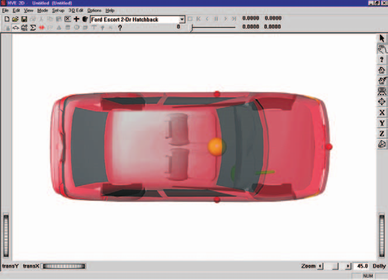

*Figure 5-1: Ford Escort (above) and Nissan Sentra (below).*

### Editing the Vehicles

Next, we'll edit the vehicles to change their color and weight. In addition, we'll change the stiffness of the Nissan Sentra, using values derived from our initial reconstruction analysis.

Start by changing the color of the Ford Escort:

1. Click on Ford Escort in the Active Vehicles list, making it the current vehicle. The Ford Escort is now displayed in the Vehicle Editor.
2. Click on the CG and choose Color. The Vehicle Color dialog is displayed, showing the vehicle's current color (the small black square, or *hot spot*, in the color wheel) and intensity (the arrow in the intensity slider). Click on the hot spot and drag it to the center of the blue area. To lighten the vehicle, click on the intensity slider and drag it to the far right end.

   > **NOTE:** The color chip on the left shows the current color.

3. When the color is to your liking, close the dialog by clicking the close button on the upper right corner of the dialog.

   > **NOTE:** The vehicle's apparent color may be slightly misleading because the vehicle is translucent when displayed in the Vehicle Editor. The actual color will be used whenever the vehicle is displayed during Event and Playback mode.

*Figure 5-2: Vehicle Color dialog, used for assigning the vehicle color.*

Next, let's change the Escort's weight. Perform the following steps:

1. Click on the CG and choose Inertias. The Inertias dialog is displayed, and we're ready to change the vehicle's weight.

   > **NOTE:** The vehicle's roll, pitch and yaw moments of inertia are also displayed in the Inertias dialog; however, only the yaw inertia is used by the 3-DOF EDCRASH calculations.

2. In the Total Weight text field, replace the existing weight, 10279 Newtons, with the measured value, 11032 Newtons.

   > **NOTE:** The weight is entered as a force (Newtons). Mass units (kg) are calculated and displayed.

   > **NOTE:** The dialog might display 10279.761, or a similar number, because the weight is actually divided by the current gravity constant and stored as mass. Extra precision results when the mass is multiplied by the current gravity constant and redisplayed.

3. If not already selected, click the checkbox for Auto Update Inertia When Weight Changes.
4. Press OK to accept the weight value and update the Total Yaw Inertia of the vehicle.

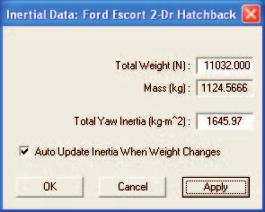

*Figure 5-3: Vehicle Inertias dialog.*

The Ford Escort is now ready for use in our tutorial. Using the viewer thumb wheels or mouse, zoom in or out on the vehicle or translate the vehicle in the viewer X or Y directions.

Now, let's change the color, weight and stiffness of the Nissan Sentra:

1. Click on Nissan Sentra in the Active Vehicles list, making it the current vehicle. The Nissan Sentra is now displayed in the Vehicle Editor.
2. Click on the CG and choose Color. The Vehicle Color dialog is displayed. The vehicle's color is fine, but we need to darken it. To darken the vehicle, click on the intensity slider and drag it to the middle of the range.
3. When the color is to your liking, close the dialog by clicking the close button on the upper right corner of the dialog.

Next, let's change the Nissan's weight:

1. Click on the CG and choose Inertias. The Inertias dialog is displayed.
2. In the Total Weight text field, replace the existing weight, 10858 Newtons, with the measured value, 11282 Newtons.

   > **NOTE:** Again, the value displayed in the dialog may contain extra precision, for the reasons explained earlier.

3. If not already selected, click the checkbox for Auto Update Inertia When Weight Changes.
4. Press OK to accept the weight value and update the Total Yaw Inertia of the vehicle.

Finally, let's change the stiffness on the right side of the vehicle. An SAE moving barrier crash test (SAE J972) revealed the A and B stiffness coefficients for the side of the vehicle were 245 N/cm and 50 N/cm², respectively. Let's enter the new values:

1. Click on the right side surface icon (red sphere). The CG to Right Side dialog is displayed.
2. Click Stiffness. The Stiffness Coefficients dialog for the right side surface is displayed.

   > **NOTE:** The Vehicle Editor assumes the stiffness is uniform across the right side of the vehicle. If desired, we can add hard spots using the Damage Profile dialog during Event mode.

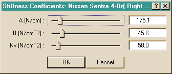

*Figure 5-4: Vehicle Stiffness dialog, used for editing the current A, B and Kv stiffness coefficients for the current surface. EDCRASH allows different stiffness values for the front, back and sides. By default, the stiffness is uniform on any side; hard spots may be assigned using the Event Editor.*

To edit the current A and B stiffness coefficients:

1. Replace the current value in the A field with the calculated value, 245 N/cm. Then enter a new value for B, 50 N/cm².
2. Click OK to update the stiffness coefficients.
3. Click OK again to remove the CG to Right Side dialog.

The Nissan Sentra is now ready for use in our tutorial. Using the viewer thumb wheels, pan, zoom and look at the vehicle. Note that, in HVE, the thumb wheels rotate the vehicle about the viewer axes, not the vehicle axes.

Now we have both vehicles ready for our study.

## Saving the Case

Now that we've created vehicles for our case, let's save the case file.

1. Click on the File menu and choose Save. The Save-as File Selection dialog is displayed.

   > **NOTE:** The Save-as dialog is displayed because the case has not been saved previously, so we need to enter a filename.

2. Place the mouse cursor in the Case Title text field and enter *EDCRASH Tutorial, Visibility Study*.

   > **NOTE:** The Case Title is displayed as a heading on all printed output reports.

3. Place the mouse cursor in the Filename text field and enter *EdcrashTutorial*.
4. Click SAVE. The current case data are saved in the /supportFiles/case subdirectory.

   > **NOTE:** Saving the file occasionally is a highly recommended practice.

## Creating the Environment

Now, let's add the environment:

1. Choose Environment Mode. The Environment Editor is displayed.
2. Click on Add New Object. The Environment Information dialog is displayed.
3. Using the Location Database combo box, choose Sydney, NSW, Australia. The latitude (35.53.00S), longitude (151.10.00E) and GMT, hours from the prime meridian (+10) are displayed for the selected location.

   > **NOTE:** If Sydney were not included in your Location Database, you could add it simply by typing in the new location name, latitude, longitude and GMT.

4. Enter a name for the accident site, *Blind Intersection*.
5. Edit the date and time of the incident we are studying, 7/23/99 and 1330, respectively.
6. Edit the angle from true north to the earth-fixed X axis in our environment, −10 degrees.

   > **NOTE:** The Latitude, Longitude, GMT, Date/Time and angle from true north are used to position the sun in the scene. This is, of course, important because the sun is the primary light source for the scene.

7. To add the environment geometry file to our case, click on Open. The Environment Geometry File Selection dialog is displayed.
8. Click on the Files of Type option list and choose HVE Geometry Files (*.h3d). A list of environment geometry files using the .h3d file format is displayed in a list box.
9. Double-click on EdcrashEdsmacTutorial_2D.h3d to choose the environment file and remove the dialog.

   > **NOTE:** HVE users should select the environment file named EdcrashEdsmacTutorial.h3d.

10. Press OK.

The selected environment is added to our case and displayed in the Environment Viewer. Use the viewer thumb wheels to view the scene.

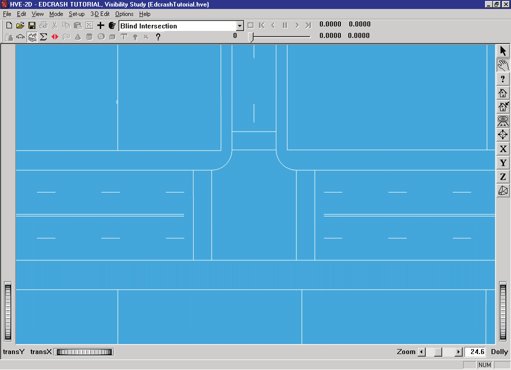

*Figure 5-5: Appearance of the 2-D environment geometry used for the EDCRASH tutorial.*

## Creating the Event

As mentioned at the outset, this EDCRASH tutorial describes a common application of EDCRASH, that is, to determine pre-impact vehicle velocities. This can be accomplished only when scene data (vehicle positions at impact and rest) are known. Fortunately, we have that data, owing to a splendid at-scene investigation. In addition, vehicle damage profiles are available from vehicle inspections.

To create the event, perform the following steps:

1. Choose Event Mode. The Event Editor is displayed.
2. Click on Add New Object. The Event Information dialog is displayed.
3. Select Ford Escort and Nissan Sentra from the Active Vehicles list. The vehicles are added to the Event Humans and Vehicles list.
4. Select EDCRASH from the Calculation Method options list.
5. Enter a name for the event, *Visibility Study*.

   > **NOTE:** The name of the calculation method will automatically be appended to the event name, thus the complete event name will become "EDCRASH, Visibility Study."

6. Press OK to display the Event Editor.

Now we're ready to set up the event. Event set-up for EDCRASH involves the following three steps:

- **Position the Vehicles** — The minimum required vehicle positions are Impact and Rest. Vehicle positions at Begin Braking, Point-on-curve (POC) and End-of-rotation (EOR) are optional positions that may be assigned for each vehicle.

  > **NOTE:** If Impact and Rest positions are not assigned for both vehicles, impact speeds cannot be computed — it is physically impossible!

- **Assign Wheel Data** — Wheel data (% Wheel Lock-up, Steer Angle and Pre-impact Wheel Lock-up) are required whenever scene data are supplied.
- **Assign Damage Profiles** — Vehicle damage profiles (damage Width, Depth and Offset) are optional for oblique collisions, but required for collinear collisions, where the momentum analysis is too sensitive to the scene data to be reliable.

  > **NOTE:** Even though damage profiles are not required for oblique collisions, they provide an excellent confirming analysis.

### Positioning the Ford Escort

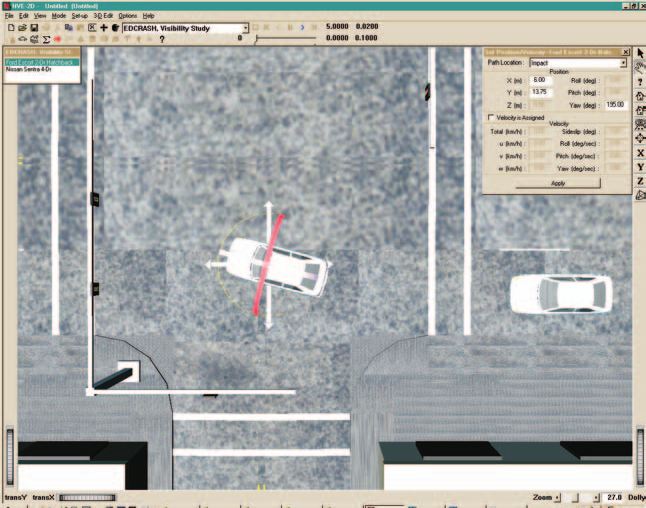

*Figure 5-6: Positioning the Ford Escort using the Event Editor.*

Let's set up the Ford Escort. It skidded for a short distance before impact. Let's start by entering its Begin Braking position:

1. Select Ford Escort from the Event Humans & Vehicles list.
2. Click Set-up from the menu bar and choose Position/Velocity. The Impact position for the Escort is displayed at the earth-fixed origin.
3. Click on the Position/Velocity dialog's Path Location option list and choose Begin Braking. The Escort Begin Braking position is displayed at the earth-fixed origin.
4. Click on the vehicle's X-Y manipulator, wait for it to turn bright yellow (indicating it has been selected), and drag it to its begin braking position, X = 18.0 m, Y = 15.0 m. In the Yaw field of the Position/Velocity dialog, replace the existing value with the correct heading angle for the start of braking, 180 degrees.

   > **NOTE:** To select the X-Y manipulator, the viewer must be in Pick mode, as indicated by the highlighted arrow in the upper right corner of the viewer.

   > **NOTE:** If necessary, adjust the viewer by panning and dollying back (using the viewer controls) until you can see the entire intersection.

   > **NOTE:** Be sure to keep the mouse button depressed while you drag the manipulators.

   > **NOTE:** If you can't position the vehicle at the exact coordinates, you can simply enter the coordinates in the dialog (remember to press \<Enter\> after entering the data; otherwise the new values will not be used!).

Now let's position the Escort at its impact position:

1. Click on the Position/Velocity dialog's Path Location option list and choose Impact. The Escort impact position is displayed at the earth-fixed origin.
2. Click on the vehicle's X-Y manipulator, wait for it to turn bright yellow, and drag it to its impact position, X = 6.0 m, Y = 13.75 m. In the Yaw field of the Position/Velocity dialog, replace the existing value with the impact heading angle, 195.0 degrees.

Now, enter the sideslip angle at impact:

1. Click the Velocity Is Assigned check box to allow velocity entries.
2. Enter the impact sideslip angle, −4.35 degrees.

   > **NOTE:** Although you could enter an impact velocity, EDCRASH would not use it; after all, it is EDCRASH's role to calculate impact speed!

Next, let's position the Escort at its rest position:

1. Click on the Path Location option list and choose Final/Rest. The Escort is displayed at the earth-fixed origin.
2. Click on the vehicle's X-Y manipulator, wait for it to turn bright yellow, and drag it to its rest position, X = 3.5 m, Y = 12.75 m. In the Yaw field of the Position/Velocity dialog, replace the existing value with the rest heading angle, 230 degrees.

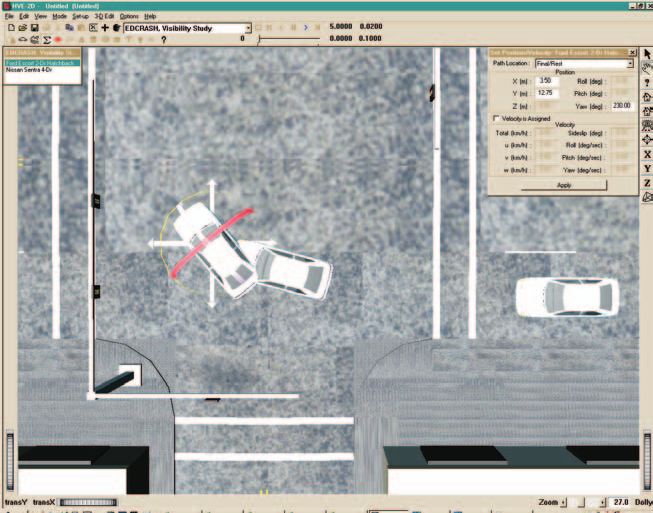

*Figure 5-7: View of the scene after the Ford Escort has been positioned at its Begin Braking, Impact and Rest positions.*

> **NOTE:** In HVE and HVE-2D, +230 degrees is not the same as −130 degrees because the relative magnitude between two angles implies the rotation direction! For example, if the impact heading angle is 180 degrees and the rest heading angle is 230 degrees, the change in heading angle between impact and rest is +50 degrees clockwise; if the rest heading angle is −130 degrees, the change in heading angle is −310 degrees and the direction of rotation is counter-clockwise.

> **NOTE:** If you can't position the vehicle at the exact coordinates, simply enter them in the dialog (in fact, it's often easier to directly enter the coordinates using the dialog).

### Driver Controls for the Ford Escort

Next, let's enter the driver controls for the Ford Escort:

1. Choose Set-up from the menu bar, select Driver Controls. The Driver Controls dialog is displayed.
2. The Wheel Data page is displayed for the Ford Escort.

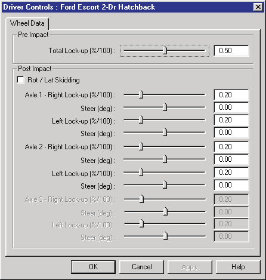

*Figure 5-8: Wheel Data dialog for the Ford Escort.*

According to our vehicle inspection, both front wheels were locked after impact by damage, while the rear wheels were free turning. Let's enter the appropriate values, first for the front wheels:

1. Place the cursor in the Post Impact Percent Lock-up field for the right front wheel and enter 1.0. Enter the same value, 1.0, for the left front wheel.

Now the rear wheels:

1. Place the cursor in the Percent Lock-up field for the right rear wheel and enter 0.01 ($0.01/\mu_{slide}$). Enter the same value, 0.01, for the left rear wheel.

**Table 5-1: Typical Wheel Lock-up Values [20]**

| Wheel Condition | Typical Range |
|---|---|
| No Damage, Free-rolling | $0.01/\mu_{slide}$ to $0.02/\mu_{slide}$ |
| No Damage, Drive Wheel | $0.10/\mu_{slide}$ to $0.15/\mu_{slide}$ |
| Damage | 0.0 to 1.0 |

> **NOTE:** For undamaged wheels, be sure to divide by the slide coefficient of friction, $\mu_{slide}$, before entering the value for each wheel.

Next, let's enter the Percent Lock-up during pre-impact braking. Because the tires left skidmarks, we'll assume 100 percent braking:

1. Place the text cursor in the Pre-impact Total Wheel Lock-up field and enter 1.0.

Finally, noting the vehicle rotated and skidded after impact, let's select that EDCRASH option:

1. Click on the Rot/Lat Skid check box.
2. Press OK to accept the wheel data.

The wheel data have now been assigned for the Ford Escort.

### Damage Profile for the Ford Escort

Let's conclude event set-up for the Escort by supplying a damage profile:

1. Choose Set-up from the menu bar, select Damage Profiles. The Damage Profile dialog is displayed for the Ford Escort.

The Damage Profile dialog initially contains *None*, waiting for us to assign a CDC (Collision Deformation Classification; see HVE User's Manual):

1. Replace *None* in the CDC field with **11FDEW3** and click Apply. The default damage profile is displayed according to the CDC.

Because we actually measured the damage profile during our vehicle inspection, let's enter the measured width, depth and offset:

1. The default damage width, 169.42 cm, and offset, 0.00 cm, are acceptable.

We measured seven crush depths, so we have six crush zones:

1. Click on the Damage Profile Zones option list and change the default value from 3 to 6.
2. Enter the seven crush depths, beginning on the left end of the damage profile, according to Table 5-2.

   > **NOTE:** Remember to press Apply after entering the crush depth values.

**Table 5-2: Crush depths for the front of the Ford Escort 2-Dr Hatchback**

| Crush Depth No. | Crush Depth (cm) |
|---|---|
| 1 | 75.0 |
| 2 | 60.0 |
| 3 | 50.0 |
| 4 | 45.0 |
| 5 | 40.0 |
| 6 | 40.0 |
| 7 | 45.0 |

> **NOTE:** Front and rear crush depths are entered left-to-right.

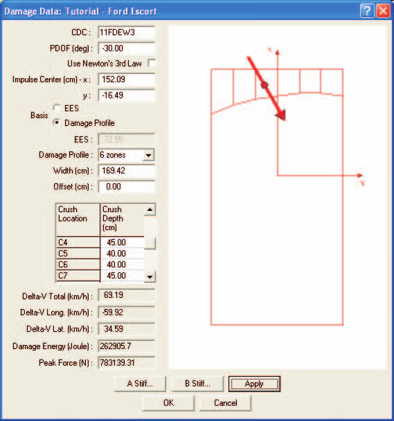

*Figure 5-9: Damage Profile dialog for the Ford Escort.*

3. Press OK to accept the assigned damage profile data.

Event set-up for the Ford Escort is now complete.

### Setting Up the Nissan Sentra

Let's set up the Nissan Sentra. We'll start by assigning its impact and rest positions:

1. Select Nissan Sentra from the Event Editor's Event Humans and Vehicles list.
2. Click Set-up from the menu bar and choose Position/Velocity. The Impact position for the Sentra is displayed at the earth-fixed origin.
3. Click on the vehicle's X-Y manipulator, wait for it to turn bright yellow, and drag it to its impact position, X = 3.5 m, Y = 13.0 m. In the Yaw field of the Position/Velocity dialog, replace the existing value with the heading angle, −90 degrees.

   > **NOTE:** Be sure to keep the mouse button depressed while you drag the manipulators. You may wish to enter the values directly in the Position/Velocity dialog.

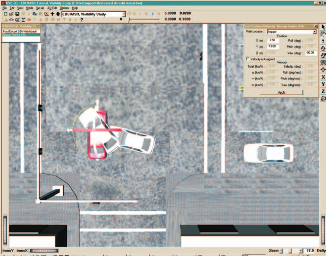

*Figure 5-10: Positioning the Nissan Sentra using the Event Editor. Note the Ford Escort's rest position visually obstructs the positioning of the Nissan Sentra; this visual obstruction does not affect calculations.*

Next, let's position the Nissan at its rest position:

1. Click on the Position/Velocity dialog's Path Location option list and choose Final/Rest. The Sentra's rest position is displayed at the earth-fixed origin.
2. Click on the vehicle's X-Y manipulator, wait for it to turn bright yellow, and drag it to its rest position, X = 0.5 m, Y = 2.25 m. In the Yaw field of the Position/Velocity dialog, replace the existing value with the rest heading angle, 70 degrees.

   > **NOTE:** In HVE and HVE-2D, +70 degrees is not the same as −290 degrees because the relative magnitude between two angles implies the rotation direction!

The Nissan's positions are now established. Let's enter the driver controls. In this case, there are no driver inputs, per se. However, after impact the vehicle coasts to rest, so we need to enter rolling resistances:

1. Choose Set-up from the menu bar and select Driver Controls. The Wheel Data dialog is displayed.

According to our vehicle inspection, all the wheels were free turning (i.e., not locked by damage). Let's enter the appropriate values, first for the front wheels:

1. Accept the default values for Percent Lock-up for Axle 1, Right Side and Left Side, 0.20 ($0.15/\mu_{slide}$).

Now the rear wheels:

1. In the Percent Lock-up field for Axle 2, Right Side, enter 0.01 ($0.01/\mu_{slide}$). Enter the same value, 0.01, for the left rear wheel.

   > **NOTE:** The Nissan is a front wheel drive vehicle, hence the larger front wheel lock-up values; see Table 5-1.

Finally, noting the vehicle rotated and skidded after impact, let's select that EDCRASH option:

1. Click on the Rot/Lat Skid check box.
2. Press OK to accept the wheel data for the Nissan Sentra.

The wheel data have now been assigned for the Nissan Sentra.

### Damage Profile for the Nissan Sentra

Let's conclude event set-up for the Nissan Sentra by supplying a damage profile:

1. Choose Set-up from the menu bar, select Damage Profiles. The Damage Profile dialog is displayed for the Nissan Sentra.
2. Replace *None* in the CDC field with **02RPEW3** and click Apply. The default damage profile is displayed according to the CDC.

Because we actually measured the damage profile during our vehicle inspection, let's enter the measured width, depth and offset:

1. Enter the right side damage width, 220 cm, and offset, −40 cm.

We measured five crush depths along the right side of the Nissan, so we have four crush zones:

1. Click on the Damage Profile Zones option list and change the default value from 3 to 4.
2. Enter the five crush depths along the right side, according to Table 5-3 (remember to press Apply after entering all of the values).

**Table 5-3: Crush depths for the right side of the Nissan Sentra 4-Dr**

| Crush Depth No. | Crush Depth (cm) |
|---|---|
| 1 | 20.0 |
| 2 | 30.0 |
| 3 | 50.0 |
| 4 | 45.0 |
| 5 | 10.0 |

> **NOTE:** Side crush depths are entered rear-to-front.

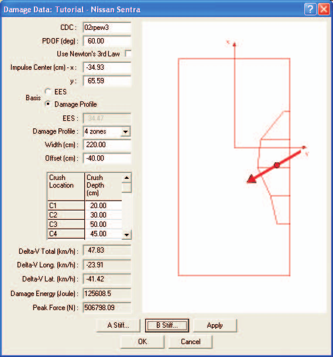

*Figure 5-11: Damage Profile dialog for the Nissan Sentra.*

Note the reported force is 506,798 Newtons. Further, note the force reported for the Ford Escort is 783,139 Newtons. According to Newton's 3rd Law, the forces on both vehicles should be equal.

> **NOTE:** It is quite common for the initially computed forces to be different when side impact is involved because a vehicle's side stiffness varies according to where it was impacted; the wheels are much stiffer than other locations.

The best way to solve this problem is to adjust the stiffness coefficients to equalize the forces. If the damage profile has uniform stiffness, we can quickly estimate the amount of the adjustment by noting the current ratio of the calculated collision forces:

$$\text{force ratio} = \frac{F_{Escort}}{F_{Sentra}} = \frac{783{,}139}{506{,}798} = 1.55$$

But the side of the Nissan does not have a uniform stiffness, and a large portion of the impact force was applied at the right rear wheel. Therefore, we cannot directly use the above method. Let's adjust the stiffness by increasing the A and B coefficients for zone 1, the zone that includes the right rear wheel, using trial and error.

> **NOTE:** The A and B stiffness coefficients are related; when adjusting the stiffness coefficients, always multiply A and B by the same factor!

Let's try a factor of 2.0:

1. Click A Stiffness. The A Stiffness Coefficients dialog is displayed with the default value, 245 N/cm. The adjusted value for our first attempt is 490 (245 × 2).
2. Enter 490.0 for Zone 1.
3. Press OK to accept the new value.

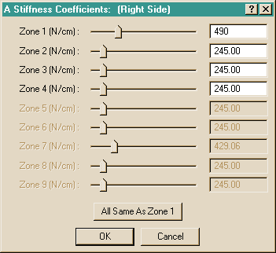

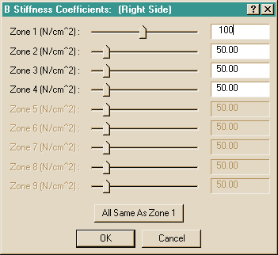

*Figure 5-12: A Stiffness and B Stiffness coefficients dialogs.*

Now, let's adjust the B value:

1. Click B Stiffness. The B Stiffness Coefficients dialog is displayed with the default value, 50 N/cm². The adjusted value for our first attempt is 100.0 (50 × 2).
2. Enter 100.0 for Zone 1.
3. Press OK to accept the new value.

Now, note the current peak force displayed in the Damage Profile dialog. The value is quite a bit too low (again, we want it to equal the value of 783,139 Newtons for the Ford Escort). Try a factor of 5:

1. Click A Stiffness to display the A Stiffness Coefficients dialog, and enter 1225 (245 × 5). Press OK to remove the dialog.
2. Click B Stiffness to display the B Stiffness Coefficients dialog, and enter 250 (50 × 5). Press OK to remove the dialog.

Now the force for the Nissan is quite a bit greater than the force on the Ford. Repeat the process using a factor of 4:

1. Click A Stiffness to display the A Stiffness Coefficients dialog, and enter 980 (245 × 4). Press OK to remove the dialog.
2. Click B Stiffness to display the B Stiffness Coefficients dialog, and enter 200 (50 × 4). Press OK to remove the dialog.

The resulting force on the Nissan is 791,634 Newtons, closely matching the force on the Ford Escort.

1. Press OK to accept the assigned damage profile.

### Checking the PDOFs

It is always a good idea to make sure that the entered impact positions and PDOFs conform to Newton's 3rd Law. According to Newton's 3rd Law, the vehicles' PDOFs must be equal and opposite. When we apply this constraint to our data, we find the following condition must be satisfied:

$$PDOF_1 + \psi_1 = PDOF_2 + \psi_2 \pm 180$$

where $\psi$ = heading angle. Solving for $PDOF_2$, we have:

$$PDOF_2 = PDOF_1 + \psi_1 - \psi_2 \pm 180 = -30 + 195 - (-90) \pm 180 = 75\ \text{deg}$$

But we assigned a CDC of 02RPEW3, which has a default PDOF of 60 degrees. Our calculation above shows that to satisfy Newton's 3rd Law, we must change the PDOF to 75 degrees. In this event, the PDOFs are not opposite. Therefore, we will edit the PDOF:

1. In the PDOF field, replace 60 with 75.
2. Click Apply to accept the change.

   > **NOTE:** If you click on Use Newton's 3rd Law, EDCRASH will make this calculation for you automatically!

Due to the effect of the energy magnification factor, the above change to the PDOF will change the peak force calculated for the Nissan Sentra. The peak force is now 709,760 N for the Nissan Sentra. By comparing this force with the peak force on the Ford Escort, 783,139 N, we find the difference is acceptable, so we are finished setting up the event.

1. Press OK to accept the assigned damage profile.

### Executing the Event

Before we execute the event, let's set up the Key Results windows:

1. If Key Results windows are not displayed, choose Show Key Results from the Options menu.
2. Drag the Key Results windows to a convenient location, where they do not block the view but still allow access to the viewer thumb wheel controls (in case we want to change the view).

Now we're ready to execute the event. Take a moment to set the view using the viewer controls or Set Camera dialog. Now, let's execute the EDCRASH event.

1. Using the Event Controller, press Play to execute the event.

Although nothing appears to happen (i.e., the vehicles don't move), the event has been executed. Unlike simulation calculations, which are repetitive, reconstruction calculations are executed only once, and thus happen very quickly.

> **NOTE:** You may confirm that execution has occurred by checking the results in your Key Results windows.

We have now completed the event.

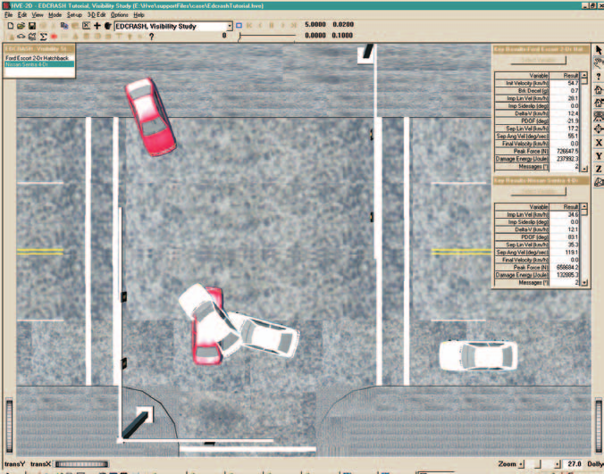

*Figure 5-13: EDCRASH Tutorial event after execution. The Key Results windows show the pre-impact speeds, delta-Vs, and other key information from the analysis.*

## Viewing Results

Now that we have produced our EDCRASH results, let's take a detailed look at them. The Playback Editor is used for reviewing and printing reports for each event in the current case, as well as for producing video output.

EDCRASH produces the following reports:

- **Accident History** — A table of user-entered positions and their respective (calculated) velocities
- **Damage Data** — A table of damage profile coordinates, CDC, PDOF and Delta-V for each vehicle
- **Damage Profiles** — A plan view of the vehicles showing their damage profiles (damage width, depth and midpoint offset)
- **Event Data** — A table of scene data (positions, orientations and velocities)
- **Messages** — A list of messages produced by the current run
- **Momentum Diagrams (Scene and Damage)** — A vector diagram showing the pre-impact and post-impact momentum vectors for each vehicle. The scene-based diagram uses impact velocity calculated from the momentum-based delta-V; the damage-based diagram uses the impact velocity calculated from the damage-based delta-V.
- **Program Data** — A table containing program control information
- **Site Drawing** — A static perspective view of the accident site showing the vehicles at their user-entered positions
- **Vehicle Data** — A series of tables containing the vehicle data used by EDCRASH

To view the output reports, we need to be in Playback mode:

1. Choose Playback Mode. The Playback Editor is displayed.

### Report Windows

The reports listed above are displayed by selecting Report Windows. Each Report Window contains an individual report.

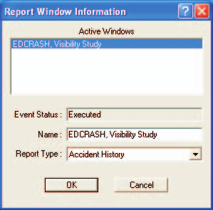

*Figure 5-14: Report Window Information dialog, showing the name of the event(s) in the current case.*

To view the reports produced by the EDCRASH, Visibility Study event, perform the following steps:

1. Click Add New Object. The Report Window Information dialog is displayed and includes a list of the active events (EDCRASH, Visibility Study is the only event in this tutorial). The Report Window Information dialog also includes the user-editable Report Window Name text field and Selected Output option list.
2. Select EDCRASH, Visibility Study from the Active Events list.
3. Click on the Selected Output option list and choose any of the available reports.
4. Press OK to display the report.

The selected report will be displayed in a resizable window. The reports produced for the EDCRASH, Visibility Study event are described below. Each is viewed by the same four steps above, choosing the appropriate report from the Selected Output list.

### Accident History

The EDCRASH Accident History report is the primary output from EDCRASH. This report summarizes the key results for each vehicle, including impact velocity, delta-V for each available calculation method (Damage and Linear Momentum), separation velocity and relative velocity at impact.

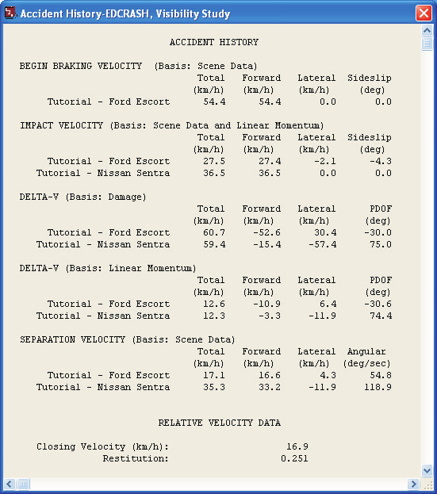

*Figure 5-15: Accident History Report for EDCRASH, Visibility Study event.*

### Damage Data

The Damage Data report provides the user-entered damage profile and other event-related damage data for the current EDCRASH event.

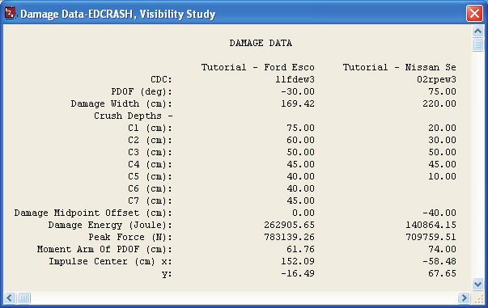

*Figure 5-16: Damage Data Report for EDCRASH, Visibility Study event.*

### Damage Profiles

The Damage Profiles report provides a visual representation of the user-entered damage profile and PDOF for the current EDCRASH event.

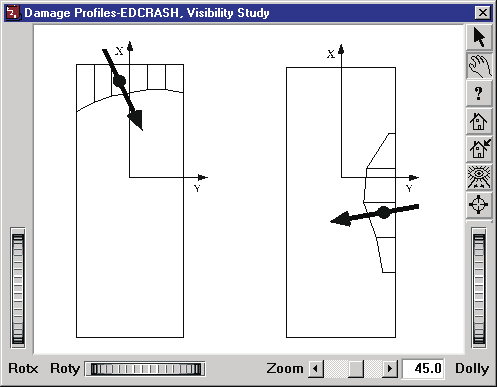

*Figure 5-17: Damage Profiles Report for EDCRASH, Visibility Study event.*

### Event Data

The EDCRASH Event Data report includes all the scene data used for the current EDCRASH event. This scene data also provides the total amount and direction of rotation (clockwise vs counter-clockwise).

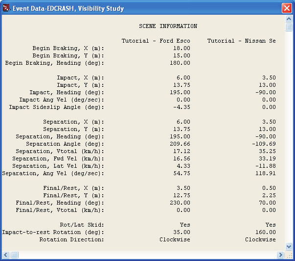

*Figure 5-18: Event Data Report for EDCRASH, Visibility Study event.*

### Messages

The Messages report produced by EDCRASH is one of its most important reports. While simulation programs typically produce very few messages, a reconstruction program has the opportunity to evaluate the consistency of the user-entered scene and damage measurements. Careful review of these messages may show inconsistencies; correcting these inconsistencies may lead to improved results.

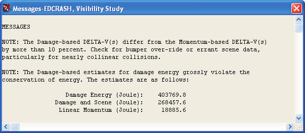

*Figure 5-19: Messages Report for EDCRASH, Visibility Study event.*

### Momentum Diagrams

To view the Momentum Diagram, Scene Data, report, choose Momentum Diagram, Scene from the Selected Output option list.

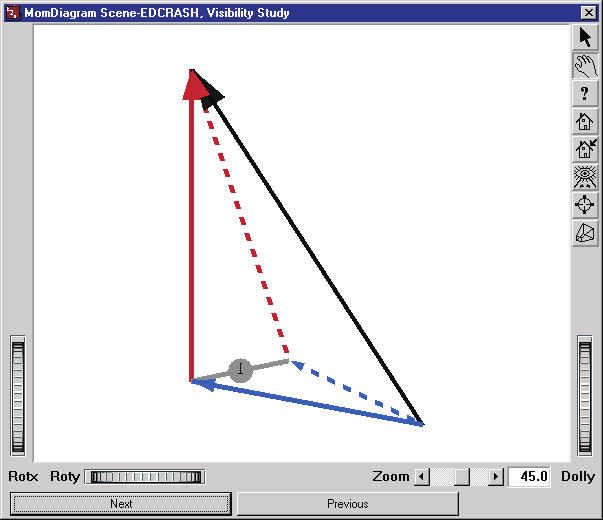

*Figure 5-20: Momentum Diagram Report for EDCRASH, Visibility Study event.*

### Program Data

The EDCRASH Program Data report lists the physics program, in this case EDCRASH, and physics program version number. It also contains parameters used when the Trajectory Simulation option is selected and consistency checks within EDCRASH.

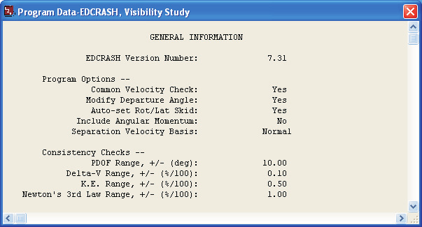

*Figure 5-21: Program Data Report for EDCRASH, Visibility Study event.*

### Site Drawing

The Site Drawing is a static display of the event with the vehicles at their user-entered path positions (Begin Braking, Impact, Point-on-curve, End-of-rotation and Rest).

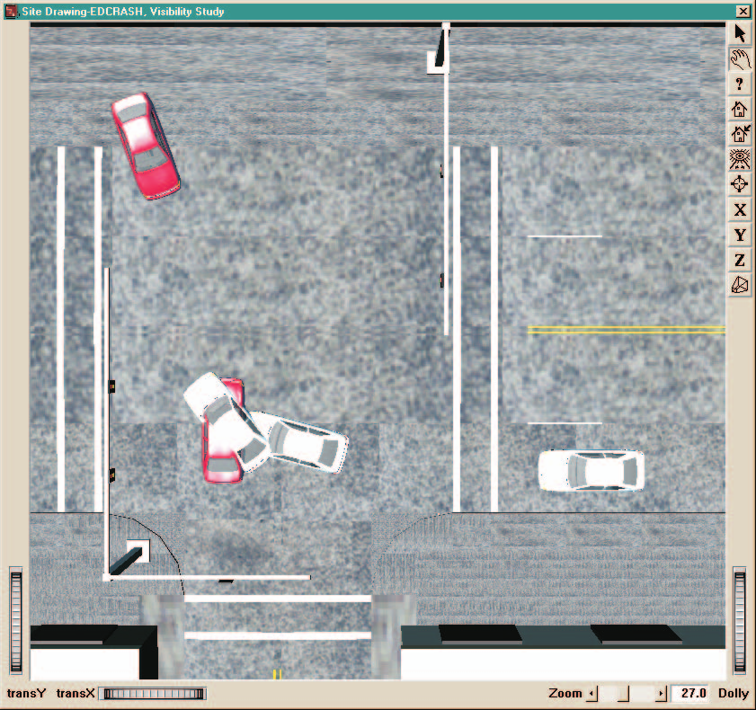

*Figure 5-22: Site Drawing Report for EDCRASH, Visibility Study event showing both vehicles at each user-entered position.*

### Vehicle Data

The Vehicle Data report provides the physical data used by EDCRASH, including dimensions, inertias, tire properties, wheel lock-ups and stiffness coefficients.

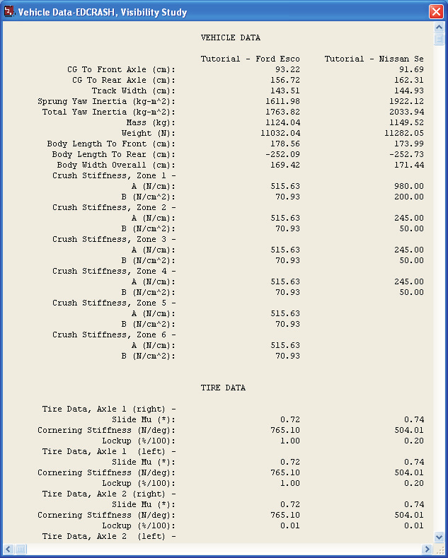

*Figure 5-23: Vehicle Data Report for EDCRASH, Visibility Study event.*

> **NOTE:** The Vehicle Data and several other reports contain more information than fits into the default window size. Use the scroll bars or resize the dialog to view the entire report.

### Printing

The final step is to print the above reports. Printing reports is simple. All you do is choose a report and print it. For example:

1. Click on the dialog header of the Accident History – EDCRASH, Visibility Study report. Your selection is highlighted and the Accident History window pops to the top of the display (if it isn't there already), indicating it is the current window.
2. Click on the File menu and choose Print. The Print dialog is displayed, allowing the user to select from several available print options.

   > **NOTE:** Alternatively, you can click on the print icon in the upper menu bar.

3. Press OK. The Accident History output report is printed on the system printer.

That's all there is to it! You can print any other report using the same two steps described above.

> **NOTE:** The Print dialog provides several options. Refer to your Windows or printer manual for more information.

> **NOTE:** For several reports it may be best to print in landscape rather than portrait mode.

> **NOTE:** The font size of both the printed reports and screen display may be edited by clicking on the Options menu and choosing Preferences. Use the Font Size option list to change the size.

---

*Previous: [Chapter 4 — Calculation Method](04-calculation-method.md) · Next: [Chapter 6 — Messages](06-messages.md)*

<!-- NAV -->

---

← Previous: [Chapter 4 — Calculation Method](04-calculation-method.md)  |  [Index](README.md)  |  Next: [Chapter 6 — Messages](06-messages.md) →

<!-- /NAV -->
