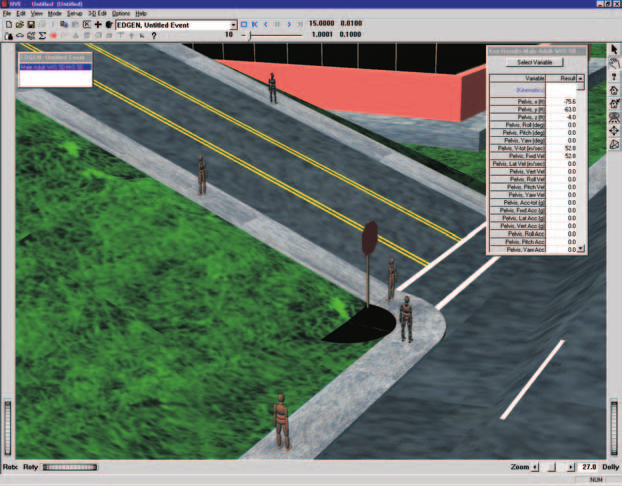

# Chapter 1 — Program Description

## Overview

**EDGEN** (**E**ngineering **D**ynamics Corporation **GEN**eral Analysis Tool) is a 3-dimensional kinematics spreadsheet developed by Engineering Dynamics Corporation. EDGEN uses positions and velocities supplied at up to eight user-specified locations (e.g., *Initial, Pre-braking, Impact*, etc.) to determine the time required to travel between each location. Using this time, EDGEN calculates the average linear accelerations between each location, and then calculates the current velocity and position at each timestep between the user-entered positions.

EDGEN has several applications. For example:

- Time-vs-distance studies involving a human or vehicle
- Move a human or vehicle between two or more known positions
- A *reality check* to confirm that data used in key frame animations are reasonable

As a kinematics model, forces acting on the human or vehicle are not computed.

> **NOTE:** By definition, kinematics is the study of object motion without regard to the forces that cause it.

It is up to the user of EDGEN to review the resulting accelerations and decide if they are reasonable.

When used for a human, EDGEN calculates the motion of the pelvis. Six degrees of freedom (X, Y, Z linear motion, and roll, pitch and yaw angular motion of the pelvis) are calculated. Joint articulations are not included. Therefore, arm and leg motion cannot be simulated.

*Figure 1-1: Typical EDGEN Event.*

When used for a vehicle, EDGEN calculates the motion of the sprung mass. Again, six degrees of freedom (X, Y, Z linear motion, and roll, pitch and yaw angular motion) are calculated. Suspension deflection and tire spin degrees of freedom are not included.

The resulting motion is recorded as EDGEN human or vehicle output tracks; the motion is visualized in the HVE/HVE-2D simulation environment.

## Model Inputs

EDGEN inputs include one human or one vehicle, and an optional environment. Event set-up parameters include at least two and up to eight positions and velocities for the human or vehicle. The current integration interval for humans or vehicles is used to calculate motion for each timestep, and the output timestep is used for the output interval. These time intervals are set using the Simulation Controls dialog.

## Model Outputs

EDGEN output reports include the Accident History, Variable Output and Trajectory Simulation.

## HVE and HVE-2D

EDGEN is compatible with both HVE and HVE-2D. However, it is a 3-dimensional kinematics spreadsheet. When using HVE-2D the user is restricted to studying planar motion and the Human Editor is not available. Because these restrictions are not imposed by the physics program, this manual is written to include all features available in HVE.

## Validation

EDGEN required minimal validation because it was derived directly from first principles ($a = dv/dt$ and $v = ds/dt$), and neither requires nor makes any modeling assumptions about how forces are produced. However, simple calculation verifications were performed to ensure the equations were programmed correctly.

## Basic Procedure

The procedure for using EDGEN is substantially the same as using any reconstruction or simulation model in the HVE environment:

1. Use the Human Editor to add one or more humans to the case.
2. Use the Vehicle Editor to add one or more vehicles to the case.

   > **NOTE:** The Human and Vehicle properties, such as weight, dimensions, and so on, are not used. EDGEN simply views the human or vehicle as a "particle" object. See [Chapter 4, Calculation Method](04-calculation-method.md), for more information.

3. Optionally, use the Environment Editor to create a visual environment.

   > **NOTE:** Although an environment is unnecessary, it provides a visual context for the movement of objects computed by EDGEN.

4. Use the Event Editor to set up and execute the EDGEN calculation model by performing the following steps:
   - Choose one human or one vehicle from the list of humans and vehicles added earlier (see above).
   - Choose the EDGEN calculation model.
   - Position the human or vehicle in the environment at two or more positions (e.g., *Initial, Begin Braking*).
   - Provide velocities for each position.
   - Execute the EDGEN event.
5. Edit and re-execute the event, if necessary, to achieve the desired accelerations between each position.
6. Finally, use the Playback Editor to view the various reports and trajectory simulations. If desired, produce a video output of the simulation.

<!-- NAV -->

---

← Previous: [EDGEN — General Analysis Tool](README.md)  |  [Index](README.md)  |  Next: [Chapter 2 — Program Input Parameters](02-program-input.md) →

<!-- /NAV -->
