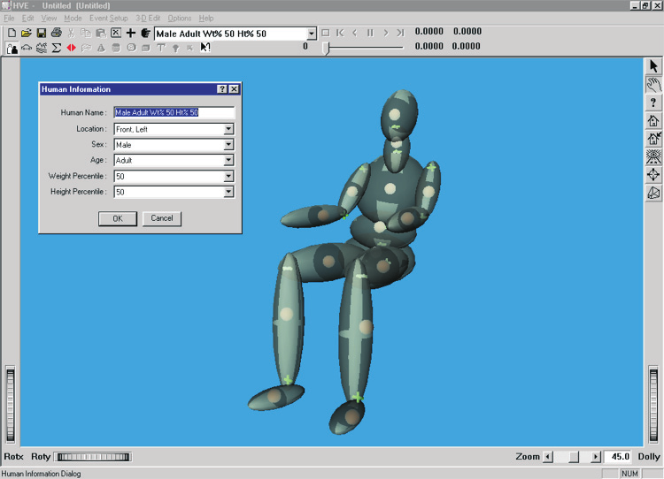
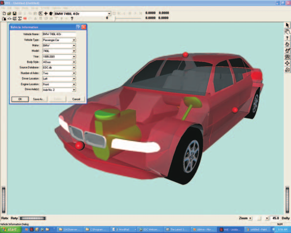
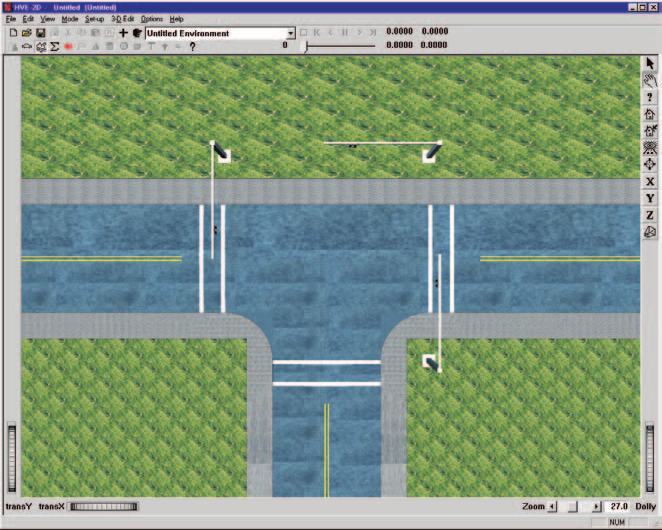
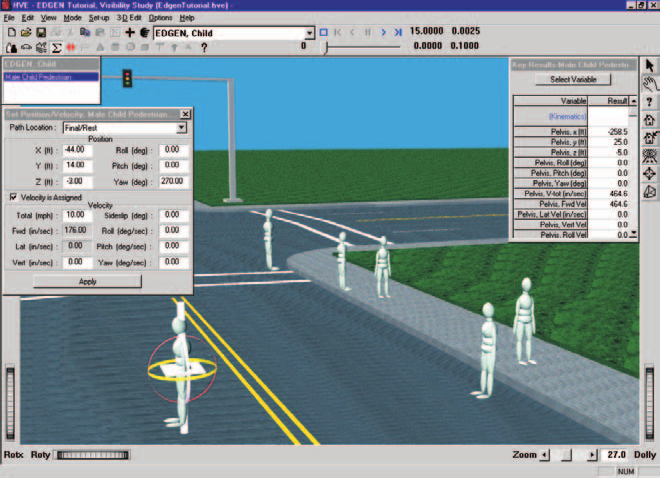
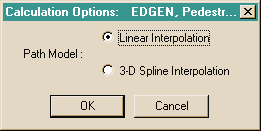
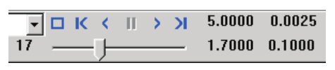

# Chapter 2 — Program Input Parameters

This chapter defines the objects (humans, vehicles and environment) and the event set-up parameters (positions and velocities) used by the EDGEN analysis. In general, the chapter is divided into the following sections:

- **Objects** — The number of humans and vehicles, and the specific human and vehicle parameters actually used by EDGEN.
- **Events** — The various options available for setting up and executing an EDGEN event.

## Objects Overview

The objects used by the EDGEN model are:

- **Humans** — One human, either an occupant or a pedestrian, may be studied by EDGEN.
- **Vehicles** — One vehicle may be studied by EDGEN.

  > **NOTE:** Either a human *or* a vehicle, but not both, may be studied in an EDGEN event.

- **Environment** — Like the *real* world, EDGEN has exactly one environment.

  > **NOTE:** The environment is optional.

The following sections describe how these objects provide the required inputs to the EDGEN calculation model.

## Humans

EDGEN may use one human created using the HVE Human Editor. Humans are selected from the Human Database by choosing the following attributes:

- **Location** — Choose from any available occupant position (i.e., *R/F, L/F*) or, alternatively, choose *Pedestrian*.

  > **NOTE:** If an occupant position is selected, HVE initially displays the human in a seated position; if a pedestrian is selected, it is displayed in a standing position.

  > **NOTE:** The initial orientation of the human may be edited during Event mode.

- **Sex** — Choose *Male* or *Female*.
- **Age** — Choose *Adult* or from a list of child ages.
- **Weight Percentile** — Choose from a list of available percentiles.
- **Height Percentile** — Choose from a list of available percentiles.

To add a human to the current HVE case, perform the following steps:

1. Choose *Human Mode*. The Human Editor is displayed.
2. Click *Add New Object*. The Human Information dialog is displayed.
3. Click on the *Location* option list and select a location for the current human.
4. Click on the *Sex, Age, Weight Percentile* and *Height Percentile* option buttons to choose a human from the database.
5. Enter a name for the current human. A default name is supplied for each selected human. Its name is user-editable, and does not affect calculations.

   > **NOTE:** Duplicate human names are not allowed in the same case.

6. Click *OK* to add the human to the current case.

*Figure 2-1: HVE Human Editor.*

The following Human Parameter groups are editable using the HVE Human Editor:

- Inertias
- Color
- Ellipsoids
- Joints
- Injury Tolerance

EDGEN is a kinematics program. Thus, it does not require or use any human parameters in its calculations.

## Vehicles

EDGEN may use one vehicle created using the Vehicle Editor. Vehicles are selected from the Vehicle Database by choosing the following attributes:

- **Type** — EDGEN supports all HVE/HVE-2D vehicle types: *Passenger Car, Pickup, Van, Sport-Utility, Truck, Trailer, Dolly, Fixed Barrier* and *Movable Barrier*.
- **Make** — EDGEN supports all available vehicle makes.
- **Model** — EDGEN supports all available vehicle models.
- **Year** — EDGEN supports all available vehicle years.
- **Body Style** — EDGEN supports all available vehicle body styles.

Each vehicle also has the following additional user-editable parameters:

- **Driver Location** — The driver location is not used by EDGEN.
- **Engine Location** — The engine location is not used by EDGEN.
- **Number of Axles** — The number of axles is not used by EDGEN.
- **Drive Axle(s)** — The drive axle attribute is not used by EDGEN.

To add a vehicle to the current case, perform the following steps:

1. Choose *Vehicle Mode*. The Vehicle Editor is displayed.
2. Click *Add New Object*. The Vehicle Information dialog is displayed.
3. Click on the *Type, Make, Model, Year* and *Body Style* option buttons to select a vehicle from the database.
4. If desired, modify the *Driver Location, Engine Location, Number of Axles* and *Drive Axle(s)* for the current vehicle.
5. Enter a name for the current vehicle. A default name is supplied for each selected vehicle. Its name is user-editable, and does not affect calculations.

   > **NOTE:** Duplicate vehicle names are not allowed in the same case.

6. Click *OK* to add the vehicle to the current case.

*Figure 2-2: HVE Vehicle Editor.*

The following Vehicle Parameter groups are created by the HVE Vehicle Editor:

- Sprung Mass
- Unsprung Mass (Wheels)
- Exterior
- Drivetrain
- Steering System
- Brake System

EDGEN is a kinematics program. Thus, it does not require or use any vehicle parameters in its calculations.

## Environment

The environment is created using the HVE Environment Editor by defining the following groups of attributes:

- Visual Data
- Physical Data

### Creating an Environment

To add an environment to the current HVE case, perform the following steps:

1. Choose *Environment Mode*. The Environment Editor is displayed.
2. Click *Add New Object*. The Environment Information dialog is displayed.
3. Click on the *Location* combo box to select the desired city, state and country, and associated latitude, longitude and GMT.
4. Enter the *Time* and *Date* for the event.
5. Enter the *Angle of the X axis, Wind Speed* and *Direction, Barometric Pressure* and *Temperature* for the event.
6. Enter an environment name. A default name is supplied for the current environment. The name is user-editable, and does not affect calculations.
7. Click *OK* to add the environment to the current case.

The Visual and Physical attribute groups are defined below.

*Figure 2-3: Environment Editor.*

### Visual Data

The following visual parameters may be edited:

- **Environment Location** — A database containing the name (City/State/Country), Latitude and Longitude and GMT for the selected location.
- **Time and Date** — The local standard time and date for the event.

The visual data are not used by the event; they are provided for studies related to visibility at the time of an event (e.g., avoidability of an accident).

> **NOTE:** The visual data (Location, Time, Date and Angle of earth-fixed X axis) affect the lighting of the event! Depending on your view (Camera Position) the scene may be shaded and difficult to see. If the time is after sundown, the view will be dark.

### Physical Data

The Physical Data groups are:

- Angle of X Axis
- Wind Speed and Direction
- Atmospheric Temperature and Pressure
- Gravity Constant
- Surface Geometry

EDGEN does not use any physical environment parameters. However, an environment may be supplied to provide visual context, as well as to control the lighting of the event. These parameters are described below:

#### Angle of X Axis

The angle of the X axis is used to position the earth-fixed coordinate system on the surface of the earth.

> **NOTE:** The angle is specified relative to true north. If you are using a compass to determine direction at the scene of an accident, you should provide a correction factor before entering this angle.

> **NOTE:** The angle of the X axis affects how you visualize an EDGEN event because it affects the location of the sun.

#### Wind Speed and Direction

Wind Speed and Direction are not used by EDGEN.

#### Atmospheric Temperature and Pressure

Atmospheric Temperature and Pressure are not used by EDGEN.

#### Gravity Constant

Gravity Constant is not used by EDGEN.

#### 3-D Surface Geometry

3-D Surface Geometry is not used by EDGEN.

## Event

EDGEN uses the Event Editor to create, set up and execute an event. Each of these topics is described below.

### Creating an EDGEN Event

An EDGEN event is created using the Event Information dialog.

To create an EDGEN event:

1. Choose *Event Mode*. The Event Editor is displayed.
2. Click *Add New Object*. The Event Information dialog is displayed.
3. Select either one human from the Active Humans list, or select one vehicle from the Active Vehicles list.
4. Select the calculation model, *EDGEN*, from the Calculation Model options list.
5. Enter an event name. A default name is supplied for the selected event. The name is user-editable, and does not affect calculations.

   > **NOTE:** Duplicate event names are not allowed in the same case.

6. Click *OK* to create the EDGEN event.

*Figure 2-4: HVE Event Editor, setting up and executing an EDGEN event.*

### Setting Up an EDGEN Event

EDGEN uses only the *Position/Velocity* event set-up options.

#### Position/Velocity

EDGEN is similar to a simulation model. Like all simulations, EDGEN requires initial positions and velocities to be supplied by the user.

The human or vehicle is positioned relative to the earth-fixed coordinate system by supplying the X, Y, Z coordinates of its CG, and roll ($\phi$), pitch ($\theta$) and yaw ($\psi$) angles about the vehicle x, y and z axes, respectively.

The velocities are supplied in the form of a total velocity, sideslip angle and vertical velocity.

> **NOTE:** The forward and lateral velocity components are calculated according to the user-entered total velocity and sideslip angle.

The position of a human is defined by the center of gravity of its pelvis segment (this is called the *main segment*). Thus, the positions and velocities are actually those assigned for the pelvis. However, human positions may be further defined for each additional segment (i.e., *Head, Left Upper Leg*, and so forth) by $\psi, \theta, \phi$ articulations (supplied in that order) at the joints.

> **NOTE:** The positions of other segments remain fixed, that is, no articulation occurs between those segments and the pelvis.

HVE provides eight path positions: *Initial, Begin Perception, Begin Braking, Impact, Separation, Point on Curve, End of Rotation* and *Final/Rest*. All of these positions may be used by EDGEN. However, the specified names are not relevant. Only the order of the specified positions is important (i.e., the position for *Separation* follows *Impact*, the position for *End of Rotation* follows *Separation*, and so forth).

Position/Velocity data used by EDGEN are shown in Table 2-1.

**Table 2-1: Event Position/Velocity Parameters used by EDGEN**

| Parameter | Description |
|---|---|
| Vehicle Positions (up to 8 positions may be entered) | The earth-fixed X, Y, Z coordinates and the roll, pitch and yaw orientations of the vehicle CG at the specified position |
| Vehicle Velocity | The forward, lateral and vertical linear velocities, and the roll, pitch and yaw angular velocities of the vehicle at the specified position |
| Human Position (up to 8 positions may be entered) | The earth-fixed X, Y, Z coordinates and roll, pitch, yaw orientations of the human pelvis CG at the specified position |
| Human Initial Velocity | The forward, lateral and vertical linear velocities, and the roll, pitch and yaw angular velocities of the human pelvis at the specified position |

### Simulation Controls

EDGEN uses the current simulation control parameters in the Simulation Controls dialog (see Options Menu, Simulation Controls).

The Simulation parameters used by EDGEN are shown in Table 2-2.

**Table 2-2: Simulation Control Parameters used by EDGEN**

| Parameter | Description |
|---|---|
| Human Integration Timestep | The calculation timestep used for events involving a human |
| Vehicle Integration Timestep | The calculation timestep used for events involving a vehicle |
| Output Interval | The timestep used to send output results back to HVE |
| Maximum Simulation Time | Maximum length of the run |

### Calculation Options

EDGEN has one calculation option, Path Model. The options are:

- **Linear Interpolation** — EDGEN uses linear interpolation between user-entered path nodes to define the path position and orientation. This can result in discontinuities at the nodes; however, the result is somewhat more predictable. This is the default.
- **3-D Spline Interpolation** — EDGEN uses spline interpolation between the path nodes to define the path position and orientation. The result is a smooth, continuous path that is guaranteed to be tangent at each node.

*(Updated: verified against current source — internal physics variable `PathOption`, where 0 = `LINEAR` (default) and 1 = `SPLINE`; see `Physics/Source/Edgen/gendef.h`, `genlinear.cpp` and `genspline.cpp`.)*

For dialog details, see the code-verified page [Calculation Options for EDGEN](../../10-calculation-options/CalcOptEDGENDlg.md).

*Figure 2-5: EDGEN Calculation Options dialog.*

### Executing an Event

To execute an EDGEN event, use the Event Controller, a component of the Event Editor. The Event Controller's buttons have the following functions:

- **Reset** — Reinitialize the calculation model for re-execution
- **Rewind to Start** — Return to the start of the simulation
- **Reverse** — Play the simulation backwards
- **Pause** — Pause the simulation
- **Play** — Execute the event or play the simulation forwards
- **Advance to End** — Advance to the end of the simulation

*Figure 2-6: Event Controller.*

> **NOTE:** If you make changes to any of the event set-up options (see previous section), those changes will have no effect unless you press Reset before pressing Play.

> **NOTE:** Remember to use the Options Menu to choose useful options, such as Key Results, Axes, Velocity Vectors and Contacts.

<!-- NAV -->

---

← Previous: [Chapter 1 — Program Description](01-program-description.md)  |  [Index](README.md)  |  Next: [Chapter 3 — Program Output Results](03-program-output.md) →

<!-- /NAV -->
