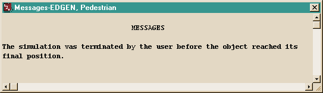
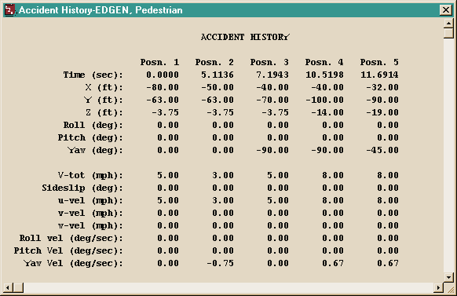
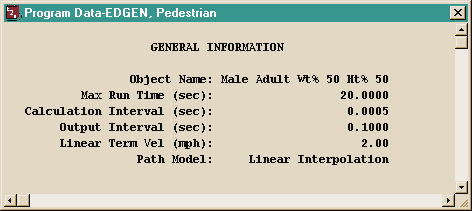
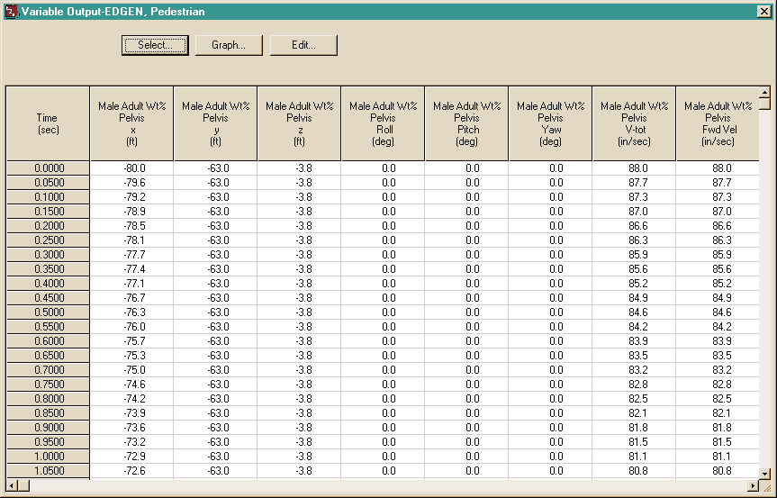
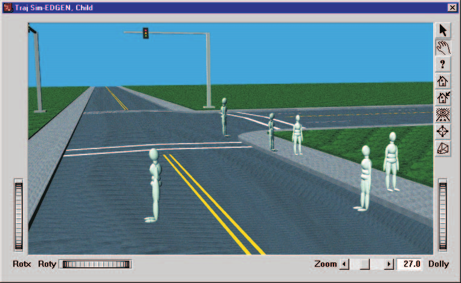
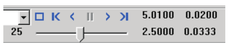

# Chapter 3 — Program Output Results

This chapter defines the outputs available from an EDGEN event. The reports produced by EDGEN are available in the Playback Editor.

## Overview

EDGEN produces three types of output reports:

- **Alpha-Numeric Reports** — Reports containing text and numeric information, such as vehicle positions and orientations
- **Variable Output Tables** — Reports containing tabular simulation results as a function of time
- **Trajectory Simulations** — Viewers containing dynamic, 3-D visual simulations

> **NOTE:** Each of these reports may be printed on the system printer. To print a report, click on the menu bar of the desired output report (the menu bar will change colors indicating that it is selected), then either choose Print from the Files menu or click on the Print icon in the toolbar. Refer to the User's Manual for further details.

To view any of these reports, perform the following steps:

1. Choose *Playback Mode*. The Playback Editor is displayed.
2. Click *Add New Object*. The Report Window Information dialog is displayed, showing a list of all the current events in the case.
3. Select an EDGEN event from the list. Once an event is selected, the Selected Output option list is displayed, containing all the available reports for the selected event.
4. Choose the desired report from the Selected Output list.
5. Enter a Report Window Name. A default name is supplied for the selected preview window. The name is user-editable, and does not affect calculations.

   > **NOTE:** Duplicate Report Window names are not allowed. Because HVE truncates the name to 30 characters, you should ensure that two truncated names are not the same.

6. Click *OK* to display the report.

## Alpha-Numeric Reports

EDGEN produces the following alpha-numeric reports:

- **Messages** — A list of messages produced by the current run
- **Accident History** — A table of positions and velocities for each human or vehicle
- **Program Data** — A table containing program control information for the current run

Examples of each of these numeric output reports from EDGEN are described below.

### Messages

The Messages Report lists any diagnostic messages produced during the run. For a complete listing of messages issued by EDGEN, see [Chapter 6, Messages](06-messages.md).

*Figure 3-1: Typical Messages Report issued by EDGEN.*

### Accident History

The Accident History Report displays a table containing each of the user-entered positions and velocities for the human or vehicle. For each entered position (Posn. 1, Posn. 2, ...), the report lists the computed time (sec), X, Y, Z coordinates (ft), Roll, Pitch, Yaw angles (deg), total velocity V-tot (mph), Sideslip (deg), u-, v-, w- velocity components (mph), and Roll, Pitch and Yaw angular velocities (deg/sec).

*Figure 3-2: Typical Accident History Report issued by EDGEN.*

### Program Data

The Program Data Report includes the simulation control parameters used for the current EDGEN event: Object Name, Max Run Time (sec), Calculation Interval (sec), Output Interval (sec), Linear Term Vel (mph) and Path Model (Linear Interpolation or 3-D Spline Interpolation).

*Figure 3-3: Typical Program Data Report issued by EDGEN.*

## Graphic Reports

EDGEN produces no Graphic Output Reports.

> **NOTE:** Graphs of simulation results vs time may be produced using the Variable Output window (see next section).

## Variable Output Table

EDGEN produces a Variable Output table containing the time-dependent simulation results. Variable Output displays the Kinematics output group for the human or vehicle.

> **NOTE:** If the object is a human, the kinematics are displayed for the human Pelvis segment.

A detailed listing of each Variable Output parameter produced by EDGEN is found in Table 3-1.

**Table 3-1: Variable Output Data**

| Parameter | Description |
|---|---|
| Human or Vehicle Kinematic Data | X, Y, Z coordinates; $\phi, \theta, \psi$ angles; Total velocity, fwd, side, vert components; $\dot\phi, \dot\theta, \dot\psi$ angular velocities; Total acceleration, fwd, side, vert components; $\ddot\phi, \ddot\theta, \ddot\psi$ angular accelerations |

*Figure 3-4: Variable Output dialog for an EDGEN event.*

## Trajectory Simulations

EDGEN produces a trajectory simulation. A trajectory simulation is a 3-D visualization of the data displayed in the Variable Output table (see previous section).

*Figure 3-5: Trajectory Simulation Report.*

### Displaying a Trajectory Simulation

The Trajectory Simulation is controlled using the Playback Controller.

*Figure 3-6: Playback Controller.*

The Playback Controller's buttons have the following functions:

- **Reset** — Return to the start of the simulation and reinitialize the video output device (this applies a hardware reset and is otherwise the same as the *Rewind to Start* button, below)
- **Rewind to Start** — Return to the start of the simulation
- **Reverse** — Play the simulation backwards
- **Pause** — Pause the simulation
- **Play** — Play the simulation forwards
- **Advance to End** — Advance to the end of the simulation

> **NOTE:** The Playback Controller also includes additional features used for creating video. Refer to the User's Manual, Playback Editor and Video Output chapters, for further details.

<!-- NAV -->

---

← Previous: [Chapter 2 — Program Input Parameters](02-program-input.md)  |  [Index](README.md)  |  Next: [Chapter 4 — Calculation Method](04-calculation-method.md) →

<!-- /NAV -->
