# Chapter 5 — EDGEN Tutorial

This tutorial illustrates a typical use of EDGEN: a time-distance study involving the visibility between several objects. The specific example involves a child exiting a school bus, walking around to the rear of the bus, then crossing the road in front of an oncoming vehicle. We'll view the sequence from several vantage points to address the issue of avoidability.

We will create three EDGEN events in this tutorial. The first event simply places the school bus. The second event moves the child out of and around the back of the bus. The third event moves the approaching vehicle.

Like all EDGEN events, the procedure involves the following basic steps:

- Create the human(s)
- Create the vehicle(s)
- Create the environment
- Execute the EDGEN event
- Review the EDGEN output reports

This basic procedure is described in detail in this tutorial.

> **NOTE:** It is assumed that HVE is up and running, and that the user is familiar with HVE's basic features. The purpose of this tutorial is to illustrate those features while setting up and executing an EDGEN event.

This study involves both a human and vehicles, and it involves 3-dimensional motion. The text and figures within gray-shaded areas of the original printed tutorial are important for HVE users, but may be ignored by HVE-2D users. If you are using HVE-2D, the Human Editor is not available and motion is restricted to the X-Y plane. Nevertheless, HVE-2D users will benefit from following the process for the two vehicles moving in the X-Y plane.

## Getting Started

As in other tutorials, before we get started, let's set the user options so we're all starting on the same page.

> **NOTE:** Most options simply affect the appearance in a viewer during Event or Playback mode. However, some options affect the data used in the analysis. For example, if AutoPosition is On, the vehicle position conforms to the local surface; otherwise, the position is set by the Position/Velocity dialog. Obviously, the resulting difference in initial conditions could substantially change the event.

> **NOTE:** Some of the following options are "Toggles" that switch between two different modes. Make sure these options are set correctly.

To set the initial user options, choose the following from the Options Menu:

- ON: Show Key Results
- OFF: Show Axes
- ON: Show Contacts
- OFF: Show Velocity Vectors
- ON: Show Skidmarks
- OFF: Show Targets
- ON: AutoPosition
- Units equals US
- Render Options:
  - Show Humans as *Actual*
  - Show Vehicles as *Actual*
  - *Phong* Render Method
  - Complexity equals *Object*
  - Render Quality equals *5*
  - Texture Quality equals *1*
  - Anti-aliasing equals *1*

The remaining options will automatically initialize to their default conditions. We're now ready to proceed with the tutorial.

## Creating the Humans

To create the human for our event, perform the following steps:

1. If the Human Editor is not the current editor, choose *Human Mode*.

Now, let's add the male child pedestrian from the Human Database.

2. Click *Add New Object*. The Human Information dialog is displayed.
3. Click on the option buttons in the Human Information dialog to choose the following human attributes:
   - Location = *Pedestrian*
   - Sex = *Male*
   - Age = *12 year old*
   - Weight Percentile = *50*
   - Height Percentile = *50*
   - Edit the default name: `Male Child Pedestrian`
4. Click *OK* to add Male Child Pedestrian to the Active Humans list.

After the above steps are performed, the human pedestrian has been added to the case and is ready to be analyzed.

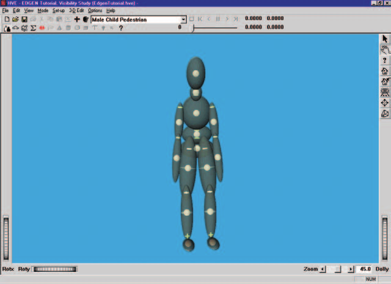

*Figure 5-1: Male Child Pedestrian, ready for analysis.*

## Creating the Vehicles

Our event requires two vehicles; the first is a yellow school bus and the second is a blue Ford Taurus. Let's add the school bus to our case:

1. Choose *Vehicle Mode*. The Vehicle Editor is displayed.
2. Click *Add New Object*. The Vehicle Information dialog is displayed. The Vehicle Information dialog allows the user to select the basic vehicle attributes according to *Type, Make, Model, Year* and *Body Style*.

   > **NOTE:** The Vehicle Information dialog also allows you to edit the Driver Location, Engine Location, Number of Axles and Drive Axle(s). These options are already assigned for each vehicle and need not be edited in our tutorial.

3. Using the option buttons, click each button to choose the following vehicle from the HVE Vehicle Database:
   - Type = *Truck*
   - Make = *International*
   - Model = *Loadstar*
   - Year = *1990*
   - Body Style = *Bus*
   - Source Database = *Tutorial.db*
4. Edit the default name; enter `International School Bus`.
5. Click *OK* to add *International School Bus* to the Active Vehicles list. The school bus is now displayed in the viewer.

Next, let's add the Ford Taurus to the case:

1. Click *Add New Object*. The Vehicle Information dialog is displayed.
2. Using the option buttons, click each button to choose the following vehicle from the database:
   - Type = *Passenger Car*
   - Make = *Ford*
   - Model = *Taurus*
   - Year = *1996-1999*
   - Body Style = *4-Door*
   - Source Database = *Tutorial.db*
3. Click *OK* to add *Ford Taurus* to the Active Vehicles list.

We now have both vehicles required for our study.

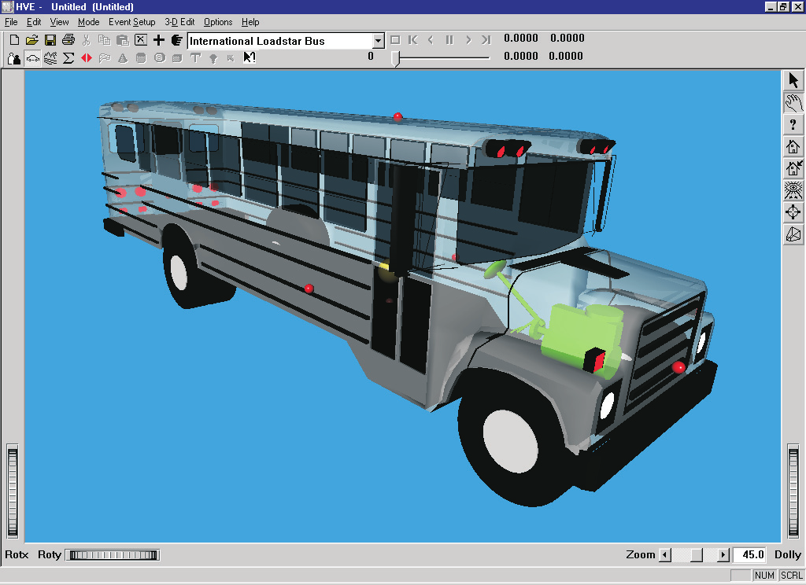

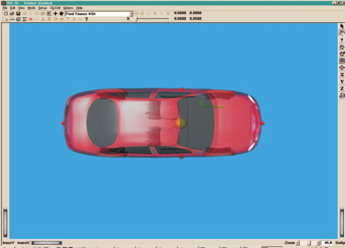

*Figure 5-2: International School Bus (above) and Ford Taurus (below).*

### Editing the Vehicles

Next, we'll edit the vehicles to change their color. Since it's currently loaded in the Vehicle Editor, we'll start by changing the color of the Ford Taurus.

> **NOTE:** Color is the only vehicle attribute used by EDGEN.

1. Click on the vehicle CG and choose *Color*. The Vehicle Color dialog is displayed, showing the vehicle's current color (the small black square, or *hot spot*, in the color wheel) and intensity (the arrow in the intensity slider). Click on the hot spot and drag it to the center of the blue area. To darken the vehicle slightly, click on the intensity slider and drag it slightly to the left.

   > **NOTE:** The color chip on the left shows the current color.

2. When the color is to your liking, close the dialog by clicking on the close button in the upper right-hand corner of the dialog.

   > **NOTE:** The vehicle's apparent color may be slightly misleading because the vehicle is translucent when displayed in the Vehicle Editor. The actual color will be used whenever the vehicle is displayed during Event and Playback mode.

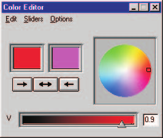

*Figure 5-3: Vehicle Color dialog, used for assigning the vehicle color.*

Next, we'll edit the color of the school bus:

1. Click on *International School Bus* in the Active Vehicles list, making it the current vehicle. The International School Bus is now displayed in the Vehicle Editor.
2. Click on the vehicle CG and choose *Color*. The Vehicle Color dialog is displayed. Click on the hot spot and drag it to the center of the yellow area. To lighten the vehicle, click on the intensity slider and drag it to the far right end.
3. When the color is to your liking, close the dialog by clicking on the close button in the upper right-hand corner of the dialog.

The International School Bus and Ford Taurus are now ready for use in our tutorial. Using the viewer thumb wheels, rotate (translate in HVE-2D) and look at the vehicles.

> **NOTE:** The thumb wheels rotate the vehicle about the viewer axes, not the vehicle axes.

> **NOTE:** Remember viewers have two modes: Pick and Manipulate (the icon in the upper right corner of the viewer displays the current mode). In Pick mode, you can use the thumb wheels to adjust the view. In Manipulate mode, you can use the left mouse button to rotate or dolly the view and the middle mouse button to pan back and forth. Refer to the User's Manual, Overview (Window Manager Basics) for more information about using viewer controls.

## Creating the Environment

Now, let's add the environment:

1. Choose *Environment Mode*. The Environment Editor is displayed.
2. Click *Add New Object*. The Environment Information dialog is displayed.
3. Using the Location Database combo box, choose *Chicago, Illinois, USA*. The latitude (41.53.00N), longitude (87.40.00W) and GMT, hours from the prime meridian (-6.00), are displayed for the selected location.

   > **NOTE:** If Chicago were not included in your Location Database, you could add it simply by typing in a new location name, latitude, longitude and GMT.

4. Edit the environment name: `School Bus Stop`.
5. Enter the date and time of the incident we are studying, `5/15/97` and `1430`, respectively.
6. Enter the angle from *true north* to the earth-fixed X axis in our environment, `-80` degrees.

   > **NOTE:** The Latitude, Longitude, GMT, Date/Time and angle from true north are used to position the sun in the scene. This is, of course, important because the sun is the primary light source for the scene.

7. To add the environment geometry file to our case, click on *Open*. The Environment Geometry File Selection dialog is displayed.
8. Click on the *File Format* option list and choose *HVE*. A list of environment geometry files using the HVE file format is displayed in a list box. Double-click on *4T2_Intersection.h3d* to choose the environment file and remove the dialog.
9. Press *OK*.

The selected environment is added to our case and displayed in the Environment Viewer. Use the viewer thumb wheels to view the scene.

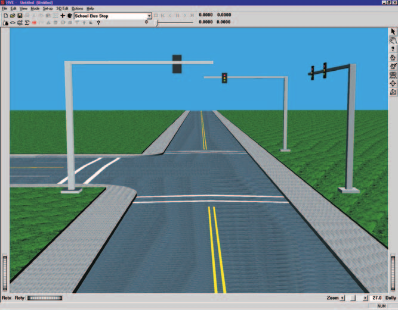

*Figure 5-4: 3-D Environment for our EDGEN event (shown in HVE Environment Editor).*

## Saving the Case

Now that we've created vehicles for our case, let's save the case file.

Click on the *File* menu and choose *Save*. The Save-as File dialog is displayed.

> **NOTE:** The Save-as dialog is displayed because the case has not been saved previously, so we need to enter a filename.

1. Place the mouse cursor in the Case Title text field and enter `EDGEN Tutorial, Visibility Study`.

   > **NOTE:** The Case Title is displayed as a heading on all printed output reports.

2. Place the mouse cursor in the Filename text field and enter `EdgenTutorial`.
3. Click *Save*. The current case data are saved in the `../supportFiles/case` subdirectory.

> **NOTE:** Saving the file occasionally is a highly recommended practice.

## Creating the Events

This EDGEN tutorial includes multiple events. The first event uses EDGEN to drive the school bus to the curb. The second event uses EDGEN to move the child out of the school bus, around the back of the bus, and into the oncoming traffic, a Ford Taurus. The third event uses EDGEN to move the oncoming Ford Taurus.

### First Event: School Bus

To create the first event, perform the following steps:

1. Choose *Event Mode*. The Event Editor is displayed.
2. Click *Add New Object*. The Event Information dialog is displayed.
3. Select *International School Bus* from the Active Vehicles list. The vehicle is added to the Event Humans and Vehicles list.
4. Select *EDGEN* from the *Calculation Method* options list.
5. Enter a name for the event, `School Bus`.

   > **NOTE:** The name of the calculation method will automatically be appended to the event name, thus the complete event name will become "EDGEN, School Bus."

6. Press *OK* to display the event editor.

Now, we're ready to set up the event. This step involves placing the bus in the environment:

1. Using the Event Editor dialog, select *International School Bus* from the Event Humans & Vehicles list.
2. Choose *Set-up* from the menu bar and select *Position/Velocity*. The bus is displayed at the earth-fixed origin. The bus has a set of positioning manipulators attached to it.

Manipulators are often used to *drag and drop* the vehicle into position. However, we're going to directly enter the coordinate and heading angle data for the bus at its initial position using the Position/Velocity dialog:

1. Place the mouse cursor in the X coordinate field and enter `-250` ft; enter `25` for the Y coordinate (the default heading angle, 0 degrees, is correct).

   > **NOTE:** AutoPosition takes care of the Z coordinate and roll and pitch angles automatically by calculating those values required to set the vehicle on the surface beneath the vehicle.

   > **NOTE:** Adjust the viewer by dollying back (using the Dolly thumb wheel) until you can see the bus.

2. Click the *Velocity Is Assigned* checkbox. Enter the initial velocity, `25` mph, followed by \<Apply\>.

Next, let's enter the bus's *Begin Braking* position. This time, we'll use the manipulators (instead of entering the values into the Position/Velocity dialog):

1. Choose *Begin Braking* on the *Position/Velocity* dialog. The bus is displayed at the earth-fixed origin.

   > **NOTE:** The position names in the Position/Velocity dialog are not relevant to EDGEN; you could select any position options in the desired order.

2. Click on the bus's X-Y manipulator, wait for it to turn bright yellow (indicating it has been selected), and drag it to its *Begin Braking* position, X=`-72` ft, Y=`25` ft (the default heading angle is already correct).
3. Click the *Velocity Is Assigned* checkbox. Enter the *Begin Braking* velocity, `25` mph, followed by \<Apply\>.

The last position we'll enter for this event is the *Final* position:

1. Choose *Final/Rest* on the *Position/Velocity* dialog. The bus is displayed at the earth-fixed origin.
2. Click on the bus's X-Y manipulator, wait for it to turn bright yellow (indicating it has been selected), and drag it to its *Final/Rest* position, X=`-20` ft, Y=`25` ft (the default heading angle is already correct).
3. Click the *Velocity Is Assigned* checkbox. Enter the *Final/Rest* velocity, `0` mph, followed by \<Apply\>.

The required positions and velocities have now been entered; however, this event lasts more than 5 seconds. To prevent premature termination, let's increase the default maximum simulation time:

1. Click on the Options menu and choose *Simulation Controls*. The Simulation Controls dialog is displayed.
2. Edit the *Maximum Time*, changing it from `5` to `15` seconds.
3. Press *OK* to update the simulation controls.

We're now ready to execute our first event.

> **NOTE:** EDGEN is not a simulation program in that it does not use tire forces or other forces to calculate the object's motion. Therefore, Driver Controls, Damage Profiles and other event-related inputs are not used.

To execute the event, perform the following steps:

1. Using the Event Controller, click *Play* to execute the event. Allow the event to run until the vehicle comes to rest at t=7.4651 seconds.

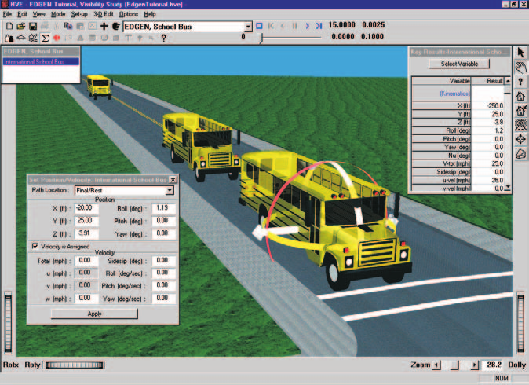

*Figure 5-5: The first EDGEN event ready to execute. The school bus has been positioned at its initial, begin braking and final/rest positions.*

> **NOTE:** While the event is executing, you can watch the current position, velocity and acceleration in the Key Results windows.

We have now completed the first event.

### Second Event: Child Pedestrian

Let's add our second event, the child riding in the school bus. To set up and execute this EDGEN event, perform the following steps:

1. Click *Add New Object*. The Event Information dialog is displayed.
2. Select *Male Child Pedestrian* from the Active Humans list. The human is added to the Event Humans and Vehicles list.
3. Select *EDGEN* from the *Calculation Method* options list.
4. Edit the default name for the event; enter `Child`.

   > **NOTE:** HVE will append the name of the calculation method to the event name, thus the complete event name will become "EDGEN, Child."

5. Press *OK* to display the event editor.

Now, we're ready to set up the event. This step involves placing the human in the environment:

1. Using the Event Editor dialog, select *Male Child Pedestrian* from the Event Humans & Vehicles list.
2. Choose *Set-up* from the menu bar and select *Position/Velocity*. The pedestrian is displayed at the earth-fixed origin.

   > **NOTE:** Initially, the human will be buried up to his waist because the human's origin is located in his pelvis, and is positioned at the earth-fixed origin.

Now, let's position the human. This gives us an opportunity to illustrate several interesting and useful tips related to EDGEN.

Our goal is to have the child walk up the center aisle of the bus, step out onto the sidewalk, turn to his right, walk along the side of the bus, turn right again and run behind the bus out into the oncoming traffic lane. The first important observation of this sequence is that the human is at first moving relative to the vehicle, but at the end of the event the child is moving relative to the earth. It is important to know that EDGEN moves all objects relative to the earth. So, we need to think about how the vehicle moves in order to assign the human's position.

First, consider the vehicle's dimensions and its motion relative to the earth. Returning to the HVE Vehicle Editor and loading the bus allows us to quickly determine the necessary dimensions.

> **NOTE:** These steps involving the Vehicle Editor are not fully described here; however, feel free to follow them if you like.

By visual inspection, we can observe the exit door is about 1.5 feet ahead of the bus's CG. By clicking on the rear surface icon (red sphere) we find the rear of the bus is 262.5 inches (21.875 ft) behind the CG. Clicking on the right surface icon reveals the bus is 96 inches wide.

According to our first EDGEN event, the bus started at X=-250 ft, Y=25 ft with a velocity of 25 mph. It continued at this pace until X=-72 ft. It then began braking until it reached its rest position (zero velocity) at X=-20 ft.

Let's assume the child begins the event 10 feet behind the exit door (remember, the door is 1.5 feet ahead of the CG). Therefore, the human's earth-fixed initial position is

$$X_{Human} = X_{Bus} + \Delta X_{Human\text{-}to\text{-}CG_{Bus}} = -250 + (-10 + 1.5) = -258.5 \text{ ft}$$

Since the child is walking down the center aisle of the bus, his earth-fixed Y coordinate is the same as the bus's, so

$$Y_{Human} = Y_{Bus} = 25 \text{ ft}$$

The child's CG is about 5 feet above the street, so Z = -5 ft, and his heading angle is the same as the bus's, 0 degrees.

Now, let's determine the human's next position, standing in front of the exit door. His earth-fixed X position when the bus began braking is 1.5 ft ahead of the bus's CG at this point, so

$$X_{Human} = X_{Bus} + \Delta X_{Human\text{-}to\text{-}CG_{Bus}} = -72 + 1.5 = -70.5 \text{ ft}$$

Since the child is walking down the center aisle of the bus, his earth-fixed Y position is still the same as that of the bus, 25 ft, and his elevation, Z, is still -5 ft.

When the bus has stopped, the human is still standing in front of the door, 1.5 ft ahead of the bus's CG at this point, so

$$X_{Human} = X_{Bus} + \Delta X_{Human\text{-}to\text{-}CG_{Bus}} = -20 + 1.5 = -18.5 \text{ ft}$$

and his Y and Z positions are also unchanged, 25 ft and -5 ft, respectively. However, let's have the child turning 90 degrees to his right during the time the bus is braking, so his heading angle is now

$$\Psi_{Human} = \Psi_{Bus} + \Delta\Psi_{Human} = 0 + 90 = 90 \text{ deg}$$

Next, the child exits the bus. His X coordinate does not change, so X=-18.5 ft. However, his Y coordinate and elevation change as he walks out the door and onto the sidewalk:

$$Y_{Human} = Y_{Bus} + \Delta Y_{Human\text{-}to\text{-}CG_{Bus}} = 25 + 6 = 31 \text{ ft}$$

After exiting, his elevation (by repeated adjustment until his feet sink into the sidewalk) is -3 ft.

His heading angle remains fixed at 90 degrees as he exits the bus.

Now that our child is outside the bus, we no longer need to consider relative motion between him and the bus, so our job is pretty simple.

Next, let's turn the child 90 degrees to walk on the sidewalk alongside the bus:

$$X_{Human} = X_{Human,\,Previous} + \Delta X_{Human} = -18.5 + (-3.5) = -22 \text{ ft}$$

$$Y_{Human} = Y_{Human,\,Previous} + \Delta Y_{Human} = 31 + 2 = 33 \text{ ft}$$

$$\Psi_{Human} = \Psi_{Human,\,Previous} + \Delta\Psi_{Human} = 90 + 90 = 180 \text{ deg}$$

The sidewalk is level, so Z remains fixed at -3 ft.

Now, the child simply walks alongside the bus, so Y, Z and heading angle do not change. Based on the bus's dimensions, the child walks back about 19 feet before he begins to turn to his right, so

$$X_{Human} = X_{Human,\,Previous} + \Delta X_{Human} = -22 + (-19) = -41 \text{ ft}$$

After reaching the rear of the bus, the child turns right and begins running behind the bus. After completing his turn, the child has also stepped off the curb onto the street, so

$$X_{Human} = X_{Human,\,Previous} + \Delta X_{Human} = -41 + (-3) = -44 \text{ ft}$$

$$Y_{Human} = Y_{Human,\,Previous} + \Delta Y_{Human} = 33 + (-4) = 29 \text{ ft}$$

$$Z_{Human} = Z_{Human,\,Previous} + \Delta Z_{Human} = -3 + 0.5 = -2.5 \text{ ft}$$

$$\Psi_{Human} = \Psi_{Human,\,Previous} + \Delta\Psi_{Human} = 180 + 90 = 270 \text{ deg}$$

Now the kid takes off across the street behind the bus. X and heading angle remain constant, but Y and Z change as he reaches the point of impact (Z changes slightly due to the road crown), so

$$Y_{Human} = Y_{Human,\,Previous} + \Delta Y_{Human} = 29 + (-15) = 14 \text{ ft}$$

$$Z_{Human} = Z_{Human,\,Previous} + \Delta Z_{Human} = -2.5 + (-0.5) = -3 \text{ ft}$$

The entire path is now defined. However, we have said nothing about velocities. Let's assume the child walks up the aisle of the bus while the bus is approaching the stop, before it begins to brake. The child moves from X=-258.5 ft to X=-70.5 ft during this phase. From our first event, this phase took 4.8545 seconds, so

$$V = \frac{\Delta S}{\Delta t} = \frac{\left|{-258.5 - (-70.5)}\right|}{4.8545} = 38.73 \text{ ft/sec} = 26.40 \text{ mph}$$

Next, as our child exits and walks alongside the bus, we'll assume a normal walking rate, say 4 mph. Then, we'll assume the child runs out from behind the bus at a speed of 10 mph.

The sequence described above requires eight positions. To enter these positions, select the male child in the Event Human and Vehicles list, choose Position/Velocity from the Edit menu, and enter the positions and velocities as summarized in Table 5-1.

> **NOTE:** Describing the above sequence in words is much more difficult than describing it visually. If you don't fully understand it yet, proceed with the tutorial, then return to the preceding instructions and reread them. They will probably make much more sense after you see the event.

> **NOTE:** The positions and velocities used in this event were selected as reasonable values to illustrate the desired sequence. Thus, the positions and velocities described above are not intended to be precise.

**Table 5-1: Position and velocity entries for EDGEN Child Pedestrian event**

| Position | X (ft) | Y (ft) | Z (ft) | Yaw (deg) | Vtotal (mph) |
|---|---|---|---|---|---|
| Initial | -258.5 | 25.0 | -5.0 | 0.0 | 26.4 |
| Begin Perception | -70.5 | 25.0 | -5.0 | 0.0 | 26.4 |
| Begin Braking | -18.5 | 25.0 | -5.0 | 90.0 | 4.0 |
| Impact | -18.5 | 31.0 | -3.0 | 90.0 | 4.0 |
| Separation | -22.0 | 33.0 | -3.0 | 180.0 | 4.0 |
| Point-on-curve | -41.0 | 33.0 | -3.0 | 180.0 | 4.0 |
| End-of-rot'n | -44.0 | 29.0 | -2.5 | 270.0 | 10.0 |
| Final/Rest | -44.0 | 14.0 | -3.0 | 270.0 | 10.0 |

The required positions and velocities have now been entered. However, this event, like the previous one, lasts more than 5 seconds. Let's increase the default maximum simulation time:

1. Click on the Options menu and choose *Simulation Controls*. The Simulation Controls dialog is displayed.
2. Edit the *Maximum Time*, changing it from `0.25` to `15.0` seconds.
3. Edit the Output Time Interval, changing it from `0.005` to `0.10` seconds.
4. Press *OK* to update the simulation controls.

We're now ready to execute our next event. Perform the following steps:

1. Using the Event Controller, click *Play* to execute the event. Allow the event to run until the child reaches his position at impact at t=13.7048 seconds.

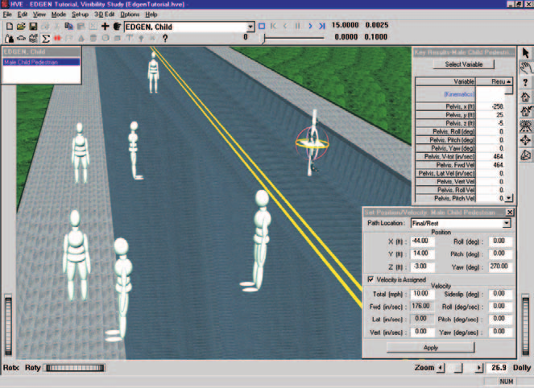

*Figure 5-6: The second EDGEN event ready to execute. The child has been positioned at eight positions defining its path from the aisle of the school bus, out onto the sidewalk and out onto the street.*

> **NOTE:** When you enter the final seven positions, HVE automatically turns on Show Targets. You might wish to choose Hide Targets from the Options menu to illustrate the results. You'll also notice a significant increase in execution speed. The increase is the result of fewer humans being rendered.

We have now completed the second event.

### Third Event: Ford Taurus

Let's set up and execute the final EDGEN event involving the oncoming Ford Taurus:

1. Click *Add New Object*. The Event Information dialog is displayed.
2. Select *Ford Taurus* from the Active Vehicles list. The vehicle is added to the Event Humans and Vehicles list.
3. Select *EDGEN* from the *Calculation Method* options list.
4. Edit the default name for the event, enter `Taurus`.

   > **NOTE:** HVE will append the name of the calculation method to the event name, thus the complete event name will become "EDGEN, Taurus."

5. Press *OK* to display the Event Editor.

Now, we're ready to set up the event. This step involves placing the vehicle in the environment:

1. Using the Event Editor dialog, select *Ford Taurus* from the Event Humans & Vehicles list.
2. Choose *Set-up* from the menu and select *Position/Velocity*. The vehicle is displayed at the earth-fixed origin.
3. Using the procedures for positioning objects outlined in the previous two events (by now, you're becoming an expert!), enter the initial and final positions for the Taurus as shown in Table 5-2, below:

**Table 5-2: Position and velocity entries for EDGEN Taurus event**

| Position | X (ft) | Y (ft) | Yaw (deg) | Vtotal (mph) |
|---|---|---|---|---|
| Initial | 500.0 | 13.0 | 180.0 | 35.0 |
| Final/Rest | -38.5 | 13.0 | 180.0 | 35.0 |

The required positions and velocities have now been entered. Let's increase the default maximum simulation time:

1. Click on the Options menu and choose *Simulation Controls*. The Simulation Controls dialog is displayed.
2. Edit the *Maximum Time*, changing it from `5` to `15` seconds.
3. Press *OK* to update the simulation controls.

We're now ready to execute our final event. Perform the following steps:

1. Using the Event Controller, click *Play* to execute the event. Allow the event to run until the Taurus reaches its position at impact at t=10.4922 seconds.

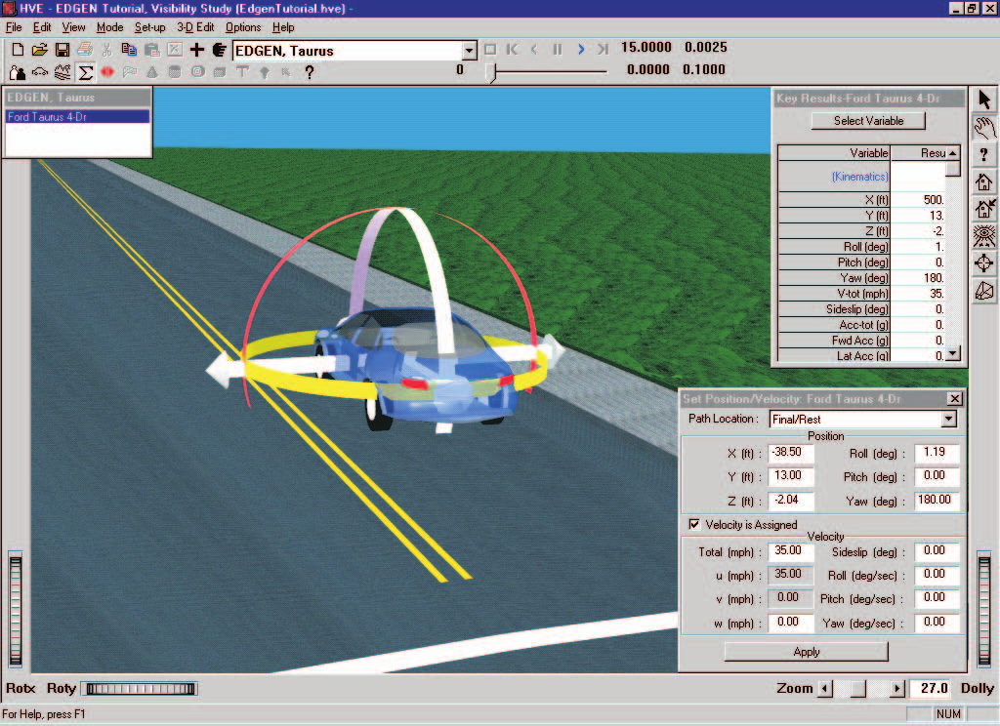

*Figure 5-7: The third EDGEN event ready to execute. The Ford Taurus has been positioned at its initial and impact positions.*

We have now completed all three events for our EDGEN Tutorial.

## Viewing Results

Now that we have produced our individual EDGEN events, let's take a detailed look at the results. The Playback Editor is used for reviewing and printing reports for each event in the current case, as well as for producing video output.

EDGEN produces the following reports:

- **Messages** — A list of messages produced by the current run
- **Accident History** — A table of initial and final positions and velocities
- **Program Data** — A table containing program control information
- **Variable Output** — A table containing time-dependent simulation results
- **Trajectory Simulation** — A 3-D visualization of the event

We're also going to illustrate how the Playback Editor is used for combining multiple events into a single, coherent sequence including multiple humans and vehicles. In our tutorial, we'll create a Playback Window illustrating the entire sequence of events:

- First, the school bus will approach the intersection and come to a stop.
- As the bus slows, the child will walk up the center aisle of the bus. When the bus is stopped, the child will exit and walk around the back of the bus, out into oncoming traffic.
- Finally, the approaching Ford Taurus will move into the position where the child was struck. At the completion of these events, as viewed in the Playback Window, the cause of the accident will be obvious.

To view the output reports, we need to be in Playback mode:

1. Choose *Playback Mode*. The Playback Editor is displayed.

### Report Windows

The reports listed above are displayed by selecting Report Windows. Each Report Window contains an individual report.

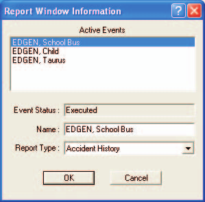

*Figure 5-8: Report Window Information dialog, showing the name of the event(s) in the current case.*

To view the reports produced by any of the three EDGEN events, perform the following steps:

1. Click *Add New Object*. The Report Window Information dialog is displayed and includes a list of the active events (*'EDGEN, School Bus', 'EDGEN, Child'* and *'EDGEN, Taurus'* are the events we created for this tutorial). The Report Window Information dialog also includes the user-editable *Report Window Name* text field and *Selected Output* option list.
2. Select the desired event from the Active Events list.
3. Click on the *Selected Output* option list and select any of the available reports for the event.
4. Press *OK* to display the report.

The selected report will be displayed in a resizable window.

In alpha-numeric reports, the font size used in each report is user-editable. To change the font size, select *Preferences* under the *Options* menu. Then use the font size drop-down menu to select the desired font size. This will also change the font size for printed reports.

The following sections illustrate the reports produced for various EDGEN events in this tutorial.

#### Messages Report

EDGEN produces several messages, depending on the outcome of the run. For a complete list and explanation of these messages, refer to [Chapter 6](06-messages.md).

To view the Messages report produced by the *EDGEN, Taurus* event, perform the following steps:

1. Click *Add New Object*. The Report Window Information dialog is displayed.
2. Select *EDGEN, Taurus* from the Active Events list.
3. Click on the *Selected Output* option list and choose *Messages*.
4. Press *OK*.

The Messages report is displayed for the *EDGEN, Taurus* event.

*Figure 5-9: Messages Report for EDGEN, Taurus.*

#### Accident History Report

The Accident History report displays the positions and velocities for the human or vehicle at each entered position (e.g., *Initial, Begin Perception*).

To view the Accident History report for the *EDGEN, School Bus* event, perform the following steps:

1. Click *Add New Object*. The Report Window Information dialog is displayed.
2. Select *EDGEN, School Bus* from the Active Events list.
3. Click on the *Selected Output* option list and choose *Accident History*.
4. Press *OK*.

The Accident History report is displayed for the *EDGEN, School Bus* event.

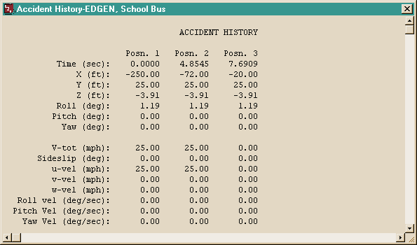

*Figure 5-10: Accident History Report for EDGEN, School Bus.*

> **NOTE:** The Accident History report is wider than the default size of the viewer. Resize the window, change the font size (Options - Preferences) or use the scroll bars to view the remainder of the report.

> **NOTE:** The report can be printed in landscape mode (under Options on the Print menu) using 10 point font size.

#### Program Data Report

The Program Data report displays the simulation controls (calculation time steps and termination conditions), including Program Name, Version, Object Name, Max Run Time, Calculation Interval, Output Interval, Linear Term Vel and Path Model.

To view the Program Data report for the *EDGEN, Taurus* event, perform the following steps:

1. Click *Add New Object*. The Report Window Information dialog is displayed.
2. Select *EDGEN, Taurus* from the Active Events list.
3. Click on the *Selected Output* option list and choose *Program Data*.
4. Press *OK*.

The Program Data report is displayed for the *EDGEN, Taurus* event.

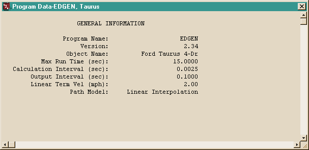

*Figure 5-11: Program Data Report for EDGEN, Taurus.*

#### Variable Output Report

The Variable Output table displays all the time-dependent results computed by EDGEN. To view the Variable Output report for the *EDGEN, Taurus* event, perform the following steps:

1. Click *Add New Object*. The Report Window Information dialog is displayed.
2. Select *EDGEN, Taurus* from the Active Events list.
3. Click on the *Selected Output* option list and choose *Variable Output*.
4. Press *OK*.

The Variable Output report is displayed for the *EDGEN, Taurus* event. The table initially contains all of the variables that were displayed in the Key Results window. You may, however, wish to select additional variables or change the order in which the variables are listed (important for graphing).

##### Variable Selection

The purpose of our EDGEN study is to evaluate the avoidability of the accident based on speeds and visibility. To document the path positions of the Taurus as a function of time, let's select only the position, velocity and acceleration from the Variable Selection dialog:

1. Click on *Select* in the Variable Output window. The Variable Selection dialog is displayed.
2. Click on *Clear Selection* to clear all of the variables that were listed in the Key Results window.

The Object Name option list displays the vehicle name, *Ford Taurus 4-Dr*. The *Kinematics* output group is the default selection and the Kinematics Variables list is displayed. Let's add several position variables to the Key Results window:

3. Select *X, Y, Z, Roll, Pitch, Yaw, V-tot, Sideslip, Acc-tot, Fwd Acc,* and *Lat Acc* from the list.
4. Press *OK* to add the selected variables to the Variable Output window.

The Variable Output report for the *EDGEN, Visibility Study* event now includes position, velocity and acceleration for the Ford Taurus, plus any other variables you may have added.

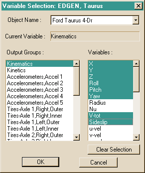

*Figure 5-12: Variable Selection dialog, used for selecting the results displayed in the Output Report.*

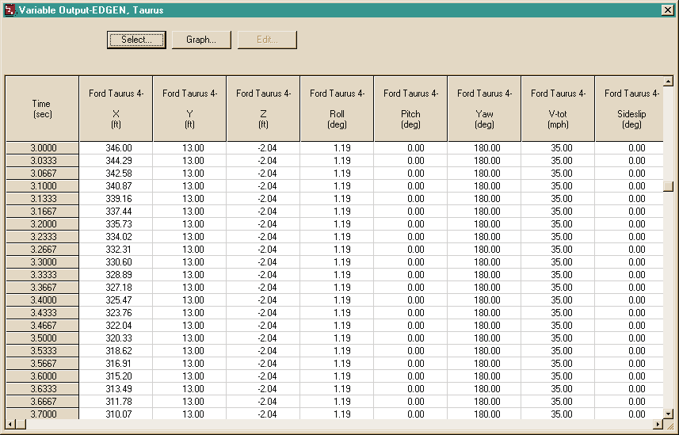

*Figure 5-13: Variable Output Report for EDGEN, Taurus, displaying the selected results.*

#### Trajectory Simulation Report

The Trajectory Simulation report is a dynamic visualization, much like the Event viewer, controlled by the Playback Controller.

> **NOTE:** A significant difference between the simulation in the Event Editor and the Playback Editor is that no calculations take place in Playback mode.

To view the Trajectory Simulation for the *EDGEN, School Bus* event, perform the following steps:

1. Click *Add New Object*. The Report Window Information dialog is displayed.
2. Select *EDGEN, School Bus* from the Active Events list.
3. Click on the *Selected Output* option list and choose *Trajectory Simulation*.
4. Press *OK*.

The Trajectory Simulation viewer is displayed for the *EDGEN, School Bus* event. The vehicle is shown at its initial position. To visualize the motion, perform the following steps:

1. Click *Play* (single right-arrow). The simulation begins and is displayed at the current Playback output interval.
2. Click *Pause*. The simulation stops.
3. Click *Reverse* (single left-arrow). The simulation plays in reverse.
4. Click *Rewind* (left arrow with bar). The simulation returns to the start.

Repeat the above steps to create Trajectory Simulation windows for the *EDGEN, Child* and *EDGEN, Taurus* events.

Spend a few moments watching the Trajectory Simulation windows for each of these events.

> **NOTE:** The motion in all of the Trajectory Simulation events is controlled by the Playback Controller.

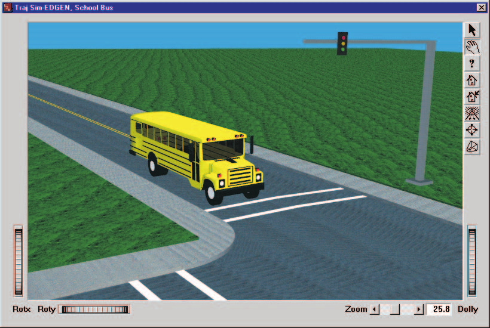

*Figure 5-14: Trajectory Simulation Report for EDGEN, School Bus, displaying the vehicle motion.*

### Playback Window

Finally, let's create a Playback Window. The difference between Report and Playback Windows is that, while Report Windows contain results from a single event, the Playback Window (note there is only one Playback Window) contains trajectory simulations from each selected event. In our case, the Playback Window displays the entire sequence, beginning with the bus as it approaches the bus stop, continuing as the child exits the bus, and ends with the child running out in front of the oncoming Ford Taurus.

To display the Playback Window, perform the following steps:

1. Click on Options, *Add Playback Window*. The Playback Window dialog is displayed and includes a list of the active Trajectory Simulation Windows (*'EDGEN, School Bus', 'EDGEN, Child'* and *'EDGEN, Taurus'* are the events we created for this tutorial). The dialog also includes the user-editable *Playback Window Name* text field and event timing parameter fields. The objects from the events appear in the window.
2. As default, all three Trajectory Simulations are selected, as indicated by the checks in the boxes beside the event names.
3. Edit the default name for the Playback Window; enter `Visibility Study`.

#### Editing the Event Sequence

The *EDGEN, Child* event lasted 13.7048 seconds. However, the *EDGEN, Taurus* event lasts only 10.4922 seconds. As a result, if we combine these two events together, the Taurus will arrive too early.

To synchronize the events, edit the $T_{delay}$ field of the Taurus event at the bottom of the Playback Window. The adjustment is as follows:

$$T_{Delay} = T_{Event1} - T_{Event2} = 13.7048 - 10.4922 = 3.2126 \text{ seconds}$$

Enter `3.2126` in the $T_{delay}$ field of Taurus, followed by \<Enter\>. The time values for the table are adjusted accordingly.

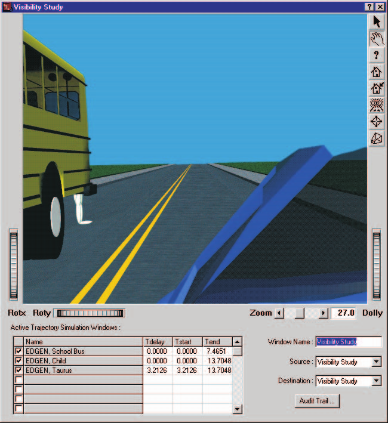

*Figure 5-15: Playback Window Report for EDGEN Tutorial, Visibility Study. The child appears from behind the bus at t=13.1 seconds (about 0.6 seconds before impact). It is clear the Taurus could not stop from a speed of 35 mph in time to avoid the child.*

#### Setting the View

Just as the Trajectory Simulation Windows inherit the camera position from Event mode, the Playback Window also inherits the camera from the last Trajectory Simulation Window. Let's attach the camera to the Ford Taurus so we can assess the driver's opportunity to observe and react to the child crossing the street.

To assign the camera for our Playback Window, perform the following steps:

1. Choose *Set Camera* from the View menu. The Camera dialog is displayed.
2. Click on the *View From This Object* option list and choose *Ford Taurus*.
3. Enter the desired camera coordinates, X = `-2.0` ft, Y = `-2.0` ft, Z = `-2.0` ft.
4. Click on the *Look At This Object* option list and choose *Ford Taurus*. Enter the desired picture center coordinates, X = `100.0` ft, Y = `-2.0` ft, Z = `-2.0` ft.

   > **NOTE:** The above Camera and Picture Center coordinates result in a view axis pointing straight ahead in the vehicle-fixed x direction.

5. Press *OK* to update the camera information.

   > **NOTE:** After attaching the camera to the Ford Taurus, you could also use the Playback Window's viewer controls (thumb wheels and sliders) to set the view interactively.

The scene is now rendered as it appears from within the Ford Taurus. The scene is quite dark because the windshield is tinted. However, you can still see the school bus in the distance.

Let's move the camera position just outside the vehicle, just outside the driver-side door glass:

1. Click on the *manipulate* mode icon in the Playback Window viewer (in the upper right corner of the viewer). The hand icon is highlighted, indicating the viewer is in manipulate mode.
2. Place the mouse in the middle of the Playback viewer. The mouse cursor is shaped like a hand.
3. Click on the middle mouse button and drag the mouse to the right. The view changes until the camera is outside the car.

If *Show Targets* is selected under the Options menu, we would like to deselect it so that we see the event sequence as the Taurus driver would have seen it.

4. Under the Options menu, make sure that Show Targets is not selected.

Now, play the sequence and watch as the Taurus approaches the School bus.

Figure 5-15 shows the view as the child first appears from behind the school bus at t=13.1 seconds, about 0.6 seconds before impact.

### Video

Our Playback Window shows us the sequence, but a desktop computer is not capable of displaying the computed motion in real time. To view the sequence in real time, we must create a movie file.

> **NOTE:** Your video device and drivers must be installed in order to proceed. If your device and drivers are not installed, please refer to your User's Manual, Section Nine: Video Output. Chapter 27, Using the Video Interface, describes how to use the Video Set-up dialog to install your video device.

> **NOTE:** The video compression that you choose will depend on your device. Refer to both your computer's Owner's Manual and your User's Manual for more details.

Currently, your Playback Controller indicates both the Source and Destination for the Playback Window is the sequence we just created, *Visibility Study*. To create the movie file, perform the following steps:

1. Click the *Reset* button to return the Playback Window to the start of the sequence.
2. Click on the *Destination* options list and choose *AVI*.
3. Click *Play*. The sequence in the Playback Window is recorded to disk, one frame at a time. It will be saved in the file *default.avi*.

The process of recording each frame to disk will vary in time, depending on your computer. Also, if you choose a different compression option or increase the Render Quality or Anti-aliasing level, it will take longer to record. After HVE/HVE-2D has recorded the sequence to your hard disk, you can play it back in real time. To play the sequence in real time, perform the following step:

1. Click on the *Source* option list and choose *AVI*. The Destination will automatically become *Untitled Playback Window*.
2. Click *Play*. The sequence is displayed in the Playback Window in real time.

For more information about using your compression options and other video subsystem components, refer to your User's Manual, Section Nine: Using the Video Interface.

### Printing

The final step is to print the above reports. Printing reports is simple. All you do is choose a report and print it. For example:

1. Click on the dialog header of the Playback Window, entitled *Visibility Study*. The Playback Window pops to the top of the display (if it isn't there already) and the header bar turns blue, indicating it is the current window.
2. Click on the *File* menu and choose *Print*. The Print dialog is displayed, allowing the user to select from several available print options.

   > **NOTE:** Alternatively, you can click on the print icon in the upper menu bar.

3. Press *OK*. The Playback Window report is printed on the system printer.

That's all there is to it! You can print any other report using the same three steps described above.

> **NOTE:** Printing this view on your color printer creates a very powerful illustration.

> **NOTE:** The Print dialog provides several options. Refer to the User's Manual for more information.

> **NOTE:** For several reports it may be best to print in landscape rather than portrait mode.

> **NOTE:** The font size of both the printed reports and screen display may be edited by clicking on the Options menu and choosing Preferences. Use the Font Size option list to change the size.

<!-- NAV -->

---

← Previous: [Chapter 4 — Calculation Method](04-calculation-method.md)  |  [Index](README.md)  |  Next: [Chapter 6 — Messages](06-messages.md) →

<!-- /NAV -->
