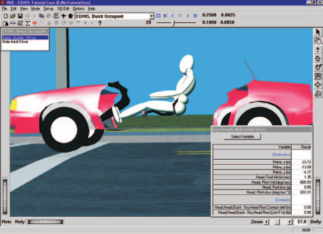

# Chapter 1 — EDHIS Program Description

## Overview

**EDHIS** (**E**ngineering **D**ynamics Corporation **H**uman **I**mpact **S**imulator) is a 3-dimensional analysis of the response of a human occupant or pedestrian during a motor vehicle collision. EDHIS is based on the HSRI-3D model [2,3] developed at the University of Michigan Transportation Research Institute, and includes several extensions and refinements produced by Engineering Dynamics Corporation [1,6]. The model was developed as a tool to study advanced safety concepts and designs of seat restraint systems from the viewpoint of occupant protection [2]. EDHIS employs airbag and belt (torso and lap) models useful for studying issues related to restraint system effectiveness. EDHIS is useful for predicting and visualizing occupant and pedestrian motion during impact. The model also provides important injury predictions, including HIC, Chest SI and Maximum Femur Load.

EDHIS computes human kinematics (position, velocity and acceleration vs time), joint angles and torques, and contact force between the human and vehicle.

The EDHIS human model includes 12 degrees of freedom. The human is represented by three inertial segments (head, torso and lower extremities) and 2 joints (neck and hip). The body is visualized using the HVE 15-segment, 14-joint model by combining the head and neck into a single segment called the head; the HVE pelvis, abdomen and chest are combined to form the EDHIS torso; and the right and left upper legs, lower legs and feet are combined to form the lower extremities. 3-dimensional ellipsoids may be attached to any of these three segments to sense force-producing interactions with the vehicle interior or exterior.

*Figure 1-1: EDHIS Event.*

The motion of the vehicle is defined by a 6 degree-of-freedom collision pulse (acceleration vs time history). The vehicle has attached to it a number of planar contact surfaces that may be arranged to form interior surfaces, such as seats, dashboards and windshields, and exterior surfaces, such as bumper, grill, hood and windshield. Forces are applied to the human whenever interaction is sensed between the human ellipsoids and the vehicle contact surfaces.

The motion and forces resulting from human vs vehicle interactions are recorded as EDHIS output tracks; the resulting motion is also visualized in the 3-D HVE visualization environment.

## Model Inputs

EDHIS inputs include one human, one vehicle, and an optional environment. Event set-up parameters include initial position and velocity for the human and vehicle, a collision pulse (the source may be a user-entered table or taken directly from another HVE event, such as EDSMAC4 [5]), an optional inhibition of selected human ellipsoid vs vehicle contacts, and restraint system in-use factors.

## Model Outputs

EDHIS output reports include the Accident History, Event Data, Human and Vehicle Data, Injury Predictions, Variable Output and Trajectory Simulation.

## Validation

EDHIS was validated first by direct comparison with HSRI-3D to ensure the basic model was intact after porting the original FORTRAN code to C and making the model HVE-compatible. Additional validation was performed comparing EDHIS results to other models as well as direct comparison with staged collision tests. Validation results are reported in reference 1.

## Basic Procedure

The procedure for using EDHIS is substantially the same as using any simulation model in the HVE environment:

1. Use the Human Editor to add one or more humans to the case. Optionally, edit the human properties.
2. Use the Vehicle Editor to add one or more vehicles to the case. Assign interior (occupant) or exterior (pedestrian) contact surfaces to each vehicle. Optionally, add a restraint system (belt and/or airbag) at the occupant seat position.
3. Optionally, use the Environment Editor to create a visual environment.

   > **NOTE:** Although an environment is unnecessary, it provides a visual context for the movement of objects computed by EDHIS.

4. Use the Event Editor to set up and execute the EDHIS simulation model by performing the following steps:
   - Choose one human from the Active Humans list
   - Choose one vehicle from the Active Vehicles list
   - Choose the EDHIS calculation model
   - Position the vehicle in the environment at its initial position, and supply an initial velocity
   - Position the human in the vehicle (for occupants) or in the environment (for pedestrians), and supply an initial velocity
   - For occupant simulations, assign a collision pulse
   - Optionally, assign human vs vehicle contact inhibitions
   - Optionally, assign belt and/or airbag restraint system usage parameters
5. Execute the EDHIS event.
6. Edit and re-execute the event, if necessary, to achieve the desired match between simulation results and the actual event.
7. Finally, use the Playback Editor to view the various reports and trajectory simulations. If desired, use the Playback Window to produce a simulation movie of the simulation.

---
*Next: [Chapter 2 — EDHIS Program Input](02-program-input.md)*

<!-- NAV -->

---

← Previous: [EDHIS — Human Impact Simulator](README.md)  |  [Index](README.md)  |  Next: [Chapter 2 — EDHIS Program Input](02-program-input.md) →

<!-- /NAV -->
