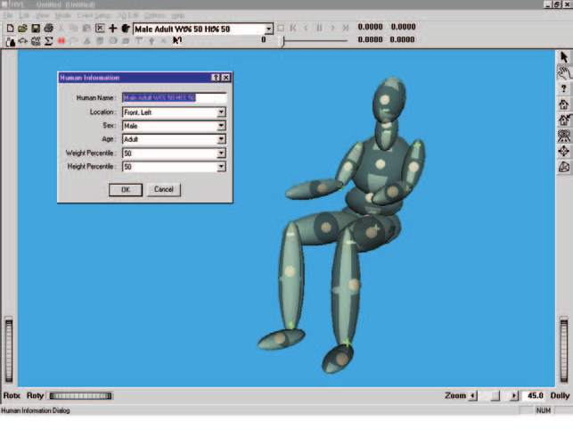
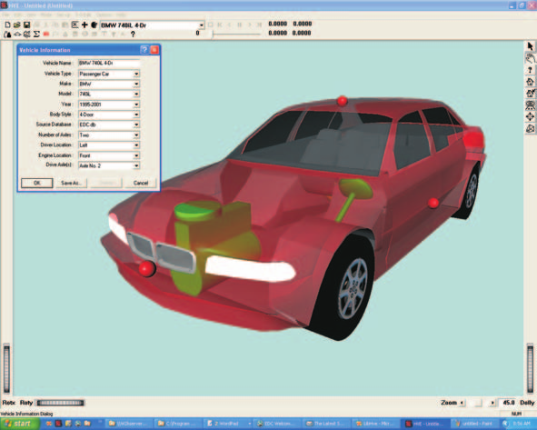
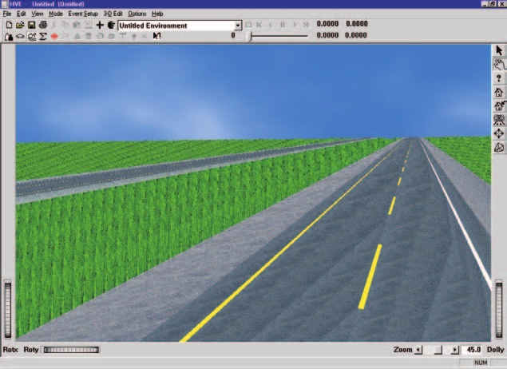
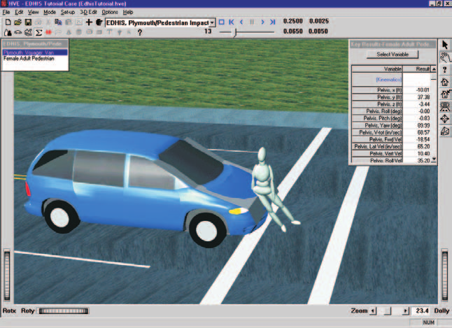
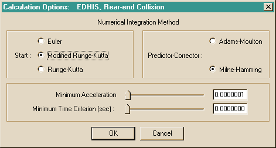
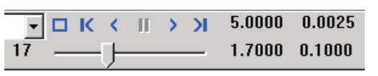

# Chapter 2 — EDHIS Program Input

This chapter defines the objects (humans, vehicles and environment) and the event set-up parameters (positions, damage profiles, driver controls, and so forth) used by the EDHIS analysis. The chapter is divided into the following sections:

- **Objects** — The number of humans and vehicles, and the specific human and vehicle parameters actually used by EDHIS.
- **Events** — The various HVE options available for setting up and executing an EDHIS event.

## Objects Overview

The objects used by the EDHIS model are:

- **Humans** — One human, either an occupant or a pedestrian, may be studied by EDHIS.
- **Vehicles** — One vehicle may be studied by EDHIS.
- **Environment** — Like the *real* world, EDHIS has exactly one environment.

> **NOTE:** The environment is used in any HVE-compatible reconstruction or simulation model.

The following sections describe how these humans, vehicles and environment provide the required inputs to the EDHIS calculation model.

## Humans

EDHIS uses one human created using the Human Editor (see the [Human Editor pages](../../07-humans/Human.md)). Humans are selected from the Human Database by choosing the following attributes:

- **Location** — The user may choose from any available occupant position (i.e., *R/F*, *L/F*) or, alternatively, choose *Pedestrian*.

  > **NOTE:** If an occupant position is selected, HVE displays the human's motion relative to the vehicle; if Pedestrian is selected, its motion is relative to the earth.

- **Sex** — The user may choose *Male* or *Female*.
- **Age** — The user may choose *Adult* or from a list of child ages.
- **Weight Percentile** — The user may choose from a list of available percentiles.
- **Height Percentile** — The user may choose from a list of available percentiles.

To add a human to the current HVE case, perform the following steps:

1. Choose Human Mode. The Human Editor is displayed.
2. Click *Add New Object*. The Human Information dialog is displayed.
3. Click on the *Location* option list and select a location for the current human.

   > **NOTE:** If you choose R/F, L/F, etc., the human will be a vehicle occupant. If you choose Pedestrian, the human will be a pedestrian.

4. Click on the *Sex*, *Age*, *Weight Percentile* and *Height Percentile* option buttons to choose a human from the database.
5. Enter a name for the current human. A default name is supplied for each selected human. Its name is user-editable, and does not affect calculations.

   > **NOTE:** Duplicate human names are not allowed in the same case.

6. Click *OK* to add the human to the current case.

*Figure 2-1: HVE Human Editor.*

The following Human Parameter groups are used by EDHIS:

- Inertias
- Ellipsoids
- Joints
- Injury Tolerance

The EDHIS human is modeled by 3 mass segments (Head, Torso and Legs) connected by 2 ball-type joints (Neck and Hip). Refer to Chapter 4, Calculation Method, for important details describing how the EDHIS human model is derived.

The specific data in each of the above parameter groups that are actually used by EDHIS are defined in Tables 2-1 and 2-2.

> **NOTE:** For information about using the Human Editor to create and edit humans, refer to the HVE User's Manual, Human Editor section (see `docs/manuals/07-humans/`).

### Inertias

The Human Inertial Data used by EDHIS are shown in Table 2-1. EDHIS combines the pelvis, abdomen and chest masses into a single mass, named the Torso. The neck and head are combined into a single mass, named the Head, and the upper left and right legs are combined into a single mass, named the Legs. The parallel axis theorem is used to compute moments of inertia for the combined masses about the total resultant center of gravity for the combined segments.

### Ellipsoids

Ellipsoids are used for predicting contact forces between the human and vehicle. Penetration of an ellipsoid into a vehicle contact surface results in the calculation of force on the human.

The Human Ellipsoid Data used by EDHIS are shown in Table 2-1. HVE allows up to 3 ellipsoids per HVE segment; EDHIS allows up to 25 total ellipsoids. The user should consider the following issues related to differences between the HVE Human Model and the EDHIS human model:

- Because the HVE Upper and Lower Arm segments are ignored, any ellipsoids attached to these segments are also ignored.
- Because the lower legs and feet are ignored, any lower extremity ellipsoids (e.g., Knee, Shin or Foot) should be attached to the upper leg segments.
- HVE allows the ellipsoids' principal axes to be rotated relative to the segment axis system; EDHIS does not consider such rotations.

  > **NOTE:** If principal axes are rotated and you choose to show contact surfaces, you will not be looking at a true picture of the human-vehicle interaction. However, the forces will be correctly calculated according to the inputs being considered.

### Joints

Joints are used to connect together each of the 15 segments. Although the HVE Human has 14 joints, EDHIS defines only 2: the *Neck* and *Hip*. The Neck joint is C7-T1, located between the Chest and Neck segments. The Hip joint is the average of the Right Hip and Left Hip. These joints are located between the Pelvis and Upper Leg (Right and Left) segments.

The Human Joint Data used by EDHIS are shown in Table 2-1. Both joints are considered to be *ball-and-socket* joints having 3 degrees of freedom (roll, pitch and yaw).

**Table 2-1 — Human Inertial, Ellipsoid and Joint Parameters Used by EDHIS.** The following parameters are supplied to each of the 15 human segments and 14 joints.

| Parameter | Description |
|---|---|
| Weight | Weight of each segment |
| Roll, Pitch and Yaw Moments of Inertia | Rotational inertia of each segment about the segment-fixed i, j, k axes, respectively |
| Ellipsoid Name | Up to 30 characters, used to identify the ellipsoid |
| Ellipsoid Center i,j,k Coords | Coordinates of the center of the ellipsoid, defined relative to the segment principal axis system |
| Ellipsoid Semi-axis i,j,k Length | Half the ellipsoid length, defined in the ellipsoid principal axis system |
| Joint k Location | Distance from segment CG to joint along the segment-fixed k axis |
| Joint roll, pitch and yaw stop angles | Articulation roll, pitch and yaw angles at which joint stop properties are applied |
| Stop Elasticity, i, j, k axes | Elasticity of the joint stops for roll, pitch and yaw rotations. Applies to both (+) and (−) directions |
| Linear Elastic Coefficient | Elastic properties for the joint in the normal range of motion (i.e., between the joint stops) |
| Damping Constant | Damping properties for the joint |
| Maximum Joint Angles | Injury tolerance for joint rotations beyond the joint stops |

The Joints are assumed to be located at $i = j = 0.0$ ($k$, the vertical distance from the segment origin to the joint, is used to locate the joint). If $i$ or $j$ is non-zero, the human will not be visualized as it is used in the EDHIS model.

> **NOTE:** You can ensure that the joints are correctly located for EDHIS by clicking on the Hip, Abdomen, Chest, Neck and Head segments and setting i equal to zero for each joint. Although j is left with its original values, calculations are not affected as long as matching ellipsoids are placed on right and left legs.

### Injury Tolerance

Injury tolerances may help estimate the propensity for an injury during a crash. EDHIS compares the current levels of force and acceleration to these injury tolerances to produce the Injury Data Report (see Output).

The Human Injury Tolerance Data used by EDHIS are shown in Table 2-2. These values are based on reported tolerances [2, 4] for healthy humans. Although age and other factors can affect human injury tolerance, these values should be modified only with the greatest of care.

**Table 2-2 — Injury Tolerance Values for current human (see References 2 and 4).**

| Parameter | Description |
|---|---|
| HIC | Head Injury Criterion |
| Head Pitch Concussion | Injury tolerance for head angular acceleration about the pitch axis |
| Head Side Acceleration | Injury tolerance for head side acceleration |
| Chest Severity Index | Injury tolerance for chest |
| Chest Force | Injury tolerance for chest force |
| Chest Forward Acceleration | Injury tolerance for chest forward acceleration |
| Maximum Femur Load | Injury tolerance for femur load |
| Maximum Torso Belt Force (Left, Right) | Injury tolerance for torso belt force, entered separately for the left and right torso belt sections |
| Maximum Lap Belt Force (Left, Right) | Injury tolerance for lap belt force, entered separately for the left and right lap belt sections |

*(updated: in the current HVE human model (`Physics/Include/HUMAN.H`, `HumanTolerance`), the belt injury tolerances are stored as four separate values — `LeftLap`, `LeftTorso`, `RightLap`, `RightTorso` — rather than the single combined torso and lap values described in the original manual.)*

## Vehicles

EDHIS uses one vehicle created using the HVE Vehicle Editor. Vehicles are selected from the Vehicle Database by choosing the following attributes:

- **Type** — EDHIS supports the following vehicle types: *Passenger Car, Pickup, Van, Sport-Utility, Truck* and *Movable Barrier*.
- **Make** — EDHIS supports all available vehicle makes.
- **Model** — EDHIS supports all available vehicle models, within the limits defined by number of axles and drive axles; see below.
- **Year** — EDHIS supports all available vehicle years.
- **Body Style** — EDHIS supports all available vehicle body styles.

Each vehicle also has the following additional user-editable parameters:

- **Driver Location** — The driver location is used by EDHIS to determine if the airbag is a driver-type or a passenger-type airbag (a passenger-type airbag is modeled as a cylinder, whereas a driver-type airbag is modeled as a sphere).
- **Engine Location** — The engine location is not used by EDHIS.
- **Number of Axles** — EDHIS supports 2- and 3-axled vehicles.
- **Drive Axle(s)** — The drive axle attribute is not used by EDHIS.

To add a vehicle to the current HVE case, perform the following steps:

1. Choose Vehicle Mode. The Vehicle Editor is displayed.
2. Click *Add New Object*. The Vehicle Information dialog is displayed.
3. Click on the *Type, Make, Model, Year* and *Body Style* option buttons to select a vehicle from the database.
4. If desired, modify the *Driver Location, Engine Location, Number of Axles* and *Drive Axle(s)* for the current vehicle.
5. Enter a name for the current vehicle. A default name is supplied for each selected vehicle. Its name is user-editable, and does not affect calculations.

   > **NOTE:** Duplicate vehicle names are not allowed in the same case.

6. Click OK to add the vehicle to the current case.

*Figure 2-2: HVE Vehicle Editor.*

The following Vehicle Parameter groups are used by EDHIS:

- Move CG
- Contact Surfaces
- Belt Restraints
- Airbag Restraints

The specific data used in each of the above parameter groups are defined in Tables 2-3 through 2-5.

### Sprung Mass

Remember, EDHIS is not a *vehicle* simulator! The motion of the vehicle is determined by a user-supplied collision (acceleration) pulse, along with initial vehicle position and velocity. Therefore, the vehicle data required by EDHIS is limited to that which is required to establish interaction forces between the human and vehicle.

#### Inertias

Inertial parameters are not used by EDHIS. The vehicle's motion is supplied by assigning an initial velocity and a collision pulse (see Event Editor).

**Table 2-3 — Vehicle Parameters Used by EDHIS.**

| Parameter | Description |
|---|---|
| Move CG x,y,z | Relocates the CG in the vehicle-fixed x, y and z directions. This entry causes an automatic adjustment of all vehicle coordinate-related parameters (e.g., contact surface, belt anchor points) |
| Contact Surface Name | Up to 30 characters, used to identify the contact surface |
| Contact Surface Location | Interior or Exterior; provides the default status that determines whether a contact surface is allowed or ignored during force calculations (see also Event Set-up Parameters, Contacts) |
| Contact Surface x,y,z corner coordinates | Vehicle-fixed x,y,z coordinates for three consecutive corners of the current contact surface, supplied in a counter-clockwise order. The positive side of the surface is specified by the right-hand rule |
| Contact Surface Linear Stiffness | Linear stiffness of the ellipsoid vs contact surface pair |
| Contact Surface Quadratic Stiffness | Second-order stiffness of the ellipsoid vs contact surface pair |
| Contact Surface Cubic Stiffness | Third-order stiffness of the ellipsoid vs contact surface pair |
| Contact Surface Damping Constant | Velocity-dependent damping properties between the ellipsoid and contact surface |
| Contact Surface Maximum Penetration | Determines if the ellipsoid is approaching the surface from the back side (see Corner Coordinates, above). If the ellipsoid surface is initially behind the contact surface and the distance is greater than this value, it is assumed the ellipsoid is not contacting the surface and no force calculations are performed |
| Contact Surface Maximum Force | If the current force exceeds this value, the surface begins to unload |
| Contact Surface Edge Constant | Determines the fraction of contact force if a portion of the ellipsoid lies outside the boundary of the contact plane |
| Contact Surface Unloading Slope | The linear elastic property during unloading |

#### Move CG

Move CG is not directly used by EDHIS. Its current value does not show up in the results. However, the Move CG fields may be used to quickly move the vehicle's center of gravity; the x,y,z coordinates for the contact surfaces, belt anchor points and airbag location are updated to reflect the new location.

#### Geometry File

The geometry file plays no role in the EDHIS calculations. However, there are some smart things that may be done for occupant simulation. Remembering that an occupant is inside the vehicle, and may be difficult to see, the following two suggestions will help greatly:

- Choose NoBody.h3d as the geometry file. As its name implies, NoBody.h3d is a null geometry file (it has all the required data structures, but no surface polygons), or
- Edit the vehicle's geometry file and remove the roof and roof supports.

  > **NOTE:** Remember to save the file with a new name, such as PCFordTaurus4DrSNoRoof.xxx, to avoid losing the original geometry file!

#### Contact Surfaces

Vehicle contact surfaces are the surfaces that interact with human ellipsoids to produce forces on the human. Up to 25 contact surfaces are allowed by EDHIS, the properties for which are shown in Table 2-3.

#### Belt Restraints

Belt restraints are an extremely important aspect of EDHIS's functionality. The ability to study the effect of restraint system usage (or non-usage) is an important one.

A belt restraint system may be supplied for up to nine seat positions. Although HVE assigns default positions for each belt system, these locations are arbitrary and may be replaced by user-entered information. Belt Parameters used by EDHIS are shown in Table 2-4.

> **NOTE:** At this point, you are saying the vehicle has a belt installed at a specific location. Whether or not the belt is used is event-dependent! See Event Set-up, Restraints, for more information.

**Table 2-4 — Vehicle Belt Restraint System Parameters used by EDHIS.**

| Parameter | Description |
|---|---|
| Seat Position | Seat position within vehicle (R/F, L/F, etc.) |
| Belt Section | Torso or Lap |
| Belt Anchor Point x,y,z Coords | Vehicle-fixed attachment point for the one end of the belt (the other end is attached to a human segment) |
| Belt Linear Stretch Rate | Linear stretch rate of the belt material |
| Belt Quadratic Stretch Rate | Second-order stretch rate of the belt material |
| Belt Cubic Stretch Rate | Third-order stretch rate of the belt material |
| Belt Damping Constant | Velocity-dependent contribution |
| Belt Breaking Strength | Maximum strength of the belt material. If the current force exceeds this value, it is set to zero |
| Belt Unloading Slope | Linear elastic property during unloading (should be greater than the loading rate) |

#### Airbag Restraints

Like belt restraints, airbag restraints are also an extremely important aspect of EDHIS's functionality.

An airbag restraint system may be supplied for up to nine seat positions. Like belt restraints, default positions for each airbag may be replaced by user-entered information. Airbag Parameters used by EDHIS are shown in Table 2-5.

> **NOTE:** At this point, you are saying the vehicle has an airbag installed at a specific location. Whether or not the airbag deploys is event-dependent! See Event Set-up, Restraints, for more information.

**Table 2-5 — Vehicle Airbag Restraint System Parameters used by EDHIS.**

| Parameter | Description |
|---|---|
| Seat Position for current airbag | Seat position within vehicle (R/F, L/F, etc.) |
| Airbag Center x,y,z Coords | Vehicle-fixed x,y,z coordinates of the airbag |
| Initial Bag Radius | Initial radius of the airbag |
| Passenger Bag Length | If a passenger seat position (i.e., no steering column), the airbag length |
| Initial Bag Pressure | Initial pressure inside the airbag |
| Bag Membrane Thickness | Thickness of the airbag material |
| Bag Full Inflation Volume | Volume of the airbag at full inflation |
| Bag Vent Discharge Coef | Thermodynamic discharge coefficient of vent |
| Bag Discharge Vent Area | Area of the vent |
| Bag Vent Opening Pressure | Pressure required to open the vent |
| Bag Penetration For Force | Minimum deflection of an ellipsoid into the airbag required to produce a force |
| Force Convergence Criterion | Allowable difference between force on airbag and force on human |
| Bag Elastic Modulus | Elastic modulus of the airbag membrane during force application |
| Bag Elastic Modulus on Rebound | Elastic modulus of the airbag during unloading |
| Bag Elastic Modulus When Bottomed Out | Elastic modulus of airbag at maximum penetration |
| Gas Density | Density of the fluid filling the airbag |
| Max Column Collapse Dist | Maximum column stroke before it bottoms out |
| Column Collapse Load | Force required to initiate column collapse |
| Column Angle | Pitch angle of the steering column |
| Backside Contact Surface | The name of the contact surface supporting the airbag (no force can exist between the human and airbag unless the airbag is supported on a contact surface that provides a reaction force) |

### Unsprung Mass

Unsprung Mass parameters (Wheel Location, Tire, Suspension and Brake) are not used by EDHIS.

> **NOTE:** Wheel location and tire size are used to visualize the vehicle, but play no role in the simulation's calculations.

### Exterior

The Vehicle Exterior Data (Exterior Dimensions, Stiffness) are not used by EDHIS.

### Steering System Data

Steering System Data are not used by EDHIS.

### Brake System Data

Brake System Data are not used by EDHIS.

### Drivetrain Data

Drivetrain Data are not used by EDHIS.

## Environment

EDHIS uses the environment created by the HVE Environment Editor. The environment is created by defining the following groups of attributes:

- Visual Data
- Physical Data

### Visual Data

The following visual parameters may be edited:

- **Environment Location** — A database containing the name (City/State/Country), Latitude and Longitude and GMT for the selected location.
- **Time and Date** — The local standard time and date for the event.
- **Angle of X Axis** — The angle of the earth-fixed X axis relative to true north.

The visual data are not used by the event; they are provided for studies related to visibility at the time of an event (e.g., avoidability of an accident).

> **NOTE:** The visual data (Location, Time, Date and Angle of earth-fixed X axis) affect the lighting of the event! Depending on your view (Camera Position) the scene may be shaded and difficult to see. If the time is after sundown, the view will be dark.

*Figure 2-3: Environment Editor.*

To add an environment to the current HVE case, perform the following steps:

1. Choose Environment Mode. The Environment Editor is displayed.
2. Click *Add New Object*. The Environment Information dialog is displayed.
3. Click on the *Location* combo box to select the desired city, state and country, and associated latitude, longitude and GMT.
4. Edit the *Time* and *Date* for the event.
5. Edit the *Angle of the X axis, Wind Speed* and *Direction*, *Barometric Pressure* and *Temperature* for the event.
6. Edit the *Gravity Constant* for the event.
7. Enter an environment name. A default name is supplied for the current environment. The name is user-editable, and does not affect calculations.
8. Click *OK* to add the environment to the current case.

### Physical Data

The Physical Data groups are:

- Wind Speed and Direction
- Atmospheric Temperature and Pressure
- Gravity Constant
- 3-D Surface Geometry

The specific physical environment data used by EDHIS are described below.

#### Angle Of X Axis

The angle of the X axis is used to position the earth-fixed coordinate system on the surface of the earth.

> **NOTE:** The angle is specified relative to true north. If you are using a compass to determine direction at the scene of an accident, you should provide a correction factor before entering this angle.

> **NOTE:** The angle of the X axis affects how you visualize an EDHIS event, but does not affect any calculations.

#### Wind Speed and Direction

Wind Speed and Direction are not used by EDHIS.

#### Atmospheric Temperature and Pressure

Atmospheric Temperature and Pressure are not used by EDHIS.

#### Gravity Constant

The gravity constant converts mass to force. An object's mass and rotational inertias are properties that are the same throughout the universe; however the weight of an object is dependent on the local gravitational constant.

#### 3-D Surface Geometry

The 3-D Surface Geometry is not used by EDHIS.

> **NOTE:** This means that a pedestrian will fall through the surface of the earth if you try to leave him/her standing for more than an instant! To avoid this problem, start your pedestrian simulation just before initial impact. Again, because EDHIS simulates only forces between the human and a vehicle, you'll have to end your pedestrian simulation when the human begins to interact with the ground surface.

## Event

EDHIS uses the HVE Event Editor to create, set up and execute an event. Each of these topics is described below.

### Creating An EDHIS Event

An EDHIS event is created using the Event Information dialog.

To create an EDHIS event:

1. Choose Event Mode. The Event Editor is displayed.
2. Choose *Add New Object*. The Event Information dialog is displayed.
3. Select one human from the Active Humans list.
4. Select one vehicle from the Active Vehicles list.
5. Select the calculation model, *EDHIS*, from the Calculation Model options list.
6. Click on Calculation Options and choose or set any options.
7. Enter an event name. A default name is supplied for the selected event. The name is user-editable, and does not affect calculations.

   > **NOTE:** Duplicate event names are not allowed in the same case.

8. Click OK to create the EDHIS event.

   > **NOTE:** If you choose an object that is not compatible with EDHIS, a message will be displayed describing the problem. You will not be allowed to proceed until EDHIS-compatible objects are selected.

### Setting Up an EDHIS Event

EDHIS uses the following *event set-up* options:

- Position/Velocity
- Collision Pulse
- Contacts
- Restraints

The specific Event Set-up data used by EDHIS are defined in Table 2-6.

*Figure 2-4: HVE Event Editor, setting up and executing an EDHIS event.*

#### Position/Velocity

Like all simulations, EDHIS requires initial positions and velocities to be supplied by the user.

The vehicle is positioned relative to the earth-fixed coordinate system by supplying the X,Y,Z coordinates of its CG, and roll ($\Phi$), pitch ($\Theta$) and yaw ($\Psi$) angles about vehicle x, y and z axes, respectively. The vehicle velocities are supplied in the form of a total velocity, sideslip angle and vertical velocity.

> **NOTE:** The vehicle-fixed u (forward) and v (side) velocity components are calculated using the total velocity and sideslip angle.

Human positions and velocities are assigned differently, depending on whether the human is an occupant or a pedestrian: Occupant positions and velocities are assigned relative to the vehicle-fixed coordinate system, while pedestrian positions and velocities are assigned relative to the earth-fixed coordinate system.

> **NOTE:** The same is true for output reports: All the kinematic data displayed in Variable Output is reported relative to the vehicle for occupants and the earth for pedestrians.

**Table 2-6 — Event Set-up Parameters used by EDHIS.**

| Parameter | Description |
|---|---|
| Vehicle Initial Position | The earth-fixed X,Y,Z coordinates and the roll, pitch and yaw orientations of the vehicle at the start of the run |
| Vehicle Initial Velocity | The forward, lateral and vertical linear velocities, and the roll, pitch and yaw angular velocities of the vehicle at the start of the run |
| Human Initial Position | The x,y,z coordinates and roll, pitch, yaw angles of the human at the start of the simulation |
| Human Initial Velocity | The forward, lateral and vertical linear velocities, and the roll, pitch and yaw angular velocities of the human at the start of the run |
| Vehicle Collision Pulse | Time-dependent table of the vehicle forward, lateral and vertical components of linear acceleration, and the roll, pitch and yaw angular accelerations |
| Contacts | A table of allowable interactions between human ellipsoids and vehicle contact surfaces |
| Belt Restraints In-Use Switch | Determines whether the selected belt restraint system (Torso or Lap) is in use |
| Segment Attachment | The name of the segment to which the belt ends are attached |
| Attachment Coordinates | The segment-fixed i,j,k coordinates for the belt attachment point |
| Belt Slack | Initial slack in the belt |
| Airbag Restraint In-Use Switch | Determines whether the airbag restraint system is in use |
| Airbag Begin Fill | Simulation time at which the airbag begins to fill |
| Fill Duration | Duration of filling before the gas shuts off |

The position of a human is defined by the center of gravity of its pelvis segment (this is called the *main segment*). Thus, the positions and velocities are actually those assigned for the pelvis. However, human positions may be further defined for each additional segment (i.e., *Head, Left Upper Leg*, and so forth) by $\Psi$, $\Theta$, $\Phi$ articulations (supplied in that order) at the joints. Angular velocities may be supplied as well.

EDHIS is a 3-mass, 2-joint model. Articulation angular positions and velocities may be entered by clicking on the neck segment (to set the initial conditions for the C7-T1, or Neck, joint), and by clicking on the Right and Left Upper Leg segments (to set the initial conditions for the Hip joint). These joints are modeled by EDHIS and their motion will be affected by subsequent human-vehicle interaction. Any of the other segment positions may be supplied as well (for example, the upper arms may be articulated so the human appears to be grasping the steering wheel). However, these joints will remain rigid during the simulation.

#### Driver Controls

The Driver Controls Data are not used by EDHIS.

#### Damage Profile

The Damage Profile Data are not used by EDHIS.

#### Payload

The Payload Data are not used by EDHIS.

#### Collision Pulse

The collision pulse provides the vehicle acceleration vs time history for the event. The data are provided in the form of a table. The current value of forward, side and vertical linear accelerations, and roll, pitch and yaw angular accelerations is obtained from this table using linear interpolation. Once obtained, the accelerations are integrated during each time step to determine vehicle velocity and position.

> **NOTE:** This approach, used in some form by all occupant and pedestrian impact simulation models, removes the need to provide a robust vehicle dynamics model.

> **NOTE:** HVE allows you to supply a collision pulse directly from a previously run EDSMAC4 event (or any event producing a collision pulse), as well as from a directory of user-saved collision pulses. See References 5 and 6 for additional information.

> **NOTE:** Because of the significant difference in the mass of a human compared to a vehicle, a collision pulse is not normally required for a pedestrian impact simulation. (Unfortunately, the vehicle does not slow down very much during impact.)

#### Contacts

The contacts dialog allows the user to selectively remove specific human ellipsoid vs vehicle contact surface interactions from consideration by the event. This practice is useful because every interaction requires computational overhead. Removing unnecessary calculations reduces calculation time.

By default, the Contacts dialog assumes interaction between every human ellipsoid and vehicle contact surface. When an ellipsoid name is selected from the ellipsoids listbox, all the vehicle contact surface names will be highlighted in the Contacts listbox. Click on any highlighted contact surface to remove it from consideration.

> **NOTE:** Actually, EDHIS does some pre-screening: If the current human is an occupant, only interior contact surfaces will be highlighted; if the current human is a pedestrian, only exterior surfaces will be highlighted.

#### Restraints

The Restraints dialog determines if a belt or airbag restraint system is in use for the current event.

> **NOTE:** If the current vehicle does not have a restraint system installed at the position specified for the current human, no restraints will be available for selection. If necessary, use the Vehicle Editor to install a restraint system at the desired seat position.

For belt restraint systems, Torso and Lap belt sections may be supplied individually. The following in-use parameters are required for each belt section:

- **Attached To** — The name of the human segment (Pelvis, Abdomen, Chest...) to which the belt is attached.
- **Attachment Coordinates** — The segment-fixed coordinates of the anchor point for the left and right belt sections.

  > **NOTE:** EDHIS combines the Pelvis, Abdomen and Chest into a single mass, called the Torso. EDHIS computes the torso attachment point using the segment and joint geometry.

- **Belt Slack** — The initial slack in the belt for the left and right belt sections.

  > **NOTE:** Negative slack may be supplied to model belt pre-loading.

For airbag restraint systems, the following in-use parameters may be supplied:

- **Deployment Time** — The simulation time at which the bag begins to inflate.
- **Fill Duration** — The time interval during which airbag filling occurs.

### Simulation Controls

EDHIS uses the current simulation control parameters in the Simulation Controls dialog (see Options Menu, Simulation Controls). The Simulation parameters used by EDHIS are shown in Table 2-7.

**Table 2-7 — Simulation Control Parameters used by EDHIS.**

| Parameter | Description |
|---|---|
| Human Collision Integration Timestep | The integration timestep used by the numerical integration routine |
| Output Interval | The timestep used to send output results back to HVE |
| Maximum Simulation Time | The length of the run |
| Maximum Bisections | The number of times the normal integration timestep may be halved in order to achieve velocity convergence, typically between 8 and 12 |
| Velocity Convergence | The maximum error allowed between the predicted and actual velocity values |
| Velocity Change Limit | The maximum velocity change during one integration timestep (if set to zero, this test is ignored) |
| Acceleration Change Limit | The maximum acceleration change during one integration timestep (if set to zero, this test is ignored) |

#### EDHIS Calculation Options

EDHIS has the following user-selectable simulation model options (see the code-verified page [Calculation Options for EDHIS](../../10-calculation-options/CalcOptionsEDHIS.md) for full details and internal variable names):

- **Integration Method (Start)** — A radio button providing three types of numerical integration methods used to start the solution: *Euler*, *Modified Runge-Kutta* (default) and *Runge-Kutta*.
- **Predictor-Corrector Method** — A radio button providing two types of predictor-corrector methods: *Adams-Moulton* and *Milne-Hamming* (default).

  > **NOTE:** For details about the various integration options, see Calculation Method (Chapter 4) as well as references 1 and 2.

- **Minimum Acceleration** — Setting a non-zero value acts like a filter to remove tiny, non-zero values resulting from roundoff or loss of numerical precision. Default: 0.0000001 (1.0e-7).
- **Minimum Time Criterion (sec)** — The minimum time precision (time epsilon) used by the integration and output control logic. If entered as 0.0 (the default), EDHIS computes the value automatically.

*(updated: the original manual listed an "Integration Weights" option; the current dialog instead provides the Minimum Time Criterion entry described above. Note also that in the current physics source (`Hisinput.cpp`) the two numeric entries are read in swapped order and the internal time epsilon `dtmin` is then hard-coded to 1.0e-7 — see the discrepancy note in [Calculation Options for EDHIS](../../10-calculation-options/CalcOptionsEDHIS.md).)*

To view and edit these options, click on the menu bar *Options* option and choose *Calculation Options*.

*Figure 2-5: EDHIS Calculation Options dialog.*

### Executing An Event

To execute an EDHIS event, use the Event Controller, a component of the Event Editor. The Event Controller's buttons have the following functions:

- **Reset** — Reinitialize the calculation model for re-execution
- **Rewind to Start** — Return to the start of the simulation
- **Reverse** — Play the simulation backwards
- **Pause** — Pause the simulation
- **Play** — Execute the event or play the simulation forwards
- **Advance to End** — Advance to the end of the simulation

*Figure 2-6: Event Controller.*

> **NOTE:** If you make changes to any of the event set-up options (see previous section), those changes will have no effect unless you press Reset before pressing Play.

> **NOTE:** Remember to use HVE's Options Menu to choose useful options, such as Key Results, Axes, Velocity Vectors and Contacts.

---
*Previous: [Chapter 1 — Program Description](01-program-description.md) | Next: [Chapter 3 — EDHIS Program Output](03-program-output.md)*

<!-- NAV -->

---

← Previous: [Chapter 1 — EDHIS Program Description](01-program-description.md)  |  [Index](README.md)  |  Next: [Chapter 3 — EDHIS Program Output](03-program-output.md) →

<!-- /NAV -->
