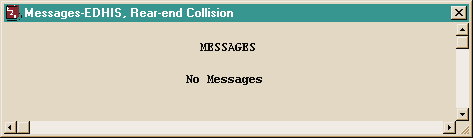
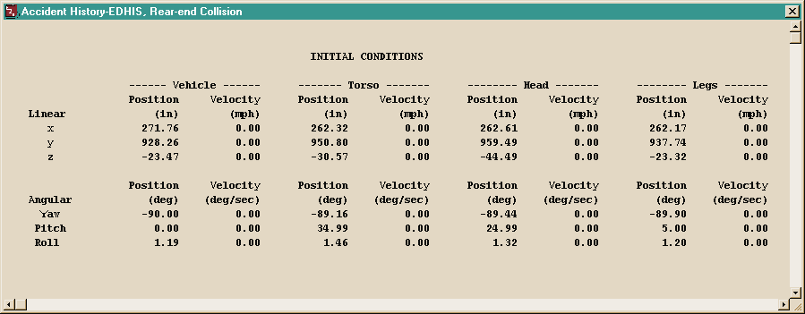
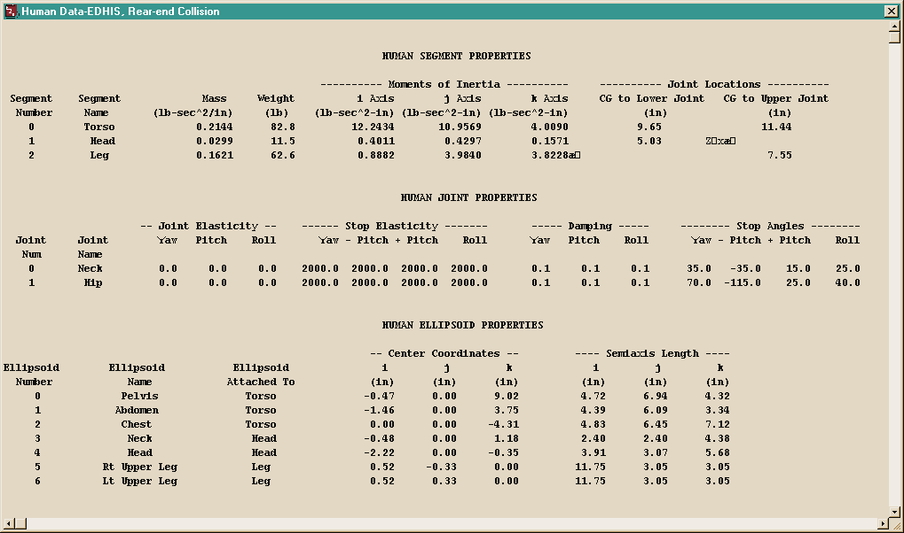
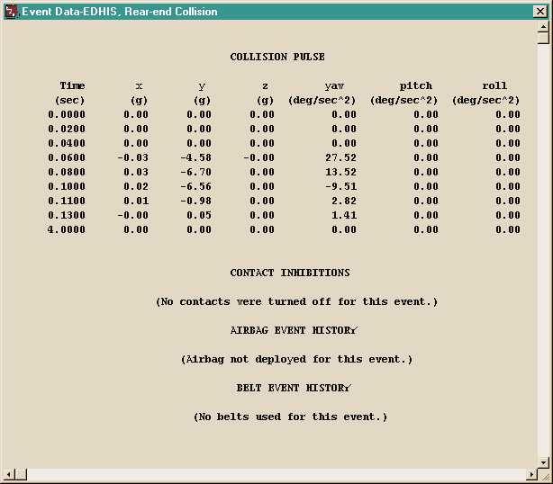
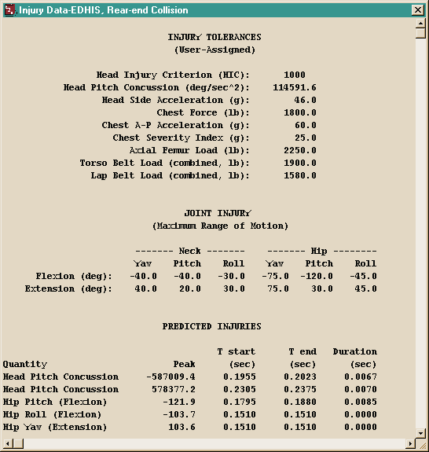
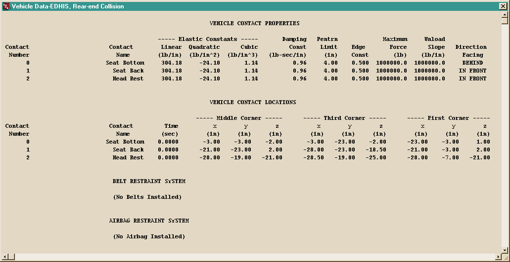
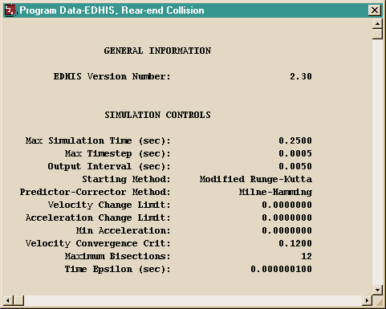
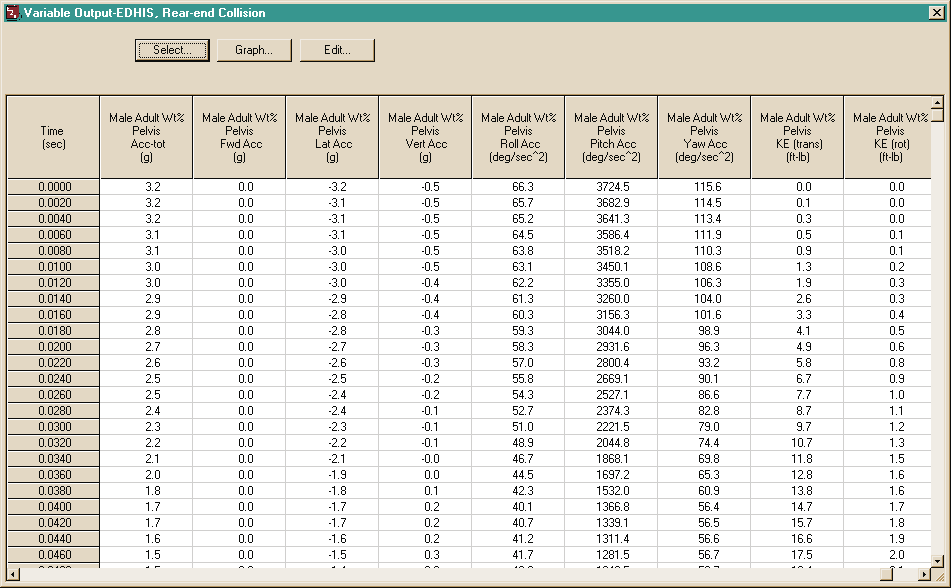
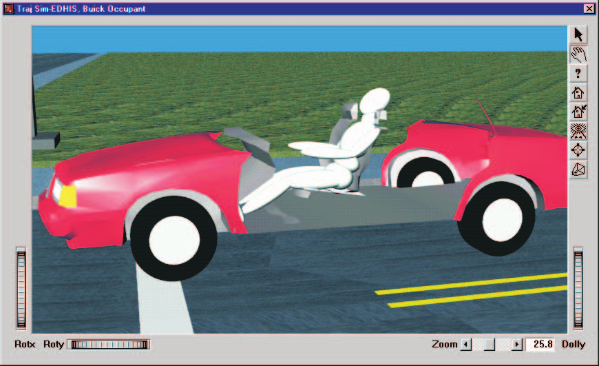
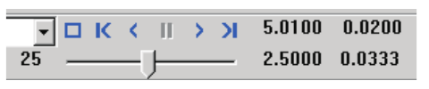

# Chapter 3 — EDHIS Program Output

This chapter defines the outputs available from an EDHIS event. The reports produced by EDHIS are available in the HVE Playback Editor.

## Overview

EDHIS produces four types of output reports:

- **Alpha-Numeric Reports** — Reports containing text and numeric information, such as vehicle dimensional parameters
- **Graphic Reports** — Reports containing static, visual data, such as vehicle damage profiles
- **Variable Output Tables** — Reports containing tabular simulation results as a function of time
- **Trajectory Simulations** — Viewers containing dynamic, 3-D visual simulations

> **NOTE:** Each of these reports may be printed on the system printer. To print a report, click on the menu bar of the desired output report (the menu bar will change colors indicating that it is selected), then either choose Print from HVE's Files menu or click on the Print icon in the toolbar. Refer to the HVE User's Manual for further details.

To view any of these reports, perform the following steps:

1. Choose Playback Mode. The Playback Editor is displayed.
2. Choose *Add New Object*. The Report Window Information dialog is displayed, showing a list of all the current events in the case.
3. Select an EDHIS event from the list. Once an event is selected, the Selected Output option list is displayed, containing all the available reports for the selected event.
4. Choose the desired report from the Selected Output list.
5. Enter a Report Window Name. A default name is supplied for the selected report window. The name is user-editable, and does not affect calculations.

   > **NOTE:** Duplicate Report Window names are not allowed. Because HVE truncates the name to 30 characters, you should ensure that two truncated names are not the same.

6. Click *OK* to display the report.

## Alpha-Numeric Reports

EDHIS produces the following alpha-numeric reports:

- **Messages** — A list of messages produced by the current run
- **Accident History** — A table of initial and final positions and velocities
- **Event Data** — A series of tables of the collision pulse, contact inhibition, airbag and belt data
- **Human Data** — A series of tables containing the human data used by EDHIS
- **Injury Data** — A table containing the injury tolerances, followed by a table containing values exceeding the allowable tolerances during the current run
- **Vehicle Data** — A series of tables containing the vehicle data used by EDHIS
- **Program Data** — A table containing program control information for the current run

An example of each of these numeric output reports from EDHIS is shown below.

### Messages

A typical Messages Report simply lists any messages produced by the run (often "No Messages"). For a complete listing of messages issued by EDHIS, see [Chapter 6](06-messages.md).

*Figure 3-1: Typical Messages Report issued by EDHIS.*

### Accident History

The Accident History Report displays a table of initial and final positions and velocities for the human and vehicle. The table includes linear position (x, y, z, in) and velocity (mph) columns and angular position (deg: yaw, pitch, roll) and velocity (deg/sec) rows for the Vehicle and for the human Torso, Head and Legs segments.

*Figure 3-2: Typical Accident History Report issued by EDHIS.*

### Human Data

The Human Data Report includes the following information:

- **Segment Properties** — Inertial properties and joint locations for the Head, Torso and Leg segments.
- **Joint Properties** — Elastic, damping and stop angles for the Neck and Hip joints
- **Ellipsoid Properties** — Name, Segment, center coordinates and semi-axis lengths for each human ellipsoid

*Figure 3-3: Typical Human Data Report issued by EDHIS.*

### Event Data

- **Collision Pulse** — Linear and angular acceleration pulse applied to the vehicle.
- **Contact Inhibitions** — Ellipsoid-to-Contact Surface contacts that are inhibited during the event.
- **Airbag Event History** — Airbag inflation, contact, and collapse parameters and steering column collapse parameters
- **Belt Event History** — Belt attachment points, slack, and contacts

*Figure 3-4: Typical Event Data Report issued by EDHIS.*

### Injury Data

The Injury Data Report includes the following information:

- **User-assigned Injury Tolerances** — Human tolerances to impact injury.
- **User-assigned Joint Range** — Human range of normal motion for the Neck and Hip joints
- **Predicted Injuries** — Table of injury tolerances that were exceeded, the maximum value achieved, and the time interval during which the value exceeded the tolerance.

The tolerances listed include Head Injury Criterion (HIC), Head Pitch Concussion (deg/sec²), Head Side Acceleration (g), Chest Force (lb), Chest A-P Acceleration (g), Chest Severity Index, Axial Femur Load (lb), Torso Belt Load (combined, lb) and Lap Belt Load (combined, lb). *(updated: in the current human model the torso and lap belt tolerances are stored separately for the left and right belt sections — see `HumanTolerance` in `Physics/Include/HUMAN.H` — rather than as single combined values as shown in the original report figure.)* The Joint Injury table lists maximum range of motion (flexion and extension, in degrees) for yaw, pitch and roll of the Neck and Hip joints. The Predicted Injuries table lists each exceeded quantity, its peak value, and the start time, end time and duration of the interval during which the tolerance was exceeded.

*Figure 3-5: Typical Injury Data Report issued by EDHIS.*

### Vehicle Data

The Vehicle Data Report includes the following information:

- **Contact Surface Properties** — Name, elastic and damping properties, penetration limit, edge constant, maximum force, unloading slope and relative initial position of the human with respect to the contact surface.
- **Contact Surface Location** — Name and corner coordinates for each contact surface.
- **Belt Restraints** — If in use, this section displays the name, location and mechanical properties for each installed belt segment. In addition, this section also displays the human attachment point and initial belt slack.
- **Airbag Restraints** — If in use, this section displays the location, mechanical and thermodynamic properties of the airbag, as well as its deployment time and fill duration.

*Figure 3-6: Typical Vehicle Data Report issued by EDHIS.*

### Program Data

The Program Data Report includes the following information:

- **Simulation Controls** — Integration parameters used for the current event
- **Collision Pulse** — The acceleration vs time history for the current event.
- **Contacts** — A list of all human ellipsoid vs vehicle contact surface interactions that were ignored for the current event.

The General Information section reports the EDHIS Version Number. The Simulation Controls section reports Max Simulation Time, Max Timestep, Output Interval, Starting Method, Predictor-Corrector Method, Velocity Change Limit, Acceleration Change Limit, Min Acceleration, Velocity Convergence Criterion, Maximum Bisections and Time Epsilon.

*Figure 3-7: Typical Program Data Report issued by EDHIS.*

## Graphic Reports

EDHIS produces no Graphic Output Reports.

> **NOTE:** Graphs of simulation results vs time may be produced using the Variable Output window (see next section).

## Variable Output Table

EDHIS produces a Variable Output table containing the time-based simulation results. The Variable Output groups produced by EDHIS are as follows:

### Human Output Groups

- **Human Kinematics** — Position, velocity, acceleration and kinetic energy for each human segment
- **Joints** — Articulation angles and torque for the Neck and Hip joints
- **Contacts** — Contact force, deflection and x,y contact coordinate for each human ellipsoid vs vehicle contact impingement
- **Belts** — Belt tension and stretch for each belt segment
- **Airbag** — Airbag pressure, radius, contact force and deflection

### Vehicle Output Groups

- **Vehicle Kinematics** — Position, velocity and acceleration for the vehicle
- **Wheel** — The position of each wheel (required only to visualize the wheels during an event; not used in the calculations)
- **Contacts** — Contact force, deflection and x,y contact coordinate for each human ellipsoid vs vehicle contact impingement
- **Belts** — Belt tension and stretch for each belt segment
- **Airbag** — Airbag pressure, radius, contact force and deflection

> **NOTE:** The Contacts, Belts and Airbag results for Human and Vehicle output groups are identical (Newton's 3rd law at work!)

*Figure 3-8: Variable Output dialog.*

A detailed listing of each Variable Output parameter produced by EDHIS is found in Tables 3-1 and 3-2.

**Table 3-1 — Human Variable Output Data**

| Parameter | Description |
|---|---|
| Human Kinematic Data (for Hip, Head and Leg segments) | x, y, z coordinates; $\phi, \theta, \psi$ angles; total velocity, fwd, side, vert components; $\dot\phi, \dot\theta, \dot\psi$ angular velocities; total acceleration, fwd, side, vert components; $\ddot\phi, \ddot\theta, \ddot\psi$ angular accelerations (see note below) |
| Joint Data (for Neck and Hip joints) | $\phi, \theta, \psi$ joint articulation angles; $\phi, \theta, \psi$ joint elastic moments |
| Contact Data (for each human ellipsoid and vehicle contact surface) | Contact surface x,y contact coordinate; Contact Normal Force; Contact deflection |
| Belts (for each belt section) | Belt tension and stretch |
| Airbag | Airbag pressure, radius; Airbag contact force, deflection |

> **NOTE:** For human occupants, the human segment kinematics are defined relative to the vehicle-fixed coordinate system; for human pedestrians, the segment kinematics are defined relative to the earth-fixed coordinate system.

**Table 3-2 — Vehicle Variable Output Data**

| Parameter | Description |
|---|---|
| Vehicle Kinematic Data | X, Y, Z position of CG; $\Phi, \Theta, \Psi$ orientation; total linear velocity, u, v, w components; sideslip, course angles; p, q, r angular velocity; total linear accel, fwd, side, vert components; $\dot u, \dot v, \dot w$ linear components; $\dot p, \dot q, \dot r$ angular components |
| Wheel Data | x, y, z location of each wheel |
| Contact Data (for each human ellipsoid and vehicle contact surface) | Contact surface x,y contact coordinate; Contact Normal Force; Contact deflection |
| Belts (for each belt section) | Belt tension and stretch |
| Airbag | Airbag pressure, radius; Airbag contact force, deflection |

## Trajectory Simulations

EDHIS produces a trajectory simulation of the current event. The trajectory simulation is a 3-D visualization of the data displayed in the Variable Output table (see previous section).

*Figure 3-9: EDHIS Trajectory simulation.*

### Displaying a Trajectory Simulation

The Trajectory Simulation is controlled using the Playback Controller.

*Figure 3-10: Playback Controller.*

The Playback Controller's buttons have the following functions:

- **Reset** — Returns to the start of the simulation and reinitialize the video output device (this applies a hardware reset and is otherwise the same as the *Rewind to Start* button, below).
- **Rewind to Start** — Return to the start of the simulation
- **Reverse** — Play the simulation backwards
- **Pause** — Pause the simulation
- **Play** — Execute the event or play the simulation forwards
- **Advance to End** — Advance to the end of the simulation

> **NOTE:** The Playback Controller also includes additional features used for creating video. Refer to the HVE User's Manual, Playback Editor and Video Output sections, for further details.

---
*Previous: [Chapter 2 — Program Input](02-program-input.md) | Next: [Chapter 4 — Calculation Method](04-calculation-method.md)*

<!-- NAV -->

---

← Previous: [Chapter 2 — EDHIS Program Input](02-program-input.md)  |  [Index](README.md)  |  Next: [Chapter 4 — Calculation Method](04-calculation-method.md) →

<!-- /NAV -->
